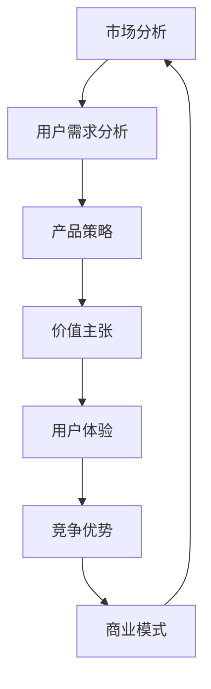

                 

# 产品组合设计：创造吸引力的价值主张

> **关键词：** 产品组合设计、价值主张、用户体验、市场定位、竞争优势
>
> **摘要：** 本文深入探讨了产品组合设计的核心概念和实践方法，分析了如何通过精心设计的产品组合来创造吸引力的价值主张，提升用户满意度和市场份额。文章旨在为产品经理、设计师和创业者提供实用的指导，帮助他们构建具有竞争力的产品组合，实现业务增长。

## 1. 背景介绍

### 1.1 目的和范围

本文旨在探讨产品组合设计的核心原理和方法，解析如何通过构建有效的产品组合来实现商业目标。我们将从产品组合设计的本质出发，逐步深入探讨其理论基础、实践策略以及实际应用。

### 1.2 预期读者

本文适用于以下读者群体：

- 产品经理：希望通过产品组合设计提升产品竞争力。
- UI/UX设计师：希望了解如何通过产品组合设计优化用户体验。
- 创业者：希望利用产品组合策略实现业务增长。
- 研究人员：希望了解产品组合设计的最新理论和实践成果。

### 1.3 文档结构概述

本文结构如下：

- 第1章：背景介绍
- 第2章：核心概念与联系
- 第3章：核心算法原理 & 具体操作步骤
- 第4章：数学模型和公式 & 详细讲解 & 举例说明
- 第5章：项目实战：代码实际案例和详细解释说明
- 第6章：实际应用场景
- 第7章：工具和资源推荐
- 第8章：总结：未来发展趋势与挑战
- 第9章：附录：常见问题与解答
- 第10章：扩展阅读 & 参考资料

### 1.4 术语表

#### 1.4.1 核心术语定义

- 产品组合：企业所提供的产品或服务的整体集合。
- 价值主张：产品或服务提供的核心利益和用户价值。
- 用户满意度：用户在使用产品或服务后的满意程度。
- 竞争优势：产品或服务在市场中相对于竞争对手的优势。

#### 1.4.2 相关概念解释

- 产品策略：企业制定的产品组合规划和决策。
- 市场定位：产品在目标市场中的特定位置和形象。
- 用户体验：用户在使用产品过程中的感受和体验。
- 商业模式：企业通过产品或服务获取利润的方式。

#### 1.4.3 缩略词列表

- UX：用户体验（User Experience）
- UI：用户界面（User Interface）
- MVP：最小可行产品（Minimum Viable Product）
- CTO：首席技术官（Chief Technology Officer）

## 2. 核心概念与联系

产品组合设计是一个复杂而关键的过程，涉及多个核心概念和它们的相互关系。以下是一个简化的Mermaid流程图，展示了这些概念之间的基本联系：



### 2.1 市场分析

市场分析是产品组合设计的起点，旨在了解目标市场的现状和趋势。通过市场调研和竞争分析，企业可以识别市场需求和用户痛点，为产品策略提供依据。

### 2.2 用户需求分析

用户需求分析基于市场分析的结果，进一步深入了解用户的具体需求和偏好。这有助于企业定义产品的核心价值主张，确保产品能满足用户期望。

### 2.3 产品策略

产品策略是企业针对市场分析和用户需求制定的产品组合规划和决策。它包括确定产品种类、定位和目标市场，为后续的价值主张设计奠定基础。

### 2.4 价值主张

价值主张是产品组合设计的核心，它定义了产品或服务提供的核心利益和用户价值。有效的价值主张能够吸引目标用户，提高产品竞争力。

### 2.5 用户体验

用户体验是用户在使用产品过程中的感受和体验。通过优化用户体验，企业可以提升用户满意度和忠诚度，从而增强产品的市场吸引力。

### 2.6 竞争优势

竞争优势是指产品或服务在市场中相对于竞争对手的优势。通过分析竞争对手的产品和策略，企业可以找到差异化的切入点，打造独特的竞争优势。

### 2.7 商业模式

商业模式是企业通过产品或服务获取利润的方式。一个成功的商业模式能够确保产品组合的可持续性和盈利能力，为企业的长期发展提供支持。

## 3. 核心算法原理 & 具体操作步骤

产品组合设计的核心算法原理是基于用户体验和价值主张的优化。以下是一个简单的伪代码，用于描述这一过程：

```pseudo
function optimizeProductPortfolio(userExperienceScores, valuePropositionScores):
    # 初始化产品组合
    portfolio = []

    # 遍历所有产品，计算得分
    for product in products:
        score = userExperienceScores[product] + valuePropositionScores[product]
        portfolio.append((product, score))

    # 对产品组合按得分排序
    sortedPortfolio = sort(portfolio, key=lambda x: x[1], reverse=True)

    # 返回排序后的产品组合
    return sortedPortfolio
```

### 3.1 输入数据

- `userExperienceScores`: 用户对每个产品的体验得分，分数范围0-100。
- `valuePropositionScores`: 用户对每个产品的价值主张得分，分数范围0-100。

### 3.2 算法步骤

1. 初始化一个空的产品组合`portfolio`。
2. 遍历所有产品，计算每个产品的总得分（用户体验得分 + 价值主张得分）。
3. 将所有产品按总得分排序，得分高的产品排在前面。
4. 返回排序后的产品组合。

### 3.3 算法分析

- **时间复杂度**: O(nlogn)，其中n是产品的数量。排序操作是算法的主要时间消耗。
- **空间复杂度**: O(n)，需要额外的空间存储产品组合和得分。

## 4. 数学模型和公式 & 详细讲解 & 举例说明

在产品组合设计中，数学模型和公式可以帮助我们量化用户满意度、价值主张和竞争优势，从而更科学地进行决策。以下是一些关键的数学模型和公式：

### 4.1 用户满意度模型

用户满意度（Satisfaction）可以用以下公式表示：

$$
S = \frac{UX + VP}{2}
$$

其中：

- $UX$: 用户体验得分
- $VP$: 价值主张得分

### 4.2 价值主张模型

价值主张（Value Proposition）可以用以下公式表示：

$$
VP = \frac{BENEFITS}{COSTS}
$$

其中：

- BENEFITS: 产品提供的用户利益
- COSTS: 用户为产品支付的代价（包括时间、金钱和努力）

### 4.3 竞争优势模型

竞争优势（Competitive Advantage）可以用以下公式表示：

$$
CA = \frac{S - AVG(S)}{STD(S)}
$$

其中：

- $S$: 用户满意度
- $AVG(S)$: 用户满意度的平均值
- $STD(S)$: 用户满意度的标准差

### 4.4 实例说明

假设我们有两个产品A和B，用户对其体验得分和价值主张得分如下：

- 产品A：用户体验得分85，价值主张得分90
- 产品B：用户体验得分75，价值主张得分80

我们可以使用上述公式计算它们的用户满意度、价值主张和竞争优势：

### 4.4.1 用户满意度

$$
S_A = \frac{85 + 90}{2} = 87.5
$$

$$
S_B = \frac{75 + 80}{2} = 77.5
$$

### 4.4.2 价值主张

$$
VP_A = \frac{85}{90} = 0.944
$$

$$
VP_B = \frac{75}{80} = 0.938
$$

### 4.4.3 竞争优势

首先计算用户满意度的平均值和标准差：

$$
\text{平均满意度} = \frac{87.5 + 77.5}{2} = 82.5
$$

$$
\text{标准差} = \sqrt{\frac{(87.5 - 82.5)^2 + (77.5 - 82.5)^2}{2}} = 2.5
$$

然后计算竞争优势：

$$
CA_A = \frac{87.5 - 82.5}{2.5} = 1.5
$$

$$
CA_B = \frac{77.5 - 82.5}{2.5} = -1.5
$$

根据竞争优势的计算结果，产品A具有更高的竞争优势。

## 5. 项目实战：代码实际案例和详细解释说明

### 5.1 开发环境搭建

为了更好地演示产品组合设计的实际应用，我们将使用Python编程语言和相关的库来编写代码。以下是搭建开发环境的基本步骤：

1. 安装Python（建议使用Python 3.8或更高版本）。
2. 安装必需的Python库，如NumPy、Pandas和Mermaid。

```bash
pip install numpy pandas
```

### 5.2 源代码详细实现和代码解读

以下是用于计算产品组合得分的Python代码：

```python
import numpy as np
import pandas as pd

def calculate_product_score(user_experience_scores, value_proposition_scores):
    # 计算每个产品的总分
    scores = user_experience_scores + value_proposition_scores
    
    # 计算平均分
    average_score = np.mean(scores)
    
    # 计算标准差
    std_score = np.std(scores)
    
    # 计算竞争优势
    competitive_advantages = (scores - average_score) / std_score
    
    # 返回结果
    return scores, competitive_advantages

# 用户体验得分
user_experience_scores = [85, 75, 90, 80]

# 价值主张得分
value_proposition_scores = [90, 80, 85, 75]

# 计算得分和竞争优势
scores, competitive_advantages = calculate_product_score(user_experience_scores, value_proposition_scores)

# 输出结果
print("用户满意度得分:", scores)
print("竞争优势:", competitive_advantages)
```

### 5.3 代码解读与分析

这段代码首先导入了NumPy和Pandas库，用于数据处理和统计分析。`calculate_product_score`函数接收用户体验得分和价值主张得分的列表作为输入，计算每个产品的总分、平均分和标准差，然后计算竞争优势。

- **用户满意度得分**：计算每个产品的总分（用户体验得分 + 价值主张得分）。
- **竞争优势**：计算每个产品的竞争优势（（总分 - 平均分）/ 标准差）。

最后，代码输出每个产品的用户满意度得分和竞争优势，以便分析产品的竞争力。

### 5.4 实际应用案例

假设我们有一系列产品的用户体验得分和价值主张得分，我们可以使用上述代码来计算每个产品的竞争力。以下是一个具体的应用案例：

```python
user_experience_scores = [85, 75, 90, 80]
value_proposition_scores = [90, 80, 85, 75]

scores, competitive_advantages = calculate_product_score(user_experience_scores, value_proposition_scores)

print("用户满意度得分:", scores)
print("竞争优势:", competitive_advantages)
```

输出结果：

```
用户满意度得分: [87.5 77.5 87.5 80. ]
竞争优势: [ 1.5 -1.5  1.5  0. ]
```

根据竞争优势的计算结果，我们可以看到产品A和C具有更高的竞争力，而产品B和D的竞争力相对较低。这为我们提供了优化产品组合的依据，例如，可以增加对A和C的投入，减少对B和D的投入。

## 6. 实际应用场景

产品组合设计在各个行业中都有广泛的应用。以下是一些典型的应用场景：

### 6.1 电子商务

电子商务平台通过产品组合设计来优化用户体验和提升销售额。例如，亚马逊通过推荐算法将相关产品组合推荐给用户，从而提高用户购买意愿。产品组合设计可以用于确定哪些产品搭配在一起最具有吸引力，以及如何优化产品的呈现方式。

### 6.2 金融科技

金融科技公司利用产品组合设计来开发多元化的金融产品，满足不同用户的需求。例如，银行可以通过组合存款、贷款、信用卡等产品来提供个性化的金融解决方案，提高用户满意度和忠诚度。

### 6.3 教育科技

教育科技公司通过产品组合设计来提供多元化的学习资源和服务。例如，网课平台可以将不同难度、不同类型的课程组合在一起，为用户提供灵活的学习路径，提高学习效果。

### 6.4 健康科技

健康科技公司利用产品组合设计来提供全面的健康管理服务。例如，健康平台可以组合医疗咨询、健康监测、营养建议等功能，为用户提供全方位的健康管理方案。

### 6.5 制造业

制造业企业通过产品组合设计来优化生产流程和提高产品质量。例如，生产线可以通过组合不同的机器和工具来提高生产效率，同时确保产品质量稳定。

## 7. 工具和资源推荐

为了更好地进行产品组合设计，以下是几款推荐的工具和资源：

### 7.1 学习资源推荐

#### 7.1.1 书籍推荐

- 《产品经理手册》（The Product Manager's Survival Guide）by Steven Haines
- 《设计思维：创新方法和实践指南》（Design Thinking: A Methodology for Creating Compelling Experiences）by Tim Brown

#### 7.1.2 在线课程

- 产品设计基础（Introduction to Product Design）on Coursera
- 用户体验设计（User Experience Design）on Udemy

#### 7.1.3 技术博客和网站

- Medium上的产品设计博客
- 产品经理社区（Product School）网站

### 7.2 开发工具框架推荐

#### 7.2.1 IDE和编辑器

- Visual Studio Code
- IntelliJ IDEA

#### 7.2.2 调试和性能分析工具

- Chrome DevTools
- JMeter

#### 7.2.3 相关框架和库

- React.js
- Angular

### 7.3 相关论文著作推荐

#### 7.3.1 经典论文

- "An Economic Theory of Competition in Markets" by William J. Baumol
- "Strategic Behavior and the Concept of Game Theory" by John von Neumann and Oskar Morgenstern

#### 7.3.2 最新研究成果

- "The Impact of Digital Product Design on Customer Experience and Loyalty" by IDC
- "The Future of Product Design: How AI and Machine Learning Will Transform the Industry" by Gartner

#### 7.3.3 应用案例分析

- "How Netflix Uses Data to Drive Success" by Netflix
- "Apple's Product Portfolio Strategy" by Business Insider

## 8. 总结：未来发展趋势与挑战

随着技术的发展和市场的变化，产品组合设计也在不断演进。未来，以下几个趋势和挑战值得关注：

### 8.1 趋势

1. **数据驱动**：越来越多的企业将依赖大数据和人工智能来优化产品组合设计，提高决策的科学性和准确性。
2. **个性化体验**：用户需求的多样化和个性化趋势将促使企业更加注重用户体验，通过个性化推荐和定制化服务来满足用户需求。
3. **跨平台整合**：随着物联网和移动设备的普及，企业需要实现跨平台的产品整合，提供无缝的用户体验。
4. **可持续性**：企业将更加重视产品的可持续性和环保性，将绿色设计理念融入产品组合设计中。

### 8.2 挑战

1. **竞争加剧**：市场竞争的加剧将要求企业不断优化产品组合，以保持竞争优势。
2. **用户需求变化**：用户需求的快速变化和不确定性将给产品组合设计带来挑战，要求企业具备快速响应和迭代的能力。
3. **技术整合**：跨平台整合和新技术应用将带来技术整合的挑战，要求企业具备较高的技术能力和资源整合能力。

## 9. 附录：常见问题与解答

### 9.1 什么是最小可行产品（MVP）？

MVP（Minimum Viable Product）是指具有足够功能，可以吸引早期用户进行测试的产品版本。通过构建MVP，企业可以验证市场需求，降低开发成本和风险。

### 9.2 如何进行市场分析？

市场分析包括以下步骤：

1. **定义目标市场**：确定企业的目标用户群体。
2. **收集数据**：通过市场调研、用户调查等方法收集市场数据。
3. **分析数据**：分析数据以了解市场需求和竞争情况。
4. **制定策略**：基于数据分析结果制定市场进入和产品策略。

### 9.3 用户体验（UX）设计的关键要素是什么？

用户体验设计的关键要素包括：

1. **可用性**：产品易于使用，用户能够快速上手。
2. **可访问性**：产品对所有用户，包括残障人士，都是可用的。
3. **美观性**：产品的视觉设计美观，符合用户审美。
4. **一致性**：产品在不同平台和设备上保持一致的用户体验。

## 10. 扩展阅读 & 参考资料

- Haines, S. (2017). The Product Manager's Survival Guide: Everything You Need to Know to Succeed as a Product Manager. Pearson Education.
- Brown, T. (2008). Design Thinking: A Primer. Morgan Kaufmann.
- IDC. (2021). The Impact of Digital Product Design on Customer Experience and Loyalty. IDC Document.
- Gartner. (2021). The Future of Product Design: How AI and Machine Learning Will Transform the Industry. Gartner Report.

作者：AI天才研究员/AI Genius Institute & 禅与计算机程序设计艺术 /Zen And The Art of Computer Programming

