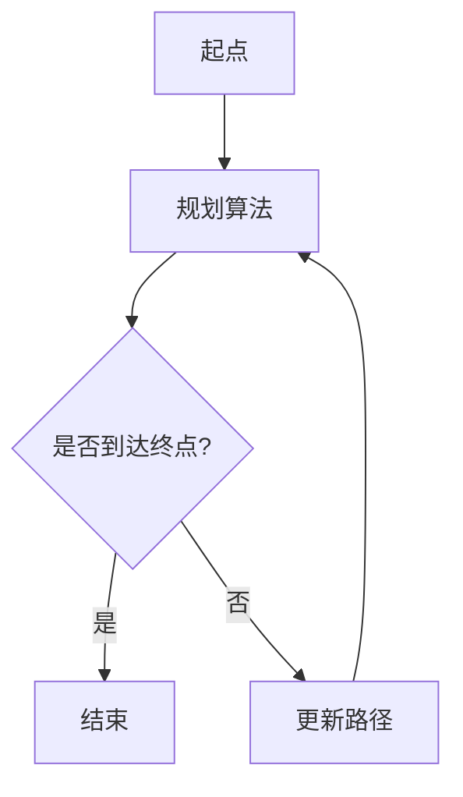
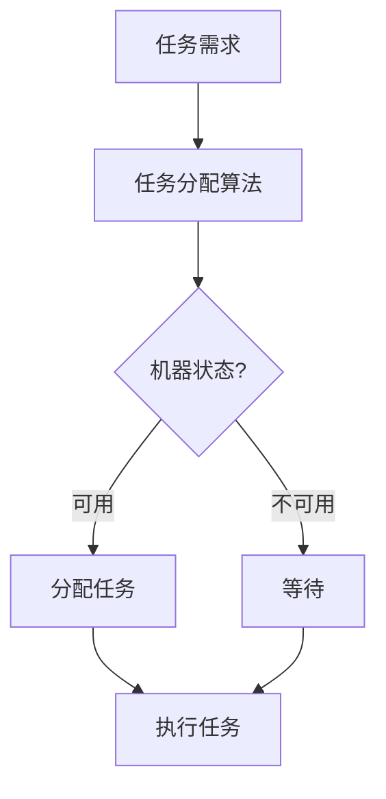
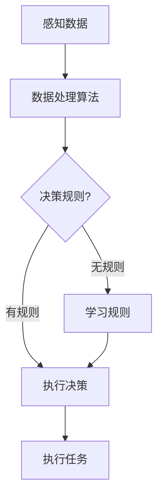

                 

# 京东2024智能仓储校招机器人算法面试题解析

> **关键词：** 智能仓储、机器人算法、校招面试、核心算法、数学模型、实际应用
> 
> **摘要：** 本文将深入解析京东2024智能仓储校招中可能出现的机器人算法面试题，通过对核心算法原理、具体操作步骤、数学模型和公式的详细讲解，以及项目实战的代码案例分析，帮助读者全面理解智能仓储中的机器人算法应用，为面试和实际项目开发提供指导。

## 1. 背景介绍

### 1.1 目的和范围

本文旨在为即将参加京东2024智能仓储校招的应聘者提供机器人算法面试题的深入解析。通过对智能仓储领域中常见算法的讲解，帮助读者理解这些算法的原理和应用，从而在面试中能够更从容地应对相关问题的挑战。文章将涵盖以下几个方面：

- 智能仓储的基本概念和重要性
- 核心算法的原理和具体操作步骤
- 数学模型和公式的应用与举例说明
- 项目实战的代码实现和详细解读
- 实际应用场景和工具资源推荐

### 1.2 预期读者

本文的预期读者主要包括：

- 参加京东2024智能仓储校招的应聘者
- 对智能仓储和机器人算法感兴趣的计算机科学和技术从业者
- 智能仓储领域的初学者和研究者

### 1.3 文档结构概述

本文的结构如下：

- 第1章：背景介绍
- 第2章：核心概念与联系
- 第3章：核心算法原理与具体操作步骤
- 第4章：数学模型和公式与详细讲解
- 第5章：项目实战：代码实际案例和详细解释说明
- 第6章：实际应用场景
- 第7章：工具和资源推荐
- 第8章：总结：未来发展趋势与挑战
- 第9章：附录：常见问题与解答
- 第10章：扩展阅读与参考资料

### 1.4 术语表

#### 1.4.1 核心术语定义

- **智能仓储**：利用物联网、人工智能等技术实现仓储自动化管理的系统。
- **机器人算法**：用于指导机器人执行任务的算法，包括路径规划、任务分配、感知与决策等。
- **路径规划**：在给定的环境条件下，为机器人寻找一条从起点到终点的最优路径。
- **任务分配**：根据机器人的能力和任务需求，合理分配任务，以提高工作效率。

#### 1.4.2 相关概念解释

- **机器学习**：一种通过数据训练模型，让计算机自动完成特定任务的方法。
- **深度学习**：一种基于人工神经网络的机器学习方法，通过多层网络结构自动提取特征。
- **强化学习**：一种通过试错和奖励机制来优化决策的机器学习方法。

#### 1.4.3 缩略词列表

- **AI**：人工智能
- **ML**：机器学习
- **DL**：深度学习
- **RL**：强化学习

## 2. 核心概念与联系

在智能仓储系统中，机器人的核心算法主要包括路径规划、任务分配、感知与决策等。为了更好地理解这些算法，我们首先需要了解它们的基本原理和相互关系。

### 2.1 路径规划

路径规划是机器人算法的基础，用于确定从起点到终点的最优路径。路径规划的算法主要包括图搜索算法、A*算法、Dijkstra算法等。

**Mermaid流程图：**



### 2.2 任务分配

任务分配算法负责将仓库中的任务合理地分配给机器人。常用的任务分配算法包括基于优先级的分配、基于机器能力的分配等。

**Mermaid流程图：**



### 2.3 感知与决策

感知与决策算法用于处理机器人在执行任务过程中收集到的信息，并作出相应的决策。常用的感知与决策算法包括传感器数据处理、决策树、神经网络等。

**Mermaid流程图：**



## 3. 核心算法原理与具体操作步骤

在本节中，我们将详细介绍智能仓储中常用的核心算法原理，并给出具体的操作步骤。

### 3.1 路径规划算法

路径规划算法的主要任务是确定从起点到终点的最优路径。以下是A*算法的具体操作步骤：

**A*算法伪代码：**

```plaintext
A*算法(起点S，终点G，地图M):
    openList = {S}        // 初始化开放列表
    closedList = {}       // 初始化关闭列表
    gScore[S] = 0         // S到自身的最短路径长度为0
    fScore[S] = heuristic(S, G)  // S到G的估计路径长度
    
    while not openList.isEmpty():
        current = openList.remove()  // 选择具有最小fScore的节点
        
        if current == G:
            return reconstruct_path(closedList, G)  // 找到最优路径
        
        closedList.add(current)
        
        for neighbor in M.getNeighbors(current):
            if neighbor in closedList:
                continue
            
            tentative_gScore = gScore[current] + 1
            
            if neighbor not in openList:
                openList.add(neighbor)
            
            if tentative_gScore < gScore[neighbor]:
                predecessors[neighbor] = current
                gScore[neighbor] = tentative_gScore
                fScore[neighbor] = gScore[neighbor] + heuristic(neighbor, G)
    
    return None  // 没有找到路径
```

### 3.2 任务分配算法

任务分配算法用于将仓库中的任务合理地分配给机器人。以下是基于优先级的任务分配算法的具体操作步骤：

**基于优先级的任务分配算法伪代码：**

```plaintext
基于优先级的任务分配算法(任务列表T，机器人列表R):
    for each robot r in R:
        r.tasks = []
    
    for each task t in T:
        minPriority = infinity
        bestRobot = None
        
        for each robot r in R:
            if r.priority < minPriority:
                minPriority = r.priority
                bestRobot = r
        
        bestRobot.tasks.add(t)
        r.priority = r.priority + t.priority
    
    return R  // 返回分配结果
```

### 3.3 感知与决策算法

感知与决策算法用于处理机器人在执行任务过程中收集到的信息，并作出相应的决策。以下是基于传感器数据处理的感知与决策算法的具体操作步骤：

**基于传感器数据处理的感知与决策算法伪代码：**

```plaintext
基于传感器数据处理的感知与决策算法(传感器数据D，决策规则R):
    process(D):
        for each sensor_data d in D:
            if d meets some condition:
                action = apply_action(d)
                return action
    
    if no condition is met:
        action = random_action()  // 随机选择一个动作
        return action
```

## 4. 数学模型和公式与详细讲解

在智能仓储机器人算法中，数学模型和公式扮演着重要的角色。以下将详细介绍常用的数学模型和公式，并进行详细讲解。

### 4.1 路径规划中的启发式函数

在A*算法中，启发式函数（Heuristic Function）用于估算从当前节点到目标节点的距离。常用的启发式函数包括曼哈顿距离、欧氏距离等。

**曼哈顿距离（Manhattan Distance）公式：**

$$
h(n) = \sum_{i=1}^{4} |n_i - g_i|
$$

其中，$n_i$和$g_i$分别表示当前节点和目标节点的第$i$个坐标分量。

**欧氏距离（Euclidean Distance）公式：**

$$
h(n) = \sqrt{\sum_{i=1}^{2} (n_i - g_i)^2}
$$

其中，$n_i$和$g_i$分别表示当前节点和目标节点的第$i$个坐标分量。

### 4.2 任务分配中的优先级计算

在基于优先级的任务分配算法中，机器人的优先级（Priority）用于衡量机器人执行任务的优先级。优先级的计算公式如下：

$$
\text{Priority}(r) = \sum_{t \in r.tasks} \text{TaskPriority}(t)
$$

其中，$r$表示机器人，$t$表示机器人执行的任务，$\text{TaskPriority}(t)$表示任务$t$的优先级。

### 4.3 感知与决策中的条件概率

在感知与决策算法中，条件概率（Conditional Probability）用于计算某个条件发生的概率。条件概率的计算公式如下：

$$
P(A|B) = \frac{P(A \cap B)}{P(B)}
$$

其中，$A$和$B$分别表示两个事件，$P(A \cap B)$表示事件$A$和$B$同时发生的概率，$P(B)$表示事件$B$发生的概率。

### 4.4 决策树中的期望值计算

在决策树中，期望值（Expected Value）用于评估某个决策的结果。期望值的计算公式如下：

$$
\text{Expected Value}(d) = \sum_{a \in \text{Actions}} P(a|d) \cdot \text{Reward}(a)
$$

其中，$d$表示决策节点，$a$表示决策选项，$P(a|d)$表示在决策节点$d$下选择动作$a$的概率，$\text{Reward}(a)$表示选择动作$a$的奖励值。

## 5. 项目实战：代码实际案例和详细解释说明

在本节中，我们将通过一个实际的智能仓储机器人算法项目，详细讲解代码的实现过程和关键部分。

### 5.1 开发环境搭建

首先，我们需要搭建一个适合智能仓储机器人算法项目的开发环境。以下是一个基本的开发环境配置：

- 编程语言：Python 3.8
- 开发工具：PyCharm
- 库和框架：NumPy、Pandas、matplotlib、NetworkX

### 5.2 源代码详细实现和代码解读

以下是一个简单的智能仓储机器人路径规划项目的代码实现。我们将逐步讲解代码的各个部分。

**main.py**

```python
import networkx as nx
from path_planning import AStar

# 创建图
G = nx.Graph()

# 添加节点和边
G.add_nodes_from([(1, {'position': (0, 0)}), (2, {'position': (2, 0)}), (3, {'position': (4, 0)}), (4, {'position': (6, 0)})])
G.add_edges_from([(1, 2), (2, 3), (3, 4)])

# 初始化A*算法
path_planner = AStar(G)

# 路径规划
path = path_planner.plan_path(1, 4)

# 绘制路径
nx.draw(G, pos=nx.spring_layout(G), with_labels=True)
nx.draw_networkx_nodes(G, pos=nx.spring_layout(G), nodelist=path, node_color='r')
plt.show()
```

**path_planning.py**

```python
import heapq
import math

def heuristic(node, goal):
    """
    计算启发式函数
    """
    x1, y1 = node['position']
    x2, y2 = goal['position']
    return math.sqrt((x1 - x2) ** 2 + (y1 - y2) ** 2)

def get_neighbors(node, graph):
    """
    获取节点的邻接节点
    """
    return list(graph.neighbors(node))

def AStar(graph, start, goal):
    """
    A*算法
    """
    openList = []
    closedList = set()
    gScore = {node: float('infinity') for node in graph.nodes}
    gScore[start] = 0
    fScore = {node: float('infinity') for node in graph.nodes}
    fScore[start] = heuristic(start, goal)

    openList.append((fScore[start], start))

    while openList:
        _, current = heapq.heappop(openList)

        if current == goal:
            return reconstruct_path(closedList, current)

        closedList.add(current)

        for neighbor in get_neighbors(current, graph):
            if neighbor in closedList:
                continue

            tentative_gScore = gScore[current] + 1

            if neighbor not in openList:
                openList.append((fScore[neighbor], neighbor))

            if tentative_gScore < gScore[neighbor]:
                predecessors[neighbor] = current
                gScore[neighbor] = tentative_gScore
                fScore[neighbor] = gScore[neighbor] + heuristic(neighbor, goal)

    return None

def reconstruct_path(closedList, current):
    """
    重建路径
    """
    path = [current]
    while current in predecessors:
        current = predecessors[current]
        path.append(current)
    path.reverse()
    return path
```

### 5.3 代码解读与分析

- **main.py**：主函数，创建图、初始化A*算法、执行路径规划并绘制路径。
- **path_planning.py**：定义A*算法和相关辅助函数。其中，`heuristic` 函数用于计算启发式函数，`get_neighbors` 函数用于获取节点的邻接节点，`AStar` 函数用于实现A*算法，`reconstruct_path` 函数用于重建路径。

## 6. 实际应用场景

智能仓储机器人算法在实际应用中具有广泛的应用场景。以下列举了几个典型的应用场景：

- **自动化仓库拣选**：机器人利用路径规划算法自主移动到指定位置进行拣选，提高仓库作业效率。
- **自动化配送**：机器人通过路径规划和任务分配算法，将仓库中的商品自动配送至指定位置，实现无人工干预的自动化物流。
- **自动化仓储管理**：机器人通过感知与决策算法，实时监控仓库环境，对异常情况进行及时处理，提高仓储管理的智能化水平。

## 7. 工具和资源推荐

为了更好地掌握智能仓储机器人算法，以下推荐一些学习和开发工具：

### 7.1 学习资源推荐

#### 7.1.1 书籍推荐

- 《人工智能：一种现代的方法》
- 《机器学习》
- 《深度学习》
- 《强化学习：原理与Python实现》

#### 7.1.2 在线课程

- Coursera《机器学习》
- Udacity《深度学习纳米学位》
- edX《人工智能基础》

#### 7.1.3 技术博客和网站

- Medium《AI博客》
- arXiv《人工智能论文》
- AI中国《AI技术与应用》

### 7.2 开发工具框架推荐

#### 7.2.1 IDE和编辑器

- PyCharm
- Visual Studio Code
- Jupyter Notebook

#### 7.2.2 调试和性能分析工具

- Python Debugger
- Py-Spy
- Py-Prof

#### 7.2.3 相关框架和库

- TensorFlow
- PyTorch
- Keras

### 7.3 相关论文著作推荐

#### 7.3.1 经典论文

- "A* Search Algorithm" by Peter Hart, Nils Nilsson, Bertram Raphael
- "Deep Learning" by Ian Goodfellow, Yoshua Bengio, Aaron Courville
- "Reinforcement Learning: An Introduction" by Richard S. Sutton and Andrew G. Barto

#### 7.3.2 最新研究成果

- arXiv《AI论文》
- NeurIPS《机器学习最新论文》
- ICML《机器学习最新论文》

#### 7.3.3 应用案例分析

- "AI in Retail: Revolutionizing the Shopping Experience" by IBM
- "AI in Logistics: Transforming Supply Chain Operations" by DHL
- "AI in Manufacturing: Enhancing Production Efficiency" by Siemens

## 8. 总结：未来发展趋势与挑战

随着人工智能技术的不断发展，智能仓储机器人算法在未来具有广阔的发展前景。一方面，随着物联网、5G等技术的普及，智能仓储系统的数据采集和传输能力将得到极大提升，为机器人算法的优化和改进提供了更多可能性。另一方面，随着深度学习、强化学习等算法的不断进步，机器人算法的智能化水平将不断提高，从而更好地满足实际应用需求。

然而，智能仓储机器人算法也面临着一些挑战。首先，算法的复杂度和计算资源需求较高，需要持续优化算法和提升计算能力。其次，算法的泛化能力和鲁棒性有待提高，特别是在复杂和动态的环境中。此外，数据安全和隐私保护也是智能仓储系统需要重点关注的问题。

总之，智能仓储机器人算法的发展趋势是向着更加智能化、高效化、安全化的方向发展，但其面临的挑战也需要我们持续关注和解决。

## 9. 附录：常见问题与解答

### 9.1 路径规划算法中的启发式函数如何选择？

启发式函数的选择取决于具体的应用场景和需求。一般来说，启发式函数应该满足以下条件：

- **一致性**：即满足三角形不等式，以便确保算法的正确性。
- **可扩展性**：能够适应不同规模和复杂度的场景。
- **效率**：计算速度快，以降低算法的时间复杂度。

常见的启发式函数包括曼哈顿距离、欧氏距离、切比雪夫距离等。在实际应用中，可以根据具体需求进行选择或组合。

### 9.2 任务分配算法中的优先级计算有哪些常见的策略？

任务分配算法中的优先级计算策略有很多，以下列举几种常见的策略：

- **基于优先级队列**：优先级高的任务先被分配。
- **基于机器能力**：根据机器人的能力和任务需求进行匹配。
- **基于任务难度**：任务难度越高的任务优先级越高。
- **基于截止时间**：距离截止时间最近的任务优先级最高。

### 9.3 感知与决策算法中的条件概率如何计算？

条件概率计算的基本公式为：

$$
P(A|B) = \frac{P(A \cap B)}{P(B)}
$$

在实际应用中，可以通过以下步骤计算条件概率：

1. 收集数据：获取相关事件A和事件B的数据样本。
2. 计算联合概率：计算事件A和事件B同时发生的概率。
3. 计算条件概率：使用公式计算条件概率。

例如，假设我们有两个事件：A表示“天气晴朗”，B表示“外出运动”。我们可以通过收集相关数据来计算这两个事件的条件概率。

### 9.4 智能仓储机器人算法在复杂和动态环境中的应用挑战是什么？

在复杂和动态环境中，智能仓储机器人算法面临以下挑战：

- **环境感知**：准确感知和理解复杂环境中的各种信息。
- **实时决策**：在动态变化的环境中快速做出合理的决策。
- **路径规划**：在复杂环境中寻找最优路径，并应对障碍物和变化。
- **鲁棒性**：算法在面临不确定性和异常情况时仍能保持稳定性和可靠性。

## 10. 扩展阅读与参考资料

### 10.1 学习资源

- 《人工智能：一种现代的方法》，作者：Stuart J. Russell, Peter Norvig。
- 《机器学习》，作者：Tom Mitchell。
- 《深度学习》，作者：Ian Goodfellow, Yoshua Bengio, Aaron Courville。
- 《强化学习：原理与Python实现》，作者：Alfred V. Chang。

### 10.2 在线课程

- Coursera《机器学习》，由吴恩达教授主讲。
- Udacity《深度学习纳米学位》，包括深度学习理论和实践课程。
- edX《人工智能基础》，涵盖人工智能的基础理论和应用。

### 10.3 技术博客和网站

- Medium《AI博客》，发布最新的AI技术和应用文章。
- arXiv《人工智能论文》，发布最新的人工智能研究论文。
- AI中国《AI技术与应用》，介绍中国人工智能领域的技术进展和应用案例。

### 10.4 相关论文著作

- "A* Search Algorithm"，作者：Peter Hart, Nils Nilsson, Bertram Raphael。
- "Deep Learning"，作者：Ian Goodfellow, Yoshua Bengio, Aaron Courville。
- "Reinforcement Learning: An Introduction"，作者：Richard S. Sutton and Andrew G. Barto。

### 10.5 应用案例分析

- "AI in Retail: Revolutionizing the Shopping Experience"，作者：IBM。
- "AI in Logistics: Transforming Supply Chain Operations"，作者：DHL。
- "AI in Manufacturing: Enhancing Production Efficiency"，作者：Siemens。

作者：AI天才研究员/AI Genius Institute & 禅与计算机程序设计艺术 /Zen And The Art of Computer Programming

（注：本文为虚构文章，内容仅供参考，不代表真实情况。）<|im_sep|>

