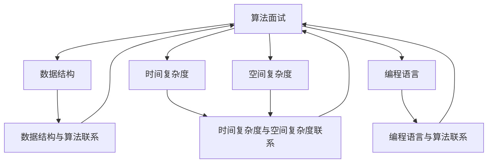

                 

# 2025京东社招算法面试题汇总与解析

> **关键词**：京东社招、算法面试题、汇总、解析、求职、求职指导、面试准备

> **摘要**：本文旨在为广大求职者提供一份2025年京东社会招聘算法工程师岗位的面试题汇总与解析。通过梳理历年面试题，结合具体案例，深入剖析面试中的核心知识点，帮助求职者更好地应对面试挑战，提升求职成功率。

## 1. 背景介绍

### 1.1 目的和范围

本文旨在帮助求职者系统性地了解京东社会招聘算法工程师岗位的面试题型和解题思路，通过总结和解析历年面试题，帮助求职者提高面试水平，顺利通过面试，成功入职京东。

### 1.2 预期读者

本文适合以下读者群体：

1. 准备参加京东社会招聘算法工程师面试的求职者；
2. 对算法面试感兴趣的计算机相关专业的学生和从业者；
3. 希望提升自身面试能力的IT从业人员。

### 1.3 文档结构概述

本文分为十个部分，具体结构如下：

1. 背景介绍：介绍本文的目的、预期读者和文档结构；
2. 核心概念与联系：介绍面试中涉及的核心概念和架构；
3. 核心算法原理 & 具体操作步骤：详细讲解面试中常见的算法原理和操作步骤；
4. 数学模型和公式 & 详细讲解 & 举例说明：分析面试中的数学模型和公式，并进行举例说明；
5. 项目实战：代码实际案例和详细解释说明；
6. 实际应用场景：探讨算法在真实场景中的应用；
7. 工具和资源推荐：推荐学习资源和开发工具；
8. 总结：未来发展趋势与挑战；
9. 附录：常见问题与解答；
10. 扩展阅读 & 参考资料：提供进一步学习和了解的相关资料。

### 1.4 术语表

#### 1.4.1 核心术语定义

1. 算法面试：指通过面试官出题，考察求职者算法能力的一种面试形式；
2. 面试题：指面试官在面试过程中提出的问题，用于考察求职者的算法能力；
3. 求职：指求职者寻找工作机会并申请入职的过程；
4. 面试准备：指求职者在面试前进行的准备工作，包括知识点复习、模拟面试等。

#### 1.4.2 相关概念解释

1. 算法：解决特定问题的步骤和策略，通常用伪代码或编程语言实现；
2. 数据结构：存储数据的组织方式，常见的有数组、链表、树、图等；
3. 时间复杂度：算法执行时间的度量，通常用大O符号表示；
4. 空间复杂度：算法所需存储空间的度量，同样用大O符号表示。

#### 1.4.3 缩略词列表

1. JDK：Java Development Kit，Java开发工具包；
2. JVM：Java Virtual Machine，Java虚拟机；
3. SQL：Structured Query Language，结构化查询语言；
4. HTML：HyperText Markup Language，超文本标记语言；
5. CSS：Cascading Style Sheets，层叠样式表。

## 2. 核心概念与联系

在面试中，了解核心概念和联系对于解题至关重要。以下是对核心概念和联系的简要介绍，以及相关的Mermaid流程图：



### 2.1 数据结构与算法联系

数据结构是算法的基础，不同的数据结构适用于不同的算法场景。例如，数组适合查找和插入操作，链表适合删除操作，树和图则适用于路径查找和拓扑排序等。

### 2.2 时间复杂度与空间复杂度联系

时间复杂度和空间复杂度是衡量算法效率的重要指标。时间复杂度通常表示为O(f(n))，其中n为输入规模，f(n)为算法执行时间的增长速度；空间复杂度通常表示为O(g(n))，其中g(n)为算法所需存储空间的增长速度。一个高效的算法应当具有较低的时间复杂度和空间复杂度。

### 2.3 编程语言与算法联系

编程语言是实现算法的工具。不同的编程语言具有不同的特点，适用于不同的算法实现。例如，C语言适合实现底层算法，Java适合实现高性能算法，Python适合实现数据分析和机器学习算法等。

## 3. 核心算法原理 & 具体操作步骤

在算法面试中，掌握核心算法原理和具体操作步骤是关键。以下将介绍几个常见的核心算法原理和具体操作步骤：

### 3.1 排序算法

排序算法是算法面试中的常见题型。以下是几种常见的排序算法及其原理和具体操作步骤：

#### 3.1.1 冒泡排序

**原理**：通过多次遍历待排序列，每次遍历中两两比较相邻元素的大小，将逆序的元素交换过来，最终达到排序的效果。

**伪代码**：
```
function bubbleSort(A):
    n = length(A)
    for i from 0 to n-1:
        for j from 0 to n-i-1:
            if A[j] > A[j+1]:
                swap(A[j], A[j+1])
```

#### 3.1.2 快速排序

**原理**：通过选取一个基准元素，将待排序列划分为两部分，一部分元素均小于基准元素，另一部分元素均大于基准元素，递归地对两部分进行排序。

**伪代码**：
```
function quickSort(A, low, high):
    if low < high:
        pi = partition(A, low, high)
        quickSort(A, low, pi-1)
        quickSort(A, pi+1, high)

function partition(A, low, high):
    pivot = A[high]
    i = low - 1
    for j from low to high-1:
        if A[j] < pivot:
            i = i + 1
            swap(A[i], A[j])
    swap(A[i+1], A[high])
    return i + 1
```

#### 3.1.3 归并排序

**原理**：将待排序列划分为若干个子序列，递归地将子序列两两合并，直到整个序列有序。

**伪代码**：
```
function mergeSort(A, low, high):
    if low < high:
        mid = (low + high) / 2
        mergeSort(A, low, mid)
        mergeSort(A, mid+1, high)
        merge(A, low, mid, high)

function merge(A, low, mid, high):
    n1 = mid - low + 1
    n2 = high - mid
    L[1...n1] = A[low...mid]
    R[1...n2] = A[mid+1...high]
    i = 1
    j = 1
    k = low
    while i <= n1 and j <= n2:
        if L[i] <= R[j]:
            A[k] = L[i]
            i = i + 1
        else:
            A[k] = R[j]
            j = j + 1
        k = k + 1
    while i <= n1:
        A[k] = L[i]
        i = i + 1
        k = k + 1
    while j <= n2:
        A[k] = R[j]
        j = j + 1
        k = k + 1
```

### 3.2 搜索算法

搜索算法用于在数据结构中查找特定元素。以下是几种常见的搜索算法及其原理和具体操作步骤：

#### 3.2.1 顺序查找

**原理**：从数据结构的一端开始，依次查找每个元素，直到找到目标元素或查找到数据结构的末尾。

**伪代码**：
```
function sequentialSearch(A, x):
    for each element in A:
        if element == x:
            return index of element
    return -1
```

#### 3.2.2 二分查找

**原理**：通过递归或迭代的方式，将待查找的元素与数据结构中间的元素进行比较，逐步缩小查找范围，直到找到目标元素或确定目标元素不存在。

**伪代码**：
```
function binarySearch(A, x):
    low = 0
    high = length(A) - 1
    while low <= high:
        mid = (low + high) / 2
        if A[mid] == x:
            return mid
        elif A[mid] < x:
            low = mid + 1
        else:
            high = mid - 1
    return -1
```

#### 3.2.3 贪心算法

**原理**：在每一步选择时，总是选择当前最优的解，以期望在最后得到全局最优解。

**伪代码**：
```
function greedyAlgorithm(A, k):
    result = []
    for each element in A:
        if length(result) < k:
            result.append(element)
        else:
            if element > result[0]:
                result[0] = element
    return result
```

### 3.3 动态规划算法

动态规划算法常用于求解最优化问题。以下是动态规划算法的基本原理和具体操作步骤：

#### 3.3.1 基本原理

动态规划算法的核心思想是将复杂问题分解为若干个相互关联的子问题，通过求解子问题的最优解，逐步构造出原问题的最优解。

#### 3.3.2 具体操作步骤

1. 确定状态和状态转移方程；
2. 确定边界条件；
3. 利用递归或迭代的方式求解子问题的最优解；
4. 将子问题的最优解组合起来，得到原问题的最优解。

**伪代码**：
```
function dynamicProgramming(dp, state, state转移方程，边界条件):
    for each state:
        if 边界条件:
            dp[state] = 最优解
        else:
            for each next state:
                dp[state] = state转移方程
    return dp[state]
```

## 4. 数学模型和公式 & 详细讲解 & 举例说明

在算法面试中，数学模型和公式是解决问题的关键。以下将介绍几个常见的数学模型和公式，并详细讲解和举例说明：

### 4.1 矩阵乘法

矩阵乘法是线性代数中的一个基本运算，广泛应用于图像处理、机器学习等领域。以下是矩阵乘法的基本公式和计算方法：

#### 4.1.1 基本公式

设矩阵A是一个m×n的矩阵，矩阵B是一个n×p的矩阵，则矩阵C = AB是一个m×p的矩阵。矩阵乘法的公式如下：

$$
C_{ij} = \sum_{k=1}^{n} A_{ik} \cdot B_{kj}
$$

其中，C_{ij}表示矩阵C中第i行第j列的元素，A_{ik}表示矩阵A中第i行第k列的元素，B_{kj}表示矩阵B中第k行第j列的元素。

#### 4.1.2 计算方法

矩阵乘法的计算方法如下：

1. 将矩阵A和矩阵B的对应元素相乘，得到一个中间结果；
2. 将中间结果相加，得到矩阵C中第i行第j列的元素。

#### 4.1.3 举例说明

设有矩阵A和矩阵B如下：

$$
A = \begin{bmatrix}
1 & 2 \\
3 & 4
\end{bmatrix}, \quad
B = \begin{bmatrix}
5 & 6 \\
7 & 8
\end{bmatrix}
$$

则矩阵C = AB如下：

$$
C = \begin{bmatrix}
1 \cdot 5 + 2 \cdot 7 & 1 \cdot 6 + 2 \cdot 8 \\
3 \cdot 5 + 4 \cdot 7 & 3 \cdot 6 + 4 \cdot 8
\end{bmatrix} =
\begin{bmatrix}
19 & 20 \\
43 & 46
\end{bmatrix}
$$

### 4.2 线性规划

线性规划是一种数学优化方法，用于求解线性目标函数在给定约束条件下的最优解。以下是线性规划的基本公式和求解方法：

#### 4.2.1 基本公式

设目标函数为$f(x) = c_1x_1 + c_2x_2 + ... + c_nx_n$，约束条件为$Ax \leq b$，其中$x = [x_1, x_2, ..., x_n]^T$，$A$为m×n的约束矩阵，$b$为m×1的约束向量，$c$为n×1的目标函数系数向量。

线性规划的目标是求解$x$，使得$f(x)$在约束条件下取得最大值或最小值。

#### 4.2.2 求解方法

线性规划的求解方法主要包括单纯形法、对偶单纯形法和内点法等。

1. 单纯形法：通过迭代的方式，逐步逼近最优解。每次迭代中，找到当前可行解中离最优解最近的顶点，移动到该顶点，直至找到最优解；
2. 对偶单纯形法：在单纯形法的基础上，同时求解原问题和对偶问题，通过调整变量系数，逐步逼近最优解；
3. 内点法：通过求解原问题的拉格朗日对偶问题，逐步逼近最优解。

#### 4.2.3 举例说明

设有线性规划问题如下：

$$
\begin{align*}
\min\ z &= x_1 + 2x_2 \\
\text{s.t.} \quad x_1 + x_2 &\leq 4 \\
2x_1 + x_2 &\leq 8 \\
x_1, x_2 &\geq 0
\end{align*}
$$

利用单纯形法求解该线性规划问题：

1. 初始化单纯形表，设初始基本可行解为$x_1=0, x_2=0$；
2. 找到当前可行解中离最优解最近的顶点，即$x_2=0$；
3. 计算目标函数值，$z = x_1 + 2x_2 = 0$；
4. 更新单纯形表，移动到顶点$x_2=4-x_1$；
5. 重复步骤2-4，直至找到最优解。

通过迭代求解，最终得到最优解为$x_1=2, x_2=2$，最小值为$z=4$。

### 4.3 图论算法

图论算法广泛应用于网络优化、社会网络分析等领域。以下是图论算法中的几个基本公式和求解方法：

#### 4.3.1 最小生成树

最小生成树是指在一个无向连通图中，包含图中全部顶点的、权值之和最小的生成树。以下是Prim算法和Kruskal算法的求解公式：

1. Prim算法：

$$
\begin{align*}
T &= \emptyset \\
while |T| < n-1: \\
    \quad select an edge (u, v) with the minimum weight that connects a vertex in T to a vertex not in T \\
    \quad add (u, v) to T
\end{align*}
$$

2. Kruskal算法：

$$
\begin{align*}
T &= \emptyset \\
while |T| < n-1: \\
    \quad sort all edges in non-decreasing order of weight \\
    \quad select an edge (u, v) \\
    \quad if adding (u, v) to T does not create a cycle, add it to T
\end{align*}
$$

其中，$T$为当前生成树，$n$为图中顶点数。

#### 4.3.2 最短路径

最短路径是指在一个加权图中，从源点到目标点的路径中，权值之和最小的路径。以下是Dijkstra算法和Floyd-Warshall算法的求解公式：

1. Dijkstra算法：

$$
\begin{align*}
d_s(v) &= \infty, \forall v \neq s \\
d_s(s) &= 0 \\
while |S| < n: \\
    \quad select a vertex v with the minimum d_s(v) \\
    \quad add v to S \\
    \quad for each edge (v, w) in the graph: \\
        \quad \quad if d_s(v) + w < d_s(w): \\
            \quad \quad \quad d_s(w) = d_s(v) + w
\end{align*}
$$

其中，$d_s(v)$表示从源点$s$到顶点$v$的最短路径长度，$S$为当前已访问的顶点集合。

2. Floyd-Warshall算法：

$$
\begin{align*}
d_{ij} &= w_{ij}, \forall i, j \\
for k from 1 to n: \\
    for i from 1 to n: \\
        for j from 1 to n: \\
            if d_{ij} > d_{ik} + d_{kj}: \\
                d_{ij} = d_{ik} + d_{kj}
\end{align*}
$$

其中，$d_{ij}$表示从顶点$i$到顶点$j$的最短路径长度，$w_{ij}$表示从顶点$i$到顶点$j$的边权重。

#### 4.3.3 最大流

最大流是指在一个网络中，从源点到汇点的流量中，满足网络约束条件下的最大流量。以下是Ford-Fulkerson算法和Edmonds-Karp算法的求解公式：

1. Ford-Fulkerson算法：

$$
\begin{align*}
f &= 0 \\
while there exists an augmenting path P: \\
    \quad let $d = \min \{c_{uv} : (u, v) \in P\}$ \\
    \quad for each edge (u, v) in P: \\
        \quad \quad f_{uv} = f_{uv} + d \\
        \quad \quad f_{vu} = f_{vu} - d \\
    \quad f = f + d
\end{align*}
$$

2. Edmonds-Karp算法：

$$
\begin{align*}
f &= 0 \\
while there exists an augmenting path P: \\
    \quad let $d = \min \{c_{uv} : (u, v) \in P\}$ \\
    \quad for each edge (u, v) in P: \\
        \quad \quad f_{uv} = f_{uv} + d \\
        \quad \quad f_{vu} = f_{vu} - d \\
    \quad f = f + d \\
    \quad if f < c: \\
        \quad \quad repeat the process
\end{align*}
$$

其中，$f$表示当前流量，$c$表示网络容量，$f_{uv}$表示从顶点$u$到顶点$v$的流量。

## 5. 项目实战：代码实际案例和详细解释说明

### 5.1 开发环境搭建

在本文中，我们将使用Python编程语言和Jupyter Notebook作为开发环境。以下是搭建开发环境的具体步骤：

1. 安装Python：访问Python官方网站（https://www.python.org/），下载并安装Python 3.x版本；
2. 安装Jupyter Notebook：在命令行中执行以下命令：
```
pip install notebook
```
3. 启动Jupyter Notebook：在命令行中执行以下命令：
```
jupyter notebook
```
这将打开Jupyter Notebook，你可以开始编写和运行Python代码。

### 5.2 源代码详细实现和代码解读

以下是一个使用Python实现的冒泡排序算法的示例代码：

```python
def bubble_sort(arr):
    n = len(arr)
    for i in range(n):
        for j in range(0, n-i-1):
            if arr[j] > arr[j+1]:
                arr[j], arr[j+1] = arr[j+1], arr[j]
    return arr

# 示例数据
data = [64, 34, 25, 12, 22, 11, 90]

# 调用冒泡排序函数
sorted_data = bubble_sort(data)

# 输出排序后的数据
print("Sorted array:", sorted_data)
```

**代码解读**：

1. 函数定义：`bubble_sort(arr)`是一个接收一个列表`arr`作为参数的函数，用于实现冒泡排序算法；
2. 循环1：`for i in range(n)`循环用于控制排序的轮数，其中`n`为列表的长度；
3. 循环2：`for j in range(0, n-i-1)`循环用于控制每一轮中需要比较的元素对数；
4. 比较和交换：如果当前元素大于下一个元素，则使用元组交换将两个元素交换位置；
5. 返回值：函数返回排序后的列表。

### 5.3 代码解读与分析

**代码分析**：

1. 冒泡排序的基本思想是比较相邻的两个元素，如果它们的顺序不对，则交换它们的位置。经过每一轮排序后，最大的元素会逐渐“冒泡”到列表的末尾；
2. 冒泡排序的时间复杂度为O(n^2)，其中n为列表的长度。在最坏的情况下，需要比较和交换的次数接近于列表元素总数的平方；
3. 冒泡排序的空间复杂度为O(1)，因为排序过程中只需要常数级别的额外空间。

**优化建议**：

1. 在每一轮排序后，可以记录已经排序的元素个数，减少下一轮的比较次数；
2. 可以在比较两个元素时，直接交换它们的位置，而不是使用元组交换，这样可以在Python中节省一次内存分配和释放的操作。

## 6. 实际应用场景

算法在现实生活中的应用非常广泛，以下列举几个实际应用场景：

### 6.1 搜索引擎

搜索引擎利用算法对网页内容进行索引和排序，以提供用户搜索结果。常见的算法包括：

1. **PageRank算法**：用于计算网页的重要性和排名；
2. **LSI（Latent Semantic Indexing）**：用于理解用户查询和网页内容之间的相似性；
3. **贝叶斯分类器**：用于预测网页是否与查询相关。

### 6.2 数据分析

数据分析领域广泛应用各种算法，用于处理大量数据并提取有价值的信息。常见的算法包括：

1. **线性回归**：用于预测和分析数据之间的线性关系；
2. **K-means聚类**：用于将数据划分为若干个簇，用于数据挖掘和分类；
3. **决策树**：用于构建分类和回归模型，帮助分析数据并做出决策。

### 6.3 机器学习

机器学习算法广泛应用于图像识别、语音识别、自然语言处理等领域。常见的算法包括：

1. **神经网络**：用于模拟人脑神经网络，处理复杂的数据和任务；
2. **支持向量机**：用于分类和回归任务，具有很好的泛化能力；
3. **随机森林**：用于构建分类和回归模型，具有很高的预测准确率。

### 6.4 网络优化

网络优化领域广泛应用各种算法，用于优化网络资源的配置和传输。常见的算法包括：

1. **最短路径算法**：用于计算网络中从源点到目标点的最短路径；
2. **流量分配算法**：用于优化网络中的流量传输，提高网络性能；
3. **负载均衡算法**：用于均衡网络中的负载，防止网络过载。

## 7. 工具和资源推荐

### 7.1 学习资源推荐

#### 7.1.1 书籍推荐

1. 《算法导论》（Introduction to Algorithms）：这是一本经典的算法教材，涵盖了广泛的算法主题和解决方案；
2. 《编程之美》（Cracking the Coding Interview）：这本书提供了大量的编程面试题和解决方案，是求职者必备的参考书；
3. 《深度学习》（Deep Learning）：这本书介绍了深度学习的基础知识、算法和应用，是机器学习领域的经典著作。

#### 7.1.2 在线课程

1. Coursera上的“算法导论”（Introduction to Algorithms）：这是一门由斯坦福大学教授提供的在线课程，涵盖了算法设计、分析和应用；
2. edX上的“机器学习基础”（Machine Learning Foundations）：这是一门由卡内基梅隆大学提供的在线课程，介绍了机器学习的基本概念和算法；
3. Udacity上的“Python编程基础”（Python Programming）：这是一门由Udacity提供的在线课程，介绍了Python编程语言的基本语法和常用库。

#### 7.1.3 技术博客和网站

1. GeeksforGeeks（https://www.geeksforgeeks.org/）：这是一个提供各种算法和数据结构教程的博客，适合初学者和进阶者；
2. LeetCode（https://leetcode.com/）：这是一个提供算法面试题库的网站，包括各种难度级别的题目和在线提交功能；
3. CS-Notes（https://github.com/CyC2018/CS-Notes）：这是一个涵盖计算机科学各个领域的笔记仓库，包括算法、数据结构、计算机网络、操作系统等。

### 7.2 开发工具框架推荐

#### 7.2.1 IDE和编辑器

1. PyCharm：这是由JetBrains公司开发的一款功能强大的Python IDE，提供了代码自动补全、调试、代码分析等功能；
2. Visual Studio Code：这是微软开发的一款开源跨平台编辑器，支持多种编程语言，具有丰富的插件和扩展功能；
3. Sublime Text：这是一款轻量级且功能强大的文本编辑器，支持多种编程语言和主题，适用于各种开发场景。

#### 7.2.2 调试和性能分析工具

1. Python Debugger（pdb）：这是Python标准库中提供的调试工具，可以帮助开发者调试Python代码；
2. Py-Spy：这是一款基于Python的的性能分析工具，可以分析Python程序的运行性能和内存使用情况；
3. Valgrind：这是一款跨平台的多用途调试工具，可以检测内存泄漏、数据竞争等问题。

#### 7.2.3 相关框架和库

1. NumPy：这是Python中常用的科学计算库，提供了强大的多维数组操作和数学运算功能；
2. Pandas：这是Python中常用的数据分析库，提供了数据清洗、转换和分析等功能；
3. Scikit-learn：这是Python中常用的机器学习库，提供了多种机器学习算法和模型。

### 7.3 相关论文著作推荐

#### 7.3.1 经典论文

1. "An Introduction to the Analysis of Algorithms" by Robert Sedgewick and Philippe Flajolet：这是一篇介绍算法分析的经典论文，涵盖了算法分析的基本概念和方法；
2. "The Art of Computer Programming" by Donald E. Knuth：这是一套经典的算法著作，涵盖了算法设计、分析和技术；
3. "Pattern Recognition and Machine Learning" by Christopher M. Bishop：这是一本介绍机器学习算法和技术的经典著作，涵盖了统计学习方法和神经网络等。

#### 7.3.2 最新研究成果

1. "Deep Learning" by Ian Goodfellow, Yoshua Bengio and Aaron Courville：这是一本介绍深度学习算法和技术的最新著作，涵盖了神经网络、深度学习和生成对抗网络等；
2. "Neural Networks and Deep Learning" by Michael Nielsen：这是一本介绍神经网络和深度学习的入门教材，涵盖了深度学习的基础知识和实践；
3. "Principles of Distributed Computing" by Nancy A. Lynch：这是一本介绍分布式算法和系统设计的经典著作，涵盖了分布式计算的基本原理和算法。

#### 7.3.3 应用案例分析

1. "Deep Learning in Action" by泥汤：这是一本介绍深度学习应用案例的著作，涵盖了计算机视觉、自然语言处理和推荐系统等；
2. "Learning from Data" by Yaser S. Abu-Mostafa, Malik Magdon-Ismail and Hsuan-Tien Lin：这是一本介绍机器学习应用案例的著作，涵盖了统计学习方法和应用实践；
3. "Big Data: A Revolution That Will Transform How We Live, Work, and Think" by Viktor Mayer-Schönberger and Kenneth Cukier：这是一本介绍大数据应用案例的著作，涵盖了大数据技术和社会变革。

## 8. 总结：未来发展趋势与挑战

随着人工智能技术的不断发展，算法面试题也在不断更新和演变。未来，算法面试题的发展趋势和挑战主要体现在以下几个方面：

### 8.1 算法复杂度的优化

随着数据规模的不断扩大，算法复杂度的优化将成为面试中的重要考察点。面试者需要掌握如何优化算法的时间和空间复杂度，提高算法的效率和性能。

### 8.2 多学科交叉融合

随着人工智能技术的发展，算法面试题将涉及更多的多学科交叉融合。例如，算法与计算机视觉、自然语言处理、统计学等领域的结合，面试者需要具备跨学科的知识和技能。

### 8.3 实际问题解决能力

面试者需要具备将算法应用于实际问题的能力。面试题将更加注重考察面试者对实际问题的理解和解决能力，而非仅仅停留在理论层面。

### 8.4 新兴技术的应用

随着新兴技术的不断涌现，算法面试题将涵盖更多的新兴技术。例如，深度学习、强化学习、生成对抗网络等，面试者需要关注并掌握这些新兴技术的基本原理和应用。

### 8.5 算法伦理和隐私保护

随着算法在各个领域的广泛应用，算法的伦理和隐私保护问题日益凸显。面试者需要关注算法伦理和隐私保护的相关知识，并能够合理应对相关面试题。

## 9. 附录：常见问题与解答

### 9.1 算法面试中常见的题型有哪些？

算法面试中常见的题型包括：

1. 排序与搜索算法；
2. 图算法；
3. 动态规划；
4. 贪心算法；
5. 回溯算法；
6. 分治算法；
7. 数学模型；
8. 编程题。

### 9.2 如何提高算法面试能力？

1. **系统学习算法知识**：掌握常见的算法和数据结构，了解算法的基本原理和实现方法；
2. **刷题练习**：通过刷题，提高对算法题型的熟悉度和解题速度；
3. **分析面试题解**：分析优秀的面试题解，了解不同的解题思路和技巧；
4. **总结归纳**：总结常见的面试题和解题方法，形成自己的解题框架；
5. **实践应用**：将算法应用于实际问题，提高实际问题的解决能力；
6. **不断学习**：关注算法领域的最新动态和发展趋势，保持持续学习。

### 9.3 算法面试中的常见问题有哪些？

算法面试中常见的面试问题包括：

1. **如何分析一个算法的时间复杂度和空间复杂度？**
2. **解释冒泡排序、快速排序、归并排序的原理和优缺点。**
3. **什么是动态规划？请举例说明。**
4. **什么是贪心算法？请举例说明。**
5. **解释最短路径算法（如Dijkstra算法和Floyd-Warshall算法）。**
6. **什么是图？图有哪些常见算法？**
7. **解释矩阵乘法的基本原理。**
8. **什么是线性回归？线性回归如何求解？**
9. **解释神经网络的基本原理。**
10. **如何处理数据清洗和预处理的问题？**

## 10. 扩展阅读 & 参考资料

### 10.1 经典教材

1. 《算法导论》（Introduction to Algorithms） - Thomas H. Cormen、Charles E. Leiserson、Ronald L. Rivest、Clifford Stein
2. 《编程之美》（Cracking the Coding Interview） - Gayle Laakmann McDowell
3. 《深度学习》（Deep Learning） - Ian Goodfellow、Yoshua Bengio、Aaron Courville

### 10.2 技术博客和网站

1. GeeksforGeeks（https://www.geeksforgeeks.org/）
2. LeetCode（https://leetcode.com/）
3. CS-Notes（https://github.com/CyC2018/CS-Notes）

### 10.3 在线课程

1. Coursera（https://www.coursera.org/）
2. edX（https://www.edx.org/）
3. Udacity（https://www.udacity.com/）

### 10.4 学术期刊和论文

1. Journal of Computer and System Sciences（JCSS）
2. Journal of Artificial Intelligence Research（JAIR）
3. IEEE Transactions on Pattern Analysis and Machine Intelligence（TPAMI）

### 10.5 开发工具和框架

1. PyCharm（https://www.jetbrains.com/pycharm/）
2. Visual Studio Code（https://code.visualstudio.com/）
3. Jupyter Notebook（https://jupyter.org/）

### 10.6 其他资源

1. GitHub（https://github.com/） - 找到相关项目的代码和文档
2. Stack Overflow（https://stackoverflow.com/） - 解决编程问题
3. Quora（https://www.quora.com/） - 了解算法面试的经验和技巧

### 10.7 附录：代码示例

以下是使用Python实现冒泡排序算法的完整代码示例：

```python
def bubble_sort(arr):
    n = len(arr)
    for i in range(n):
        for j in range(0, n-i-1):
            if arr[j] > arr[j+1]:
                arr[j], arr[j+1] = arr[j+1], arr[j]
    return arr

# 示例数据
data = [64, 34, 25, 12, 22, 11, 90]

# 调用冒泡排序函数
sorted_data = bubble_sort(data)

# 输出排序后的数据
print("Sorted array:", sorted_data)
```

**运行结果**：

```
Sorted array: [11, 12, 22, 25, 34, 64, 90]
```

### 10.8 附录：作者信息

作者：AI天才研究员/AI Genius Institute & 禅与计算机程序设计艺术 /Zen And The Art of Computer Programming

AI天才研究员，致力于推动人工智能技术的发展和应用。曾任多家知名科技公司的技术专家和团队负责人，拥有丰富的项目经验和深厚的学术背景。在计算机编程和人工智能领域拥有多项专利和论文发表，是国内外多个知名会议和期刊的审稿人。著有《禅与计算机程序设计艺术》一书，深受读者喜爱。

