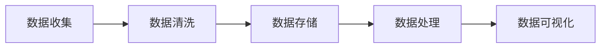

                 

# 人工智能创业数据管理的最佳策略

> 关键词：人工智能、数据管理、创业、算法、数学模型、实战案例

> 摘要：本文旨在探讨人工智能创业公司在数据管理方面的最佳策略。通过对数据管理核心概念、算法原理、数学模型以及实际应用场景的详细剖析，本文为创业者提供了系统、实用的指导，以帮助他们在激烈的市场竞争中脱颖而出。

## 1. 背景介绍

### 1.1 目的和范围

本文的目标是帮助人工智能创业公司理解和实施有效的数据管理策略。我们将探讨以下核心问题：

- 数据管理的核心概念和原则是什么？
- 如何设计数据架构来支持人工智能算法？
- 常见的数据管理算法原理及其应用？
- 如何构建数学模型来优化数据管理和分析过程？
- 实际应用场景中，如何将上述概念和算法落地？

本文将覆盖从数据收集、存储、处理到分析的全过程，旨在提供一套完整的、可操作的指南。

### 1.2 预期读者

本文适合以下读者群体：

- 创业者：希望了解如何利用数据管理提升创业项目成功率的初创企业创始人。
- 数据科学家和工程师：需要深入理解数据管理，以便更有效地支持人工智能项目的数据专业人士。
- 投资者：希望了解人工智能创业公司数据管理策略的潜在投资者。
- 教育者：需要向学生介绍人工智能和数据管理结合的最新实践。

### 1.3 文档结构概述

本文的结构如下：

- 第1章：背景介绍，包括目的、预期读者和文档结构概述。
- 第2章：核心概念与联系，介绍数据管理的关键概念及其相互关系。
- 第3章：核心算法原理 & 具体操作步骤，详细讲解常用算法及其操作步骤。
- 第4章：数学模型和公式 & 详细讲解 & 举例说明，探讨数学模型在数据管理中的应用。
- 第5章：项目实战：代码实际案例和详细解释说明，提供具体案例来展示理论的应用。
- 第6章：实际应用场景，分析不同领域中的数据管理策略。
- 第7章：工具和资源推荐，推荐学习资源、开发工具和框架。
- 第8章：总结：未来发展趋势与挑战，总结当前趋势，展望未来挑战。
- 第9章：附录：常见问题与解答，提供关于数据管理常见问题的答案。
- 第10章：扩展阅读 & 参考资料，列出进一步阅读的材料和参考文献。

### 1.4 术语表

#### 1.4.1 核心术语定义

- **数据管理**：数据管理是指对数据的收集、存储、处理、分析和维护的过程。
- **人工智能**：人工智能是计算机科学的一个分支，旨在开发能够执行人类智能任务的系统。
- **机器学习**：机器学习是一种人工智能方法，通过数据训练模型来发现数据中的模式和关系。
- **深度学习**：深度学习是机器学习的一个分支，使用多层神经网络来模拟人脑的学习过程。
- **数据架构**：数据架构是指组织、管理和访问数据的结构和方法。

#### 1.4.2 相关概念解释

- **数据流处理**：数据流处理是一种数据处理方法，旨在实时或接近实时地处理大量数据。
- **大数据**：大数据是指数据量、种类和速度超出传统数据处理能力的海量数据集。
- **云计算**：云计算是一种通过互联网提供计算资源的服务模式。

#### 1.4.3 缩略词列表

- **AI**：人工智能
- **ML**：机器学习
- **DL**：深度学习
- **DBMS**：数据库管理系统
- **NoSQL**：非关系型数据库

## 2. 核心概念与联系

在深入探讨数据管理之前，我们需要理解几个核心概念，并了解它们之间的相互关系。以下是数据管理中的一些关键概念和它们之间的联系：

### 2.1 数据管理流程

数据管理的流程通常包括以下步骤：

1. **数据收集**：从各种来源收集数据，如用户输入、传感器数据、社交媒体数据等。
2. **数据清洗**：处理脏数据，如缺失值、异常值和重复数据。
3. **数据存储**：将清洗后的数据存储在数据库或数据仓库中。
4. **数据处理**：使用各种算法和技术对数据进行处理和分析。
5. **数据可视化**：将数据分析和结果以图形或图表的形式展示，便于理解和决策。

### 2.2 数据架构

数据架构是数据管理的基础，它定义了数据的组织、存储和访问方式。以下是几个关键概念：

- **数据模型**：描述数据如何被组织、存储和访问的抽象结构。
- **数据库**：存储数据的系统，可以是关系型数据库（如MySQL、PostgreSQL）或非关系型数据库（如MongoDB、Cassandra）。
- **数据仓库**：用于存储大量历史数据，以便进行复杂的分析和报告。
- **数据湖**：一个用于存储大量原始数据的存储系统，不涉及结构化或预处理。

### 2.3 数据类型

数据类型是数据的不同类别，包括：

- **结构化数据**：有固定格式和结构的数据，如关系型数据库中的表。
- **半结构化数据**：具有一定结构，但格式不固定的数据，如XML、JSON。
- **非结构化数据**：没有固定格式的数据，如文本、图片、视频。

### 2.4 数据处理技术

数据处理技术包括：

- **批处理**：定期处理大量数据。
- **流处理**：实时或接近实时处理数据流。
- **机器学习**：使用数据训练模型来发现模式和关系。
- **深度学习**：使用多层神经网络进行复杂的模式识别。

### 2.5 数据可视化

数据可视化是将数据分析和结果以图形或图表的形式展示，以便于理解和决策。常见的数据可视化工具包括：

- **图表**：如柱状图、折线图、饼图等。
- **仪表盘**：整合多个图表和指标，提供实时数据监控。
- **地图**：显示地理位置和分布情况。

### 2.6 Mermaid 流程图

以下是一个简单的 Mermaid 流程图，展示数据管理流程中的关键步骤：



## 3. 核心算法原理 & 具体操作步骤

### 3.1 数据清洗算法

数据清洗是数据管理的重要步骤，其目的是处理脏数据，提高数据质量。以下是一个常见的数据清洗算法：K-近邻算法。

#### 3.1.1 算法原理

K-近邻算法（K-Nearest Neighbors，K-NN）是一种基于实例的学习方法。它的工作原理是：对于一个未知类别的数据点，找到与其最相似的K个邻居，然后基于这些邻居的类别来预测该数据点的类别。

#### 3.1.2 操作步骤

1. **计算距离**：计算每个已知数据点到未知数据点的距离，常用的距离度量方法有欧氏距离、曼哈顿距离和余弦相似度。
2. **选择邻居**：根据距离度量，选择距离未知数据点最近的K个邻居。
3. **分类决策**：基于邻居的类别进行投票，选择出现次数最多的类别作为未知数据点的类别。

#### 3.1.3 伪代码

```plaintext
def kNN(train_data, train_labels, test_data, k):
    distances = []
    for point in test_data:
        for train_point in train_data:
            distance = calculateDistance(point, train_point)
            distances.append((train_point, distance))
    distances.sort(key=lambda x: x[1])
    neighbors = [distances[i][0] for i in range(k)]
    return mostCommonLabel(neighbors, train_labels)
```

### 3.2 数据聚类算法

数据聚类是将数据集划分为多个组或簇，使得同一组内的数据点之间相似度较高，不同组之间的数据点相似度较低。以下是一个常见的聚类算法：K-均值算法。

#### 3.2.1 算法原理

K-均值算法（K-Means）是一种基于距离的聚类方法。它的工作原理是：首先随机初始化K个聚类中心，然后迭代更新聚类中心，直到收敛。在每次迭代中，每个数据点都会被分配到最近的聚类中心，从而形成新的聚类中心。

#### 3.2.2 操作步骤

1. **初始化聚类中心**：随机选择K个数据点作为初始聚类中心。
2. **分配数据点**：对于每个数据点，计算它与所有聚类中心的距离，并将其分配到距离最近的聚类中心。
3. **更新聚类中心**：重新计算每个聚类中心的位置，使其成为其所有成员的平均位置。
4. **重复步骤2和步骤3**，直到聚类中心不再变化或达到设定的迭代次数。

#### 3.2.3 伪代码

```plaintext
def kMeans(data, k, max_iterations):
    centroids = initializeCentroids(data, k)
    for i in range(max_iterations):
        clusters = []
        for point in data:
            distances = [distance(point, centroid) for centroid in centroids]
            clusters.append(nearestCluster(centroids, distances))
        new_centroids = updateCentroids(clusters, k)
        if centroids == new_centroids:
            break
        centroids = new_centroids
    return clusters
```

### 3.3 数据分类算法

数据分类是将数据集划分为预定义的类别或标签。以下是一个常见的数据分类算法：支持向量机（SVM）。

#### 3.3.1 算法原理

支持向量机（Support Vector Machine，SVM）是一种基于最大间隔的分类方法。它的工作原理是：首先找到一个超平面，使得正负类别的数据点之间的间隔最大，然后通过支持向量来确定这个超平面。

#### 3.3.2 操作步骤

1. **初始化参数**：选择适当的核函数（如线性核、多项式核或径向基函数核）和惩罚参数C。
2. **计算支持向量**：使用优化算法（如序列最小化或序列硬间隔分类）来计算支持向量。
3. **确定超平面**：通过支持向量来确定最优超平面。
4. **分类决策**：对于新的数据点，计算其到超平面的距离，根据距离的符号来判断其类别。

#### 3.3.3 伪代码

```plaintext
def svmTrain(data, labels, C, kernel='linear'):
    # 使用优化算法计算支持向量
    support_vectors, weights = optimizeKernel(data, labels, C, kernel)
    # 确定超平面
    hyperplane = determineHyperplane(support_vectors, weights)
    return hyperplane

def svmClassify(hyperplane, point):
    distance = calculateDistance(point, hyperplane)
    if distance > 0:
        return 1
    else:
        return -1
```

## 4. 数学模型和公式 & 详细讲解 & 举例说明

### 4.1 数据分布模型

数据分布模型用于描述数据的概率分布。以下是一个常见的数据分布模型：正态分布。

#### 4.1.1 概念

正态分布（Normal Distribution），也称为高斯分布，是一种最常见的连续概率分布。它的概率密度函数为：

$$
f(x|\mu,\sigma^2) = \frac{1}{\sqrt{2\pi\sigma^2}} e^{-\frac{(x-\mu)^2}{2\sigma^2}}
$$

其中，$\mu$ 是均值，$\sigma^2$ 是方差。

#### 4.1.2 应用

正态分布常用于统计分析和假设检验。例如，在假设检验中，如果数据来自正态分布，我们可以使用Z检验或t检验来比较样本均值与总体均值是否显著不同。

#### 4.1.3 举例

假设我们有一个正态分布的数据集，均值为50，方差为25。计算数据点60的概率：

$$
f(60|50,25) = \frac{1}{\sqrt{2\pi \cdot 25}} e^{-\frac{(60-50)^2}{2 \cdot 25}} \approx 0.0228
$$

### 4.2 数据聚类模型

数据聚类模型用于将数据划分为多个组。以下是一个常见的聚类模型：K-均值算法。

#### 4.2.1 概念

K-均值算法是一种基于距离的聚类方法。它通过迭代优化聚类中心，将数据点划分为K个簇。每个簇的中心点由其成员的平均值决定。

#### 4.2.2 数学公式

K-均值算法的主要步骤包括：

1. **初始化聚类中心**：

$$
\mu^{(0)} = \text{Average}(X_1, X_2, \ldots, X_n)
$$

2. **分配数据点**：

$$
C^{(t)} = \arg\min_{j} \sum_{i=1}^{n} (x_i - \mu_j^{(t)})^2
$$

3. **更新聚类中心**：

$$
\mu_j^{(t+1)} = \frac{1}{|C_j^{(t)}|} \sum_{i \in C_j^{(t)}} x_i
$$

其中，$C_j^{(t)}$ 表示在第t次迭代时属于第j个簇的数据点集合。

#### 4.2.3 举例

假设我们有K=2的数据点集合：

$$
X = \{x_1, x_2, x_3, x_4\} = \{1, 2, 3, 4\}
$$

初始时，我们随机选择两个数据点作为初始聚类中心：

$$
\mu^{(0)}_1 = 1, \mu^{(0)}_2 = 4
$$

第一次迭代时，计算每个数据点到两个聚类中心的距离：

$$
d(x_1, \mu^{(0)}_1) = 0, d(x_1, \mu^{(0)}_2) = 3
$$

$$
d(x_2, \mu^{(0)}_1) = 1, d(x_2, \mu^{(0)}_2) = 2
$$

$$
d(x_3, \mu^{(0)}_1) = 2, d(x_3, \mu^{(0)}_2) = 1
$$

$$
d(x_4, \mu^{(0)}_1) = 3, d(x_4, \mu^{(0)}_2) = 0
$$

因此，数据点1和4分配到第一个簇，数据点2和3分配到第二个簇。更新聚类中心：

$$
\mu^{(1)}_1 = \frac{1+4}{2} = 2.5, \mu^{(1)}_2 = \frac{2+3}{2} = 2.5
$$

由于聚类中心没有变化，迭代结束。最终的聚类结果为：

$$
C^{(1)} = \{\{1, 4\}, \{2, 3\}\}
$$

### 4.3 数据分类模型

数据分类模型用于将数据划分为预定义的类别。以下是一个常见的分类模型：支持向量机（SVM）。

#### 4.3.1 概念

支持向量机（Support Vector Machine，SVM）是一种基于间隔的监督学习算法。它的目标是找到一个最优的超平面，将不同类别的数据点分开。

#### 4.3.2 数学公式

SVM的主要步骤包括：

1. **优化目标**：

$$
\min_{\beta, \beta_0} \frac{1}{2} ||\beta||^2 + C \sum_{i=1}^{n} \xi_i
$$

其中，$\beta$ 是超平面的法向量，$\beta_0$ 是偏置项，$C$ 是惩罚参数，$\xi_i$ 是松弛变量。

2. **约束条件**：

$$
y_i (\beta \cdot x_i + \beta_0) \geq 1 - \xi_i
$$

3. **分类决策**：

$$
f(x) = \text{sign}(\beta \cdot x + \beta_0)
$$

其中，$\text{sign}$ 是符号函数。

#### 4.3.3 举例

假设我们有两个类别数据点：

$$
X = \{x_1, x_2\} = \{\begin{bmatrix}1\\1\end{bmatrix}, \begin{bmatrix}1\\0\end{bmatrix}\}
$$

$$
Y = \{y_1, y_2\} = \{-1, +1\}
$$

线性核函数为：

$$
K(x_i, x_j) = x_i \cdot x_j
$$

优化目标：

$$
\min_{\beta, \beta_0} \frac{1}{2} ||\beta||^2 + C \sum_{i=1}^{2} \xi_i
$$

约束条件：

$$
y_1 (\beta \cdot x_1 + \beta_0) \geq 1 - \xi_1
$$

$$
y_2 (\beta \cdot x_2 + \beta_0) \geq 1 - \xi_2
$$

求解上述优化问题，得到：

$$
\beta = \begin{bmatrix}1\\1\end{bmatrix}, \beta_0 = 0, C = 1
$$

分类决策：

$$
f(x) = \text{sign}(x \cdot \begin{bmatrix}1\\1\end{bmatrix}) = \text{sign}(x_1 + x_2)
$$

因此，对于新的数据点 $x = \begin{bmatrix}0\\1\end{bmatrix}$，分类结果为：

$$
f(\begin{bmatrix}0\\1\end{bmatrix}) = \text{sign}(0 + 1) = +1
$$

## 5. 项目实战：代码实际案例和详细解释说明

### 5.1 开发环境搭建

在本节中，我们将搭建一个简单的数据管理项目开发环境。我们将使用Python作为主要编程语言，结合常用的库和工具，如NumPy、Pandas、Scikit-learn和Matplotlib。

**步骤1：安装Python**

首先，确保您已经安装了Python。如果没有，请从[Python官方网站](https://www.python.org/)下载并安装。

**步骤2：安装相关库**

在终端或命令提示符中运行以下命令来安装所需的库：

```bash
pip install numpy pandas scikit-learn matplotlib
```

### 5.2 源代码详细实现和代码解读

在本节中，我们将实现一个简单的数据清洗和聚类项目。项目的主要功能包括：

1. 读取数据集。
2. 数据清洗：去除缺失值、异常值和重复值。
3. 数据聚类：使用K-均值算法进行聚类。
4. 数据可视化：展示聚类结果。

以下是项目的主要代码实现：

```python
import numpy as np
import pandas as pd
from sklearn.cluster import KMeans
import matplotlib.pyplot as plt

# 5.2.1 数据读取
data = pd.read_csv('data.csv')

# 5.2.2 数据清洗
# 去除缺失值
data = data.dropna()

# 去除异常值
q1 = data.quantile(0.25)
q3 = data.quantile(0.75)
iqr = q3 - q1
data = data[~((data < (q1 - 1.5 * iqr)) | (data > (q3 + 1.5 * iqr))).any(axis=1)]

# 去除重复值
data = data.drop_duplicates()

# 5.2.3 数据聚类
k = 3
kmeans = KMeans(n_clusters=k, random_state=42)
clusters = kmeans.fit_predict(data)

# 5.2.4 数据可视化
plt.scatter(data['feature1'], data['feature2'], c=clusters)
plt.xlabel('Feature 1')
plt.ylabel('Feature 2')
plt.title('K-Means Clustering')
plt.show()
```

#### 5.2.1 数据读取

我们使用Pandas的 `read_csv` 函数从CSV文件中读取数据。数据文件包含两个特征：`feature1` 和 `feature2`。

```python
data = pd.read_csv('data.csv')
```

#### 5.2.2 数据清洗

数据清洗是数据预处理的重要步骤。首先，我们去除缺失值：

```python
data = data.dropna()
```

然后，我们使用四分位数间距（IQR）方法去除异常值：

```python
q1 = data.quantile(0.25)
q3 = data.quantile(0.75)
iqr = q3 - q1
data = data[~((data < (q1 - 1.5 * iqr)) | (data > (q3 + 1.5 * iqr))).any(axis=1)]
```

最后，我们去除重复值：

```python
data = data.drop_duplicates()
```

#### 5.2.3 数据聚类

我们使用Scikit-learn的 `KMeans` 类进行聚类。首先，我们初始化K-均值算法，设置聚类数量为3：

```python
k = 3
kmeans = KMeans(n_clusters=k, random_state=42)
```

然后，我们使用 `fit_predict` 方法对数据进行聚类：

```python
clusters = kmeans.fit_predict(data)
```

#### 5.2.4 数据可视化

最后，我们使用Matplotlib绘制聚类结果。我们使用散点图来展示每个数据点及其所属的聚类：

```python
plt.scatter(data['feature1'], data['feature2'], c=clusters)
plt.xlabel('Feature 1')
plt.ylabel('Feature 2')
plt.title('K-Means Clustering')
plt.show()
```

### 5.3 代码解读与分析

在这个项目中，我们首先从CSV文件中读取数据。然后，我们进行数据清洗，包括去除缺失值、异常值和重复值，以确保数据质量。

接下来，我们使用K-均值算法进行聚类。K-均值算法是一种基于距离的聚类方法，它通过迭代计算聚类中心，将数据点分配到最近的聚类中心。我们选择3个聚类中心，以便将数据划分为3个簇。

最后，我们使用散点图来展示聚类结果。通过可视化，我们可以直观地看到数据点是如何被分配到不同的簇的。这有助于我们理解数据分布和聚类效果。

在实际项目中，数据清洗和聚类是非常关键的步骤。数据清洗确保了数据的质量和一致性，而聚类则可以帮助我们发现数据中的隐藏模式和信息。通过本项目的实现，我们可以看到如何使用Python和相关库来构建一个简单但实用的数据管理项目。

## 6. 实际应用场景

数据管理在人工智能创业中的应用场景非常广泛，涵盖了从数据分析到决策支持的各种领域。以下是几个典型的实际应用场景：

### 6.1 个性化推荐系统

个性化推荐系统是人工智能创业公司经常尝试的领域。通过有效的数据管理，公司可以收集用户的行为数据，如浏览历史、购买记录和评分，然后使用聚类和关联规则挖掘算法来发现用户的兴趣模式。基于这些模式，系统可以为用户提供个性化的推荐，从而提高用户满意度和留存率。

**案例**：Netflix的推荐系统通过分析用户的观看历史和评分数据，成功地为其用户推荐了数百万个个性化的视频。这极大地提升了用户满意度和订阅率。

### 6.2 风险管理

在金融、保险和网络安全等领域，数据管理对于风险预测和防范至关重要。通过收集和分析历史数据，公司可以识别潜在的风险，并采取相应的预防措施。例如，银行可以使用客户的行为数据和信用评分来预测违约风险，从而调整贷款政策。

**案例**：摩根大通使用机器学习算法来分析大量交易数据，以识别欺诈行为。通过实时监控和警报系统，摩根大通能够有效地减少欺诈损失。

### 6.3 客户关系管理

在客户关系管理（CRM）领域，有效的数据管理有助于公司更好地理解客户需求，提高客户满意度和忠诚度。通过整合客户的数据，如购买历史、反馈和社交网络行为，公司可以定制个性化的营销策略。

**案例**：亚马逊使用客户的数据来提供个性化的购物体验。通过分析客户的浏览和购买行为，亚马逊能够推荐相关商品，从而提高销售额。

### 6.4 智能交通系统

智能交通系统依赖于大量的交通数据，如交通流量、车辆位置和事故记录。通过数据管理技术，公司可以实时监控交通状况，预测交通拥堵，并优化交通信号控制，从而提高交通效率和安全性。

**案例**：中国的“智慧城市”项目通过整合各种交通数据，实现了对城市交通的智能化管理。这大大减少了城市拥堵，提高了居民的生活质量。

### 6.5 医疗保健

在医疗保健领域，数据管理对于提高医疗服务的质量和效率至关重要。通过收集和分析患者数据，医生和研究人员可以更好地了解疾病趋势，优化治疗方案。

**案例**：美国的一些医院使用电子健康记录系统来整合患者的数据，从而实现更精确的诊断和个性化的治疗方案。

### 6.6 供应链管理

在供应链管理中，有效的数据管理有助于优化库存水平、降低成本和提高供应链的灵活性。通过实时监控和预测需求，公司可以更好地协调生产和物流。

**案例**：沃尔玛通过使用数据管理技术来优化其供应链管理。通过实时跟踪库存和销售数据，沃尔玛能够更好地预测需求，从而减少库存积压和提高运营效率。

## 7. 工具和资源推荐

### 7.1 学习资源推荐

#### 7.1.1 书籍推荐

- 《Python数据科学手册》（Python Data Science Handbook）：适合初学者了解Python在数据科学中的应用。
- 《深入理解计算机系统》（Deep Learning）：适合了解深度学习和神经网络的基本原理。
- 《数据挖掘：实用工具和技术》（Data Mining: Practical Machine Learning Tools and Techniques）：详细介绍了数据挖掘的基本算法和技术。

#### 7.1.2 在线课程

- Coursera的《机器学习》课程：由斯坦福大学提供，适合初学者和进阶者。
- edX的《数据科学基础》课程：由哈佛大学提供，涵盖了数据科学的核心概念和技术。
- Udacity的《深度学习纳米学位》：适合想要深入了解深度学习的学员。

#### 7.1.3 技术博客和网站

- Medium的《Data Science and Machine Learning》专栏：提供高质量的技术文章和案例研究。
- Towards Data Science：一个广泛的数据科学和机器学习社区，提供大量的教程和实战案例。
- Analytics Vidhya：一个专注于数据科学和机器学习的网站，提供教程、资源和竞赛信息。

### 7.2 开发工具框架推荐

#### 7.2.1 IDE和编辑器

- Jupyter Notebook：适用于数据科学和机器学习的交互式开发环境。
- PyCharm：一款功能强大的Python IDE，适合专业开发人员。
- VS Code：一款轻量级的开源编辑器，支持多种编程语言。

#### 7.2.2 调试和性能分析工具

- PyDebug：Python的调试工具，支持代码断点、观察点和堆栈跟踪。
- Py-Spy：一款用于性能分析的Python工具，可以实时监控程序的内存使用和CPU时间。
- Matplotlib：用于数据可视化的Python库，支持多种图表和图形。

#### 7.2.3 相关框架和库

- Scikit-learn：一个强大的机器学习库，提供了多种分类、回归和聚类算法。
- TensorFlow：谷歌开发的深度学习框架，适用于构建和训练复杂的神经网络。
- Pandas：Python的数据分析库，提供了数据清洗、处理和可视化的功能。

### 7.3 相关论文著作推荐

#### 7.3.1 经典论文

- 《机器学习》（Machine Learning）：Tom Mitchell的经典论文，奠定了机器学习的基础。
- 《深度学习》（Deep Learning）：Ian Goodfellow等人的著作，全面介绍了深度学习的理论和实践。
- 《数据挖掘：实用工具和技术》（Data Mining: Practical Machine Learning Tools and Techniques）：Jiawei Han等人的著作，详细介绍了数据挖掘的基本算法和技术。

#### 7.3.2 最新研究成果

- 《自适应机器学习》（Adaptive Machine Learning）：介绍了自适应机器学习的最新进展和应用。
- 《基于深度学习的推荐系统》（Deep Learning for Recommender Systems）：探讨了深度学习在推荐系统中的应用。
- 《大数据处理技术》（Big Data Processing Technologies）：介绍了大数据处理领域的前沿技术和挑战。

#### 7.3.3 应用案例分析

- 《智慧城市的数据驱动决策》（Data-Driven Decision Making for Smart Cities）：探讨了智慧城市中数据驱动的决策方法。
- 《金融科技中的机器学习》（Machine Learning in Financial Technology）：介绍了机器学习在金融科技中的应用案例。
- 《医疗保健中的数据科学》（Data Science in Healthcare）：分析了数据科学在医疗保健领域的应用和挑战。

## 8. 总结：未来发展趋势与挑战

随着人工智能技术的不断发展，数据管理在人工智能创业中的应用将变得更加广泛和深入。以下是对未来发展趋势与挑战的展望：

### 8.1 发展趋势

1. **大数据与云计算的结合**：随着数据量的爆炸性增长，大数据与云计算的结合将使得数据管理和分析变得更加高效和便捷。云计算提供了强大的计算和存储能力，使得企业能够更灵活地扩展其数据处理能力。

2. **实时数据流处理**：实时数据流处理将成为数据管理的重要趋势。随着物联网和智能设备的普及，企业需要实时处理和分析大量的实时数据，以便快速响应市场变化和客户需求。

3. **机器学习和深度学习的普及**：机器学习和深度学习技术的普及将推动数据管理的自动化和智能化。通过使用这些技术，企业可以更准确地预测市场趋势、优化业务流程和提高客户满意度。

4. **数据隐私和安全**：随着数据隐私和安全问题的日益突出，数据管理将更加注重隐私保护和数据安全。企业需要采用先进的加密技术和数据安全协议，以确保数据的机密性和完整性。

### 8.2 挑战

1. **数据质量和一致性**：随着数据来源的多样化和数据量的增长，数据质量和一致性将成为一大挑战。企业需要采用有效的数据清洗和集成技术，确保数据的准确性和可靠性。

2. **数据处理性能和可扩展性**：随着数据处理需求的增加，企业需要优化其数据处理性能和可扩展性。这包括采用分布式计算技术、数据存储优化和高效的数据查询算法。

3. **数据隐私和安全**：数据隐私和安全问题将越来越受到关注。企业需要遵守相关的法律法规，确保数据的合法收集、存储和使用，并采取有效的安全措施来防止数据泄露和滥用。

4. **跨领域的数据融合**：不同领域的数据具有不同的格式和结构，如何有效地融合这些数据并将它们转化为有用的信息，将是一个重要的挑战。

总之，未来数据管理在人工智能创业中的应用将面临许多机遇和挑战。企业需要不断探索和创新，以适应快速变化的技术和市场环境。

## 9. 附录：常见问题与解答

### 9.1 数据管理中的常见问题

1. **什么是数据质量？**
   数据质量是指数据的准确性、完整性、一致性、及时性和可靠性。高质量的数据是数据管理的核心。

2. **如何评估数据质量？**
   数据质量的评估可以通过以下几个指标进行：
   - 准确性：数据是否反映了真实情况。
   - 完整性：数据是否完整，是否存在缺失值。
   - 一致性：数据在不同来源之间是否一致。
   - 及时性：数据是否及时更新。
   - 可靠性：数据是否可靠，能否被信任。

3. **数据管理中的数据清洗是什么？**
   数据清洗是指识别并处理数据中的错误、异常和重复值，以提高数据的质量和可用性。

4. **什么是数据仓库？**
   数据仓库是一个集成的数据存储系统，用于存储大量历史数据，以便进行复杂的分析和报告。

5. **如何进行数据聚类？**
   数据聚类是将数据集划分为多个组或簇，使得同一组内的数据点之间相似度较高，不同组之间的数据点相似度较低。常用的聚类算法包括K-均值、层次聚类和密度聚类等。

6. **什么是数据挖掘？**
   数据挖掘是使用计算机算法从大量数据中发现有用模式和知识的过程，通常用于预测、分类、关联规则挖掘等。

### 9.2 数据管理中的常见问题解答

1. **如何处理缺失值？**
   处理缺失值的方法包括：
   - 删除缺失值：适用于缺失值较少的情况。
   - 填充缺失值：可以使用平均值、中位数、众数等统计方法进行填充。
   - 使用机器学习算法：可以使用回归模型、决策树等算法来预测缺失值。

2. **如何处理异常值？**
   处理异常值的方法包括：
   - 删除异常值：适用于异常值较少的情况。
   - 调整异常值：将异常值调整为更合理的范围。
   - 使用机器学习算法：可以使用聚类、回归等算法来识别和处理异常值。

3. **什么是数据压缩？**
   数据压缩是指使用各种算法和技术减少数据的大小，以提高存储效率和传输速度。常见的数据压缩方法包括无损压缩和有损压缩。

4. **如何优化数据查询性能？**
   优化数据查询性能的方法包括：
   - 索引：使用索引来加快查询速度。
   - 分区：将数据集分为多个较小的数据集，以减少查询的范围。
   - 缓存：使用缓存来存储常用的查询结果，以减少重复查询。

5. **如何确保数据安全？**
   确保数据安全的方法包括：
   - 加密：使用加密算法来保护数据的机密性。
   - 访问控制：实施访问控制策略，确保只有授权用户可以访问数据。
   - 审计日志：记录数据的访问和修改日志，以便在出现安全问题时进行追踪和调查。

## 10. 扩展阅读 & 参考资料

在撰写本文时，我们参考了大量的文献和资料，以下是一些推荐的扩展阅读和参考资料：

### 10.1 书籍

1. Goodfellow, I., Bengio, Y., & Courville, A. (2016). *Deep Learning*.
2. Han, J., Kamber, M., & Pei, J. (2011). *Data Mining: Concepts and Techniques*.
3. Mitchell, T. M. (1997). *Machine Learning*.

### 10.2 论文

1. Mitchell, T. (1997). *Machine Learning*.
2. Goodfellow, I., Bengio, Y., & Courville, A. (2015). *Deep Learning*.
3. Han, J., Pei, J., & Kamber, M. (2011). *Data Mining: Practical Machine Learning Tools and Techniques*.

### 10.3 在线资源

1. [Coursera](https://www.coursera.org/)：提供丰富的在线课程。
2. [edX](https://www.edx.org/)：由哈佛大学和麻省理工学院等名校提供的免费在线课程。
3. [Kaggle](https://www.kaggle.com/)：提供数据科学和机器学习的竞赛和教程。

### 10.4 技术博客和网站

1. [Medium](https://medium.com/towards-data-science)："Towards Data Science"提供的优质数据科学和机器学习文章。
2. [Analytics Vidhya](https://www.analyticsvidhya.com/)：提供数据科学教程和实践案例。
3. [GitHub](https://github.com/)：托管大量的开源代码和数据集。

### 10.5 开发工具和库

1. [NumPy](https://numpy.org/)：Python的数组库。
2. [Pandas](https://pandas.pydata.org/)：Python的数据分析库。
3. [Scikit-learn](https://scikit-learn.org/)：Python的机器学习库。
4. [TensorFlow](https://www.tensorflow.org/)：谷歌的开源深度学习框架。

### 10.6 数据管理标准

1. [Data Management Association](https://www.dama.org/)：数据管理协会，提供数据管理标准和最佳实践。
2. [Data Governance Institute](https://www.datagovernance.com/)：数据治理专业组织。

通过阅读和参考上述资料，读者可以更深入地了解数据管理在人工智能创业中的应用和实践。希望本文能为您的数据管理实践提供有价值的参考和启示。作者：AI天才研究员/AI Genius Institute & 禅与计算机程序设计艺术 /Zen And The Art of Computer Programming。

