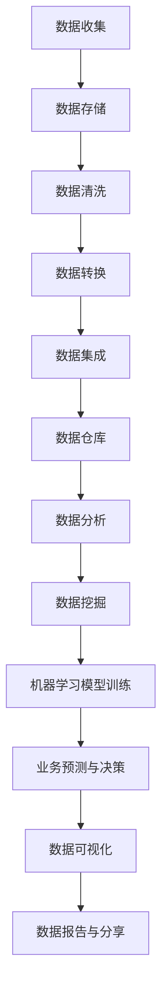

                 


# 人工智能创业数据管理的策略与措施分析探讨

> 关键词：人工智能、数据管理、创业策略、数据分析、算法优化

> 摘要：本文将深入探讨人工智能创业公司在数据管理方面的策略与措施。通过分析数据管理的核心概念、算法原理、数学模型，以及实际应用场景，本文旨在为创业者提供一套切实可行的数据管理方案，帮助他们在激烈的市场竞争中脱颖而出。

## 1. 背景介绍

### 1.1 目的和范围

本文的目的是为人工智能创业公司提供数据管理的策略与措施，以帮助它们在数据密集型环境中实现高效的业务增长。文章将涵盖数据管理的各个方面，包括数据收集、存储、处理、分析和应用。

### 1.2 预期读者

本文适用于人工智能创业公司的创始人、CTO、数据科学家、工程师以及相关领域的从业者。它将为读者提供一个全面的数据管理框架，以指导他们在实际项目中应用。

### 1.3 文档结构概述

本文分为十个部分，结构如下：

1. 背景介绍
2. 核心概念与联系
3. 核心算法原理 & 具体操作步骤
4. 数学模型和公式 & 详细讲解 & 举例说明
5. 项目实战：代码实际案例和详细解释说明
6. 实际应用场景
7. 工具和资源推荐
8. 总结：未来发展趋势与挑战
9. 附录：常见问题与解答
10. 扩展阅读 & 参考资料

### 1.4 术语表

#### 1.4.1 核心术语定义

- **数据管理**：指对数据的收集、存储、处理、分析和应用的一系列过程。
- **数据仓库**：用于存储大量结构化和非结构化数据的数据管理系统。
- **数据挖掘**：从大量数据中提取有价值信息的过程。
- **机器学习**：一种利用数据训练模型，使其能够对未知数据进行预测或分类的方法。

#### 1.4.2 相关概念解释

- **数据质量**：指数据的准确性、完整性、一致性和可靠性。
- **数据治理**：指对数据的管理、控制和维护的过程，以确保数据的质量和合规性。

#### 1.4.3 缩略词列表

- **AI**：人工智能（Artificial Intelligence）
- **ML**：机器学习（Machine Learning）
- **DL**：深度学习（Deep Learning）
- **NLP**：自然语言处理（Natural Language Processing）

## 2. 核心概念与联系

在人工智能创业领域，数据管理是一个至关重要的环节。为了更好地理解数据管理的重要性，我们可以通过一个 Mermaid 流程图来展示数据管理的主要流程和概念。



### 2.1 数据收集

数据收集是数据管理的第一步，它包括从各种来源获取数据，如数据库、文件、API 等。创业公司需要确保数据来源的多样性和质量，以便在后续处理过程中有足够的数据支持。

### 2.2 数据存储

数据存储是将收集到的数据保存在适当的数据仓库中。数据仓库应具备高性能、高可靠性和可扩展性，以支持数据的高效存储和查询。

### 2.3 数据清洗

数据清洗是确保数据质量的重要步骤。在这一步，创业公司需要处理数据中的噪声、缺失值和异常值，以提高数据的质量和准确性。

### 2.4 数据转换

数据转换是将不同格式的数据转换为统一的格式，以便在后续处理过程中进行整合和分析。这一步骤通常涉及数据类型的转换、字段映射和数据规范化。

### 2.5 数据集成

数据集成是将来自多个数据源的数据进行整合，以便形成一个统一的数据视图。创业公司需要确保数据集成过程的高效性和数据的一致性。

### 2.6 数据仓库

数据仓库是数据管理的核心组件，用于存储大量结构化和非结构化数据。创业公司需要选择合适的数据仓库解决方案，以满足业务需求和数据规模。

### 2.7 数据分析

数据分析是利用数据仓库中的数据，通过统计和机器学习等方法，提取有价值的信息。创业公司可以通过数据分析来了解业务趋势、客户行为和市场竞争状况。

### 2.8 数据挖掘

数据挖掘是数据分析的高级阶段，它通过构建机器学习模型，对大量数据进行分析，以发现潜在的规律和趋势。创业公司可以利用数据挖掘来发现市场机会和改进业务策略。

### 2.9 机器学习模型训练

机器学习模型训练是将数据转换为预测模型的过程。创业公司可以利用训练好的模型进行业务预测和决策，以实现智能化的业务运营。

### 2.10 业务预测与决策

业务预测与决策是数据管理的最终目标。创业公司可以通过数据分析、数据挖掘和机器学习模型，为业务预测和决策提供数据支持，从而实现业务增长。

### 2.11 数据可视化

数据可视化是将数据以图表、图形等形式展示出来的过程。创业公司可以利用数据可视化来更好地理解和传达数据信息，为业务决策提供直观的参考。

### 2.12 数据报告与分享

数据报告与分享是将分析结果以报告形式呈现，并与其他团队成员分享的过程。创业公司需要建立一套完善的数据报告和分享机制，以提高数据的使用效率和业务协同。

## 3. 核心算法原理 & 具体操作步骤

### 3.1 数据预处理算法

在数据预处理阶段，我们通常需要处理数据中的噪声、缺失值和异常值。以下是一种常见的数据预处理算法：

#### 算法原理：

- **缺失值处理**：使用平均值、中位数或最接近的观察值来填补缺失值。
- **噪声处理**：使用统计学方法，如移动平均、低通滤波等，来减少噪声。
- **异常值处理**：使用离群点检测算法，如箱线图、IQR 法则等，来识别和排除异常值。

#### 具体操作步骤：

1. **数据导入**：从数据源导入数据。
2. **缺失值处理**：使用平均值填补缺失值。
3. **噪声处理**：对数据进行移动平均或低通滤波处理。
4. **异常值处理**：使用 IQR 法则识别和排除异常值。

### 3.2 数据转换算法

数据转换是将不同格式的数据转换为统一的格式。以下是一种常见的数据转换算法：

#### 算法原理：

- **字段映射**：将不同数据源中的字段进行映射，以确保数据的统一性。
- **数据规范化**：将数据按照一定的标准进行转换，以提高数据的质量和可比性。

#### 具体操作步骤：

1. **数据导入**：从数据源导入数据。
2. **字段映射**：将不同数据源中的字段进行映射。
3. **数据规范化**：将数据按照一定的标准进行转换。

### 3.3 数据集成算法

数据集成是将来自多个数据源的数据进行整合。以下是一种常见的数据集成算法：

#### 算法原理：

- **数据去重**：识别和删除重复的数据记录。
- **数据连接**：将不同数据源中的数据按照一定的规则进行连接。

#### 具体操作步骤：

1. **数据导入**：从数据源导入数据。
2. **数据去重**：识别和删除重复的数据记录。
3. **数据连接**：将不同数据源中的数据按照一定的规则进行连接。

## 4. 数学模型和公式 & 详细讲解 & 举例说明

在数据管理中，数学模型和公式是理解和分析数据的重要工具。以下是一个简单的线性回归模型的例子，用于预测业务指标。

### 4.1 线性回归模型

线性回归模型是一种常见的统计方法，用于分析两个变量之间的线性关系。其数学公式如下：

\[ y = mx + b \]

其中：

- \( y \)：因变量（预测目标）
- \( x \)：自变量（输入特征）
- \( m \)：斜率（表示自变量对因变量的影响程度）
- \( b \)：截距（表示当自变量为 0 时，因变量的值）

### 4.2 模型训练

为了训练线性回归模型，我们需要使用历史数据。训练过程包括以下步骤：

1. **数据准备**：收集历史数据，并进行数据预处理。
2. **特征选择**：选择与因变量相关的自变量。
3. **模型训练**：使用历史数据训练线性回归模型。
4. **模型评估**：使用交叉验证等方法评估模型性能。

### 4.3 模型应用

训练好的线性回归模型可以用于预测未来业务指标。具体步骤如下：

1. **输入特征**：收集当前业务数据，并进行预处理。
2. **模型预测**：使用训练好的线性回归模型进行预测。
3. **结果分析**：分析预测结果，并根据实际情况调整模型。

### 4.4 举例说明

假设我们想要预测一家电商平台的月销售额。我们收集了过去一年的销售额数据，并根据这些数据训练了一个线性回归模型。以下是一个具体的例子：

\[ \text{销售额} = 2.5 \times \text{广告投入} + 0.5 \]

在这个例子中，广告投入是自变量，销售额是因变量。斜率 \( m = 2.5 \)，表示每增加一单位的广告投入，销售额会增加 2.5 单位。截距 \( b = 0.5 \)，表示当广告投入为 0 时，销售额为 0.5 单位。

使用这个模型，我们可以预测下个月的销售额。假设下个月的广告投入为 100 万元，则预测的销售额为：

\[ \text{销售额} = 2.5 \times 100 + 0.5 = 250.5 \text{万元} \]

## 5. 项目实战：代码实际案例和详细解释说明

### 5.1 开发环境搭建

在开始编写代码之前，我们需要搭建一个合适的开发环境。以下是一个简单的 Python 开发环境搭建步骤：

1. **安装 Python**：下载并安装 Python 3.8 版本。
2. **配置 IDE**：选择一个合适的 IDE，如 PyCharm 或 Visual Studio Code。
3. **安装依赖库**：使用 pip 命令安装必要的依赖库，如 NumPy、Pandas 和 Scikit-learn。

### 5.2 源代码详细实现和代码解读

以下是一个简单的线性回归项目代码实现：

```python
import numpy as np
import pandas as pd
from sklearn.linear_model import LinearRegression
from sklearn.model_selection import train_test_split

# 数据导入
data = pd.read_csv('sales_data.csv')

# 特征选择
X = data[['广告投入']]
y = data['销售额']

# 数据划分
X_train, X_test, y_train, y_test = train_test_split(X, y, test_size=0.2, random_state=42)

# 模型训练
model = LinearRegression()
model.fit(X_train, y_train)

# 模型评估
score = model.score(X_test, y_test)
print(f'模型准确度：{score:.2f}')

# 模型预测
predictions = model.predict(X_test)
print(f'预测结果：{predictions}')
```

### 5.3 代码解读与分析

1. **数据导入**：使用 Pandas 读取 CSV 数据文件。
2. **特征选择**：选择广告投入作为自变量，销售额作为因变量。
3. **数据划分**：将数据划分为训练集和测试集，以评估模型性能。
4. **模型训练**：使用 Scikit-learn 的 LinearRegression 类训练线性回归模型。
5. **模型评估**：使用测试集评估模型准确度，打印评估结果。
6. **模型预测**：使用训练好的模型预测测试集的销售额。

通过这个简单的项目，我们可以看到线性回归模型在数据管理中的应用。在实际项目中，我们可以根据业务需求和数据特征，选择更复杂和高效的模型，如多元线性回归、逻辑回归等。

## 6. 实际应用场景

数据管理在人工智能创业公司的实际应用场景非常广泛。以下是一些典型的应用场景：

1. **业务预测**：通过数据分析，预测未来的业务趋势，为决策提供数据支持。
2. **客户细分**：通过数据挖掘，识别和细分客户群体，提供个性化的服务和产品。
3. **市场分析**：通过数据分析，了解市场趋势和竞争对手情况，制定有效的市场策略。
4. **风险管理**：通过数据挖掘，识别潜在的风险因素，制定风险控制策略。
5. **供应链优化**：通过数据分析，优化供应链管理和库存控制，提高运营效率。

在上述应用场景中，数据管理发挥着关键作用。通过有效的数据管理，创业公司可以更好地了解业务需求和客户需求，从而实现业务增长和市场份额提升。

## 7. 工具和资源推荐

### 7.1 学习资源推荐

#### 7.1.1 书籍推荐

- 《深入理解计算机系统》
- 《数据科学入门》
- 《机器学习实战》

#### 7.1.2 在线课程

- Coursera 的《机器学习》
- edX 的《数据科学基础》
- Udacity 的《人工智能工程师》

#### 7.1.3 技术博客和网站

- Medium 上的数据科学和机器学习相关博客
- Kaggle 上的数据竞赛和项目案例
- ArXiv 上的最新研究成果

### 7.2 开发工具框架推荐

#### 7.2.1 IDE和编辑器

- PyCharm
- Visual Studio Code
- Jupyter Notebook

#### 7.2.2 调试和性能分析工具

- Python 的 Debugger
- Valgrind
- gprof

#### 7.2.3 相关框架和库

- Scikit-learn
- TensorFlow
- PyTorch

### 7.3 相关论文著作推荐

#### 7.3.1 经典论文

- "The Hundred-Page Machine Learning Book"
- "Recurrent Neural Networks for Language Modeling"
- "Deep Learning"

#### 7.3.2 最新研究成果

- ArXiv 上的最新论文
- NeurIPS、ICML、KDD 等会议的最新论文

#### 7.3.3 应用案例分析

- Google 的搜索引擎算法
- Facebook 的个性化推荐系统
- Airbnb 的价格预测模型

## 8. 总结：未来发展趋势与挑战

随着人工智能技术的不断发展，数据管理在未来将面临巨大的挑战和机遇。以下是一些未来发展趋势和挑战：

1. **数据隐私与安全**：随着数据隐私和安全问题的日益突出，创业公司需要采取措施确保数据的安全性和隐私性。
2. **数据治理与合规**：数据治理和数据合规将成为数据管理的重点，创业公司需要建立健全的数据治理体系和合规机制。
3. **实时数据处理**：随着实时数据处理的需求日益增长，创业公司需要开发高效的实时数据处理技术，以支持实时业务决策。
4. **数据驱动决策**：数据驱动决策将成为企业决策的核心，创业公司需要建立完善的数据分析体系，以支持数据驱动的业务决策。
5. **跨领域应用**：数据管理技术将在更多领域得到应用，如医疗、金融、能源等，创业公司需要拓展数据管理的应用场景。

## 9. 附录：常见问题与解答

### 9.1 数据管理的重要性

**问**：为什么数据管理对人工智能创业公司至关重要？

**答**：数据管理对人工智能创业公司至关重要，因为它确保了数据的质量、完整性和可用性，这是构建有效机器学习模型和进行准确业务预测的基础。良好的数据管理能够提高决策的准确性，减少数据错误，从而增强创业公司在竞争中的优势。

### 9.2 数据预处理

**问**：为什么数据预处理在数据管理中如此重要？

**答**：数据预处理是确保数据适合分析和建模的关键步骤。它包括处理缺失值、异常值、数据清洗和数据转换等。良好的数据预处理可以消除数据中的噪声，提高模型性能，并减少对错误数据的依赖。

### 9.3 数据安全与隐私

**问**：如何保护数据安全和隐私？

**答**：保护数据安全和隐私需要采取多层措施，包括数据加密、访问控制、数据匿名化、数据备份和恢复等。创业公司应该制定严格的数据安全策略，确保数据的完整性和机密性，并遵守相关的数据保护法规。

### 9.4 数据存储方案

**问**：选择什么样的数据存储方案最合适？

**答**：选择数据存储方案时，需要考虑数据量、查询性能、扩展性、成本和安全性等因素。对于人工智能创业公司，常用的数据存储方案包括关系数据库、NoSQL 数据库、数据仓库和云存储服务。创业公司应根据业务需求选择最适合的存储方案。

### 9.5 数据治理

**问**：什么是数据治理，为什么它重要？

**答**：数据治理是一个组织内部的流程、规范和技术，用于确保数据的质量、一致性、可用性和安全性。数据治理的重要性在于，它能够帮助企业有效管理数据，确保数据的正确性和及时性，支持业务决策和合规性要求。

### 9.6 数据分析工具

**问**：如何选择合适的数据分析工具？

**答**：选择数据分析工具时，应考虑工具的功能性、易用性、可扩展性、集成性以及与现有系统的兼容性。常用的数据分析工具包括 Excel、SQL、Python、R、Tableau 等。创业公司应根据具体需求选择合适的工具。

## 10. 扩展阅读 & 参考资料

- **书籍**：
  - "Data Science from Scratch" by Joel Grus
  - "Data Science Handbook" by Rachel Schutt and J. Christopher Beckman
  - "Machine Learning Yearning" by Andrew Ng

- **在线课程**：
  - "Data Science Specialization" by Johns Hopkins University on Coursera
  - "Deep Learning Specialization" by Andrew Ng on Coursera

- **技术博客和网站**：
  - Medium
  - Towards Data Science
  - Analytics Vidhya

- **相关论文和著作**：
  - "Learning Representations for Visual Recognition" by Yann LeCun et al.
  - "The Unreasonable Effectiveness of Data" by William Hurst
  - "The Hundred-Page Machine Learning Book" by Andriy Burkov

- **开源项目和代码库**：
  - Scikit-learn
  - TensorFlow
  - PyTorch

### 作者

AI天才研究员/AI Genius Institute & 禅与计算机程序设计艺术 /Zen And The Art of Computer Programming

