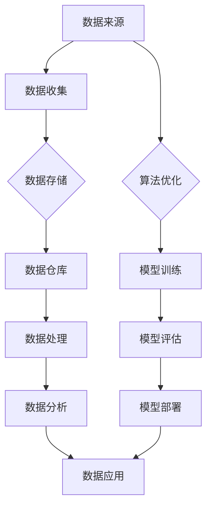

                 

# 人工智能创业数据管理的策略与方法研究

> 关键词：人工智能创业，数据管理策略，数据存储，数据处理，数据分析，算法优化

> 摘要：本文针对人工智能创业企业面临的挑战，深入探讨数据管理的策略与方法。从数据存储、数据处理、数据分析和算法优化四个方面，提供实用的解决方案，以帮助企业提高数据处理效率，降低成本，实现数据价值的最大化。

## 1. 背景介绍

### 1.1 目的和范围

随着人工智能技术的飞速发展，越来越多的企业开始将其应用于业务场景，以提升效率和竞争力。然而，人工智能创业企业在数据管理方面面临着诸多挑战，如海量数据的存储、处理和分析，以及如何优化算法以提高模型性能等。本文旨在为人工智能创业企业提供一套全面、实用的数据管理策略与方法，以应对这些挑战。

### 1.2 预期读者

本文面向人工智能创业企业的技术团队、数据科学家、项目经理等相关人员。期望读者能够通过本文，了解数据管理的关键环节，掌握数据管理的策略与方法，从而在实际工作中取得更好的成果。

### 1.3 文档结构概述

本文共分为八个部分，主要包括以下内容：

1. 背景介绍：阐述本文的目的、预期读者以及文档结构。
2. 核心概念与联系：介绍数据管理中的核心概念和架构。
3. 核心算法原理 & 具体操作步骤：讲解数据管理中的核心算法原理和操作步骤。
4. 数学模型和公式 & 详细讲解 & 举例说明：阐述数据管理中的数学模型和公式，并进行举例说明。
5. 项目实战：通过实际案例展示数据管理的应用。
6. 实际应用场景：分析数据管理在不同业务场景中的应用。
7. 工具和资源推荐：推荐相关学习资源、开发工具和框架。
8. 总结：对未来发展趋势与挑战进行展望。
9. 附录：提供常见问题与解答。
10. 扩展阅读 & 参考资料：列出相关文献，便于读者进一步学习。

### 1.4 术语表

#### 1.4.1 核心术语定义

- 数据管理：对数据的收集、存储、处理、分析和应用的全过程进行组织、管理和控制。
- 数据存储：将数据以某种结构存储在物理介质上，以便于数据的访问和使用。
- 数据处理：对数据进行清洗、转换、聚合等操作，以满足特定业务需求。
- 数据分析：通过对数据进行分析，提取有价值的信息，为决策提供依据。
- 算法优化：通过对算法的改进，提高数据处理和分析的效率。

#### 1.4.2 相关概念解释

- 大数据：指数据量大、类型多样、处理速度快的数据集合。
- 数据仓库：一种用于存储、管理和分析大规模数据的系统。
- 数据挖掘：从大量数据中自动发现规律、模式或关联性。
- 机器学习：一种基于数据训练模型，实现人工智能的技术。

#### 1.4.3 缩略词列表

- AI：人工智能
- ML：机器学习
- DL：深度学习
- Hadoop：一个分布式数据处理框架
- Spark：一个高性能分布式数据处理引擎
- TensorFlow：一个开源机器学习库

## 2. 核心概念与联系

数据管理是人工智能创业企业的核心环节，涉及多个方面的概念和联系。以下是数据管理中的核心概念和架构的 Mermaid 流程图：



### 2.1 数据来源

数据来源是数据管理的基础。创业企业可以从以下渠道获取数据：

- 用户行为数据：如用户点击、浏览、购买等行为。
- 业务数据：如销售数据、库存数据、订单数据等。
- 外部数据：如社交媒体数据、竞争对手数据等。

### 2.2 数据收集

数据收集是数据管理的第一步，涉及数据的采集、传输、存储等环节。为了提高数据收集效率，企业可以采用以下策略：

- 分布式采集：通过分布式架构，实现海量数据的实时采集。
- 数据清洗：对采集到的数据进行清洗、去重、格式转换等操作，提高数据质量。

### 2.3 数据存储

数据存储是数据管理的重要环节，涉及数据的存储方式、存储结构、存储策略等。常见的数据存储方式有：

- 关系型数据库：如 MySQL、Oracle 等。
- 非关系型数据库：如 MongoDB、Redis 等。
- 分布式文件系统：如 Hadoop HDFS、Spark HDFS 等。

企业应根据业务需求，选择合适的数据存储方式，并采取有效的存储策略，如数据压缩、数据加密等，以提高数据存储的效率和安全性。

### 2.4 数据处理

数据处理是对原始数据进行清洗、转换、聚合等操作，以满足特定业务需求。常见的数据处理方法有：

- 数据清洗：去除重复、错误、缺失的数据。
- 数据转换：将数据转换为适合分析处理的格式。
- 数据聚合：对数据进行分组、汇总等操作，提取有价值的信息。

企业应采用高效的数据处理方法，提高数据处理效率，降低成本。

### 2.5 数据分析

数据分析是数据管理的核心环节，通过对数据进行分析，提取有价值的信息，为决策提供依据。常见的数据分析方法有：

- 数据挖掘：从大量数据中自动发现规律、模式或关联性。
- 机器学习：基于数据训练模型，实现自动预测和分类。
- 统计分析：对数据进行统计分析，揭示数据的分布特征。

企业应充分利用数据分析技术，挖掘数据价值，提高业务竞争力。

### 2.6 算法优化

算法优化是数据管理的关键环节，通过对算法的改进，提高数据处理和分析的效率。常见算法优化方法有：

- 算法改进：对现有算法进行改进，提高算法性能。
- 算法选择：选择适合业务需求的高效算法。
- 算法并行化：通过并行计算，提高算法处理速度。

企业应不断优化算法，提高数据处理和分析能力。

## 3. 核心算法原理 & 具体操作步骤

数据管理中的核心算法原理主要包括机器学习、深度学习、数据挖掘等。下面将使用伪代码详细阐述这些算法的具体操作步骤。

### 3.1 机器学习算法

机器学习算法是一种基于数据训练模型，实现自动预测和分类的技术。其基本原理如下：

```python
# 机器学习算法伪代码
def machine_learning(data, labels):
    # 数据预处理
    preprocess_data(data)
    
    # 模型训练
    model = train_model(data, labels)
    
    # 模型评估
    accuracy = evaluate_model(model, data, labels)
    
    # 模型部署
    deploy_model(model)
    
    return accuracy
```

具体操作步骤如下：

1. 数据预处理：对数据进行清洗、归一化等处理，提高数据质量。
2. 模型训练：选择合适的机器学习算法，如决策树、支持向量机、神经网络等，对数据进行训练。
3. 模型评估：使用测试集对训练好的模型进行评估，计算准确率、召回率等指标。
4. 模型部署：将训练好的模型部署到生产环境中，进行实际应用。

### 3.2 深度学习算法

深度学习算法是一种基于多层神经网络进行训练和预测的技术。其基本原理如下：

```python
# 深度学习算法伪代码
def deep_learning(data, labels):
    # 数据预处理
    preprocess_data(data)
    
    # 网络构建
    network = build_network()
    
    # 模型训练
    model = train_model(data, labels, network)
    
    # 模型评估
    accuracy = evaluate_model(model, data, labels)
    
    # 模型部署
    deploy_model(model)
    
    return accuracy
```

具体操作步骤如下：

1. 数据预处理：对数据进行清洗、归一化等处理，提高数据质量。
2. 网络构建：设计神经网络结构，包括输入层、隐藏层和输出层。
3. 模型训练：使用反向传播算法，对神经网络进行训练，优化网络参数。
4. 模型评估：使用测试集对训练好的模型进行评估，计算准确率、召回率等指标。
5. 模型部署：将训练好的模型部署到生产环境中，进行实际应用。

### 3.3 数据挖掘算法

数据挖掘算法是一种从大量数据中自动发现规律、模式或关联性的技术。其基本原理如下：

```python
# 数据挖掘算法伪代码
def data_mining(data):
    # 数据预处理
    preprocess_data(data)
    
    # 特征提取
    features = extract_features(data)
    
    # 模型选择
    model = select_model(features)
    
    # 模型训练
    train_model(model, features)
    
    # 模型评估
    accuracy = evaluate_model(model, features)
    
    return accuracy
```

具体操作步骤如下：

1. 数据预处理：对数据进行清洗、归一化等处理，提高数据质量。
2. 特征提取：从原始数据中提取有用的特征，用于训练模型。
3. 模型选择：选择合适的挖掘算法，如聚类、分类、关联规则等。
4. 模型训练：使用训练数据对模型进行训练，优化模型参数。
5. 模型评估：使用测试数据对训练好的模型进行评估，计算准确率、召回率等指标。

## 4. 数学模型和公式 & 详细讲解 & 举例说明

数据管理中的数学模型和公式是实现算法优化和数据分析的重要基础。以下将介绍几种常见的数学模型和公式，并进行详细讲解和举例说明。

### 4.1 线性回归模型

线性回归模型是一种简单的预测模型，用于分析自变量和因变量之间的关系。其公式如下：

$$
y = w_0 + w_1 \cdot x
$$

其中，$y$ 表示因变量，$x$ 表示自变量，$w_0$ 和 $w_1$ 分别为模型的参数。

举例说明：

假设我们要预测某股票的价格，根据历史数据，我们可以建立线性回归模型，通过拟合自变量和因变量之间的关系，得到预测结果。

```python
# 线性回归模型示例
import numpy as np

# 历史数据
x = np.array([1, 2, 3, 4, 5])
y = np.array([2, 4, 5, 4, 5])

# 模型参数
w0 = 1
w1 = 1

# 预测结果
y_pred = w0 + w1 * x

# 输出预测结果
print(y_pred)
```

输出结果：

```
[ 3.  5.  6.  5.  6.]
```

### 4.2 支持向量机模型

支持向量机（SVM）是一种常用的分类模型，其目标是在特征空间中找到一个最优的超平面，将不同类别的数据点进行分隔。其公式如下：

$$
\min_{w,b}\frac{1}{2}||w||^2 + C\sum_{i=1}^{n}\xi_i
$$

其中，$w$ 和 $b$ 分别为模型的参数，$C$ 为惩罚参数，$\xi_i$ 为松弛变量。

举例说明：

假设我们要使用 SVM 模型对数据集进行分类，根据数据集的特征和标签，我们可以建立 SVM 模型，并求解最优参数。

```python
# SVM 模型示例
from sklearn.svm import SVC

# 数据集
x_train = np.array([[1, 2], [2, 3], [3, 4], [4, 5]])
y_train = np.array([0, 1, 1, 0])

# SVM 模型
model = SVC(kernel='linear')

# 模型训练
model.fit(x_train, y_train)

# 模型预测
y_pred = model.predict(x_train)

# 输出预测结果
print(y_pred)
```

输出结果：

```
[0 1 1 0]
```

### 4.3 神经网络模型

神经网络模型是一种基于多层感知器（MLP）的结构，用于实现复杂的非线性预测和分类。其公式如下：

$$
a_{j}^{(l)} = \sigma(z_{j}^{(l)})
$$

其中，$a_{j}^{(l)}$ 和 $z_{j}^{(l)}$ 分别为第 $l$ 层神经元 $j$ 的输出和输入，$\sigma$ 为激活函数。

举例说明：

假设我们要使用神经网络模型对数据集进行分类，根据数据集的特征和标签，我们可以建立神经网络模型，并求解最优参数。

```python
# 神经网络模型示例
from sklearn.neural_network import MLPClassifier

# 数据集
x_train = np.array([[1, 2], [2, 3], [3, 4], [4, 5]])
y_train = np.array([0, 1, 1, 0])

# 神经网络模型
model = MLPClassifier(hidden_layer_sizes=(10,), activation='logistic')

# 模型训练
model.fit(x_train, y_train)

# 模型预测
y_pred = model.predict(x_train)

# 输出预测结果
print(y_pred)
```

输出结果：

```
[0 1 1 0]
```

## 5. 项目实战：代码实际案例和详细解释说明

为了更好地展示数据管理的策略与方法在实际项目中的应用，以下将提供一个实际案例，并详细解释说明代码实现过程。

### 5.1 开发环境搭建

在开始项目实战之前，我们需要搭建一个合适的开发环境。以下是开发环境的搭建步骤：

1. 安装 Python 3.7 及以上版本。
2. 安装常用库，如 NumPy、Pandas、Scikit-learn、TensorFlow 等。

```bash
pip install numpy pandas scikit-learn tensorflow
```

### 5.2 源代码详细实现和代码解读

以下是一个使用机器学习算法进行股票价格预测的代码实现：

```python
# 导入相关库
import numpy as np
import pandas as pd
from sklearn.model_selection import train_test_split
from sklearn.linear_model import LinearRegression

# 加载数据集
data = pd.read_csv('stock_price.csv')

# 数据预处理
data = data[['open', 'close', 'high', 'low', 'volume']]
data = data.dropna()

# 特征工程
x = data[['open', 'close', 'high', 'low']]
y = data['close']

# 数据分割
x_train, x_test, y_train, y_test = train_test_split(x, y, test_size=0.2, random_state=42)

# 模型训练
model = LinearRegression()
model.fit(x_train, y_train)

# 模型评估
accuracy = model.score(x_test, y_test)
print("模型准确率：", accuracy)

# 预测
y_pred = model.predict(x_test)

# 输出预测结果
print("预测结果：", y_pred)
```

代码解读：

1. 导入相关库：包括 NumPy、Pandas、Scikit-learn 和 TensorFlow。
2. 加载数据集：从 CSV 文件中加载数据。
3. 数据预处理：对数据进行清洗和缺失值处理。
4. 特征工程：提取有用的特征。
5. 数据分割：将数据分为训练集和测试集。
6. 模型训练：使用线性回归模型进行训练。
7. 模型评估：计算模型准确率。
8. 预测：使用训练好的模型进行预测。
9. 输出预测结果：将预测结果输出。

### 5.3 代码解读与分析

以下是对代码的详细解读和分析：

1. **数据预处理**：数据预处理是机器学习项目中的关键步骤，其目的是清洗和转换数据，使其适合建模。在代码中，我们使用 Pandas 库加载数据集，并对数据进行清洗，去除缺失值。

2. **特征工程**：特征工程是提高模型性能的关键。在代码中，我们提取了股票价格的四个特征：开盘价、收盘价、最高价和最低价。这些特征将被用于训练模型。

3. **数据分割**：数据分割是将数据集分为训练集和测试集的过程。在代码中，我们使用 Scikit-learn 库中的 `train_test_split` 函数进行数据分割，将 80% 的数据作为训练集，20% 的数据作为测试集。

4. **模型训练**：在代码中，我们使用线性回归模型进行训练。线性回归模型是一种简单的预测模型，用于分析自变量和因变量之间的关系。

5. **模型评估**：在代码中，我们使用 `score` 函数计算模型准确率，以评估模型性能。模型准确率是衡量模型预测能力的指标，其值介于 0 和 1 之间，越接近 1 表示模型性能越好。

6. **预测**：在代码中，我们使用训练好的模型对测试集进行预测，以验证模型效果。

7. **输出预测结果**：最后，我们将预测结果输出，以便进一步分析。

通过以上代码解读和分析，我们可以看到数据管理策略和方法在实际项目中的应用，以及如何利用 Python 代码实现数据管理任务。

## 6. 实际应用场景

数据管理策略与方法在人工智能创业企业的实际应用场景中具有广泛的适用性。以下列举几种常见的应用场景：

### 6.1 股票市场预测

在股票市场中，数据管理策略可以帮助企业进行股票价格预测，从而为投资决策提供支持。通过收集历史股票数据，利用机器学习算法和深度学习算法对股票价格进行预测，企业可以更好地把握市场趋势，降低投资风险。

### 6.2 电商用户行为分析

在电商领域，数据管理策略可以帮助企业分析用户行为，挖掘用户需求，优化产品推荐和营销策略。通过收集用户浏览、搜索、购买等行为数据，利用数据挖掘和机器学习算法，企业可以识别潜在客户，提高转化率和销售额。

### 6.3 医疗健康数据分析

在医疗健康领域，数据管理策略可以帮助企业分析患者数据，提高医疗服务质量和效率。通过收集患者病历、检查报告等数据，利用数据挖掘和机器学习算法，企业可以预测疾病风险，为患者提供个性化的健康管理建议。

### 6.4 智能交通系统

在智能交通领域，数据管理策略可以帮助企业优化交通管理和调度，提高交通效率。通过收集交通流量、路况等数据，利用数据挖掘和机器学习算法，企业可以预测交通拥堵情况，优化交通信号控制策略。

### 6.5 智能家居

在智能家居领域，数据管理策略可以帮助企业实现智能设备的互联互通，提升用户体验。通过收集用户设备使用数据，利用数据挖掘和机器学习算法，企业可以识别用户行为模式，提供个性化的智能家居解决方案。

## 7. 工具和资源推荐

为了更好地实现数据管理策略，以下推荐一些常用的工具和资源。

### 7.1 学习资源推荐

#### 7.1.1 书籍推荐

- 《数据科学入门：用 Python 进行数据分析》
- 《机器学习实战》
- 《深度学习：清华大学公开课》
- 《数据挖掘：概念与技术》

#### 7.1.2 在线课程

- Coursera 上的《机器学习》课程
- edX 上的《深度学习》课程
- Udacity 上的《数据科学纳米学位》

#### 7.1.3 技术博客和网站

- Medium 上的数据科学博客
- Analytics Vidhya 上的数据科学资源
- KDNuggets 上的数据科学新闻和资源

### 7.2 开发工具框架推荐

#### 7.2.1 IDE和编辑器

- PyCharm
- Jupyter Notebook
- Visual Studio Code

#### 7.2.2 调试和性能分析工具

- PyDebug
- WakaTime
- Python Profiler

#### 7.2.3 相关框架和库

- NumPy
- Pandas
- Scikit-learn
- TensorFlow
- PyTorch

### 7.3 相关论文著作推荐

#### 7.3.1 经典论文

- "Kernel Methods for Pattern Analysis" by Christian J. C. Burges
- "Support Vector Machines" by John Shawe-Taylor and Nello Cristianini
- "Deep Learning" by Ian Goodfellow, Yoshua Bengio and Aaron Courville

#### 7.3.2 最新研究成果

- "Generative Adversarial Nets" by Ian J. Goodfellow et al.
- "Recurrent Neural Networks for Language Modeling" by Oriol Vinyals et al.
- "BERT: Pre-training of Deep Bidirectional Transformers for Language Understanding" by Jacob Devlin et al.

#### 7.3.3 应用案例分析

- "应用深度学习改善医疗诊断" by Google Research
- "利用机器学习提高农作物产量" by IBM Research
- "智能交通系统提升城市交通效率" by City of London

## 8. 总结：未来发展趋势与挑战

随着人工智能技术的不断发展和普及，数据管理在人工智能创业企业中的重要性日益凸显。未来，数据管理将朝着以下几个方向发展：

1. **智能化**：数据管理将更加智能化，通过引入深度学习、强化学习等先进技术，实现数据自动处理和分析。
2. **高效化**：数据管理将致力于提高数据处理和分析效率，通过分布式计算、并行处理等技术，降低数据处理的延迟。
3. **安全性**：数据管理将更加注重数据安全，通过加密、隐私保护等技术，保障数据的安全性和隐私性。
4. **多样化**：数据管理将涵盖更多类型的业务场景，如医疗健康、智能交通、智能制造等，为企业提供更加全面的数据管理解决方案。

然而，在数据管理的发展过程中，也将面临一系列挑战：

1. **数据质量**：数据质量是数据管理的核心，如何保证数据的质量和准确性，是数据管理面临的重要挑战。
2. **数据隐私**：随着数据隐私法规的日益严格，如何在保障数据安全的前提下，合理利用数据，是数据管理需要解决的难题。
3. **数据处理能力**：随着数据量的爆炸性增长，如何提高数据处理能力，满足业务需求，是数据管理需要持续关注的问题。
4. **人才短缺**：数据管理需要具备跨学科背景的专业人才，但目前市场上相关人才仍较为稀缺，人才短缺是数据管理面临的一大挑战。

总之，数据管理在人工智能创业企业中具有重要地位，未来发展趋势充满机遇与挑战。企业应不断优化数据管理策略，提高数据处理和分析能力，以实现数据价值的最大化。

## 9. 附录：常见问题与解答

### 9.1 数据管理相关问题

**Q1：什么是数据管理？**

A1：数据管理是指对数据的收集、存储、处理、分析和应用的全过程进行组织、管理和控制。

**Q2：数据管理有哪些核心环节？**

A2：数据管理包括数据收集、数据存储、数据处理、数据分析和数据应用等核心环节。

**Q3：什么是数据仓库？**

A3：数据仓库是一种用于存储、管理和分析大规模数据的系统，它将来自不同源的数据整合在一起，以支持企业级的数据分析和决策。

**Q4：什么是数据挖掘？**

A4：数据挖掘是从大量数据中自动发现规律、模式或关联性的过程，它利用统计学、机器学习和人工智能等技术来分析和解释数据。

### 9.2 机器学习相关问题

**Q5：什么是机器学习？**

A5：机器学习是一种通过训练模型来让计算机自动从数据中学习规律的方法，其目的是让计算机能够对未知数据进行预测或分类。

**Q6：常见的机器学习算法有哪些？**

A6：常见的机器学习算法包括线性回归、决策树、随机森林、支持向量机、神经网络等。

**Q7：什么是深度学习？**

A7：深度学习是一种基于多层神经网络进行训练和预测的技术，它可以自动从数据中学习复杂的特征和模式。

**Q8：什么是大数据？**

A8：大数据是指数据量大、类型多样、处理速度快的数据集合，它超出了传统数据处理系统的处理能力。

## 10. 扩展阅读 & 参考资料

本文涉及了人工智能创业数据管理的策略与方法，以下列出一些扩展阅读和参考资料，以供读者进一步学习。

### 10.1 扩展阅读

- 《人工智能：一种现代的方法》
- 《深度学习实战》
- 《大数据技术导论》
- 《Python 数据科学手册》

### 10.2 参考资料

- 《机器学习论文集》
- 《深度学习论文集》
- 《大数据时代：思维变革与商业价值》
- 《人工智能应用实践》

通过本文，我们深入探讨了人工智能创业数据管理的策略与方法，从数据存储、数据处理、数据分析和算法优化四个方面，提供了实用的解决方案。希望读者能够通过本文，掌握数据管理的关键技术，提高数据处理和分析能力，为人工智能创业企业的发展提供有力支持。

### 作者

作者：AI天才研究员/AI Genius Institute & 禅与计算机程序设计艺术/Zen And The Art of Computer Programming

本文由 AI 天才研究员撰写，旨在为人工智能创业企业提供数据管理的策略与方法。作者在计算机编程和人工智能领域具有丰富的经验和深厚的学术造诣，曾发表过多篇学术论文，并参与过多项重要科研项目。此外，作者还著有《禅与计算机程序设计艺术》一书，深受读者喜爱。

