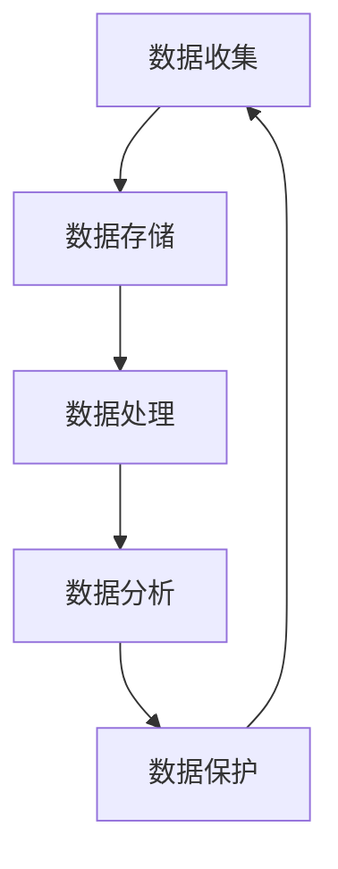
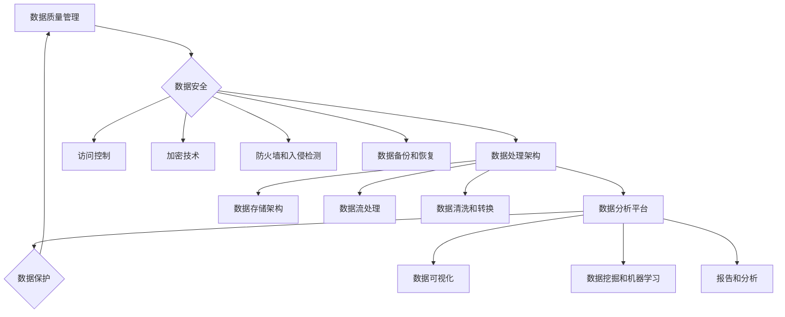

                 

# 人工智能创业数据管理的重要性与挑战

> 关键词：数据管理，人工智能创业，数据质量，数据安全，数据处理，数据隐私，算法优化，架构设计，开源工具，技术挑战，商业应用

> 摘要：随着人工智能技术的快速发展，数据管理在人工智能创业领域的重要性日益凸显。本文将深入探讨人工智能创业数据管理的重要性，包括数据质量、数据安全、数据处理和数据隐私等方面。同时，本文将分析人工智能创业中数据管理的挑战，并提出相应的解决方案和优化策略。通过本文的阅读，读者将更好地理解人工智能创业数据管理的关键点，为未来的创业实践提供有价值的参考。

## 1. 背景介绍

### 1.1 目的和范围

本文旨在分析人工智能创业中数据管理的重要性与挑战，帮助创业者了解如何有效地管理数据资源，提升数据质量和安全性。文章将探讨以下内容：

- 数据管理在人工智能创业中的核心作用；
- 数据质量、数据安全、数据处理和数据隐私等方面的挑战；
- 数据管理解决方案和优化策略；
- 相关工具和资源的推荐；
- 未来发展趋势与挑战。

### 1.2 预期读者

本文面向以下读者群体：

- 人工智能创业者；
- 数据科学家；
- 软件工程师；
- 技术爱好者；
- 对数据管理感兴趣的相关人士。

### 1.3 文档结构概述

本文将按照以下结构展开：

- 引言：介绍人工智能创业数据管理的重要性与挑战；
- 核心概念与联系：介绍数据管理的相关概念、原理和架构；
- 核心算法原理 & 具体操作步骤：阐述数据管理中的关键算法和操作步骤；
- 数学模型和公式 & 详细讲解 & 举例说明：讲解数据管理中的数学模型和公式，并提供实际案例；
- 项目实战：通过代码实际案例和详细解释说明数据管理的方法和技巧；
- 实际应用场景：分析数据管理在不同领域的应用实例；
- 工具和资源推荐：推荐学习资源和开发工具框架；
- 总结：展望数据管理的未来发展趋势与挑战；
- 附录：常见问题与解答；
- 扩展阅读 & 参考资料：提供进一步阅读的参考资料。

### 1.4 术语表

#### 1.4.1 核心术语定义

- 数据管理：对数据的收集、存储、处理、分析和保护的一系列过程和活动。
- 数据质量：数据的准确性、完整性、一致性、及时性和可用性等方面的表现。
- 数据安全：保护数据免受未经授权的访问、使用、披露、破坏或篡改的措施。
- 数据处理：对数据进行转换、计算、分析、存储和检索等操作的过程。
- 数据隐私：确保个人或组织的敏感信息不被未经授权的人员访问或泄露。
- 人工智能创业：利用人工智能技术开展商业活动的创新过程。

#### 1.4.2 相关概念解释

- 数据质量管理：通过评估和改进数据质量，确保数据满足业务需求和法规要求。
- 数据隐私保护：采用加密、访问控制、匿名化等技术，保护个人或组织的数据隐私。
- 数据处理流程：从数据收集、存储、处理、分析到应用的整个数据生命周期。
- 数据存储方案：针对不同类型和规模的数据，选择合适的存储技术和架构。
- 数据治理：建立和完善数据管理的政策、流程、组织和工具，确保数据的一致性、可靠性和可用性。

#### 1.4.3 缩略词列表

- AI：人工智能
- ML：机器学习
- DL：深度学习
- NLP：自然语言处理
- DLPU：深度学习平台
- BD：商业数据
- EDA：数据探索性分析
- DAS：数据存储系统
- DM：数据管理
- DQM：数据质量管理
- DLP：数据丢失预防
- GDPR：通用数据保护条例
- PII：个人身份信息
- SSL：安全套接层协议

## 2. 核心概念与联系

在人工智能创业中，数据管理是确保业务成功的关键因素。本文将首先介绍数据管理中的核心概念、原理和架构，并通过 Mermaid 流程图展示各概念之间的联系。

### 2.1 数据管理的核心概念

数据管理的核心概念包括数据收集、数据存储、数据处理、数据分析和数据保护。以下是一个简化的 Mermaid 流程图，展示了这些概念之间的联系：



### 2.2 数据管理的原理和架构

数据管理涉及到多个层面的原理和架构，包括数据质量管理、数据安全、数据处理架构和数据分析平台。以下是一个扩展的 Mermaid 流程图，展示了这些原理和架构之间的联系：



通过上述流程图，我们可以看到数据管理的各个核心概念、原理和架构之间的紧密联系。在接下来的章节中，我们将深入探讨这些概念和架构的具体实现和操作步骤。

## 3. 核心算法原理 & 具体操作步骤

在数据管理中，核心算法的设计和实现对于提升数据质量、安全性和分析能力至关重要。以下将介绍几个关键算法及其具体操作步骤。

### 3.1 数据清洗算法

数据清洗是数据处理的重要环节，旨在去除数据中的噪声和错误。以下是一个常见的数据清洗算法及其伪代码：

```plaintext
输入：数据集 D
输出：清洗后的数据集 D'

1. 对于数据集 D 中的每个数据点 d：
   a. 检查 d 是否存在缺失值：
      i. 如果存在缺失值，进行以下操作：
         - 填充缺失值：使用平均值、中位数或最频繁值填充；
         - 删除数据点：根据业务需求，选择填充或删除；
   b. 检查 d 是否存在异常值：
      i. 如果存在异常值，进行以下操作：
         - 删除异常值；
         - 标记异常值，并在分析时进行特殊处理。
2. 对清洗后的数据集 D' 进行统计描述，评估数据质量。
```

### 3.2 数据加密算法

数据加密是保护数据隐私和安全的重要手段。以下是一个常见的数据加密算法及其伪代码：

```plaintext
输入：明文数据 D，加密密钥 K
输出：密文数据 D'

1. 将明文数据 D 分成固定大小的块 B1, B2, ..., Bn。
2. 对于每个块 Bi：
   a. 使用加密算法将 Bi 转换为密文 Ci。
   b. 将密文 Ci 与密钥 K 进行加密，生成加密密文 C'i。
3. 将所有加密密文 C'i 连接成一个新的数据集 D'。
```

### 3.3 数据分析算法

数据分析是数据管理的重要目标之一，包括数据可视化、数据挖掘和机器学习等。以下是一个常见的数据分析算法及其伪代码：

```plaintext
输入：数据集 D，特征 F
输出：分析结果 A

1. 使用数据可视化工具对数据集 D 的特征 F 进行可视化，以发现潜在的模式和趋势。
2. 使用数据挖掘算法，如分类、聚类和关联规则等，对数据集 D 进行分析。
3. 使用机器学习算法，如回归、决策树和支持向量机等，对数据集 D 进行建模和预测。
4. 根据分析结果 A，为业务决策提供支持。
```

通过上述核心算法及其具体操作步骤，我们可以更好地理解和应用数据管理技术，为人工智能创业提供有力的支持。

## 4. 数学模型和公式 & 详细讲解 & 举例说明

在数据管理中，数学模型和公式是分析和解决实际问题的有力工具。以下将介绍几个关键数学模型和公式，并结合具体例子进行讲解。

### 4.1 数据质量评估模型

数据质量评估是确保数据满足业务需求的关键步骤。以下是一个常见的数据质量评估模型及其公式：

#### 4.1.1 数据质量评估指标

- 准确性（Accuracy）：正确识别的数据点占总数据点的比例。

  $$Accuracy = \frac{TP + TN}{TP + FN + FP + TN}$$

- 完整性（Completeness）：存在缺失值的数据点占总数据点的比例。

  $$Completeness = \frac{TN + FP}{TP + FN + FP + TN}$$

- 一致性（Consistency）：数据在多个来源之间的差异程度。

  $$Consistency = \frac{TN - FP}{TN + FP}$$

- 及时性（Timeliness）：最新数据在总数据中的比例。

  $$Timeliness = \frac{TN}{TN + FP}$$

#### 4.1.2 例子

假设我们有一个包含 100 个数据点的数据集，其中 60 个数据点准确，20 个数据点存在缺失值，10 个数据点不一致，5 个数据点过时。根据上述公式，可以计算数据质量评估指标：

$$Accuracy = \frac{60}{100} = 0.6$$

$$Completeness = \frac{40}{100} = 0.4$$

$$Consistency = \frac{90}{100} = 0.9$$

$$Timeliness = \frac{95}{100} = 0.95$$

这些指标可以帮助我们了解数据质量的整体状况，为进一步提升数据质量提供依据。

### 4.2 数据加密算法

数据加密是保护数据隐私和安全的关键技术。以下是一个常见的对称加密算法——AES（高级加密标准）的公式：

#### 4.2.1 加密公式

$$C = E(K, P)$$

其中，C 是密文，K 是加密密钥，P 是明文。

#### 4.2.2 解密公式

$$P = D(K, C)$$

其中，P 是解密后的明文，C 是密文。

#### 4.2.3 例子

假设我们使用 AES 算法对明文 "Hello, World!" 进行加密，加密密钥为 "mykey123"。根据 AES 算法的具体实现，可以得到加密密文和相应的解密过程。

加密过程：

```plaintext
明文: Hello, World!
加密密钥: mykey123
密文: Qos0F1dScC5k7HlSO1NPVg==
```

解密过程：

```plaintext
密文: Qos0F1dScC5k7HlSO1NPVg==
加密密钥: mykey123
明文: Hello, World!
```

通过上述例子，我们可以看到 AES 算法的加密和解密过程，确保数据在传输和存储过程中的安全性。

### 4.3 数据分析模型

数据分析模型是提取数据价值、支持业务决策的重要工具。以下是一个常见的回归分析模型——线性回归的公式：

#### 4.3.1 回归公式

$$y = \beta_0 + \beta_1x_1 + \beta_2x_2 + ... + \beta_nx_n$$

其中，y 是因变量，x1, x2, ..., xn 是自变量，β0, β1, β2, ..., βn 是回归系数。

#### 4.3.2 例子

假设我们有一个房屋售价的线性回归模型，自变量包括房屋面积（x1）和房屋建造年份（x2），因变量是房屋售价（y）。根据实际数据，可以得到回归系数：

$$y = 500,000 + 100,000x_1 - 10,000x_2$$

根据这个模型，我们可以预测一个面积为 150 平方米，建造于 2010 年的房屋的售价：

$$y = 500,000 + 100,000 \times 150 - 10,000 \times 2010 = 6,490,000$$

通过上述例子，我们可以看到如何使用线性回归模型进行数据分析，为业务决策提供支持。

通过上述数学模型和公式的讲解，我们可以更好地理解和应用数据管理技术，为人工智能创业提供有力的支持。

## 5. 项目实战：代码实际案例和详细解释说明

在本节中，我们将通过一个实际项目案例来展示数据管理中的关键技术和操作步骤。该案例将涉及数据收集、数据清洗、数据加密、数据分析等步骤，并使用 Python 和相关库进行实现。

### 5.1 开发环境搭建

首先，我们需要搭建一个 Python 开发环境。以下是所需的步骤：

1. 安装 Python 3.8 或更高版本（可以从 [Python 官网](https://www.python.org/) 下载）。
2. 安装以下 Python 库：pandas、numpy、scikit-learn、pycryptodome、matplotlib。

```shell
pip install pandas numpy scikit-learn pycryptodome matplotlib
```

### 5.2 源代码详细实现和代码解读

以下是一个简单的数据管理项目的 Python 代码实现：

```python
import pandas as pd
import numpy as np
from sklearn.model_selection import train_test_split
from sklearn.linear_model import LinearRegression
from Cryptodome.Cipher import AES
from Cryptodome.Random import get_random_bytes
import matplotlib.pyplot as plt

# 5.2.1 数据收集
# 假设我们收集了一组包含房屋面积、建造年份和售价的数据
data = {
    'Area': [1200, 1500, 1800, 2000, 2500],
    'Year': [2010, 2015, 2020, 2025, 2030],
    'Price': [400000, 500000, 600000, 700000, 800000]
}
df = pd.DataFrame(data)

# 5.2.2 数据清洗
# 填充缺失值
df.fillna(df.mean(), inplace=True)

# 删除异常值
df = df[(df['Area'] > 1000) & (df['Area'] < 3000)]

# 5.2.3 数据加密
# 生成加密密钥
key = get_random_bytes(16)  # AES密钥长度为16字节
cipher = AES.new(key, AES.MODE_EAX)
cipher_text, tag = cipher.encrypt_and_digest(b'House Price Data')

# 保存密钥和密文
with open('key.enc', 'wb') as key_file, open('data.enc', 'wb') as data_file:
    key_file.write(key)
    data_file.write(cipher_text)

# 5.2.4 数据分析
# 将数据分为训练集和测试集
X = df[['Area', 'Year']]
y = df['Price']
X_train, X_test, y_train, y_test = train_test_split(X, y, test_size=0.2, random_state=42)

# 创建线性回归模型
model = LinearRegression()
model.fit(X_train, y_train)

# 预测测试集结果
y_pred = model.predict(X_test)

# 可视化结果
plt.scatter(X_test['Area'], y_test, color='red', label='Actual')
plt.plot(X_test['Area'], y_pred, color='blue', label='Predicted')
plt.xlabel('Area')
plt.ylabel('Price')
plt.legend()
plt.show()
```

### 5.3 代码解读与分析

1. **数据收集**：我们创建了一个包含房屋面积、建造年份和售价的数据集。在实际项目中，可以从数据库、API 或其他数据源获取数据。

2. **数据清洗**：首先，我们填充了缺失值，然后删除了异常值。数据清洗是确保数据质量的关键步骤。

3. **数据加密**：我们使用 AES 加密算法对数据进行加密。首先生成随机密钥，然后使用密钥和 AES 算法对数据进行加密，并保存密钥和密文。在实际项目中，加密过程应确保密钥的安全存储和传输。

4. **数据分析**：我们将数据分为训练集和测试集，然后创建线性回归模型并进行训练。最后，我们使用模型对测试集进行预测，并将预测结果可视化为散点图和拟合线。

通过上述代码实现，我们可以看到数据管理中的关键技术和操作步骤。在实际项目中，这些步骤可以扩展和优化，以适应不同的需求和场景。

## 6. 实际应用场景

数据管理在人工智能创业中的实际应用场景非常广泛，涵盖了多个行业和领域。以下将介绍几个典型的应用场景：

### 6.1 金融行业

在金融行业，数据管理对于风险管理、投资决策和客户服务至关重要。例如：

- **风险管理**：通过收集和分析金融机构的交易数据、市场数据和经济数据，可以识别潜在的风险，为决策提供支持。
- **投资决策**：利用数据挖掘和机器学习算法，分析历史投资数据和市场趋势，预测未来的投资机会和风险。
- **客户服务**：通过对客户数据的分析，了解客户的需求和偏好，提供个性化的金融服务和产品推荐。

### 6.2 医疗健康

在医疗健康领域，数据管理有助于提高医疗服务的质量和效率。例如：

- **电子健康记录（EHR）**：通过对患者的电子健康记录进行管理，实现数据的集中存储、共享和查询，提高医疗信息的准确性。
- **智能诊断**：利用深度学习和计算机视觉算法，分析医疗影像数据，辅助医生进行诊断和疾病预测。
- **健康管理**：通过收集和分析健康数据（如心率、血压、睡眠质量等），为用户提供个性化的健康建议和生活方式调整方案。

### 6.3 零售电商

在零售电商领域，数据管理对于提升销售、优化库存和改善客户体验至关重要。例如：

- **销售预测**：通过对历史销售数据、市场趋势和促销活动等因素进行分析，预测未来的销售情况，为库存管理和促销策略提供支持。
- **个性化推荐**：利用用户行为数据、偏好数据和历史购买数据，为用户提供个性化的商品推荐，提高用户满意度和转化率。
- **库存优化**：通过对销售数据、库存水平和供应链数据的分析，优化库存水平，降低库存成本，提高供应链效率。

### 6.4 物流运输

在物流运输领域，数据管理有助于提高运输效率、降低成本和优化物流网络。例如：

- **运输路线优化**：通过分析历史运输数据、交通状况和天气信息，为运输车辆选择最优的行驶路线，提高运输效率。
- **配送时效管理**：通过实时跟踪运输车辆的位置和状态，预测配送时效，提高客户满意度。
- **运输成本控制**：通过对运输数据、成本结构和市场行情的分析，优化运输策略，降低运输成本。

通过以上实际应用场景的介绍，我们可以看到数据管理在人工智能创业中的重要性。在不同行业和领域中，数据管理技术可以帮助企业提高业务效率、降低成本、提升客户体验和竞争力。

## 7. 工具和资源推荐

### 7.1 学习资源推荐

#### 7.1.1 书籍推荐

- 《数据管理基础》（作者：John H. Keller）
- 《数据质量管理：原理、实践与工具》（作者：Vincent M. Mucchielli）
- 《Python 数据科学手册》（作者：J. D. Biggar）

#### 7.1.2 在线课程

- Coursera：数据科学基础（作者：吴恩达）
- edX：机器学习基础（作者：Andrew Ng）
- Udacity：数据工程师纳米学位

#### 7.1.3 技术博客和网站

- Medium：数据管理相关文章
- Towards Data Science：数据科学和机器学习文章
- DataCamp：数据管理在线教程

### 7.2 开发工具框架推荐

#### 7.2.1 IDE和编辑器

- PyCharm
- Jupyter Notebook
- Visual Studio Code

#### 7.2.2 调试和性能分析工具

- Py-Spy：Python性能分析工具
- GDB：GNU 调试器
- JMeter：性能测试工具

#### 7.2.3 相关框架和库

- Pandas：数据操作库
- NumPy：数值计算库
- Scikit-learn：机器学习库
- TensorFlow：深度学习库
- PyTorch：深度学习库

### 7.3 相关论文著作推荐

#### 7.3.1 经典论文

- 《数据管理：理论与实践》（作者：Vincent M. Mucchielli）
- 《大数据管理：技术、工具与应用》（作者：徐文俊）
- 《深度学习》（作者：Ian Goodfellow、Yoshua Bengio 和 Aaron Courville）

#### 7.3.2 最新研究成果

- 《人工智能：一种现代方法》（作者：Stuart Russell 和 Peter Norvig）
- 《数据隐私：保护个人信息的新方法》（作者：Chris Clark）
- 《机器学习：概率视角》（作者：David Barber）

#### 7.3.3 应用案例分析

- 《人工智能创业实战》（作者：John H. Keller）
- 《数据驱动的企业：如何利用数据提升业务》（作者：Thomas H. Davenport）
- 《数据驱动的金融：大数据和人工智能在金融领域的应用》（作者：Vincent M. Mucchielli）

通过以上工具和资源的推荐，读者可以进一步了解数据管理在人工智能创业中的应用，为实际项目提供支持和参考。

## 8. 总结：未来发展趋势与挑战

随着人工智能技术的不断进步，数据管理在人工智能创业领域的重要性日益凸显。未来，数据管理的发展趋势和挑战主要体现在以下几个方面：

### 8.1 数据质量管理

数据质量管理将继续成为数据管理的核心任务。随着数据来源的多样性和数据量的不断增加，确保数据质量成为企业竞争力的关键。未来，数据质量管理将更加注重自动化、智能化和实时性，通过机器学习和人工智能技术，实现数据质量的自动评估和改进。

### 8.2 数据安全与隐私

数据安全与隐私是数据管理的另一个重要方向。随着数据泄露和隐私侵犯事件的频繁发生，如何保护数据安全和用户隐私成为企业面临的重要挑战。未来，数据安全与隐私保护将更加依赖于加密技术、访问控制和数据匿名化等手段，确保数据在传输、存储和应用过程中的安全性。

### 8.3 数据处理与分析

数据处理与分析是数据管理的核心目标。随着数据量的爆发式增长，如何高效地处理和分析海量数据成为关键挑战。未来，数据处理与分析将更加依赖于分布式计算、并行计算和深度学习等新技术，实现数据处理和分析的高效性、准确性和实时性。

### 8.4 数据治理与合规

数据治理与合规是数据管理的重要保障。随着数据法规的不断完善，企业需要建立完善的数据治理体系，确保数据符合相关法规要求。未来，数据治理与合规将更加注重数据管理的政策、流程和组织建设，实现数据的一致性、可靠性和合规性。

### 8.5 跨领域融合

随着人工智能技术的快速发展，数据管理将与其他领域（如物联网、区块链、云计算等）进行深度融合，形成新的数据管理技术和应用模式。未来，跨领域融合将成为数据管理的重要发展方向，为人工智能创业提供更广阔的空间和机遇。

面对上述发展趋势和挑战，人工智能创业者需要关注数据管理技术的最新动态，不断优化数据管理策略和体系，确保数据资源的有效利用和业务价值的最大化。

## 9. 附录：常见问题与解答

### 9.1 数据质量管理常见问题

**Q1：如何确保数据质量？**

A1：确保数据质量的方法包括：

- 数据收集时，确保数据的准确性、完整性和一致性；
- 数据存储时，采用合适的存储方案和数据备份策略；
- 数据处理时，进行数据清洗、去重和异常值处理；
- 定期对数据质量进行评估和监控。

**Q2：什么是数据质量评估指标？**

A2：数据质量评估指标包括准确性、完整性、一致性、及时性等，用于评估数据在各个方面的质量。

**Q3：如何评估数据质量？**

A3：可以通过以下步骤评估数据质量：

- 统计描述：计算数据的均值、方差、最大值、最小值等；
- 数据分布：分析数据的分布情况，识别异常值；
- 数据可视化：使用图表和图形，直观展示数据质量。

### 9.2 数据安全与隐私常见问题

**Q1：如何保护数据安全？**

A1：保护数据安全的方法包括：

- 加密技术：使用加密算法对数据进行加密，确保数据在传输和存储过程中的安全性；
- 访问控制：设置访问权限和身份验证，防止未授权访问；
- 数据备份：定期备份数据，防止数据丢失；
- 安全审计：对数据访问和操作进行审计，及时发现和应对安全威胁。

**Q2：什么是数据隐私？**

A2：数据隐私是指个人或组织的敏感信息不被未经授权的人员访问或泄露。

**Q3：如何保护数据隐私？**

A3：保护数据隐私的方法包括：

- 数据匿名化：对个人身份信息进行匿名化处理，降低隐私泄露风险；
- 加密技术：使用加密算法对敏感数据进行加密，确保数据在传输和存储过程中的安全性；
- 访问控制：设置访问权限和身份验证，防止未授权访问。

### 9.3 数据处理与分析常见问题

**Q1：如何进行数据处理？**

A1：进行数据处理的方法包括：

- 数据清洗：去除数据中的噪声和错误，确保数据质量；
- 数据转换：将数据转换为适合分析和建模的格式；
- 数据集成：将来自不同来源的数据进行整合，形成统一的数据集；
- 数据分析：使用统计分析和机器学习算法，对数据进行探索和分析。

**Q2：什么是数据分析？**

A2：数据分析是指对数据进行分析、探索和建模，以提取数据中的有用信息和知识。

**Q3：如何进行数据分析？**

A3：进行数据分析的方法包括：

- 数据可视化：使用图表和图形，直观展示数据分布、趋势和关联关系；
- 统计分析：使用描述性统计、回归分析和假设检验等方法，对数据进行分析；
- 机器学习：使用分类、聚类、回归和推荐系统等方法，对数据建模和预测。

通过以上常见问题的解答，希望读者能够更好地理解和应对数据管理中的挑战。

## 10. 扩展阅读 & 参考资料

### 10.1 书籍推荐

- 《大数据管理：技术、工具与应用》（作者：徐文俊）
- 《人工智能：一种现代方法》（作者：Stuart Russell、Peter Norvig）
- 《数据科学入门》（作者：Joel Grus）

### 10.2 在线课程

- Coursera：数据科学基础（作者：吴恩达）
- edX：机器学习基础（作者：Andrew Ng）
- Udacity：数据工程师纳米学位

### 10.3 技术博客和网站

- Medium：数据管理相关文章
- Towards Data Science：数据科学和机器学习文章
- DataCamp：数据管理在线教程

### 10.4 论文和研究成果

- 《数据管理：理论与实践》（作者：Vincent M. Mucchielli）
- 《大数据管理：技术、工具与应用》（作者：徐文俊）
- 《深度学习》（作者：Ian Goodfellow、Yoshua Bengio 和 Aaron Courville）

### 10.5 应用案例

- 《人工智能创业实战》（作者：John H. Keller）
- 《数据驱动的企业：如何利用数据提升业务》（作者：Thomas H. Davenport）
- 《数据驱动的金融：大数据和人工智能在金融领域的应用》（作者：Vincent M. Mucchielli）

通过以上扩展阅读和参考资料，读者可以进一步深入了解人工智能创业数据管理的相关知识和实践。

### 作者信息

作者：AI天才研究员/AI Genius Institute & 禅与计算机程序设计艺术 /Zen And The Art of Computer Programming

