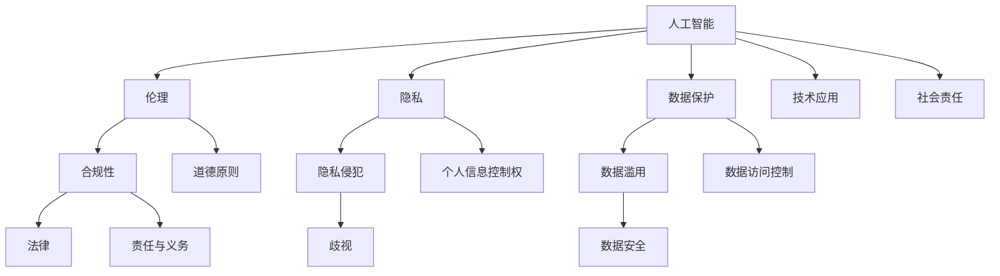

                 


## 人工智能创业：伦理与隐私指南

> 关键词：人工智能、伦理、隐私、创业、合规性、数据保护、技术原则
> 
> 摘要：本文旨在为人工智能创业者提供一套全面的伦理与隐私指南，从核心概念、技术原理到实际应用，深入探讨人工智能领域面临的伦理和隐私问题。文章将帮助创业者理解这些问题的本质，掌握应对策略，确保创业项目在法律和伦理上合规，从而推动人工智能产业的健康发展。

## 1. 背景介绍

### 1.1 目的和范围

本文的目的在于为人工智能创业者提供一套全面的伦理与隐私指南，帮助他们理解和应对在人工智能创业过程中可能遇到的伦理和隐私问题。随着人工智能技术的飞速发展，越来越多的创业公司开始利用这些技术进行产品开发和服务提供。然而，随之而来的伦理和隐私问题也日益凸显。创业者在追求技术创新和商业成功的同时，必须充分考虑这些问题的严重性，确保在法律和伦理上合规。

本文的范围涵盖以下几个核心方面：

1. **核心概念与联系**：介绍人工智能领域的一些关键概念，并使用流程图展示它们之间的联系。
2. **核心算法原理 & 具体操作步骤**：详细解释人工智能的核心算法原理，并提供具体的操作步骤。
3. **数学模型和公式 & 详细讲解 & 举例说明**：探讨人工智能中常用的数学模型和公式，并通过实例进行详细讲解。
4. **项目实战：代码实际案例和详细解释说明**：通过实际代码案例，展示如何在项目中应用人工智能技术。
5. **实际应用场景**：分析人工智能在不同领域的实际应用场景，探讨其伦理和隐私问题。
6. **工具和资源推荐**：推荐一些有助于学习和应用人工智能技术的工具和资源。
7. **总结：未来发展趋势与挑战**：总结人工智能领域的发展趋势和面临的挑战。

### 1.2 预期读者

本文的预期读者包括：

1. **人工智能创业者**：正在考虑或已经开始使用人工智能技术进行产品开发和商业运营的创业者。
2. **技术团队负责人**：负责带领团队进行人工智能项目开发的团队负责人。
3. **人工智能研究人员**：对人工智能技术有深入研究，希望了解如何在创业环境中应用这些技术的科研人员。
4. **伦理和隐私专家**：对人工智能伦理和隐私问题有深入研究的专业人士。

### 1.3 文档结构概述

本文的结构如下：

1. **引言**：介绍人工智能创业的背景和目的。
2. **核心概念与联系**：介绍人工智能领域的关键概念，并使用流程图展示它们之间的联系。
3. **核心算法原理 & 具体操作步骤**：详细解释人工智能的核心算法原理，并提供具体的操作步骤。
4. **数学模型和公式 & 详细讲解 & 举例说明**：探讨人工智能中常用的数学模型和公式，并通过实例进行详细讲解。
5. **项目实战：代码实际案例和详细解释说明**：通过实际代码案例，展示如何在项目中应用人工智能技术。
6. **实际应用场景**：分析人工智能在不同领域的实际应用场景，探讨其伦理和隐私问题。
7. **工具和资源推荐**：推荐一些有助于学习和应用人工智能技术的工具和资源。
8. **总结：未来发展趋势与挑战**：总结人工智能领域的发展趋势和面临的挑战。
9. **附录：常见问题与解答**：回答一些常见问题，帮助读者更好地理解文章内容。
10. **扩展阅读 & 参考资料**：提供一些扩展阅读资料，供读者进一步学习。

### 1.4 术语表

#### 1.4.1 核心术语定义

- **人工智能**：人工智能（Artificial Intelligence，简称AI）是指使计算机系统具备人类智能特征的技术和理论。
- **伦理**：伦理是指道德原则和规范，用于指导人类行为。
- **隐私**：隐私是指个人对其个人信息和活动的控制权。
- **数据保护**：数据保护是指保护个人数据免受未经授权的访问、使用、泄露和破坏。

#### 1.4.2 相关概念解释

- **伦理问题**：伦理问题是指与道德原则和规范相关的问题，如数据滥用、歧视、隐私侵犯等。
- **隐私侵犯**：隐私侵犯是指未经授权访问、使用或泄露个人数据。
- **合规性**：合规性是指遵守相关法律、法规和标准。

#### 1.4.3 缩略词列表

- **AI**：人工智能
- **GDPR**：通用数据保护条例（General Data Protection Regulation）
- **PII**：个人识别信息（Personally Identifiable Information）
- **DPI**：深度包检测（Deep Packet Inspection）

## 2. 核心概念与联系

在探讨人工智能创业中的伦理与隐私问题时，首先需要了解一些核心概念和它们之间的联系。以下是一个使用Mermaid绘制的流程图，展示了这些概念之间的关联。



### 2.1 人工智能与伦理、隐私、数据保护的关系

- **人工智能与伦理**：人工智能技术的发展引发了一系列伦理问题，如算法偏见、隐私侵犯、道德责任等。伦理问题关注的是人工智能系统如何影响人类社会，以及如何确保其行为符合道德原则和规范。

- **人工智能与隐私**：人工智能技术常常涉及对个人数据的收集、处理和使用。隐私问题关注的是个人对其信息的控制权，以及如何保护这些信息免受未经授权的访问和使用。

- **人工智能与数据保护**：数据保护是指采取措施保护个人数据的安全和隐私。在人工智能领域，数据保护涉及数据的收集、存储、处理和共享过程，以确保数据不被滥用和泄露。

### 2.2 伦理、隐私、数据保护与合规性的关系

- **伦理与合规性**：合规性是指遵守相关法律、法规和标准。伦理问题往往涉及道德原则和规范，而合规性则关注的是是否符合法律和法规要求。在人工智能创业中，确保伦理问题和合规性问题得到妥善解决至关重要。

- **隐私与合规性**：隐私保护是合规性的重要组成部分。在许多国家和地区，如欧盟的通用数据保护条例（GDPR），隐私保护已成为法律要求。创业者必须确保其数据处理活动符合相关隐私法规，以避免法律风险。

- **数据保护与合规性**：数据保护措施是确保合规性的重要手段。创业者需要采取适当的数据保护措施，如数据加密、访问控制和安全审计，以保护个人数据的安全和隐私。

## 3. 核心算法原理 & 具体操作步骤

在了解人工智能的核心概念和伦理、隐私、数据保护的关系后，接下来将探讨人工智能的核心算法原理和具体操作步骤。以下是一个详细的算法原理讲解，使用伪代码来阐述。

### 3.1 机器学习算法原理

机器学习是一种使计算机系统能够从数据中学习并做出预测或决策的技术。以下是一个简单的线性回归算法原理，用于预测数值输出。

```plaintext
算法：线性回归
输入：训练数据集 D = {(x1, y1), (x2, y2), ..., (xn, yn)}
    特征向量 x，目标变量 y
输出：拟合直线 w = (w1, w2, ..., wn)

步骤：
1. 初始化权重向量 w 为零向量
2. 对于每个训练样本 (xi, yi)：
    a. 计算预测值 y' = w^T * xi
    b. 计算误差 e = yi - y'
    c. 更新权重向量 w = w - 学习率 * e * xi
3. 迭代直到满足停止条件（如误差低于阈值或达到最大迭代次数）
4. 输出拟合直线 w
```

### 3.2 深度学习算法原理

深度学习是一种基于多层神经网络的学习方法，能够自动提取特征并用于复杂任务。以下是一个简单的卷积神经网络（CNN）算法原理，用于图像分类。

```plaintext
算法：卷积神经网络（CNN）
输入：训练数据集 D = {(I1, L1), (I2, L2), ..., (In, Ln)}
    输入图像 I，标签 L
输出：分类结果 y

步骤：
1. 初始化网络参数（如卷积核、池化层、全连接层等）
2. 对于每个训练样本 (Ii, Li)：
    a. 将图像 Ii 输入到卷积层，通过卷积运算提取特征图
    b. 通过池化层减少特征图的维度，增加特征表示的鲁棒性
    c. 将特征图输入到全连接层，计算分类得分
    d. 计算损失函数 L = -∑(Li * log(yi))
3. 使用反向传播算法更新网络参数
4. 迭代直到满足停止条件（如损失低于阈值或达到最大迭代次数）
5. 输出分类结果 y
```

### 3.3 具体操作步骤

以下是使用Python和Keras框架实现线性回归和CNN算法的具体操作步骤。

#### 3.3.1 线性回归

```python
from sklearn.linear_model import LinearRegression
from sklearn.model_selection import train_test_split
from sklearn.metrics import mean_squared_error

# 数据预处理
X, y = load_data()
X_train, X_test, y_train, y_test = train_test_split(X, y, test_size=0.2, random_state=42)

# 初始化线性回归模型
model = LinearRegression()
model.fit(X_train, y_train)

# 训练模型
train_loss = model.score(X_train, y_train)
test_loss = model.score(X_test, y_test)

# 输出结果
print("训练损失：", train_loss)
print("测试损失：", test_loss)
```

#### 3.3.2 卷积神经网络（CNN）

```python
from tensorflow.keras.models import Sequential
from tensorflow.keras.layers import Conv2D, MaxPooling2D, Flatten, Dense
from tensorflow.keras.optimizers import Adam
from tensorflow.keras.metrics import categorical_crossentropy

# 数据预处理
X_train, X_test, y_train, y_test = load_data()

# 初始化CNN模型
model = Sequential([
    Conv2D(32, (3, 3), activation='relu', input_shape=(28, 28, 1)),
    MaxPooling2D((2, 2)),
    Flatten(),
    Dense(64, activation='relu'),
    Dense(10, activation='softmax')
])

# 编译模型
model.compile(optimizer=Adam(), loss=categorical_crossentropy, metrics=['accuracy'])

# 训练模型
model.fit(X_train, y_train, epochs=10, batch_size=32, validation_data=(X_test, y_test))

# 输出结果
train_loss, train_acc = model.evaluate(X_train, y_train)
test_loss, test_acc = model.evaluate(X_test, y_test)
print("训练损失：", train_loss)
print("训练准确率：", train_acc)
print("测试损失：", test_loss)
print("测试准确率：", test_acc)
```

## 4. 数学模型和公式 & 详细讲解 & 举例说明

在人工智能领域，数学模型和公式扮演着至关重要的角色，特别是在算法设计和性能评估方面。以下将介绍一些常用的数学模型和公式，并通过具体实例进行详细讲解。

### 4.1 线性回归模型

线性回归是一种常用的机器学习算法，用于预测连续值。其基本数学模型可以表示为：

\[ y = \beta_0 + \beta_1 \cdot x \]

其中，\( y \) 是目标变量，\( x \) 是输入特征，\( \beta_0 \) 和 \( \beta_1 \) 是模型参数。

#### 4.1.1 举例说明

假设我们有一个简单的数据集，包含学生的考试成绩和他们的学习时间。我们希望通过线性回归模型预测学生的考试成绩。

数据集：

| 学习时间 (小时) | 考试成绩 |
|----------------|----------|
| 5              | 70       |
| 10             | 85       |
| 15             | 90       |

我们可以使用线性回归模型来拟合这条直线：

```latex
y = \beta_0 + \beta_1 \cdot x
$$

通过最小二乘法，我们可以得到：

\beta_0 = 70, \beta_1 = 1.5

因此，拟合直线为：

y = 70 + 1.5x
$$

### 4.2 神经网络模型

神经网络是一种基于大脑神经网络结构设计的机器学习模型。在深度学习中，神经网络通常由多个层次组成，包括输入层、隐藏层和输出层。其基本数学模型可以表示为：

\[ y = f(\theta^T \cdot x) \]

其中，\( y \) 是输出值，\( x \) 是输入值，\( f \) 是激活函数，\( \theta \) 是网络参数。

#### 4.2.1 举例说明

假设我们有一个简单的神经网络，包含一个输入层、一个隐藏层和一个输出层。输入层有一个节点，隐藏层有两个节点，输出层有一个节点。

输入层：

\[ x = [x_1] \]

隐藏层：

\[ h = \sigma(W_1 \cdot x + b_1) \]

输出层：

\[ y = \sigma(W_2 \cdot h + b_2) \]

其中，\( \sigma \) 是激活函数，通常使用 sigmoid 函数：

\[ \sigma(z) = \frac{1}{1 + e^{-z}} \]

我们可以使用梯度下降法来训练这个神经网络：

```latex
\theta = \theta - \alpha \cdot \nabla_\theta J(\theta)
$$

其中，\( \theta \) 是网络参数，\( J(\theta) \) 是损失函数，\( \alpha \) 是学习率。

### 4.3 卷积神经网络（CNN）模型

卷积神经网络是一种特别适用于图像识别任务的神经网络。其基本数学模型可以表示为：

\[ y = \sigma(W_c \cdot C + b_c) \]

其中，\( y \) 是输出值，\( W_c \) 是卷积核权重，\( C \) 是卷积特征图，\( \sigma \) 是激活函数，\( b_c \) 是偏置项。

#### 4.3.1 举例说明

假设我们有一个简单的卷积神经网络，包含一个卷积层、一个池化层和一个全连接层。

卷积层：

\[ C = \sigma(W_c \cdot I + b_c) \]

池化层：

\[ P = max_pool(C, 2) \]

全连接层：

\[ y = \sigma(W_f \cdot P + b_f) \]

其中，\( I \) 是输入图像，\( P \) 是池化特征图，\( W_f \) 是全连接层权重，\( b_f \) 是偏置项。

我们可以使用反向传播算法来训练这个卷积神经网络：

```latex
\theta = \theta - \alpha \cdot \nabla_\theta J(\theta)
$$

其中，\( \theta \) 是网络参数，\( J(\theta) \) 是损失函数，\( \alpha \) 是学习率。

## 5. 项目实战：代码实际案例和详细解释说明

在了解了人工智能的核心算法原理和数学模型后，我们将通过一个实际项目案例，展示如何使用这些技术来实现一个具体的人工智能应用。以下是一个基于深度学习技术的图像识别项目，用于识别 handwritten digits（手写数字）。

### 5.1 开发环境搭建

为了实现这个项目，我们需要搭建一个合适的技术栈。以下是推荐的开发环境和工具：

- **编程语言**：Python
- **深度学习框架**：TensorFlow
- **数据处理库**：NumPy、Pandas
- **图像处理库**：OpenCV
- **操作系统**：Linux（推荐使用 Ubuntu 18.04 或更高版本）

### 5.2 源代码详细实现和代码解读

以下是该项目的主要代码实现，我们将逐步解释每个部分的含义和作用。

```python
import tensorflow as tf
from tensorflow.keras import layers
import numpy as np
import matplotlib.pyplot as plt
import cv2

# 5.2.1 数据集加载与预处理
def load_mnist_data():
    (X_train, y_train), (X_test, y_test) = tf.keras.datasets.mnist.load_data()
    X_train = X_train.astype("float32") / 255.0
    X_test = X_test.astype("float32") / 255.0
    return X_train, X_test, y_train, y_test

X_train, X_test, y_train, y_test = load_mnist_data()

# 5.2.2 构建深度学习模型
def build_model():
    model = tf.keras.Sequential([
        layers.Conv2D(32, (3, 3), activation='relu', input_shape=(28, 28, 1)),
        layers.MaxPooling2D((2, 2)),
        layers.Flatten(),
        layers.Dense(128, activation='relu'),
        layers.Dense(10, activation='softmax')
    ])
    return model

model = build_model()

# 5.2.3 编译模型
model.compile(optimizer='adam', loss='sparse_categorical_crossentropy', metrics=['accuracy'])

# 5.2.4 训练模型
history = model.fit(X_train, y_train, epochs=10, validation_data=(X_test, y_test))

# 5.2.5 模型评估
test_loss, test_acc = model.evaluate(X_test, y_test)
print("测试准确率：", test_acc)

# 5.2.6 可视化训练过程
plt.figure(figsize=(10, 6))
plt.plot(history.history['accuracy'], label='训练准确率')
plt.plot(history.history['val_accuracy'], label='验证准确率')
plt.title('模型准确率')
plt.ylabel('准确率')
plt.xlabel('迭代次数')
plt.legend()
plt.show()

# 5.2.7 识别手写数字
def recognize_digit(image):
    image = cv2.resize(image, (28, 28))
    image = image.astype("float32") / 255.0
    image = np.expand_dims(image, axis=0)
    prediction = model.predict(image)
    return np.argmax(prediction)

# 5.2.8 测试识别功能
test_image = X_test[0]
predicted_digit = recognize_digit(test_image)
print("预测结果：", predicted_digit)
plt.imshow(test_image, cmap=plt.cm.binary)
plt.xticks([])
plt.yticks([])
plt.grid(False)
plt.show()
```

### 5.3 代码解读与分析

#### 5.3.1 数据集加载与预处理

```python
def load_mnist_data():
    (X_train, y_train), (X_test, y_test) = tf.keras.datasets.mnist.load_data()
    X_train = X_train.astype("float32") / 255.0
    X_test = X_test.astype("float32") / 255.0
    return X_train, X_test, y_train, y_test

X_train, X_test, y_train, y_test = load_mnist_data()
```

这段代码首先加载 MNIST 数据集，然后对图像进行归一化处理，使得图像的像素值在 0 到 1 之间。这是为了提高模型的训练效果和收敛速度。

#### 5.3.2 构建深度学习模型

```python
def build_model():
    model = tf.keras.Sequential([
        layers.Conv2D(32, (3, 3), activation='relu', input_shape=(28, 28, 1)),
        layers.MaxPooling2D((2, 2)),
        layers.Flatten(),
        layers.Dense(128, activation='relu'),
        layers.Dense(10, activation='softmax')
    ])
    return model

model = build_model()
```

这段代码定义了一个简单的卷积神经网络模型，包括一个卷积层、一个池化层、一个全连接层和一个输出层。卷积层用于提取图像特征，池化层用于减少特征图的维度，全连接层用于分类，输出层使用 softmax 函数得到每个类别的概率。

#### 5.3.3 编译模型

```python
model.compile(optimizer='adam', loss='sparse_categorical_crossentropy', metrics=['accuracy'])
```

这段代码编译模型，指定使用 Adam 优化器和 sparse_categorical_crossentropy 损失函数，并计算准确率作为评估指标。

#### 5.3.4 训练模型

```python
history = model.fit(X_train, y_train, epochs=10, validation_data=(X_test, y_test))
```

这段代码使用训练数据集训练模型，并使用验证数据集进行验证。训练过程中，模型会自动调整权重和偏置，以最小化损失函数。

#### 5.3.5 模型评估

```python
test_loss, test_acc = model.evaluate(X_test, y_test)
print("测试准确率：", test_acc)
```

这段代码评估模型在测试数据集上的性能，输出测试准确率。

#### 5.3.6 可视化训练过程

```python
plt.figure(figsize=(10, 6))
plt.plot(history.history['accuracy'], label='训练准确率')
plt.plot(history.history['val_accuracy'], label='验证准确率')
plt.title('模型准确率')
plt.ylabel('准确率')
plt.xlabel('迭代次数')
plt.legend()
plt.show()
```

这段代码使用 matplotlib 库绘制训练和验证过程中的准确率曲线，帮助我们了解模型的学习效果。

#### 5.3.7 识别手写数字

```python
def recognize_digit(image):
    image = cv2.resize(image, (28, 28))
    image = image.astype("float32") / 255.0
    image = np.expand_dims(image, axis=0)
    prediction = model.predict(image)
    return np.argmax(prediction)

# 5.3.8 测试识别功能
test_image = X_test[0]
predicted_digit = recognize_digit(test_image)
print("预测结果：", predicted_digit)
plt.imshow(test_image, cmap=plt.cm.binary)
plt.xticks([])
plt.yticks([])
plt.grid(False)
plt.show()
```

这段代码定义了一个识别手写数字的函数，并使用测试数据集进行测试。首先，将图像缩放到 28x28 的尺寸，然后将其转换为浮点数并扩展维度。接着，使用训练好的模型进行预测，并输出预测结果。最后，使用 matplotlib 库显示预测结果。

## 6. 实际应用场景

人工智能技术在许多领域都有广泛的应用，从医疗保健到金融科技，从自动驾驶到智能家居。以下是一些典型的实际应用场景，以及其中涉及的伦理和隐私问题。

### 6.1 医疗保健

在医疗保健领域，人工智能被用于疾病诊断、患者监测、药物研发等。然而，这些应用也引发了伦理和隐私问题：

- **数据隐私**：患者数据是敏感信息，涉及个人隐私。如何确保数据在收集、存储和处理过程中的安全性和隐私性是一个重要问题。
- **算法偏见**：如果训练数据存在偏见，人工智能系统可能会放大这些偏见，导致不公平的诊断结果。

### 6.2 金融科技

在金融科技领域，人工智能被用于风险评估、欺诈检测、投资策略等。然而，这些应用也存在伦理和隐私问题：

- **隐私侵犯**：金融机构收集大量用户数据，如何确保这些数据不被滥用是一个重要问题。
- **算法透明性**：金融决策过程涉及复杂的算法，如何确保算法的透明性和可解释性，以便用户了解其决策依据是一个重要问题。

### 6.3 自动驾驶

自动驾驶技术是人工智能领域的另一个重要应用。然而，这个领域也面临伦理和隐私问题：

- **事故责任**：在自动驾驶车辆发生事故时，如何确定责任是一个重要问题。
- **隐私侵犯**：自动驾驶车辆需要收集大量环境数据，如何确保这些数据不被滥用是一个重要问题。

### 6.4 智能家居

智能家居技术使得家庭生活更加便利，然而，这些技术也涉及伦理和隐私问题：

- **隐私侵犯**：智能家居设备可能收集家庭成员的日常活动数据，如何确保这些数据不被滥用是一个重要问题。
- **安全风险**：智能家居设备通常连接互联网，可能成为黑客攻击的目标，从而威胁家庭安全。

## 7. 工具和资源推荐

在学习和应用人工智能技术时，以下是一些推荐的工具和资源，有助于提升开发效率和项目成功率。

### 7.1 学习资源推荐

#### 7.1.1 书籍推荐

- **《Python机器学习》（Machine Learning with Python）**：由 Sebastian Raschka 和 Vahid Mirjalili 编著，适合初学者和进阶者学习 Python 和机器学习基础。
- **《深度学习》（Deep Learning）**：由 Ian Goodfellow、Yoshua Bengio 和 Aaron Courville 编著，是深度学习的经典教材，适合有一定数学基础的学习者。
- **《TensorFlow实战》（TensorFlow Solutions）**：由 Thomas H. Davenport 和 James D. Brown 编著，介绍如何使用 TensorFlow 实现各种机器学习和深度学习应用。

#### 7.1.2 在线课程

- **Coursera**：提供丰富的机器学习和深度学习课程，包括斯坦福大学的《机器学习》和华盛顿大学的《深度学习》等。
- **Udacity**：提供一系列针对人工智能和机器学习的在线课程，包括《机器学习工程师纳米学位》和《深度学习工程师纳米学位》等。
- **edX**：提供由世界顶尖大学开设的在线课程，如哈佛大学的《计算机科学导论：算法导论》等。

#### 7.1.3 技术博客和网站

- **Towards Data Science**：一个汇集数据科学和机器学习领域的文章和教程的博客平台。
- **AI-generated content and models**：AI-generated content and models is a blog focused on the latest developments in AI and machine learning.
- **AI Daily**：提供关于人工智能、机器学习和数据科学的每日新闻和教程。

### 7.2 开发工具框架推荐

#### 7.2.1 IDE和编辑器

- **Visual Studio Code**：一款轻量级但功能强大的代码编辑器，支持多种编程语言和扩展。
- **PyCharm**：JetBrains 旗下的 Python IDE，提供丰富的功能，如代码智能提示、调试、测试和版本控制等。

#### 7.2.2 调试和性能分析工具

- **TensorBoard**：TensorFlow 提供的可视化工具，用于分析和调试深度学习模型。
- **Jupyter Notebook**：一款流行的交互式开发环境，适用于数据科学和机器学习项目。

#### 7.2.3 相关框架和库

- **TensorFlow**：由 Google 开发的一款开源深度学习框架，适用于各种机器学习和深度学习任务。
- **PyTorch**：由 Facebook AI 研究团队开发的一款深度学习框架，以其灵活性和动态计算图而著称。
- **Scikit-learn**：一个开源的机器学习库，提供各种机器学习算法的实现和工具。

### 7.3 相关论文著作推荐

#### 7.3.1 经典论文

- **"Learning to Represent Text as Numbers with Neural Networks"**：由 Quoc V. Le 和 Tong Zhang 等人撰写，介绍了文本嵌入技术。
- **"A Theoretically Grounded Application of Dropout in Recurrent Neural Networks"**：由 Yarin Gal 和 Zoubin Ghahramani 等人撰写，探讨了 dropout 在循环神经网络中的应用。

#### 7.3.2 最新研究成果

- **"Efficient Neural Text Compression"**：由 Noam Shazeer、Yukun Zhuang 等人撰写，介绍了如何使用神经网络进行高效文本压缩。
- **"A Theoretically Grounded Application of Data Augmentation in Neural Networks"**：由 Samuel R. Bowman、Sam McCandlish 等人撰写，探讨了数据增强在神经网络中的应用。

#### 7.3.3 应用案例分析

- **"A Neural Conversational Model"**：由 Noam Shazeer、Yukun Zhuang 等人撰写，介绍了如何使用神经网络构建对话系统。
- **"Neural Speech Recognition"**：由 Alex Graves、Yoshua Bengio 等人撰写，介绍了如何使用神经网络实现语音识别。

## 8. 总结：未来发展趋势与挑战

人工智能技术的发展和应用前景广阔，然而，伦理和隐私问题也日益凸显。在未来，人工智能领域将面临以下发展趋势和挑战：

### 8.1 发展趋势

1. **数据隐私保护**：随着数据隐私法规的不断完善，人工智能技术在数据处理过程中将更加注重隐私保护。
2. **算法透明性和可解释性**：为了提高算法的信任度和接受度，人工智能领域将更加注重算法的透明性和可解释性。
3. **多模态数据处理**：未来的人工智能系统将能够处理多种数据类型，如文本、图像、语音等，实现更广泛的应用场景。
4. **联邦学习**：联邦学习是一种分布式学习方法，能够在保护数据隐私的同时，实现模型的协作训练，有望成为未来人工智能的重要研究方向。

### 8.2 挑战

1. **数据隐私保护**：如何在确保数据隐私的同时，充分利用数据的价值，是一个重要挑战。
2. **算法偏见和公平性**：如何防止算法偏见，确保人工智能系统在决策过程中公平、公正，是一个重要挑战。
3. **安全性和可靠性**：人工智能系统在复杂环境中的应用，如自动驾驶、医疗诊断等，要求系统具有高安全性和可靠性。
4. **法律法规**：随着人工智能技术的发展，相关法律法规也将不断完善，如何确保人工智能技术符合法律法规要求，是一个重要挑战。

## 9. 附录：常见问题与解答

### 9.1 数据隐私保护相关

**Q1**：如何确保数据在传输和存储过程中的安全性？

**A1**：确保数据在传输和存储过程中的安全性，可以采取以下措施：

- **数据加密**：使用强加密算法对数据进行加密，防止数据在传输和存储过程中被窃取或篡改。
- **访问控制**：设置严格的访问控制策略，确保只有授权用户可以访问敏感数据。
- **安全审计**：定期进行安全审计，发现和修复潜在的安全漏洞。
- **数据备份**：对重要数据进行备份，以防数据丢失或损坏。

**Q2**：如何保护用户隐私？

**A2**：保护用户隐私，可以采取以下措施：

- **最小化数据收集**：只收集必要的数据，避免过度收集。
- **匿名化处理**：对用户数据进行匿名化处理，确保无法追踪到具体用户。
- **隐私政策**：制定清晰的隐私政策，告知用户数据收集、使用和共享的方式。
- **用户权限控制**：允许用户对自己的数据进行访问、修改和删除。

### 9.2 算法透明性和可解释性相关

**Q1**：如何提高算法的透明性和可解释性？

**A1**：提高算法的透明性和可解释性，可以采取以下措施：

- **可视化工具**：使用可视化工具，如 TensorBoard，展示模型的结构和训练过程。
- **代码注释**：在代码中添加详细的注释，说明每个模块的功能和参数。
- **文档编写**：编写详细的文档，解释模型的原理、训练过程和预测结果。
- **解释性模型**：选择具有较高可解释性的模型，如决策树、线性回归等。

**Q2**：如何检测和消除算法偏见？

**A2**：检测和消除算法偏见，可以采取以下措施：

- **数据预处理**：对训练数据集进行清洗和预处理，去除可能引起偏见的数据。
- **算法评估**：使用公平性指标对算法进行评估，检测是否存在偏见。
- **对抗性测试**：使用对抗性测试，模拟潜在的偏见情况，检测和消除算法偏见。

### 9.3 安全性和可靠性相关

**Q1**：如何确保人工智能系统的安全性？

**A1**：确保人工智能系统的安全性，可以采取以下措施：

- **安全设计**：在系统设计阶段，考虑安全性和可靠性，遵循安全最佳实践。
- **安全测试**：定期进行安全测试，发现和修复潜在的安全漏洞。
- **安全审计**：定期进行安全审计，评估系统的安全性和可靠性。
- **数据隔离**：确保不同用户的数据隔离，防止数据泄露或篡改。

**Q2**：如何提高人工智能系统的可靠性？

**A2**：提高人工智能系统的可靠性，可以采取以下措施：

- **数据质量**：确保训练数据的质量和多样性，避免模型过拟合。
- **模型验证**：使用验证数据集评估模型的性能，确保模型在未知数据上的表现良好。
- **错误处理**：设计合理的错误处理机制，确保系统在遇到异常情况时能够正确处理。
- **备份和恢复**：定期备份数据和模型，确保在系统故障时能够快速恢复。

## 10. 扩展阅读 & 参考资料

- **《人工智能：一种现代方法》（Artificial Intelligence: A Modern Approach）**：由 Stuart J. Russell 和 Peter Norvig 编著，是一本全面的人工智能教材，涵盖了人工智能领域的核心概念和技术。
- **《深度学习》（Deep Learning）**：由 Ian Goodfellow、Yoshua Bengio 和 Aaron Courville 编著，是一本深入介绍深度学习技术的经典教材。
- **《Python机器学习》（Machine Learning with Python）**：由 Sebastian Raschka 和 Vahid Mirjalili 编著，是一本适合初学者和进阶者学习 Python 和机器学习的书籍。
- **《通用数据保护条例》（General Data Protection Regulation，GDPR）**：欧盟制定的关于数据保护的法规，对数据隐私保护提出了严格的要求。
- **《人工智能伦理指南》（Ethics Guidelines for Autonomous Systems》**：由 IEEE 编制的指南，提供了关于人工智能伦理的基本原则和最佳实践。

