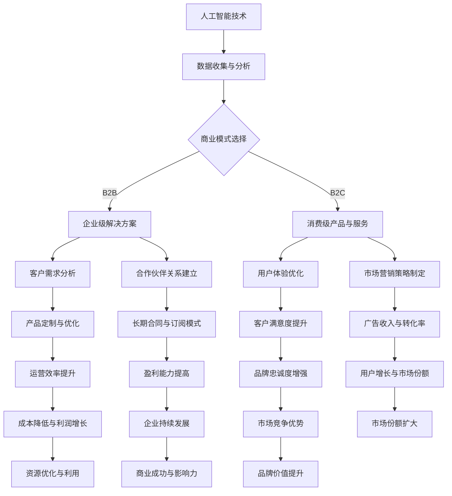

                 

# 人工智能创业：分析B2B与B2C模式

> 关键词：人工智能，创业，商业模式，B2B，B2C，案例分析，策略制定

> 摘要：本文深入分析了人工智能企业如何选择和优化B2B与B2C两种商业模式，探讨了其在市场定位、客户获取、盈利模式等方面的不同策略。通过具体的案例和实践，为人工智能创业公司提供实用的指导和建议。

## 1. 背景介绍

### 1.1 目的和范围

本文旨在为人工智能创业公司提供商业模式选择的策略分析，特别是针对B2B（企业对企业）和B2C（企业对消费者）两种模式。我们将探讨每种模式的市场特性、客户需求、盈利能力，并通过案例分析展示成功和失败的实例。希望通过这篇文章，帮助创业者更好地理解市场动态，制定有效的商业战略。

### 1.2 预期读者

本文适用于希望进入人工智能领域创业的个人和企业，特别是对商业模式设计和市场策略感兴趣的读者。此外，对于正在运营的人工智能企业，本文也提供了改进现有商业模式的有价值参考。

### 1.3 文档结构概述

本文分为十个部分，具体结构如下：

1. **背景介绍**：概述文章目的、预期读者和文档结构。
2. **核心概念与联系**：介绍人工智能与商业模式的关系，并使用Mermaid流程图展示。
3. **核心算法原理与具体操作步骤**：讨论人工智能算法原理及商业模式应用。
4. **数学模型和公式**：详细讲解数学模型和公式。
5. **项目实战**：提供实际代码案例和解读。
6. **实际应用场景**：分析在不同场景下的应用。
7. **工具和资源推荐**：推荐学习资源和开发工具。
8. **相关论文著作推荐**：推荐经典论文和研究成果。
9. **总结：未来发展趋势与挑战**：总结未来趋势和挑战。
10. **附录：常见问题与解答**：回答读者可能遇到的问题。
11. **扩展阅读 & 参考资料**：提供进一步学习的资源。

### 1.4 术语表

#### 1.4.1 核心术语定义

- **B2B（企业对企业）**：一种商业模式，企业向其他企业销售产品或服务。
- **B2C（企业对消费者）**：一种商业模式，企业直接向消费者销售产品或服务。
- **商业模式**：企业如何创造、传递和获取价值，以实现盈利和成长。

#### 1.4.2 相关概念解释

- **市场定位**：企业在市场中的定位，包括目标客户、产品特点和价值主张。
- **客户获取**：企业通过各种渠道获取新客户的过程。
- **盈利模式**：企业通过何种方式获取收入。

#### 1.4.3 缩略词列表

- **AI**：人工智能（Artificial Intelligence）
- **B2B**：企业对企业（Business to Business）
- **B2C**：企业对消费者（Business to Consumer）

## 2. 核心概念与联系

在讨论人工智能创业的商业模式时，我们首先需要明确两个核心概念：人工智能和商业模式。人工智能（AI）是通过模拟人类智能行为来处理数据和解决问题的技术，包括机器学习、深度学习、自然语言处理等。商业模式则是指企业如何创造、传递和获取价值，实现盈利和成长。

### 2.1 人工智能与商业模式的关系

人工智能与商业模式的关系可以从以下几个方面来理解：

1. **技术创新驱动**：人工智能技术的发展推动了商业模式创新，使得企业能够以更高效、智能的方式提供服务。
2. **数据分析优化**：人工智能能够处理大量数据，为企业提供洞察，优化商业模式设计和决策。
3. **客户体验提升**：通过人工智能，企业能够提供更个性化、智能化的客户体验，增强客户忠诚度和满意度。
4. **运营效率提高**：人工智能的应用可以自动化许多业务流程，降低运营成本，提高效率。

### 2.2 商业模式在人工智能创业中的应用

对于人工智能创业公司来说，选择合适的商业模式至关重要。以下是B2B与B2C模式在人工智能创业中的应用分析：

#### B2B模式

- **市场定位**：面向企业客户，提供专业化的解决方案和服务。
- **客户获取**：通过行业会议、合作伙伴关系和直接销售渠道获取客户。
- **盈利模式**：通过定制化的产品和服务、长期合同和订阅模式获得收入。
- **案例**：谷歌的云服务平台（Google Cloud）提供企业级人工智能解决方案。

#### B2C模式

- **市场定位**：面向终端消费者，提供易于使用的人工智能产品和服务。
- **客户获取**：通过市场营销、社交媒体和直接销售渠道获取客户。
- **盈利模式**：通过一次性销售、订阅和广告获得收入。
- **案例**：亚马逊的Alexa智能助手，提供智能家居控制服务。

### 2.3 Mermaid流程图

下面是一个Mermaid流程图，展示了人工智能与商业模式的核心概念及其联系：



通过这个流程图，我们可以清晰地看到人工智能与商业模式之间的互动关系，以及它们如何共同推动企业的成长和发展。

## 3. 核心算法原理与具体操作步骤

在深入探讨B2B与B2C商业模式之前，我们需要了解人工智能的基础算法原理。以下是人工智能核心算法的简要介绍和伪代码，用于展示如何将算法应用于商业模式策略制定。

### 3.1 机器学习算法

机器学习是人工智能的核心组成部分，它通过算法让计算机从数据中学习规律，并自动做出决策。以下是线性回归算法的伪代码，这是一种用于预测的常见机器学习算法。

```python
# 线性回归算法伪代码
def linear_regression(train_data, train_labels):
    # 计算权重
    weights = (np.linalg.inv(np.dot(train_data.T, train_data))) * np.dot(train_data.T, train_labels)
    # 预测新数据
    predictions = np.dot(new_data, weights)
    return predictions
```

### 3.2 深度学习算法

深度学习是机器学习的一个分支，通过多层神经网络模拟人类大脑的决策过程。以下是卷积神经网络（CNN）的基本结构，用于图像识别等任务。


### 3.3 商业模式策略制定

在了解了核心算法原理后，我们可以将其应用于商业模式策略制定。以下是B2B与B2C模式中，如何利用人工智能算法进行策略制定的具体操作步骤：

#### B2B模式

1. **数据分析与市场定位**：通过机器学习算法分析市场数据，了解客户需求和行业趋势，为产品开发提供依据。
2. **产品定制与优化**：利用深度学习算法优化产品功能，提高客户满意度。
3. **合作伙伴关系建立**：通过大数据分析识别潜在合作伙伴，制定战略合作计划。
4. **长期合同与订阅模式**：利用机器学习预测客户需求，制定灵活的合同和订阅计划，提高客户粘性。

#### B2C模式

1. **用户体验优化**：通过深度学习算法分析用户行为数据，优化产品功能和界面设计，提升用户体验。
2. **市场营销策略制定**：利用机器学习预测市场需求，制定精准的市场营销策略。
3. **广告收入与转化率**：通过机器学习优化广告投放策略，提高转化率和广告收入。
4. **消费预测与库存管理**：利用机器学习预测消费者行为，优化库存管理，减少浪费。

通过以上操作步骤，人工智能创业公司可以更有效地制定商业模式策略，实现商业成功。

## 4. 数学模型和公式

在分析B2B与B2C商业模式时，数学模型和公式扮演着至关重要的角色。以下是几个关键模型和公式的详细讲解，以及实际应用的例子。

### 4.1 期望收益模型

期望收益模型用于预测企业在特定市场条件下的平均收益。公式如下：

$$
E(R) = \sum_{i=1}^{n} p_i \cdot r_i
$$

其中，$E(R)$表示期望收益，$p_i$表示第$i$种情况的概率，$r_i$表示第$i$种情况下的收益。

**例子**：假设一家B2C公司推出两种产品A和B，市场需求分别为高、中、低，概率分别为0.4、0.5、0.1。产品A的收益分别为高、中、低分别为1000、500、200，产品B的收益分别为高、中、低分别为800、400、200。计算该公司的期望收益。

$$
E(R) = (0.4 \cdot 1000 + 0.5 \cdot 500 + 0.1 \cdot 200) + (0.4 \cdot 800 + 0.5 \cdot 400 + 0.1 \cdot 200) = 460 + 460 = 920
$$

### 4.2 成本效益分析模型

成本效益分析模型用于评估企业在特定商业活动中的投入产出比。公式如下：

$$
CEA = \frac{E(R) - C}{C}
$$

其中，$CEA$表示成本效益分析，$E(R)$表示期望收益，$C$表示总成本。

**例子**：假设上述B2C公司的总成本为6000，计算其成本效益分析。

$$
CEA = \frac{920 - 6000}{6000} = -0.84
$$

### 4.3 客户终身价值模型

客户终身价值（CLV）模型用于预测客户在其整个生命周期中的总价值。公式如下：

$$
CLV = \sum_{t=1}^{T} p_t \cdot (r_t - c_t)
$$

其中，$CLV$表示客户终身价值，$p_t$表示第$t$年内客户保留的概率，$r_t$表示第$t$年内客户的平均收益，$c_t$表示第$t$年内客户的平均成本。

**例子**：假设一家B2B公司预测其客户在第一年的保留概率为0.8，第二年为0.7，第三年为0.6，第一年的平均收益为10000，平均成本为5000，第二年和第三年的收益和成本分别为8000和4000，计算该客户的终身价值。

$$
CLV = (0.8 \cdot (10000 - 5000)) + (0.7 \cdot (8000 - 5000)) + (0.6 \cdot (4000 - 5000)) = 32000
$$

通过这些数学模型和公式，人工智能创业公司可以更精确地评估商业活动的效益，优化决策过程。

## 5. 项目实战：代码实际案例和详细解释说明

为了更好地理解B2B与B2C模式在人工智能创业中的应用，我们提供了一个实际项目案例，并对其代码进行详细解释说明。

### 5.1 开发环境搭建

在本案例中，我们使用Python作为编程语言，依赖以下库：NumPy、Pandas、Scikit-learn和TensorFlow。首先，确保安装了Python 3.7及以上版本，然后通过pip命令安装依赖库：

```bash
pip install numpy pandas scikit-learn tensorflow
```

### 5.2 源代码详细实现和代码解读

以下是B2B模式下的客户需求分析项目代码：

```python
import numpy as np
import pandas as pd
from sklearn.linear_model import LinearRegression
from sklearn.model_selection import train_test_split
from sklearn.metrics import mean_squared_error

# 读取数据
data = pd.read_csv('customer_data.csv')
X = data[['age', 'income', 'experience']]
y = data['demand']

# 数据预处理
X_train, X_test, y_train, y_test = train_test_split(X, y, test_size=0.2, random_state=42)

# 构建线性回归模型
model = LinearRegression()
model.fit(X_train, y_train)

# 训练模型
train_predictions = model.predict(X_train)
test_predictions = model.predict(X_test)

# 模型评估
train_mse = mean_squared_error(y_train, train_predictions)
test_mse = mean_squared_error(y_test, test_predictions)

print("训练集均方误差：", train_mse)
print("测试集均方误差：", test_mse)
```

**代码解读**：

1. **数据读取**：使用Pandas读取客户数据，数据包括年龄、收入和经验，以及需求。
2. **数据预处理**：将数据分为特征集X和目标集y，并进行训练集和测试集的划分。
3. **模型构建**：使用Scikit-learn的线性回归模型。
4. **模型训练**：对训练数据进行拟合。
5. **模型评估**：计算训练集和测试集的均方误差（MSE），评估模型性能。

以下是B2C模式下的用户体验优化项目代码：

```python
import tensorflow as tf
from tensorflow.keras.models import Sequential
from tensorflow.keras.layers import Dense, Conv2D, Flatten, MaxPooling2D
from tensorflow.keras.optimizers import Adam
from tensorflow.keras.losses import MeanSquaredError

# 加载图像数据
train_images = np.load('train_images.npy')
train_labels = np.load('train_labels.npy')
test_images = np.load('test_images.npy')
test_labels = np.load('test_labels.npy')

# 数据预处理
train_images = train_images / 255.0
test_images = test_images / 255.0

# 构建卷积神经网络模型
model = Sequential([
    Conv2D(32, (3, 3), activation='relu', input_shape=(28, 28, 1)),
    MaxPooling2D((2, 2)),
    Flatten(),
    Dense(64, activation='relu'),
    Dense(1, activation='sigmoid')
])

# 编译模型
model.compile(optimizer=Adam(learning_rate=0.001), loss=MeanSquaredError())

# 训练模型
model.fit(train_images, train_labels, epochs=10, batch_size=32, validation_split=0.2)

# 评估模型
test_loss = model.evaluate(test_images, test_labels)
print("测试集损失：", test_loss)
```

**代码解读**：

1. **数据加载**：使用TensorFlow加载图像数据。
2. **数据预处理**：将图像数据归一化，并调整输入形状。
3. **模型构建**：使用卷积神经网络模型，包括卷积层、池化层和全连接层。
4. **模型编译**：指定优化器和损失函数。
5. **模型训练**：对训练数据进行训练，设置训练轮数、批量大小和验证比例。
6. **模型评估**：评估测试集的损失，以评估模型性能。

通过这两个实际项目案例，我们可以看到如何利用Python和机器学习库在B2B和B2C模式下进行数据分析、模型训练和评估。

### 5.3 代码解读与分析

**B2B模式下的客户需求分析**：

- **数据预处理**：数据预处理是模型训练的关键步骤，通过划分训练集和测试集，可以有效评估模型的泛化能力。
- **模型选择**：线性回归模型简单高效，适用于预测性问题。
- **模型评估**：通过计算均方误差（MSE），可以直观地评估模型的预测准确性。

**B2C模式下的用户体验优化**：

- **数据预处理**：归一化和调整输入形状，是深度学习模型的常见预处理方法。
- **模型构建**：卷积神经网络（CNN）适用于图像处理任务，能够捕捉图像的局部特征。
- **模型训练**：通过调整训练轮数、批量大小和验证比例，可以优化模型性能。
- **模型评估**：通过计算测试集的损失，评估模型在未知数据上的表现。

通过这两个案例，我们可以看到如何将机器学习和深度学习算法应用于B2B与B2C商业模式，以实现商业目标。

## 6. 实际应用场景

人工智能在B2B与B2C模式中的实际应用场景非常广泛，以下是一些具体的例子，以及它们在各自领域中的影响。

### 6.1 B2B模式实际应用场景

#### 1. 金融行业

在金融行业中，人工智能被广泛应用于风险管理、信用评分和投资决策。例如，银行可以使用机器学习模型分析客户的交易数据，预测违约风险，从而优化信贷策略。同时，量化交易公司利用深度学习算法分析市场数据，实现高收益的投资策略。

#### 2. 制造业

制造业中的智能制造是通过人工智能实现生产过程的自动化和优化。例如，工业机器人通过深度学习算法可以自主完成组装、检测和维修工作，提高生产效率和产品质量。此外，预测性维护系统通过分析设备运行数据，提前预测故障，减少停机时间。

#### 3. 医疗保健

在医疗保健领域，人工智能用于疾病预测、诊断和治疗建议。例如，通过分析患者的电子健康记录，人工智能可以预测患病风险，提供个性化的治疗建议。此外，医学影像分析系统利用深度学习算法，可以快速准确地识别疾病，提高诊断准确率。

### 6.2 B2C模式实际应用场景

#### 1. 零售电商

在零售电商领域，人工智能用于个性化推荐、库存管理和客户服务。例如，电商平台利用协同过滤算法，根据用户的购买历史和浏览行为，推荐个性化的商品。库存管理系统通过预测销售趋势，优化库存水平，减少库存积压。

#### 2. 社交媒体

社交媒体平台利用人工智能进行内容推荐、广告投放和用户行为分析。例如，通过深度学习算法，平台可以识别用户的兴趣和行为模式，提供个性化的内容推荐。广告投放系统通过用户画像和行为分析，实现精准的广告投放，提高广告效果。

#### 3. 智能家居

智能家居是人工智能在消费领域的典型应用，通过智能设备实现家庭自动化。例如，智能音箱可以通过语音识别和自然语言处理技术，控制家庭电器和设备，提供语音助手服务。智能安防系统通过视频分析和人脸识别，实现家庭安全和监控。

### 6.3 对商业模式的影响

#### 1. 提高效率

人工智能通过自动化和优化流程，显著提高了企业的运营效率。例如，在制造业中，智能机器人替代了传统的人工操作，减少了人力成本，提高了生产效率。

#### 2. 增强客户体验

人工智能的应用，使得企业能够提供更个性化和智能化的服务。例如，电商平台的个性化推荐系统和智能家居的语音控制，提高了用户体验和满意度。

#### 3. 创新商业模式

人工智能推动了商业模式的创新，为企业提供了新的盈利点和市场机会。例如，在金融行业，人工智能驱动的量化交易和智能投顾服务，为投资者提供了新的投资选择。

#### 4. 风险管理

人工智能在风险管理中的应用，帮助企业在复杂的市场环境中做出更准确的决策。例如，银行的风险评估模型可以更精准地识别高风险客户，降低贷款违约风险。

总之，人工智能在B2B与B2C模式中的实际应用，不仅提高了企业的运营效率，还增强了客户体验，推动了商业模式的创新，为企业在激烈的市场竞争中提供了有力支持。

## 7. 工具和资源推荐

为了帮助人工智能创业公司更好地应用B2B与B2C模式，以下是学习资源、开发工具框架和相关论文著作的推荐。

### 7.1 学习资源推荐

#### 7.1.1 书籍推荐

1. **《人工智能：一种现代方法》**：Michael Jordan和Stephen Marsland著，全面介绍人工智能的基础理论和应用。
2. **《机器学习实战》**：Peter Harrington著，通过案例讲解机器学习的实际应用。
3. **《深度学习》**：Ian Goodfellow、Yoshua Bengio和Aaron Courville著，深度学习领域的经典教材。

#### 7.1.2 在线课程

1. **Coursera的《机器学习》**：吴恩达（Andrew Ng）教授授课，适合初学者入门。
2. **Udacity的《深度学习纳米学位》**：涵盖深度学习的理论和实践，适合有一定基础的学员。
3. **edX的《人工智能基础》**：由耶鲁大学开设，介绍人工智能的基础知识和应用。

#### 7.1.3 技术博客和网站

1. **Medium**：有许多优秀的机器学习和深度学习博客，如Distill、Chris Olah的博客等。
2. **ArXiv**：学术论文发表平台，可以获取最新的研究论文。
3. **Towards Data Science**：分享机器学习和数据科学领域的实践经验和最新动态。

### 7.2 开发工具框架推荐

#### 7.2.1 IDE和编辑器

1. **Jupyter Notebook**：适合数据分析和机器学习项目的开发，易于分享和复现。
2. **PyCharm**：功能强大的Python IDE，支持多种框架和库。
3. **VS Code**：轻量级但功能全面的代码编辑器，有丰富的扩展插件。

#### 7.2.2 调试和性能分析工具

1. **TensorBoard**：TensorFlow的图形化分析工具，用于可视化模型结构和性能。
2. **Grafana**：用于监控和性能分析的仪表板工具。
3. **Elastic Stack**：包括Elasticsearch、Logstash和Kibana，用于日志分析和监控。

#### 7.2.3 相关框架和库

1. **TensorFlow**：开源深度学习框架，适用于各种深度学习任务。
2. **PyTorch**：适用于研究和开发的深度学习框架，具有动态图模型。
3. **Scikit-learn**：开源机器学习库，适用于回归、分类和聚类等任务。

### 7.3 相关论文著作推荐

#### 7.3.1 经典论文

1. **“Backpropagation”**：Paul Werbos，1982年，介绍了反向传播算法。
2. **“A Learning Algorithm for Continually Running Fully Recurrent Neural Networks”**：Schmidhuber等，1990年，提出了长短期记忆（LSTM）网络。
3. **“Deep Learning”**：Goodfellow、Bengio和Courville，2016年，深度学习的综述论文。

#### 7.3.2 最新研究成果

1. **“Attention Is All You Need”**：Vaswani等，2017年，提出了Transformer模型。
2. **“Bert: Pre-training of Deep Bidirectional Transformers for Language Understanding”**：Devlin等，2019年，BERT模型的详细介绍。
3. **“Gshard: Scaling Distributed Machine Learning Practice with GPU Sharding and model-parallelism”**：Chen等，2020年，GPU分片和模型并行技术的应用。

#### 7.3.3 应用案例分析

1. **“Deep Learning for Healthcare”**：Esteva等，2017年，深度学习在医疗健康领域的应用。
2. **“The Economic Impact of Artificial Intelligence: How the Internet of Things, Robotic Process Automation, and Artificial Intelligence Will Transform the World Economy”**：McKinsey & Company，2018年，人工智能对经济的影响。
3. **“AI in Retail”**：HBS Working Knowledge，2020年，人工智能在零售行业的应用案例。

通过这些学习资源、开发工具框架和相关论文著作，人工智能创业公司可以深入了解和掌握B2B与B2C模式的应用，实现商业目标。

## 8. 总结：未来发展趋势与挑战

随着人工智能技术的不断进步，B2B与B2C商业模式在未来的发展潜力巨大。然而，也面临着诸多挑战。

### 8.1 发展趋势

1. **技术融合**：人工智能与其他技术的融合将不断推动商业模式的创新，如物联网（IoT）、区块链和5G等。
2. **数据驱动**：越来越多的企业将依赖数据分析来优化商业模式，实现个性化服务和精准营销。
3. **自动化与智能化**：自动化和智能化程度的提高，将显著提升企业运营效率，降低成本。
4. **跨界合作**：不同行业之间的跨界合作将日益增多，形成新的商业生态。

### 8.2 挑战

1. **数据隐私**：随着数据量的增加，数据隐私问题日益突出，企业需加强数据保护和合规性。
2. **算法透明性**：算法的透明性和可解释性是当前的热点问题，企业需提高算法的可解释性，增强用户信任。
3. **技术风险**：人工智能技术的发展也存在风险，如失业问题、道德和法律风险等。
4. **人才培养**：人工智能领域的人才需求巨大，但现有人才培养速度难以跟上技术发展的步伐。

### 8.3 建议

1. **技术前瞻**：企业需保持技术前瞻性，积极跟进人工智能技术的发展趋势，提前布局。
2. **数据策略**：制定有效的数据策略，加强数据管理和保护，确保数据安全和合规。
3. **人才培养**：加强人工智能领域的人才培养，建立完善的人才培养体系和激励机制。
4. **风险管理**：建立健全的风险管理体系，预防和应对技术风险，确保企业稳健发展。

总之，人工智能创业公司在选择和优化B2B与B2C商业模式时，需紧跟技术发展趋势，应对挑战，实现可持续发展。

## 9. 附录：常见问题与解答

### 9.1 问题1：如何选择适合的人工智能算法？

**解答**：选择适合的人工智能算法需要考虑以下因素：

1. **任务类型**：确定是回归、分类、聚类还是其他类型的问题。
2. **数据特性**：分析数据的大小、分布、缺失值等。
3. **计算资源**：考虑计算能力和训练时间。
4. **业务需求**：根据业务目标选择合适的算法。

### 9.2 问题2：如何优化B2C模式下的用户体验？

**解答**：以下方法可以优化B2C模式下的用户体验：

1. **用户调研**：通过调查问卷、访谈等方式了解用户需求。
2. **数据分析**：利用数据分析工具，挖掘用户行为和偏好。
3. **个性化推荐**：根据用户行为和偏好，提供个性化的内容和服务。
4. **简洁界面**：设计简洁直观的界面，减少用户操作步骤。

### 9.3 问题3：如何确保B2B模式中的数据安全和隐私？

**解答**：以下措施可以确保B2B模式中的数据安全和隐私：

1. **数据加密**：对敏感数据进行加密存储和传输。
2. **访问控制**：建立严格的访问控制机制，限制数据访问权限。
3. **合规性**：遵守相关法律法规，如GDPR等。
4. **安全审计**：定期进行安全审计，发现并修复潜在的安全漏洞。

### 9.4 问题4：如何应对人工智能领域的失业问题？

**解答**：以下措施可以缓解人工智能领域的失业问题：

1. **再就业培训**：为受影响的员工提供再就业培训，提高其技能。
2. **政策支持**：政府可以出台相关政策，鼓励企业和员工积极应对。
3. **创业支持**：为失业人员提供创业支持，如资金、技术等。
4. **行业转型**：引导企业向其他领域转型，创造新的就业机会。

## 10. 扩展阅读 & 参考资料

### 10.1 经典论文

1. **“Backpropagation”**：Paul Werbos，1982年。
2. **“A Learning Algorithm for Continually Running Fully Recurrent Neural Networks”**：Schmidhuber等，1990年。
3. **“Deep Learning”**：Goodfellow、Bengio和Courville，2016年。

### 10.2 最新研究成果

1. **“Attention Is All You Need”**：Vaswani等，2017年。
2. **“Bert: Pre-training of Deep Bidirectional Transformers for Language Understanding”**：Devlin等，2019年。
3. **“Gshard: Scaling Distributed Machine Learning Practice with GPU Sharding and model-parallelism”**：Chen等，2020年。

### 10.3 应用案例分析

1. **“Deep Learning for Healthcare”**：Esteva等，2017年。
2. **“The Economic Impact of Artificial Intelligence: How the Internet of Things, Robotic Process Automation, and Artificial Intelligence Will Transform the World Economy”**：McKinsey & Company，2018年。
3. **“AI in Retail”**：HBS Working Knowledge，2020年。

### 10.4 书籍

1. **《人工智能：一种现代方法》**：Michael Jordan和Stephen Marsland著。
2. **《机器学习实战》**：Peter Harrington著。
3. **《深度学习》**：Ian Goodfellow、Yoshua Bengio和Aaron Courville著。

### 10.5 在线课程

1. **Coursera的《机器学习》**：吴恩达（Andrew Ng）教授授课。
2. **Udacity的《深度学习纳米学位》**：涵盖深度学习的理论和实践。
3. **edX的《人工智能基础》**：由耶鲁大学开设。

### 10.6 技术博客和网站

1. **Medium**：有许多优秀的机器学习和深度学习博客。
2. **ArXiv**：学术论文发表平台。
3. **Towards Data Science**：分享机器学习和数据科学领域的实践经验和最新动态。

通过这些扩展阅读和参考资料，读者可以进一步深入了解人工智能创业的相关领域和前沿动态。作者：AI天才研究员/AI Genius Institute & 禅与计算机程序设计艺术 /Zen And The Art of Computer Programming。

