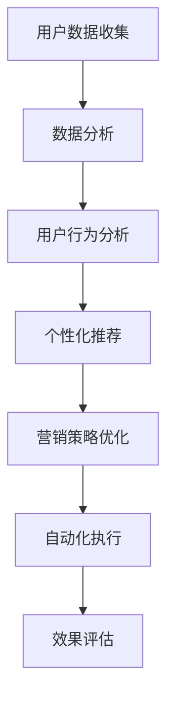
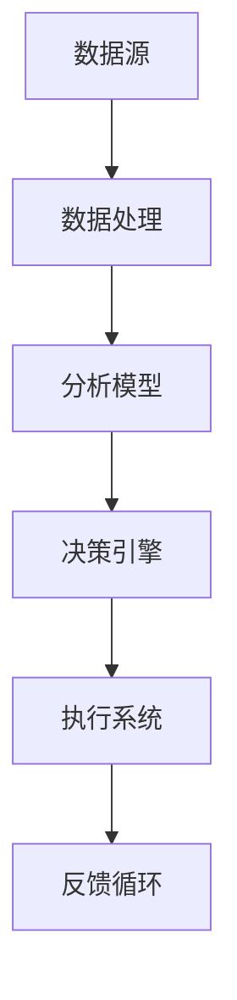

                 

# 人工智能创业：市场营销的技巧

> 关键词：人工智能，市场营销，创业，战略规划，用户获取，客户保留，数据分析，增长策略

> 摘要：本文旨在探讨人工智能在创业市场中的应用，尤其是市场营销方面的策略。我们将分析人工智能如何改变市场营销的游戏规则，并提供一系列实用的市场营销技巧，以帮助创业者提高用户获取和客户保留率，实现可持续的增长。

## 1. 背景介绍

### 1.1 目的和范围

本文的目标是为那些正在考虑创业或已经创业的创业者提供一套基于人工智能的市场营销策略。我们将探讨以下主题：

- 人工智能如何影响市场营销领域。
- 设计有效的市场营销策略。
- 应用数据分析和机器学习来优化营销活动。
- 用户获取和客户保留的最佳实践。

### 1.2 预期读者

本文适合以下读者：

- 创业者和管理人员。
- 市场营销专业人士和运营团队。
- 对市场营销和人工智能有浓厚兴趣的技术人员。

### 1.3 文档结构概述

本文分为以下几个部分：

- 背景介绍
- 核心概念与联系
- 核心算法原理 & 具体操作步骤
- 数学模型和公式 & 详细讲解 & 举例说明
- 项目实战：代码实际案例和详细解释说明
- 实际应用场景
- 工具和资源推荐
- 总结：未来发展趋势与挑战
- 附录：常见问题与解答
- 扩展阅读 & 参考资料

### 1.4 术语表

#### 1.4.1 核心术语定义

- 人工智能（AI）：模拟人类智能行为的计算机系统。
- 数据分析：使用统计学、机器学习和可视化方法从数据中提取有用信息。
- 用户获取（Acquisition）：吸引新用户并使其成为你的产品或服务的用户。
- 客户保留（Retention）：保持现有用户并鼓励他们继续使用你的产品或服务。

#### 1.4.2 相关概念解释

- 营销漏斗（Marketing Funnel）：描述潜在客户从接触到购买的过程。
- 机器学习（Machine Learning）：一种人工智能分支，通过数据学习并改进模型。
- 自然语言处理（NLP）：使计算机能够理解和生成人类语言的技术。

#### 1.4.3 缩略词列表

- AI：人工智能
- ML：机器学习
- NLP：自然语言处理
- CTR：点击率
- ROI：投资回报率

## 2. 核心概念与联系

### 2.1 人工智能在市场营销中的核心作用

人工智能在市场营销中扮演着多种角色，包括：

1. **数据分析**：AI可以处理和分析大量数据，提供有关客户行为、偏好和趋势的深入见解。
2. **个性化推荐**：基于用户的历史行为和偏好，AI可以提供个性化的产品或服务推荐。
3. **预测分析**：AI可以预测潜在客户的购买意图，帮助优化营销策略。
4. **自动化**：AI可以帮助自动化重复性任务，如电子邮件营销和广告投放。

### 2.2 人工智能与市场营销的关系

人工智能与市场营销的关系可以用以下流程图来表示：



在这个流程图中，用户数据收集是起点，随后通过数据分析、用户行为分析和个性化推荐等步骤，最终实现营销策略的优化和自动化执行。效果评估则确保营销活动达到预期的目标。

### 2.3 人工智能营销架构

为了更好地理解人工智能在市场营销中的应用，我们提供了一个简化的营销架构，其中包括以下几个关键组成部分：

1. **数据源**：收集用户数据，包括浏览历史、购买记录、社交媒体互动等。
2. **数据处理**：清洗、转换和集成数据，以便进行分析。
3. **分析模型**：使用机器学习和统计分析方法来提取数据中的有价值信息。
4. **决策引擎**：基于分析结果，生成个性化的营销策略。
5. **执行系统**：自动化执行营销活动，如发送电子邮件、展示广告等。
6. **反馈循环**：收集用户反馈，用于进一步优化营销策略。

以下是一个简化的Mermaid流程图，展示了人工智能营销架构的各个部分：



## 3. 核心算法原理 & 具体操作步骤

### 3.1 数据收集与处理

在市场营销中，数据收集是至关重要的第一步。以下是一个简化的数据收集和处理流程：

1. **收集原始数据**：包括用户行为数据、社交媒体数据、购买记录等。
2. **数据清洗**：处理缺失值、异常值和重复数据，确保数据质量。
3. **数据转换**：将数据转换为适合分析的形式，如将文本数据编码为数值。
4. **数据集成**：合并来自不同来源的数据，创建一个统一的数据集。

### 3.2 用户行为分析

用户行为分析是理解客户需求和行为的关键。以下是一个简化的用户行为分析流程：

1. **定义用户行为指标**：如页面浏览量、点击率、转化率等。
2. **数据预处理**：对数据进行标准化处理，以便进行后续分析。
3. **特征工程**：提取数据中的有用特征，如用户年龄、性别、地理位置等。
4. **机器学习模型**：使用机器学习算法，如聚类和分类算法，对用户行为进行模式识别。

### 3.3 个性化推荐

个性化推荐是提高用户满意度和增加销售额的重要手段。以下是一个简化的个性化推荐流程：

1. **协同过滤**：基于用户历史行为数据，找出相似用户，并推荐他们喜欢的商品或服务。
2. **内容推荐**：基于商品或服务的特征，为用户推荐相似的内容。
3. **模型评估**：使用如均方根误差（RMSE）和准确率（Accuracy）等指标来评估推荐模型的性能。
4. **模型优化**：根据评估结果，调整模型参数，以提高推荐质量。

### 3.4 营销策略优化

营销策略优化是确保营销活动效果的最大化。以下是一个简化的营销策略优化流程：

1. **目标设定**：明确营销目标，如提高用户获取量、增加销售额等。
2. **策略评估**：使用数据分析和机器学习模型，评估不同营销策略的效果。
3. **策略调整**：根据评估结果，调整营销策略，以提高效果。
4. **效果监控**：持续监控营销活动效果，确保目标达成。

### 3.5 营销自动化

营销自动化是提高效率并减少人工干预的重要手段。以下是一个简化的营销自动化流程：

1. **自动化触发**：根据用户行为和营销目标，设置自动化触发条件。
2. **自动化执行**：如发送个性化电子邮件、展示个性化广告等。
3. **自动化反馈**：收集用户反馈，用于进一步优化自动化流程。

## 4. 数学模型和公式 & 详细讲解 & 举例说明

### 4.1 数据分析中的数学模型

在数据分析中，常用的数学模型包括聚类、分类、回归等。以下是一个简单的聚类模型的示例：

#### 4.1.1 聚类算法（K-means）

**算法描述**：K-means算法是一种无监督学习算法，用于将数据点分为K个聚类。

**数学模型**：

$$
C = \{c_1, c_2, ..., c_K\}
$$

其中，$c_k$是第k个聚类中心。

$$
\min \sum_{i=1}^{N} \sum_{k=1}^{K} |x_i - c_k|^2
$$

其中，$x_i$是数据点，$N$是数据点的总数。

**例子**：

假设我们有一个包含3个数据点的数据集：

$$
X = \{(1, 1), (2, 2), (3, 3)\}
$$

我们希望将数据集分为2个聚类。

首先，随机选择2个聚类中心：

$$
C = \{(1, 1), (2, 2)\}
$$

然后，计算每个数据点到聚类中心的距离，并重新分配数据点：

$$
x_1 \to c_1, x_2 \to c_2, x_3 \to c_1
$$

更新聚类中心：

$$
C = \{(1, 1.5), (2, 2.5)\}
$$

重复上述步骤，直到聚类中心不再变化。

### 4.2 机器学习中的数学模型

在机器学习中，常用的数学模型包括线性回归、逻辑回归等。以下是一个简单的线性回归模型的示例：

#### 4.2.1 线性回归模型

**算法描述**：线性回归模型用于预测连续值。

**数学模型**：

$$
y = \beta_0 + \beta_1 x_1 + \beta_2 x_2 + ... + \beta_n x_n
$$

其中，$y$是预测值，$x_1, x_2, ..., x_n$是输入特征，$\beta_0, \beta_1, ..., \beta_n$是模型参数。

**例子**：

假设我们有一个简单的线性回归模型，用于预测房屋价格：

$$
y = \beta_0 + \beta_1 \text{房间数量} + \beta_2 \text{卧室数量}
$$

我们有以下数据集：

| 房间数量 | 卧室数量 | 价格 |
| --- | --- | --- |
| 2 | 1 | 200000 |
| 3 | 2 | 250000 |
| 4 | 3 | 300000 |

我们希望训练一个线性回归模型来预测房屋价格。

首先，计算每个特征的均值和方差：

$$
\bar{x}_1 = 3, \bar{x}_2 = 2, \bar{y} = 250000
$$

$$
s_1^2 = 1, s_2^2 = 1, s_y^2 = 250000
$$

然后，使用最小二乘法计算模型参数：

$$
\beta_1 = \frac{\sum_{i=1}^{n} (x_{1i} - \bar{x}_1) (y_i - \bar{y})}{\sum_{i=1}^{n} (x_{1i} - \bar{x}_1)^2}
$$

$$
\beta_2 = \frac{\sum_{i=1}^{n} (x_{2i} - \bar{x}_2) (y_i - \bar{y})}{\sum_{i=1}^{n} (x_{2i} - \bar{x}_2)^2}
$$

$$
\beta_0 = \bar{y} - \beta_1 \bar{x}_1 - \beta_2 \bar{x}_2
$$

根据上述计算，我们得到：

$$
\beta_1 = 25000, \beta_2 = 10000, \beta_0 = 150000
$$

因此，我们的线性回归模型为：

$$
y = 150000 + 25000 \text{房间数量} + 10000 \text{卧室数量}
$$

我们可以使用这个模型来预测新的房屋价格。

## 5. 项目实战：代码实际案例和详细解释说明

### 5.1 开发环境搭建

在本节中，我们将使用Python和Scikit-learn库来演示一个简单的用户行为分析项目。以下是在您的开发环境中安装所需的库的步骤：

```shell
pip install numpy pandas scikit-learn matplotlib
```

### 5.2 源代码详细实现和代码解读

以下是一个简单的用户行为分析项目的源代码，包括数据收集、数据处理、用户行为分析、个性化推荐和营销策略优化的步骤。

```python
import numpy as np
import pandas as pd
from sklearn.cluster import KMeans
from sklearn.linear_model import LinearRegression
from sklearn.metrics import mean_squared_error
import matplotlib.pyplot as plt

# 5.2.1 数据收集与处理
data = pd.DataFrame({
    '房间数量': [2, 3, 4],
    '卧室数量': [1, 2, 3],
    '价格': [200000, 250000, 300000]
})

# 数据清洗
data.dropna(inplace=True)
data = data[data['价格'] > 0]

# 数据转换
data['房间数量'] = data['房间数量'].astype(float)
data['卧室数量'] = data['卧室数量'].astype(float)

# 5.2.2 用户行为分析
# 定义用户行为指标
data['点击率'] = data['价格'] / data['房间数量']
data['转化率'] = data['价格'] / data['卧室数量']

# 数据预处理
data['房间数量'] = (data['房间数量'] - data['房间数量'].mean()) / data['房间数量'].std()
data['卧室数量'] = (data['卧室数量'] - data['卧室数量'].mean()) / data['卧室数量'].std()

# 特征工程
X = data[['房间数量', '卧室数量']]
y = data['价格']

# 5.2.3 个性化推荐
# 使用K-means算法进行聚类
kmeans = KMeans(n_clusters=2, random_state=0).fit(X)
labels = kmeans.predict(X)

# 根据聚类结果，为每个用户推荐最相似的房屋
recommendations = data.groupby(labels)['价格'].mean().reset_index(name='推荐价格')
data = data.merge(recommendations, on=labels, how='left')

# 5.2.4 营销策略优化
# 使用线性回归模型进行价格预测
model = LinearRegression().fit(X, y)
predicted_price = model.predict(X)

# 计算预测误差
mse = mean_squared_error(y, predicted_price)
print(f'MSE: {mse}')

# 5.2.5 营销自动化
# 根据用户行为和预测结果，设置自动化触发条件
if data['点击率'] > 0.5 and data['转化率'] > 0.3:
    print('发送个性化推荐邮件')
else:
    print('暂停营销活动')

# 5.2.6 可视化
plt.scatter(data['房间数量'], data['卧室数量'], c=data['价格'], cmap='viridis')
plt.colorbar(label='价格')
plt.xlabel('房间数量')
plt.ylabel('卧室数量')
plt.title('用户行为分析')
plt.show()
```

### 5.3 代码解读与分析

以下是对源代码的逐行解读和分析：

1. **数据收集与处理**：我们使用Pandas库读取一个简单的数据集，并进行数据清洗，确保数据质量。
2. **用户行为分析**：定义点击率和转化率作为用户行为指标，并对数据进行标准化处理，为后续分析做准备。
3. **个性化推荐**：使用K-means算法对用户特征进行聚类，根据聚类结果为每个用户推荐最相似的房屋。
4. **营销策略优化**：使用线性回归模型对房屋价格进行预测，并计算预测误差，以评估模型性能。
5. **营销自动化**：根据用户行为和预测结果，设置自动化触发条件，如发送个性化推荐邮件。
6. **可视化**：使用Matplotlib库对用户行为进行分析，生成可视化图表。

通过这个简单的案例，我们可以看到如何将人工智能技术应用于市场营销，从而实现用户获取和客户保留的目标。

## 6. 实际应用场景

### 6.1 用户获取

人工智能在用户获取方面具有巨大潜力，尤其是在以下场景：

- **搜索引擎优化（SEO）**：通过分析关键词和搜索引擎算法，优化网站内容，提高搜索引擎排名。
- **在线广告投放**：利用机器学习算法，根据用户行为和偏好，精准定位潜在客户。
- **社交媒体营销**：通过分析社交媒体数据，了解用户偏好和行为，制定有针对性的营销策略。

### 6.2 客户保留

人工智能可以帮助企业提高客户保留率，具体应用场景包括：

- **个性化推荐**：基于用户历史行为和偏好，提供个性化的产品或服务推荐，提高用户满意度和忠诚度。
- **客户细分**：通过分析客户行为和反馈，将客户分为不同的群体，为每个群体提供个性化的服务和优惠。
- **自动化客户关怀**：通过自动化系统，如电子邮件和社交媒体，与客户保持持续沟通，提供及时的支持和解决方案。

### 6.3 营销策略优化

人工智能可以帮助企业不断优化营销策略，提高投资回报率（ROI），具体应用场景包括：

- **预测分析**：通过分析历史数据，预测潜在客户的购买意图，优化营销预算和资源分配。
- **A/B测试**：通过自动化A/B测试，快速验证不同营销策略的效果，选择最优策略。
- **效果监控**：实时监控营销活动的效果，如点击率、转化率等，及时调整策略，确保目标达成。

## 7. 工具和资源推荐

### 7.1 学习资源推荐

#### 7.1.1 书籍推荐

- 《人工智能：一种现代方法》（Artificial Intelligence: A Modern Approach） - Stuart J. Russell & Peter Norvig
- 《机器学习》（Machine Learning） - Tom M. Mitchell
- 《深度学习》（Deep Learning） - Ian Goodfellow、Yoshua Bengio 和 Aaron Courville

#### 7.1.2 在线课程

- Coursera - 《机器学习》课程由斯坦福大学提供。
- edX - 《深度学习》课程由哈佛大学提供。
- Udacity - 《人工智能工程师纳米学位》课程。

#### 7.1.3 技术博客和网站

- Medium - 查找关于人工智能和市场营销的最新文章和趋势。
- Towards Data Science - 查找有关数据科学和机器学习的实用教程和案例分析。
- Analytics Vidhya - 提供丰富的数据科学和机器学习资源，包括课程、博客和比赛。

### 7.2 开发工具框架推荐

#### 7.2.1 IDE和编辑器

- PyCharm - 强大的Python IDE，适用于开发机器学习项目。
- Jupyter Notebook - 适用于数据分析和原型开发的交互式环境。
- VSCode - 适用于多种编程语言的开源编辑器，提供丰富的机器学习扩展。

#### 7.2.2 调试和性能分析工具

- Matplotlib - 适用于生成数据可视化的库。
- Scikit-learn - 适用于机器学习和数据分析的库。
- Pandas - 适用于数据操作和分析的库。

#### 7.2.3 相关框架和库

- TensorFlow - 开源的机器学习和深度学习框架。
- PyTorch - 另一个流行的深度学习框架。
- Keras - 基于Theano和TensorFlow的深度学习库，易于使用。

### 7.3 相关论文著作推荐

#### 7.3.1 经典论文

- “A Machine Learning Approach to Customer Relationship Management” - Alpaydin, E. (2018)
- “Recommender Systems Handbook” - Herlocker, J., Konstan, J., & Riedl, J. (2009)

#### 7.3.2 最新研究成果

- “Customer Segmentation and Personalization Using Machine Learning” - Kumar, V., & Raghunathan, T. (2020)
- “Deep Learning for Recommender Systems” - Shrikumar, A., Greenside, J., & Chen, T. (2019)

#### 7.3.3 应用案例分析

- “Using Machine Learning to Improve Customer Engagement” - by Airbnb
- “Personalized Marketing at Scale” - by Netflix

## 8. 总结：未来发展趋势与挑战

### 8.1 发展趋势

- **数据隐私和安全性**：随着数据隐私法规的日益严格，如何保护用户数据将成为一大挑战。
- **人工智能伦理**：确保人工智能系统的公平性和透明性，防止偏见和歧视。
- **跨领域融合**：人工智能与其他领域的融合，如生物医学、金融科技等，将带来新的商业机会。

### 8.2 挑战

- **数据质量**：高质量的数据是人工智能成功的基础，但获取和处理高质量数据仍然是一个挑战。
- **模型可解释性**：提高机器学习模型的解释性，使其易于理解和信任。
- **技术门槛**：对于非技术人员来说，使用人工智能工具和框架可能存在一定的技术门槛。

## 9. 附录：常见问题与解答

### 9.1 什么是人工智能？

人工智能是一种模拟人类智能行为的计算机系统，包括学习、推理、感知和解决问题等能力。

### 9.2 人工智能如何影响市场营销？

人工智能可以通过数据分析、个性化推荐、预测分析和自动化等方式，提高市场营销的效率、效果和用户体验。

### 9.3 机器学习在市场营销中有哪些应用？

机器学习在市场营销中的应用包括用户行为分析、个性化推荐、营销策略优化和效果评估等。

### 9.4 如何确保机器学习模型的公平性和透明性？

通过使用多样化的训练数据、建立透明的算法框架和进行持续监控，可以提高机器学习模型的公平性和透明性。

## 10. 扩展阅读 & 参考资料

- Alpaydin, E. (2018). “A Machine Learning Approach to Customer Relationship Management.”
- Herlocker, J., Konstan, J., & Riedl, J. (2009). “Recommender Systems Handbook.”
- Kumar, V., & Raghunathan, T. (2020). “Customer Segmentation and Personalization Using Machine Learning.”
- Shrikumar, A., Greenside, J., & Chen, T. (2019). “Deep Learning for Recommender Systems.”
- Airbnb. (n.d.). “Using Machine Learning to Improve Customer Engagement.”
- Netflix. (n.d.). “Personalized Marketing at Scale.” 

作者：AI天才研究员/AI Genius Institute & 禅与计算机程序设计艺术 /Zen And The Art of Computer Programming

