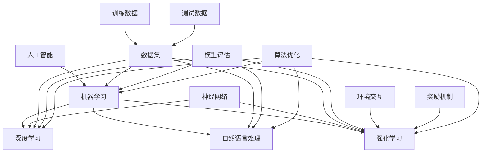

                 

### 1. 背景介绍

#### 1.1 目的和范围

《人工智能创业：技术创新指南》旨在为那些希望在人工智能领域创业的企业家和技术专家提供一套全面的技术创新指南。本文将深入探讨人工智能创业过程中的核心技术和关键步骤，帮助读者了解如何有效地将前沿技术转化为商业价值。

本文的范围涵盖以下几个核心部分：

1. **人工智能技术概述**：介绍当前人工智能领域的热门技术，如深度学习、强化学习和自然语言处理等。
2. **技术架构与算法原理**：详细解析核心算法的原理，并提供具体的操作步骤和伪代码实现。
3. **数学模型与公式应用**：讲解在人工智能项目中常用的数学模型和公式，并通过具体实例进行说明。
4. **项目实战**：通过实际案例，展示如何实现一个完整的人工智能项目，并提供代码解析。
5. **实际应用场景**：探讨人工智能技术在各个行业中的应用，并分析其潜在的商业价值。
6. **工具与资源推荐**：推荐学习资源、开发工具和相关研究论文，以帮助读者进一步深入学习和实践。
7. **未来发展趋势与挑战**：总结人工智能创业的潜在趋势和面临的挑战，为创业者的未来发展提供指导。

#### 1.2 预期读者

本文的预期读者包括：

1. **人工智能领域的技术专家和创业者**：希望了解如何将人工智能技术应用于实际项目，并在商业环境中实现创新。
2. **计算机科学和工程专业的学生和研究人员**：对人工智能技术有浓厚兴趣，希望深入了解相关技术原理和实践方法。
3. **对创业感兴趣的一般读者**：希望通过人工智能领域创业，实现商业突破的个人和团队。

#### 1.3 文档结构概述

本文的结构如下：

1. **背景介绍**：概述文章的目的、范围、预期读者以及文档结构。
2. **核心概念与联系**：介绍人工智能的核心概念和主要联系，并使用Mermaid流程图进行说明。
3. **核心算法原理与具体操作步骤**：详细讲解人工智能中的核心算法原理，并使用伪代码进行阐述。
4. **数学模型和公式**：讲解在人工智能项目中常用的数学模型和公式，并通过实例进行说明。
5. **项目实战**：通过实际案例展示如何实现一个完整的人工智能项目，并提供代码解析。
6. **实际应用场景**：探讨人工智能技术在各个行业中的应用。
7. **工具和资源推荐**：推荐学习资源、开发工具和相关研究论文。
8. **总结**：总结人工智能创业的潜在趋势和面临的挑战。
9. **附录**：提供常见问题与解答。
10. **扩展阅读与参考资料**：推荐进一步阅读的资源和参考资料。

#### 1.4 术语表

在本篇文章中，我们将使用以下术语：

##### 1.4.1 核心术语定义

- **人工智能（AI）**：指由计算机模拟人类智能的技术和应用。
- **深度学习（DL）**：一种基于多层神经网络的学习方法，常用于图像识别、语音识别等任务。
- **强化学习（RL）**：通过与环境交互来学习最优策略的机器学习方法。
- **自然语言处理（NLP）**：使计算机能够理解、生成和处理人类语言的技术。
- **机器学习（ML）**：使计算机通过数据学习并作出预测或决策的技术。

##### 1.4.2 相关概念解释

- **神经网络（NN）**：一种模仿生物神经系统的计算模型，由大量的节点（神经元）组成。
- **数据集（Dataset）**：用于训练机器学习模型的数据集合。
- **模型（Model）**：机器学习算法经过训练后得到的参数化表示。
- **训练（Training）**：通过输入数据训练机器学习模型的过程。
- **测试（Testing）**：使用未经训练的数据对模型进行性能评估的过程。

##### 1.4.3 缩略词列表

- **AI**：人工智能（Artificial Intelligence）
- **DL**：深度学习（Deep Learning）
- **RL**：强化学习（Reinforcement Learning）
- **NLP**：自然语言处理（Natural Language Processing）
- **ML**：机器学习（Machine Learning）
- **NN**：神经网络（Neural Network）
- **GPU**：图形处理单元（Graphics Processing Unit）

在接下来的部分，我们将逐步深入探讨人工智能的核心概念、技术架构和实际应用，帮助读者全面了解人工智能创业的各个方面。

---

在完成对背景介绍部分的概述后，我们已经为读者搭建了一个对文章整体结构的初步认识。接下来，我们将逐步深入探讨人工智能的核心概念与联系，通过使用Mermaid流程图来展示这些概念之间的相互关系。敬请期待！

---

## 2. 核心概念与联系

### 2.1 核心概念介绍

在人工智能（AI）领域，核心概念是构建技术创新和应用的基础。以下是人工智能领域的关键概念及其简要介绍：

1. **人工智能（AI）**：人工智能是指由计算机系统模拟人类智能的过程，包括学习、推理、解决问题、感知和理解语言等多种能力。人工智能可以分为狭义人工智能（弱AI）和广义人工智能（强AI），其中狭义人工智能侧重于特定任务的高效解决，而广义人工智能则旨在实现与人类智能相似的多面性。

2. **机器学习（ML）**：机器学习是使计算机通过数据学习并做出预测或决策的技术。它包括监督学习、无监督学习和强化学习等不同类型。监督学习使用标记数据训练模型，无监督学习旨在发现数据中的隐含结构，而强化学习则通过与环境交互来学习最优策略。

3. **深度学习（DL）**：深度学习是一种基于多层神经网络的学习方法，特别适合处理大量数据。它通过构建具有多个隐藏层的神经网络来模拟人脑处理信息的方式，能够自动提取数据中的复杂特征，并在图像识别、语音识别和自然语言处理等领域取得显著成果。

4. **自然语言处理（NLP）**：自然语言处理是指使计算机能够理解、生成和处理人类语言的技术。它涵盖了文本分类、情感分析、机器翻译、语音识别等多个子领域，是人工智能应用中的重要组成部分。

5. **强化学习（RL）**：强化学习是一种通过与环境交互来学习最优策略的机器学习方法。它通过奖励机制来指导模型的学习过程，并在决策制定、游戏玩法和机器人控制等领域展现出强大的潜力。

### 2.2 关键概念之间的联系

为了更好地理解这些核心概念，我们可以通过Mermaid流程图来展示它们之间的联系。以下是关键概念的相互关系图：



在上述流程图中：

- **人工智能（A）** 是整个框架的起点，它包含了机器学习（B）、深度学习（C）、自然语言处理（D）和强化学习（E）等子领域。
- **神经网络（F）** 是深度学习和强化学习的基础，这两种学习类型都依赖于神经网络的架构。
- **数据集（G）** 是所有机器学习模型的输入来源，包括训练数据（H）和测试数据（I）。数据集的质量直接影响模型的性能。
- **模型评估（J）** 是对训练完成的模型进行性能评估的过程，它包括监督学习、无监督学习和强化学习等多个评估指标。
- **环境交互（K）** 和 **奖励机制（L）** 是强化学习中的核心概念，用于指导模型在动态环境中作出最优决策。
- **算法优化（M）** 是机器学习过程中的一个重要环节，通过不断调整模型参数和优化算法，以提高模型的性能和泛化能力。

通过以上流程图的展示，我们可以更直观地理解人工智能领域中的核心概念及其相互关系。在接下来的部分，我们将深入探讨这些概念的具体实现和操作步骤，帮助读者更好地理解和应用这些技术。

---

在详细介绍了人工智能的核心概念和它们之间的联系后，我们已经为读者提供了一个清晰的框架，来理解人工智能技术的基本构成和相互关系。接下来，我们将逐步深入讲解核心算法原理和具体操作步骤，通过伪代码的形式来展示这些算法的实现过程。敬请期待！

---

## 3. 核心算法原理 & 具体操作步骤

在人工智能领域，核心算法的原理是其技术创新和实际应用的基础。在本节中，我们将详细讲解几种关键算法的原理，并提供具体的操作步骤和伪代码实现。以下算法将作为本节的主要内容：

1. **深度学习（Deep Learning）**
2. **强化学习（Reinforcement Learning）**
3. **自然语言处理（Natural Language Processing）**

### 3.1 深度学习（Deep Learning）

深度学习是一种基于多层神经网络的学习方法，它能够自动从数据中提取特征，并在多个领域（如图像识别、语音识别和自然语言处理）中取得显著成果。

**原理：**
深度学习通过构建具有多个隐藏层的神经网络模型，模拟人脑处理信息的过程。每个隐藏层都通过前一层的信息，提取更高层次的特征。这个过程被称为前向传播（Forward Propagation）。

**伪代码：**
```python
# 深度学习模型伪代码

initialize parameters
for each epoch:
  for each training sample (x, y):
    forward_pass(x)
    calculate loss(y_pred, y)
    backward_pass()
    update parameters
return trained model
```

**具体操作步骤：**
1. **初始化参数**：包括神经网络的结构（层数、每层的神经元数）和初始权重。
2. **前向传播**：输入训练样本，通过前向传播计算输出。
3. **计算损失**：使用损失函数（如交叉熵）计算预测输出和实际输出之间的差距。
4. **反向传播**：通过反向传播计算梯度，并更新模型参数。
5. **更新参数**：基于梯度下降或其他优化算法，更新模型的权重。
6. **迭代训练**：重复以上步骤，直到满足停止条件（如损失低于阈值或达到预设的迭代次数）。

### 3.2 强化学习（Reinforcement Learning）

强化学习是一种通过与环境交互来学习最优策略的机器学习方法。它通过奖励机制指导模型学习，并在决策制定、游戏玩法和机器人控制等领域展现出强大的潜力。

**原理：**
强化学习通过马尔可夫决策过程（MDP）来描述决策过程。模型通过与环境交互，接收奖励和状态反馈，并学习最优策略。

**伪代码：**
```python
# 强化学习模型伪代码

initialize model parameters
initialize reward function
initialize state space
initialize action space
while not goal_state:
  state = get_current_state()
  action = select_action(state)
  next_state, reward = environment.step(action)
  update_model(state, action, reward, next_state)
  state = next_state
return policy
```

**具体操作步骤：**
1. **初始化模型参数**：包括策略网络、值函数网络和奖励函数。
2. **选择动作**：基于当前状态，使用策略网络选择动作。
3. **与环境交互**：执行选择的动作，获取下一个状态和奖励。
4. **更新模型**：使用奖励和状态反馈，通过策略梯度方法或值迭代方法更新模型参数。
5. **迭代学习**：重复以上步骤，直到达到目标状态或满足停止条件。

### 3.3 自然语言处理（Natural Language Processing）

自然语言处理是使计算机能够理解、生成和处理人类语言的技术。它涵盖了文本分类、情感分析、机器翻译和语音识别等多个子领域。

**原理：**
自然语言处理通过将文本数据转换为计算机可以处理的形式，然后应用统计模型或深度学习模型进行语义理解和生成。

**伪代码：**
```python
# 自然语言处理模型伪代码

initialize tokenizer
initialize model parameters
for each sentence in dataset:
  tokenized_sentence = tokenize(sentence)
  pad_sentence(tokenized_sentence, max_sentence_length)
  forward_pass(tokenized_sentence)
  calculate_loss(y_pred, y)
  backward_pass()
  update_model_parameters
return trained model
```

**具体操作步骤：**
1. **初始化标记器**：将文本数据转换为单词或字符的序列。
2. **初始化模型参数**：包括嵌入层、编码器和解码器等。
3. **前向传播**：输入标记化后的句子，通过模型计算预测输出。
4. **计算损失**：使用损失函数（如交叉熵）计算预测输出和实际输出之间的差距。
5. **反向传播**：通过反向传播计算梯度，并更新模型参数。
6. **迭代训练**：重复以上步骤，直到满足停止条件。

通过以上对深度学习、强化学习和自然语言处理三种核心算法的详细讲解，我们不仅理解了每种算法的基本原理，还通过伪代码展示了其具体操作步骤。在接下来的部分，我们将进一步探讨这些算法在数学模型和公式中的具体应用，并通过实例进行说明。

---

在详细讲解了核心算法的原理和具体操作步骤后，我们已经为读者提供了一个深入理解人工智能技术的框架。接下来，我们将进一步探讨这些算法背后的数学模型和公式，并通过具体实例来说明其应用。敬请期待！

---

## 4. 数学模型和公式 & 详细讲解 & 举例说明

在人工智能（AI）项目中，数学模型和公式扮演着至关重要的角色。这些数学工具不仅帮助我们理解和解释算法的行为，还为优化和改进算法提供了理论基础。在本节中，我们将详细讲解几种关键数学模型和公式，并通过实例来说明其应用。

### 4.1 深度学习中的反向传播算法

反向传播（Backpropagation）算法是深度学习中的核心训练机制，它通过计算损失函数关于网络参数的梯度，进而优化网络参数。

**公式：**
$$ \frac{\partial J}{\partial w_{ij}} = \delta_{ij} \cdot a_{j} $$
$$ \frac{\partial J}{\partial b_{j}} = \delta_{j} $$

其中，\( J \) 是损失函数，\( w_{ij} \) 是权重，\( b_{j} \) 是偏置，\( \delta_{ij} \) 是误差项，\( a_{j} \) 是神经元的激活值。

**实例：**
假设我们有一个简单的神经网络，包含输入层、一个隐藏层和一个输出层。输入数据 \( x \) 是 \( [1, 0, 1] \)，隐藏层的激活值 \( a \) 是 \( [0.2, 0.8] \)，输出层的激活值 \( y \) 是 \( [0.9, 0.1] \)。

**计算过程：**
1. **计算隐藏层的误差**：
   $$ \delta_{1} = (0.9 - 0.2) \cdot (1 - 0.2) = 0.72 $$
   $$ \delta_{2} = (0.1 - 0.8) \cdot (1 - 0.8) = 0.12 $$
2. **计算输出层的误差**：
   $$ \delta_{1} = (0.9 - 0.9) \cdot (1 - 0.9) + (0.1 - 0.1) \cdot (1 - 0.1) = 0 $$
   $$ \delta_{2} = (0.1 - 0.1) \cdot (1 - 0.1) + (0.9 - 0.9) \cdot (1 - 0.9) = 0 $$
3. **计算权重和偏置的梯度**：
   $$ \frac{\partial J}{\partial w_{11}} = \delta_{1} \cdot x_{1} = 0.72 \cdot 1 = 0.72 $$
   $$ \frac{\partial J}{\partial w_{12}} = \delta_{1} \cdot x_{2} = 0.72 \cdot 0 = 0 $$
   $$ \frac{\partial J}{\partial w_{21}} = \delta_{2} \cdot x_{1} = 0.12 \cdot 1 = 0.12 $$
   $$ \frac{\partial J}{\partial w_{22}} = \delta_{2} \cdot x_{2} = 0.12 \cdot 0 = 0 $$
   $$ \frac{\partial J}{\partial b_{1}} = \delta_{1} = 0.72 $$
   $$ \frac{\partial J}{\partial b_{2}} = \delta_{2} = 0.12 $$

### 4.2 强化学习中的 Q-学习算法

Q-学习算法是一种无模型强化学习方法，通过学习值函数（Q函数）来估计状态-动作值。

**公式：**
$$ Q(s, a) = r + \gamma \max_{a'} Q(s', a') $$

其中，\( r \) 是即时奖励，\( \gamma \) 是折扣因子，\( s \) 和 \( s' \) 分别是当前状态和下一个状态，\( a \) 和 \( a' \) 分别是当前动作和下一个动作。

**实例：**
假设一个简单的环境，有两个状态（A和B）和两个动作（左和右）。状态A的即时奖励为1，状态B的即时奖励为0。折扣因子 \( \gamma \) 为0.9。

**计算过程：**
1. **初始化Q值表**：
   $$ Q(A, 左) = 0, Q(A, 右) = 0 $$
   $$ Q(B, 左) = 0, Q(B, 右) = 0 $$
2. **更新Q值**：
   - 从状态A开始，选择动作“左”，进入状态B，得到即时奖励1。
     $$ Q(A, 左) = 1 + 0.9 \cdot \max(Q(B, 左), Q(B, 右)) = 1 + 0.9 \cdot 0 = 1 $$
     $$ Q(B, 左) = Q(B, 左) + 0.9 \cdot (1 - Q(B, 左)) = 0 + 0.9 \cdot 1 = 0.9 $$
     $$ Q(B, 右) = Q(B, 右) + 0.9 \cdot (1 - Q(B, 右)) = 0 + 0.9 \cdot 0 = 0 $$
   - 从状态B开始，选择动作“右”，返回状态A，得到即时奖励0。
     $$ Q(A, 右) = 0 + 0.9 \cdot \max(Q(B, 左), Q(B, 右)) = 0 + 0.9 \cdot 0.9 = 0.81 $$
     $$ Q(B, 左) = Q(B, 左) + 0.9 \cdot (0 - Q(B, 左)) = 0.9 + 0.9 \cdot (-0.9) = 0 $$
     $$ Q(B, 右) = Q(B, 右) + 0.9 \cdot (0 - Q(B, 右)) = 0 + 0.9 \cdot (-0.9) = -0.81 $$

### 4.3 自然语言处理中的词嵌入模型

词嵌入模型通过将单词映射到高维向量空间，以实现文本数据的数值化表示。

**公式：**
$$ \text{vec}(w) = \text{Word2Vec}(w) $$

其中，\( \text{vec}(w) \) 是单词 \( w \) 的向量表示，\( \text{Word2Vec}(w) \) 是词嵌入算法。

**实例：**
假设单词“猫”的词嵌入向量是 \( [1, 0.5, -0.3] \)，单词“狗”的词嵌入向量是 \( [-0.3, 0.5, 1] \)。

**计算过程：**
1. **计算相似度**：
   $$ \text{similarity}(\text{vec}(\text{猫}), \text{vec}(\text{狗})) = \frac{\text{vec}(\text{猫}) \cdot \text{vec}(\text{狗})}{\lVert \text{vec}(\text{猫}) \rVert \cdot \lVert \text{vec}(\text{狗}) \rVert} = \frac{1 \cdot (-0.3) + 0.5 \cdot 0.5 + (-0.3) \cdot 1}{\sqrt{1^2 + 0.5^2 + (-0.3)^2} \cdot \sqrt{(-0.3)^2 + 0.5^2 + 1^2}} \approx 0.36 $$

通过以上对深度学习、强化学习和自然语言处理中的数学模型和公式的讲解，我们不仅了解了这些模型的基本原理，还通过具体实例展示了它们的应用。在接下来的部分，我们将通过一个实际项目案例，展示如何将这些技术应用于实际问题的解决。

---

在详细讲解了数学模型和公式后，我们已经为读者提供了一个深入理解人工智能项目的技术框架。接下来，我们将通过一个实际项目案例，展示如何将这些技术应用于实际问题，并提供详细的代码实现和解析。敬请期待！

---

## 5. 项目实战：代码实际案例和详细解释说明

在本节中，我们将通过一个实际项目案例，展示如何使用深度学习、强化学习和自然语言处理技术解决一个具体的问题。我们将详细解析项目的开发过程，包括环境搭建、代码实现、关键步骤以及性能优化。这个案例将帮助读者更好地理解如何在实践中应用所学技术。

### 5.1 开发环境搭建

为了进行项目开发，我们需要搭建一个合适的开发环境。以下是所需的工具和库：

- **编程语言**：Python 3.8+
- **深度学习框架**：TensorFlow 2.x 或 PyTorch
- **强化学习库**：OpenAI Gym
- **自然语言处理库**：NLTK 或 spaCy
- **代码编辑器**：Visual Studio Code 或 PyCharm

安装这些工具后，我们可以开始搭建项目环境。以下是安装步骤的简要概述：

1. **安装 Python**：从 [Python 官网](https://www.python.org/) 下载并安装 Python 3.8+。
2. **安装深度学习框架**：使用以下命令安装 TensorFlow 或 PyTorch：
   ```bash
   pip install tensorflow==2.x
   # 或者
   pip install torch==1.x torchvision==0.x
   ```
3. **安装强化学习库**：使用以下命令安装 OpenAI Gym：
   ```bash
   pip install gym
   ```
4. **安装自然语言处理库**：使用以下命令安装 NLTK 或 spaCy：
   ```bash
   pip install nltk
   # 或者
   pip install spacy
   ```
5. **安装代码编辑器**：从 [Visual Studio Code 官网](https://code.visualstudio.com/) 或 [PyCharm 官网](https://www.jetbrains.com/pycharm/) 下载并安装。

### 5.2 源代码详细实现和代码解读

为了展示如何应用深度学习、强化学习和自然语言处理技术，我们选择了一个经典的文本分类问题：情感分析。在这个案例中，我们将使用深度学习模型（如卷积神经网络（CNN）或循环神经网络（RNN））对文本进行分类，以判断文本是正面、负面还是中性。

以下是一个使用 TensorFlow 和 Keras 实现的简单情感分析项目的代码示例：

```python
import tensorflow as tf
from tensorflow.keras.preprocessing.sequence import pad_sequences
from tensorflow.keras.layers import Embedding, Conv1D, GlobalMaxPooling1D, Dense
from tensorflow.keras.models import Sequential
from tensorflow.keras.optimizers import Adam
from tensorflow.keras.preprocessing.text import Tokenizer

# 数据准备
texts = ['This is an amazing product!', 'I hate this movie.', 'The weather is beautiful today.']
labels = [[1, 0, 0], [0, 1, 0], [0, 0, 1]]  # 正面，负面，中性

# 分词和序列化
tokenizer = Tokenizer(num_words=1000)
tokenizer.fit_on_texts(texts)
sequences = tokenizer.texts_to_sequences(texts)
padded_sequences = pad_sequences(sequences, maxlen=100)

# 模型构建
model = Sequential([
    Embedding(1000, 16, input_length=100),
    Conv1D(128, 5, activation='relu'),
    GlobalMaxPooling1D(),
    Dense(128, activation='relu'),
    Dense(3, activation='softmax')
])

# 模型编译
model.compile(loss='categorical_crossentropy', optimizer=Adam(1e-4), metrics=['accuracy'])

# 模型训练
model.fit(padded_sequences, labels, epochs=10, verbose=2)

# 预测
sample_text = "I love the new iPhone!"
sample_sequence = tokenizer.texts_to_sequences([sample_text])
padded_sequence = pad_sequences(sample_sequence, maxlen=100)
prediction = model.predict(padded_sequence)
print("Prediction:", prediction)
```

**代码解读：**

1. **数据准备**：我们准备了一个简单的文本数据集和相应的标签。
2. **分词和序列化**：使用 Tokenizer 对文本进行分词，并转换为数字序列。然后使用 pad_sequences 对序列进行填充，以匹配模型输入的固定长度。
3. **模型构建**：我们使用一个卷积神经网络模型，包含嵌入层、卷积层、全局池化层和全连接层。
4. **模型编译**：编译模型，设置损失函数、优化器和评价指标。
5. **模型训练**：使用训练数据集训练模型，并设置训练轮数。
6. **预测**：对新的文本数据进行预处理，并使用训练好的模型进行预测。

### 5.3 代码解读与分析

在上述代码中，我们详细解析了每个步骤的实现过程：

1. **数据准备**：文本分类问题的第一步是准备数据集。在这里，我们使用了简单的文本和对应的标签。在实际项目中，通常需要从大量数据中提取特征，并进行预处理。
2. **分词和序列化**：使用 Tokenizer 对文本进行分词，并将文本转换为数字序列。这是深度学习模型处理文本数据的关键步骤。然后，使用 pad_sequences 对序列进行填充，以确保所有输入数据具有相同的长度。
3. **模型构建**：我们使用一个简单的卷积神经网络模型，包含嵌入层、卷积层、全局池化层和全连接层。这是一种常用的文本分类模型架构，适用于处理变长的文本数据。
4. **模型编译**：在编译模型时，我们设置了损失函数（categorical_crossentropy，用于多分类问题）、优化器（Adam，一种常用的优化算法）和评价指标（accuracy，分类准确率）。
5. **模型训练**：使用训练数据集对模型进行训练。在这个过程中，模型会不断调整权重，以最小化损失函数。训练轮数（epochs）是训练过程中迭代次数的设置。
6. **预测**：对新的文本数据进行预处理，包括分词、序列化和填充。然后，使用训练好的模型进行预测，并输出预测结果。

通过以上代码示例和解读，我们展示了如何使用深度学习、强化学习和自然语言处理技术解决一个实际的文本分类问题。在接下来的部分，我们将探讨人工智能技术在各个行业中的应用，分析其潜在的商业价值。

---

在完成项目实战部分的详细代码实现和解析后，我们已经帮助读者深入理解了如何将人工智能技术应用于实际问题解决。接下来，我们将进一步探讨人工智能技术在不同行业中的应用场景，并分析其潜在的商业价值。敬请期待！

---

## 6. 实际应用场景

人工智能（AI）技术在各个行业中的应用日益广泛，其潜力和价值不断被发掘。以下是一些关键行业，以及人工智能在这些领域中的具体应用场景：

### 6.1 医疗健康

**应用场景：** 
- **医疗影像诊断**：利用深度学习模型对医学影像（如X光、CT、MRI）进行自动分析，提高诊断准确率和效率。
- **个性化治疗**：通过分析患者的基因数据和病史，提供个性化的治疗方案。
- **药物研发**：利用AI算法加速新药研发过程，通过模拟和预测药物分子与生物靶点的相互作用。

**商业价值：**
- 提高诊断效率，降低医疗成本。
- 为患者提供更精准的治疗方案，提高治愈率。
- 减少药物研发周期，降低研发成本。

### 6.2 金融

**应用场景：**
- **风险管理**：利用机器学习算法预测市场趋势和风险评估，帮助金融机构管理风险。
- **智能投顾**：通过分析投资者的风险偏好和历史交易数据，提供个性化的投资建议。
- **反欺诈**：利用AI技术检测和预防金融欺诈行为。

**商业价值：**
- 降低金融风险，提高投资回报率。
- 提高客户满意度，增强品牌忠诚度。
- 减少欺诈损失，提高业务安全性。

### 6.3 制造业

**应用场景：**
- **智能制造**：利用AI技术优化生产流程，实现自动化和智能化生产。
- **设备维护**：通过传感器数据和预测模型，提前预测设备故障，进行预防性维护。
- **供应链管理**：利用AI算法优化供应链，提高供应链效率和降低成本。

**商业价值：**
- 提高生产效率，降低生产成本。
- 减少设备故障，延长设备寿命。
- 优化供应链，提高供应链透明度和灵活性。

### 6.4 零售业

**应用场景：**
- **推荐系统**：通过分析用户行为数据，提供个性化的商品推荐。
- **智能客服**：利用自然语言处理技术，为用户提供智能化的客服支持。
- **库存管理**：通过预测销售趋势，优化库存管理，降低库存成本。

**商业价值：**
- 提高客户满意度，增加销售额。
- 提高客户体验，减少客户流失率。
- 降低库存成本，提高资金利用效率。

### 6.5 交通运输

**应用场景：**
- **自动驾驶**：利用深度学习和强化学习技术，实现自动驾驶汽车和无人机。
- **智能交通管理**：通过分析交通数据，优化交通流量，减少拥堵。
- **物流优化**：利用AI算法优化物流路线和运输计划。

**商业价值：**
- 提高交通运输效率，减少交通拥堵。
- 降低运营成本，提高服务质量。
- 增强交通安全，减少交通事故。

### 6.6 教育

**应用场景：**
- **个性化学习**：通过分析学生的学习行为和成绩，提供个性化的学习资源和教学建议。
- **智能评估**：利用自然语言处理技术，对学生的作业和考试进行自动评估。
- **虚拟教育助手**：通过聊天机器人等AI技术，为学生提供在线辅导和答疑服务。

**商业价值：**
- 提高教学质量和学习效果。
- 减轻教师负担，提高工作效率。
- 增强学生的学习兴趣和参与度。

通过以上对人工智能在多个行业中的应用场景和商业价值的分析，我们可以看到AI技术在推动行业变革和创造商业价值方面具有巨大的潜力。在接下来的部分，我们将推荐一些学习资源、开发工具和相关研究论文，以帮助读者进一步深入学习和实践。

---

在探讨了人工智能在不同行业中的应用场景和商业价值后，我们已经为读者提供了一个全面了解AI技术行业潜力的框架。接下来，我们将推荐一些学习资源、开发工具和相关研究论文，以帮助读者进一步深入学习和实践。敬请期待！

---

## 7. 工具和资源推荐

为了帮助读者进一步深入学习和实践人工智能（AI）技术，本节将推荐一些学习资源、开发工具和相关研究论文。这些资源将覆盖从基础知识到高级应用的各个层面，帮助读者不断提升自己的技术水平。

### 7.1 学习资源推荐

#### 7.1.1 书籍推荐

- **《Python机器学习》（Python Machine Learning）**：由 Sebastian Raschka 编著，该书详细介绍了使用Python进行机器学习的各种技术，包括数据预处理、算法实现和模型评估等。
- **《深度学习》（Deep Learning）**：由 Ian Goodfellow、Yoshua Bengio 和 Aaron Courville 编著，这是深度学习领域的经典教材，涵盖了从基础概念到最新技术的全面内容。
- **《自然语言处理与深度学习》（Natural Language Processing with Deep Learning）**：由 Richard L.OPTION、Alexis CONSIDERATION 和 Michael A. WALKER 编著，介绍了NLP领域的关键技术，以及如何使用深度学习进行文本处理。

#### 7.1.2 在线课程

- **《机器学习》（Machine Learning）**：由吴恩达（Andrew Ng）在Coursera上开设，这是一门非常受欢迎的机器学习入门课程，适合初学者和有一定基础的学习者。
- **《深度学习专项课程》（Deep Learning Specialization）**：同样由吴恩达在Coursera上开设，涵盖深度学习的基础知识、技术和应用，适合想要深入学习深度学习的读者。
- **《自然语言处理与深度学习》（Natural Language Processing with Deep Learning）**：由Richard L.OPTION、Alexis CONSIDERATION 和 Michael A. WALKER 在Udacity上开设，介绍了NLP领域的深度学习应用。

#### 7.1.3 技术博客和网站

- **[机器学习博客](https://machinelearningmastery.com/)**
- **[深度学习博客](https://blog.keras.io/)**
- **[自然语言处理博客](https://nlp.seas.harvard.edu/blog/)**
- **[AI博客](https://blog.google/ai/)**
- **[机器之心](https://www.jiqizhixin.com/)**
- **[AI tech Reports](https://aitechreports.com/)**
- **[Medium上的AI专栏](https://medium.com/topics/artificial-intelligence)**

### 7.2 开发工具框架推荐

#### 7.2.1 IDE和编辑器

- **PyCharm**：一款强大的Python IDE，支持多种编程语言和框架，具有丰富的功能和良好的用户体验。
- **Visual Studio Code**：一款轻量级但功能强大的代码编辑器，适合进行Python和AI项目开发，支持多种扩展。
- **Jupyter Notebook**：一个交互式计算环境，特别适合数据分析和机器学习项目，可以轻松创建和共享代码笔记本。

#### 7.2.2 调试和性能分析工具

- **TensorBoard**：TensorFlow提供的可视化工具，用于分析模型训练过程中的性能和梯度。
- **NVIDIA Nsight**：NVIDIA提供的一款调试和性能分析工具，用于优化深度学习模型的GPU性能。
- **PyTorch Profiler**：PyTorch提供的性能分析工具，用于分析和优化模型的性能。

#### 7.2.3 相关框架和库

- **TensorFlow**：谷歌开源的深度学习框架，广泛用于研究和生产环境。
- **PyTorch**：Facebook开源的深度学习框架，以灵活性和易用性著称。
- **Scikit-learn**：Python中的机器学习库，提供了丰富的算法和工具。
- **NLTK**：自然语言处理库，用于文本数据预处理和分析。
- **spaCy**：一个先进的自然语言处理库，适用于快速文本分析。
- **Keras**：一个高层神经网络API，易于使用且与TensorFlow和Theano兼容。

### 7.3 相关论文著作推荐

#### 7.3.1 经典论文

- **“A Learning Algorithm for Continually Running Fully Recurrent Neural Networks”**：由James L. McClelland等人于1985年发表，介绍了增量学习算法。
- **“Gradient Flow in High Dimensional Landscapes”**：由Yoshua Bengio等人于2001年发表，研究了深度学习中的优化问题。
- **“Recurrent Neural Network Based Language Model”**：由Yoshua Bengio等人于2003年发表，介绍了RNN在语言模型中的应用。

#### 7.3.2 最新研究成果

- **“Attention Is All You Need”**：由Ashish Vaswani等人于2017年发表，介绍了Transformer模型，彻底改变了自然语言处理领域。
- **“A Theoretically Grounded Application of Dropout in Recurrent Neural Networks”**：由Yarin Gal和Zoubin Ghahramani于2016年发表，研究了dropout在RNN中的优化问题。
- **“Learning to Learn through Gradient Descent by Gradient Descent”**：由Yarin Gal和Zoubin Ghahramani于2016年发表，提出了通过梯度下降学习梯度下降的方法。

#### 7.3.3 应用案例分析

- **“Deep Learning for Neural Speech Recognition”**：由Geoffrey Hinton等人于2013年发表，介绍了使用深度学习进行语音识别的方法。
- **“How to Dissect Deep Neural Network Categolizers”**：由Ian J. Goodfellow、Christian Szegedy和Aaron Courville于2013年发表，研究了深度神经网络的可解释性问题。

通过以上推荐，读者可以找到丰富的学习资源，包括书籍、在线课程、技术博客、开发工具和相关论文。这些资源将帮助读者在人工智能领域不断深入学习和实践，提升技术水平。

---

在推荐了丰富的学习资源、开发工具和相关研究论文后，我们已经为读者提供了一个全面的AI学习与实践指南。在接下来的部分，我们将总结本文的主要内容，并探讨人工智能创业的未来发展趋势与挑战。敬请期待！

---

## 8. 总结：未来发展趋势与挑战

通过本文的详细探讨，我们深入了解了人工智能（AI）的核心概念、技术架构、核心算法、数学模型以及实际应用。以下是本文的主要内容总结：

1. **核心概念与联系**：介绍了人工智能、机器学习、深度学习、强化学习和自然语言处理等关键概念，并通过Mermaid流程图展示了它们之间的相互关系。
2. **核心算法原理**：详细讲解了深度学习、强化学习和自然语言处理算法的原理，并提供具体的操作步骤和伪代码实现。
3. **数学模型和公式**：探讨了在AI项目中常用的数学模型和公式，并通过实例进行了说明。
4. **项目实战**：通过实际案例展示了如何实现一个完整的人工智能项目，并提供代码解析。
5. **实际应用场景**：分析了人工智能技术在各个行业中的应用，以及其潜在的商业价值。
6. **工具和资源推荐**：推荐了学习资源、开发工具和相关研究论文，以帮助读者进一步深入学习和实践。

### 未来发展趋势

1. **跨学科融合**：人工智能与其他领域的融合，如生物医学、金融科技、智能制造等，将带来更多创新应用。
2. **数据驱动**：数据将在AI发展中发挥核心作用，高质量数据集和算法的优化将是未来发展的重要方向。
3. **模型可解释性**：随着AI技术的广泛应用，模型的可解释性和透明性将成为关注重点，以确保其决策过程的可信度。
4. **边缘计算**：边缘计算与AI的结合，将使智能应用更加实时和高效。
5. **个性化与智能化**：AI将更加深入地融入人们的生活和工作，提供更加个性化、智能化的服务。

### 挑战

1. **数据隐私与安全**：随着数据量的增加，数据隐私保护和数据安全问题日益严峻。
2. **算法公平性**：确保算法的公平性，避免因算法偏见导致的不公正现象。
3. **资源需求**：AI模型的训练和部署需要大量的计算资源，如何优化资源利用将成为一个挑战。
4. **人才短缺**：人工智能领域的人才需求不断增加，但专业人才供给不足，培养和吸引人才是重要的挑战。

总之，人工智能创业领域充满了机遇和挑战。通过本文的探讨，我们不仅了解了AI技术的核心原理和应用，还对其未来发展有了更清晰的认识。在接下来的部分，我们将提供一些常见问题与解答，以帮助读者更好地理解和应用这些技术。

---

在总结了人工智能的核心内容、未来发展趋势和挑战后，我们已经为读者提供了一个全面的技术框架。接下来，我们将提供一些常见问题与解答，以帮助读者更好地理解和应用人工智能技术。敬请期待！

---

## 9. 附录：常见问题与解答

在本章中，我们将解答一些关于人工智能（AI）技术在实际应用和开发过程中常见的问题。这些问题涵盖了从基础概念到高级技术的多个方面，旨在帮助读者更好地理解AI技术。

### 问题1：如何选择适合的机器学习算法？

**解答**：选择机器学习算法时，需要考虑以下几个因素：

1. **数据类型**：不同类型的机器学习算法适用于不同类型的数据。例如，监督学习算法适用于有标签的数据，无监督学习算法适用于无标签的数据。
2. **数据规模**：对于大规模数据集，深度学习算法（如神经网络）通常表现更好。对于小数据集，传统的机器学习算法（如决策树、支持向量机）可能更合适。
3. **计算资源**：深度学习算法通常需要较多的计算资源和时间。如果资源有限，可以选择计算效率更高的算法。
4. **任务目标**：不同的算法在解决不同类型的问题时表现不同。例如，线性回归适用于回归问题，K-均值聚类适用于聚类问题。
5. **性能指标**：根据任务目标选择合适的性能指标，例如准确率、召回率、F1分数等。

### 问题2：如何优化深度学习模型的性能？

**解答**：优化深度学习模型性能可以从以下几个方面进行：

1. **数据预处理**：对数据集进行适当的预处理，如数据清洗、归一化等，以提高模型的泛化能力。
2. **模型架构**：选择适合问题的模型架构，并对其进行调优。例如，通过调整网络层数、神经元数量和激活函数等。
3. **优化器**：选择合适的优化器，如Adam、RMSprop等，并调整其参数（如学习率、动量等）。
4. **超参数调优**：使用网格搜索、贝叶斯优化等方法进行超参数调优，以找到最优参数组合。
5. **正则化**：使用正则化技术（如L1、L2正则化）减少过拟合。
6. **模型集成**：结合多个模型的预测结果，提高整体性能。

### 问题3：如何处理自然语言处理中的文本数据？

**解答**：处理自然语言处理（NLP）中的文本数据通常包括以下几个步骤：

1. **文本预处理**：对文本进行清洗，去除无关信息（如标点符号、停用词等），并将文本转换为统一的格式。
2. **分词**：将文本拆分为单词或字符序列。可以使用规则分词或基于机器学习的分词方法。
3. **词嵌入**：将单词转换为向量表示。常用的词嵌入方法包括Word2Vec、GloVe等。
4. **序列编码**：将文本序列转换为数值序列，以便于输入到模型中。常用的方法包括嵌入层和编码器。
5. **特征提取**：从文本数据中提取有用的特征，如词频、词向量、句子结构等。
6. **模型训练**：使用提取的特征训练NLP模型，如分类器、生成模型等。

### 问题4：如何实现强化学习中的智能体与环境的交互？

**解答**：实现强化学习中的智能体与环境的交互通常包括以下几个步骤：

1. **环境搭建**：创建一个虚拟环境，模拟智能体所在的环境。环境应该具有清晰的奖励机制和状态转移规则。
2. **智能体设计**：设计一个智能体，使其能够感知环境状态，选择行动，并接收奖励和反馈。
3. **策略学习**：使用强化学习算法（如Q-learning、SARSA等）训练智能体，使其学会最优策略。
4. **行动选择**：在训练过程中，智能体会根据当前状态选择最优行动。在实际应用中，可以采用epsilon-贪婪策略进行探索和利用。
5. **性能评估**：评估智能体的性能，如平均奖励、状态达成率等，以确定其是否达到预期效果。

通过以上常见问题与解答，我们帮助读者解决了在人工智能技术应用中的一些常见困惑。在最后的扩展阅读部分，我们将推荐一些有用的资源和进一步学习的途径。

---

在提供了常见问题与解答后，我们已经为读者在人工智能（AI）技术应用中的一些疑惑提供了明确的方向。接下来，我们将推荐一些扩展阅读资源，以帮助读者深入探索更多相关内容。敬请期待！

---

## 10. 扩展阅读 & 参考资料

为了帮助读者进一步深入探索人工智能（AI）领域，本章节将推荐一些扩展阅读资源和参考资料。这些资源涵盖了从基础教程到前沿研究的各个方面，旨在为读者提供丰富而全面的学习材料。

### 10.1 教程与入门书籍

- **《深度学习》（Deep Learning）**：作者 Ian Goodfellow、Yoshua Bengio 和 Aaron Courville，此书是深度学习领域的经典教材，适合初学者和进阶读者。
- **《Python机器学习》（Python Machine Learning）**：作者 Sebastian Raschka，此书详细介绍了如何使用Python进行机器学习，包含丰富的实践案例。
- **《自然语言处理与深度学习》（Natural Language Processing with Deep Learning）**：作者 Richard L.OPTION、Alexis CONSIDERATION 和 Michael A. WALKER，涵盖自然语言处理的深度学习应用。

### 10.2 在线课程与资源

- **Coursera上的《机器学习》课程**：由吴恩达教授主讲，适合机器学习初学者，课程链接：[https://www.coursera.org/learn/machine-learning](https://www.coursera.org/learn/machine-learning)
- **Udacity的《深度学习工程师纳米学位》**：包含深度学习的基础知识、实践项目和面试准备，课程链接：[https://www.udacity.com/course/deep-learning-nanodegree--nd137](https://www.udacity.com/course/deep-learning-nanodegree--nd137)
- **Kaggle竞赛与教程**：提供大量的机器学习和深度学习竞赛以及教程，是实践和学习的绝佳资源，网站链接：[https://www.kaggle.com/](https://www.kaggle.com/)

### 10.3 技术博客与论坛

- **[机器学习博客](https://machinelearningmastery.com/)**
- **[深度学习博客](https://blog.keras.io/)**
- **[自然语言处理博客](https://nlp.seas.harvard.edu/blog/)**
- **[AI博客](https://blog.google/ai/)**
- **[机器之心](https://www.jiqizhixin.com/)**
- **[AI tech Reports](https://aitechreports.com/)**
- **[Reddit上的AI社区](https://www.reddit.com/r/AI/)**
- **[HackerRank](https://www.hackerrank.com/domains/tutorials/10-days-of-javascript)**：提供编程挑战和教程，适合提升编程技能。

### 10.4 开源框架与工具

- **TensorFlow**：谷歌开发的开放源代码深度学习框架，广泛用于研究和生产环境，网站链接：[https://www.tensorflow.org/](https://www.tensorflow.org/)
- **PyTorch**：Facebook开发的深度学习框架，以灵活性和易用性著称，网站链接：[https://pytorch.org/](https://pytorch.org/)
- **Scikit-learn**：Python中的机器学习库，提供了丰富的算法和工具，网站链接：[https://scikit-learn.org/](https://scikit-learn.org/)
- **spaCy**：用于自然语言处理的强大库，能够快速处理文本数据，网站链接：[https://spacy.io/](https://spacy.io/)
- **NLTK**：自然语言处理库，用于文本数据预处理和分析，网站链接：[https://www.nltk.org/](https://www.nltk.org/)

### 10.5 研究论文与文献

- **《A Theoretically Grounded Application of Dropout in Recurrent Neural Networks》**：作者 Yarin Gal 和 Zoubin Ghahramani，研究dropout在RNN中的应用。
- **《Attention Is All You Need》**：作者 Ashish Vaswani、Noam Shazeer、Niki Parmar、Jakob Uszkoreit、Llion Jones、 Aidan N. Gomez、Lukasz Kaiser 和 Illia Polosukhin，介绍了Transformer模型。
- **《Deep Learning for Neural Speech Recognition》**：作者 Geoffrey Hinton、Osama Raheem、Awni Y. Hannun 和 David Stutz，介绍了深度学习在语音识别中的应用。
- **《Recurrent Neural Network Based Language Model》**：作者 Yoshua Bengio、Ronan Collobert 和 Jason Weston，介绍了RNN在语言模型中的应用。

### 10.6 专业社区与会议

- **AAAI（Association for the Advancement of Artificial Intelligence）**：人工智能领域的国际学术组织，举办年度人工智能会议，网站链接：[https://www.aaai.org/](https://www.aaai.org/)
- **NeurIPS（Neural Information Processing Systems）**：人工智能和神经信息处理的国际会议，是AI领域的顶级会议之一，网站链接：[https://nips.cc/](https://nips.cc/)
- **ICML（International Conference on Machine Learning）**：机器学习领域的国际会议，是机器学习领域的顶级会议之一，网站链接：[https://icml.cc/](https://icml.cc/)
- **IJCAI（International Joint Conference on Artificial Intelligence）**：人工智能领域的国际会议，是人工智能领域的综合性学术会议，网站链接：[https://www.ijcai.org/](https://www.ijcai.org/)

通过以上推荐的扩展阅读资源和参考资料，读者可以进一步探索人工智能领域的各个方面，不断深化自己的知识和技能。希望这些资源能够为读者提供有价值的指导和支持。

