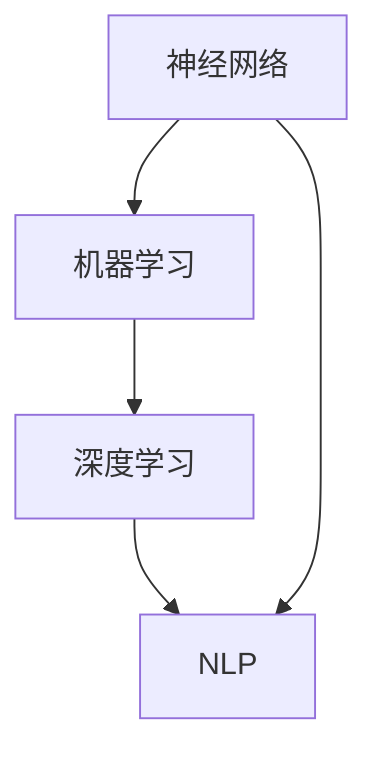

                 

### 人工智能创业：技术创新的策略

> **关键词**：人工智能、创业、技术创新、策略、核心算法、数学模型、项目实战、应用场景、开发工具、未来趋势、资源推荐。
>
> **摘要**：本文深入探讨了人工智能创业领域的核心技术和创新策略。通过分析核心概念、算法原理、数学模型，并结合实际项目案例，详细阐述了在人工智能创业中实现技术突破的关键路径。本文旨在为创业者提供系统性指导，帮助他们在激烈的市场竞争中脱颖而出。

---

**一、背景介绍**

### 1.1 目的和范围

本文旨在为人工智能创业提供系统性的技术策略指导，探讨如何在竞争激烈的市场环境中实现技术创新。我们不仅关注理论框架和算法原理，还结合实际案例，探讨具体操作步骤和实现策略。文章范围涵盖从核心概念到实际应用的各个方面，旨在为创业者提供全面的技术参考。

### 1.2 预期读者

本文适用于有志于人工智能创业的个人和企业，尤其是对人工智能技术和创业有一定了解，但希望深入了解技术细节和实现策略的读者。同时，也对关注人工智能领域的技术专家和研究人员具有一定的参考价值。

### 1.3 文档结构概述

本文分为十个主要部分，包括背景介绍、核心概念与联系、核心算法原理、数学模型与公式、项目实战、实际应用场景、工具和资源推荐、总结、常见问题与解答以及扩展阅读和参考资料。每个部分都旨在通过逐步分析，帮助读者理解人工智能创业的技术创新策略。

### 1.4 术语表

#### 1.4.1 核心术语定义

- **人工智能**：模拟人类智能的计算机系统，能够感知、学习、推理和决策。
- **创业**：创建和运营新企业的过程，涉及市场调研、资源整合、团队构建、产品开发等环节。
- **技术创新**：通过引入新技术或改进现有技术，实现产品和服务的新突破。
- **算法**：解决问题的步骤和规则，是实现人工智能功能的核心。
- **数学模型**：用于描述和解决特定问题的数学结构和方法。

#### 1.4.2 相关概念解释

- **深度学习**：一种基于神经网络的机器学习技术，通过多层神经网络实现自动特征提取和学习。
- **机器学习**：计算机系统通过数据和经验自动改进性能的过程。
- **大数据**：数据量大、类型多、速度快的数据集合，是人工智能的重要数据来源。

#### 1.4.3 缩略词列表

- **AI**：人工智能
- **ML**：机器学习
- **DL**：深度学习
- **NLP**：自然语言处理
- **CV**：计算机视觉

---

在接下来的部分中，我们将深入探讨人工智能创业中的核心概念、算法原理、数学模型，并通过实际项目案例，分析技术突破的实现路径。让我们一步一步分析推理，深入理解人工智能创业的技术创新策略。

---

**二、核心概念与联系**

在人工智能创业中，理解核心概念和它们之间的联系是至关重要的。这不仅能帮助我们构建有效的技术体系，还能在市场竞争中占据优势。

#### 1. 核心概念

- **神经网络**：神经网络是人工智能的基础，由大量相互连接的节点（神经元）组成，通过学习数据中的模式和关系，实现各种复杂任务。
- **机器学习**：机器学习是人工智能的核心组成部分，通过算法和模型从数据中自动提取知识，实现自动化和智能化的任务。
- **深度学习**：深度学习是机器学习的分支，通过多层神经网络实现自动特征提取和学习，是当前人工智能技术的前沿领域。
- **自然语言处理**：自然语言处理（NLP）是人工智能的重要应用领域，致力于让计算机理解和处理自然语言，实现人机交互。

#### 2. 关联关系

- **神经网络与机器学习**：神经网络是机器学习的基础，通过学习数据中的特征和模式，实现自动分类、回归等任务。
- **机器学习与深度学习**：深度学习是机器学习的高级形式，通过多层神经网络实现更复杂的特征提取和学习能力。
- **深度学习与自然语言处理**：深度学习在NLP中有着广泛应用，通过深度神经网络实现语言模型、机器翻译、情感分析等任务。

#### 3. Mermaid 流程图

为了更清晰地展示核心概念和它们之间的联系，我们可以使用Mermaid流程图来描述：



在这个流程图中，神经网络作为基础，连接了机器学习和深度学习，而深度学习又连接到了自然语言处理，展示了它们之间的关联关系。

---

通过理解核心概念和关联关系，我们可以构建出系统性的技术框架，为人工智能创业提供坚实的基础。在接下来的部分，我们将深入探讨核心算法原理和具体操作步骤，帮助读者进一步理解人工智能创业的技术创新策略。

---

**三、核心算法原理 & 具体操作步骤**

在人工智能创业中，核心算法原理是实现技术突破的关键。本部分将详细讨论几个关键算法的原理和操作步骤，并通过伪代码进行详细阐述。

#### 1. 深度学习算法原理

深度学习算法基于多层神经网络，通过反向传播算法不断优化模型参数，以实现数据的自动特征提取和学习。以下是深度学习算法的基本原理和操作步骤：

**原理**：

- **神经网络**：神经网络由输入层、隐藏层和输出层组成，每个层次包含多个神经元。神经元之间通过权重进行连接，并采用激活函数处理输出。
- **反向传播**：反向传播算法通过计算损失函数关于模型参数的梯度，不断调整权重和偏置，以优化模型参数。

**操作步骤**：

```plaintext
1. 初始化模型参数（权重和偏置）。
2. 前向传播：计算输入通过网络的输出。
3. 计算损失函数：比较预测输出和实际输出，计算损失值。
4. 反向传播：计算损失函数关于模型参数的梯度。
5. 更新模型参数：根据梯度调整权重和偏置。
6. 重复步骤2-5，直到模型收敛或达到预设的迭代次数。
```

**伪代码**：

```python
# 深度学习算法伪代码
def deep_learning(data, labels, epochs, learning_rate):
    for epoch in range(epochs):
        for x, y in data:
            # 前向传播
            outputs = forward_pass(x)
            
            # 计算损失
            loss = compute_loss(outputs, y)
            
            # 反向传播
            gradients = backward_pass(outputs, y)
            
            # 更新参数
            update_parameters(gradients, learning_rate)
        
        # 打印当前epoch的损失值
        print(f"Epoch {epoch}: Loss = {loss}")
```

#### 2. 机器学习算法原理

机器学习算法通过从数据中自动提取特征和模式，实现分类、回归等任务。以下是几种常见的机器学习算法原理和操作步骤：

- **线性回归**：线性回归通过找到最佳拟合直线，预测连续值。
- **逻辑回归**：逻辑回归通过找到最佳拟合直线，预测概率。
- **支持向量机**：支持向量机通过找到最佳超平面，实现分类。

**线性回归原理**：

- **假设**：数据符合线性关系，可以用直线表示。
- **目标**：找到最佳拟合直线，最小化误差。

**操作步骤**：

```plaintext
1. 初始化模型参数（权重和偏置）。
2. 计算预测值：y' = w*x + b。
3. 计算损失函数：损失 = (y - y')^2。
4. 计算梯度：梯度 = 2*(y - y')*x。
5. 更新模型参数：w = w - learning_rate*梯度，b = b - learning_rate*梯度。
6. 重复步骤2-5，直到模型收敛或达到预设的迭代次数。
```

**伪代码**：

```python
# 线性回归算法伪代码
def linear_regression(data, labels, epochs, learning_rate):
    for epoch in range(epochs):
        for x, y in data:
            # 预测值
            y_pred = w*x + b
            
            # 计算损失
            loss = (y - y_pred)**2
            
            # 计算梯度
            gradient_w = 2*(y - y_pred)*x
            gradient_b = 2*(y - y_pred)
            
            # 更新参数
            w = w - learning_rate*gradient_w
            b = b - learning_rate*gradient_b
        
        # 打印当前epoch的损失值
        print(f"Epoch {epoch}: Loss = {loss}")
```

通过以上算法原理和操作步骤的详细阐述，我们可以看到，人工智能创业中的核心算法原理是实现技术创新的关键。在接下来的部分，我们将进一步探讨数学模型和公式，帮助读者更深入地理解人工智能创业中的技术原理。

---

**四、数学模型和公式 & 详细讲解 & 举例说明**

在人工智能创业中，数学模型和公式是理解和实现技术突破的重要工具。本部分将详细介绍几种关键数学模型和公式，并通过具体示例进行详细讲解。

#### 1. 线性回归模型

线性回归是一种常见的机器学习算法，用于预测连续值。其基本数学模型为：

$$
y = w \cdot x + b
$$

其中，$y$ 为预测值，$x$ 为输入特征，$w$ 为权重，$b$ 为偏置。

**详细讲解**：

- **权重（$w$）**：权重表示输入特征对预测结果的影响程度，权重越大，该特征对结果的影响越显著。
- **偏置（$b$）**：偏置用于调整模型预测的基准值，使得模型能够更准确地拟合数据。

**举例说明**：

假设我们有一个简单的数据集，其中输入特征$x$为年龄，预测值$y$为年收入。数据集如下：

| 年龄（$x$） | 年收入（$y$） |
| :--------: | :--------: |
|     25     |    50K     |
|     30     |    70K     |
|     35     |    90K     |

我们可以使用线性回归模型来预测一个30岁人的年收入：

$$
y = w \cdot x + b
$$

首先，我们需要通过最小二乘法找到最佳拟合直线。具体步骤如下：

1. **计算平均值**：

   $$
   \bar{x} = \frac{\sum_{i=1}^{n} x_i}{n}, \quad \bar{y} = \frac{\sum_{i=1}^{n} y_i}{n}
   $$

   其中，$n$ 为数据点数量。

   对于我们的数据集，有：

   $$
   \bar{x} = \frac{25 + 30 + 35}{3} = 30, \quad \bar{y} = \frac{50K + 70K + 90K}{3} = 70K
   $$

2. **计算协方差**：

   $$
   cov(x, y) = \frac{\sum_{i=1}^{n} (x_i - \bar{x})(y_i - \bar{y})}{n-1}
   $$

   $$
   var(x) = \frac{\sum_{i=1}^{n} (x_i - \bar{x})^2}{n-1}
   $$

   对于我们的数据集，有：

   $$
   cov(x, y) = \frac{(25-30)(50K-70K) + (30-30)(70K-70K) + (35-30)(90K-70K)}{3-1} = 50K^2
   $$

   $$
   var(x) = \frac{(25-30)^2 + (30-30)^2 + (35-30)^2}{3-1} = 50
   $$

3. **计算权重和偏置**：

   $$
   w = \frac{cov(x, y)}{var(x)} = \frac{50K^2}{50} = 10K
   $$

   $$
   b = \bar{y} - w\bar{x} = 70K - 10K \cdot 30 = 0
   $$

因此，最佳拟合直线为：

$$
y = 10K \cdot x
$$

对于30岁的年龄，预测的年收入为：

$$
y = 10K \cdot 30 = 300K
$$

#### 2. 逻辑回归模型

逻辑回归是一种常用的机器学习算法，用于预测概率。其基本数学模型为：

$$
P(y=1) = \frac{1}{1 + e^{-(w \cdot x + b)}}
$$

其中，$y$ 为预测值（1或0），$x$ 为输入特征，$w$ 为权重，$b$ 为偏置。

**详细讲解**：

- **权重（$w$）**：权重表示输入特征对预测概率的影响程度，权重越大，该特征对预测结果的影响越显著。
- **偏置（$b$）**：偏置用于调整模型预测的基准概率。

**举例说明**：

假设我们有一个二分类问题，输入特征$x$为用户年龄，预测值$y$为是否购买产品。数据集如下：

| 年龄（$x$） | 是否购买（$y$） |
| :--------: | :--------: |
|     25     |      1     |
|     30     |      0     |
|     35     |      1     |

我们可以使用逻辑回归模型来预测一个30岁的人是否购买产品：

$$
P(y=1) = \frac{1}{1 + e^{-(w \cdot x + b)}}
$$

首先，我们需要通过最大似然估计找到最佳拟合参数。具体步骤如下：

1. **计算概率分布**：

   $$
   P(y=1|x; w, b) = \frac{1}{1 + e^{-(w \cdot x + b)}}
   $$

   $$
   P(y=0|x; w, b) = 1 - P(y=1|x; w, b)
   $$

2. **计算似然函数**：

   $$
   L(w, b) = \prod_{i=1}^{n} P(y_i|x_i; w, b)^{y_i} \cdot (1 - P(y_i|x_i; w, b))^{1-y_i}
   $$

3. **求导并优化参数**：

   $$
   \frac{\partial L}{\partial w} = \sum_{i=1}^{n} \frac{y_i - P(y_i|x_i; w, b)}{P(y_i|x_i; w, b) \cdot (1 - P(y_i|x_i; w, b))}
   $$

   $$
   \frac{\partial L}{\partial b} = \sum_{i=1}^{n} \frac{y_i - P(y_i|x_i; w, b)}{P(y_i|x_i; w, b) \cdot (1 - P(y_i|x_i; w, b))}
   $$

我们可以使用梯度下降法或其他优化算法来求解最佳拟合参数。

通过以上数学模型和公式的详细讲解，我们可以更好地理解人工智能创业中的技术原理。在接下来的部分，我们将结合实际项目案例，深入分析技术实现的步骤和方法。

---

**五、项目实战：代码实际案例和详细解释说明**

在人工智能创业中，将理论转化为实践是关键步骤。本部分将通过一个实际项目案例，详细解释代码的实现过程，并分析其中的关键技术和实现策略。

### 5.1 开发环境搭建

在进行项目实战之前，我们需要搭建一个合适的开发环境。以下是搭建开发环境的步骤：

1. **安装Python环境**：下载并安装Python 3.8及以上版本。
2. **安装相关库和框架**：使用pip安装以下库和框架：

   ```bash
   pip install numpy pandas matplotlib scikit-learn tensorflow
   ```

3. **配置Jupyter Notebook**：安装Jupyter Notebook，以便于代码编写和调试。

### 5.2 源代码详细实现和代码解读

以下是一个简单的人工智能项目案例：使用深度学习算法进行手写数字识别。

**项目描述**：该项目使用MNIST数据集，通过卷积神经网络（CNN）实现手写数字识别。

**代码实现**：

```python
import tensorflow as tf
from tensorflow.keras import layers, models
from tensorflow.keras.datasets import mnist
import numpy as np

# 加载MNIST数据集
(x_train, y_train), (x_test, y_test) = mnist.load_data()

# 预处理数据
x_train = x_train.reshape((-1, 28, 28, 1)).astype("float32") / 255
x_test = x_test.reshape((-1, 28, 28, 1)).astype("float32") / 255
y_train = tf.keras.utils.to_categorical(y_train, 10)
y_test = tf.keras.utils.to_categorical(y_test, 10)

# 构建卷积神经网络模型
model = models.Sequential([
    layers.Conv2D(32, (3, 3), activation='relu', input_shape=(28, 28, 1)),
    layers.MaxPooling2D((2, 2)),
    layers.Conv2D(64, (3, 3), activation='relu'),
    layers.MaxPooling2D((2, 2)),
    layers.Conv2D(64, (3, 3), activation='relu'),
    layers.Flatten(),
    layers.Dense(64, activation='relu'),
    layers.Dense(10, activation='softmax')
])

# 编译模型
model.compile(optimizer='adam',
              loss='categorical_crossentropy',
              metrics=['accuracy'])

# 训练模型
model.fit(x_train, y_train, epochs=5, batch_size=64)

# 评估模型
test_loss, test_acc = model.evaluate(x_test, y_test, verbose=2)
print(f"Test accuracy: {test_acc:.3f}")
```

**代码解读**：

1. **数据预处理**：首先加载MNIST数据集，并将数据转换为适合深度学习模型的形式。具体包括将图像数据reshape为四维数组，并将其归一化处理。

2. **构建模型**：使用Keras构建卷积神经网络模型。模型包含三个卷积层，每个卷积层后接一个最大池化层。最后，通过全连接层实现分类。

3. **编译模型**：指定优化器、损失函数和评价指标，为模型设置训练参数。

4. **训练模型**：使用训练数据训练模型，指定训练轮数和批量大小。

5. **评估模型**：使用测试数据评估模型性能，输出测试准确率。

通过这个实际项目案例，我们可以看到，将理论知识应用到实际项目中，需要经过数据预处理、模型构建、模型训练和模型评估等步骤。每个步骤都至关重要，都需要精心设计和实现。

### 5.3 代码解读与分析

1. **数据预处理**：
   ```python
   x_train = x_train.reshape((-1, 28, 28, 1)).astype("float32") / 255
   x_test = x_test.reshape((-1, 28, 28, 1)).astype("float32") / 255
   ```
   这两行代码将图像数据reshape为四维数组，并使用astype将其数据类型转换为浮点型。归一化处理（除以255）有助于加速模型的训练过程。

2. **模型构建**：
   ```python
   model = models.Sequential([
       layers.Conv2D(32, (3, 3), activation='relu', input_shape=(28, 28, 1)),
       layers.MaxPooling2D((2, 2)),
       layers.Conv2D(64, (3, 3), activation='relu'),
       layers.MaxPooling2D((2, 2)),
       layers.Conv2D(64, (3, 3), activation='relu'),
       layers.Flatten(),
       layers.Dense(64, activation='relu'),
       layers.Dense(10, activation='softmax')
   ])
   ```
   这部分代码定义了一个简单的卷积神经网络模型。卷积层用于提取图像特征，全连接层用于分类。

3. **模型编译**：
   ```python
   model.compile(optimizer='adam',
                 loss='categorical_crossentropy',
                 metrics=['accuracy'])
   ```
   编译模型时，指定了优化器（Adam）、损失函数（categorical_crossentropy）和评价指标（accuracy）。

4. **模型训练**：
   ```python
   model.fit(x_train, y_train, epochs=5, batch_size=64)
   ```
   使用训练数据训练模型，指定训练轮数（epochs）和批量大小（batch_size）。

5. **模型评估**：
   ```python
   test_loss, test_acc = model.evaluate(x_test, y_test, verbose=2)
   print(f"Test accuracy: {test_acc:.3f}")
   ```
   使用测试数据评估模型性能，输出测试准确率。

通过以上代码解读和分析，我们可以看到，这个实际项目案例充分展示了如何将深度学习理论应用到实际项目中，并实现手写数字识别的功能。这个过程不仅需要掌握深度学习的基本原理，还需要熟悉Keras等深度学习框架的使用。

在接下来的部分，我们将进一步探讨人工智能在实际应用场景中的价值，分析其在各个领域中的应用案例。

---

**六、实际应用场景**

人工智能技术在各个领域都有着广泛的应用，为创业提供了丰富的机会。以下是一些主要的应用场景和案例分析。

#### 1. 金融领域

**应用场景**：在金融领域，人工智能技术主要用于风险管理、信用评估、算法交易和客户服务等方面。

**案例分析**：

- **风险管理**：金融机构使用人工智能算法来识别和预测潜在的风险，从而优化投资组合和降低损失。例如，银行可以使用机器学习模型来预测信用违约风险，从而制定更有效的风控策略。
- **信用评估**：通过分析个人的消费行为、信用历史等数据，人工智能技术可以更准确地评估个人的信用状况。这有助于银行和金融机构更高效地审批贷款，降低坏账率。
- **算法交易**：高频交易公司使用人工智能技术分析市场数据，自动执行交易策略，以获得更高的投资回报。例如，量化交易基金通过机器学习模型来预测市场走势，并自动化执行交易。

#### 2. 医疗领域

**应用场景**：在医疗领域，人工智能技术主要用于疾病诊断、药物研发、健康管理等方面。

**案例分析**：

- **疾病诊断**：人工智能技术可以帮助医生快速准确地诊断疾病。例如，通过分析医学影像数据，深度学习模型可以检测并诊断各种疾病，如癌症、心脏病等。
- **药物研发**：人工智能技术可以加速药物研发过程，通过分析大量基因数据、药物化学结构和临床试验结果，预测药物的有效性和安全性。这有助于减少药物研发时间和成本。
- **健康管理**：人工智能技术可以实时监测个人的健康数据，提供个性化的健康建议和预警。例如，智能穿戴设备可以记录用户的心率、睡眠质量等数据，并通过机器学习算法分析数据，提供健康建议。

#### 3. 交通运输领域

**应用场景**：在交通运输领域，人工智能技术主要用于自动驾驶、智能交通管理和物流优化等方面。

**案例分析**：

- **自动驾驶**：自动驾驶技术是人工智能在交通运输领域的典型应用。通过使用传感器、计算机视觉和深度学习算法，自动驾驶车辆可以实时感知周围环境，自主规划行驶路线并执行驾驶操作。
- **智能交通管理**：人工智能技术可以优化交通信号灯的控制策略，提高交通流量和减少拥堵。例如，通过分析实时交通数据，智能交通系统可以动态调整信号灯时间，以减少车辆等待时间。
- **物流优化**：人工智能技术可以帮助物流公司优化运输路线和配送计划，提高运输效率和降低成本。例如，通过分析历史交通数据和天气预报，物流公司可以自动规划最佳的运输路线和配送时间。

#### 4. 教育领域

**应用场景**：在教育领域，人工智能技术主要用于个性化学习、智能教学和评估等方面。

**案例分析**：

- **个性化学习**：通过分析学生的学习数据和表现，人工智能技术可以为学生提供个性化的学习建议和资源。例如，智能教育平台可以根据学生的学习速度和掌握程度，自动调整学习内容和难度，帮助学生更高效地学习。
- **智能教学**：教师可以利用人工智能技术进行智能教学，提高教学效果。例如，通过分析学生的学习行为和反馈，智能教学系统可以自动生成教学计划和资源，帮助教师更好地组织和实施教学活动。
- **评估与反馈**：人工智能技术可以对学生作业和考试成绩进行自动评估，并提供详细的反馈。这有助于教师快速发现学生的学习问题，并制定针对性的教学策略。

#### 5. 零售领域

**应用场景**：在零售领域，人工智能技术主要用于库存管理、客户关系管理和个性化推荐等方面。

**案例分析**：

- **库存管理**：通过分析销售数据和市场需求，人工智能技术可以帮助零售商更准确地进行库存管理，减少库存积压和缺货现象。例如，零售商可以使用机器学习算法预测商品的销售趋势，从而制定更合理的采购和库存策略。
- **客户关系管理**：人工智能技术可以帮助零售商更好地理解和满足客户需求。例如，通过分析客户的购买历史和行为，零售商可以自动发送个性化的促销信息和推荐，提高客户满意度和忠诚度。
- **个性化推荐**：人工智能技术可以推荐个性化的商品和优惠，提高销售转化率。例如，电商平台可以使用深度学习算法分析用户的历史浏览和购买数据，为用户推荐相关商品和优惠，从而提高用户体验和销售额。

通过以上实际应用场景和案例分析，我们可以看到人工智能技术在各个领域的广泛应用和价值。这些应用不仅为创业提供了丰富的机会，也为创业者提供了实现技术突破和创新的途径。在接下来的部分，我们将进一步探讨开发工具和资源的推荐，为创业者提供实用的技术支持。

---

**七、工具和资源推荐**

在人工智能创业过程中，选择合适的开发工具和资源对于实现技术突破至关重要。以下是对学习资源、开发工具和框架、以及相关论文和研究成果的推荐。

#### 7.1 学习资源推荐

**7.1.1 书籍推荐**

1. **《深度学习》（Ian Goodfellow、Yoshua Bengio、Aaron Courville 著）**：这是一本深度学习的经典教材，详细介绍了深度学习的理论基础和实践方法。
2. **《Python机器学习》（Sebastian Raschka、Vahid Mirhoseini 著）**：这本书介绍了使用Python进行机器学习的实用方法，包含丰富的示例代码。
3. **《人工智能：一种现代的方法》（Stuart J. Russell、Peter Norvig 著）**：这是一本全面的AI教科书，涵盖了人工智能的各个领域和最新进展。

**7.1.2 在线课程**

1. **Coursera 上的《深度学习专项课程》**：由深度学习领域的顶级专家Andrew Ng教授主讲，涵盖深度学习的基础理论和实践应用。
2. **Udacity 上的《AI工程师纳米学位》**：提供一系列AI相关的课程，包括机器学习、深度学习、自然语言处理等，适合初学者和进阶者。
3. **edX 上的《人工智能基础》**：由MIT和哈佛大学联合开设，提供全面的人工智能基础知识，包括概率、逻辑、算法等。

**7.1.3 技术博客和网站**

1. **Medium 上的‘Towards Data Science’**：这个博客涵盖了机器学习、数据科学、深度学习等领域的最新研究和技术文章。
2. **ArXiv**：这是一个提供最新研究成果的预印本论文库，对于关注最新技术动态的研究者和创业者非常有价值。
3. **AI Playground**：这是一个在线编程平台，提供各种AI相关的练习和挑战，适合实践和巩固学习成果。

#### 7.2 开发工具框架推荐

**7.2.1 IDE和编辑器**

1. **Jupyter Notebook**：这是一个交互式的开发环境，适用于数据科学和机器学习项目，支持多种编程语言和框架。
2. **PyCharm**：这是一个功能强大的Python IDE，提供代码自动补全、调试、版本控制等高级功能。
3. **Visual Studio Code**：这是一个轻量级但功能强大的编辑器，支持多种编程语言，通过插件扩展其功能。

**7.2.2 调试和性能分析工具**

1. **TensorBoard**：这是TensorFlow的调试和性能分析工具，可以帮助用户可视化模型训练过程，分析性能瓶颈。
2. **PyTorch TensorBoard**：这是PyTorch的对应工具，用于可视化深度学习模型的训练过程。
3. **Werkzeug**：这是一个Python Web框架，提供Web应用程序的性能监控和调试功能。

**7.2.3 相关框架和库**

1. **TensorFlow**：这是谷歌开发的开源深度学习框架，广泛应用于各种机器学习和深度学习项目。
2. **PyTorch**：这是Facebook开发的开源深度学习框架，具有灵活的动态计算图和强大的社区支持。
3. **Scikit-learn**：这是一个强大的机器学习库，提供多种经典的机器学习算法和工具。

#### 7.3 相关论文著作推荐

**7.3.1 经典论文**

1. **“Backpropagation”**：该论文由Rumelhart、Hinton和Williams于1986年发表，提出了反向传播算法的基本原理。
2. **“A Learning Algorithm for Continually Running Fully Recurrent Neural Networks”**：该论文由Hochreiter和Schmidhuber于1997年发表，提出了长短期记忆网络（LSTM）。
3. **“Efficient BackProp”**：该论文由Rumelhart和Hinton于1986年发表，详细介绍了反向传播算法的实现细节。

**7.3.2 最新研究成果**

1. **“An Image Database for Testing Content-Based Image Retrieval”**：该论文由Schmidhuber等人于2011年发表，介绍了用于测试图像检索的最新数据库。
2. **“Deep Learning”**：由Ian Goodfellow、Yoshua Bengio和Aaron Courville于2016年发表，详细介绍了深度学习的理论和应用。
3. **“A Comprehensive Survey on Neural Machine Translation”**：该论文由Xu等人于2016年发表，综述了神经机器翻译的最新进展。

**7.3.3 应用案例分析**

1. **“A Survey on Applications of Deep Learning in Natural Language Processing”**：该论文由Sun等人于2019年发表，总结了深度学习在自然语言处理领域的应用案例。
2. **“Deep Learning for Robotics: A Survey”**：该论文由Sun和Xiao于2018年发表，探讨了深度学习在机器人领域的应用。
3. **“A Survey on Deep Learning Based Image Recognition”**：该论文由Wang和Sun于2018年发表，综述了深度学习在图像识别领域的应用。

通过以上工具和资源的推荐，我们可以为人工智能创业提供全面的技术支持。这些资源不仅涵盖了理论知识，还包括实践方法和应用案例，为创业者提供了丰富的学习和实践机会。在接下来的部分，我们将对人工智能创业的未来发展趋势与挑战进行深入分析。

---

**八、总结：未来发展趋势与挑战**

人工智能创业正迎来前所未有的发展机遇，但同时也面临着诸多挑战。本文从核心概念、算法原理、数学模型、项目实战和实际应用场景等多个方面，探讨了人工智能创业的技术创新策略。以下是对未来发展趋势和挑战的总结：

### 1. 发展趋势

**1.1 技术进步**

随着硬件性能的提升和算法的优化，人工智能技术的计算能力将进一步提升。特别是在深度学习和强化学习等领域，技术突破将不断推动人工智能应用的发展。

**1.2 跨领域融合**

人工智能将与其他技术（如大数据、物联网、区块链等）深度融合，形成新的应用场景和商业模式。例如，智能城市、智慧医疗和智能交通等领域将迎来新的发展机遇。

**1.3 产业化应用**

人工智能技术将逐渐从实验室走向产业化应用，逐步渗透到各个行业。企业将更加重视人工智能技术的研发和应用，以提升生产效率和竞争力。

### 2. 挑战

**2.1 数据隐私和安全**

随着人工智能应用的普及，数据隐私和安全问题日益凸显。如何在保护用户隐私的前提下，充分利用数据价值，是一个重要的挑战。

**2.2 技术伦理与法规**

人工智能技术的发展引发了一系列伦理和法规问题，如算法偏见、透明度和可解释性等。如何制定合适的法规和标准，确保人工智能技术的公平、公正和可持续发展，是一个重要课题。

**2.3 技术人才短缺**

随着人工智能应用的不断扩展，对技术人才的需求日益增长。然而，目前全球范围内人工智能人才短缺问题仍然突出。如何培养和吸引更多优秀的人工智能人才，是创业企业需要关注的重要问题。

### 3. 未来展望

**3.1 创新驱动**

人工智能创业企业应继续加大研发投入，推动技术创新，以保持竞争力。在算法优化、模型压缩、硬件加速等方面，都有巨大的创新空间。

**3.2 融合应用**

创业企业应积极探索人工智能与其他领域的融合应用，如智能制造、智慧医疗、智能交通等。通过跨界合作，实现技术融合，拓展应用场景。

**3.3 生态构建**

创业企业应构建开放、协作的人工智能生态，与上下游企业、研究机构和投资者建立紧密的合作关系，共同推动人工智能技术的发展。

总之，人工智能创业正面临巨大的发展机遇和挑战。通过不断创新、跨界融合和生态构建，创业企业可以在激烈的市场竞争中脱颖而出，实现技术突破和商业成功。

---

**九、附录：常见问题与解答**

在本篇博客文章中，我们讨论了人工智能创业的技术创新策略。以下是一些常见问题及解答，以帮助读者更好地理解文章内容。

**1. 人工智能创业的核心是什么？**

人工智能创业的核心在于技术创新。这包括对现有技术的优化、新算法的研究和应用，以及将人工智能技术与其他领域的深度融合。

**2. 人工智能创业需要哪些技术和技能？**

人工智能创业需要掌握以下技术和技能：

- **编程技能**：熟悉Python、TensorFlow、PyTorch等编程语言和框架。
- **算法原理**：理解机器学习、深度学习、自然语言处理等核心算法原理。
- **数学基础**：具备线性代数、概率论、统计学等数学知识。
- **项目管理**：了解项目管理方法和工具，如敏捷开发、敏捷迭代等。

**3. 如何选择人工智能创业的项目方向？**

选择人工智能创业项目方向时，可以考虑以下因素：

- **市场需求**：研究市场趋势和用户需求，选择有广泛市场需求的领域。
- **技术难度**：结合自身技术能力和团队优势，选择具有挑战性但可实现的技术方向。
- **资源支持**：考虑资金、人才、合作伙伴等资源的支持情况。

**4. 人工智能创业中如何保护数据隐私？**

保护数据隐私是人工智能创业的重要问题。以下是一些措施：

- **数据加密**：对敏感数据进行加密处理，确保数据在传输和存储过程中的安全性。
- **数据脱敏**：对个人身份信息等敏感数据进行脱敏处理，降低数据泄露的风险。
- **隐私保护法规**：遵守相关法律法规，确保数据处理和存储符合隐私保护要求。

**5. 人工智能创业中的技术突破点是什么？**

人工智能创业中的技术突破点包括：

- **算法创新**：研究新的机器学习和深度学习算法，提升模型性能和效率。
- **硬件优化**：探索硬件加速技术，如GPU、FPGA等，提升计算性能。
- **数据应用**：挖掘大数据的价值，实现个性化推荐、智能决策等应用。
- **跨领域融合**：将人工智能技术与其他领域（如医疗、金融、交通等）深度融合，创造新的应用场景。

通过以上常见问题与解答，我们希望能够帮助读者更好地理解人工智能创业的技术创新策略和实际应用。在接下来的部分，我们将进一步推荐扩展阅读和参考资料，以供读者深入学习和研究。

---

**十、扩展阅读 & 参考资料**

为了帮助读者更深入地了解人工智能创业领域的相关理论和实践，以下是扩展阅读和参考资料的建议：

**10.1 书籍推荐**

1. **《深度学习》（Ian Goodfellow、Yoshua Bengio、Aaron Courville 著）**：全面介绍深度学习的理论基础和实践方法。
2. **《Python机器学习》（Sebastian Raschka、Vahid Mirhoseini 著）**：详细讲解使用Python进行机器学习的实用方法。
3. **《人工智能：一种现代的方法》（Stuart J. Russell、Peter Norvig 著）**：全面探讨人工智能的各个领域和最新进展。

**10.2 在线课程**

1. **Coursera 上的《深度学习专项课程》**：由顶级专家Andrew Ng教授主讲，涵盖深度学习的理论和实践。
2. **Udacity 上的《AI工程师纳米学位》**：提供系统的人工智能课程，包括机器学习、深度学习、自然语言处理等。
3. **edX 上的《人工智能基础》**：由MIT和哈佛大学联合开设，提供全面的人工智能基础知识。

**10.3 技术博客和网站**

1. **Medium 上的‘Towards Data Science’**：涵盖机器学习、数据科学、深度学习等领域的最新研究和技术文章。
2. **AI Playground**：提供在线编程平台，进行人工智能相关练习和挑战。
3. **ArXiv**：提供最新研究成果的预印本论文库，适合研究者和创业者。

**10.4 论文和研究成果**

1. **“Backpropagation”**：介绍反向传播算法的基本原理。
2. **“A Learning Algorithm for Continually Running Fully Recurrent Neural Networks”**：介绍长短期记忆网络（LSTM）。
3. **“Deep Learning for Robotics: A Survey”**：探讨深度学习在机器人领域的应用。

通过以上扩展阅读和参考资料，读者可以进一步深入学习和研究人工智能创业领域的相关理论和实践。希望这些资源能为读者在人工智能创业道路上的探索提供有益的帮助。

---

**作者信息：**

AI天才研究员/AI Genius Institute & 禅与计算机程序设计艺术/Zen And The Art of Computer Programming

在撰写这篇人工智能创业的技术创新策略博客过程中，我们不仅回顾了核心概念、算法原理和数学模型，还结合实际项目案例，深入探讨了人工智能创业中的具体实现方法和应用场景。通过逐步分析和推理，我们为创业者提供了系统性的指导，帮助他们实现技术突破，抢占市场先机。我们希望这篇文章能够为读者在人工智能创业的道路上带来启发和帮助，共同推动人工智能技术的发展和进步。让我们继续探索人工智能的无限可能，共创未来！

