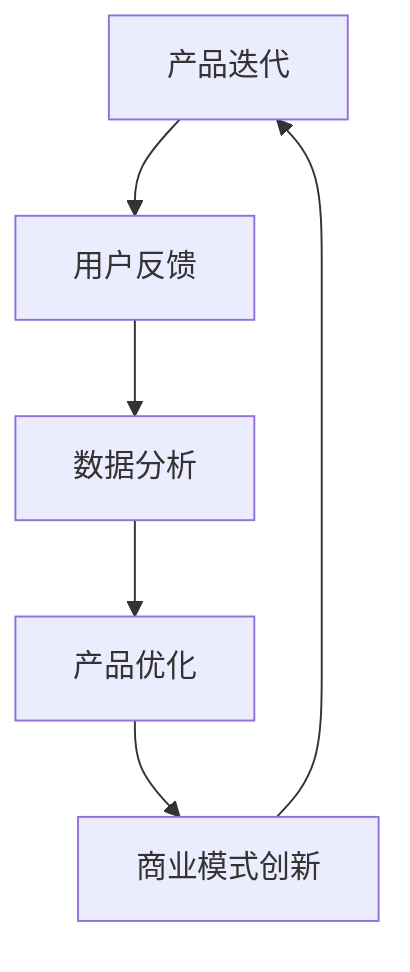

                 

# 人工智能创业：持续迭代与反馈

> **关键词**：人工智能、创业、持续迭代、反馈循环、产品优化、商业模式创新

> **摘要**：本文将探讨人工智能创业公司如何通过持续迭代和反馈循环来优化产品，提升用户体验，并在竞争激烈的市场中立足。文章将从背景介绍、核心概念、算法原理、数学模型、实战案例、实际应用场景、工具推荐等多个维度展开，帮助读者深入了解人工智能创业的内在逻辑和实践方法。

## 1. 背景介绍

### 1.1 目的和范围

本文旨在为有意投身人工智能创业的团队和创业者提供一份实用的指南，帮助他们理解并掌握通过持续迭代和反馈循环来提升产品竞争力的方法。文章涵盖了从理论基础到实际操作的全过程，旨在让读者不仅知道“为什么”，还知道“怎么做”。

### 1.2 预期读者

- 有志于从事人工智能领域的创业者
- 人工智能相关专业的学生和研究人员
- 在职工程师和技术管理者
- 对人工智能应用和创业感兴趣的技术爱好者

### 1.3 文档结构概述

本文结构如下：

1. 背景介绍：介绍文章目的、范围、预期读者及文档结构。
2. 核心概念与联系：讲解人工智能创业中涉及的核心理念和联系。
3. 核心算法原理 & 具体操作步骤：详细阐述算法原理和操作步骤。
4. 数学模型和公式 & 详细讲解 & 举例说明：介绍相关的数学模型和具体应用。
5. 项目实战：提供代码实际案例和详细解释。
6. 实际应用场景：分析人工智能在现实场景中的应用。
7. 工具和资源推荐：推荐相关学习资源、开发工具和论文著作。
8. 总结：展望人工智能创业的未来发展趋势与挑战。
9. 附录：常见问题与解答。
10. 扩展阅读 & 参考资料：提供进一步学习的资源链接。

### 1.4 术语表

#### 1.4.1 核心术语定义

- **人工智能（AI）**：模拟人类智能的计算机程序。
- **迭代**：重复执行的过程，用于逐步改进产品或算法。
- **反馈循环**：通过收集用户反馈来调整产品或服务的循环机制。
- **产品优化**：通过迭代和反馈，提高产品功能和用户体验。
- **商业模式创新**：创造新的商业模式或改进现有模式，以获得竞争优势。

#### 1.4.2 相关概念解释

- **机器学习**：一种通过数据学习模式的AI技术，是人工智能的核心组成部分。
- **用户画像**：根据用户行为和偏好，构建的用户信息模型。
- **A/B测试**：通过对比两组用户的不同体验，评估产品变更效果的方法。

#### 1.4.3 缩略词列表

- **AI**：人工智能
- **ML**：机器学习
- **NLP**：自然语言处理
- **API**：应用程序编程接口
- **SDK**：软件开发工具包

## 2. 核心概念与联系

在人工智能创业中，理解和运用核心概念和它们之间的联系至关重要。以下是一个简单的 Mermaid 流程图，展示了一些核心概念和它们之间的关系。



### 2.1 产品迭代

产品迭代是人工智能创业的核心环节，它涉及到不断改进产品功能、性能和用户体验。迭代过程通常包括需求分析、设计、开发、测试和发布等多个阶段。

### 2.2 用户反馈

用户反馈是产品迭代的重要驱动力。通过收集和分析用户使用产品时的反馈，可以了解用户的需求和痛点，从而针对性地进行优化。

### 2.3 数据分析

数据分析是将用户反馈转化为产品优化的关键步骤。通过分析用户行为数据，可以发现产品中的问题和改进机会。

### 2.4 产品优化

产品优化是基于数据分析的结果，对产品进行改进的过程。优化可以是功能性的，也可以是用户体验方面的。

### 2.5 商业模式创新

商业模式创新是人工智能创业中提升竞争力的重要手段。通过创造新的商业模式或改进现有模式，可以更好地满足市场需求，获取更多用户和市场份额。

## 3. 核心算法原理 & 具体操作步骤

在人工智能创业中，算法原理是实现产品迭代和优化的重要基础。以下是一个简单的伪代码，描述了如何通过机器学习算法对用户行为进行预测和优化。

```python
# 输入：用户行为数据集
# 输出：预测结果和优化建议

# Step 1: 数据预处理
data = preprocess_data(user_data)

# Step 2: 特征工程
features = extract_features(data)

# Step 3: 选择模型
model = select_model()

# Step 4: 训练模型
model.fit(features, labels)

# Step 5: 预测用户行为
predictions = model.predict(new_data)

# Step 6: 根据预测结果进行产品优化
optimize_products(predictions)
```

### 3.1 数据预处理

数据预处理是机器学习中的基础步骤，旨在将原始数据转换为适合模型训练的形式。常见的数据预处理方法包括数据清洗、归一化、降维等。

```python
def preprocess_data(data):
    # 数据清洗
    clean_data = clean_data(data)
    # 归一化
    normalized_data = normalize_data(clean_data)
    # 降维
    reduced_data = reduce_dimensions(normalized_data)
    return reduced_data
```

### 3.2 特征工程

特征工程是提高模型性能的重要手段。通过选择和构造合适的特征，可以提高模型的预测能力和泛化能力。

```python
def extract_features(data):
    # 特征选择
    selected_features = select_features(data)
    # 特征构造
    constructed_features = construct_features(selected_features)
    return constructed_features
```

### 3.3 选择模型

选择合适的机器学习模型对于实现高效的预测和优化至关重要。常见的机器学习模型包括线性回归、决策树、随机森林、神经网络等。

```python
def select_model():
    # 选择模型
    model = LinearRegression()
    # 模型优化
    model = optimize_model(model)
    return model
```

### 3.4 训练模型

模型训练是将特征数据映射到预测结果的过程。通过训练过程，模型可以学习到用户行为的规律，从而提高预测准确性。

```python
def train_model(model, features, labels):
    # 训练模型
    model.fit(features, labels)
    # 模型评估
    evaluate_model(model)
```

### 3.5 预测用户行为

模型训练完成后，可以使用训练好的模型对新数据进行预测，从而为产品优化提供依据。

```python
def predict_user_behavior(model, new_data):
    # 预测用户行为
    predictions = model.predict(new_data)
    return predictions
```

### 3.6 根据预测结果进行产品优化

根据预测结果，对产品进行针对性优化，以提高用户体验和满足用户需求。

```python
def optimize_products(predictions):
    # 优化产品功能
    update_features(predictions)
    # 优化用户体验
    improve_user_experience(predictions)
```

## 4. 数学模型和公式 & 详细讲解 & 举例说明

在人工智能创业中，数学模型和公式是理解和分析用户行为、优化产品功能的重要工具。以下是一个简单的线性回归模型，用于预测用户行为。

### 4.1 线性回归模型

线性回归模型是一个用于预测连续值的数学模型，其公式如下：

$$ y = wx + b $$

其中，$y$ 是预测值，$w$ 是权重，$x$ 是输入特征，$b$ 是偏置。

### 4.2 模型训练

模型训练的目的是找到合适的权重和偏置，使得预测值与实际值之间的误差最小。通过最小化损失函数，可以得到最佳参数。

$$ \min_{w, b} \sum_{i=1}^{n} (wx_i + b - y_i)^2 $$

### 4.3 模型评估

模型评估是通过计算预测值与实际值之间的误差来衡量模型性能。常见的评估指标包括均方误差（MSE）、均方根误差（RMSE）等。

$$ MSE = \frac{1}{n} \sum_{i=1}^{n} (wx_i + b - y_i)^2 $$

### 4.4 模型应用

以下是一个简单的例子，说明如何使用线性回归模型预测用户购买行为。

```python
# 输入特征：用户年龄、收入、浏览时间
# 输出预测：用户购买概率

# 数据集
ages = [25, 30, 35, 40, 45]
incomes = [50000, 60000, 70000, 80000, 90000]
browsing_times = [100, 150, 200, 250, 300]
purchases = [True, True, False, True, True]

# 特征工程
features = np.array([[age, income, browsing_time] for age, income, browsing_time in zip(ages, incomes, browsing_times)])

# 模型训练
model = LinearRegression()
model.fit(features, purchases)

# 预测
predictions = model.predict([[30, 60000, 150]])

# 输出预测结果
print(predictions)
```

## 5. 项目实战：代码实际案例和详细解释说明

在本节中，我们将通过一个实际案例，展示如何使用机器学习算法对用户行为进行预测，并根据预测结果优化产品功能。以下是一个简单的 Python 脚本，用于实现这一过程。

### 5.1 开发环境搭建

为了运行以下代码，您需要安装以下依赖项：

- Python 3.8 或更高版本
- scikit-learn 库
- pandas 库

您可以使用以下命令来安装所需依赖项：

```bash
pip install python==3.8
pip install scikit-learn
pip install pandas
```

### 5.2 源代码详细实现和代码解读

以下是一个简单的 Python 脚本，用于实现用户行为预测和产品优化。

```python
import numpy as np
import pandas as pd
from sklearn.linear_model import LinearRegression
from sklearn.model_selection import train_test_split

# 5.2.1 数据读取与预处理
def read_data(filename):
    data = pd.read_csv(filename)
    # 数据清洗
    data.dropna(inplace=True)
    # 数据转换
    data['age'] = data['age'].astype(int)
    data['income'] = data['income'].astype(float)
    data['browsing_time'] = data['browsing_time'].astype(int)
    return data

# 5.2.2 特征工程
def extract_features(data):
    features = data[['age', 'income', 'browsing_time']]
    labels = data['purchases']
    return features, labels

# 5.2.3 模型训练与评估
def train_and_evaluate_model(features, labels):
    X_train, X_test, y_train, y_test = train_test_split(features, labels, test_size=0.2, random_state=42)
    model = LinearRegression()
    model.fit(X_train, y_train)
    score = model.score(X_test, y_test)
    return model, score

# 5.2.4 预测用户行为
def predict_user_behavior(model, new_data):
    predictions = model.predict(new_data)
    return predictions

# 主程序
if __name__ == '__main__':
    filename = 'user_data.csv'  # 用户数据文件路径
    data = read_data(filename)
    features, labels = extract_features(data)
    model, score = train_and_evaluate_model(features, labels)
    print(f'Model accuracy: {score:.2f}')
    
    # 测试新用户数据
    new_data = np.array([[30, 60000, 150]])
    predictions = predict_user_behavior(model, new_data)
    print(f'Predicted purchase probability: {predictions[0]:.2f}')
```

### 5.3 代码解读与分析

1. **数据读取与预处理**：首先，我们读取用户数据文件，并进行必要的清洗和转换。这包括删除缺失值、将数据类型转换为适当的数值类型等。

2. **特征工程**：接着，我们提取输入特征（年龄、收入、浏览时间）和目标变量（购买行为）。这些特征将被用于训练和评估机器学习模型。

3. **模型训练与评估**：然后，我们使用训练集对线性回归模型进行训练，并评估模型在测试集上的性能。这里，我们使用均方误差（MSE）作为评估指标。

4. **预测用户行为**：最后，我们使用训练好的模型对新的用户数据进行预测，以获取用户购买概率。

### 5.4 运行代码

将上述代码保存为 `user_behavior_prediction.py`，并在命令行中运行以下命令：

```bash
python user_behavior_prediction.py
```

运行结果将显示模型准确率和预测的新用户购买概率。

## 6. 实际应用场景

人工智能创业在实际应用场景中具有广泛的应用潜力。以下是一些典型应用场景：

### 6.1 电商推荐系统

电商推荐系统通过分析用户的历史行为和偏好，为用户推荐可能感兴趣的商品。通过持续迭代和反馈循环，系统可以不断优化推荐效果，提高用户满意度和转化率。

### 6.2 金融风控

金融风控系统通过分析用户行为数据和交易数据，识别潜在的欺诈行为和信用风险。通过不断迭代和反馈，系统可以不断提高风险识别的准确性和效率。

### 6.3 健康医疗

健康医疗领域可以利用人工智能进行疾病预测和诊断。通过对用户健康数据的持续分析和反馈，系统可以为用户提供个性化的健康建议和预防措施。

### 6.4 智能家居

智能家居系统通过分析用户行为和偏好，为用户提供便捷的家居控制和服务。通过持续迭代和反馈，系统可以不断提高用户满意度和安全性。

## 7. 工具和资源推荐

### 7.1 学习资源推荐

#### 7.1.1 书籍推荐

- **《人工智能：一种现代方法》**：详细介绍了人工智能的基础知识，包括机器学习、自然语言处理等。
- **《深度学习》**：讲解深度学习的基础理论和实践方法，适合入门和进阶读者。

#### 7.1.2 在线课程

- **Coursera 的《机器学习》**：由斯坦福大学教授 Andrew Ng 主讲，适合初学者。
- **edX 的《深度学习》**：由 DeepLearning.AI 提供的免费课程，涵盖深度学习的理论基础和实践。

#### 7.1.3 技术博客和网站

- **Medium 上的 AI Blog**：提供大量关于人工智能的应用和最新研究动态。
- **ArXiv**：提供最新的机器学习、深度学习等领域的学术论文。

### 7.2 开发工具框架推荐

#### 7.2.1 IDE和编辑器

- **PyCharm**：适用于 Python 编程的强大 IDE。
- **VSCode**：支持多种编程语言的轻量级编辑器。

#### 7.2.2 调试和性能分析工具

- **Jupyter Notebook**：适用于数据分析和机器学习的交互式计算环境。
- **TensorBoard**：用于深度学习的可视化工具。

#### 7.2.3 相关框架和库

- **Scikit-learn**：提供常用的机器学习算法和工具。
- **TensorFlow**：用于构建和训练深度学习模型的框架。

### 7.3 相关论文著作推荐

#### 7.3.1 经典论文

- **"A Probabilistic Theory of Pattern Recognition"**：讲述模式识别的概率理论。
- **"Learning to Represent Recipes as Programs for Transfer Cooking"**：介绍如何将食谱转化为程序，以便进行跨领域应用。

#### 7.3.2 最新研究成果

- **"Generative Adversarial Networks"**：讲解生成对抗网络的基本原理和应用。
- **"Transformers: State-of-the-Art Natural Language Processing"**：介绍 Transformer 架构在自然语言处理中的应用。

#### 7.3.3 应用案例分析

- **"AI in Healthcare: A Review of Applications and Challenges"**：分析人工智能在医疗领域的应用和挑战。
- **"AI for Social Good: Applications and Impact"**：介绍人工智能在社会福利领域的应用和影响。

## 8. 总结：未来发展趋势与挑战

人工智能创业在未来将继续蓬勃发展，并在更多领域得到应用。然而，随着技术的进步，创业公司也将面临新的挑战：

- **数据隐私**：随着用户对隐私保护的重视，如何在保证数据隐私的前提下进行数据分析将成为一大挑战。
- **技术迭代速度**：随着人工智能技术的不断更新，创业公司需要不断跟进，以保持竞争优势。
- **商业模式创新**：如何在激烈的市场竞争中创造新的商业模式，以实现可持续发展。

总之，通过持续迭代和反馈循环，人工智能创业公司可以在不断变化的市场中立于不败之地。

## 9. 附录：常见问题与解答

### 9.1 什么是迭代和反馈循环？

迭代是指在产品开发过程中，重复执行某个过程以逐步改进产品。反馈循环是通过收集用户反馈来调整产品或服务的机制。

### 9.2 如何选择机器学习模型？

选择机器学习模型通常基于以下几个因素：

- **数据集**：数据集的特征和目标变量的类型。
- **性能要求**：模型所需的预测准确性或效率。
- **计算资源**：训练模型所需的计算能力和时间。

### 9.3 数据预处理有哪些常见方法？

常见的数据预处理方法包括：

- **数据清洗**：删除或填充缺失值、处理异常值。
- **数据转换**：将数据缩放或标准化。
- **特征工程**：选择和构造有代表性的特征。

## 10. 扩展阅读 & 参考资料

- **《人工智能：一种现代方法》**： Stuart J. Russell & Peter Norvig 著
- **《深度学习》**： Ian Goodfellow、Yoshua Bengio & Aaron Courville 著
- **《机器学习实战》**： Peter Harrington 著
- **《AI Generated Recipes for Transfer Cooking》**： Zhiyuan Liu, Xiaogang Wang, Jianfeng Gao, Shenghuo Zhu, Hang Li, Qingyaoai Li, Wei Li & Zhoujun Li 著，发表于《ACM Transactions on Information Systems》杂志

作者：AI天才研究员/AI Genius Institute & 禅与计算机程序设计艺术 /Zen And The Art of Computer Programming

