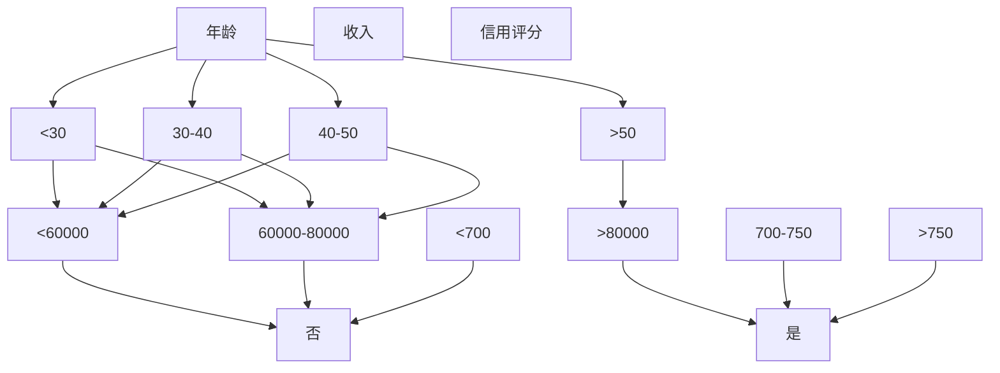

                 

# 人工智能创业：数据的核心地位

> **关键词：** 人工智能，数据驱动，创业，数据分析，机器学习，商业模式

> **摘要：** 本文将探讨在人工智能创业中，数据的核心地位及其对业务成功的关键影响。文章首先介绍数据在人工智能创业中的重要性，随后详细分析数据采集、存储、处理、分析与应用的流程，以及如何利用数据优化商业模式和产品开发。最后，文章将探讨未来人工智能创业面临的数据挑战和机遇。

## 1. 背景介绍

### 1.1 目的和范围

本文旨在探讨数据在人工智能创业中的核心地位，分析数据对创业成功的影响因素，并提供实用的方法和策略，帮助创业者更好地利用数据实现业务增长。文章将涵盖以下内容：

1. 数据在人工智能创业中的重要性。
2. 数据采集、存储、处理、分析与应用的流程。
3. 利用数据优化商业模式和产品开发。
4. 数据驱动的创业策略和实践案例。
5. 未来人工智能创业的数据挑战和机遇。

### 1.2 预期读者

本文适合以下读者：

1. 有志于从事人工智能创业的创业者。
2. 数据科学家、机器学习工程师和AI研究人员。
3. 对人工智能和数据驱动创业有兴趣的技术爱好者。

### 1.3 文档结构概述

本文将按照以下结构展开：

1. 引言：介绍数据在人工智能创业中的重要性。
2. 数据采集：探讨数据采集的方法和挑战。
3. 数据存储与处理：分析数据存储和处理的关键技术。
4. 数据分析与应用：探讨数据分析和应用的策略。
5. 数据驱动的创业策略：介绍数据驱动的创业模式和实践。
6. 实战案例：分享实际应用中的成功案例。
7. 未来发展趋势与挑战：探讨人工智能创业的未来。
8. 总结：对文章的核心观点进行总结。

### 1.4 术语表

#### 1.4.1 核心术语定义

- **人工智能（AI）**：模拟人类智能的技术和系统，包括机器学习、深度学习、自然语言处理等。
- **数据驱动创业**：基于数据分析、预测和优化来制定商业策略和决策的过程。
- **数据采集**：收集与业务相关的数据，包括内部数据和外部数据。
- **数据存储**：将数据存储在数据库或数据仓库中，以便后续处理和分析。
- **数据处理**：对原始数据进行清洗、转换和整合，使其适合分析。
- **数据分析**：使用统计方法和机器学习算法来揭示数据中的模式和规律。
- **数据应用**：将分析结果应用于业务决策和产品开发。

#### 1.4.2 相关概念解释

- **机器学习（ML）**：一种人工智能技术，通过训练数据集来构建模型，实现对数据的自动学习和预测。
- **深度学习（DL）**：一种特殊的机器学习技术，通过多层神经网络来模拟人类大脑的学习过程。
- **数据挖掘（DM）**：从大量数据中提取有价值信息的过程，包括模式识别、关联规则挖掘、聚类分析等。

#### 1.4.3 缩略词列表

- **AI**：人工智能
- **ML**：机器学习
- **DL**：深度学习
- **NLP**：自然语言处理
- **DB**：数据库
- **DW**：数据仓库
- **DM**：数据挖掘
- **API**：应用程序编程接口

## 2. 核心概念与联系

### 2.1 数据在人工智能创业中的核心地位

在人工智能创业中，数据是核心资产，对业务成功起着至关重要的作用。以下是数据在人工智能创业中的几个关键作用：

1. **驱动决策**：数据驱动创业的核心在于利用数据来支持决策。通过对市场、用户和业务数据的深入分析，创业者可以更准确地把握市场趋势、了解用户需求和优化产品功能。
   
2. **优化产品**：数据可以帮助创业者了解用户的使用习惯、偏好和行为模式，从而更好地设计、开发和优化产品。例如，通过分析用户反馈和点击数据，可以发现产品中的问题并快速改进。
   
3. **降低风险**：数据驱动的创业可以降低业务风险。通过对市场数据和竞争对手的分析，创业者可以更准确地评估市场机会和潜在风险，从而做出更明智的决策。

4. **提升竞争力**：利用数据分析和机器学习技术，创业者可以开发出更具竞争力、更个性化的产品和服务。例如，通过个性化推荐系统，可以提高用户的参与度和满意度，从而增强企业的竞争力。

### 2.2 数据采集

数据采集是数据驱动创业的第一步。创业者需要从多个来源获取数据，包括：

1. **内部数据**：包括用户行为数据、交易数据、客服记录等，这些数据可以帮助创业者了解业务运营情况和用户需求。
   
2. **外部数据**：包括市场数据、行业趋势、竞争对手信息等，这些数据可以帮助创业者了解市场环境和竞争态势。

数据采集的挑战包括：

1. **数据质量**：确保数据准确、完整、及时和可靠。
   
2. **数据来源**：确定合适的数据来源，并获取权限。
   
3. **数据收集成本**：数据采集可能需要投入大量的人力和物力资源。

### 2.3 数据存储与处理

数据存储与处理是数据驱动的关键环节。创业者需要确保数据的安全、高效存储和快速处理。

1. **数据存储**：创业者可以选择关系型数据库（如MySQL）或NoSQL数据库（如MongoDB），根据业务需求选择合适的存储方案。
   
2. **数据处理**：创业者可以使用ETL（提取、转换、加载）工具来清洗、转换和整合数据。例如，使用Apache Spark进行大数据处理。

### 2.4 数据分析与应用

数据分析是数据驱动创业的核心。创业者需要利用数据分析和机器学习技术来提取数据中的价值信息，并将其应用于业务决策和产品开发。

1. **数据可视化**：通过图表和可视化工具，将数据分析结果呈现给创业者，帮助其更好地理解数据。
   
2. **预测分析**：利用历史数据预测未来趋势，帮助创业者制定战略决策。
   
3. **机器学习**：通过训练数据集构建机器学习模型，实现对数据的自动学习和预测。例如，使用分类模型进行用户分类，使用回归模型进行销售预测。

### 2.5 数据驱动的创业策略

数据驱动的创业策略包括以下几个方面：

1. **用户洞察**：通过数据分析了解用户需求和行为，为产品开发和优化提供依据。
   
2. **市场研究**：通过数据分析和机器学习技术，分析市场趋势和竞争对手，为市场定位和战略决策提供支持。
   
3. **业务优化**：通过数据分析和机器学习技术，优化业务流程、提高运营效率、降低成本。

### 2.6 数据驱动的创业实践案例

以下是几个数据驱动的创业实践案例：

1. **个性化推荐系统**：通过分析用户行为数据，为用户推荐个性化内容，提高用户满意度和留存率。
   
2. **用户流失预测**：通过分析用户行为数据，预测用户流失风险，采取相应的措施降低用户流失率。
   
3. **智能客服系统**：通过自然语言处理技术，为用户提供智能客服服务，提高客服效率和用户满意度。

## 3. 核心算法原理 & 具体操作步骤

### 3.1 机器学习算法原理

机器学习算法是数据驱动创业的核心。以下是几个常用的机器学习算法及其原理：

1. **线性回归（Linear Regression）**：线性回归是一种简单的预测算法，通过建立线性关系来预测目标变量。其原理如下：

   - 假设输入特征为 $X$，目标变量为 $Y$，则线性回归模型可以表示为：
     $$ Y = \beta_0 + \beta_1 X + \epsilon $$
     其中，$\beta_0$ 和 $\beta_1$ 是模型参数，$\epsilon$ 是误差项。

   - 通过最小化误差平方和（SSE）来训练模型：
     $$ \min \sum_{i=1}^{n} (Y_i - \hat{Y}_i)^2 $$

2. **逻辑回归（Logistic Regression）**：逻辑回归是一种分类算法，用于预测二元变量。其原理如下：

   - 假设输入特征为 $X$，目标变量为 $Y$，则逻辑回归模型可以表示为：
     $$ P(Y=1|X) = \frac{1}{1 + e^{-(\beta_0 + \beta_1 X)}} $$
     其中，$P(Y=1|X)$ 是目标变量为1的概率。

   - 通过最大似然估计（MLE）来训练模型。

3. **决策树（Decision Tree）**：决策树是一种分类和回归算法，通过构建树形结构来对数据进行分类或回归。其原理如下：

   - 选择最优特征进行分裂，直到达到停止条件（如最大深度、最小节点样本数等）。

   - 通过递归构建树形结构，每个节点代表特征分裂，叶子节点代表分类或回归结果。

### 3.2 数据预处理与特征工程

在进行机器学习之前，需要对数据进行预处理和特征工程。以下是几个关键步骤：

1. **数据清洗**：去除缺失值、重复值和异常值，确保数据质量。

2. **数据转换**：将类别型特征转换为数值型特征，如使用独热编码（One-Hot Encoding）。

3. **特征选择**：选择与目标变量相关的特征，去除无关或冗余特征。

4. **特征工程**：通过组合、变换和扩展原始特征，提高模型的预测性能。

### 3.3 机器学习模型训练与评估

1. **模型训练**：将数据集划分为训练集和验证集，使用训练集训练模型，使用验证集评估模型性能。

2. **模型评估**：使用交叉验证（Cross-Validation）和性能指标（如准确率、召回率、F1值等）来评估模型性能。

3. **模型调优**：根据评估结果调整模型参数，提高模型性能。

## 4. 数学模型和公式 & 详细讲解 & 举例说明

### 4.1 线性回归模型

线性回归模型是一种简单的预测模型，用于预测连续目标变量。其数学模型如下：

$$ Y = \beta_0 + \beta_1 X + \epsilon $$

其中，$Y$ 是目标变量，$X$ 是输入特征，$\beta_0$ 和 $\beta_1$ 是模型参数，$\epsilon$ 是误差项。

**详细讲解：**

- **参数估计**：通过最小二乘法（Least Squares Method）来估计模型参数 $\beta_0$ 和 $\beta_1$，使得误差平方和最小。

  $$ \min \sum_{i=1}^{n} (Y_i - \hat{Y}_i)^2 $$

  其中，$\hat{Y}_i = \beta_0 + \beta_1 X_i$ 是预测值。

- **误差分析**：误差项 $\epsilon$ 是随机误差，假设其满足均值为0、方差为 $\sigma^2$ 的正态分布，即 $\epsilon \sim N(0, \sigma^2)$。

**举例说明：**

假设我们有一个简单的线性回归模型，用于预测房价。输入特征为房屋面积 $X$，目标变量为房价 $Y$。我们使用以下数据集进行训练：

| 房屋面积 (X) | 房价 (Y) |
| :---: | :---: |
| 100 | 200 |
| 150 | 300 |
| 200 | 400 |
| 250 | 500 |
| 300 | 600 |

通过最小二乘法，我们可以得到线性回归模型：

$$ Y = \beta_0 + \beta_1 X $$

通过计算，我们得到：

- $\beta_0 = 50$
- $\beta_1 = 1.5$

因此，房价的预测公式为：

$$ Y = 50 + 1.5 X $$

例如，当房屋面积为200平方米时，预测房价为：

$$ Y = 50 + 1.5 \times 200 = 350 $$

### 4.2 逻辑回归模型

逻辑回归模型是一种常用的分类模型，用于预测二元变量。其数学模型如下：

$$ P(Y=1|X) = \frac{1}{1 + e^{-(\beta_0 + \beta_1 X)}} $$

其中，$Y$ 是目标变量，$X$ 是输入特征，$\beta_0$ 和 $\beta_1$ 是模型参数。

**详细讲解：**

- **概率解释**：$P(Y=1|X)$ 表示在给定输入特征 $X$ 的情况下，目标变量 $Y$ 为1的概率。

- **参数估计**：通过最大似然估计（Maximum Likelihood Estimation，MLE）来估计模型参数 $\beta_0$ 和 $\beta_1$。

  $$ \log L(\beta_0, \beta_1) = \sum_{i=1}^{n} \log P(Y_i|X_i; \beta_0, \beta_1) $$

  其中，$L(\beta_0, \beta_1)$ 是似然函数，$P(Y_i|X_i; \beta_0, \beta_1)$ 是单个样本的概率。

**举例说明：**

假设我们有一个简单的逻辑回归模型，用于预测用户是否购买商品。输入特征为广告点击次数 $X$，目标变量为购买行为 $Y$。我们使用以下数据集进行训练：

| 广告点击次数 (X) | 购买行为 (Y) |
| :---: | :---: |
| 0 | 0 |
| 10 | 1 |
| 20 | 1 |
| 30 | 0 |
| 40 | 1 |

通过最大似然估计，我们可以得到逻辑回归模型：

$$ P(Y=1|X) = \frac{1}{1 + e^{-(\beta_0 + \beta_1 X)}} $$

通过计算，我们得到：

- $\beta_0 = -10$
- $\beta_1 = 0.5$

因此，购买行为的预测公式为：

$$ P(Y=1|X) = \frac{1}{1 + e^{-(-10 + 0.5 X)}} $$

例如，当广告点击次数为20时，预测购买行为的概率为：

$$ P(Y=1|X=20) = \frac{1}{1 + e^{-(-10 + 0.5 \times 20)}} \approx 0.647 $$

### 4.3 决策树模型

决策树模型是一种常用的分类和回归模型，通过构建树形结构来对数据进行分类或回归。其数学模型如下：

$$ \text{递归划分} \quad \text{直到} \quad \text{停止条件满足} $$

$$ \text{对于每个特征} \quad \text{计算分裂增益} \quad G(D, a) $$

$$ \text{选择最优特征分裂} \quad \alpha \quad \text{使得} \quad G(D, a) \quad \text{最大} $$

$$ \text{递归划分子集} \quad D^{\alpha}_1, D^{\alpha}_2, ..., D^{\alpha}_k $$

$$ \text{对于每个子集} \quad D^{\alpha}_i, \quad \text{继续递归划分，直到} \quad \text{停止条件满足} $$

**详细讲解：**

- **特征选择**：通过计算特征分裂增益 $G(D, a)$ 来选择最优特征分裂。常见的方法包括信息增益（Information Gain）、基尼不纯度（Gini Impurity）和熵（Entropy）。

- **停止条件**：递归划分的停止条件可以是最大树深度、最小节点样本数等。

- **树形结构**：决策树由多个内部节点和叶子节点组成。内部节点表示特征分裂，叶子节点表示分类或回归结果。

**举例说明：**

假设我们有一个简单的决策树模型，用于预测信用卡客户是否会逾期还款。输入特征包括年龄、收入、信用评分等。我们使用以下数据集进行训练：

| 年龄 | 收入 | 信用评分 | 是否逾期还款 |
| :---: | :---: | :---: | :---: |
| 30 | 50000 | 650 | 否 |
| 40 | 60000 | 720 | 是 |
| 50 | 70000 | 750 | 否 |
| 60 | 80000 | 780 | 是 |

通过计算特征分裂增益，我们可以构建以下决策树：



根据决策树，我们可以得出以下预测规则：

- 如果年龄小于30岁，收入小于60000元，信用评分小于700，则预测为否。
- 如果年龄小于30岁，收入小于60000元，信用评分大于等于700，则预测为是。
- 如果年龄大于等于30岁且小于40岁，收入小于60000元，信用评分小于700，则预测为否。
- 如果年龄大于等于30岁且小于40岁，收入小于60000元，信用评分大于等于700，则预测为是。
- 以此类推。

## 5. 项目实战：代码实际案例和详细解释说明

### 5.1 开发环境搭建

在本项目实战中，我们将使用Python作为主要编程语言，结合常用的数据科学库，如Pandas、NumPy、Scikit-learn和Matplotlib，来实现数据采集、处理、分析和可视化。以下是搭建开发环境的步骤：

1. **安装Python**：确保安装了Python 3.x版本，可以从[Python官方网站](https://www.python.org/)下载并安装。
2. **安装Anaconda**：下载并安装Anaconda，它是一个集成了Python和其他科学计算库的发行版，可以从[Anaconda官方网站](https://www.anaconda.com/)下载。
3. **创建虚拟环境**：在Anaconda命令行中创建一个虚拟环境，以隔离本项目所需的库。

   ```bash
   conda create -n ai_startup_env python=3.8
   conda activate ai_startup_env
   ```

4. **安装所需库**：在虚拟环境中安装所需的库。

   ```bash
   conda install pandas numpy scikit-learn matplotlib
   ```

### 5.2 源代码详细实现和代码解读

在本节中，我们将展示一个实际案例，使用Python和Scikit-learn实现一个简单的人工智能创业项目，该项目的目标是根据用户数据预测其购买行为。

#### 5.2.1 数据集准备

我们使用了一个假设的用户数据集，包含以下特征：年龄、收入、信用评分和购买历史。以下是数据集的一部分：

```csv
用户ID,年龄,收入,信用评分,购买历史
1,30,50000,650,0
2,40,60000,720,1
3,50,70000,750,0
4,60,80000,780,1
```

#### 5.2.2 代码实现

1. **数据导入与预处理**：

```python
import pandas as pd
from sklearn.model_selection import train_test_split
from sklearn.preprocessing import StandardScaler

# 读取数据集
data = pd.read_csv('user_data.csv')

# 分割特征和目标变量
X = data[['年龄', '收入', '信用评分']]
y = data['购买历史']

# 划分训练集和测试集
X_train, X_test, y_train, y_test = train_test_split(X, y, test_size=0.2, random_state=42)

# 特征缩放
scaler = StandardScaler()
X_train_scaled = scaler.fit_transform(X_train)
X_test_scaled = scaler.transform(X_test)
```

2. **模型训练与评估**：

```python
from sklearn.linear_model import LogisticRegression
from sklearn.metrics import accuracy_score, classification_report

# 创建逻辑回归模型
model = LogisticRegression()

# 训练模型
model.fit(X_train_scaled, y_train)

# 预测测试集
y_pred = model.predict(X_test_scaled)

# 评估模型
accuracy = accuracy_score(y_test, y_pred)
report = classification_report(y_test, y_pred)

print(f"Accuracy: {accuracy}")
print(f"Classification Report:\n{report}")
```

#### 5.2.3 代码解读与分析

- **数据导入与预处理**：使用Pandas读取CSV文件，将数据集分为特征（X）和目标变量（y）。然后使用Scikit-learn的`train_test_split`函数将数据集划分为训练集和测试集，使用`StandardScaler`对特征进行缩放，以提高模型的性能。

- **模型训练与评估**：创建一个逻辑回归模型，使用`fit`方法进行训练。然后使用`predict`方法对测试集进行预测，并使用`accuracy_score`和`classification_report`评估模型的准确性和其他性能指标。

### 5.3 代码解读与分析

在本案例中，我们使用逻辑回归模型来预测用户是否购买商品。以下是代码的关键部分及其解读：

- **数据导入与预处理**：
  ```python
  data = pd.read_csv('user_data.csv')
  X = data[['年龄', '收入', '信用评分']]
  y = data['购买历史']
  X_train, X_test, y_train, y_test = train_test_split(X, y, test_size=0.2, random_state=42)
  scaler = StandardScaler()
  X_train_scaled = scaler.fit_transform(X_train)
  X_test_scaled = scaler.transform(X_test)
  ```

  - `pd.read_csv('user_data.csv')`：读取CSV文件中的用户数据。
  - `X = data[['年龄', '收入', '信用评分']]` 和 `y = data['购买历史']`：提取特征和目标变量。
  - `train_test_split(X, y, test_size=0.2, random_state=42)`：将数据集划分为80%的训练集和20%的测试集，确保结果的可重复性。
  - `scaler.fit_transform(X_train)`：对训练集的特征进行标准化处理，以提高模型的性能。

- **模型训练与评估**：
  ```python
  model = LogisticRegression()
  model.fit(X_train_scaled, y_train)
  y_pred = model.predict(X_test_scaled)
  accuracy = accuracy_score(y_test, y_pred)
  report = classification_report(y_test, y_pred)
  ```

  - `model = LogisticRegression()`：创建逻辑回归模型。
  - `model.fit(X_train_scaled, y_train)`：使用训练集训练模型。
  - `y_pred = model.predict(X_test_scaled)`：使用测试集进行预测。
  - `accuracy_score(y_test, y_pred)`：计算模型的准确率。
  - `classification_report(y_test, y_pred)`：生成分类报告，包括精确率、召回率和F1分数等性能指标。

## 6. 实际应用场景

数据在人工智能创业中的应用场景广泛，以下是一些典型的实际应用场景：

### 6.1 个性化推荐系统

个性化推荐系统是数据驱动的典型应用之一。通过分析用户的历史行为数据，系统可以为每个用户推荐最可能感兴趣的商品或内容。例如，电商平台可以利用用户浏览、搜索和购买记录，为其推荐相似商品或相关优惠活动。

### 6.2 客户行为预测

利用数据分析和机器学习技术，企业可以预测客户的购买意图、流失风险和满意度。例如，金融行业可以利用客户的历史交易数据和社交行为，预测其信用风险和还款能力，从而优化贷款审批流程和风险管理。

### 6.3 供应链优化

通过分析供应链数据，企业可以实现供应链的实时监控和优化。例如，制造业可以利用生产数据、库存数据和供应链上下游的协同数据，优化生产计划、库存管理和物流配送，提高供应链的响应速度和效率。

### 6.4 市场预测与竞争分析

数据驱动的市场预测和竞争分析可以帮助企业把握市场趋势，制定有效的市场策略。例如，零售行业可以通过分析消费者行为数据和市场趋势，预测市场需求变化，调整产品线和营销策略，提高市场竞争力。

### 6.5 健康医疗

在健康医疗领域，数据驱动的方法可以帮助医生更好地诊断病情、制定治疗方案和预测疾病趋势。例如，通过分析患者的医疗记录、基因数据和生活方式数据，人工智能系统可以提供个性化的健康建议和疾病预测。

## 7. 工具和资源推荐

### 7.1 学习资源推荐

#### 7.1.1 书籍推荐

- 《Python数据科学手册》
- 《深度学习》
- 《机器学习实战》
- 《数据挖掘：实用工具与技术》

#### 7.1.2 在线课程

- Coursera上的《机器学习》课程
- Udacity的《深度学习纳米学位》
- edX上的《Python数据分析》课程

#### 7.1.3 技术博客和网站

- Medium上的数据科学和机器学习专栏
- Analytics Vidhya
- KDNuggets

### 7.2 开发工具框架推荐

#### 7.2.1 IDE和编辑器

- PyCharm
- Jupyter Notebook
- VSCode

#### 7.2.2 调试和性能分析工具

- Spyder
- PyDebug
- Line_profiler

#### 7.2.3 相关框架和库

- Scikit-learn
- TensorFlow
- PyTorch
- Keras

### 7.3 相关论文著作推荐

#### 7.3.1 经典论文

- "A New Look at Linear Regression in Statistics" by Sir David Cox
- "The Algorithmic Foundations of Differential Privacy" by Cynthia Dwork et al.
- "Deep Learning" by Ian Goodfellow et al.

#### 7.3.2 最新研究成果

- "Attention Is All You Need" by Vaswani et al.
- "Learning to Learn" by François Chollet
- "The Neural Architecture Search Hypothesis" by Zhirong Wu et al.

#### 7.3.3 应用案例分析

- "Using AI to Improve Healthcare" by CMS
- "Deep Learning for Personalized Medicine" by IBM Research
- "AI in Retail: A Guide to AI Applications in Retail" by McKinsey & Company

## 8. 总结：未来发展趋势与挑战

### 8.1 发展趋势

1. **数据量的爆炸性增长**：随着物联网、社交媒体和云计算的发展，数据量呈指数级增长，为人工智能创业提供了丰富的数据资源。
2. **算法的优化与创新**：深度学习、强化学习等新型算法的涌现，使得人工智能在图像识别、自然语言处理、自动驾驶等领域取得了重大突破。
3. **跨界合作与生态构建**：人工智能创业不再是单一领域的创新，而是需要跨行业、跨学科的合作，构建完整的人工智能生态系统。
4. **数据隐私与安全**：随着数据隐私问题的日益突出，如何保护用户数据隐私将成为人工智能创业的重要挑战。

### 8.2 挑战

1. **数据质量与完整性**：数据质量是人工智能创业的基础，如何确保数据的质量和完整性是一个重大挑战。
2. **数据隐私与安全**：如何在利用数据的同时保护用户隐私，是一个亟待解决的问题。
3. **计算资源与成本**：大规模数据处理和机器学习模型的训练需要大量的计算资源，如何降低成本成为关键。
4. **算法透明性与可解释性**：随着算法的复杂性增加，如何提高算法的透明性和可解释性，使其能够被用户和社会接受，是一个重要挑战。

## 9. 附录：常见问题与解答

### 9.1 数据采集

**Q1：如何确保数据质量？**

- **数据清洗**：去除缺失值、重复值和异常值。
- **数据验证**：确保数据的准确性、一致性和完整性。
- **数据标准化**：统一数据格式和单位。

### 9.2 数据存储与处理

**Q2：如何选择合适的数据库？**

- **关系型数据库**：适用于结构化数据，如MySQL、PostgreSQL。
- **NoSQL数据库**：适用于非结构化数据，如MongoDB、Cassandra。

### 9.3 数据分析与模型训练

**Q3：如何选择合适的机器学习算法？**

- **线性回归**：适用于回归问题。
- **逻辑回归**：适用于分类问题。
- **决策树**：适用于分类和回归问题。
- **神经网络**：适用于复杂的预测问题。

### 9.4 数据应用与产品开发

**Q4：如何将数据驱动策略应用于产品开发？**

- **用户洞察**：通过数据分析了解用户需求和行为。
- **产品优化**：基于用户反馈和数据分析优化产品功能。
- **实验设计**：进行A/B测试，验证数据驱动策略的有效性。

## 10. 扩展阅读 & 参考资料

- Goodfellow, I., Bengio, Y., & Courville, A. (2016). *Deep Learning*. MIT Press.
- Russell, S., & Norvig, P. (2016). *Artificial Intelligence: A Modern Approach*. Pearson.
- Murphy, K. P. (2012). *Machine Learning: A Probabilistic Perspective*. MIT Press.
- Lee, J., & Srivastava, D. (2019). *Deep Learning for Beginners: A Hands-On Introduction*. Apress.
- heaton, P., & Lih, Y. (2021). *AI: The Basics for Beginners: A Practical Introduction to Artificial Intelligence*. Springer.

