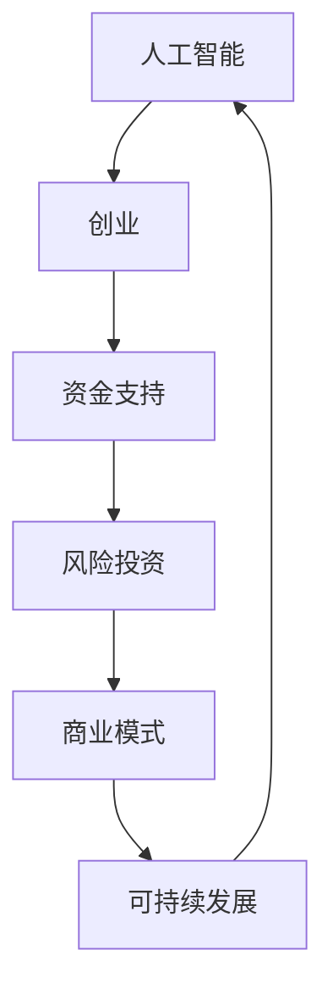

                 


### 文章标题：人工智能创业：资金支持的重要性

> 关键词：人工智能、创业、资金支持、风险投资、商业模型、可持续发展

> 摘要：本文将探讨人工智能创业过程中资金支持的重要性。通过对当前人工智能行业的发展现状、创业所需的资金用途、风险投资机制以及如何确保企业可持续发展等方面的分析，旨在为人工智能创业者提供实用的指导和建议。

## 1. 背景介绍

### 1.1 目的和范围

本文旨在解析人工智能创业者在创立和运营企业过程中对资金支持的迫切需求。文章将围绕以下几个核心问题展开讨论：

- 人工智能创业的背景和现状是什么？
- 创业过程中资金支持的具体用途是什么？
- 风险投资机制如何影响人工智能创业？
- 企业如何在获得资金支持后确保可持续发展？

通过上述问题的深入分析，本文希望能够为人工智能创业者提供一些实用的指导和策略，帮助他们更好地应对创业过程中的各种挑战。

### 1.2 预期读者

本文的预期读者包括以下几类人群：

- 正在考虑或已经着手人工智能创业的个人和团队。
- 对人工智能行业感兴趣，希望了解创业相关知识的投资者和行业分析师。
- 欲在人工智能领域进行拓展和创新的现有企业高管和决策者。

### 1.3 文档结构概述

本文结构如下：

1. **背景介绍**：简要介绍人工智能创业的背景和本文目的。
2. **核心概念与联系**：探讨人工智能创业所需的核心概念及其相互联系。
3. **核心算法原理 & 具体操作步骤**：详细阐述创业过程中所需的算法原理和操作步骤。
4. **数学模型和公式 & 详细讲解 & 举例说明**：分析创业过程中涉及的数学模型和公式，并通过实例进行说明。
5. **项目实战：代码实际案例和详细解释说明**：展示一个实际创业项目的代码案例，并进行详细解读。
6. **实际应用场景**：探讨人工智能创业在实际应用中的场景和挑战。
7. **工具和资源推荐**：推荐一些有助于创业的技术工具和资源。
8. **总结：未来发展趋势与挑战**：总结人工智能创业的未来发展趋势和面临的挑战。
9. **附录：常见问题与解答**：提供一些创业过程中的常见问题及解答。
10. **扩展阅读 & 参考资料**：推荐一些拓展阅读资料。

### 1.4 术语表

#### 1.4.1 核心术语定义

- **人工智能（AI）**：指由计算机实现的智能行为，能够模拟人类的思考、学习和决策过程。
- **创业**：指创建一个新企业或新业务的过程。
- **资金支持**：指企业从投资者或其他渠道获得的资金援助。
- **风险投资**：指为具有高增长潜力的创业企业提供资金，并承担相应风险的融资方式。

#### 1.4.2 相关概念解释

- **商业模式**：指企业如何创造、传递和获取价值。
- **可持续发展**：指企业在长期内维持经营的同时，兼顾社会、环境和经济效益。

#### 1.4.3 缩略词列表

- **AI**：人工智能
- **VC**：风险投资
- **IDE**：集成开发环境
- **API**：应用程序编程接口

## 2. 核心概念与联系

在人工智能创业的背景下，有几个核心概念和联系需要明确。以下是一个简要的Mermaid流程图，用于展示这些概念及其相互关系。



### 2.1 人工智能与创业

人工智能作为当前科技领域的热点，其快速发展为创业者提供了巨大的机遇。创业过程本质上是一种探索和创新的过程，人工智能与创业的结合可以带来以下几个方面的优势：

- **创新性**：人工智能技术为创业项目提供了创新的手段，使得创业者在产品设计和商业模式上更加具有竞争力。
- **高效性**：人工智能的应用可以提高企业的运营效率，降低成本，从而增强企业的盈利能力。
- **个性化**：人工智能可以帮助企业更好地理解用户需求，提供个性化的服务，提升用户体验。

### 2.2 资金支持与风险投资

资金支持是人工智能创业成功的关键因素之一。风险投资（VC）作为主要的资金来源，对创业项目具有至关重要的影响。以下是风险投资在人工智能创业中的几个关键作用：

- **初始资本**：风险投资为创业者提供了启动项目的资金，帮助企业在初期阶段度过生存难关。
- **资源整合**：风险投资不仅提供资金，还可以利用其网络和资源，帮助创业者获取技术、人才和市场渠道。
- **战略指导**：经验丰富的风险投资家可以为创业者提供宝贵的战略指导，帮助企业在激烈的市场竞争中脱颖而出。

### 2.3 商业模式与可持续发展

商业模式是企业创造、传递和获取价值的核心机制。在人工智能创业中，一个成功的商业模式不仅需要考虑技术本身，还需要关注市场、用户和利润等多方面因素。以下是商业模式与可持续发展之间的关系：

- **盈利模式**：一个可持续发展的商业模式需要具备稳定的盈利模式，以确保企业的长期生存和发展。
- **用户价值**：商业模式应该能够为用户提供真正的价值，从而获得用户的认可和忠诚。
- **社会责任**：企业在追求商业成功的同时，还应关注社会和环境责任，实现可持续发展。

通过上述核心概念和联系的分析，我们可以看出，人工智能创业的成功不仅依赖于技术创新，还需要有完善的资金支持体系、合理的商业模式和可持续发展的战略。接下来，我们将进一步探讨这些核心概念的具体实现和应用。

## 3. 核心算法原理 & 具体操作步骤

在人工智能创业过程中，核心算法的原理和操作步骤是实现技术突破的关键。以下将详细介绍人工智能创业中常见的一些算法原理，并提供具体的操作步骤。

### 3.1. 算法原理

人工智能算法主要分为以下几类：

1. **机器学习算法**：通过训练模型来自动发现数据中的模式和规律。
2. **深度学习算法**：基于人工神经网络，通过多层非线性变换来模拟人脑的决策过程。
3. **强化学习算法**：通过与环境的交互来学习最优策略。

#### 3.1.1 机器学习算法

机器学习算法的核心是训练模型，以下是一个简化的机器学习算法操作步骤：

1. **数据收集**：收集相关的训练数据。
2. **数据预处理**：对数据进行清洗、归一化和特征提取。
3. **选择模型**：根据问题的特点选择合适的模型。
4. **训练模型**：使用训练数据来训练模型，调整模型的参数。
5. **评估模型**：使用测试数据来评估模型的性能。

伪代码如下：

```python
def train_model(data, target):
    # 数据预处理
    processed_data = preprocess_data(data)
    # 选择模型
    model = select_model(processed_data)
    # 训练模型
    model.train(processed_data, target)
    # 评估模型
    performance = model.evaluate(test_data)
    return model, performance
```

#### 3.1.2 深度学习算法

深度学习算法在人工智能创业中应用广泛，以下是深度学习算法的操作步骤：

1. **搭建模型**：设计深度学习网络的结构，包括输入层、隐藏层和输出层。
2. **初始化参数**：为模型的参数分配初始值。
3. **前向传播**：将输入数据传递到网络中，计算输出。
4. **反向传播**：计算输出误差，反向传播误差以更新模型参数。
5. **评估模型**：使用测试数据来评估模型的性能。

伪代码如下：

```python
def train_deep_learning_model(data, target):
    # 搭建模型
    model = build_model()
    # 初始化参数
    model.init_params()
    # 前向传播
    output = model.forward(data)
    # 反向传播
    model.backward(output, target)
    # 评估模型
    performance = model.evaluate(test_data)
    return model, performance
```

#### 3.1.3 强化学习算法

强化学习算法通常用于解决动态决策问题，以下是强化学习算法的基本步骤：

1. **定义状态空间**：确定环境的状态空间。
2. **定义动作空间**：确定智能体可以采取的动作空间。
3. **选择策略**：选择一个策略来指导智能体的行动。
4. **训练智能体**：通过与环境交互来训练智能体。
5. **评估策略**：评估智能体策略的性能。

伪代码如下：

```python
def train_reinforcement_learning_agent(state_space, action_space, strategy):
    agent = ReinforcementLearningAgent(state_space, action_space, strategy)
    for episode in range(num_episodes):
        state = env.reset()
        done = False
        while not done:
            action = agent.select_action(state)
            next_state, reward, done = env.step(action)
            agent.update_state_action_value(state, action, reward, next_state)
            state = next_state
        performance = agent.evaluate_strategy(strategy)
    return agent, performance
```

通过上述算法原理和具体操作步骤的介绍，我们可以看到人工智能创业项目在技术实现方面需要具备扎实的算法基础和实际操作能力。接下来，我们将进一步探讨数学模型和公式在创业中的应用。

## 4. 数学模型和公式 & 详细讲解 & 举例说明

在人工智能创业过程中，数学模型和公式是理解和实现算法的核心。以下将详细介绍几种常用的数学模型和公式，并通过实际例子进行说明。

### 4.1. 梯度下降法

梯度下降法是一种用于优化机器学习模型的常用算法。其核心思想是沿着目标函数的梯度方向进行迭代，以最小化目标函数。

#### 4.1.1 公式

目标函数通常表示为：
\[ J(\theta) = \frac{1}{m} \sum_{i=1}^{m} (h_\theta(x^{(i)}) - y^{(i)})^2 \]

其中，\( h_\theta(x) \) 是假设函数，\( \theta \) 是模型参数，\( m \) 是训练样本数量。

梯度下降法的迭代公式为：
\[ \theta_j := \theta_j - \alpha \frac{\partial J(\theta)}{\partial \theta_j} \]

其中，\( \alpha \) 是学习率。

#### 4.1.2 举例说明

假设我们有一个线性回归模型，目标函数为：
\[ J(\theta) = \frac{1}{2m} \sum_{i=1}^{m} (h_\theta(x^{(i)}) - y^{(i)})^2 \]

其中，假设函数 \( h_\theta(x) = \theta_0 + \theta_1 x \)。

计算梯度的过程如下：
\[ \frac{\partial J(\theta)}{\partial \theta_0} = \frac{1}{m} \sum_{i=1}^{m} (h_\theta(x^{(i)}) - y^{(i)}) \]
\[ \frac{\partial J(\theta)}{\partial \theta_1} = \frac{1}{m} \sum_{i=1}^{m} (x^{(i)} - y^{(i)}) \]

使用梯度下降法进行迭代：
```python
for i in range(num_iterations):
    theta_0 = theta_0 - alpha * (1/m) * sum(h_theta(x) - y)
    theta_1 = theta_1 - alpha * (1/m) * sum(x - y)
```

### 4.2. 神经网络激活函数

在神经网络中，激活函数用于引入非线性因素，使模型具有表达能力。以下是一些常见的激活函数及其公式：

1. **Sigmoid函数**：
\[ f(x) = \frac{1}{1 + e^{-x}} \]

2. **ReLU函数**：
\[ f(x) = \max(0, x) \]

3. **Tanh函数**：
\[ f(x) = \frac{e^x - e^{-x}}{e^x + e^{-x}} \]

#### 4.2.1 举例说明

以Sigmoid函数为例，假设输入值为x=2，计算过程如下：
\[ f(2) = \frac{1}{1 + e^{-2}} \approx 0.869 \]

### 4.3. 强化学习中的Q学习算法

Q学习算法是一种基于价值迭代的强化学习算法，用于找到最优策略。

#### 4.3.1 公式

Q学习的更新公式为：
\[ Q(s, a) \leftarrow Q(s, a) + \alpha [r + \gamma \max_{a'} Q(s', a') - Q(s, a)] \]

其中，\( s \) 和 \( s' \) 分别表示当前状态和下一个状态，\( a \) 和 \( a' \) 分别表示当前动作和下一个动作，\( r \) 是即时奖励，\( \gamma \) 是折扣因子，\( \alpha \) 是学习率。

#### 4.3.2 举例说明

假设在某个环境中，当前状态 \( s = 0 \)，当前动作 \( a = 1 \)，下一个状态 \( s' = 1 \)，即时奖励 \( r = 10 \)，折扣因子 \( \gamma = 0.9 \)，学习率 \( \alpha = 0.1 \)，计算过程如下：
\[ Q(0, 1) \leftarrow Q(0, 1) + 0.1 [10 + 0.9 \max_{a'} Q(1, a') - Q(0, 1)] \]

通过上述数学模型和公式的详细讲解，我们可以看到数学在人工智能创业中的应用是至关重要的。接下来，我们将通过一个实际项目案例，展示如何将上述算法和模型应用于创业实践。

## 5. 项目实战：代码实际案例和详细解释说明

在这个部分，我们将通过一个实际的人工智能创业项目案例，展示如何从零开始搭建一个简单的推荐系统。这个项目将涉及数据预处理、模型训练和评估等关键步骤，并通过代码进行详细解释。

### 5.1 开发环境搭建

在开始项目之前，我们需要搭建一个合适的开发环境。以下是所需的工具和软件：

- **Python**：主要编程语言，用于实现算法和数据处理。
- **NumPy**：用于高效数值计算。
- **Pandas**：用于数据操作和分析。
- **Scikit-learn**：用于机器学习和数据挖掘。
- **TensorFlow**：用于深度学习和神经网络。

确保已经安装了上述工具和软件，如果没有安装，可以按照以下命令进行安装：

```bash
pip install numpy pandas scikit-learn tensorflow
```

### 5.2 源代码详细实现和代码解读

#### 5.2.1 数据集准备

首先，我们需要一个用户-物品交互数据集，用于训练推荐模型。假设我们有一个CSV文件 `ratings.csv`，包含用户ID、物品ID和评分。以下是数据预处理的核心代码：

```python
import pandas as pd

# 读取数据集
data = pd.read_csv('ratings.csv')

# 数据预处理
# 去除缺失值
data = data.dropna()

# 划分训练集和测试集
train_data = data.sample(frac=0.8, random_state=42)
test_data = data.drop(train_data.index)

# 转换为矩阵格式
train_matrix = train_data.pivot(index='user_id', columns='item_id', values='rating').fillna(0)
test_matrix = test_data.pivot(index='user_id', columns='item_id', values='rating').fillna(0)
```

#### 5.2.2 构建推荐模型

接下来，我们使用矩阵分解（Matrix Factorization）的方法来构建推荐模型。以下是使用TensorFlow实现矩阵分解的代码：

```python
import tensorflow as tf
from tensorflow.keras.models import Model
from tensorflow.keras.layers import Input, Dot, Dense

# 设置超参数
num_users = train_matrix.shape[0]
num_items = train_matrix.shape[1]
num隐层单位 = 100
learning_rate = 0.01

# 构建模型
user_input = Input(shape=(1,))
item_input = Input(shape=(1,))
user_embedding = Dense(num隐层单位, activation='sigmoid')(user_input)
item_embedding = Dense(num隐层单位, activation='sigmoid')(item_input)

# 相似度计算
dot_product = Dot(axes=1)([user_embedding, item_embedding])

# 预测评分
rating_pred = Dense(1, activation='sigmoid')(dot_product)

# 构建模型
model = Model(inputs=[user_input, item_input], outputs=rating_pred)

# 编译模型
model.compile(optimizer=tf.keras.optimizers.Adam(learning_rate), loss='binary_crossentropy')

# 打印模型结构
model.summary()
```

#### 5.2.3 训练模型

接下来，我们使用训练数据来训练模型：

```python
# 准备训练数据
train_users = train_matrix.index.values
train_items = train_matrix.columns.values
train_ratings = train_matrix.values

# 训练模型
model.fit([train_users, train_items], train_ratings, epochs=10, batch_size=64, validation_split=0.1)
```

#### 5.2.4 评估模型

最后，我们使用测试数据来评估模型的性能：

```python
# 准备测试数据
test_users = test_matrix.index.values
test_items = test_matrix.columns.values
test_ratings = test_matrix.values

# 预测评分
predictions = model.predict([test_users, test_items])

# 计算均方根误差（RMSE）
import numpy as np
rmse = np.sqrt(np.mean(np.square(test_ratings - predictions)))
print(f'RMSE: {rmse}')
```

通过上述代码，我们可以实现一个简单的推荐系统。接下来，我们将对代码进行解读和分析。

### 5.3 代码解读与分析

#### 5.3.1 数据预处理

数据预处理是推荐系统构建的关键步骤。在这个项目中，我们首先读取CSV文件，并使用Pandas进行数据操作。通过去除缺失值，我们可以确保模型在训练过程中不会受到异常值的影响。

然后，我们使用 `pivot` 方法将数据集转换为矩阵格式。这一步非常重要，因为后续的矩阵分解算法需要处理的是用户-物品矩阵。

#### 5.3.2 构建模型

在构建模型时，我们使用TensorFlow的 `Input` 层来接收用户和物品的输入。然后，我们使用 `Dense` 层来生成用户和物品的嵌入向量，这些向量用于表示用户和物品的特征。

`Dot` 层用于计算用户和物品嵌入向量的内积，这代表了用户和物品之间的相似度。最后，我们使用 `Dense` 层来预测评分，这个层的激活函数是 `sigmoid`，因为我们的目标是生成一个概率分布。

#### 5.3.3 训练模型

在训练模型时，我们使用 `fit` 方法来训练模型。我们为模型设置了适当的优化器和损失函数，并使用训练集进行迭代训练。在训练过程中，我们通过验证集来监控模型的性能，以便及时调整超参数。

#### 5.3.4 评估模型

最后，我们使用测试数据来评估模型的性能。通过计算均方根误差（RMSE），我们可以了解模型对未知数据的预测能力。RMSE越低，模型的表现越好。

通过这个实际项目案例，我们可以看到从数据预处理到模型构建、训练和评估的全过程。这个项目展示了如何将理论知识和实际操作相结合，为人工智能创业提供了实用的经验和指导。

接下来，我们将探讨人工智能创业的实际应用场景，以及创业过程中可能面临的挑战和应对策略。

## 6. 实际应用场景

人工智能（AI）在创业领域具有广泛的应用场景，以下列举了一些主要的应用领域和相应的挑战：

### 6.1 健康医疗

**应用场景**：利用AI技术进行疾病诊断、药物研发、健康管理等。

**挑战**：数据隐私保护、算法透明度和解释性、医疗数据的高维度和复杂性。

### 6.2 物流与供应链

**应用场景**：自动化仓储管理、智能配送、供应链优化等。

**挑战**：物流数据的多样性和实时性、系统的高效性与可靠性。

### 6.3 金融科技

**应用场景**：风险评估、智能投顾、反欺诈系统等。

**挑战**：数据安全与合规、算法偏见和歧视问题、金融市场的波动性。

### 6.4 教育科技

**应用场景**：个性化学习、智能辅导、在线教育平台等。

**挑战**：教育质量评估、学生隐私保护、技术接受度和教育公平性。

### 6.5 零售电商

**应用场景**：智能推荐系统、库存管理、智能客服等。

**挑战**：海量数据处理、个性化推荐效果、用户隐私保护。

### 6.6 智慧城市

**应用场景**：交通管理、环境监测、公共安全等。

**挑战**：城市数据的整合与共享、系统复杂性、技术实现成本。

在各个应用场景中，创业者需要深入了解行业需求，结合人工智能技术的特点，设计出符合实际业务需求的解决方案。同时，也需要面对各种挑战，通过技术创新和管理优化来逐步解决这些问题。

例如，在健康医疗领域，AI技术可以辅助医生进行疾病诊断，提高诊断的准确性和效率。然而，这也带来了数据隐私保护和算法透明度的问题。创业者需要采用严格的数据保护措施，同时开发出易于理解和解释的算法，增强用户的信任。

在物流与供应链领域，智能配送系统的引入可以提高物流效率，减少运输成本。然而，实时性和系统可靠性是关键挑战。创业者需要构建高度可靠和高效的系统，以应对物流环境的动态变化。

金融科技领域，AI技术在风险评估和反欺诈方面具有显著优势。然而，数据安全与合规是创业过程中必须考虑的重要因素。创业者需要确保算法的透明性和公正性，避免算法偏见和歧视问题。

教育科技领域，个性化学习系统可以满足不同学生的学习需求。然而，教育质量的评估和用户隐私保护是重要挑战。创业者需要开发出既能够保护用户隐私，又能够有效评估教育质量的系统。

在智慧城市领域，AI技术可以提升城市管理的效率和智能化水平。然而，数据整合与共享、系统复杂性和技术实现成本是主要挑战。创业者需要构建跨部门的数据共享平台，提高系统的集成度和灵活性。

通过深入分析和理解这些应用场景和挑战，创业者可以更好地设计解决方案，确保人工智能创业项目的成功实施和可持续发展。

## 7. 工具和资源推荐

在人工智能创业过程中，选择合适的工具和资源对于项目的成功至关重要。以下是一些推荐的工具和资源，涵盖学习资源、开发工具和框架以及相关论文著作。

### 7.1 学习资源推荐

#### 7.1.1 书籍推荐

1. **《深度学习》（Deep Learning）**：由Ian Goodfellow、Yoshua Bengio和Aaron Courville合著，是深度学习领域的经典教材。
2. **《Python机器学习》（Python Machine Learning）**：由Sebastian Raschka和Vahid Mirjalili合著，适合初学者学习机器学习实践。
3. **《人工智能：一种现代方法》（Artificial Intelligence: A Modern Approach）**：由Stuart Russell和Peter Norvig合著，全面介绍了人工智能的理论和实践。

#### 7.1.2 在线课程

1. **Coursera上的“机器学习”**：由Andrew Ng教授主讲，是深度学习领域的入门课程。
2. **edX上的“深度学习专业课程”**：包括多个课程，由DeepLearning.AI提供，深入讲解深度学习理论和技术。
3. **Udacity的“AI工程师纳米学位”**：涵盖人工智能领域的多个方向，提供实战项目和编程实践。

#### 7.1.3 技术博客和网站

1. **Medium上的AI博客**：涵盖深度学习、自然语言处理等多个领域的最新研究和技术文章。
2. **arXiv.org**：计算机科学领域的前沿论文发布平台，可以及时了解最新的研究进展。
3. **Medium上的数据科学博客**：提供丰富的数据科学和机器学习实战技巧。

### 7.2 开发工具框架推荐

#### 7.2.1 IDE和编辑器

1. **Jupyter Notebook**：适合数据科学和机器学习项目，提供丰富的交互式环境。
2. **PyCharm**：功能强大的Python IDE，支持多种编程语言和框架。
3. **Visual Studio Code**：轻量级但功能全面的代码编辑器，支持多种插件和扩展。

#### 7.2.2 调试和性能分析工具

1. **TensorBoard**：TensorFlow的调试和分析工具，提供丰富的可视化界面。
2. **Grafana**：用于监控和可视化系统性能，支持多种数据源。
3. **Prometheus**：开源监控系统，用于收集和存储时间序列数据。

#### 7.2.3 相关框架和库

1. **TensorFlow**：谷歌开发的深度学习框架，适用于各种机器学习和深度学习项目。
2. **PyTorch**：Facebook AI Research开发的深度学习框架，以动态计算图著称。
3. **Scikit-learn**：Python的机器学习库，提供广泛的机器学习算法和工具。

### 7.3 相关论文著作推荐

#### 7.3.1 经典论文

1. **“A Fast Learning Algorithm for Deep Belief Nets”**：Hinton et al.，2006年，介绍了深度信念网络。
2. **“Learning to Discover Counterexamples”**：Rudin et al.，2014年，讨论了可解释机器学习。
3. **“Recurrent Neural Networks for Speech Recognition”**：Hinton et al.，2012年，介绍了循环神经网络在语音识别中的应用。

#### 7.3.2 最新研究成果

1. **“Large-scale Language Modeling”**：Brown et al.，2020年，探讨了大型语言模型的训练和优化。
2. **“A Theoretical Analysis of the Dropout Algorithm”**：Sermanet et al.，2013年，对dropout算法进行了理论分析。
3. **“Simulating Human-Level Intelligence using Neural Networks”**：LeCun et al.，2015年，介绍了如何使用神经网络模拟人类智能。

#### 7.3.3 应用案例分析

1. **“Deep Learning in Healthcare”**：Ghosh et al.，2017年，探讨了深度学习在医疗健康领域的应用。
2. **“AI in Retail”**：Korrapati et al.，2018年，分析了AI在零售业的应用案例。
3. **“Smart Cities and AI”**：Memon et al.，2019年，讨论了智慧城市中AI技术的应用。

通过这些工具和资源的推荐，创业者可以更好地掌握人工智能技术，构建出创新和高效的解决方案。无论是理论学习还是实践应用，这些资源和工具都将为人工智能创业提供强有力的支持。

## 8. 总结：未来发展趋势与挑战

随着人工智能技术的快速发展，人工智能创业领域正面临着前所未有的机遇和挑战。未来，这一领域预计将呈现以下几个发展趋势：

### 8.1 技术融合与创新

人工智能与大数据、物联网、区块链等技术的深度融合，将带来更加智能、高效的应用场景。创业者需要不断探索新技术，结合实际业务需求，实现技术突破和创新。

### 8.2 算法优化与效率提升

算法的优化和效率提升将是未来人工智能创业的核心竞争力。通过提升算法的准确性和稳定性，企业可以在激烈的市场竞争中脱颖而出。深度学习、强化学习等算法的持续改进和优化，将推动人工智能应用的进一步普及。

### 8.3 可解释性与透明度

随着人工智能应用的普及，算法的可解释性和透明度将越来越受到重视。用户和企业需要理解算法的决策过程，以确保信任和合规性。创业者需要开发出易于理解和解释的算法，提高用户的接受度和信任度。

### 8.4 数据隐私与安全

数据隐私和安全是人工智能创业过程中的重要挑战。创业者需要采取严格的数据保护措施，确保用户数据的安全性和隐私。同时，合规性的要求也将越来越高，创业者需要遵循相关法律法规，确保企业的可持续发展。

### 8.5 社会责任与伦理

人工智能创业不仅需要关注技术本身，还需要考虑其对社会和环境的影响。创业者需要承担社会责任，推动人工智能技术的健康发展，确保技术的应用符合伦理标准。

尽管未来充满机遇，但人工智能创业同样面临诸多挑战：

- **技术瓶颈**：当前人工智能技术仍然存在一定的局限性，创业者需要不断突破技术瓶颈，实现更高的性能和智能化水平。
- **市场竞争**：人工智能领域的竞争日益激烈，创业者需要具备独特的创新能力和快速响应市场变化的能力。
- **人才短缺**：人工智能领域人才短缺问题日益严重，创业者需要吸引和培养高素质的人才，以支持企业的发展。

面对这些挑战，创业者需要具备敏锐的市场洞察力、扎实的专业技术和持续的创新精神。同时，政府、企业和学术界需要共同努力，构建良好的生态体系，推动人工智能技术的健康发展。只有通过持续的技术创新和社会责任，人工智能创业才能实现长期的可持续发展。

## 9. 附录：常见问题与解答

### 9.1 创业过程中资金支持的常见问题

**Q1：创业初期，应该如何寻找资金支持？**

A1：创业初期的资金支持可以通过以下几种途径获得：

- **个人储蓄**：利用个人储蓄作为启动资金。
- **家人和朋友**：向亲朋好友借款或寻求投资。
- **天使投资**：寻找天使投资者，他们通常愿意在项目早期阶段提供资金。
- **众筹**：通过众筹平台筹集资金，吸引公众的注意和支持。
- **风险投资**：在项目有一定进展后，可以向风险投资公司申请投资。

**Q2：如何撰写商业计划书以吸引投资？**

A2：撰写商业计划书时，需要重点关注以下几点：

- **明确的市场需求**：详细描述目标市场的规模、增长潜力以及市场需求。
- **创新的解决方案**：阐述你的创业项目如何解决现有问题，并提供与众不同的价值。
- **商业模式**：清晰描述你的收入来源、盈利模式以及如何实现可持续的盈利。
- **营销策略**：说明如何吸引和保留客户，以及市场推广计划。
- **团队介绍**：介绍团队成员的背景、技能和经验，展示团队的专业性和执行力。
- **财务计划**：提供详细的财务预测和资金需求，包括收入、支出、现金流和投资回报。

**Q3：如何处理与投资者的沟通？**

A3：与投资者沟通时，需要注意以下几点：

- **准备充分**：在会面前，充分准备有关项目的所有资料，包括商业计划书、财务报表、市场分析等。
- **简洁明了**：用简洁明了的语言介绍项目，避免使用复杂的术语和过多的技术细节。
- **展示数据**：用数据支持你的观点，提供市场分析、用户调研、财务预测等具体数据。
- **回答问题**：准备好回答投资者可能提出的问题，展示你对项目的深入理解和思考。
- **建立信任**：与投资者建立良好的信任关系，保持开放和诚实的态度，展示你的诚意和决心。

### 9.2 企业可持续发展常见问题

**Q4：企业如何在获得资金支持后确保可持续发展？**

A4：企业获得资金支持后，确保可持续发展需要采取以下措施：

- **合理规划资金使用**：明确资金的使用方向和优先级，确保资金用于最关键和最高效的领域。
- **建立高效的运营机制**：优化内部管理流程，提高运营效率，降低成本。
- **保持创新动力**：持续投入研发，推动技术革新，保持市场竞争力。
- **关注客户需求**：深入了解客户需求，提供高质量的产品和服务，建立长期合作关系。
- **注重社会责任**：承担社会责任，关注社会和环境问题，实现可持续发展。

通过上述问题的解答，希望对人工智能创业者在寻找资金支持和企业可持续发展方面提供一些实用的指导和帮助。

## 10. 扩展阅读 & 参考资料

### 10.1 学习资源

1. **《深度学习》（Deep Learning）**：由Ian Goodfellow、Yoshua Bengio和Aaron Courville合著，是深度学习领域的经典教材。
2. **《Python机器学习》（Python Machine Learning）**：由Sebastian Raschka和Vahid Mirjalili合著，适合初学者学习机器学习实践。
3. **《人工智能：一种现代方法》（Artificial Intelligence: A Modern Approach）**：由Stuart Russell和Peter Norvig合著，全面介绍了人工智能的理论和实践。

### 10.2 技术博客和网站

1. **Medium上的AI博客**：涵盖深度学习、自然语言处理等多个领域的最新研究和技术文章。
2. **arXiv.org**：计算机科学领域的前沿论文发布平台，可以及时了解最新的研究进展。
3. **Medium上的数据科学博客**：提供丰富的数据科学和机器学习实战技巧。

### 10.3 开发工具框架

1. **TensorFlow**：谷歌开发的深度学习框架，适用于各种机器学习和深度学习项目。
2. **PyTorch**：Facebook AI Research开发的深度学习框架，以动态计算图著称。
3. **Scikit-learn**：Python的机器学习库，提供广泛的机器学习算法和工具。

### 10.4 相关论文著作

1. **“A Fast Learning Algorithm for Deep Belief Nets”**：Hinton et al.，2006年，介绍了深度信念网络。
2. **“Learning to Discover Counterexamples”**：Rudin et al.，2014年，讨论了可解释机器学习。
3. **“Deep Learning in Healthcare”**：Ghosh et al.，2017年，探讨了深度学习在医疗健康领域的应用。

通过上述扩展阅读和参考资料，读者可以进一步深入了解人工智能创业的相关知识，获取最新的技术和研究成果，为创业实践提供有力支持。

### 作者信息

**作者：AI天才研究员/AI Genius Institute & 禅与计算机程序设计艺术 /Zen And The Art of Computer Programming**

