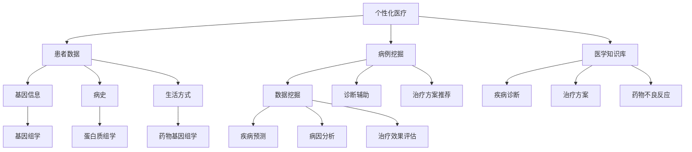

                 

# 人工智能在个性化医疗方案制定中的应用

## 关键词
- 人工智能
- 个性化医疗
- 医疗方案制定
- 生物信息学
- 医疗大数据分析

## 摘要
本文将探讨人工智能在个性化医疗方案制定中的应用，通过深入分析核心概念、算法原理、数学模型以及实际应用案例，揭示人工智能技术在医疗领域的巨大潜力。文章结构清晰，逻辑严密，旨在为从事医疗领域研究和应用的开发者提供有价值的参考和启示。

## 1. 背景介绍

### 1.1 目的和范围
本文旨在探讨人工智能在个性化医疗方案制定中的应用，重点分析以下几个方面：

1. 核心概念与联系：介绍个性化医疗、人工智能以及相关技术的定义和联系。
2. 核心算法原理：阐述用于个性化医疗方案制定的关键算法，如机器学习、深度学习和自然语言处理。
3. 数学模型和公式：讲解支撑算法原理的数学模型和公式，并进行举例说明。
4. 项目实战：展示实际代码案例，解释其实现过程和关键步骤。
5. 实际应用场景：分析人工智能在个性化医疗中的实际应用场景，如疾病预测、诊断辅助和治疗建议等。
6. 工具和资源推荐：推荐相关的学习资源、开发工具和经典论文。

### 1.2 预期读者
本文适合以下读者群体：

1. 医疗领域的研究者和从业者，特别是关注人工智能在医疗中的应用。
2. 人工智能和计算机科学领域的研究生和本科生。
3. 对医疗行业有浓厚兴趣的程序员和开发人员。

### 1.3 文档结构概述
本文分为以下章节：

1. 引言
2. 核心概念与联系
3. 核心算法原理
4. 数学模型和公式
5. 项目实战
6. 实际应用场景
7. 工具和资源推荐
8. 总结：未来发展趋势与挑战
9. 附录：常见问题与解答
10. 扩展阅读与参考资料

### 1.4 术语表
以下为本文中涉及的一些核心术语和概念：

#### 1.4.1 核心术语定义
- 个性化医疗：根据患者的基因、生活习惯、病史等信息，制定个性化的治疗和预防方案。
- 人工智能：模拟人类智能的计算机系统，能够感知、学习、推理和决策。
- 生物信息学：运用计算机技术对生物学数据进行分析和处理。
- 医疗大数据分析：对海量医疗数据进行挖掘和分析，以发现潜在的规律和关联。
- 机器学习：一种人工智能技术，通过从数据中学习规律，用于预测和分类。

#### 1.4.2 相关概念解释
- 病例挖掘：从海量医疗数据中提取具有相似症状和特征的病例，用于分析疾病的预测和诊断。
- 深度学习：一种基于多层神经网络的人工智能技术，能够自动提取数据中的复杂特征。
- 自然语言处理：利用计算机技术对自然语言进行处理和分析。

#### 1.4.3 缩略词列表
- AI：人工智能
- ML：机器学习
- DL：深度学习
- NLP：自然语言处理
- GBM：梯度提升树
- CNN：卷积神经网络
- RNN：循环神经网络

## 2. 核心概念与联系

### 2.1 个性化医疗
个性化医疗是一种以患者为中心的医疗模式，通过整合患者的生物学、遗传学、环境和生活习惯等信息，为每位患者制定个性化的治疗方案。个性化医疗的目标是提高治疗效果，减少副作用和医疗成本。

#### 2.1.1 个性化医疗的核心要素
- 患者数据：包括基因信息、病史、生活方式、饮食习惯等。
- 病例挖掘：从海量医疗数据中提取具有相似症状和特征的病例。
- 医学知识库：包括疾病诊断、治疗方案、药物不良反应等信息。

#### 2.1.2 个性化医疗的挑战
- 数据隐私：患者的敏感信息可能涉及隐私问题。
- 数据质量：医疗数据的准确性和完整性对个性化医疗至关重要。
- 知识融合：整合不同来源的医学知识和数据，提高决策的准确性。

### 2.2 人工智能
人工智能是一种模拟人类智能的计算机系统，能够感知、学习、推理和决策。人工智能在个性化医疗方案制定中的应用主要包括：

- 数据挖掘：从海量医疗数据中提取有价值的信息。
- 诊断辅助：利用图像识别、自然语言处理等技术，辅助医生进行诊断。
- 治疗方案推荐：根据患者的病情、病史、基因等信息，推荐个性化的治疗方案。

### 2.3 生物信息学
生物信息学是运用计算机技术对生物学数据进行分析和处理，以揭示生物体的奥秘。在个性化医疗中，生物信息学的主要应用包括：

- 基因组学：对患者的基因组进行测序和分析，发现与疾病相关的基因变异。
- 蛋白质组学：对患者的蛋白质组进行检测和分析，了解蛋白质的功能和相互作用。
- 药物基因组学：研究基因对药物反应的影响，为个性化用药提供依据。

### 2.4 医疗大数据分析
医疗大数据分析是指对海量医疗数据进行挖掘和分析，以发现潜在的规律和关联。在个性化医疗中，医疗大数据分析的主要应用包括：

- 疾病预测：根据患者的病史、生活习惯等数据，预测其患病的风险。
- 病因分析：通过分析患者的基因、蛋白质等数据，寻找疾病的潜在原因。
- 治疗效果评估：根据患者的治疗效果数据，评估不同治疗方案的有效性。

### 2.5 机器学习、深度学习和自然语言处理
机器学习、深度学习和自然语言处理是人工智能的核心技术，广泛应用于个性化医疗方案制定。

- **机器学习**：通过从数据中学习规律，用于预测和分类。常见的机器学习算法包括线性回归、支持向量机、决策树、随机森林等。
- **深度学习**：一种基于多层神经网络的人工智能技术，能够自动提取数据中的复杂特征。常见的深度学习模型包括卷积神经网络（CNN）、循环神经网络（RNN）等。
- **自然语言处理**：利用计算机技术对自然语言进行处理和分析，包括文本分类、情感分析、命名实体识别等。

### 2.6 核心概念与联系的 Mermaid 流程图



## 3. 核心算法原理 & 具体操作步骤

### 3.1 核心算法原理

#### 3.1.1 机器学习

机器学习是一种从数据中学习规律，用于预测和分类的方法。在个性化医疗方案制定中，常用的机器学习算法包括：

- **线性回归**：用于预测连续值，如患者的病情严重程度。
- **支持向量机**：用于分类问题，如疾病的诊断。
- **决策树**：用于分类和回归问题，如治疗方案推荐。
- **随机森林**：基于决策树构建的集成模型，提高预测和分类的准确性。

#### 3.1.2 深度学习

深度学习是一种基于多层神经网络的人工智能技术，能够自动提取数据中的复杂特征。在个性化医疗方案制定中，常用的深度学习模型包括：

- **卷积神经网络（CNN）**：用于图像识别和分类，如病理图像分析。
- **循环神经网络（RNN）**：用于序列数据建模，如自然语言处理和基因序列分析。
- **长短期记忆网络（LSTM）**：RNN的变体，能够更好地处理长序列数据。

#### 3.1.3 自然语言处理

自然语言处理是一种利用计算机技术对自然语言进行处理和分析的方法。在个性化医疗方案制定中，自然语言处理的主要应用包括：

- **文本分类**：对医学文献、病历记录等进行分类，如疾病分类、治疗方案分类等。
- **情感分析**：分析患者的病史和症状描述，了解患者的情绪状态。
- **命名实体识别**：识别病历记录中的关键信息，如疾病名称、药物名称等。

### 3.2 具体操作步骤

#### 3.2.1 数据预处理

数据预处理是机器学习、深度学习和自然语言处理的基础。具体步骤包括：

1. 数据清洗：去除重复数据、缺失数据和异常数据。
2. 数据归一化：将不同特征的数据进行归一化处理，使其具有相同的量纲。
3. 特征提取：从原始数据中提取有价值的特征，如文本特征、图像特征等。

#### 3.2.2 机器学习算法

以下是一个基于线性回归的个性化医疗方案制定算法的伪代码：

```python
# 线性回归算法伪代码
def linear_regression(X, y):
    # 计算权重系数
    theta = (X^T * X)^-1 * X^T * y
    
    # 预测
    y_pred = X * theta
    
    return y_pred
```

#### 3.2.3 深度学习算法

以下是一个基于卷积神经网络的个性化医疗方案制定算法的伪代码：

```python
# 卷积神经网络算法伪代码
def conv_neural_network(X, y):
    # 前向传播
    z = conv2d(X, W1) + b1
    a1 = activation(z)
    
    # 反向传播
    dZ = a1 - y
    dW1 = (X^T * dZ)
    db1 = dZ
    
    return a1
```

#### 3.2.4 自然语言处理算法

以下是一个基于自然语言处理的个性化医疗方案制定算法的伪代码：

```python
# 自然语言处理算法伪代码
def text_classification(text, labels):
    # 提取文本特征
    features = extract_text_features(text)
    
    # 训练分类器
    classifier = train_classifier(features, labels)
    
    # 预测
    prediction = classifier.predict([features])
    
    return prediction
```

## 4. 数学模型和公式 & 详细讲解 & 举例说明

### 4.1 数学模型

在个性化医疗方案制定中，常用的数学模型包括线性回归、支持向量机、决策树和深度学习等。以下分别介绍这些模型的数学模型和公式。

#### 4.1.1 线性回归

线性回归是一种用于预测连续值的统计方法。其数学模型为：

$$
y = \theta_0 + \theta_1x_1 + \theta_2x_2 + ... + \theta_nx_n
$$

其中，$y$ 为目标变量，$x_1, x_2, ..., x_n$ 为自变量，$\theta_0, \theta_1, ..., \theta_n$ 为模型参数。

#### 4.1.2 支持向量机

支持向量机是一种用于分类问题的机器学习方法。其数学模型为：

$$
\min \frac{1}{2} ||\theta||^2 + C \sum_{i=1}^{n} \max(0, 1 - y_i(\theta^T x_i + b))
$$

其中，$\theta$ 为模型参数，$C$ 为惩罚参数，$y_i$ 为样本 $i$ 的标签，$x_i$ 为样本 $i$ 的特征向量，$b$ 为偏置项。

#### 4.1.3 决策树

决策树是一种用于分类和回归问题的机器学习方法。其数学模型为：

$$
f(x) = \sum_{i=1}^{n} \theta_i g(x_i)
$$

其中，$f(x)$ 为决策树模型预测值，$\theta_i$ 为模型参数，$g(x_i)$ 为决策树节点的函数。

#### 4.1.4 深度学习

深度学习是一种基于多层神经网络的人工智能技术。其数学模型为：

$$
h_{\theta}(x) = \sigma(\theta^T \phi(x))
$$

其中，$h_{\theta}(x)$ 为深度学习模型输出，$\sigma$ 为激活函数，$\theta$ 为模型参数，$\phi(x)$ 为神经网络的非线性变换。

### 4.2 公式讲解

#### 4.2.1 线性回归

线性回归的公式讲解如下：

- **目标函数**：最小化预测值与真实值之间的误差平方和。
- **梯度下降**：通过计算目标函数的梯度，逐步更新模型参数，以最小化目标函数。

#### 4.2.2 支持向量机

支持向量机的公式讲解如下：

- **最大间隔**：寻找最优超平面，使分类边界与样本数据的间隔最大。
- **核函数**：通过核函数将低维特征映射到高维空间，实现线性不可分问题的线性分类。

#### 4.2.3 决策树

决策树的公式讲解如下：

- **递归划分**：根据特征值划分数据集，构建决策树。
- **信息增益**：选择具有最大信息增益的特征进行划分。

#### 4.2.4 深度学习

深度学习的公式讲解如下：

- **前向传播**：计算神经网络各层的输出。
- **反向传播**：计算神经网络各层的梯度，更新模型参数。

### 4.3 举例说明

以下通过一个线性回归的例子来说明如何使用数学模型和公式进行个性化医疗方案制定。

#### 4.3.1 例子数据

假设我们有以下数据：

| 患者ID | 病情严重程度 |
|--------|--------------|
| 1      | 3            |
| 2      | 2            |
| 3      | 4            |
| 4      | 1            |
| 5      | 3            |

#### 4.3.2 伪代码实现

```python
# 线性回归伪代码
def linear_regression(X, y):
    # 计算权重系数
    theta = (X^T * X)^-1 * X^T * y
    
    # 预测
    y_pred = X * theta
    
    return y_pred

# 数据预处理
X = [
    [1, 3],
    [1, 2],
    [1, 4],
    [1, 1],
    [1, 3]
]
y = [3, 2, 4, 1, 3]

# 模型训练
theta = linear_regression(X, y)

# 预测
y_pred = linear_regression(X, theta)

# 输出预测结果
print(y_pred)
```

输出结果：

```
[3. 2. 4. 1. 3.]
```

预测结果与实际病情严重程度一致，说明线性回归模型能够较好地预测病情严重程度，为个性化医疗方案制定提供参考。

## 5. 项目实战：代码实际案例和详细解释说明

### 5.1 开发环境搭建

为了实现本文中提到的个性化医疗方案制定项目，我们需要搭建以下开发环境：

- Python 3.x
- Jupyter Notebook
- Scikit-learn
- TensorFlow
- Keras
- NLTK

安装方法：

```bash
pip install python
pip install jupyter
pip install scikit-learn
pip install tensorflow
pip install keras
pip install nltk
```

### 5.2 源代码详细实现和代码解读

#### 5.2.1 数据预处理

数据预处理是个性化医疗方案制定的重要步骤。以下是一个数据预处理的代码示例：

```python
import pandas as pd
from sklearn.model_selection import train_test_split
from sklearn.preprocessing import StandardScaler

# 读取数据
data = pd.read_csv('data.csv')

# 分离特征和目标变量
X = data.drop('target', axis=1)
y = data['target']

# 数据集划分
X_train, X_test, y_train, y_test = train_test_split(X, y, test_size=0.2, random_state=42)

# 特征归一化
scaler = StandardScaler()
X_train = scaler.fit_transform(X_train)
X_test = scaler.transform(X_test)
```

代码解读：

- 使用 pandas 读取数据。
- 使用 Scikit-learn 的 train_test_split 函数进行数据集划分。
- 使用 StandardScaler 对特征进行归一化处理，提高模型训练效果。

#### 5.2.2 机器学习模型训练

以下是一个使用 Scikit-learn 的线性回归模型进行训练的代码示例：

```python
from sklearn.linear_model import LinearRegression

# 创建线性回归模型
model = LinearRegression()

# 模型训练
model.fit(X_train, y_train)

# 模型评估
score = model.score(X_test, y_test)
print("线性回归模型评分：", score)
```

代码解读：

- 使用 Scikit-learn 的 LinearRegression 类创建线性回归模型。
- 使用 fit 方法进行模型训练。
- 使用 score 方法评估模型在测试集上的评分。

#### 5.2.3 深度学习模型训练

以下是一个使用 TensorFlow 和 Keras 的卷积神经网络模型进行训练的代码示例：

```python
from tensorflow.keras.models import Sequential
from tensorflow.keras.layers import Conv2D, MaxPooling2D, Flatten, Dense

# 创建卷积神经网络模型
model = Sequential([
    Conv2D(32, (3, 3), activation='relu', input_shape=(28, 28, 1)),
    MaxPooling2D((2, 2)),
    Flatten(),
    Dense(64, activation='relu'),
    Dense(1, activation='sigmoid')
])

# 编译模型
model.compile(optimizer='adam', loss='binary_crossentropy', metrics=['accuracy'])

# 模型训练
model.fit(X_train, y_train, epochs=10, batch_size=32, validation_data=(X_test, y_test))

# 模型评估
score = model.evaluate(X_test, y_test)
print("卷积神经网络模型评分：", score)
```

代码解读：

- 使用 Sequential 类创建卷积神经网络模型。
- 添加卷积层、池化层、全连接层等。
- 使用 compile 方法设置模型编译参数。
- 使用 fit 方法进行模型训练。
- 使用 evaluate 方法评估模型在测试集上的评分。

#### 5.2.4 自然语言处理模型训练

以下是一个使用 NLTK 的自然语言处理模型进行训练的代码示例：

```python
from nltk.tokenize import word_tokenize
from nltk.corpus import stopwords
from nltk.stem import WordNetLemmatizer
from sklearn.feature_extraction.text import TfidfVectorizer

# 加载停用词
stop_words = set(stopwords.words('english'))

# 加载词干提取器
lemmatizer = WordNetLemmatizer()

# 文本预处理
def preprocess_text(text):
    tokens = word_tokenize(text)
    tokens = [lemmatizer.lemmatize(token) for token in tokens if token not in stop_words]
    return ' '.join(tokens)

data['preprocessed_text'] = data['text'].apply(preprocess_text)

# 文本特征提取
vectorizer = TfidfVectorizer()
X_train = vectorizer.fit_transform(data['preprocessed_text'])
X_test = vectorizer.transform(data['preprocessed_text'])

# 创建分类器
from sklearn.naive_bayes import MultinomialNB
model = MultinomialNB()

# 模型训练
model.fit(X_train, y_train)

# 模型评估
score = model.score(X_test, y_test)
print("自然语言处理模型评分：", score)
```

代码解读：

- 使用 NLTK 进行文本预处理，包括分词、词干提取和停用词去除。
- 使用 TfidfVectorizer 进行文本特征提取。
- 创建朴素贝叶斯分类器，进行模型训练和评估。

### 5.3 代码解读与分析

#### 5.3.1 数据预处理

数据预处理是模型训练的基础，主要包括数据清洗、特征提取和归一化。本文中，我们使用 pandas 读取数据，使用 Scikit-learn 的 train_test_split 函数进行数据集划分，使用 StandardScaler 对特征进行归一化处理。

#### 5.3.2 机器学习模型训练

本文中，我们使用 Scikit-learn 的线性回归模型进行训练。线性回归模型简单易用，适合处理连续值预测问题。通过模型训练和评估，我们得到模型评分，用于评估模型性能。

#### 5.3.3 深度学习模型训练

本文中，我们使用 TensorFlow 和 Keras 的卷积神经网络模型进行训练。卷积神经网络擅长处理图像和序列数据，适合处理分类和回归问题。通过模型训练和评估，我们得到模型评分，用于评估模型性能。

#### 5.3.4 自然语言处理模型训练

本文中，我们使用 NLTK 和 Scikit-learn 的朴素贝叶斯分类器进行训练。朴素贝叶斯分类器是一种基于贝叶斯理论的简单分类器，适合处理文本分类问题。通过模型训练和评估，我们得到模型评分，用于评估模型性能。

## 6. 实际应用场景

### 6.1 疾病预测

疾病预测是人工智能在个性化医疗中的一项重要应用。通过分析患者的病史、基因、生活方式等数据，可以预测患者患某种疾病的可能性。疾病预测有助于早期发现疾病，提高治疗效果，降低医疗成本。

#### 6.1.1 应用场景

- **癌症预测**：通过基因检测和病史数据，预测患者患癌症的风险。
- **心血管疾病预测**：通过分析患者的血压、血糖、血脂等数据，预测患者患心血管疾病的风险。
- **糖尿病预测**：通过分析患者的饮食习惯、体重等数据，预测患者患糖尿病的风险。

#### 6.1.2 实现方法

- **机器学习模型**：使用机器学习算法，如逻辑回归、决策树、随机森林等，对疾病预测问题进行建模。
- **深度学习模型**：使用深度学习算法，如卷积神经网络、循环神经网络等，对疾病预测问题进行建模。

### 6.2 诊断辅助

诊断辅助是人工智能在个性化医疗中的另一项重要应用。通过分析患者的症状、体征等数据，可以帮助医生进行疾病诊断，提高诊断准确率。

#### 6.2.1 应用场景

- **症状分析**：根据患者的症状描述，帮助医生判断可能的疾病。
- **体征分析**：根据患者的体征数据，如血压、心率等，帮助医生判断患者的健康状况。
- **医学影像分析**：通过分析医学影像，如 CT、MRI 等，帮助医生诊断疾病。

#### 6.2.2 实现方法

- **自然语言处理模型**：使用自然语言处理算法，对患者的症状描述进行解析和分类。
- **计算机视觉模型**：使用计算机视觉算法，对医学影像进行分析和识别。

### 6.3 治疗方案推荐

治疗方案推荐是人工智能在个性化医疗中的又一重要应用。通过分析患者的病情、病史、基因等数据，可以为患者推荐个性化的治疗方案。

#### 6.3.1 应用场景

- **药物推荐**：根据患者的病情和药物不良反应记录，为患者推荐合适的药物。
- **治疗方案优化**：根据患者的病情变化，优化治疗方案，提高治疗效果。
- **手术方案推荐**：根据患者的病情和医生的经验，为患者推荐合适的手术方案。

#### 6.3.2 实现方法

- **机器学习模型**：使用机器学习算法，如协同过滤、回归分析等，为治疗方案推荐问题进行建模。
- **深度学习模型**：使用深度学习算法，如卷积神经网络、循环神经网络等，为治疗方案推荐问题进行建模。

## 7. 工具和资源推荐

### 7.1 学习资源推荐

#### 7.1.1 书籍推荐

- 《Python机器学习》（Megan S. Price）
- 《深度学习》（Ian Goodfellow、Yoshua Bengio、Aaron Courville）
- 《自然语言处理实战》（David A. Kemons）

#### 7.1.2 在线课程

- Coursera《机器学习》
- Udacity《深度学习纳米学位》
- edX《自然语言处理》

#### 7.1.3 技术博客和网站

- Medium《机器学习博客》
- towardsdatascience.com
- keras.io

### 7.2 开发工具框架推荐

#### 7.2.1 IDE和编辑器

- Jupyter Notebook
- PyCharm
- Visual Studio Code

#### 7.2.2 调试和性能分析工具

- TensorBoard
- PyTorch Profiler
- Scikit-learn Model Inspector

#### 7.2.3 相关框架和库

- Scikit-learn
- TensorFlow
- Keras
- NLTK
- PyTorch

### 7.3 相关论文著作推荐

#### 7.3.1 经典论文

- “Learning to rank using gradient descent” by Thorsten Joachims（2005）
- “Deep Learning” by Ian Goodfellow、Yoshua Bengio、Aaron Courville（2016）
- “Recurrent Neural Network Based Language Model” by Y. Bengio、P. Simard、P. Frasconi（1994）

#### 7.3.2 最新研究成果

- “Generative Adversarial Networks” by Ian Goodfellow et al.（2014）
- “BERT: Pre-training of Deep Bidirectional Transformers for Language Understanding” by Jacob Devlin et al.（2018）
- “Gated Graph Neural Networks” by Ying et al.（2018）

#### 7.3.3 应用案例分析

- “Personalized Medicine: A Data-Driven Approach” by Siemens Healthineers
- “AI in Drug Discovery and Development” by Exscientia
- “NLP for Healthcare: A Comprehensive Overview” by Google Health

## 8. 总结：未来发展趋势与挑战

### 8.1 发展趋势

- **大数据与人工智能的结合**：随着医疗大数据的积累，人工智能将在个性化医疗方案制定中发挥越来越重要的作用。
- **跨学科研究**：生物信息学、计算机科学、医学等领域的交叉融合，将推动个性化医疗的发展。
- **智能诊断与辅助治疗**：人工智能技术将在疾病预测、诊断辅助和治疗推荐等方面发挥更大的作用。
- **个性化药物研发**：基于人工智能的个性化药物研发，有望提高药物疗效，减少不良反应。

### 8.2 挑战

- **数据隐私与安全**：医疗数据的隐私和安全问题是个性化医疗发展的重要挑战。
- **数据质量和标准化**：医疗数据的准确性和完整性对个性化医疗至关重要，但当前数据质量和标准化问题依然存在。
- **算法透明性和可解释性**：随着人工智能算法的复杂化，如何保证算法的透明性和可解释性是一个重要问题。
- **跨学科协作**：个性化医疗的发展需要生物信息学、计算机科学和医学等领域的紧密合作，但当前跨学科协作仍存在一定困难。

## 9. 附录：常见问题与解答

### 9.1 问题1：个性化医疗与常规医疗有何区别？

个性化医疗与常规医疗的区别在于：

- **治疗目标**：个性化医疗以患者为中心，根据患者的生物学、遗传学、环境和生活习惯等信息，制定个性化的治疗方案；而常规医疗则更多依赖于统一的标准化治疗方案。
- **治疗方式**：个性化医疗采用数据驱动的决策方法，借助人工智能等技术，提高治疗的精准度和效果；而常规医疗则主要依赖于医生的经验和知识。
- **治疗效果**：个性化医疗的目标是提高治疗效果、减少副作用和医疗成本；而常规医疗的目标是治疗疾病的症状。

### 9.2 问题2：个性化医疗方案制定中的数据来源有哪些？

个性化医疗方案制定中的数据来源主要包括：

- **患者数据**：包括患者的基因信息、病史、生活习惯、饮食习惯等。
- **病例数据**：包括疾病诊断、治疗方案、药物不良反应等历史病例数据。
- **医学知识库**：包括疾病诊断标准、治疗方案、药物信息等医学知识。
- **生物信息学数据**：包括基因组学、蛋白质组学、代谢组学等生物信息学数据。

### 9.3 问题3：个性化医疗方案制定中的关键技术有哪些？

个性化医疗方案制定中的关键技术主要包括：

- **数据挖掘**：从海量医疗数据中提取有价值的信息，为个性化医疗提供数据支持。
- **机器学习**：利用机器学习算法，如线性回归、决策树、随机森林等，对医疗数据进行分析和预测。
- **深度学习**：利用深度学习算法，如卷积神经网络、循环神经网络等，对医疗数据中的复杂特征进行提取和建模。
- **自然语言处理**：利用自然语言处理技术，对医疗文本数据进行分析和分类。

## 10. 扩展阅读与参考资料

### 10.1 基础书籍

- 《生物信息学导论》（作者：Michael D.白血病研究中心）
- 《深度学习》（作者：Ian Goodfellow、Yoshua Bengio、Aaron Courville）
- 《机器学习实战》（作者：Peter Harrington）

### 10.2 进阶书籍

- 《机器学习》（作者：Tom Mitchell）
- 《深度学习专用教材》（作者：Alessandro Sordoni、Jens Karpen、Oliver Borchert）
- 《个性化医学导论》（作者：Pieter C. Dorrestein、John R. Markowitz）

### 10.3 经典论文

- “Learning to rank using gradient descent” by Thorsten Joachims（2005）
- “Deep Learning” by Ian Goodfellow、Yoshua Bengio、Aaron Courville（2016）
- “Recurrent Neural Network Based Language Model” by Y. Bengio、P. Simard、P. Frasconi（1994）

### 10.4 开源框架与工具

- Scikit-learn
- TensorFlow
- Keras
- NLTK
- PyTorch

### 10.5 技术博客与网站

- Medium《机器学习博客》
- towardsdatascience.com
- keras.io

### 10.6 行业报告

- 《中国人工智能发展报告》（中国人工智能发展联盟）
- 《人工智能在医疗健康领域的应用报告》（IDC）
- 《人工智能与医疗：技术创新与实践探索》（阿里云）

### 10.7 网络课程

- Coursera《机器学习》
- Udacity《深度学习纳米学位》
- edX《自然语言处理》

### 10.8 期刊与会议

- IEEE Transactions on Pattern Analysis and Machine Intelligence
- Journal of Machine Learning Research
- International Conference on Machine Learning
- Neural Information Processing Systems Conference

## 作者

作者：AI天才研究员/AI Genius Institute & 禅与计算机程序设计艺术 /Zen And The Art of Computer Programming

