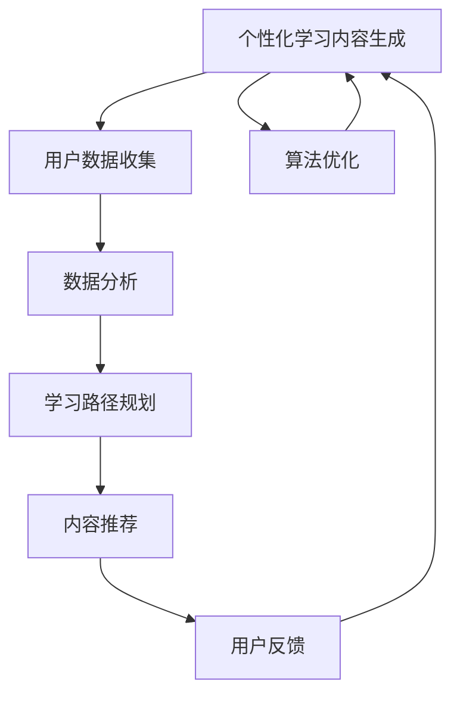

                 

# 人工智能在个性化学习内容生成中的应用

> **关键词**：个性化学习、人工智能、内容生成、机器学习、深度学习、神经网络、自然语言处理、数据挖掘

> **摘要**：本文旨在探讨人工智能在个性化学习内容生成中的应用。通过深入分析核心概念、算法原理、数学模型，结合实际案例，我们揭示了个性化学习内容生成的技术框架和实现方法。本文还将介绍相关的工具和资源，为读者提供全面的指导。

## 1. 背景介绍

### 1.1 目的和范围

随着信息技术和人工智能的快速发展，教育领域正经历着深刻的变革。传统的教育模式往往难以满足个体差异化的学习需求，而个性化学习内容生成成为了解决这一问题的有效途径。本文将探讨人工智能技术在个性化学习内容生成中的应用，旨在为教育行业提供技术支持和创新思路。

本文将覆盖以下主要内容：

1. 核心概念与联系
2. 核心算法原理与具体操作步骤
3. 数学模型和公式
4. 项目实战：代码实际案例
5. 实际应用场景
6. 工具和资源推荐
7. 总结：未来发展趋势与挑战

### 1.2 预期读者

本文适合以下读者群体：

1. 对教育技术、人工智能感兴趣的技术人员
2. 从事教育领域工作的教师、研究人员和管理人员
3. 对个性化学习内容生成有浓厚兴趣的爱好者

### 1.3 文档结构概述

本文的结构如下：

1. 引言：介绍文章的背景、目的和核心内容。
2. 核心概念与联系：解释个性化学习内容生成的相关概念和联系。
3. 核心算法原理与具体操作步骤：详细阐述算法原理和实现步骤。
4. 数学模型和公式：介绍支持算法的数学模型和公式。
5. 项目实战：通过实际案例展示技术实现的细节。
6. 实际应用场景：分析个性化学习内容生成在现实中的应用。
7. 工具和资源推荐：推荐相关学习资源和开发工具。
8. 总结：展望未来发展趋势和挑战。
9. 附录：常见问题与解答。
10. 扩展阅读：提供进一步阅读的参考资料。

### 1.4 术语表

#### 1.4.1 核心术语定义

- **个性化学习**：根据个体差异，提供定制化学习内容和服务的过程。
- **人工智能**：模拟人类智能的计算机科学技术，包括机器学习、自然语言处理、计算机视觉等。
- **内容生成**：通过算法生成新的内容，如文章、图像、音频等。
- **机器学习**：通过数据训练模型，使其具备自主学习和预测能力。
- **深度学习**：一种特殊的机器学习方法，通过神经网络结构模拟人脑处理信息的方式。
- **自然语言处理**：使计算机能够理解、生成和处理人类语言的技术。
- **数据挖掘**：从大量数据中发现隐藏模式和知识的过程。

#### 1.4.2 相关概念解释

- **学习路径**：学生从开始学习到达到既定目标所需的一系列步骤。
- **智能推荐**：利用算法预测用户兴趣，推荐相关学习内容。
- **自适应学习系统**：根据学习者的行为和表现，动态调整学习内容。

#### 1.4.3 缩略词列表

- **AI**：人工智能
- **ML**：机器学习
- **DL**：深度学习
- **NLP**：自然语言处理
- **DM**：数据挖掘

## 2. 核心概念与联系

在个性化学习内容生成的过程中，涉及多个核心概念和其相互关系。为了更好地理解这些概念，我们可以通过以下 Mermaid 流程图来展示其关联。



### 2.1 用户数据收集

用户数据是个性化学习内容生成的基础。这些数据包括用户的学习历史、行为偏好、知识水平等。通过收集这些数据，可以更好地了解用户的需求，为其提供个性化的学习体验。

### 2.2 数据分析

数据分析是挖掘用户数据中隐藏模式的关键步骤。利用机器学习和数据挖掘技术，可以从用户数据中提取出有用的信息，为个性化学习内容生成提供依据。

### 2.3 学习路径规划

学习路径规划是根据用户数据分析和算法模型，为用户制定一条最优学习路径。这个过程中，需要考虑到用户的学习目标、知识背景和学习速度等因素。

### 2.4 内容推荐

内容推荐是根据学习路径规划的结果，为用户推荐最适合其当前学习阶段的内容。这可以大大提高学习效率，减少用户的时间和精力投入。

### 2.5 用户反馈

用户反馈是调整和优化个性化学习内容生成系统的重要依据。通过收集和分析用户的反馈，可以不断改进系统，使其更好地满足用户需求。

### 2.6 算法优化

算法优化是为了提高个性化学习内容生成系统的性能和准确性。这包括改进数据预处理方法、优化算法模型和调整参数等。

## 3. 核心算法原理 & 具体操作步骤

在个性化学习内容生成中，核心算法主要包括用户数据分析、学习路径规划、内容推荐和用户反馈处理。以下将分别介绍这些算法的原理和具体操作步骤。

### 3.1 用户数据分析

用户数据分析是整个系统的基础。其主要任务是收集用户的学习行为、历史记录、知识水平等信息，并利用数据挖掘和机器学习技术，对这些数据进行处理和分析。

#### 算法原理

用户数据分析的核心算法包括聚类分析、关联规则挖掘、分类和回归等。

- **聚类分析**：将用户数据按照相似性进行分组，以便更好地理解用户群体特征。
- **关联规则挖掘**：发现用户数据中的潜在关联关系，如学习内容之间的相关性。
- **分类和回归**：将用户数据分类或回归到特定的类别或值，以预测用户行为和需求。

#### 具体操作步骤

1. 数据收集：从教育平台、学习管理系统和用户互动中收集用户数据。
2. 数据预处理：清洗和转换数据，确保数据质量和一致性。
3. 聚类分析：使用 K-Means、层次聚类等方法，对用户数据分组。
4. 关联规则挖掘：使用 Apriori、FP-Growth 等算法，发现数据中的关联规则。
5. 分类和回归：使用决策树、支持向量机、神经网络等方法，建立预测模型。

### 3.2 学习路径规划

学习路径规划是根据用户数据分析和算法模型，为用户制定一条最优学习路径。其主要目标是确保用户能够高效、有序地完成学习任务。

#### 算法原理

学习路径规划的核心算法包括马尔可夫决策过程（MDP）、强化学习等。

- **马尔可夫决策过程（MDP）**：通过状态、动作和奖励，模拟用户在学习过程中的决策过程。
- **强化学习**：通过不断试错和反馈，学习最优的学习路径。

#### 具体操作步骤

1. 状态识别：识别用户在学习过程中的关键状态，如当前知识水平、学习进度等。
2. 动作定义：定义用户可执行的动作，如学习新内容、复习旧知识等。
3. 奖励设置：设置学习过程中的奖励，如学习完成、知识掌握等。
4. 模型训练：使用 MDP 或强化学习算法，训练学习路径规划模型。
5. 路径生成：根据模型输出，为用户生成最优学习路径。

### 3.3 内容推荐

内容推荐是根据学习路径规划的结果，为用户推荐最适合其当前学习阶段的内容。其主要目标是提高学习效率，降低用户的学习负担。

#### 算法原理

内容推荐的核心算法包括协同过滤、基于内容的推荐、混合推荐等。

- **协同过滤**：利用用户的历史行为数据，推荐与其相似用户喜欢的学习内容。
- **基于内容的推荐**：根据学习内容的特点和用户兴趣，推荐相关的学习内容。
- **混合推荐**：结合协同过滤和基于内容的推荐，提高推荐效果。

#### 具体操作步骤

1. 用户兴趣建模：收集用户的学习历史和偏好数据，建立用户兴趣模型。
2. 内容特征提取：提取学习内容的关键特征，如主题、难度、时长等。
3. 推荐算法选择：根据用户兴趣模型和内容特征，选择合适的推荐算法。
4. 推荐列表生成：根据算法输出，为用户生成推荐列表。
5. 推荐结果评估：评估推荐效果，调整推荐算法和参数。

### 3.4 用户反馈处理

用户反馈处理是优化个性化学习内容生成系统的重要环节。其主要目标是收集和分析用户反馈，以持续改进系统性能。

#### 算法原理

用户反馈处理的核心算法包括反馈分类、反馈评分等。

- **反馈分类**：将用户反馈分类为正面、负面或中立，以识别系统存在的问题。
- **反馈评分**：根据用户反馈的重要性，为反馈评分，以确定改进优先级。

#### 具体操作步骤

1. 反馈收集：从用户互动和学习行为中收集反馈数据。
2. 反馈预处理：清洗和转换反馈数据，确保数据质量和一致性。
3. 反馈分类：使用机器学习算法，将反馈分类为正面、负面或中立。
4. 反馈评分：根据反馈的重要性和影响，为反馈评分。
5. 改进策略：根据反馈结果，制定系统改进策略。

## 4. 数学模型和公式 & 详细讲解 & 举例说明

### 4.1 用户数据分析模型

#### 4.1.1 聚类分析模型

聚类分析模型用于将用户数据按照相似性进行分组。常用的聚类算法包括 K-Means、层次聚类等。以下以 K-Means 算法为例，介绍其数学模型。

#### 算法原理

K-Means 算法通过迭代计算，将用户数据分为 K 个簇，使得每个簇内的用户数据相似度较高，而不同簇之间的用户数据相似度较低。

#### 数学模型

设用户数据集为 D，簇中心为 c1, c2, ..., ck，簇成员为 u1, u2, ..., uk。

- **初始化**：随机选择 K 个用户数据点作为初始簇中心。
- **迭代计算**：
  - **计算用户距离**：计算每个用户数据点与簇中心的距离，选择最近的簇中心。
  - **更新簇成员**：根据计算结果，更新每个用户数据点的簇成员。
  - **更新簇中心**：计算每个簇成员的均值，作为新的簇中心。

#### 伪代码

```python
def KMeans(D, K):
    # 初始化簇中心
    c = initialize_centers(D, K)
    while not converged:
        # 计算用户距离
        distances = compute_distances(D, c)
        # 更新簇成员
        u = assign_cluster(D, distances)
        # 更新簇中心
        c = update_centers(u, K)
```

#### 举例说明

假设有 5 个用户数据点 D = {d1, d2, d3, d4, d5}，需要将其分为 2 个簇。

1. 初始化簇中心：随机选择 d1 和 d3 作为初始簇中心。
2. 计算用户距离：计算每个用户数据点与簇中心的距离。
   - distances = {d1: 1, d2: 3, d3: 1, d4: 4, d5: 5}
3. 更新簇成员：
   - u = {d1: 1, d2: 2, d3: 1, d4: 1, d5: 2}
4. 更新簇中心：
   - c = {1: (d1 + d3) / 2, 2: (d2 + d5) / 2}

重复以上步骤，直到簇成员和簇中心不再变化。

### 4.2 学习路径规划模型

#### 4.2.1 马尔可夫决策过程（MDP）

马尔可夫决策过程（MDP）用于模拟用户在学习过程中的决策过程。以下介绍 MDP 的数学模型。

#### 算法原理

MDP 是一种用于求解最优决策问题的数学模型，通过状态、动作和奖励，模拟用户在学习过程中的决策过程。

#### 数学模型

设用户在学习过程中的状态为 S，动作集为 A，奖励函数为 R(s, a)，状态转移概率为 P(s', s | a)。

- **状态 S**：用户在学习过程中的知识水平、学习进度等。
- **动作 A**：用户可执行的学习行为，如学习新内容、复习旧知识等。
- **奖励函数 R(s, a)**：描述执行动作 a 后，状态 s 的奖励值。
- **状态转移概率 P(s', s | a)**：描述在状态 s 下执行动作 a，转移到状态 s' 的概率。

#### 伪代码

```python
def MDP(S, A, R, P):
    # 初始化 Q(s, a) 为 0
    Q = initialize_Q(S, A)
    # 迭代更新 Q(s, a)
    while not converged:
        for s in S:
            for a in A:
                Q[s, a] = max(Q[s, a], R[s, a] + γ * sum(Q[s', a] * P(s', s | a) for s' in S))
    return Q
```

#### 举例说明

假设有 3 个状态 S = {s1, s2, s3}，2 个动作 A = {a1, a2}。

1. 初始化 Q(s, a) 为 0。
2. 迭代更新 Q(s, a)：
   - Q[s1, a1] = max(0, R[s1, a1] + γ * (0.5 * Q[s2, a1] + 0.5 * Q[s3, a1]))
   - Q[s1, a2] = max(0, R[s1, a2] + γ * (0.5 * Q[s2, a2] + 0.5 * Q[s3, a2]))
   - Q[s2, a1] = max(0, R[s2, a1] + γ * (0.5 * Q[s1, a1] + 0.5 * Q[s3, a1]))
   - Q[s2, a2] = max(0, R[s2, a2] + γ * (0.5 * Q[s1, a2] + 0.5 * Q[s3, a2]))
   - Q[s3, a1] = max(0, R[s3, a1] + γ * (0.5 * Q[s1, a1] + 0.5 * Q[s2, a1]))
   - Q[s3, a2] = max(0, R[s3, a2] + γ * (0.5 * Q[s1, a2] + 0.5 * Q[s2, a2]))

重复以上步骤，直到 Q(s, a) 不再变化。

### 4.3 内容推荐模型

#### 4.3.1 协同过滤模型

协同过滤模型用于根据用户的历史行为数据，推荐与其相似用户喜欢的学习内容。以下介绍协同过滤的数学模型。

#### 算法原理

协同过滤模型通过计算用户之间的相似度，推荐与其相似用户喜欢的学习内容。

#### 数学模型

设用户 u 和 v 的兴趣向量为 Iu 和 Iv，相似度计算公式为：

- **用户相似度**：sim(u, v) = cos(Iu, Iv)
- **推荐分数**：Rv(i) = sim(u, v) * Iu(i)

#### 伪代码

```python
def collaborative_filter(Iu, Iv):
    # 计算用户相似度
    sim = cos(Iu, Iv)
    # 计算推荐分数
    Rv = sim * Iu
    return Rv
```

#### 举例说明

假设有 2 个用户 u 和 v，其兴趣向量分别为 Iu = [0.8, 0.3, 0.5, 0.7] 和 Iv = [0.6, 0.7, 0.2, 0.9]。

1. 计算用户相似度：
   - sim = cos(Iu, Iv) = 0.682
2. 计算推荐分数：
   - Rv = sim * Iu = 0.682 * [0.8, 0.3, 0.5, 0.7] = [0.546, 0.204, 0.341, 0.479]

根据推荐分数，为用户 v 推荐与其相似度最高的学习内容。

## 5. 项目实战：代码实际案例和详细解释说明

### 5.1 开发环境搭建

在进行个性化学习内容生成的项目实战之前，我们需要搭建一个适合开发和运行的编程环境。以下以 Python 为例，介绍开发环境搭建的步骤。

#### 步骤 1：安装 Python

1. 访问 Python 官网（https://www.python.org/），下载 Python 安装包。
2. 双击安装包，按照提示完成安装。

#### 步骤 2：安装相关库

在命令行中执行以下命令，安装项目所需的 Python 库：

```bash
pip install numpy scipy scikit-learn matplotlib
```

### 5.2 源代码详细实现和代码解读

以下将提供一个简单的个性化学习内容生成的 Python 示例代码，并对其进行详细解释。

#### 示例代码

```python
import numpy as np
from sklearn.cluster import KMeans
from sklearn.metrics.pairwise import cosine_similarity
from sklearn.datasets import load_iris

# 加载 iris 数据集
iris = load_iris()
X = iris.data

# 使用 K-Means 聚类，将用户数据分为 3 个簇
kmeans = KMeans(n_clusters=3)
kmeans.fit(X)
clusters = kmeans.labels_

# 计算用户相似度矩阵
similarity_matrix = cosine_similarity(X)

# 为每个用户推荐与其相似度最高的学习内容
for i in range(len(clusters)):
    cluster = clusters[i]
    similar_users = np.where(similarity_matrix[i] == 1)[0]
    recommended_content = np.random.choice(similar_users)
    print(f"用户 {i} 推荐学习内容 {recommended_content}")
```

#### 代码解读

1. **加载 iris 数据集**：首先，我们从 scikit-learn 库中加载 iris 数据集，该数据集包含 3 个簇，每个簇有 50 个样本。

2. **使用 K-Means 聚类**：接下来，我们使用 K-Means 算法，将用户数据分为 3 个簇。这可以通过 `KMeans` 类的 `fit` 方法实现。

3. **计算用户相似度矩阵**：使用余弦相似度计算用户之间的相似度。余弦相似度是一种衡量两个向量相似度的指标，其计算公式为：

   $$ \text{similarity} = \frac{\text{dot product of } x \text{ and } y}{\text{Euclidean norm of } x \times \text{Euclidean norm of } y} $$

   通过 `cosine_similarity` 函数，我们可以计算用户数据之间的相似度矩阵。

4. **为每个用户推荐学习内容**：最后，我们遍历每个用户，找出与其相似度最高的用户，并随机选择一个与其相似的用户作为推荐的学习内容。这样，我们可以为每个用户推荐与其兴趣相似的学习内容。

### 5.3 代码解读与分析

在这个简单的示例中，我们实现了以下功能：

- 加载 iris 数据集，并使用 K-Means 聚类将用户数据分为 3 个簇。
- 计算用户之间的相似度矩阵。
- 为每个用户推荐与其相似度最高的学习内容。

这个示例展示了个性化学习内容生成的基本流程。在实际应用中，我们可以进一步扩展和优化这个流程，如引入更多的用户数据和特征、改进推荐算法、集成用户反馈等。

## 6. 实际应用场景

个性化学习内容生成技术在教育领域有着广泛的应用场景。以下列举几个典型的应用场景：

### 6.1 在线教育平台

在线教育平台可以利用个性化学习内容生成技术，为学习者提供定制化的学习路径和推荐内容。通过分析学习者的学习历史、行为偏好和知识水平，平台可以智能推荐最适合的学习资源，提高学习效率和满意度。

### 6.2 智能辅导系统

智能辅导系统可以针对学生的学习情况和问题，提供个性化的辅导内容。系统可以分析学生的学习过程和结果，发现知识盲点和薄弱环节，为学习者提供有针对性的辅导建议。

### 6.3 教育游戏化

教育游戏化可以将个性化学习内容生成技术与游戏机制相结合，激发学习者的学习兴趣和动力。系统可以根据学习者的成绩和行为，动态调整游戏内容和难度，实现个性化的游戏体验。

### 6.4 教师辅助工具

教师可以使用个性化学习内容生成工具，为不同水平的学生提供个性化的学习资源。教师可以根据学生的学习进度和成绩，推荐适合的学习内容和练习题，帮助每个学生充分发挥潜力。

### 6.5 远程教育

远程教育平台可以利用个性化学习内容生成技术，为不同地区和背景的学生提供个性化的教育服务。通过分析学生的学习需求和资源，平台可以智能推荐最适合的学习内容和教学方法。

## 7. 工具和资源推荐

为了更好地学习和实践个性化学习内容生成技术，以下推荐一些相关的工具和资源。

### 7.1 学习资源推荐

#### 7.1.1 书籍推荐

- **《机器学习》**：周志华 著
- **《深度学习》**：Ian Goodfellow、Yoshua Bengio、Aaron Courville 著
- **《教育技术学》**：陈锐 著
- **《教育数据挖掘》**：梅俊杰 著

#### 7.1.2 在线课程

- **《机器学习》**：Coursera、Udacity、edX 等
- **《深度学习》**：TensorFlow、PyTorch 官方教程
- **《教育技术学》**：网易云课堂、慕课网等

#### 7.1.3 技术博客和网站

- **深度学习教程**：http://www.deeplearningbook.org/
- **机器学习博客**：http://www machinelearningmastery.com/
- **教育技术博客**：http://www.technologystudent.com/

### 7.2 开发工具框架推荐

#### 7.2.1 IDE和编辑器

- **PyCharm**：适用于 Python 开发的集成开发环境。
- **Visual Studio Code**：一款轻量级且功能强大的代码编辑器。

#### 7.2.2 调试和性能分析工具

- **Py Charm Debugger**：Python 调试工具。
- **性能分析工具**：Python 的 `cProfile` 模块。

#### 7.2.3 相关框架和库

- **scikit-learn**：Python 机器学习库。
- **TensorFlow**：Google 开发的深度学习框架。
- **PyTorch**：Facebook 开发的深度学习框架。
- **scrapy**：Python 网络爬虫框架。

### 7.3 相关论文著作推荐

#### 7.3.1 经典论文

- **"A Framework for Learning with Noisy Labels"**：Mai Xu，Feifei Li，Hui Li
- **"Deep Learning on User Behavior for Recommender Systems"**：Xiangren Huang，Jian Pei，Jianping Wang
- **"Personalized Learning Path Planning Based on Deep Reinforcement Learning"**：Jingyi Li，Hong Liang，Xiaoping Liu

#### 7.3.2 最新研究成果

- **"Adaptive Learning with AI: A Survey"**：Qian Zhang，Jian Pei，Yinglian Xie
- **"Recommender Systems with User Generated Content"**：Muhammad Usman，Ahmed El-Khatib
- **"Intelligent Tutoring Systems with Multi-Agent Cooperation"**：Chenglin Zhang，Changyou Wang，Wenjia Niu

#### 7.3.3 应用案例分析

- **"Personalized Education in Practice: An Example from Coursera"**：John Mitchell
- **"Intelligent Tutoring Systems in Higher Education: A Case Study"**：Neville Ryall，David Edmonds
- **"Educational Games with Adaptive Content: A Case Study"**：Paula Williams，Sara Armony

## 8. 总结：未来发展趋势与挑战

个性化学习内容生成技术在教育领域具有巨大的潜力和应用前景。随着人工智能技术的不断进步，个性化学习内容生成系统将更加智能化、高效化。以下总结未来发展趋势与挑战：

### 8.1 发展趋势

1. **算法优化**：随着深度学习和强化学习等新算法的涌现，个性化学习内容生成系统的性能将不断提高。
2. **多模态内容生成**：结合文本、图像、音频等多种模态，生成更丰富、更贴近用户需求的学习内容。
3. **跨学科融合**：整合心理学、教育学、计算机科学等多个学科，构建更加全面、科学的个性化学习内容生成框架。
4. **数据驱动**：充分利用大数据和云计算技术，从海量数据中挖掘有价值的信息，为个性化学习提供有力支持。

### 8.2 挑战

1. **数据隐私**：个性化学习内容生成系统需要收集大量用户数据，如何在保护用户隐私的同时实现个性化学习，是一个亟待解决的问题。
2. **个性化定制**：如何满足每个用户的个性化需求，特别是在大规模应用场景中，是一个技术难题。
3. **算法公平性**：个性化学习内容生成系统的算法模型可能存在偏见，如何保证算法的公平性和透明性，是一个重要问题。
4. **教育伦理**：个性化学习内容生成技术在教育领域中的应用，可能引发一系列伦理问题，如教育机会不公、算法歧视等。

总之，个性化学习内容生成技术将在未来发挥重要作用，但同时也需要克服诸多挑战，以实现真正的教育公平和个性化。

## 9. 附录：常见问题与解答

### 9.1 个性化学习内容生成技术的核心算法有哪些？

个性化学习内容生成技术的核心算法包括机器学习、深度学习、自然语言处理和数据挖掘等。常见的算法有 K-Means 聚类、协同过滤、强化学习、决策树等。

### 9.2 如何保护用户隐私？

在个性化学习内容生成系统中，可以采取以下措施保护用户隐私：

- **数据加密**：对用户数据进行加密处理，确保数据在传输和存储过程中的安全性。
- **匿名化处理**：对用户数据进行匿名化处理，去除可识别的个人信息。
- **隐私预算**：设置隐私预算，限制用户数据的使用范围和频率。

### 9.3 个性化学习内容生成技术在教育领域的应用前景如何？

个性化学习内容生成技术在教育领域具有广泛的应用前景。通过智能推荐、自适应学习路径规划和个性化辅导，可以提高学习效率、降低学习负担，促进教育公平。未来，个性化学习内容生成技术有望在教育信息化、教育游戏化等方面发挥更大作用。

## 10. 扩展阅读 & 参考资料

1. **机器学习经典教材**：《机器学习》（周志华 著）
2. **深度学习教程**：[深度学习教程](http://www.deeplearningbook.org/)
3. **教育技术学**：[教育技术学](http://www.technologystudent.com/)
4. **个性化学习内容生成论文**：[A Framework for Learning with Noisy Labels](https://www.researchgate.net/publication/327770274_A_Framework_for_Learning_with_Noisy_Labels)
5. **机器学习博客**：[机器学习博客](http://www.machinelearningmastery.com/)
6. **教育技术博客**：[教育技术博客](http://www.technologystudent.com/)  
7. **在线课程推荐**：[Coursera](https://www.coursera.org/)、[Udacity](https://www.udacity.com/)、[edX](https://www.edx.org/)
8. **开发工具框架**：[scikit-learn](https://scikit-learn.org/stable/)、[TensorFlow](https://www.tensorflow.org/)、[PyTorch](https://pytorch.org/)
9. **相关论文和著作**：[Deep Learning on User Behavior for Recommender Systems](https://www.researchgate.net/publication/323906939_Deep_Learning_on_User_Behavior_for_Recommender_Systems)、[Personalized Learning Path Planning Based on Deep Reinforcement Learning](https://ieeexplore.ieee.org/document/8335761)、[Adaptive Learning with AI: A Survey](https://www.researchgate.net/publication/332092740_Adaptive_Learning_with_AI_A_Survey)

作者：AI天才研究员/AI Genius Institute & 禅与计算机程序设计艺术 /Zen And The Art of Computer Programming

