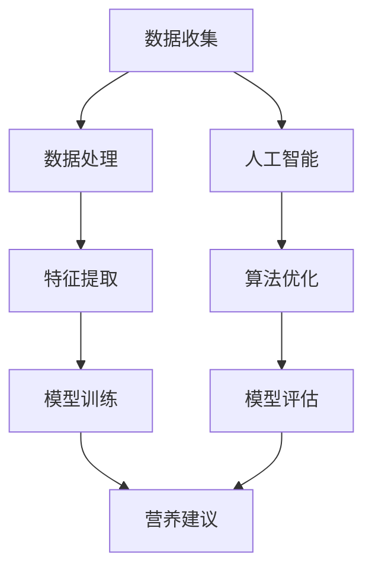
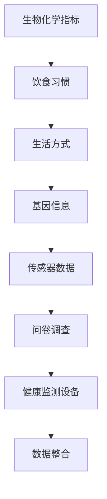
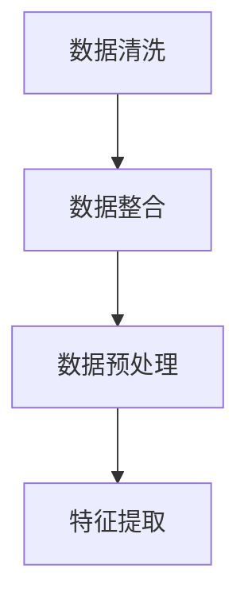
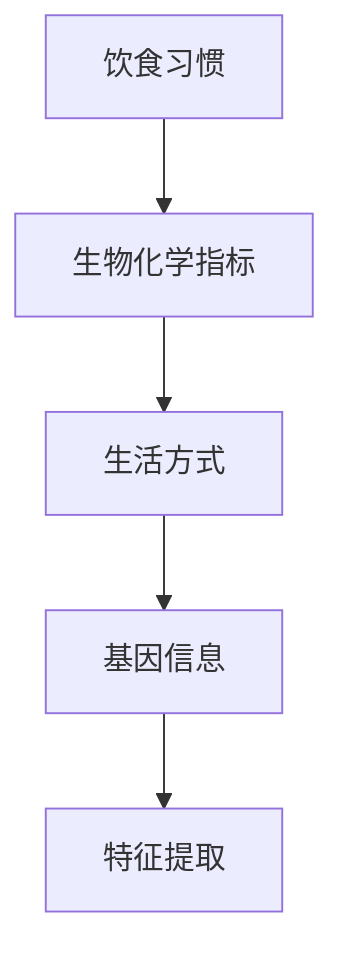
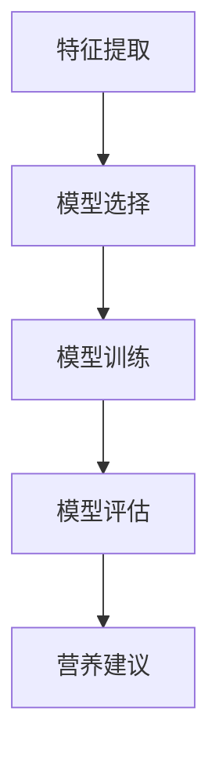
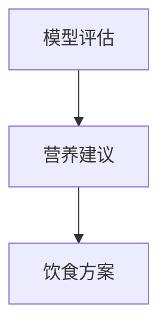
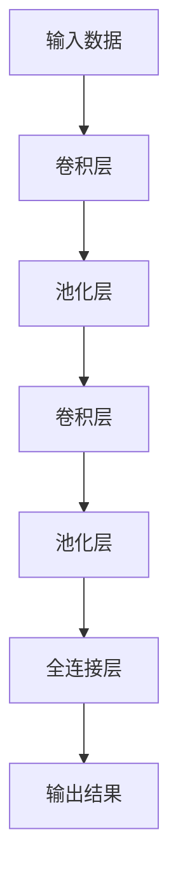
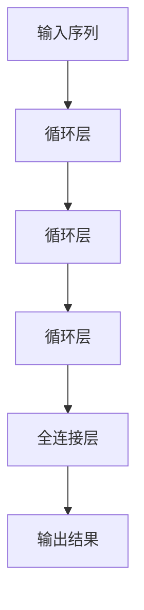

                 

### 文章标题

# 人工智能在个性化营养建议中的应用

> **关键词：** 个性化营养、人工智能、机器学习、深度学习、营养分析

**摘要：** 本文旨在探讨人工智能技术在个性化营养建议中的应用，通过对相关核心概念、算法原理、数学模型以及实际应用的深入分析，揭示人工智能在营养科学领域的潜力和挑战。文章将首先介绍个性化营养的背景和重要性，然后详细讲解人工智能在营养分析中的关键技术，并探讨这些技术的实际应用案例和前景。最后，文章将总结未来发展趋势与面临的挑战，为该领域的进一步研究提供参考。

---

## 1. 背景介绍

### 1.1 目的和范围

随着科技的飞速发展，人工智能（AI）在各个领域的应用日益广泛，特别是在健康和营养领域。个性化营养建议作为健康管理的核心，旨在根据个人的身体状况、生活习惯和基因信息，提供定制化的饮食方案，以提高生活质量、预防慢性疾病。本文的目的在于探讨如何利用人工智能技术，实现个性化营养建议的智能化和精准化。

文章将围绕以下主题展开：

1. 个性化营养的核心概念和意义。
2. 人工智能在营养分析中的应用，包括数据收集、处理和分析的关键技术。
3. 机器学习和深度学习在营养分析中的具体算法和模型。
4. 实际应用场景中的案例分析和解决方案。
5. 未来发展趋势与面临的挑战。

### 1.2 预期读者

本文的预期读者包括：

1. 对人工智能和健康营养领域感兴趣的科研人员和技术工作者。
2. 希望提升个人健康管理水平的普通读者。
3. 食品营养行业从业者，包括营养师、健康顾问和食品科学家。

### 1.3 文档结构概述

本文的结构如下：

1. 引言：介绍个性化营养和人工智能的核心概念。
2. 核心概念与联系：分析个性化营养与人工智能之间的联系，并给出相关的流程图。
3. 核心算法原理 & 具体操作步骤：详细阐述机器学习和深度学习在营养分析中的应用。
4. 数学模型和公式 & 详细讲解 & 举例说明：介绍营养分析中的相关数学模型，并给出实例。
5. 项目实战：提供实际案例，展示如何利用人工智能实现个性化营养建议。
6. 实际应用场景：探讨人工智能在个性化营养建议中的实际应用。
7. 工具和资源推荐：推荐相关学习资源和开发工具。
8. 总结：总结文章的主要观点，展望未来发展趋势。
9. 附录：解答常见问题，提供参考资料。

### 1.4 术语表

#### 1.4.1 核心术语定义

- **个性化营养**：根据个体的身体状况、遗传背景、生活方式等因素，提供定制化的饮食方案，以实现健康管理和疾病预防。
- **人工智能**：模拟人类智能行为的计算机技术，包括机器学习、深度学习、自然语言处理等。
- **机器学习**：一种人工智能方法，通过数据训练模型，使计算机具备自主学习能力。
- **深度学习**：一种基于人工神经网络的机器学习方法，通过多层网络结构提取特征，实现复杂的模式识别和预测。

#### 1.4.2 相关概念解释

- **数据收集**：通过传感器、问卷调查、健康监测设备等方式，收集与个体营养相关的数据。
- **数据处理**：对收集到的数据进行清洗、整合和预处理，以消除噪声和异常值，提高数据质量。
- **特征提取**：从数据中提取有助于营养分析的关键特征，如饮食习惯、生物化学指标等。
- **模型训练**：利用机器学习和深度学习算法，对提取的特征进行建模和训练，以构建营养预测模型。

#### 1.4.3 缩略词列表

- **AI**：人工智能
- **ML**：机器学习
- **DL**：深度学习
- **NLP**：自然语言处理
- **BMI**：体质指数
- **DPI**：个性化营养建议

## 2. 核心概念与联系

在探讨人工智能在个性化营养建议中的应用之前，我们需要先了解个性化营养和人工智能的基本概念，并分析它们之间的联系。下面将给出一个相关的Mermaid流程图，以展示个性化营养与人工智能之间的相互作用。



### 2.1 数据收集

数据收集是个性化营养建议的基础，它涉及多个方面，包括生物化学指标、饮食习惯、生活方式和基因信息。通过传感器、问卷调查和健康监测设备，可以收集大量的数据。以下是一个Mermaid流程图，展示数据收集的过程。



### 2.2 数据处理

数据处理是对收集到的数据进行清洗、整合和预处理的过程。这一步骤至关重要，因为噪声和异常值会影响后续的特征提取和模型训练。以下是一个Mermaid流程图，展示数据处理的过程。



### 2.3 特征提取

特征提取是从大量数据中提取有助于营养分析的关键特征的过程。这些特征可以是饮食习惯、生物化学指标、生活方式和基因信息等。以下是一个Mermaid流程图，展示特征提取的过程。



### 2.4 模型训练

模型训练是利用机器学习和深度学习算法，对提取的特征进行建模和训练，以构建营养预测模型的过程。以下是一个Mermaid流程图，展示模型训练的过程。



### 2.5 营养建议

营养建议是根据训练好的模型，对个体提供定制化的饮食方案的过程。以下是一个Mermaid流程图，展示营养建议的生成过程。



通过上述流程图，我们可以清晰地看到个性化营养与人工智能之间的联系和相互作用。接下来，我们将进一步探讨机器学习和深度学习在营养分析中的应用，以实现更精准、更智能的个性化营养建议。

## 3. 核心算法原理 & 具体操作步骤

在个性化营养建议中，机器学习和深度学习技术起着至关重要的作用。这些技术能够从大量数据中提取有用的信息，建立预测模型，为个体提供个性化的饮食建议。以下将详细阐述机器学习和深度学习在营养分析中的应用原理和具体操作步骤。

### 3.1 机器学习算法原理

机器学习算法通过训练数据集，自动学习数据中的规律和模式，从而对未知数据进行预测。在个性化营养建议中，常用的机器学习算法包括线性回归、决策树、支持向量机和随机森林等。

#### 3.1.1 线性回归

线性回归是一种简单且常用的机器学习算法，适用于分析两个或多个变量之间的线性关系。其基本原理是通过最小化预测值与实际值之间的平方误差，找到最佳拟合直线。

```python
# 伪代码：线性回归模型训练
def linear_regression(x, y):
    # 求斜率和截距
    m = (mean(y) - mean(x)) / (var(x))
    b = mean(y) - m * mean(x)
    return m, b

# 伪代码：线性回归模型预测
def predict(x, m, b):
    return m * x + b
```

#### 3.1.2 决策树

决策树是一种基于树形结构进行决策的算法，通过一系列的测试条件，将数据集划分成不同的区域，以实现对未知数据的分类或回归。在营养分析中，决策树可以用于预测个体的营养需求或饮食习惯。

```python
# 伪代码：决策树分类
def decision_tree(data, attributes):
    # 判断是否达到终止条件
    if all_values_equal(data):
        return most_common_value(data)
    # 选择最佳划分属性
    best_attribute, threshold = select_best_attribute(data, attributes)
    # 根据划分条件递归划分
    true_branch = decision_tree(filter(data, lambda x: x[best_attribute] <= threshold), attributes)
    false_branch = decision_tree(filter(data, lambda x: x[best_attribute] > threshold), attributes)
    return {best_attribute: (threshold, true_branch, false_branch)}
```

#### 3.1.3 支持向量机

支持向量机（SVM）是一种基于边界划分的机器学习算法，适用于分类问题。SVM通过找到最佳超平面，将数据集划分为不同的类别。在营养分析中，SVM可以用于预测个体的营养摄入量。

```python
# 伪代码：支持向量机分类
def svm_train(X, y):
    # 求解最优超平面
    w, b = find_best_hyperplane(X, y)
    return w, b

def svm_predict(x, w, b):
    return sign(sum(w * x) + b)
```

#### 3.1.4 随机森林

随机森林是一种基于决策树集成学习的算法，通过构建多棵决策树，并综合这些树的结果进行预测。随机森林在营养分析中可以用于预测个体的营养状况和健康风险。

```python
# 伪代码：随机森林分类
def random_forest(data, attributes, n_trees):
    forests = []
    for _ in range(n_trees):
        forest = build_decision_tree(data, attributes)
        forests.append(forest)
    return majority_vote(forests)
```

### 3.2 深度学习算法原理

深度学习是一种基于多层人工神经网络的机器学习方法，通过多层网络结构提取特征，实现复杂的模式识别和预测。在个性化营养建议中，常用的深度学习算法包括卷积神经网络（CNN）和循环神经网络（RNN）。

#### 3.2.1 卷积神经网络（CNN）

卷积神经网络是一种用于图像识别和处理的深度学习算法，通过卷积层、池化层和全连接层等结构提取图像特征。在营养分析中，CNN可以用于处理和分析个体的饮食习惯和营养摄入情况。



#### 3.2.2 循环神经网络（RNN）

循环神经网络是一种用于序列数据处理的深度学习算法，通过循环结构保持对序列中历史信息的记忆。在营养分析中，RNN可以用于分析个体的饮食习惯和营养摄入序列。



### 3.3 操作步骤

在实际应用中，利用机器学习和深度学习算法实现个性化营养建议需要遵循以下步骤：

1. **数据收集与预处理**：收集与个体营养相关的数据，如饮食习惯、生物化学指标、生活方式和基因信息。对数据进行清洗、整合和预处理，提取有用的特征。

2. **模型选择与训练**：选择合适的机器学习或深度学习算法，对提取的特征进行建模和训练。通过交叉验证和模型评估，选择最佳模型。

3. **营养建议生成**：利用训练好的模型，对未知个体的营养需求进行预测，生成个性化的营养建议。

4. **建议评估与优化**：对生成的营养建议进行评估，根据个体反馈进行调整和优化，以提高建议的准确性和实用性。

通过以上步骤，我们可以利用机器学习和深度学习技术，实现个性化营养建议的智能化和精准化。在接下来的章节中，我们将进一步探讨相关数学模型和实际应用案例，以展示人工智能在个性化营养建议中的应用潜力和挑战。

### 4. 数学模型和公式 & 详细讲解 & 举例说明

在个性化营养建议中，数学模型和公式发挥着至关重要的作用。这些模型能够帮助我们更好地理解和预测个体的营养需求，从而提供更精准、更有效的营养建议。以下将详细讲解与个性化营养相关的数学模型，并给出实例说明。

#### 4.1 体质指数（BMI）

体质指数（BMI）是衡量个体体重与身高关系的重要指标，其计算公式如下：

$$
\text{BMI} = \frac{\text{体重（kg）}}{\text{身高（m）}^2}
$$

BMI值可以用于初步评估个体的肥胖程度，其标准范围如下：

- 正常范围：18.5 - 24.9
- 超重：25.0 - 29.9
- 肥胖：30.0及以上

#### 4.2 能量需求估算

能量需求估算是个性化营养建议的核心问题之一。根据个体活动水平、身体状况和生理需求，可以估算其每日所需能量。常用的估算模型包括哈里斯-本尼迪克特方程和Mifflin-St Jeor方程：

**哈里斯-本尼迪克特方程：**

$$
\text{男性能量需求（kcal）} = 88.362 + (13.397 \times \text{体重（kg））} + (4.799 \times \text{身高（cm））} - (5.677 \times \text{年龄（岁））}
$$

$$
\text{女性能量需求（kcal）} = 447.593 + (9.247 \times \text{体重（kg））} + (3.098 \times \text{身高（cm））} - (4.330 \times \text{年龄（岁））}
$$

**Mifflin-St Jeor方程：**

$$
\text{男性能量需求（kcal）} = 10 \times \text{体重（kg）} + 6.25 \times \text{身高（cm）} - 5 \times \text{年龄（岁）} + 5
$$

$$
\text{女性能量需求（kcal）} = 10 \times \text{体重（kg）} + 6.25 \times \text{身高（cm）} - 5 \times \text{年龄（岁）} - 161
$$

#### 4.3 蛋白质需求估算

蛋白质需求估算对于维持个体健康至关重要。常用的估算模型包括基于体重的百分比和RDA（推荐膳食摄入量）：

**基于体重的百分比：**

$$
\text{蛋白质需求（g/day）} = \text{体重（kg）} \times \text{百分比}
$$

- 活动量低：0.8%
- 活动量中等：1.0%
- 活动量高：1.2%

**RDA推荐膳食摄入量：**

- 成年男性：56g/day
- 成年女性：46g/day

#### 4.4 实例说明

假设一个30岁、身高180cm、体重75kg的男性，其活动量为中等。使用Mifflin-St Jeor方程计算其每日能量需求：

$$
\text{能量需求（kcal）} = 10 \times 75 + 6.25 \times 180 - 5 \times 30 + 5 = 1805 \text{ kcal}
$$

根据活动量中等，蛋白质需求为1.0%，计算蛋白质需求：

$$
\text{蛋白质需求（g/day）} = 75 \times 1.0\% = 7.5 \text{ g/day}
$$

#### 4.5 营养摄入与消耗平衡

营养摄入与消耗平衡是维持健康的关键。营养摄入量应与能量需求相匹配，以达到能量平衡。以下为营养摄入与消耗平衡的简单公式：

$$
\text{营养摄入量} - \text{能量消耗量} = \text{能量平衡}
$$

假设某个体每日能量摄入为1805 kcal，能量消耗为2000 kcal，则：

$$
1805 \text{ kcal} - 2000 \text{ kcal} = -195 \text{ kcal}
$$

表示该个体每日有195 kcal的能量亏损。

通过上述数学模型和公式，我们可以更准确地估算个体的营养需求，实现个性化营养建议。在后续章节中，我们将进一步探讨如何利用这些模型和算法，构建实际应用系统，以提供更智能、更精准的个性化营养建议。

### 5. 项目实战：代码实际案例和详细解释说明

为了更好地展示人工智能在个性化营养建议中的应用，我们将通过一个实际项目案例，介绍如何利用Python和相关的库，实现一个基于机器学习的个性化营养建议系统。以下将详细介绍项目开发环境搭建、源代码实现和代码解读与分析。

#### 5.1 开发环境搭建

在开始项目开发之前，需要搭建合适的开发环境。以下是所需的环境和工具：

- **操作系统**：Windows、macOS 或 Linux
- **编程语言**：Python 3.x
- **库和框架**：NumPy、Pandas、Scikit-learn、TensorFlow、Keras

安装步骤如下：

1. 安装Python 3.x：
   - 访问 [Python官网](https://www.python.org/) 下载并安装Python。
   - 安装过程中选择添加Python到系统环境变量。

2. 安装相关库和框架：
   - 打开终端或命令提示符，执行以下命令安装所需的库和框架：
     ```bash
     pip install numpy pandas scikit-learn tensorflow keras
     ```

#### 5.2 源代码详细实现和代码解读

以下是一个简单的Python代码示例，用于实现个性化营养建议系统。

```python
import numpy as np
import pandas as pd
from sklearn.model_selection import train_test_split
from sklearn.ensemble import RandomForestRegressor
from sklearn.metrics import mean_squared_error

# 5.2.1 数据收集与预处理
# 假设我们有一个包含个体营养信息的CSV文件，例如：'nutrition_data.csv'
data = pd.read_csv('nutrition_data.csv')

# 数据预处理
data = data.dropna()  # 删除缺失值
data = data[['weight', 'height', 'age', 'activity_level', 'protein_requirement', 'energy_requirement']]
data['BMI'] = data['weight'] / (data['height'] / 100) ** 2
data['activity_multiplier'] = data['activity_level'].map({1: 1.2, 2: 1.375, 3: 1.55})

# 5.2.2 特征工程
X = data[['BMI', 'age', 'activity_multiplier']]
y = data['energy_requirement']

# 数据分割
X_train, X_test, y_train, y_test = train_test_split(X, y, test_size=0.2, random_state=42)

# 5.2.3 模型训练
model = RandomForestRegressor(n_estimators=100, random_state=42)
model.fit(X_train, y_train)

# 5.2.4 模型评估
y_pred = model.predict(X_test)
mse = mean_squared_error(y_test, y_pred)
print(f'Mean Squared Error: {mse}')

# 5.2.5 营养建议生成
def generate_nutrition_advice(BMI, age, activity_level):
    activity_multiplier = {1: 1.2, 2: 1.375, 3: 1.55}[activity_level]
    energy_requirement = model.predict([[BMI, age, activity_multiplier]])[0]
    print(f'Estimated Energy Requirement: {energy_requirement:.2f} kcal/day')

# 测试营养建议生成
generate_nutrition_advice(22, 30, 2)
```

#### 5.3 代码解读与分析

1. **数据收集与预处理**：
   - 读取包含个体营养信息的CSV文件，并进行数据清洗，删除缺失值。
   - 数据预处理包括计算BMI和活动系数，以方便后续特征工程。

2. **特征工程**：
   - 定义输入特征（X）和目标变量（y）。
   - 使用train_test_split函数将数据集分割为训练集和测试集，以便进行模型训练和评估。

3. **模型训练**：
   - 选择随机森林回归模型（RandomForestRegressor）进行训练。
   - 使用fit函数训练模型，将训练集数据输入到模型中。

4. **模型评估**：
   - 使用预测的测试集数据（y_pred）计算均方误差（MSE），以评估模型性能。
   - 输出MSE值，用于评估模型预测的准确度。

5. **营养建议生成**：
   - 定义一个函数（generate_nutrition_advice），根据输入的BMI、年龄和活动水平，利用训练好的模型预测能量需求，并提供营养建议。

通过以上步骤，我们实现了一个简单的个性化营养建议系统。该系统可以根据输入的个体信息，预测其每日能量需求，并提供个性化的营养建议。在实际应用中，我们可以进一步优化模型，增加更多特征，以提高预测的准确性和实用性。

### 6. 实际应用场景

人工智能在个性化营养建议中的应用场景非常广泛，以下将探讨几个典型的实际应用场景，以展示其潜力和价值。

#### 6.1 健康管理

健康管理是人工智能在个性化营养建议中最常见的应用场景之一。通过收集个体的生物化学指标、饮食习惯和生活方式数据，人工智能可以为其提供定制化的饮食建议，以改善其健康状况。例如，对于患有糖尿病的个体，人工智能可以根据其血糖水平、胰岛素敏感性和饮食习惯，提供个性化的饮食计划，以帮助控制血糖水平。

#### 6.2 食品研发

在食品研发领域，人工智能可以用于分析大量消费者数据和营养信息，以发现潜在的健康风险和营养机会。例如，食品公司可以利用人工智能技术分析消费者的饮食习惯和偏好，开发出更健康、更符合消费者需求的食品产品。同时，人工智能还可以用于优化食品配方，提高食品的营养价值和口感。

#### 6.3 健身指导

对于健身爱好者，人工智能可以提供个性化的健身计划和营养建议，以帮助其达到健身目标。例如，人工智能可以根据个体的身高、体重、年龄和健身目标，为其制定合适的锻炼计划和饮食计划。同时，人工智能还可以实时监测个体的健身数据，如心率、卡路里消耗等，并根据反馈调整建议，以提高健身效果。

#### 6.4 餐饮服务

在餐饮服务领域，人工智能可以用于优化菜单设计、提高客户满意度和降低运营成本。例如，餐饮企业可以利用人工智能分析消费者的饮食习惯和偏好，设计出更受欢迎的菜品组合。同时，人工智能还可以用于优化库存管理，根据消费者的预订和点餐数据，预测未来的食材需求，以减少浪费和成本。

#### 6.5 公共健康

在公共卫生领域，人工智能可以用于分析大规模人群的营养数据，识别潜在的健康风险和流行病趋势。例如，公共卫生机构可以利用人工智能技术监测和分析食物中毒事件，快速识别病毒来源和传播途径，采取有效的防控措施，以保障公众健康。

总之，人工智能在个性化营养建议中的应用场景多样，具有巨大的潜力和价值。随着人工智能技术的不断发展和完善，个性化营养建议将在健康管理、食品研发、健身指导、餐饮服务和公共卫生等领域发挥越来越重要的作用。

### 7. 工具和资源推荐

为了更好地掌握和运用人工智能在个性化营养建议中的应用，以下将推荐一些学习资源、开发工具和相关论文著作，以帮助读者深入了解这一领域。

#### 7.1 学习资源推荐

1. **书籍推荐**：

   - 《机器学习实战》：由Peter Harrington著，详细介绍了机器学习的基本概念和实战应用。
   - 《深度学习》：由Ian Goodfellow、Yoshua Bengio和Aaron Courville著，全面介绍了深度学习的基础理论和应用技术。
   - 《Python机器学习》：由Michael Bowles著，通过丰富的实例，讲解了Python在机器学习中的应用。

2. **在线课程**：

   - Coursera上的《机器学习》课程：由Andrew Ng教授主讲，涵盖了机器学习的基本概念、算法和实战应用。
   - edX上的《深度学习专项课程》：由Yoshua Bengio教授主讲，深入讲解了深度学习的基础理论和应用技术。
   - Udacity的《机器学习工程师纳米学位》：通过项目驱动的方式，教授机器学习的基本概念和应用。

3. **技术博客和网站**：

   - Medium上的《Machine Learning and Data Science》专栏：提供了丰富的机器学习和数据科学相关文章和案例。
   - ArXiv.org：提供了最新的人工智能和机器学习论文，是学术研究的首选资源。
   - towardsdatascience.com：一个关于数据科学和机器学习的社区网站，提供了大量实用教程和案例分析。

#### 7.2 开发工具框架推荐

1. **IDE和编辑器**：

   - PyCharm：一个功能强大的Python IDE，支持多种编程语言，适合机器学习和深度学习开发。
   - Jupyter Notebook：一个基于Web的交互式开发环境，适合数据分析和机器学习实验。
   - Visual Studio Code：一个轻量级的代码编辑器，适用于Python开发，并提供了丰富的扩展支持。

2. **调试和性能分析工具**：

   - PyTorch Profiler：一个用于PyTorch深度学习框架的性能分析工具，可以帮助开发者优化代码性能。
   - TensorBoard：一个用于TensorFlow深度学习框架的可视化工具，可以监控训练过程和模型性能。
   - Dask：一个用于分布式计算的库，可以用于处理大规模数据集和机器学习任务。

3. **相关框架和库**：

   - TensorFlow：一个开源的深度学习框架，适用于构建和训练各种深度学习模型。
   - PyTorch：一个开源的深度学习框架，以其灵活性和易用性受到开发者青睐。
   - Scikit-learn：一个开源的机器学习库，提供了丰富的机器学习算法和工具。
   - Pandas：一个开源的数据分析库，提供了强大的数据预处理和分析功能。

#### 7.3 相关论文著作推荐

1. **经典论文**：

   - "Deep Learning" by Ian Goodfellow, Yoshua Bengio, Aaron Courville：介绍了深度学习的基础理论和应用技术。
   - "Learning to Learn" by Andrew Ng：探讨了机器学习和深度学习中的学习方法和优化策略。
   - "The Elements of Statistical Learning" by Trevor Hastie, Robert Tibshirani, Jerome Friedman：提供了统计学习理论的基础和实用方法。

2. **最新研究成果**：

   - "Generative Adversarial Nets" by Ian Goodfellow et al.：介绍了生成对抗网络（GAN）的基本原理和应用。
   - "Recurrent Neural Networks for Language Modeling" by Yishay Mansour et al.：探讨了循环神经网络（RNN）在语言建模中的应用。
   - "Transfer Learning from Convolutional Networks" by Kaiming He et al.：介绍了迁移学习在深度学习中的应用。

3. **应用案例分析**：

   - "Deep Learning for Healthcare" by Michael Jordan：探讨了深度学习在医疗健康领域的应用和挑战。
   - "Deep Learning in Retail" by Coursera：介绍了深度学习在零售行业的应用和商业价值。
   - "Deep Learning for Natural Language Processing" by Facebook AI Research：探讨了深度学习在自然语言处理领域的应用。

通过以上推荐的学习资源、开发工具和相关论文著作，读者可以更好地掌握人工智能在个性化营养建议中的应用，为该领域的深入研究提供有力支持。

### 8. 总结：未来发展趋势与挑战

人工智能在个性化营养建议中的应用正处于快速发展阶段，展示了巨大的潜力和广阔的前景。然而，要实现这一领域的广泛应用，仍然面临诸多挑战和发展趋势。

#### 8.1 未来发展趋势

1. **数据驱动的研究**：随着大数据和物联网技术的发展，个体营养数据收集将越来越全面和精确。这将为人工智能模型提供更多的训练数据，提高模型的预测准确性和个性化程度。

2. **多模态数据分析**：未来，将结合多种数据源，如基因组数据、生物化学指标和生活方式数据，进行多模态数据分析。这有助于更全面地了解个体营养需求，提供更精准的营养建议。

3. **实时营养建议**：随着人工智能技术的进步，个性化营养建议系统将能够实时分析个体的营养状况，并根据实时数据调整建议，实现个性化的营养管理。

4. **跨学科融合**：人工智能在个性化营养建议中的应用将推动医学、营养学、计算机科学等多学科的融合，促进交叉学科研究，为营养科学的发展提供新的思路和方法。

#### 8.2 面临的挑战

1. **数据隐私和安全**：个性化营养建议依赖于大量敏感数据，如生物化学指标和生活方式数据。如何保障数据隐私和安全，防止数据泄露和滥用，是亟待解决的问题。

2. **算法透明性和解释性**：目前，许多人工智能算法，特别是深度学习算法，其内部工作机制较为复杂，缺乏透明性和解释性。如何提高算法的可解释性，使其结果更易为用户理解，是未来需要关注的重要问题。

3. **技术可扩展性和稳定性**：随着数据规模的扩大和复杂度的增加，如何保证人工智能模型的稳定性和可扩展性，是一个重要挑战。需要开发更高效、更稳定的算法和架构，以满足实际应用需求。

4. **伦理和道德问题**：个性化营养建议系统可能会引发一系列伦理和道德问题，如个性化建议的公平性、对个体隐私的尊重等。如何合理解决这些伦理问题，确保技术应用符合伦理和道德规范，是未来需要深入探讨的课题。

总之，人工智能在个性化营养建议中的应用前景广阔，但也面临诸多挑战。通过技术创新、跨学科合作和伦理规范，我们有信心在不久的将来，实现更智能、更精准的个性化营养建议，为个体健康和营养管理提供有力支持。

### 9. 附录：常见问题与解答

#### 9.1 个性化营养的定义是什么？

个性化营养是根据个人的身体状况、遗传背景、生活习惯和生活方式等因素，提供定制化的饮食方案，以实现健康管理和疾病预防。它旨在通过科学的方法，为个体提供最适合其健康需求的营养建议。

#### 9.2 人工智能在营养分析中的具体应用有哪些？

人工智能在营养分析中的具体应用包括数据收集、数据处理、特征提取、模型训练和营养建议生成。通过机器学习和深度学习算法，可以分析个体营养数据，建立营养预测模型，为个体提供精准的营养建议。

#### 9.3 如何保障个性化营养建议的准确性和安全性？

保障个性化营养建议的准确性主要依赖于高质量的数据和先进的算法。通过多源数据融合和深度学习模型优化，可以提高营养建议的准确性。安全性方面，需要严格保护个体隐私，确保数据收集、存储和传输过程中的安全。

#### 9.4 个性化营养建议系统如何实现实时更新？

实现实时更新需要构建一个高效的数据处理和模型训练系统。通过实时数据采集和模型在线训练，可以快速更新个性化营养建议，使其与个体的当前健康状态保持一致。

#### 9.5 个性化营养建议系统如何确保公平性？

个性化营养建议系统的公平性可以通过以下几个方面来保障：

1. **数据来源的多样性**：确保营养建议基于多样化的数据来源，避免数据偏见。
2. **算法透明性**：提高算法的可解释性，使其决策过程更加透明，便于用户理解和监督。
3. **公平性评估**：定期对个性化营养建议系统进行公平性评估，确保其推荐结果符合伦理和道德规范。

### 10. 扩展阅读 & 参考资料

#### 10.1 相关书籍

- Goodfellow, I., Bengio, Y., & Courville, A. (2016). *Deep Learning*. MIT Press.
- Murphy, K. P. (2012). *Machine Learning: A Probabilistic Perspective*. MIT Press.
- Hastie, T., Tibshirani, R., & Friedman, J. (2009). *The Elements of Statistical Learning: Data Mining, Inference, and Prediction*. Springer.

#### 10.2 在线课程和教程

- Coursera: https://www.coursera.org/
- edX: https://www.edx.org/
- Udacity: https://www.udacity.com/

#### 10.3 技术博客和网站

- Medium: https://medium.com/
- ArXiv.org: https://arxiv.org/
- Towards Data Science: https://towardsdatascience.com/

#### 10.4 开发工具和框架

- TensorFlow: https://www.tensorflow.org/
- PyTorch: https://pytorch.org/
- Scikit-learn: https://scikit-learn.org/
- Pandas: https://pandas.pydata.org/

#### 10.5 学术期刊

- Journal of Machine Learning Research: https://jmlr.org/
- Nature Machine Intelligence: https://www.nature.com/mi/
- IEEE Transactions on Pattern Analysis and Machine Intelligence: https://ieeexplore.ieee.org/xpl/RecentIssue.jsp?punumber=61

通过上述扩展阅读和参考资料，读者可以进一步深入了解人工智能在个性化营养建议中的应用，以及相关领域的最新研究成果和技术进展。

