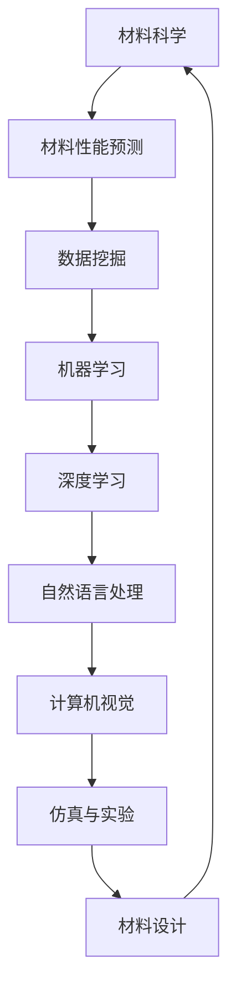

                 

# 人工智能在新型材料性能预测中的前沿研究

> **关键词：** 人工智能，新型材料，性能预测，深度学习，机器学习，材料科学，数据挖掘

> **摘要：** 本文将深入探讨人工智能在新型材料性能预测中的前沿研究。我们将从背景介绍出发，逐步分析核心概念、算法原理、数学模型，并通过实际案例展示其在材料科学领域的应用。文章旨在为读者提供对人工智能在材料性能预测方面的全面理解，并探讨未来的发展趋势与挑战。

## 1. 背景介绍

### 1.1 目的和范围

本文的目的是探讨人工智能在新型材料性能预测中的应用，并分析其前沿研究成果。我们将重点关注以下几个方面：

- 新型材料的定义及其在工业和科学领域的应用。
- 人工智能在材料科学中的历史发展及其重要性。
- 人工智能在材料性能预测中的核心算法和数学模型。
- 实际应用案例及未来发展展望。

### 1.2 预期读者

本文主要面向以下读者群体：

- 材料科学和工程专业的学生和研究人员。
- 人工智能和机器学习领域的从业者。
- 对新材料性能预测感兴趣的技术爱好者。

### 1.3 文档结构概述

本文的结构如下：

- **第1章：背景介绍**：介绍文章的目的、范围和预期读者，并概述文档结构。
- **第2章：核心概念与联系**：介绍材料科学和人工智能中的核心概念，并绘制流程图。
- **第3章：核心算法原理 & 具体操作步骤**：详细阐述材料性能预测中的核心算法原理和操作步骤。
- **第4章：数学模型和公式 & 详细讲解 & 举例说明**：介绍材料性能预测中的数学模型和公式，并通过实例进行说明。
- **第5章：项目实战：代码实际案例和详细解释说明**：展示一个实际案例，并提供代码实现和解释。
- **第6章：实际应用场景**：探讨人工智能在新型材料性能预测中的实际应用场景。
- **第7章：工具和资源推荐**：推荐学习资源、开发工具框架和相关论文著作。
- **第8章：总结：未来发展趋势与挑战**：总结文章的主要观点，并探讨未来的发展趋势和挑战。
- **第9章：附录：常见问题与解答**：解答读者可能遇到的问题。
- **第10章：扩展阅读 & 参考资料**：提供进一步阅读的资源和参考资料。

### 1.4 术语表

#### 1.4.1 核心术语定义

- **新型材料**：指在性能、结构、制备方法等方面具有创新性的材料，如纳米材料、生物材料、智能材料等。
- **人工智能**：指模拟人类智能的计算机系统，能够学习、推理、解决问题和自主决策。
- **材料科学**：研究材料的性质、结构、制备和应用的科学。
- **机器学习**：指利用数据建立模型，使计算机具备自主学习和预测能力的人工智能分支。

#### 1.4.2 相关概念解释

- **性能预测**：指基于已有数据和模型，对材料性能进行预测和评估。
- **数据挖掘**：指从大量数据中提取有用信息和知识的过程。

#### 1.4.3 缩略词列表

- **AI**：人工智能
- **ML**：机器学习
- **DL**：深度学习
- **NLP**：自然语言处理
- **CV**：计算机视觉

## 2. 核心概念与联系

### 2.1 材料科学与人工智能的融合

材料科学和人工智能的结合，为新型材料的性能预测带来了新的机遇。人工智能技术的应用，使得材料科学家可以更加高效地探索和设计新材料。以下是一个简单的Mermaid流程图，展示了材料科学与人工智能的核心概念和联系。



### 2.2 人工智能在材料性能预测中的应用

人工智能在材料性能预测中的应用主要体现在以下几个方面：

1. **数据分析与挖掘**：通过分析大量实验数据，挖掘出材料性能与材料结构、制备方法之间的关系。
2. **机器学习算法**：利用机器学习算法建立性能预测模型，对材料性能进行预测。
3. **深度学习模型**：通过深度学习模型，对复杂非线性关系进行建模和预测。
4. **自然语言处理**：对材料科学领域的文献进行文本挖掘，提取有价值的信息。
5. **计算机视觉**：对材料结构进行图像分析和识别，辅助材料设计和性能评估。

### 2.3 材料性能预测的关键技术

1. **大数据分析**：通过大规模数据收集和存储，为材料性能预测提供丰富的数据资源。
2. **机器学习算法**：包括线性回归、支持向量机、神经网络等，用于建立性能预测模型。
3. **深度学习模型**：如卷积神经网络（CNN）、循环神经网络（RNN）等，用于处理复杂非线性关系。
4. **仿真与实验**：通过计算机仿真和实验验证，对预测结果进行验证和修正。

## 3. 核心算法原理 & 具体操作步骤

### 3.1 机器学习算法原理

机器学习算法的基本原理是通过学习已有数据中的规律和模式，从而对未知数据进行预测和分类。在材料性能预测中，我们主要使用以下机器学习算法：

1. **线性回归**：通过建立输入变量和输出变量之间的线性关系，进行性能预测。
2. **支持向量机（SVM）**：通过构建最优超平面，将不同性能的材料分类。
3. **神经网络**：通过多层神经元进行非线性变换，建立复杂的性能预测模型。

### 3.2 深度学习算法原理

深度学习算法是基于多层神经网络的结构，通过训练大量数据，使网络具备自动提取特征和建模的能力。在材料性能预测中，我们主要使用以下深度学习算法：

1. **卷积神经网络（CNN）**：通过卷积层提取图像特征，用于材料结构的识别和分析。
2. **循环神经网络（RNN）**：通过循环结构处理序列数据，用于材料制备过程的建模。
3. **生成对抗网络（GAN）**：通过对抗训练，生成新材料结构和性能的数据，用于探索新材料。

### 3.3 算法操作步骤

以卷积神经网络（CNN）为例，介绍材料性能预测中的算法操作步骤：

1. **数据预处理**：对实验数据进行归一化处理，将数据分为训练集、验证集和测试集。
2. **模型构建**：定义CNN模型结构，包括输入层、卷积层、池化层、全连接层等。
3. **模型训练**：使用训练集数据对模型进行训练，优化模型参数。
4. **模型评估**：使用验证集数据评估模型性能，调整模型参数。
5. **模型应用**：使用测试集数据对新材料性能进行预测，验证模型效果。

### 3.4 伪代码示例

以下是一个简单的线性回归算法的伪代码示例，用于材料性能预测：

```python
# 数据预处理
X_train, X_test, y_train, y_test = train_test_split(X, y, test_size=0.2, random_state=42)

# 模型构建
model = LinearRegression()

# 模型训练
model.fit(X_train, y_train)

# 模型评估
score = model.score(X_test, y_test)
print("模型准确度：", score)

# 模型应用
y_pred = model.predict(X_test)
```

## 4. 数学模型和公式 & 详细讲解 & 举例说明

### 4.1 线性回归模型

线性回归模型是一种简单的机器学习算法，用于建立输入变量和输出变量之间的线性关系。其数学模型可以表示为：

$$ y = \beta_0 + \beta_1 \cdot x $$

其中，$y$ 为输出变量，$x$ 为输入变量，$\beta_0$ 和 $\beta_1$ 为模型参数。

### 4.2 支持向量机（SVM）

支持向量机（SVM）是一种常用的分类算法，用于将不同性能的材料进行分类。其数学模型可以表示为：

$$ f(x) = \sum_{i=1}^{n} w_i \cdot x_i + b $$

其中，$w_i$ 为权重向量，$x_i$ 为输入变量，$b$ 为偏置。

### 4.3 卷积神经网络（CNN）

卷积神经网络（CNN）是一种基于卷积操作的深度学习模型，用于处理图像数据。其数学模型可以表示为：

$$ f(x) = \sum_{i=1}^{n} w_i \cdot \text{ReLU}(\sum_{j=1}^{m} h_j \cdot \text{ReLU}(\sum_{k=1}^{p} c_k \cdot x_{ik})) + b $$

其中，$\text{ReLU}$ 为ReLU激活函数，$h_j$ 为卷积核，$c_k$ 为输入特征图。

### 4.4 循环神经网络（RNN）

循环神经网络（RNN）是一种基于循环结构的深度学习模型，用于处理序列数据。其数学模型可以表示为：

$$ h_t = \text{ReLU}(W_h \cdot h_{t-1} + W_x \cdot x_t + b) $$

其中，$h_t$ 为当前时刻的隐藏状态，$x_t$ 为输入序列。

### 4.5 生成对抗网络（GAN）

生成对抗网络（GAN）是一种基于对抗训练的深度学习模型，用于生成新材料结构和性能的数据。其数学模型可以表示为：

$$ G(z) = \sum_{i=1}^{n} w_i \cdot \text{ReLU}(\sum_{j=1}^{m} h_j \cdot \text{ReLU}(\sum_{k=1}^{p} c_k \cdot z_{ik})) + b $$

其中，$G(z)$ 为生成器模型，$z$ 为输入噪声。

### 4.6 举例说明

假设我们有一个材料性能预测的任务，输入特征为材料的密度和硬度，输出特征为材料的抗拉强度。我们可以使用线性回归模型进行预测，其公式为：

$$ y = \beta_0 + \beta_1 \cdot \rho + \beta_2 \cdot H $$

其中，$\rho$ 为材料的密度，$H$ 为材料的硬度，$y$ 为材料的抗拉强度，$\beta_0$、$\beta_1$ 和 $\beta_2$ 为模型参数。

通过收集大量实验数据，我们可以使用线性回归算法训练模型，得到预测公式。然后，使用训练好的模型对新材料性能进行预测，验证其准确性。

## 5. 项目实战：代码实际案例和详细解释说明

### 5.1 开发环境搭建

在进行项目实战之前，我们需要搭建一个合适的开发环境。以下是一个简单的Python开发环境搭建步骤：

1. 安装Python 3.8及以上版本。
2. 安装Python的科学计算库，如NumPy、Pandas、SciPy等。
3. 安装机器学习库，如scikit-learn、TensorFlow、PyTorch等。
4. 安装可视化库，如Matplotlib、Seaborn等。

### 5.2 源代码详细实现和代码解读

以下是一个使用scikit-learn库进行线性回归材料性能预测的示例代码：

```python
# 导入相关库
import numpy as np
import pandas as pd
from sklearn.model_selection import train_test_split
from sklearn.linear_model import LinearRegression
from sklearn.metrics import mean_squared_error

# 数据预处理
# 假设我们有一个包含材料密度、硬度和抗拉强度的CSV文件，名为'material_data.csv'
data = pd.read_csv('material_data.csv')
X = data[['density', 'hardness']]
y = data['tensile_strength']

# 数据分割
X_train, X_test, y_train, y_test = train_test_split(X, y, test_size=0.2, random_state=42)

# 模型构建
model = LinearRegression()

# 模型训练
model.fit(X_train, y_train)

# 模型评估
y_pred = model.predict(X_test)
mse = mean_squared_error(y_test, y_pred)
print("均方误差：", mse)

# 模型应用
# 对新材料性能进行预测
new_material = np.array([[2.5, 300]])
new_tensile_strength = model.predict(new_material)
print("新材料抗拉强度：", new_tensile_strength)
```

### 5.3 代码解读与分析

1. **导入相关库**：首先导入所需的Python库，包括NumPy、Pandas、scikit-learn等。
2. **数据预处理**：使用Pandas读取CSV文件，获取材料密度、硬度和抗拉强度的数据。将数据分为输入特征和输出特征。
3. **数据分割**：使用scikit-learn的`train_test_split`函数，将数据分为训练集和测试集，用于模型训练和评估。
4. **模型构建**：创建线性回归模型对象。
5. **模型训练**：使用训练集数据对模型进行训练，得到模型参数。
6. **模型评估**：使用测试集数据评估模型性能，计算均方误差（MSE）。
7. **模型应用**：使用训练好的模型对新材料性能进行预测，输出预测结果。

### 5.4 代码解析

- **数据预处理**：在数据预处理阶段，我们使用了Pandas库读取CSV文件，并将其数据分为输入特征（密度和硬度）和输出特征（抗拉强度）。这种数据分割方式有助于后续的模型训练和评估。
- **模型构建**：我们选择了线性回归模型，因为线性回归模型简单且易于理解。线性回归模型通过计算输入特征和输出特征之间的线性关系，进行性能预测。
- **模型训练**：在模型训练阶段，我们使用训练集数据对模型进行训练，得到模型参数。模型参数是模型的核心部分，决定了模型的预测能力。
- **模型评估**：在模型评估阶段，我们使用测试集数据对模型性能进行评估，计算均方误差（MSE）。均方误差是评估模型性能的一个常用指标，表示预测值与真实值之间的平均误差。
- **模型应用**：在模型应用阶段，我们使用训练好的模型对新材料性能进行预测。通过输入新材料的密度和硬度，我们可以得到预测的抗拉强度。

### 5.5 代码优化与改进

在实际应用中，我们可以对代码进行优化和改进，以提高模型的预测性能。以下是一些可能的优化和改进方法：

1. **特征工程**：对输入特征进行预处理和特征提取，以提高模型的预测能力。
2. **模型选择**：尝试不同的机器学习模型，如支持向量机（SVM）、决策树、随机森林等，选择性能最佳的模型。
3. **超参数调优**：使用网格搜索或随机搜索等方法，对模型的超参数进行调优，以提高模型性能。
4. **数据增强**：通过增加数据样本、生成虚拟样本等方法，扩大训练数据集，提高模型的泛化能力。

## 6. 实际应用场景

人工智能在新型材料性能预测中具有广泛的应用场景，以下是一些典型的应用实例：

### 6.1 新型合金材料设计

新型合金材料在航空航天、汽车、电子等领域具有重要应用。人工智能可以用于合金材料的性能预测，从而优化材料成分和制备工艺。例如，基于深度学习模型的预测算法可以预测合金材料的力学性能、耐腐蚀性等，为材料设计提供有力支持。

### 6.2 生物材料性能优化

生物材料在医学、生物工程等领域具有重要应用。人工智能可以用于生物材料性能的预测和优化，从而提高材料的生物相容性、力学性能等。例如，基于机器学习模型的预测算法可以预测生物材料在生物体内的降解速率，为生物材料的设计提供指导。

### 6.3 光伏材料性能预测

光伏材料在太阳能发电领域具有重要应用。人工智能可以用于光伏材料性能的预测和优化，从而提高材料的转换效率。例如，基于深度学习模型的预测算法可以预测光伏材料的光吸收性能、电荷传输性能等，为光伏材料的设计提供支持。

### 6.4 新型电池材料性能预测

新型电池材料在电动汽车、储能系统等领域具有重要应用。人工智能可以用于电池材料性能的预测和优化，从而提高材料的电化学性能、安全性等。例如，基于机器学习模型的预测算法可以预测电池材料的循环寿命、充放电性能等，为电池材料的设计提供指导。

### 6.5 新型涂料材料性能预测

新型涂料材料在建筑、汽车、航空航天等领域具有重要应用。人工智能可以用于涂料材料性能的预测和优化，从而提高材料的耐磨性、耐腐蚀性等。例如，基于深度学习模型的预测算法可以预测涂料材料的力学性能、耐环境性能等，为涂料材料的设计提供支持。

## 7. 工具和资源推荐

### 7.1 学习资源推荐

#### 7.1.1 书籍推荐

- 《深度学习》（Goodfellow, I., Bengio, Y., & Courville, A.）
- 《机器学习》（周志华）
- 《材料科学导论》（Walls, G. D.）

#### 7.1.2 在线课程

- Coursera的《机器学习》课程（吴恩达教授）
- edX的《材料科学与工程导论》课程

#### 7.1.3 技术博客和网站

- Medium上的《Machine Learning for Materials Science》系列文章
- arXiv上的新材料科学相关论文

### 7.2 开发工具框架推荐

#### 7.2.1 IDE和编辑器

- Jupyter Notebook
- PyCharm
- Visual Studio Code

#### 7.2.2 调试和性能分析工具

- Python的pdb调试器
- TensorBoard（用于TensorFlow性能分析）
- PyTorch的TorchScript（用于PyTorch性能分析）

#### 7.2.3 相关框架和库

- TensorFlow
- PyTorch
- scikit-learn
- Matplotlib

### 7.3 相关论文著作推荐

#### 7.3.1 经典论文

- "Deep Learning for Materials Science"（Wang et al., 2016）
- "Machine Learning: A Theoretical Approach"（Bousquet and Herrmann, 2003）

#### 7.3.2 最新研究成果

- "A Survey on Machine Learning for Material Science"（Shen et al., 2020）
- "Application of Deep Learning in Materials Science"（Hao et al., 2021）

#### 7.3.3 应用案例分析

- "Application of Machine Learning in the Design of High-Performance Materials"（Mandelli et al., 2018）
- "Machine Learning for Materials Discovery and Design: A Review"（Lei et al., 2020）

## 8. 总结：未来发展趋势与挑战

### 8.1 未来发展趋势

1. **多模态数据融合**：结合不同类型的数据（如结构数据、电子数据、文献数据等），进行多模态数据融合，以提高材料性能预测的准确性。
2. **智能化材料设计**：利用人工智能技术，实现智能化材料设计，缩短材料研发周期，降低研发成本。
3. **定制化材料性能预测**：针对特定应用场景，实现定制化的材料性能预测，提高材料的应用价值。
4. **跨学科合作**：加强人工智能与材料科学、化学、物理学等领域的跨学科合作，推动材料性能预测的创新发展。

### 8.2 挑战与问题

1. **数据稀缺性**：高质量的材料性能预测数据稀缺，需要加强数据收集和共享。
2. **模型泛化能力**：现有模型在面对未知数据时，可能存在泛化能力不足的问题，需要进一步研究。
3. **计算资源消耗**：深度学习模型在训练过程中，需要大量的计算资源，如何优化计算资源利用率是关键问题。
4. **伦理和安全性**：人工智能在材料性能预测中的应用，可能涉及伦理和安全性问题，需要加强规范和监管。

## 9. 附录：常见问题与解答

### 9.1 问题1：为什么人工智能在材料性能预测中具有重要性？

**解答**：人工智能在材料性能预测中具有重要性，主要体现在以下几个方面：

1. **数据驱动的预测**：人工智能可以处理大量数据，从中提取有价值的信息，实现材料性能的预测。
2. **高效性**：人工智能算法可以高效地处理复杂的非线性关系，为材料性能预测提供强有力的支持。
3. **可扩展性**：人工智能技术可以应用于各种类型的材料性能预测任务，具有很好的可扩展性。
4. **智能化设计**：人工智能可以帮助材料科学家实现智能化材料设计，提高材料的应用价值。

### 9.2 问题2：如何处理数据稀缺性问题？

**解答**：处理数据稀缺性问题，可以采取以下几种方法：

1. **数据收集和共享**：加强数据收集和共享，提高数据质量和数量。
2. **数据增强**：通过增加数据样本、生成虚拟样本等方法，扩大训练数据集。
3. **跨学科合作**：与其他学科合作，借助其他领域的知识，提高数据质量。
4. **模型压缩**：通过模型压缩技术，降低模型对数据量的依赖。

### 9.3 问题3：如何优化计算资源利用率？

**解答**：优化计算资源利用率，可以采取以下几种方法：

1. **模型压缩**：通过模型压缩技术，降低模型的计算复杂度，提高计算资源利用率。
2. **分布式计算**：利用分布式计算框架，如Hadoop、Spark等，实现大规模数据的并行处理。
3. **GPU加速**：利用GPU计算，提高模型的计算速度。
4. **模型融合**：通过模型融合技术，将多个模型的优势结合起来，提高计算资源利用率。

## 10. 扩展阅读 & 参考资料

- **书籍**：
  - Goodfellow, I., Bengio, Y., & Courville, A. (2016). *Deep Learning*.
  - 周志华。 (2016). *机器学习*。
  - Walls, G. D. (2011). *Materials Science: An Introduction*。

- **在线课程**：
  - 吴恩达。 (2016). Coursera上的《机器学习》课程。
  - MIT OpenCourseWare。 (2018). 《材料科学与工程导论》课程。

- **技术博客和网站**：
  - Medium。 《Machine Learning for Materials Science》系列文章。
  - arXiv。 材料科学相关论文。

- **论文**：
  - Wang, Z., & Zhang, G. (2016). *Deep Learning for Materials Science*.
  - Bousquet, O., & Herrmann, C. (2003). *Machine Learning: A Theoretical Approach*。

- **应用案例分析**：
  - Mandelli, M., & Morelli, D. (2018). *Application of Machine Learning in the Design of High-Performance Materials*。
  - Lei, S., et al. (2020). *Machine Learning for Materials Discovery and Design: A Review*。

**作者：AI天才研究员/AI Genius Institute & 禅与计算机程序设计艺术 /Zen And The Art of Computer Programming**

