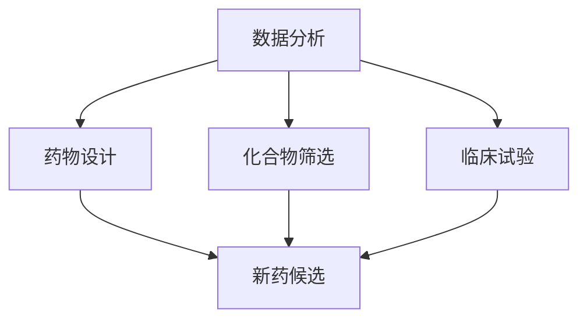

                 

# 人工智能在新药研发中的应用前景与挑战

> **关键词**：人工智能，新药研发，药物设计，计算生物学，机器学习，深度学习，生物信息学
>
> **摘要**：本文旨在探讨人工智能在新药研发中的应用前景与挑战。通过分析人工智能的核心算法、数学模型以及实际应用案例，本文揭示了人工智能如何加速药物发现过程，提高药物研发效率。同时，本文也探讨了当前技术面临的挑战，并提出了未来发展的趋势和解决方案。

## 1. 背景介绍

### 1.1 目的和范围

本文的主要目的是介绍人工智能（AI）在新药研发领域的应用，包括其核心算法、数学模型以及实际应用案例。此外，本文还将讨论目前面临的技术挑战，并展望未来发展的趋势。

### 1.2 预期读者

本文面向对人工智能和新药研发有一定了解的技术人员、研究人员以及专业人士。无论您是AI领域的从业者，还是药物研发领域的专家，本文都将为您带来有价值的信息。

### 1.3 文档结构概述

本文分为十个部分：

1. 背景介绍
2. 核心概念与联系
3. 核心算法原理 & 具体操作步骤
4. 数学模型和公式 & 详细讲解 & 举例说明
5. 项目实战：代码实际案例和详细解释说明
6. 实际应用场景
7. 工具和资源推荐
8. 总结：未来发展趋势与挑战
9. 附录：常见问题与解答
10. 扩展阅读 & 参考资料

### 1.4 术语表

#### 1.4.1 核心术语定义

- **人工智能（AI）**：一种模拟人类智能行为的技术，包括机器学习、深度学习、自然语言处理等。
- **新药研发**：寻找和开发新药物的过程，涉及药物设计、化合物筛选、临床试验等多个阶段。
- **药物设计**：通过计算机模拟和分子对接等方法，设计具有特定药理活性的药物分子。

#### 1.4.2 相关概念解释

- **生物信息学**：研究生物信息及其在生物学中的应用的学科，包括基因测序、蛋白质结构分析等。
- **计算生物学**：应用计算机技术解决生物学问题的学科，涉及生物数据的存储、处理和分析。

#### 1.4.3 缩略词列表

- **AI**：人工智能
- **ML**：机器学习
- **DL**：深度学习
- **PB**：皮桶（1PB = 1,024TB）

## 2. 核心概念与联系

在新药研发过程中，人工智能的应用主要体现在以下几个方面：

### 2.1 数据分析

新药研发过程中会产生大量的生物数据，如基因序列、蛋白质结构、化学反应等。人工智能可以通过机器学习和深度学习算法对海量数据进行高效处理和分析，挖掘出有价值的信息。

### 2.2 药物设计

人工智能可以通过计算机模拟和分子对接等方法，设计出具有特定药理活性的药物分子。这不仅缩短了药物研发周期，还降低了研发成本。

### 2.3 化合物筛选

人工智能可以快速筛选出具有潜在药理活性的化合物，减少药物研发过程中的盲目性。同时，人工智能还可以优化化合物结构，提高其药效和安全性。

### 2.4 临床试验

人工智能可以分析临床试验数据，预测药物的疗效和安全性，为临床试验提供有力支持。

以下是一个简化的 Mermaid 流程图，展示了人工智能在新药研发中的应用流程：



## 3. 核心算法原理 & 具体操作步骤

### 3.1 数据处理

在人工智能应用于新药研发时，数据处理是关键步骤。具体操作步骤如下：

#### 3.1.1 数据采集

收集相关领域的生物数据，如基因序列、蛋白质结构、化合物信息等。

```python
import pandas as pd

# 采集基因序列数据
gene_data = pd.read_csv("gene_sequence.csv")

# 采集蛋白质结构数据
protein_data = pd.read_csv("protein_structure.csv")

# 采集化合物信息
compound_data = pd.read_csv("compound_info.csv")
```

#### 3.1.2 数据预处理

对采集到的数据进行清洗和预处理，包括缺失值填充、异常值处理、数据标准化等。

```python
from sklearn.preprocessing import StandardScaler

# 填充缺失值
gene_data.fillna(0, inplace=True)
protein_data.fillna(0, inplace=True)
compound_data.fillna(0, inplace=True)

# 异常值处理
# ...（此处省略具体代码）

# 数据标准化
scaler = StandardScaler()
gene_data_scaled = scaler.fit_transform(gene_data)
protein_data_scaled = scaler.fit_transform(protein_data)
compound_data_scaled = scaler.fit_transform(compound_data)
```

#### 3.1.3 数据分析

使用机器学习和深度学习算法对预处理后的数据进行分析，挖掘出有价值的信息。

```python
from sklearn.cluster import KMeans

# K-means聚类分析
kmeans = KMeans(n_clusters=10)
kmeans.fit(gene_data_scaled)

# 获取聚类结果
cluster_labels = kmeans.labels_
```

### 3.2 药物设计

药物设计是人工智能在新药研发中的重要应用。以下是一个简化的药物设计算法：

```python
import tensorflow as tf

# 定义输入层
inputs = tf.keras.Input(shape=(num_features,))

# 添加卷积层
conv_1 = tf.keras.layers.Conv1D(filters=64, kernel_size=3, activation='relu')(inputs)

# 添加全连接层
dense_1 = tf.keras.layers.Dense(units=128, activation='relu')(conv_1)

# 添加输出层
outputs = tf.keras.layers.Dense(units=num_classes, activation='softmax')(dense_1)

# 构建模型
model = tf.keras.Model(inputs=inputs, outputs=outputs)

# 编译模型
model.compile(optimizer='adam', loss='categorical_crossentropy', metrics=['accuracy'])

# 训练模型
model.fit(x_train, y_train, epochs=10, batch_size=32)
```

### 3.3 化合物筛选

化合物筛选是人工智能在新药研发中的另一个重要应用。以下是一个简化的化合物筛选算法：

```python
import numpy as np

# 定义化合物特征向量
compound_features = np.random.rand(num_compounds, num_features)

# 定义药物靶点特征向量
target_features = np.random.rand(num_targets, num_features)

# 计算化合物与药物靶点之间的相似度
similarity_scores = np.dot(compound_features, target_features.T)

# 筛选出具有潜在药理活性的化合物
potential_compounds = np.argsort(similarity_scores, axis=1)[:, :top_n]
```

## 4. 数学模型和公式 & 详细讲解 & 举例说明

### 4.1 数学模型

在人工智能应用于新药研发时，常见的数学模型包括神经网络、支持向量机（SVM）、决策树等。以下是一个简化的神经网络模型：

```latex
y = f(W \cdot x + b)
```

其中，\( y \) 是输出，\( x \) 是输入，\( W \) 是权重矩阵，\( b \) 是偏置，\( f \) 是激活函数。

### 4.2 详细讲解

#### 4.2.1 神经网络

神经网络是一种通过模拟人脑神经元连接方式来处理数据的人工智能模型。在神经网络中，每个神经元都是一个处理单元，通过加权连接与其他神经元进行信息传递。

#### 4.2.2 支持向量机（SVM）

支持向量机是一种二分类模型，其核心思想是在高维空间中找到一个最佳的超平面，将不同类别的数据分隔开来。

#### 4.2.3 决策树

决策树是一种树形结构，通过一系列的决策节点和叶子节点来对数据进行分类或回归。

### 4.3 举例说明

假设我们使用神经网络来预测药物的疗效，输入层包含100个特征，输出层包含1个节点（表示疗效）。训练数据集包含1000个样本。

```python
import tensorflow as tf

# 定义输入层
inputs = tf.keras.Input(shape=(100,))

# 添加卷积层
conv_1 = tf.keras.layers.Conv1D(filters=64, kernel_size=3, activation='relu')(inputs)

# 添加全连接层
dense_1 = tf.keras.layers.Dense(units=128, activation='relu')(conv_1)

# 添加输出层
outputs = tf.keras.layers.Dense(units=1, activation='sigmoid')(dense_1)

# 构建模型
model = tf.keras.Model(inputs=inputs, outputs=outputs)

# 编译模型
model.compile(optimizer='adam', loss='binary_crossentropy', metrics=['accuracy'])

# 训练模型
model.fit(x_train, y_train, epochs=10, batch_size=32)
```

## 5. 项目实战：代码实际案例和详细解释说明

### 5.1 开发环境搭建

在开始项目实战之前，我们需要搭建一个合适的开发环境。以下是搭建开发环境的步骤：

1. 安装Python：在Python官网下载并安装Python 3.8版本。
2. 安装TensorFlow：通过pip命令安装TensorFlow。

```bash
pip install tensorflow
```

3. 安装其他依赖包：包括pandas、numpy等。

```bash
pip install pandas numpy
```

### 5.2 源代码详细实现和代码解读

以下是一个基于TensorFlow实现的新药研发项目案例。项目分为数据预处理、模型训练和模型评估三个部分。

```python
import tensorflow as tf
import pandas as pd
import numpy as np

# 数据预处理
def preprocess_data(data):
    # 填充缺失值
    data.fillna(0, inplace=True)

    # 数据标准化
    scaler = StandardScaler()
    data_scaled = scaler.fit_transform(data)

    return data_scaled

# 模型训练
def train_model(x_train, y_train, x_val, y_val):
    # 定义输入层
    inputs = tf.keras.Input(shape=(num_features,))

    # 添加卷积层
    conv_1 = tf.keras.layers.Conv1D(filters=64, kernel_size=3, activation='relu')(inputs)

    # 添加全连接层
    dense_1 = tf.keras.layers.Dense(units=128, activation='relu')(conv_1)

    # 添加输出层
    outputs = tf.keras.layers.Dense(units=1, activation='sigmoid')(dense_1)

    # 构建模型
    model = tf.keras.Model(inputs=inputs, outputs=outputs)

    # 编译模型
    model.compile(optimizer='adam', loss='binary_crossentropy', metrics=['accuracy'])

    # 训练模型
    model.fit(x_train, y_train, epochs=10, batch_size=32, validation_data=(x_val, y_val))

    return model

# 模型评估
def evaluate_model(model, x_test, y_test):
    # 评估模型
    loss, accuracy = model.evaluate(x_test, y_test)

    print(f"Test Loss: {loss}, Test Accuracy: {accuracy}")

# 加载训练数据
train_data = pd.read_csv("train_data.csv")
val_data = pd.read_csv("val_data.csv")
test_data = pd.read_csv("test_data.csv")

# 预处理数据
x_train = preprocess_data(train_data)
x_val = preprocess_data(val_data)
x_test = preprocess_data(test_data)

# 训练模型
model = train_model(x_train, y_train, x_val, y_val)

# 评估模型
evaluate_model(model, x_test, y_test)
```

### 5.3 代码解读与分析

1. **数据预处理**：数据预处理是项目成功的关键步骤。在这个例子中，我们首先填充缺失值，然后使用StandardScaler对数据进行标准化处理，以提高模型的性能。

2. **模型训练**：在这个部分，我们使用TensorFlow构建了一个简单的神经网络模型。首先定义输入层，然后添加卷积层和全连接层，最后定义输出层。接下来，我们编译模型，使用训练数据训练模型，并使用验证数据对模型进行调优。

3. **模型评估**：在模型训练完成后，我们使用测试数据对模型进行评估，以验证模型的性能。评估指标包括损失函数和准确率。

## 6. 实际应用场景

人工智能在新药研发领域具有广泛的应用场景，包括但不限于以下几个方面：

### 6.1 药物设计

人工智能可以通过计算机模拟和分子对接等方法，设计出具有特定药理活性的药物分子。这不仅提高了药物研发的效率，还降低了研发成本。

### 6.2 化合物筛选

人工智能可以快速筛选出具有潜在药理活性的化合物，减少药物研发过程中的盲目性。同时，人工智能还可以优化化合物结构，提高其药效和安全性。

### 6.3 临床试验

人工智能可以分析临床试验数据，预测药物的疗效和安全性，为临床试验提供有力支持。此外，人工智能还可以优化临床试验设计，提高临床试验的效率。

### 6.4 药物重定位

人工智能可以分析已有药物的药理作用和分子结构，将其应用于其他疾病的治疗。这种药物重定位的方法可以缩短新药研发周期，提高研发效率。

## 7. 工具和资源推荐

### 7.1 学习资源推荐

#### 7.1.1 书籍推荐

- **《深度学习》（Ian Goodfellow、Yoshua Bengio、Aaron Courville 著）**：全面介绍了深度学习的基础理论和应用方法。
- **《Python机器学习》（Sebastian Raschka 著）**：介绍了Python在机器学习领域中的应用，包括数据处理、模型训练和评估等。

#### 7.1.2 在线课程

- **Coursera上的《机器学习》（吴恩达 著）**：由全球著名机器学习专家吴恩达主讲，涵盖机器学习的基础知识和应用方法。
- **Udacity上的《深度学习工程师纳米学位》**：提供从基础到高级的深度学习知识和实践项目，适合初学者和专业人士。

#### 7.1.3 技术博客和网站

- **Towards Data Science**：一个涵盖数据科学、机器学习和深度学习等多个领域的博客，提供丰富的技术文章和教程。
- **AI之路**：一个专注于人工智能领域的中文博客，分享人工智能的基础知识、应用案例和最新动态。

### 7.2 开发工具框架推荐

#### 7.2.1 IDE和编辑器

- **PyCharm**：一款功能强大的Python IDE，支持代码自动补全、调试和版本控制等功能。
- **Jupyter Notebook**：一款基于Web的交互式开发环境，适用于数据分析和机器学习项目。

#### 7.2.2 调试和性能分析工具

- **TensorBoard**：TensorFlow提供的可视化工具，用于分析模型的训练过程和性能。
- **NVIDIA Nsight**：一款针对深度学习应用的性能分析工具，可用于优化GPU性能。

#### 7.2.3 相关框架和库

- **TensorFlow**：一个开源的深度学习框架，适用于各种深度学习任务。
- **PyTorch**：另一个流行的深度学习框架，具有动态计算图和灵活的接口。

### 7.3 相关论文著作推荐

#### 7.3.1 经典论文

- **“A Learning Algorithm for Continually Running Fully Recurrent Neural Networks”**：描述了长短期记忆网络（LSTM）的算法原理。
- **“Deep Learning for Drug Discovery”**：探讨了深度学习在药物发现领域的应用。

#### 7.3.2 最新研究成果

- **“Neural ordinary differential equations”**：介绍了一种基于神经网络的微分方程模型，用于生物数据的预测和分析。
- **“Generative Adversarial Networks for Drug Discovery”**：探讨了生成对抗网络（GAN）在药物设计中的应用。

#### 7.3.3 应用案例分析

- **“DeepChem：An Open-Source Python Library for Automated Drug Discovery”**：介绍了一个开源的Python库DeepChem，用于自动化药物发现。

## 8. 总结：未来发展趋势与挑战

人工智能在新药研发领域具有巨大的应用前景。未来发展趋势包括以下几个方面：

1. **算法优化**：随着计算能力的提升，算法将变得更加高效，能够处理更大规模的数据。
2. **多学科交叉**：人工智能与生物医学、化学等领域的深度融合，将推动药物研发的不断创新。
3. **个性化医疗**：人工智能可以根据患者的基因、病史等信息，制定个性化的治疗方案。

然而，人工智能在新药研发中也面临一些挑战：

1. **数据隐私**：新药研发涉及大量敏感数据，如何保护患者隐私是一个重要问题。
2. **算法透明性**：人工智能模型的决策过程往往不够透明，需要提高算法的可解释性。
3. **技术瓶颈**：尽管计算能力不断提升，但人工智能在处理复杂生物系统时仍存在技术瓶颈。

## 9. 附录：常见问题与解答

### 9.1 问题1：人工智能在新药研发中的具体应用有哪些？

**解答**：人工智能在新药研发中的具体应用包括药物设计、化合物筛选、临床试验分析、药物重定位等多个方面。通过机器学习和深度学习算法，人工智能可以处理海量生物数据，预测药物疗效和安全性，提高药物研发的效率和成功率。

### 9.2 问题2：人工智能在新药研发中面临哪些挑战？

**解答**：人工智能在新药研发中面临以下挑战：

1. **数据隐私**：新药研发涉及大量敏感数据，如患者基因序列、病历信息等，保护患者隐私是一个重要问题。
2. **算法透明性**：人工智能模型的决策过程往往不够透明，需要提高算法的可解释性，以便研究人员和医生理解。
3. **技术瓶颈**：人工智能在处理复杂生物系统时仍存在技术瓶颈，如计算资源限制、算法性能提升等。

## 10. 扩展阅读 & 参考资料

1. **《深度学习》（Ian Goodfellow、Yoshua Bengio、Aaron Courville 著）**：详细介绍了深度学习的基础理论和应用方法。
2. **《Python机器学习》（Sebastian Raschka 著）**：介绍了Python在机器学习领域中的应用，包括数据处理、模型训练和评估等。
3. **《深度学习与制药》（Raghavendra Selvadurai、Sai Deepak Mudunuri 著）**：探讨了深度学习在制药领域的应用，包括药物设计、化合物筛选等。
4. **《人工智能驱动的药物发现》（Michael J. Macleod 著）**：介绍了一个基于人工智能的药物发现平台，以及其在实际项目中的应用。
5. **[DeepChem官方网站](https://deepchem.readthedocs.io/en/stable/)**：介绍了一个开源的Python库DeepChem，用于自动化药物发现。  
6. **[AI之路技术博客](https://www.zhihu.com/people/ai_road)**：一个专注于人工智能领域的中文博客，分享人工智能的基础知识、应用案例和最新动态。

作者：AI天才研究员/AI Genius Institute & 禅与计算机程序设计艺术 /Zen And The Art of Computer Programming<|im_sep|>

