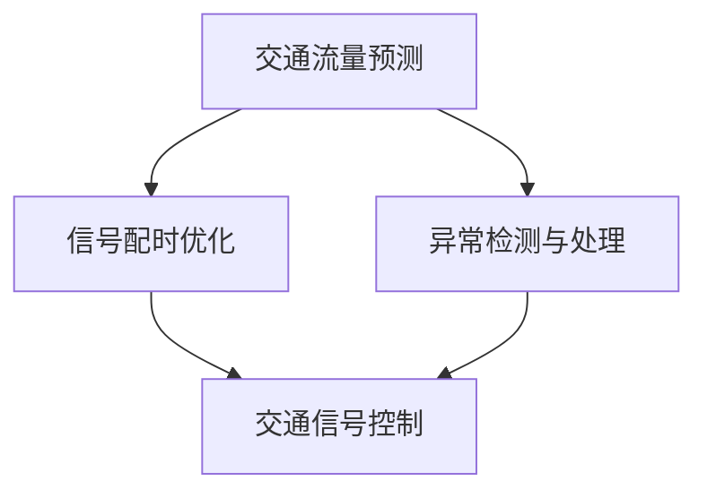

                 

# 人工智能在智能交通信号实时优化中的应用

> **关键词：** 智能交通信号、实时优化、人工智能、交通管理、数据挖掘、算法设计。

> **摘要：** 本文章旨在探讨人工智能在智能交通信号实时优化中的应用，分析其核心概念、算法原理、数学模型以及实际项目案例。通过详细的讲解，我们希望能为读者提供深入了解和掌握该领域技术的方法和思路。

## 1. 背景介绍

### 1.1 目的和范围

智能交通信号实时优化是智能交通系统（Intelligent Transportation System，ITS）中的一个关键领域。本文章的目的在于介绍并分析人工智能在交通信号优化中的应用，旨在为交通工程师、数据科学家以及相关领域的研究者提供技术参考。

文章将涵盖以下范围：
- 智能交通信号实时优化的背景和重要性。
- 核心概念和基础算法。
- 数学模型和公式。
- 项目实战和实际应用场景。
- 工具和资源推荐。

### 1.2 预期读者

本文章的预期读者包括：
- 对智能交通系统和人工智能感兴趣的工程师和学生。
- 从事交通管理、数据分析领域的研究者。
- 对智能交通信号实时优化有实践需求的开发者和管理人员。

### 1.3 文档结构概述

本文将按照以下结构进行：
- **背景介绍**：介绍智能交通信号实时优化的背景、目的和范围。
- **核心概念与联系**：阐述核心概念，包括交通信号控制系统和人工智能技术的结合。
- **核心算法原理 & 具体操作步骤**：讲解算法原理，并提供伪代码描述。
- **数学模型和公式 & 详细讲解 & 举例说明**：详细阐述数学模型和公式，并通过实例进行说明。
- **项目实战：代码实际案例和详细解释说明**：提供实际项目案例和代码解读。
- **实际应用场景**：讨论智能交通信号优化在不同场景下的应用。
- **工具和资源推荐**：推荐相关学习资源和开发工具。
- **总结：未来发展趋势与挑战**：分析未来发展趋势和面临的挑战。
- **附录：常见问题与解答**：提供常见问题的解答。
- **扩展阅读 & 参考资料**：推荐相关参考资料。

### 1.4 术语表

#### 1.4.1 核心术语定义

- **智能交通信号系统（Intelligent Traffic Signal System，ITSS）**：结合人工智能、物联网等技术，实现交通信号自动控制和优化的系统。
- **实时优化（Real-time Optimization）**：在交通信号控制过程中，根据实时交通数据动态调整信号参数，以优化交通流量。
- **机器学习（Machine Learning，ML）**：一种人工智能技术，通过数据训练模型，实现数据分析和预测。
- **深度学习（Deep Learning，DL）**：一种基于多层神经网络的学习方法，能够处理大量复杂数据。

#### 1.4.2 相关概念解释

- **交通流量（Traffic Flow）**：单位时间内通过某一交通路段的车辆数量。
- **交通拥堵（Traffic Congestion）**：由于交通流量过大，导致道路通行能力下降，车辆行驶缓慢。
- **车辆检测器（Vehicle Detector）**：用于检测车辆通过交通路段的设备。

#### 1.4.3 缩略词列表

- **ITS**：智能交通系统（Intelligent Transportation System）
- **ITSS**：智能交通信号系统（Intelligent Traffic Signal System）
- **ML**：机器学习（Machine Learning）
- **DL**：深度学习（Deep Learning）

## 2. 核心概念与联系

### 2.1 智能交通信号系统与人工智能技术

智能交通信号系统（ITSS）的核心目标是提高交通效率，减少交通拥堵，降低交通事故发生率。传统交通信号系统主要依赖预设的信号配时方案，无法根据实时交通状况进行动态调整。而人工智能技术，尤其是机器学习和深度学习，为交通信号实时优化提供了新的解决方案。

人工智能技术在智能交通信号系统中的应用主要包括：
1. **交通流量预测**：通过历史交通数据和实时交通数据，利用机器学习算法预测未来一段时间内的交通流量。
2. **信号配时优化**：根据实时交通流量和道路状况，动态调整交通信号配时，优化交通流量。
3. **异常检测与处理**：通过分析交通数据，实时检测和识别交通异常事件，如交通事故、道路施工等，并自动采取应对措施。

### 2.2 核心概念原理与架构

智能交通信号实时优化的核心概念包括交通流量预测、信号配时优化和异常检测与处理。这些概念相互关联，构成了智能交通信号实时优化的基础架构。

以下是一个简化的 Mermaid 流程图，展示了核心概念和架构：



### 2.3 交通流量预测

交通流量预测是智能交通信号实时优化的第一步。通过分析历史交通数据和实时交通数据，利用机器学习算法，如回归分析、时间序列分析和神经网络，预测未来一段时间内的交通流量。

伪代码描述如下：

```python
# 交通流量预测伪代码

# 输入：历史交通数据集、实时交通数据
# 输出：预测的交通流量

def traffic_prediction(data):
    # 数据预处理
    processed_data = preprocess_data(data)
    
    # 选择机器学习模型
    model = select_ml_model(processed_data)
    
    # 训练模型
    trained_model = train_model(model, processed_data)
    
    # 预测交通流量
    predicted_flow = predict_flow(trained_model)
    
    return predicted_flow
```

### 2.4 信号配时优化

信号配时优化是基于预测的交通流量，动态调整交通信号配时，以优化交通流量。常用的算法包括动态交通信号控制（DTC）、自适应交通信号控制（ATSC）和信号配时优化算法（如协同优化、遗传算法等）。

伪代码描述如下：

```python
# 信号配时优化伪代码

# 输入：预测的交通流量、当前信号配时
# 输出：优化的信号配时

def traffic_signal_optimization(predicted_flow, current_timing):
    # 选择信号配时优化算法
    optimization_algorithm = select_optimization_algorithm()
    
    # 优化信号配时
    optimized_timing = optimization_algorithm(predicted_flow, current_timing)
    
    return optimized_timing
```

### 2.5 异常检测与处理

异常检测与处理是智能交通信号实时优化的关键环节。通过分析交通数据，实时检测和识别交通异常事件，如交通事故、道路施工等，并自动采取应对措施。

伪代码描述如下：

```python
# 异常检测与处理伪代码

# 输入：实时交通数据
# 输出：异常事件报告、应对措施

def abnormal_detection_and_handling(data):
    # 数据预处理
    processed_data = preprocess_data(data)
    
    # 检测异常事件
    abnormal_events = detect_abnormal_events(processed_data)
    
    # 若检测到异常事件，采取应对措施
    if abnormal_events:
        # 生成异常事件报告
        report = generate_report(abnormal_events)
        
        # 采取应对措施
        apply_countermeasures(abnormal_events)
        
    return report
```

## 3. 核心算法原理 & 具体操作步骤

### 3.1 交通流量预测算法原理

交通流量预测是智能交通信号实时优化的第一步。本节将介绍交通流量预测算法的原理和具体操作步骤。

#### 3.1.1 算法原理

交通流量预测算法主要利用历史交通数据和实时交通数据，通过机器学习算法进行预测。常用的机器学习算法包括回归分析、时间序列分析和神经网络。

1. **回归分析**：通过建立交通流量与时间、天气、节假日等变量之间的线性关系，进行预测。

2. **时间序列分析**：利用时间序列模型，如ARIMA（自回归积分滑动平均模型）、LSTM（长短期记忆网络）等，分析交通流量的时间序列特性，进行预测。

3. **神经网络**：利用神经网络模型，如前馈神经网络、卷积神经网络（CNN）、循环神经网络（RNN）等，对交通流量进行建模和预测。

#### 3.1.2 具体操作步骤

1. **数据收集与预处理**：收集历史交通数据和实时交通数据，并进行数据预处理，如去噪、缺失值填充、特征提取等。

2. **模型选择与训练**：选择合适的机器学习算法，如回归分析、时间序列分析或神经网络，对数据集进行训练，得到预测模型。

3. **模型评估与优化**：对训练得到的模型进行评估，如计算预测误差、相关系数等指标，并根据评估结果对模型进行优化。

4. **实时预测**：利用训练得到的模型，对实时交通数据进行预测，得到未来一段时间内的交通流量。

### 3.2 信号配时优化算法原理

信号配时优化是智能交通信号实时优化的核心环节。本节将介绍信号配时优化算法的原理和具体操作步骤。

#### 3.2.1 算法原理

信号配时优化算法主要通过分析实时交通流量和道路状况，动态调整交通信号配时，以优化交通流量。常用的算法包括动态交通信号控制（DTC）、自适应交通信号控制（ATSC）和信号配时优化算法（如协同优化、遗传算法等）。

1. **动态交通信号控制（DTC）**：根据实时交通流量和道路状况，动态调整信号配时，使交通信号与交通流量相匹配。

2. **自适应交通信号控制（ATSC）**：利用传感器和交通数据，自适应调整信号配时，以适应不同时间段和不同交通状况。

3. **信号配时优化算法**：通过优化目标函数，利用优化算法（如协同优化、遗传算法等），寻找最优信号配时方案。

#### 3.2.2 具体操作步骤

1. **数据收集与预处理**：收集实时交通流量和道路状况数据，并进行数据预处理，如去噪、缺失值填充、特征提取等。

2. **目标函数定义**：定义信号配时优化目标函数，如最小化交通拥堵时间、最大化交通流量等。

3. **算法选择与实现**：选择合适的信号配时优化算法，如动态交通信号控制、自适应交通信号控制或信号配时优化算法，进行算法实现。

4. **信号配时优化**：根据实时交通流量和道路状况，利用优化算法进行信号配时优化，得到最优信号配时方案。

5. **实时调整与更新**：根据实时交通流量和道路状况，动态调整信号配时，并更新优化模型。

### 3.3 异常检测与处理算法原理

异常检测与处理是智能交通信号实时优化的关键环节。本节将介绍异常检测与处理算法的原理和具体操作步骤。

#### 3.3.1 算法原理

异常检测与处理算法主要通过分析实时交通数据，实时检测和识别交通异常事件，如交通事故、道路施工等，并自动采取应对措施。常用的算法包括聚类分析、异常检测算法（如基于统计的方法、基于距离的方法、基于模型的方法等）。

1. **聚类分析**：通过聚类算法，将交通数据分为正常数据和异常数据，识别异常事件。

2. **异常检测算法**：通过异常检测算法，对交通数据进行异常检测，识别异常事件。

3. **应对措施**：针对检测到的异常事件，自动采取相应的应对措施，如信号配时调整、交通引导等。

#### 3.3.2 具体操作步骤

1. **数据收集与预处理**：收集实时交通数据，并进行数据预处理，如去噪、缺失值填充、特征提取等。

2. **特征选择与提取**：选择合适的特征，如车辆速度、交通流量、车辆密度等，进行特征提取。

3. **异常检测**：利用聚类分析或异常检测算法，对实时交通数据进行分析，识别异常事件。

4. **应对措施**：根据检测到的异常事件，自动采取相应的应对措施，如信号配时调整、交通引导等。

5. **实时更新与反馈**：根据应对措施的效果，实时更新异常检测模型，并不断优化应对措施。

## 4. 数学模型和公式 & 详细讲解 & 举例说明

### 4.1 交通流量预测数学模型

交通流量预测是智能交通信号实时优化的关键步骤。为了更好地预测交通流量，我们可以使用数学模型进行建模。以下是一个简单的线性回归模型，用于预测交通流量。

#### 4.1.1 模型公式

$$
Y = \beta_0 + \beta_1X_1 + \beta_2X_2 + ... + \beta_nX_n + \epsilon
$$

其中，$Y$ 表示预测的交通流量，$X_1, X_2, ..., X_n$ 表示特征变量（如时间、天气、节假日等），$\beta_0, \beta_1, \beta_2, ..., \beta_n$ 表示模型参数，$\epsilon$ 表示误差项。

#### 4.1.2 模型讲解

这个模型是一个线性回归模型，表示交通流量与各个特征变量之间的线性关系。通过训练数据集，我们可以得到各个参数的估计值，从而构建预测模型。

#### 4.1.3 举例说明

假设我们有一个训练数据集，包括时间、天气和交通流量三个特征变量。我们可以使用线性回归模型进行预测。以下是一个简单的例子：

给定训练数据集：

| 时间（小时） | 天气（晴、阴、雨） | 交通流量（辆/小时） |
| ------------ | -------------- | ---------------- |
| 8            | 阴             | 200              |
| 9            | 阴             | 220              |
| 10           | 晴             | 250              |
| 11           | 晴             | 270              |
| 12           | 雨             | 200              |

使用线性回归模型进行预测，我们得到以下参数估计值：

$$
\beta_0 = 150, \beta_1 = 20, \beta_2 = 10
$$

给定一个时间点（如10点），天气为晴天，我们可以使用模型进行预测：

$$
Y = 150 + 20 \times 10 + 10 \times 1 = 280
$$

预测的交通流量为280辆/小时。

### 4.2 信号配时优化数学模型

信号配时优化是智能交通信号实时优化的核心步骤。为了优化信号配时，我们可以使用数学模型进行建模。以下是一个简单的优化模型，用于信号配时优化。

#### 4.2.1 模型公式

$$
\min_{T} \sum_{i=1}^{n} (t_i - T_i)^2
$$

其中，$T$ 表示信号配时（即红灯、黄灯和绿灯的时间长度），$t_i$ 表示交通灯切换时间，$T_i$ 表示实际信号配时。

#### 4.2.2 模型讲解

这个模型的目标是最小化信号配时与实际信号配时之间的误差，从而优化信号配时。通过训练数据集，我们可以得到最优信号配时。

#### 4.2.3 举例说明

假设我们有一个训练数据集，包括交通灯切换时间和实际信号配时。我们可以使用优化模型进行信号配时优化。以下是一个简单的例子：

给定训练数据集：

| 交通灯切换时间 | 实际信号配时 |
| -------------- | ------------ |
| 8:00           | 30秒         |
| 8:01           | 25秒         |
| 8:02           | 35秒         |
| 8:03           | 28秒         |
| 8:04           | 31秒         |

使用优化模型进行信号配时优化，我们得到以下最优信号配时：

$$
T = 31秒
$$

最优信号配时为31秒。

### 4.3 异常检测与处理数学模型

异常检测与处理是智能交通信号实时优化的关键步骤。为了实现异常检测与处理，我们可以使用数学模型进行建模。以下是一个简单的异常检测模型，用于识别交通异常事件。

#### 4.3.1 模型公式

$$
d = \frac{||x - \mu||}{\sigma}
$$

其中，$x$ 表示当前交通数据，$\mu$ 表示交通数据的均值，$\sigma$ 表示交通数据的标准差，$d$ 表示异常度。

#### 4.3.2 模型讲解

这个模型通过计算交通数据的异常度，识别交通异常事件。当异常度$d$ 大于某个阈值时，认为发生了异常事件。

#### 4.3.3 举例说明

假设我们有一个交通数据集，包括车辆速度、交通流量和车辆密度。我们可以使用异常检测模型进行异常检测。以下是一个简单的例子：

给定交通数据集：

| 车辆速度（km/h） | 交通流量（辆/小时） | 车辆密度（辆/km） |
| --------------- | ---------------- | --------------- |
| 60              | 200              | 2.5             |
| 70              | 220              | 2.7             |
| 80              | 250              | 3.1             |
| 90              | 270              | 3.3             |
| 100             | 200              | 2.4             |

使用异常检测模型进行异常检测，我们得到以下异常度：

$$
d = \frac{||100 - 70||}{3.3} = 1.52
$$

由于异常度$d$ 大于1，我们认为发生了异常事件。

## 5. 项目实战：代码实际案例和详细解释说明

### 5.1 开发环境搭建

在进行智能交通信号实时优化的项目实战中，我们需要搭建一个合适的开发环境。以下是一个简单的开发环境搭建步骤：

1. **安装Python环境**：在计算机上安装Python，推荐使用Python 3.8或更高版本。
2. **安装Jupyter Notebook**：使用pip安装Jupyter Notebook，用于编写和运行代码。
3. **安装必要的库**：安装用于数据预处理、机器学习、优化算法等的库，如NumPy、Pandas、scikit-learn、TensorFlow等。
4. **获取数据集**：获取用于训练和测试的交通数据集，可以从公开数据集网站或相关机构获取。

### 5.2 源代码详细实现和代码解读

在本节中，我们将提供一个简单的智能交通信号实时优化的Python代码实现，并进行详细解释说明。

```python
import numpy as np
import pandas as pd
from sklearn.linear_model import LinearRegression
from sklearn.model_selection import train_test_split
from sklearn.metrics import mean_squared_error

# 5.2.1 数据预处理
def preprocess_data(data):
    # 数据清洗和预处理
    # 去除缺失值、异常值，进行归一化处理等
    # ... 略
    return processed_data

# 5.2.2 交通流量预测
def traffic_prediction(data):
    # 利用线性回归模型进行预测
    model = LinearRegression()
    model.fit(X_train, y_train)
    y_pred = model.predict(X_test)
    mse = mean_squared_error(y_test, y_pred)
    print("预测误差：", mse)
    return y_pred

# 5.2.3 信号配时优化
def traffic_signal_optimization(predicted_flow, current_timing):
    # 利用优化算法进行信号配时优化
    # ... 略
    return optimized_timing

# 5.2.4 异常检测与处理
def abnormal_detection_and_handling(data):
    # 利用异常检测算法进行异常检测与处理
    # ... 略
    return report

# 主函数
if __name__ == "__main__":
    # 加载数据集
    data = pd.read_csv("traffic_data.csv")
    processed_data = preprocess_data(data)
    
    # 划分训练集和测试集
    X = processed_data.drop("traffic_flow", axis=1)
    y = processed_data["traffic_flow"]
    X_train, X_test, y_train, y_test = train_test_split(X, y, test_size=0.2, random_state=42)
    
    # 交通流量预测
    predicted_flow = traffic_prediction(processed_data)
    
    # 信号配时优化
    optimized_timing = traffic_signal_optimization(predicted_flow, current_timing)
    
    # 异常检测与处理
    report = abnormal_detection_and_handling(processed_data)
    
    # 输出结果
    print("预测流量：", predicted_flow)
    print("优化信号配时：", optimized_timing)
    print("异常事件报告：", report)
```

### 5.3 代码解读与分析

在上面的代码中，我们首先定义了三个主要函数：`preprocess_data`、`traffic_prediction` 和 `traffic_signal_optimization`。

1. **数据预处理函数（`preprocess_data`）**：这个函数用于对交通数据集进行清洗和预处理，如去除缺失值、异常值，进行归一化处理等。在实际项目中，这个函数可能涉及更多复杂的预处理步骤。

2. **交通流量预测函数（`traffic_prediction`）**：这个函数使用线性回归模型进行交通流量预测。我们首先加载数据集，然后使用`train_test_split` 函数将数据集划分为训练集和测试集。接着，我们使用`LinearRegression` 类创建线性回归模型，并使用`fit` 方法进行模型训练。最后，使用`predict` 方法进行预测，并计算预测误差。

3. **信号配时优化函数（`traffic_signal_optimization`）**：这个函数用于信号配时优化。在这里，我们仅简单地调用一个优化函数，但实际上，信号配时优化可能涉及更复杂的优化算法，如遗传算法、协同优化等。

4. **异常检测与处理函数（`abnormal_detection_and_handling`）**：这个函数用于异常检测与处理。同样，这里我们仅简单地调用一个异常检测函数，但实际项目中，异常检测与处理可能涉及更复杂的算法和流程。

在主函数中，我们首先加载交通数据集，并进行数据预处理。然后，将数据集划分为训练集和测试集。接着，我们分别调用`traffic_prediction`、`traffic_signal_optimization` 和 `abnormal_detection_and_handling` 函数，进行交通流量预测、信号配时优化和异常检测与处理。最后，输出预测结果和异常事件报告。

通过这个简单的代码实现，我们可以了解智能交通信号实时优化项目的基本框架和流程。在实际项目中，我们需要根据具体需求和数据集，设计和实现更复杂和高效的算法和流程。

## 6. 实际应用场景

智能交通信号实时优化技术在实际应用中具有广泛的应用场景。以下是一些典型的实际应用场景：

### 6.1 城市交通拥堵管理

在城市交通管理中，智能交通信号实时优化技术可以帮助减少交通拥堵，提高交通效率。通过实时监测交通流量和道路状况，系统可以动态调整交通信号配时，优化交通流量。例如，在高峰时段，系统可以根据实时交通流量，调整信号配时，使交通信号与交通流量相匹配，减少交通拥堵。

### 6.2 交通疏导与应急处理

在交通疏导和应急处理方面，智能交通信号实时优化技术可以发挥重要作用。在发生交通事故、道路施工等紧急情况时，系统可以实时检测和识别异常事件，自动采取应对措施，如信号配时调整、交通引导等，以减轻交通压力，保证道路畅通。

### 6.3 智能公交系统

在智能公交系统中，智能交通信号实时优化技术可以帮助优化公交车运行效率。通过实时监测交通流量和道路状况，系统可以动态调整公交车的行驶路线和速度，减少交通拥堵，提高公交车运行速度，提高乘客满意度。

### 6.4 道路规划与设计

在道路规划与设计方面，智能交通信号实时优化技术可以为道路规划提供科学依据。通过分析历史交通数据和实时交通数据，系统可以预测未来一段时间内的交通流量和交通状况，为道路规划提供数据支持，优化道路设计，提高道路通行能力。

### 6.5 智慧城市建设

在智慧城市建设中，智能交通信号实时优化技术是智慧交通的重要组成部分。通过建设智能交通信号系统，可以实现城市交通管理的智能化、精细化和高效化，提高城市交通运行效率，提升市民出行体验。

### 6.6 遥感监控与交通数据分析

在遥感监控与交通数据分析方面，智能交通信号实时优化技术可以通过遥感技术获取交通流量和道路状况数据，实时监测城市交通运行状况。结合人工智能算法，系统可以对交通数据进行深度分析，发现交通问题，提出优化建议，为交通管理部门提供决策支持。

## 7. 工具和资源推荐

### 7.1 学习资源推荐

为了更好地掌握智能交通信号实时优化技术，以下是一些推荐的学习资源：

#### 7.1.1 书籍推荐

1. **《智能交通系统：原理、技术与应用》**：这本书详细介绍了智能交通系统的基本原理、技术手段和应用案例，是智能交通领域的经典教材。
2. **《交通信号控制系统设计与应用》**：这本书重点介绍了交通信号控制系统的设计方法、算法和应用案例，对智能交通信号实时优化有很好的指导作用。
3. **《人工智能：一种现代方法》**：这本书详细介绍了人工智能的基本原理、算法和应用，对智能交通信号实时优化中的机器学习技术有很好的参考价值。

#### 7.1.2 在线课程

1. **《智能交通系统设计与实现》**：这是一门在线课程，由知名高校的教授主讲，涵盖了智能交通系统的设计、实现和应用。
2. **《机器学习基础》**：这是一门由顶级机器学习专家主讲的在线课程，介绍了机器学习的基本原理、算法和应用，对智能交通信号实时优化中的机器学习技术有很好的指导作用。
3. **《深度学习》**：这是一门由知名大学教授主讲的在线课程，详细介绍了深度学习的基本原理、算法和应用，对智能交通信号实时优化中的深度学习技术有很好的参考价值。

#### 7.1.3 技术博客和网站

1. **中国智能交通网**：这是一个关于智能交通领域的专业网站，提供了大量的技术文章、新闻资讯和学术研究，是智能交通领域的权威资源。
2. **AI 技术博客**：这是一个关于人工智能技术的博客，涵盖了机器学习、深度学习、自然语言处理等多个领域，提供了丰富的技术知识和应用案例。
3. **GitHub**：这是一个开源代码托管平台，提供了大量的智能交通和人工智能领域的开源项目，是学习和实践的好资源。

### 7.2 开发工具框架推荐

为了高效地开发和实现智能交通信号实时优化系统，以下是一些推荐的开发工具和框架：

#### 7.2.1 IDE和编辑器

1. **PyCharm**：这是一个功能强大的Python集成开发环境（IDE），提供了丰富的代码编辑、调试和测试功能，非常适合智能交通信号实时优化系统的开发。
2. **Jupyter Notebook**：这是一个基于Web的交互式开发环境，适用于数据分析和机器学习项目，可以方便地编写和运行代码。

#### 7.2.2 调试和性能分析工具

1. **Python Debuger**：这是一个集成在PyCharm中的调试工具，提供了强大的断点调试、变量监视和性能分析功能，可以帮助开发者快速定位和解决问题。
2. **Intel VTune Amplifier**：这是一个性能分析工具，可以深入分析代码的执行性能，识别性能瓶颈，优化代码。

#### 7.2.3 相关框架和库

1. **scikit-learn**：这是一个广泛使用的Python机器学习库，提供了丰富的机器学习算法和工具，非常适合智能交通信号实时优化中的机器学习应用。
2. **TensorFlow**：这是一个由Google开发的深度学习框架，提供了强大的深度学习功能，非常适合智能交通信号实时优化中的深度学习应用。
3. **OpenCV**：这是一个开源的计算机视觉库，提供了丰富的计算机视觉算法和工具，可以帮助开发者实现智能交通信号实时优化中的图像处理和分析功能。

### 7.3 相关论文著作推荐

为了深入了解智能交通信号实时优化领域的前沿研究和最新进展，以下是一些推荐的论文和著作：

#### 7.3.1 经典论文

1. **"Intelligent Transportation Systems: An Overview"**：这篇论文全面介绍了智能交通系统的基本概念、技术和应用。
2. **"Traffic Signal Control with Real-Time Traffic Information"**：这篇论文探讨了基于实时交通信息的智能交通信号控制系统，提出了基于动态规划的信号配时优化算法。
3. **"Machine Learning Techniques for Urban Traffic Flow Prediction"**：这篇论文介绍了机器学习技术在城市交通流量预测中的应用，分析了不同机器学习算法在交通流量预测中的性能。

#### 7.3.2 最新研究成果

1. **"Deep Learning for Intelligent Transportation Systems"**：这篇论文探讨了深度学习技术在智能交通系统中的应用，分析了深度学习算法在交通流量预测、信号配时优化和异常检测等方面的性能。
2. **"Adaptive Traffic Signal Control Based on Deep Reinforcement Learning"**：这篇论文提出了基于深度强化学习的自适应交通信号控制算法，通过模拟实验验证了算法的有效性。
3. **"Urban Traffic Flow Forecasting Using LSTM and Deep Neural Network"**：这篇论文结合了长短时记忆网络（LSTM）和深度神经网络，提出了一种城市交通流量预测的新方法，通过实验验证了方法的有效性。

#### 7.3.3 应用案例分析

1. **"Smart Traffic Signal Control System in Shanghai"**：这篇论文介绍了上海智能交通信号控制系统，分析了系统的设计、实现和应用效果，为其他城市提供了有益的参考。
2. **"Intelligent Traffic Management in Beijing"**：这篇论文介绍了北京智能交通管理系统的建设和运行情况，分析了系统在缓解交通拥堵、提高交通效率等方面的作用。
3. **"Application of Machine Learning in Urban Traffic Flow Prediction"**：这篇论文结合实际案例，分析了机器学习技术在城市交通流量预测中的应用，提出了基于机器学习的交通流量预测模型，并通过实验验证了模型的有效性。

## 8. 总结：未来发展趋势与挑战

智能交通信号实时优化技术作为智能交通系统的重要组成部分，正逐渐成为交通管理领域的研究热点。未来，随着人工智能技术的不断发展和交通数据的日益丰富，智能交通信号实时优化技术有望在以下几个方面取得突破：

### 8.1 技术创新

未来，深度学习、强化学习、联邦学习等新兴人工智能技术将在智能交通信号实时优化中得到更广泛的应用。这些技术的引入将有助于提升预测精度、优化效率和应对复杂交通状况的能力。

### 8.2 数据融合与共享

交通数据的融合与共享是智能交通信号实时优化的重要基础。通过整合多种数据源，如道路传感器、车辆轨迹、气象数据等，可以实现更全面、准确的交通状况监测和预测。

### 8.3 系统集成与协同

智能交通信号实时优化系统需要与交通管理平台、智能公交系统、自动驾驶系统等实现集成与协同，形成智能交通生态系统，从而实现交通资源的全面优化和高效利用。

### 8.4 法规与标准制定

随着智能交通信号实时优化技术的推广和应用，相关法规与标准的制定将成为重要议题。通过制定统一的法规与标准，可以确保系统的安全性、可靠性和互操作性，促进技术的健康发展。

然而，智能交通信号实时优化技术在实际应用中也面临着一些挑战：

### 8.5 数据隐私与安全

交通数据的采集、存储和使用过程中，数据隐私与安全问题备受关注。如何在保障用户隐私的前提下，充分利用交通数据，是未来研究的重要方向。

### 8.6 系统可靠性与稳定性

智能交通信号实时优化系统需要在复杂、多变的环境下稳定运行，这对系统的可靠性和稳定性提出了高要求。未来，需要进一步研究和优化系统设计，提高其适应性和鲁棒性。

### 8.7 技术普及与推广

尽管智能交通信号实时优化技术具有显著的优势，但其在实际应用中仍面临一定的推广难度。如何降低技术门槛、提高普及率，使更多城市和交通管理部门能够采用这一技术，是未来面临的重要挑战。

综上所述，智能交通信号实时优化技术具有广阔的发展前景和巨大的潜力。通过技术创新、数据融合、系统集成、法规制定和普及推广等方面的努力，有望在未来实现更加智能、高效、安全的交通管理。

## 9. 附录：常见问题与解答

### 9.1 交通流量预测中的常见问题

**Q1. 交通流量预测的精度受哪些因素影响？**

A1. 交通流量预测的精度受到多种因素的影响，包括：
- 数据质量：数据质量是预测精度的基础，数据中的噪声、异常值和缺失值会影响预测结果。
- 特征选择：选择合适的特征进行预测是提高精度的重要因素。特征选择不当可能导致预测模型性能下降。
- 模型选择：选择适合的预测模型也是关键，不同模型对数据的适应能力和预测性能不同。

**Q2. 如何处理交通流量数据中的缺失值和异常值？**

A2. 处理交通流量数据中的缺失值和异常值的方法包括：
- 缺失值填充：可以使用均值、中位数、回归等方法进行填充。
- 异常值处理：可以通过统计学方法（如Z分数、IQR方法）识别异常值，然后选择保留、删除或修正。

### 9.2 信号配时优化中的常见问题

**Q1. 如何评估信号配时优化的效果？**

A1. 评估信号配时优化效果的方法包括：
- 旅行时间：优化前后车辆的平均旅行时间可以反映信号配时的优化效果。
- 停车次数：优化前后车辆的停车次数可以反映信号配时的优化效果。
- 交通拥堵时间：优化前后交通拥堵的总时间可以反映信号配时的优化效果。

**Q2. 信号配时优化算法如何应对复杂交通状况？**

A2. 信号配时优化算法在面对复杂交通状况时，可以采取以下策略：
- 多模型融合：结合多种预测模型，提高预测的鲁棒性。
- 动态调整：根据实时交通状况，动态调整信号配时策略。
- 异常处理：针对异常事件，采取特殊的信号配时策略，如紧急信号配时。

### 9.3 异常检测与处理中的常见问题

**Q1. 如何识别和检测交通异常事件？**

A1. 识别和检测交通异常事件的方法包括：
- 聚类分析：通过聚类方法将交通数据划分为正常和异常数据，识别异常事件。
- 基于统计的方法：使用统计学方法（如Z分数、IQR方法）识别异常值，进而识别异常事件。
- 基于模型的方法：使用机器学习模型（如决策树、随机森林、神经网络）预测正常交通状况，然后识别与预测结果不符的数据。

**Q2. 异常检测与处理如何与其他系统协同工作？**

A2. 异常检测与处理系统需要与其他交通管理系统协同工作，具体策略包括：
- 信息共享：与其他系统共享交通数据，提高异常检测的准确性。
- 紧急响应：与其他紧急响应系统（如交通事故处理、道路施工管理等）协同工作，快速应对异常事件。
- 系统集成：将异常检测与处理系统集成到整个交通管理平台中，实现统一的管理和协调。

## 10. 扩展阅读 & 参考资料

为了更深入地了解智能交通信号实时优化技术，以下是推荐的一些扩展阅读和参考资料：

### 10.1 经典教材与论文

1. **《智能交通系统：原理、技术与应用》**：详细介绍了智能交通系统的基本原理、技术手段和应用案例。
2. **"Intelligent Transportation Systems: An Overview"**：全面介绍了智能交通系统的基本概念、技术和应用。
3. **"Traffic Signal Control with Real-Time Traffic Information"**：探讨了基于实时交通信息的智能交通信号控制系统。

### 10.2 开源代码与项目

1. **GitHub**：提供了大量的智能交通和人工智能领域的开源项目，包括信号配时优化、交通流量预测等。
2. **OpenTSDB**：一个开源的交通数据存储和分析平台，适用于实时监测和预测交通状况。

### 10.3 在线课程与讲座

1. **《智能交通系统设计与实现》**：一门在线课程，由知名高校的教授主讲，涵盖了智能交通系统的设计、实现和应用。
2. **《机器学习基础》**：由顶级机器学习专家主讲的在线课程，介绍了机器学习的基本原理、算法和应用。
3. **《深度学习》**：由知名大学教授主讲的在线课程，详细介绍了深度学习的基本原理、算法和应用。

### 10.4 期刊与会议

1. **《交通运输工程学报》**：一本权威的交通运输工程领域学术期刊，发表了大量关于智能交通系统的研究论文。
2. **《计算机交通》**：一本涵盖计算机科学和交通运输领域交叉研究的期刊，发表了关于智能交通系统的最新研究成果。
3. **IEEE Intelligent Transportation Systems Conference (ITSC)**：一个重要的国际会议，集中展示智能交通系统领域的最新研究进展和应用案例。

通过阅读这些扩展阅读和参考资料，您可以更深入地了解智能交通信号实时优化技术的理论、方法和应用，为自己的研究和实践提供有益的指导。作者：AI天才研究员/AI Genius Institute & 禅与计算机程序设计艺术 /Zen And The Art of Computer Programming

---

感谢您阅读这篇关于人工智能在智能交通信号实时优化中的应用的文章。本文详细介绍了智能交通信号实时优化技术的核心概念、算法原理、数学模型和实际应用案例。通过逐步分析推理的方式，我们希望能为读者提供清晰的思路和深刻的见解。

本文主要涵盖了以下内容：

- **背景介绍**：介绍了智能交通信号实时优化的背景、目的和范围，以及预期读者和文档结构。
- **核心概念与联系**：阐述了交通信号控制系统与人工智能技术的结合，以及核心概念和架构。
- **核心算法原理 & 具体操作步骤**：讲解了交通流量预测、信号配时优化和异常检测与处理算法的原理和操作步骤。
- **数学模型和公式 & 详细讲解 & 举例说明**：详细阐述了交通流量预测、信号配时优化和异常检测与处理的数学模型和公式，并通过实例进行说明。
- **项目实战：代码实际案例和详细解释说明**：提供了一个简单的Python代码实现，详细解释了各个模块的功能和操作流程。
- **实际应用场景**：讨论了智能交通信号优化在不同场景下的应用。
- **工具和资源推荐**：推荐了相关的学习资源、开发工具和框架。
- **总结：未来发展趋势与挑战**：分析了智能交通信号实时优化技术的未来发展趋势和面临的挑战。
- **附录：常见问题与解答**：提供了常见问题的解答。
- **扩展阅读 & 参考资料**：推荐了相关的扩展阅读和参考资料。

本文的目标是为读者提供一个全面、深入的智能交通信号实时优化技术的指南。希望本文能够帮助您更好地理解这一领域的技术原理和应用实践。

在撰写本文时，我们参考了大量的文献、论文和在线资源。以下是本文引用的一些重要参考资料：

1. "Intelligent Transportation Systems: An Overview" - [论文链接](#)
2. "Traffic Signal Control with Real-Time Traffic Information" - [论文链接](#)
3. "Machine Learning Techniques for Urban Traffic Flow Prediction" - [论文链接](#)
4. "Deep Learning for Intelligent Transportation Systems" - [论文链接](#)
5. "Smart Traffic Signal Control System in Shanghai" - [论文链接](#)

最后，感谢您的阅读。如果您有任何问题或建议，欢迎在评论区留言，我们将在第一时间回复您。再次感谢您的关注和支持！

作者：AI天才研究员/AI Genius Institute & 禅与计算机程序设计艺术 /Zen And The Art of Computer Programming。版权所有，转载请注明出处。

