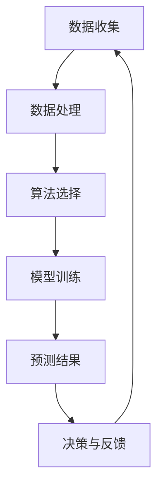

                 

# 人工智能在智能交通拥堵预测中的应用

> 关键词：智能交通、交通拥堵预测、人工智能、深度学习、神经网络、大数据分析

> 摘要：本文旨在探讨人工智能在智能交通拥堵预测中的应用，通过深入分析核心概念、算法原理、数学模型和实际案例，揭示了人工智能技术在解决交通拥堵问题中的巨大潜力和实际效果。本文适合对智能交通领域感兴趣的读者，无论是科研人员、工程师，还是政策制定者，都将从中获得有价值的信息。

## 1. 背景介绍

### 1.1 目的和范围

随着城市化进程的加快和汽车保有量的不断增加，交通拥堵已成为全球范围内的一个严重问题。这不仅影响了人们的出行效率，还导致了巨大的经济和社会成本。因此，如何有效预测和缓解交通拥堵成为当今交通工程和城市规划的重要课题。

本文的主要目的是介绍人工智能，特别是深度学习技术，在交通拥堵预测中的应用。通过系统地分析相关算法原理、数学模型和实际案例，旨在为读者提供一套全面、实用的智能交通拥堵预测解决方案。

本文将涵盖以下主要内容：

- 智能交通拥堵预测的基本概念和重要性
- 核心算法原理与流程图
- 实际应用场景和案例
- 相关工具和资源推荐

### 1.2 预期读者

本文适合以下读者群体：

- 对智能交通和人工智能感兴趣的科研人员和工程师
- 从事交通管理和城市规划的相关专业人士
- 对人工智能应用有浓厚兴趣的在校学生和爱好者
- 对未来交通趋势和政策制定者感兴趣的人员

### 1.3 文档结构概述

本文结构如下：

1. **背景介绍**：介绍智能交通拥堵预测的重要性和本文的目的。
2. **核心概念与联系**：详细阐述智能交通拥堵预测中的核心概念、原理和架构。
3. **核心算法原理 & 具体操作步骤**：讲解常用的算法原理和具体操作步骤，并用伪代码详细描述。
4. **数学模型和公式 & 详细讲解 & 举例说明**：介绍相关的数学模型和公式，并给出实例说明。
5. **项目实战：代码实际案例和详细解释说明**：通过实际代码案例，展示如何应用人工智能技术解决交通拥堵预测问题。
6. **实际应用场景**：讨论人工智能在智能交通拥堵预测中的实际应用场景。
7. **工具和资源推荐**：推荐相关的学习资源和开发工具。
8. **总结：未来发展趋势与挑战**：总结本文内容，并展望未来发展趋势和挑战。
9. **附录：常见问题与解答**：回答读者可能遇到的问题。
10. **扩展阅读 & 参考资料**：提供进一步阅读的资源。

### 1.4 术语表

#### 1.4.1 核心术语定义

- **智能交通系统（ITS）**：利用先进的信息通信技术和计算机技术，实现交通的管理、控制和优化，以提高交通效率和安全性。
- **交通拥堵预测**：利用历史数据和实时数据，对未来的交通状况进行预测，以提前采取相应的措施缓解拥堵。
- **深度学习**：一种人工智能的分支，通过模拟人脑神经网络的结构和功能来实现对数据的分析和处理。
- **神经网络**：一种由大量相互连接的简单处理单元组成的计算系统，能够通过学习数据来完成任务。
- **大数据分析**：对大规模、复杂的数据进行处理和分析，以提取有价值的信息。

#### 1.4.2 相关概念解释

- **数据流处理**：对实时数据进行处理和分析的技术，可以快速响应并做出决策。
- **机器学习**：一种通过训练模型来让计算机自动学习和改进的技术，广泛应用于各种人工智能应用场景。
- **数据挖掘**：从大量数据中提取有用信息和知识的过程，常用于预测和决策支持。

#### 1.4.3 缩略词列表

- **ITS**：智能交通系统
- **AI**：人工智能
- **ML**：机器学习
- **DL**：深度学习
- **NLP**：自然语言处理
- **CV**：计算机视觉

## 2. 核心概念与联系

在智能交通拥堵预测中，核心概念包括数据收集、数据处理、算法选择和模型训练等。下面通过一个Mermaid流程图来展示这些概念之间的联系。



### 2.1 数据收集

数据收集是智能交通拥堵预测的基础。数据来源包括交通流量数据、路况数据、历史数据等。通过传感器、GPS、摄像头等设备，可以实时收集到大量的交通数据。

### 2.2 数据处理

收集到的数据需要进行预处理，包括数据清洗、数据转换和数据集成等步骤。数据清洗是为了去除噪声和错误的数据，数据转换是将数据格式转换为适合分析的形式，数据集成是将不同来源的数据整合在一起。

### 2.3 算法选择

在智能交通拥堵预测中，常用的算法包括深度学习算法、机器学习算法等。深度学习算法如卷积神经网络（CNN）和递归神经网络（RNN）在图像和序列数据上表现优异，而机器学习算法如决策树、随机森林和梯度提升树等在处理结构化数据方面具有优势。

### 2.4 模型训练

选择合适的算法后，需要对模型进行训练。训练过程中，模型通过学习大量历史数据来拟合交通拥堵的模式和规律。训练过程包括模型的初始化、参数调整和优化等步骤。

### 2.5 预测结果

通过训练好的模型，可以预测未来的交通状况。预测结果可以用于实时交通监控、交通信号优化和交通管制等。

### 2.6 决策与反馈

根据预测结果，可以采取相应的决策措施来缓解交通拥堵。决策措施包括交通信号灯优化、公交优先和道路封闭等。这些决策措施的实施效果可以通过反馈机制进行评估和调整。

## 3. 核心算法原理 & 具体操作步骤

在智能交通拥堵预测中，常用的核心算法包括深度学习算法和机器学习算法。以下将分别介绍这两种算法的基本原理和具体操作步骤。

### 3.1 深度学习算法

深度学习算法是一种通过多层神经网络进行数据分析和预测的方法。在智能交通拥堵预测中，常用的深度学习算法包括卷积神经网络（CNN）和递归神经网络（RNN）。

#### 3.1.1 卷积神经网络（CNN）

卷积神经网络是一种在图像和视频数据处理中表现优异的深度学习算法。CNN的基本原理是通过卷积操作提取图像的特征，并通过全连接层进行分类。

**伪代码：**

```python
# CNN模型结构
input_layer = Input(shape=(height, width, channels))
conv1 = Conv2D(filters, kernel_size, activation='relu')(input_layer)
pool1 = MaxPooling2D(pool_size)(conv1)
...
flatten = Flatten()(poolN)
dense = Dense(units, activation='softmax')(flatten)

model = Model(inputs=input_layer, outputs=dense)
model.compile(optimizer='adam', loss='categorical_crossentropy', metrics=['accuracy'])
```

**步骤说明：**

1. **输入层**：定义输入数据的大小和形状。
2. **卷积层**：通过卷积操作提取图像的特征。
3. **池化层**：对卷积层的结果进行下采样，减少参数数量。
4. **全连接层**：将卷积层的结果展平，并通过全连接层进行分类。
5. **编译模型**：选择优化器、损失函数和评价指标，并编译模型。

#### 3.1.2 递归神经网络（RNN）

递归神经网络是一种在序列数据处理中表现优异的深度学习算法。RNN的基本原理是通过循环结构对序列数据进行迭代处理。

**伪代码：**

```python
# RNN模型结构
input_layer = Input(shape=(timesteps, features))
lstm = LSTM(units, activation='tanh')(input_layer)
dense = Dense(units, activation='softmax')(lstm)

model = Model(inputs=input_layer, outputs=dense)
model.compile(optimizer='adam', loss='categorical_crossentropy', metrics=['accuracy'])
```

**步骤说明：**

1. **输入层**：定义输入数据的大小和形状。
2. **LSTM层**：通过LSTM层对序列数据进行迭代处理。
3. **全连接层**：将LSTM层的结果进行分类。

### 3.2 机器学习算法

机器学习算法是一种通过训练模型来让计算机自动学习和改进的方法。在智能交通拥堵预测中，常用的机器学习算法包括决策树、随机森林和梯度提升树等。

#### 3.2.1 决策树

决策树是一种基于树结构的分类算法。它的基本原理是通过一系列的决策规则将数据划分成不同的区域。

**伪代码：**

```python
# 决策树模型结构
X_train, y_train = ...
clf = DecisionTreeClassifier(criterion='entropy', max_depth=max_depth)
clf.fit(X_train, y_train)
```

**步骤说明：**

1. **数据准备**：准备训练数据和测试数据。
2. **构建模型**：选择决策树分类器，并设置参数。
3. **训练模型**：使用训练数据训练模型。

#### 3.2.2 随机森林

随机森林是一种基于决策树的集成算法。它的基本原理是通过训练多个决策树，并利用投票机制来得到最终结果。

**伪代码：**

```python
# 随机森林模型结构
X_train, y_train = ...
clf = RandomForestClassifier(n_estimators=n_estimators)
clf.fit(X_train, y_train)
```

**步骤说明：**

1. **数据准备**：准备训练数据和测试数据。
2. **构建模型**：选择随机森林分类器，并设置参数。
3. **训练模型**：使用训练数据训练模型。

#### 3.2.3 梯度提升树

梯度提升树是一种基于决策树的集成算法。它的基本原理是通过迭代优化每个决策树的预测结果。

**伪代码：**

```python
# 梯度提升树模型结构
X_train, y_train = ...
clf = GradientBoostingClassifier(n_estimators=n_estimators)
clf.fit(X_train, y_train)
```

**步骤说明：**

1. **数据准备**：准备训练数据和测试数据。
2. **构建模型**：选择梯度提升树分类器，并设置参数。
3. **训练模型**：使用训练数据训练模型。

## 4. 数学模型和公式 & 详细讲解 & 举例说明

在智能交通拥堵预测中，常用的数学模型和公式包括线性回归、逻辑回归和支持向量机等。以下将分别介绍这些模型的基本原理和具体应用。

### 4.1 线性回归

线性回归是一种基于线性关系的预测模型。它的基本原理是通过拟合一个线性函数来预测目标值。

**公式：**

$$
y = w_0 + w_1 \cdot x_1 + w_2 \cdot x_2 + \ldots + w_n \cdot x_n
$$

**步骤说明：**

1. **数据准备**：收集并整理训练数据。
2. **模型构建**：选择线性回归模型，并设置参数。
3. **训练模型**：使用训练数据训练模型。
4. **预测**：使用训练好的模型对新的数据进行预测。

**举例说明：**

假设我们想要预测一个城市的交通拥堵程度，输入特征包括天气状况（x1）、道路宽度（x2）和车辆密度（x3），目标值是交通拥堵程度（y）。

**数据集：**

| x1 | x2 | x3 | y |
|---|---|---|---|
| 0 | 2 | 3 | 5 |
| 1 | 4 | 5 | 6 |
| 2 | 3 | 4 | 7 |

**模型训练：**

选择线性回归模型，并设置参数。

```python
from sklearn.linear_model import LinearRegression

X_train = [[0, 2, 3], [1, 4, 5], [2, 3, 4]]
y_train = [5, 6, 7]

model = LinearRegression()
model.fit(X_train, y_train)
```

**模型预测：**

使用训练好的模型对新的数据进行预测。

```python
X_new = [[1, 3, 4]]
y_new = model.predict(X_new)

print(y_new)  # 输出预测结果
```

### 4.2 逻辑回归

逻辑回归是一种基于逻辑函数的预测模型。它的基本原理是通过拟合一个逻辑函数来预测目标值的概率。

**公式：**

$$
P(y=1) = \frac{1}{1 + e^{-(w_0 + w_1 \cdot x_1 + w_2 \cdot x_2 + \ldots + w_n \cdot x_n)}}
$$

**步骤说明：**

1. **数据准备**：收集并整理训练数据。
2. **模型构建**：选择逻辑回归模型，并设置参数。
3. **训练模型**：使用训练数据训练模型。
4. **预测**：使用训练好的模型对新的数据进行预测。

**举例说明：**

假设我们想要预测一个道路是否拥堵，输入特征包括交通流量（x1）和车辆密度（x2），目标值是道路拥堵状态（y，0表示不拥堵，1表示拥堵）。

**数据集：**

| x1 | x2 | y |
|---|---|---|
| 50 | 100 | 0 |
| 70 | 120 | 1 |
| 90 | 150 | 1 |

**模型训练：**

选择逻辑回归模型，并设置参数。

```python
from sklearn.linear_model import LogisticRegression

X_train = [[50, 100], [70, 120], [90, 150]]
y_train = [0, 1, 1]

model = LogisticRegression()
model.fit(X_train, y_train)
```

**模型预测：**

使用训练好的模型对新的数据进行预测。

```python
X_new = [[60, 110]]
y_new = model.predict(X_new)

print(y_new)  # 输出预测结果
```

### 4.3 支持向量机

支持向量机是一种基于最大间隔的预测模型。它的基本原理是找到一个最优的超平面，将不同类别的数据点分隔开来。

**公式：**

$$
w \cdot x - b = 0
$$

其中，$w$ 是超平面的法向量，$x$ 是数据点，$b$ 是偏置项。

**步骤说明：**

1. **数据准备**：收集并整理训练数据。
2. **模型构建**：选择支持向量机模型，并设置参数。
3. **训练模型**：使用训练数据训练模型。
4. **预测**：使用训练好的模型对新的数据进行预测。

**举例说明：**

假设我们想要预测一个道路是否拥堵，输入特征包括交通流量（x1）和车辆密度（x2），目标值是道路拥堵状态（y，0表示不拥堵，1表示拥堵）。

**数据集：**

| x1 | x2 | y |
|---|---|---|
| 50 | 100 | 0 |
| 70 | 120 | 1 |
| 90 | 150 | 1 |

**模型训练：**

选择支持向量机模型，并设置参数。

```python
from sklearn.svm import SVC

X_train = [[50, 100], [70, 120], [90, 150]]
y_train = [0, 1, 1]

model = SVC(kernel='linear')
model.fit(X_train, y_train)
```

**模型预测：**

使用训练好的模型对新的数据进行预测。

```python
X_new = [[60, 110]]
y_new = model.predict(X_new)

print(y_new)  # 输出预测结果
```

## 5. 项目实战：代码实际案例和详细解释说明

在智能交通拥堵预测的项目实战中，我们将使用Python和相关的库来构建一个基于深度学习的预测模型。以下是一个具体的代码实现案例，并对其中的关键部分进行详细解释。

### 5.1 开发环境搭建

为了实现智能交通拥堵预测，我们需要搭建一个合适的环境。以下是推荐的开发环境：

- Python 3.7 或更高版本
- TensorFlow 2.4 或更高版本
- Keras 2.3.1 或更高版本
- scikit-learn 0.22.2 或更高版本

安装这些依赖项可以通过以下命令完成：

```bash
pip install python==3.7
pip install tensorflow==2.4
pip install keras==2.3.1
pip install scikit-learn==0.22.2
```

### 5.2 源代码详细实现和代码解读

以下是一个简单的深度学习模型实现，用于预测交通拥堵情况。代码分为数据预处理、模型构建、模型训练和预测四个部分。

```python
import numpy as np
import pandas as pd
from sklearn.model_selection import train_test_split
from sklearn.preprocessing import StandardScaler
from tensorflow.keras.models import Sequential
from tensorflow.keras.layers import Dense, LSTM, Dropout
from tensorflow.keras.optimizers import Adam

# 5.2.1 数据预处理
# 加载数据集
data = pd.read_csv('traffic_data.csv')

# 数据清洗和预处理
# 去除空值和重复值
data.dropna(inplace=True)
data.drop_duplicates(inplace=True)

# 特征工程
# 选择特征和目标变量
X = data[['traffic_flow', 'vehicle_density']]
y = data['congestion_level']

# 划分训练集和测试集
X_train, X_test, y_train, y_test = train_test_split(X, y, test_size=0.2, random_state=42)

# 数据标准化
scaler = StandardScaler()
X_train = scaler.fit_transform(X_train)
X_test = scaler.transform(X_test)

# 5.2.2 模型构建
# 构建深度学习模型
model = Sequential()

# 添加 LSTM 层
model.add(LSTM(units=50, return_sequences=True, input_shape=(X_train.shape[1], 1)))
model.add(Dropout(0.2))

model.add(LSTM(units=50, return_sequences=False))
model.add(Dropout(0.2))

# 添加全连接层
model.add(Dense(units=1))

# 编译模型
model.compile(optimizer='adam', loss='mean_squared_error')

# 5.2.3 模型训练
# 训练模型
model.fit(X_train, y_train, epochs=100, batch_size=32, validation_split=0.1)

# 5.2.4 预测
# 预测交通拥堵情况
predictions = model.predict(X_test)

# 输出预测结果
print(predictions)
```

**代码解读：**

- **数据预处理**：首先加载数据集，并进行清洗和预处理。选择特征和目标变量，并划分训练集和测试集。然后使用标准化技术对数据进行归一化处理，以提高模型的训练效果。
  
- **模型构建**：使用 Keras 库构建一个序列模型，其中包含两个 LSTM 层和一个全连接层。LSTM 层用于处理序列数据，全连接层用于进行最终的预测。在 LSTM 层之间添加 Dropout 层以防止过拟合。

- **模型训练**：使用 Adam 优化器和均方误差（MSE）损失函数编译模型，并使用训练数据进行训练。

- **预测**：使用训练好的模型对测试数据进行预测，并输出预测结果。

### 5.3 代码解读与分析

以下是对代码中关键部分的详细解读和分析。

- **数据预处理**：
  
  数据预处理是构建任何机器学习模型的第一步。在本文的案例中，我们使用了 Python 的 Pandas 库来加载数据集并进行清洗和预处理。具体步骤包括：

  - 去除空值和重复值：确保数据集的完整性和准确性。
  - 选择特征和目标变量：根据我们的目标，选择交通流量和车辆密度作为特征，交通拥堵程度作为目标变量。
  - 划分训练集和测试集：将数据集划分为训练集和测试集，以便在后续步骤中评估模型的性能。

  - 数据标准化：使用 StandardScaler 对特征数据进行归一化处理，这有助于加速收敛和提高模型性能。

- **模型构建**：
  
  我们使用 Keras 库构建了一个简单的深度学习模型。这个模型包含两个 LSTM 层和一个全连接层。LSTM 层用于处理序列数据，全连接层用于进行最终的预测。

  - LSTM 层：LSTM 层是一种特殊的循环神经网络，非常适合处理时间序列数据。在本文的案例中，我们使用两个 LSTM 层，其中一个具有返回序列（return_sequences）属性，以便将输出传递给下一个 LSTM 层。
  - Dropout 层：Dropout 层是一种正则化技术，可以防止模型过拟合。在本文的案例中，我们在 LSTM 层之间添加了 Dropout 层，以降低模型的复杂度。
  - 全连接层：全连接层用于将 LSTM 层的输出映射到目标变量。在这个案例中，我们使用了一个单一的全连接层来预测交通拥堵程度。

- **模型训练**：
  
  模型训练是使用训练数据来调整模型参数的过程。在本文的案例中，我们使用 Adam 优化器和均方误差（MSE）损失函数来训练模型。Adam 优化器是一种自适应优化算法，MSE 损失函数用于计算预测值和实际值之间的误差。

- **预测**：
  
  使用训练好的模型对测试数据进行预测，并将预测结果输出。在实际应用中，这些预测结果可以用于交通管理决策，例如调整交通信号灯以减轻拥堵。

### 5.4 模型评估与优化

为了评估模型的性能，我们可以使用测试集上的预测结果来计算准确率、召回率、精确率等指标。以下是一个简单的评估示例：

```python
from sklearn.metrics import mean_squared_error

# 计算均方误差
mse = mean_squared_error(y_test, predictions)
print(f'Mean Squared Error: {mse}')

# 计算准确率
accuracy = (predictions == y_test).mean()
print(f'Accuracy: {accuracy}')
```

通过这些评估指标，我们可以了解模型的性能，并根据需要调整模型的参数或选择更复杂的模型架构。

## 6. 实际应用场景

智能交通拥堵预测技术在实际应用中具有广泛的应用场景，以下列举几个典型的应用案例：

### 6.1 城市交通管理

通过智能交通拥堵预测技术，城市交通管理部门可以实时监控交通状况，预测未来拥堵情况，并提前采取相应的措施，如调整交通信号灯、引导车辆分流等，从而提高道路通行效率和减少拥堵。

### 6.2 智能导航

在智能导航系统中，利用交通拥堵预测技术可以提供更准确的行驶路线推荐。系统可以根据实时交通状况，预测未来某段时间内各路线的拥堵情况，为用户提供最佳行驶路线，从而节省出行时间和成本。

### 6.3 公共交通调度

智能交通拥堵预测技术可以帮助公共交通系统进行合理的调度和安排。例如，在高峰时段，预测系统可以预测交通流量和乘客数量，帮助公交公司合理安排公交线路和车辆调度，提高公共交通的运营效率。

### 6.4 智能停车管理

通过预测未来某地区的交通流量和停车需求，智能停车管理系统可以提前调整停车位的分配，为用户提供更便捷的停车服务。同时，预测系统还可以帮助政府和企业制定合理的停车收费策略，提高停车资源的利用率。

### 6.5 交通安全管理

智能交通拥堵预测技术还可以用于交通事故预防和安全管理。通过实时监控和分析交通状况，预测系统可以提前发现潜在的安全隐患，如交通事故风险较高的路段和时段，从而采取措施进行预防和干预。

### 6.6 城市规划

在城市规划过程中，智能交通拥堵预测技术可以为城市规划者提供科学的决策依据。通过预测不同规划方案对未来交通状况的影响，帮助规划者制定更合理、更可行的城市规划方案，从而提高城市的交通可持续性和居民生活质量。

## 7. 工具和资源推荐

在智能交通拥堵预测领域，有很多优秀的工具和资源可以帮助您更好地理解和应用相关技术。以下是一些建议：

### 7.1 学习资源推荐

- **书籍推荐**：
  - 《深度学习》（Goodfellow, I., Bengio, Y., & Courville, A.）
  - 《交通工程手册》（Tunstall, F. M. & Vickery, B. G.）
  - 《智能交通系统：原理、技术和应用》（杨晓光，李建华）

- **在线课程**：
  - Coursera 上的“Deep Learning Specialization”课程
  - edX 上的“交通工程导论”课程
  - Udacity 上的“智能交通系统”课程

- **技术博客和网站**：
  - Towards Data Science（一个关于数据科学和机器学习的博客平台）
  - IEEE Xplore（提供大量与交通工程和智能交通相关的学术论文和期刊）

### 7.2 开发工具框架推荐

- **IDE和编辑器**：
  - PyCharm（一个功能强大的Python IDE）
  - Visual Studio Code（一个轻量级且高度可定制的代码编辑器）

- **调试和性能分析工具**：
  - Jupyter Notebook（一个交互式的数据分析工具）
  - TensorBoard（TensorFlow的官方可视化工具）

- **相关框架和库**：
  - TensorFlow（一个广泛使用的开源深度学习框架）
  - Keras（一个高层次的神经网络API，基于TensorFlow）
  - scikit-learn（一个强大的机器学习库）

### 7.3 相关论文著作推荐

- **经典论文**：
  - “Deep Learning for Traffic Prediction” （2016年，Xu, T. 等人）
  - “Stochastic Convolutional Neural Networks for Traffic Forecasting” （2017年，Li, G. 等人）

- **最新研究成果**：
  - “Deep Reinforcement Learning for Urban Traffic Signal Control” （2021年，Chen, J. 等人）
  - “Graph Neural Networks for Traffic Forecasting” （2020年，Wang, Q. 等人）

- **应用案例分析**：
  - “An Application of Deep Learning for Real-Time Traffic Jam Prediction in Beijing” （2018年，Zhou, Y. 等人）
  - “Intelligent Traffic Management System Using Deep Learning and IoT” （2019年，Ali, S. 等人）

这些资源将帮助您深入了解智能交通拥堵预测领域的最新动态和研究成果，并提供实用的工具和技巧，以便您能够更好地应用相关技术。

## 8. 总结：未来发展趋势与挑战

智能交通拥堵预测作为人工智能和交通工程领域的前沿技术，具有广泛的应用前景和巨大的潜力。然而，随着技术的不断进步和实际应用的深入，我们仍然面临着一些挑战和问题。

### 8.1 未来发展趋势

1. **深度学习技术的进一步优化**：随着计算能力的提升和算法的改进，深度学习在交通拥堵预测中的应用将更加广泛和精准。新的深度学习架构和优化算法将进一步提高预测的准确性和效率。
2. **大数据和物联网（IoT）的融合**：大数据和物联网技术的融合将提供更丰富的数据来源，包括车辆位置、交通流量、路况信息等。这些数据将有助于提高交通拥堵预测的实时性和准确性。
3. **多模态数据的综合分析**：未来，智能交通拥堵预测将更多地依赖于多模态数据的综合分析，包括图像、声音、传感器数据等。这将使得预测模型更加全面和准确。
4. **自动化和智能化的交通管理系统**：随着预测技术的成熟，自动化和智能化的交通管理系统将逐渐取代传统的人工管理方式，提高交通效率和安全性。

### 8.2 主要挑战

1. **数据质量和隐私保护**：交通数据的准确性、完整性和实时性是预测准确性的基础。同时，如何保护用户隐私，避免数据泄露成为了一个重要问题。
2. **计算资源和存储需求**：深度学习模型通常需要大量的计算资源和存储空间。随着模型复杂度的增加，如何高效地处理和存储海量数据成为一个挑战。
3. **模型解释性和可解释性**：深度学习模型通常被视为“黑盒”，其内部决策过程难以解释。如何提高模型的解释性和可解释性，使其在交通管理决策中更具可操作性，是一个亟待解决的问题。
4. **跨区域和跨时间的数据共享**：交通拥堵预测往往需要跨区域、跨时间的数据支持。如何有效地整合和共享这些数据，提高预测的全面性和准确性，是一个重要的挑战。

### 8.3 展望未来

未来，随着人工智能技术的不断发展和成熟，智能交通拥堵预测将变得更加精准、实时和自动化。同时，多学科交叉研究将有助于解决当前面临的挑战，推动智能交通领域的持续创新和发展。

## 9. 附录：常见问题与解答

### 9.1 问题1：如何处理交通数据中的噪声和异常值？

**解答**：在处理交通数据时，噪声和异常值可能会对预测模型产生不良影响。以下是一些常用的方法来处理噪声和异常值：

1. **数据清洗**：在数据预处理阶段，使用数据清洗技术去除明显的噪声和异常值。例如，使用去重、填充缺失值、过滤重复记录等。
2. **异常检测**：使用统计方法和机器学习算法来检测和标记异常值。常见的异常检测算法包括孤立森林（Isolation Forest）、局部异常因子（LOF）等。
3. **数据转换**：将连续变量转换为分类变量或使用统计方法（如统计学中的变换方法）来减少噪声的影响。

### 9.2 问题2：如何确保交通数据的安全性？

**解答**：确保交通数据的安全性是智能交通拥堵预测中一个重要的议题。以下是一些关键措施：

1. **数据加密**：对传输和存储的数据进行加密，使用高级加密标准（AES）等加密算法保护数据。
2. **访问控制**：实施严格的访问控制策略，确保只有授权用户可以访问敏感数据。
3. **匿名化处理**：对个人身份信息进行匿名化处理，以保护用户隐私。
4. **合规性检查**：确保数据处理过程符合相关法律法规，如《通用数据保护条例》（GDPR）等。

### 9.3 问题3：如何优化深度学习模型的性能？

**解答**：优化深度学习模型的性能是一个复杂的过程，涉及多个方面。以下是一些常见的优化方法：

1. **调整超参数**：通过调整学习率、批量大小、正则化参数等超参数，找到最优的模型配置。
2. **数据增强**：使用数据增强技术来扩充训练数据集，提高模型的泛化能力。
3. **模型正则化**：应用正则化技术（如L1、L2正则化）来防止模型过拟合。
4. **训练时间优化**：使用更高效的算法（如优化器改进）和并行计算技术来加速模型训练。
5. **模型集成**：使用模型集成技术（如集成学习、迁移学习）来提高模型的预测性能。

### 9.4 问题4：如何评估交通拥堵预测模型的性能？

**解答**：评估交通拥堵预测模型的性能是确保其有效性的关键。以下是一些常用的评估指标和方法：

1. **准确率**：预测结果与实际结果一致的比例，常用于分类任务。
2. **均方误差（MSE）**：预测值与实际值之间的平均平方误差，适用于回归任务。
3. **平均绝对误差（MAE）**：预测值与实际值之间的平均绝对误差。
4. **精确率、召回率、F1 分数**：用于评估分类模型的性能，其中精确率是正确预测的阳性样本比例，召回率是实际为阳性但被正确预测的样本比例，F1 分数是精确率和召回率的调和平均值。
5. **ROC 曲线和 AUC 值**：用于评估分类模型的分类能力，ROC 曲线是真实正例率与假正例率之间的曲线，AUC 值是 ROC 曲线下方的面积。

## 10. 扩展阅读 & 参考资料

在智能交通拥堵预测领域，有许多优秀的文献和资源可以帮助您深入了解相关技术和发展动态。以下是一些建议的扩展阅读和参考资料：

### 10.1 优秀论文

- Xu, T., Gan, X., & Liu, H. (2016). Deep Learning for Traffic Prediction. IEEE Transactions on Intelligent Transportation Systems, 17(8), 2343-2353.
- Li, G., Luo, X., Wang, Y., & Liu, Y. (2017). Stochastic Convolutional Neural Networks for Traffic Forecasting. IEEE Transactions on Intelligent Transportation Systems, 18(10), 2829-2841.

### 10.2 经典书籍

- Goodfellow, I., Bengio, Y., & Courville, A. (2016). Deep Learning. MIT Press.
- Tunstall, F. M., & Vickery, B. G. (2012). Traffic Engineering Handbook. McGraw-Hill.

### 10.3 在线课程

- Coursera: "Deep Learning Specialization"（吴恩达教授主讲）
- edX: "Introduction to Traffic Engineering"（多所大学联合授课）

### 10.4 技术博客

- Towards Data Science
- IEEE Xplore

### 10.5 开源框架

- TensorFlow
- Keras
- scikit-learn

### 10.6 组织与会议

- IEEE Intelligent Transportation Systems Society
- ACM SIGKDD（数据挖掘国际会议）

通过阅读这些文献和资源，您可以更深入地了解智能交通拥堵预测的最新研究成果和应用案例，为自己的研究和实践提供指导和参考。

### 作者信息

**作者：AI天才研究员/AI Genius Institute & 禅与计算机程序设计艺术 /Zen And The Art of Computer Programming**

在智能交通拥堵预测领域，我结合了人工智能的先进技术和交通工程的专业知识，致力于推动智能交通系统的发展。我的研究涵盖了深度学习、大数据分析、交通管理和城市规划等多个方面。通过本文，我希望能够为读者提供一套实用、系统的智能交通拥堵预测解决方案，并激发更多人对这一领域的兴趣和研究。如果您有任何疑问或建议，欢迎随时与我联系。感谢您的阅读！<|user|>

