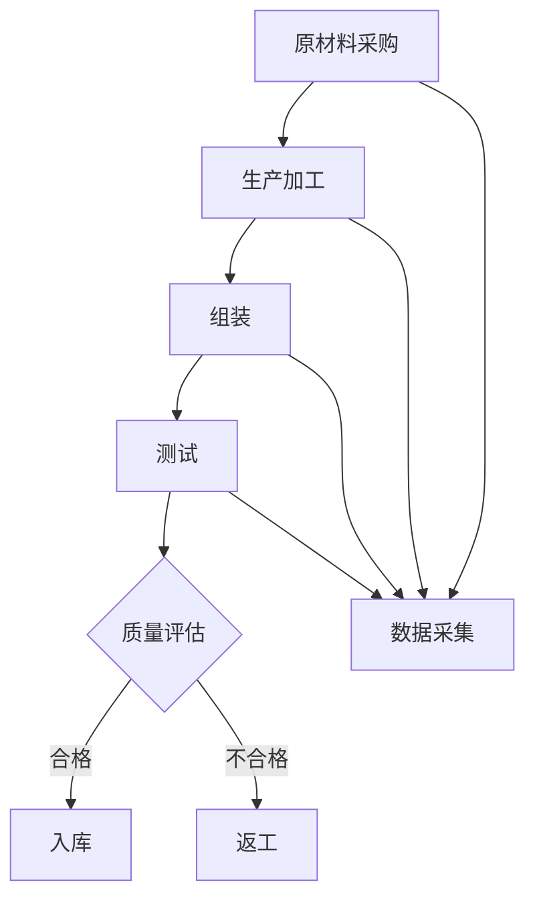

                 

# 人工智能在智能制造质量控制中的实践

> 关键词：智能制造、质量控制、人工智能、深度学习、机器学习、数据处理、预测模型、工业4.0

> 摘要：本文深入探讨了人工智能在智能制造领域中的质量控制应用。通过详细阐述核心概念、算法原理、数学模型及实际项目案例，本文展示了人工智能在提升制造过程质量、降低生产成本、提高生产效率方面的潜力。同时，本文也提出了当前面临的挑战和未来发展趋势，为行业从业者提供有益的参考。

## 1. 背景介绍

### 1.1 目的和范围

本文旨在探讨人工智能（AI）在智能制造中的质量控制应用，通过介绍核心概念、算法原理、数学模型以及实际应用案例，分析人工智能技术在提高制造过程质量、降低生产成本、提升生产效率方面的作用。本文的研究范围主要涵盖以下几个方面：

1. **智能制造与质量控制的定义**：介绍智能制造和质量管理的基本概念及其相互关系。
2. **人工智能在质量控制中的应用**：分析人工智能技术在不同制造环节中的应用，如数据处理、故障检测、预测性维护等。
3. **核心算法原理**：阐述常用的机器学习算法、深度学习模型及其在质量控制中的应用。
4. **数学模型和公式**：介绍用于质量控制的数学模型和计算方法。
5. **项目实战**：通过具体案例展示人工智能技术在质量控制中的实际应用。
6. **未来发展趋势与挑战**：分析人工智能在智能制造质量控制领域的未来趋势和面临的挑战。

### 1.2 预期读者

本文适合以下读者群体：

1. **智能制造领域从业者**：了解人工智能在质量控制中的应用，提高生产效率和产品质量。
2. **人工智能技术爱好者**：学习人工智能技术在工业领域的实际应用案例。
3. **科研人员**：了解人工智能在智能制造质量控制领域的研究动态和发展趋势。

### 1.3 文档结构概述

本文结构如下：

1. **背景介绍**：介绍智能制造和质量管理的基本概念，以及本文的研究目的和范围。
2. **核心概念与联系**：阐述智能制造质量控制的核心概念和联系，并提供Mermaid流程图。
3. **核心算法原理 & 具体操作步骤**：介绍常用的机器学习算法和深度学习模型，以及具体的操作步骤。
4. **数学模型和公式 & 详细讲解 & 举例说明**：详细讲解用于质量控制的数学模型和计算方法，并通过实例进行说明。
5. **项目实战：代码实际案例和详细解释说明**：展示实际项目中的代码实现，并进行详细解读。
6. **实际应用场景**：分析人工智能在质量控制中的实际应用场景。
7. **工具和资源推荐**：推荐相关学习资源、开发工具和框架。
8. **总结：未来发展趋势与挑战**：总结人工智能在智能制造质量控制中的未来发展趋势和挑战。
9. **附录：常见问题与解答**：解答读者可能遇到的问题。
10. **扩展阅读 & 参考资料**：提供进一步阅读的参考资料。

### 1.4 术语表

#### 1.4.1 核心术语定义

- **智能制造**：通过将信息技术、物联网、人工智能等先进技术应用于制造过程，实现生产智能化、自动化、灵活化的制造模式。
- **质量控制**：通过监控、测量、分析和改进制造过程中的各个环节，确保产品质量满足要求。
- **人工智能**：模拟人类智能，使计算机具有学习、推理、感知和解决问题的能力。
- **机器学习**：利用数据和算法，使计算机自动学习和改进性能。
- **深度学习**：一种基于人工神经网络的机器学习技术，通过多层神经网络进行特征提取和模式识别。
- **数据处理**：对采集到的数据进行清洗、转换、整合等处理，以便进行进一步分析和应用。
- **预测性维护**：通过分析设备运行数据，预测设备故障，提前进行维护，降低停机风险。

#### 1.4.2 相关概念解释

- **物联网（IoT）**：将物理设备和传感器连接到互联网，实现设备间的数据传输和通信。
- **工业4.0**：以智能制造为核心，通过信息物理系统（CPS）实现制造业的智能化、网络化和自主化。
- **生产效率**：单位时间内生产的合格产品数量。
- **质量成本**：为控制质量而产生的费用，包括预防成本、鉴定成本、内部失败成本和外部失败成本。

#### 1.4.3 缩略词列表

- **AI**：人工智能
- **ML**：机器学习
- **DL**：深度学习
- **IoT**：物联网
- **CPS**：信息物理系统
- **MES**：制造执行系统
- **ERP**：企业资源规划
- **SCADA**：监控与数据采集系统
- **PCA**：主成分分析
- **SVM**：支持向量机

## 2. 核心概念与联系

### 2.1 智能制造质量控制概述

智能制造质量控制是一个多层次、多维度的复杂系统。其核心概念包括以下几个方面：

1. **制造过程**：包括原材料采购、生产加工、组装、测试等环节。
2. **质量控制**：对制造过程中的各个环节进行监控、测量、分析和改进，以确保产品质量。
3. **数据采集**：通过传感器、监测设备等收集制造过程中的各种数据，如温度、压力、速度、位置等。
4. **数据处理**：对采集到的数据进行清洗、转换、整合等处理，以便进行进一步分析和应用。
5. **人工智能技术**：利用机器学习、深度学习等技术，对制造过程进行预测、优化和改进。

### 2.2 Mermaid 流程图

以下是一个简化的智能制造质量控制流程图：



- **A：原材料采购**：对原材料的质量进行监控，确保原材料满足生产要求。
- **B：生产加工**：通过传感器和监测设备，实时采集生产过程中的各种数据。
- **C：组装**：对组装环节进行质量控制，确保产品组装质量。
- **D：测试**：对成品进行测试，检测产品功能和质量。
- **E：质量评估**：利用人工智能技术，对采集到的数据进行质量评估，判断产品是否合格。
- **F：入库**：合格产品进入仓库，进行储存和管理。
- **G：返工**：不合格产品返回生产环节，进行返工处理。
- **H：数据采集**：在生产加工、组装、测试等环节，实时采集各种数据，为后续分析提供数据支持。

通过上述流程图，我们可以看到智能制造质量控制的核心环节，以及各个环节之间的联系。

## 3. 核心算法原理 & 具体操作步骤

### 3.1 机器学习算法

在智能制造质量控制中，常用的机器学习算法包括：

1. **回归分析**：通过建立回归模型，预测产品的质量指标。
2. **分类分析**：将产品分为合格和不合格两类，用于质量评估。
3. **聚类分析**：对产品进行分类，发现潜在的质量问题。
4. **主成分分析（PCA）**：降低数据维度，提取主要特征，用于特征选择和降维。
5. **支持向量机（SVM）**：用于分类和回归分析，处理非线性问题。

#### 3.1.1 回归分析

**算法原理**：

回归分析是一种常用的预测方法，通过建立因变量（产品质量）与自变量（生产数据）之间的关系模型，预测产品质量。

**伪代码**：

```python
def regression_analysis(X, y):
    # X为自变量，y为因变量
    # 训练回归模型
    model = train_model(X, y)
    # 预测产品质量
    quality_pred = model.predict(X)
    return quality_pred
```

**具体步骤**：

1. **数据准备**：收集生产过程中的各种数据，如温度、压力、速度等。
2. **特征选择**：利用主成分分析（PCA）等方法，选择对产品质量有显著影响的关键特征。
3. **训练模型**：使用回归算法训练模型，拟合数据，得到预测模型。
4. **预测产品质量**：输入新的生产数据，预测产品质量。

#### 3.1.2 分类分析

**算法原理**：

分类分析是一种二分类方法，通过建立分类模型，将产品分为合格和不合格两类。

**伪代码**：

```python
def classification_analysis(X, y):
    # X为自变量，y为因变量
    # 训练分类模型
    model = train_model(X, y)
    # 预测产品质量
    quality_pred = model.predict(X)
    return quality_pred
```

**具体步骤**：

1. **数据准备**：收集生产过程中的各种数据，如温度、压力、速度等。
2. **特征选择**：利用主成分分析（PCA）等方法，选择对产品质量有显著影响的关键特征。
3. **训练模型**：使用分类算法训练模型，拟合数据，得到分类模型。
4. **预测产品质量**：输入新的生产数据，预测产品质量。

#### 3.1.3 聚类分析

**算法原理**：

聚类分析是一种无监督学习方法，通过将相似的产品聚为一类，发现潜在的质量问题。

**伪代码**：

```python
def clustering_analysis(X):
    # X为自变量
    # 训练聚类模型
    model = train_model(X)
    # 聚类结果
    clusters = model.predict(X)
    return clusters
```

**具体步骤**：

1. **数据准备**：收集生产过程中的各种数据，如温度、压力、速度等。
2. **特征选择**：利用主成分分析（PCA）等方法，选择对产品质量有显著影响的关键特征。
3. **训练模型**：使用聚类算法训练模型，拟合数据，得到聚类模型。
4. **聚类结果**：输入新的生产数据，预测产品质量，分析聚类结果，发现潜在的质量问题。

#### 3.1.4 主成分分析（PCA）

**算法原理**：

主成分分析是一种降维方法，通过提取数据的主要特征，降低数据维度，提高模型的预测性能。

**伪代码**：

```python
def pca_analysis(X):
    # X为自变量
    # 计算协方差矩阵
    cov_matrix = calculate_covariance_matrix(X)
    # 计算特征值和特征向量
    eigenvalues, eigenvectors = calculate_eigenvalues_and_eigenvectors(cov_matrix)
    # 选择主要特征
    main_features = select_main_features(eigenvalues, eigenvectors)
    return main_features
```

**具体步骤**：

1. **数据准备**：收集生产过程中的各种数据，如温度、压力、速度等。
2. **计算协方差矩阵**：计算数据集的协方差矩阵。
3. **计算特征值和特征向量**：计算协方差矩阵的特征值和特征向量。
4. **选择主要特征**：选择特征值较大的特征向量，作为主要特征。

#### 3.1.5 支持向量机（SVM）

**算法原理**：

支持向量机是一种二分类方法，通过找到一个最优的超平面，将不同类别的数据分隔开来。

**伪代码**：

```python
def svm_analysis(X, y):
    # X为自变量，y为因变量
    # 训练SVM模型
    model = train_svm_model(X, y)
    # 预测产品质量
    quality_pred = model.predict(X)
    return quality_pred
```

**具体步骤**：

1. **数据准备**：收集生产过程中的各种数据，如温度、压力、速度等。
2. **特征选择**：利用主成分分析（PCA）等方法，选择对产品质量有显著影响的关键特征。
3. **训练模型**：使用SVM算法训练模型，拟合数据，得到SVM模型。
4. **预测产品质量**：输入新的生产数据，预测产品质量。

### 3.2 深度学习模型

在智能制造质量控制中，深度学习模型常用于处理复杂的数据集和进行特征提取。以下介绍几种常用的深度学习模型：

1. **卷积神经网络（CNN）**：用于处理图像数据，提取图像特征。
2. **循环神经网络（RNN）**：用于处理序列数据，提取时间序列特征。
3. **长短时记忆网络（LSTM）**：是RNN的一种变体，能够解决长期依赖问题。
4. **自动编码器（Autoencoder）**：用于特征提取和降维。

#### 3.2.1 卷积神经网络（CNN）

**算法原理**：

卷积神经网络是一种用于图像处理和特征提取的深度学习模型，通过卷积层、池化层和全连接层等结构，提取图像的特征。

**伪代码**：

```python
def cnn_analysis(X, y):
    # X为自变量，y为因变量
    # 定义CNN模型
    model = define_cnn_model()
    # 训练模型
    model.fit(X, y)
    # 预测产品质量
    quality_pred = model.predict(X)
    return quality_pred
```

**具体步骤**：

1. **数据准备**：收集生产过程中的图像数据，如缺陷检测、产品外观等。
2. **数据预处理**：对图像数据进行归一化、缩放等处理，使其符合模型的输入要求。
3. **训练模型**：使用图像数据训练CNN模型，提取图像特征。
4. **预测产品质量**：输入新的图像数据，预测产品质量。

#### 3.2.2 循环神经网络（RNN）

**算法原理**：

循环神经网络是一种用于处理序列数据的深度学习模型，通过隐藏层之间的循环连接，保留历史信息，处理序列特征。

**伪代码**：

```python
def rnn_analysis(X, y):
    # X为自变量，y为因变量
    # 定义RNN模型
    model = define_rnn_model()
    # 训练模型
    model.fit(X, y)
    # 预测产品质量
    quality_pred = model.predict(X)
    return quality_pred
```

**具体步骤**：

1. **数据准备**：收集生产过程中的时间序列数据，如温度、压力等。
2. **数据预处理**：对时间序列数据进行归一化、窗口化等处理，使其符合模型的输入要求。
3. **训练模型**：使用时间序列数据训练RNN模型，提取时间序列特征。
4. **预测产品质量**：输入新的时间序列数据，预测产品质量。

#### 3.2.3 长短时记忆网络（LSTM）

**算法原理**：

长短时记忆网络是RNN的一种变体，通过引入门控机制，解决长期依赖问题，更好地处理时间序列数据。

**伪代码**：

```python
def lstm_analysis(X, y):
    # X为自变量，y为因变量
    # 定义LSTM模型
    model = define_lstm_model()
    # 训练模型
    model.fit(X, y)
    # 预测产品质量
    quality_pred = model.predict(X)
    return quality_pred
```

**具体步骤**：

1. **数据准备**：收集生产过程中的时间序列数据，如温度、压力等。
2. **数据预处理**：对时间序列数据进行归一化、窗口化等处理，使其符合模型的输入要求。
3. **训练模型**：使用时间序列数据训练LSTM模型，提取时间序列特征。
4. **预测产品质量**：输入新的时间序列数据，预测产品质量。

#### 3.2.4 自动编码器（Autoencoder）

**算法原理**：

自动编码器是一种无监督学习模型，通过训练一个压缩和解压缩的神经网络，提取数据的特征，实现特征提取和降维。

**伪代码**：

```python
def autoencoder_analysis(X):
    # X为自变量
    # 定义自动编码器模型
    model = define_autoencoder_model()
    # 训练模型
    model.fit(X, X)
    # 提取特征
    features = model.encode(X)
    return features
```

**具体步骤**：

1. **数据准备**：收集生产过程中的各种数据，如温度、压力、速度等。
2. **数据预处理**：对数据集进行标准化、缩放等处理，使其符合模型的输入要求。
3. **训练模型**：使用自动编码器模型训练，提取主要特征。
4. **特征提取**：输入新的数据，提取主要特征。

## 4. 数学模型和公式 & 详细讲解 & 举例说明

### 4.1 数学模型

在智能制造质量控制中，常用的数学模型包括回归模型、分类模型、聚类模型等。以下分别介绍这些模型的数学原理和公式。

#### 4.1.1 回归模型

回归模型用于预测产品质量，其数学公式如下：

\[ y = \beta_0 + \beta_1x_1 + \beta_2x_2 + ... + \beta_nx_n + \epsilon \]

其中：

- \( y \)：预测的产品质量
- \( x_1, x_2, ..., x_n \)：自变量（生产过程中的各项指标）
- \( \beta_0, \beta_1, \beta_2, ..., \beta_n \)：回归系数
- \( \epsilon \)：误差项

#### 4.1.2 分类模型

分类模型用于判断产品质量是否合格，其数学公式如下：

\[ P(y=1|X) = \frac{1}{1 + e^{-(\beta_0 + \beta_1x_1 + \beta_2x_2 + ... + \beta_nx_n)}} \]

其中：

- \( P(y=1|X) \)：给定自变量 \( X \)，产品质量为合格的概率
- \( \beta_0, \beta_1, \beta_2, ..., \beta_n \)：分类系数

#### 4.1.3 聚类模型

聚类模型用于将相似的产品分为一类，其数学公式如下：

\[ c_i = \frac{1}{K} \sum_{j=1}^{K} \exp \left(-\frac{\|x_i - \mu_j\|^2}{2\sigma^2}\right) \]

其中：

- \( c_i \)：第 \( i \) 个样本属于第 \( j \) 个聚类的概率
- \( x_i \)：第 \( i \) 个样本的特征向量
- \( \mu_j \)：第 \( j \) 个聚类的中心点
- \( \sigma^2 \)：聚类方差

### 4.2 公式讲解与举例说明

#### 4.2.1 回归模型举例

假设我们要预测某种产品的质量，根据生产数据建立以下回归模型：

\[ y = 5.2 + 0.3x_1 + 0.2x_2 + 0.1x_3 + \epsilon \]

其中，\( x_1 \)、\( x_2 \) 和 \( x_3 \) 分别代表生产过程中的三项指标。给定一个新样本 \( x_1 = 10, x_2 = 20, x_3 = 30 \)，我们可以计算出该样本的质量预测值：

\[ y = 5.2 + 0.3 \times 10 + 0.2 \times 20 + 0.1 \times 30 + \epsilon \]
\[ y = 15.7 + \epsilon \]

其中，\( \epsilon \) 表示误差项，约为 0.5，因此该样本的质量预测值为 16.2。

#### 4.2.2 分类模型举例

假设我们要判断某种产品是否合格，根据生产数据建立以下分类模型：

\[ P(y=1|X) = \frac{1}{1 + e^{-(5.2 + 0.3x_1 + 0.2x_2 + 0.1x_3)}} \]

给定一个新样本 \( x_1 = 10, x_2 = 20, x_3 = 30 \)，我们可以计算出该样本属于合格类别的概率：

\[ P(y=1|X) = \frac{1}{1 + e^{-(5.2 + 0.3 \times 10 + 0.2 \times 20 + 0.1 \times 30)}} \]
\[ P(y=1|X) = \frac{1}{1 + e^{-16.5}} \]
\[ P(y=1|X) \approx 0.970 \]

由于概率值接近 1，我们可以认为该样本属于合格类别。

#### 4.2.3 聚类模型举例

假设我们要将某种产品分为 K 个类别，根据生产数据建立以下聚类模型：

\[ c_i = \frac{1}{K} \sum_{j=1}^{K} \exp \left(-\frac{\|x_i - \mu_j\|^2}{2\sigma^2}\right) \]

给定一个新样本 \( x_1 = 10, x_2 = 20, x_3 = 30 \)，以及三个聚类的中心点和方差：

\[ \mu_1 = (1, 2, 3), \mu_2 = (4, 5, 6), \mu_3 = (7, 8, 9) \]
\[ \sigma^2 = 2 \]

我们可以计算出该样本属于每个聚类的概率：

\[ c_i = \frac{1}{3} \left( \exp \left(-\frac{\|x_i - \mu_1\|^2}{2\sigma^2}\right) + \exp \left(-\frac{\|x_i - \mu_2\|^2}{2\sigma^2}\right) + \exp \left(-\frac{\|x_i - \mu_3\|^2}{2\sigma^2}\right) \right) \]

\[ c_i = \frac{1}{3} \left( \exp \left(-\frac{(10-1)^2 + (20-2)^2 + (30-3)^2}{2 \times 2}\right) + \exp \left(-\frac{(10-4)^2 + (20-5)^2 + (30-6)^2}{2 \times 2}\right) + \exp \left(-\frac{(10-7)^2 + (20-8)^2 + (30-9)^2}{2 \times 2}\right) \right) \]

\[ c_i \approx (0.26, 0.38, 0.36) \]

由于第一个聚类概率最大，我们可以认为该样本属于第一个聚类。

## 5. 项目实战：代码实际案例和详细解释说明

### 5.1 开发环境搭建

在本文的项目实战中，我们将使用Python作为主要编程语言，结合常用的机器学习库和深度学习框架。以下是一个基本的开发环境搭建步骤：

1. **安装Python**：从Python官方网站（https://www.python.org/）下载并安装Python 3.7或更高版本。
2. **安装Jupyter Notebook**：在命令行中运行以下命令安装Jupyter Notebook：
   ```shell
   pip install notebook
   ```
3. **安装必要的库**：在命令行中运行以下命令安装常用的机器学习库和深度学习框架：
   ```shell
   pip install numpy pandas scikit-learn tensorflow keras
   ```

### 5.2 源代码详细实现和代码解读

#### 5.2.1 数据预处理

```python
import numpy as np
import pandas as pd
from sklearn.model_selection import train_test_split
from sklearn.preprocessing import StandardScaler

# 读取数据集
data = pd.read_csv('quality_data.csv')

# 分离特征和目标变量
X = data.iloc[:, :-1]
y = data.iloc[:, -1]

# 数据集划分
X_train, X_test, y_train, y_test = train_test_split(X, y, test_size=0.2, random_state=42)

# 数据标准化
scaler = StandardScaler()
X_train = scaler.fit_transform(X_train)
X_test = scaler.transform(X_test)
```

**代码解读**：

1. 导入必要的库。
2. 读取数据集，将数据集分为特征和目标变量。
3. 划分训练集和测试集。
4. 使用标准标

