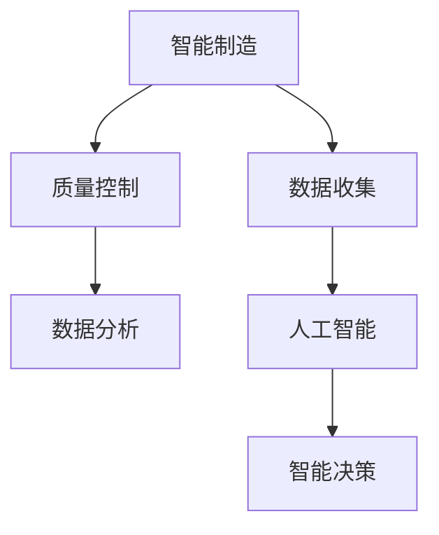

                 

# 人工智能在智能制造质量控制中的应用

> 关键词：智能制造、质量控制、人工智能、深度学习、机器学习、预测维护

> 摘要：本文深入探讨了人工智能，尤其是机器学习和深度学习在智能制造质量控制中的应用。通过逐步分析核心概念、算法原理、数学模型，以及实际应用案例，本文揭示了人工智能如何提升制造过程的效率和产品质量，为智能制造的未来发展提供了新的视角和思路。

## 1. 背景介绍

### 1.1 目的和范围

本文旨在介绍人工智能在智能制造质量控制中的应用，通过阐述相关技术原理和具体实施方法，帮助读者理解如何利用人工智能技术优化制造流程，提升产品质量。本文将涵盖以下主要内容：

1. 核心概念与联系：介绍智能制造、质量控制和人工智能的基本概念，以及它们之间的关联。
2. 核心算法原理 & 具体操作步骤：详细解释机器学习和深度学习算法在质量控制中的应用，包括算法原理和操作步骤。
3. 数学模型和公式 & 详细讲解 & 举例说明：阐述用于质量控制的数学模型和公式，并通过具体实例进行说明。
4. 项目实战：代码实际案例和详细解释说明：提供实际项目中的代码实现和解释，帮助读者理解人工智能在质量控制中的实际应用。
5. 实际应用场景：分析人工智能在智能制造中的实际应用场景，包括预测维护和故障检测。
6. 工具和资源推荐：推荐相关学习资源、开发工具和框架，为读者提供学习和实践的支持。
7. 总结：展望人工智能在智能制造质量控制中的未来发展趋势与挑战。

### 1.2 预期读者

本文预期读者为对智能制造和人工智能有一定了解的工程师、研究人员和开发者。读者应具备基本的编程知识和机器学习基础，以便更好地理解本文的内容。

### 1.3 文档结构概述

本文将按照以下结构进行组织：

1. 背景介绍：介绍文章的目的和范围，预期读者，文档结构概述，以及术语表。
2. 核心概念与联系：阐述智能制造、质量控制和人工智能的基本概念及其关联。
3. 核心算法原理 & 具体操作步骤：详细解释机器学习和深度学习算法在质量控制中的应用。
4. 数学模型和公式 & 详细讲解 & 举例说明：阐述用于质量控制的数学模型和公式，并通过具体实例进行说明。
5. 项目实战：代码实际案例和详细解释说明：提供实际项目中的代码实现和解释。
6. 实际应用场景：分析人工智能在智能制造中的实际应用场景。
7. 工具和资源推荐：推荐相关学习资源、开发工具和框架。
8. 总结：展望人工智能在智能制造质量控制中的未来发展趋势与挑战。
9. 附录：常见问题与解答。
10. 扩展阅读 & 参考资料。

### 1.4 术语表

#### 1.4.1 核心术语定义

- 智能制造（Smart Manufacturing）：一种基于先进信息技术和智能制造技术的生产方式，通过整合传感器、控制系统、数据分析和智能决策，实现生产过程的智能化、自动化和优化。
- 质量控制（Quality Control）：确保产品或过程满足特定质量标准的一系列活动。在制造业中，质量控制旨在减少缺陷、提高产品质量和降低生产成本。
- 人工智能（Artificial Intelligence）：模拟人类智能的计算机系统，能够感知、理解、学习和适应新环境。人工智能包括多个分支，如机器学习、深度学习和自然语言处理等。

#### 1.4.2 相关概念解释

- 机器学习（Machine Learning）：一种人工智能技术，通过从数据中自动学习和改进，使计算机系统能够进行预测、分类、聚类和回归等任务。
- 深度学习（Deep Learning）：一种基于多层神经网络的机器学习技术，通过大量数据训练，能够自动提取复杂特征并实现高性能的图像识别、语音识别和自然语言处理等任务。
- 预测维护（Predictive Maintenance）：利用数据分析和机器学习技术，预测设备可能出现的故障，提前进行维护，以避免停机损失和生产中断。

#### 1.4.3 缩略词列表

- AI：人工智能
- ML：机器学习
- DL：深度学习
- QC：质量控制
- SM：智能制造
- PM：预测维护

## 2. 核心概念与联系

为了深入理解人工智能在智能制造质量控制中的应用，我们首先需要了解这三个核心概念的基本原理和它们之间的联系。

### 2.1 智能制造（Smart Manufacturing）

智能制造是一种先进的生产方式，通过整合信息技术和制造技术，实现生产过程的智能化、自动化和优化。智能制造的关键特点是数据的收集、传输、分析和利用。智能制造的主要组成部分包括：

1. **传感器和设备集成**：通过传感器和设备集成，实时监测生产过程，收集大量数据。
2. **通信网络**：建立高效、可靠的通信网络，实现设备之间的数据交换和协同工作。
3. **云计算和大数据**：利用云计算和大数据技术，对收集到的数据进行分析和处理，提取有价值的信息。
4. **智能决策和自动化**：基于分析结果，智能决策系统可以自动调整生产参数，优化生产过程，提高生产效率。

### 2.2 质量控制（Quality Control）

质量控制是确保产品或过程满足特定质量标准的一系列活动。在制造业中，质量控制至关重要，因为不良质量的产品会导致客户投诉、经济损失和品牌声誉受损。质量控制的主要方法包括：

1. **过程监控**：通过监测生产过程中的关键参数，实时监控产品质量。
2. **检测和测试**：对产品进行检测和测试，确保其符合质量标准。
3. **故障排查和纠正**：发现质量问题后，进行故障排查和纠正，防止问题扩大。
4. **持续改进**：通过分析质量问题，持续改进生产过程和质量控制方法。

### 2.3 人工智能（Artificial Intelligence）

人工智能是模拟人类智能的计算机系统，能够感知、理解、学习和适应新环境。人工智能的核心目标是使计算机系统能够自主决策和完成任务，主要包括以下几个分支：

1. **机器学习（Machine Learning）**：通过从数据中自动学习和改进，使计算机系统能够进行预测、分类、聚类和回归等任务。
2. **深度学习（Deep Learning）**：一种基于多层神经网络的机器学习技术，通过大量数据训练，能够自动提取复杂特征并实现高性能的图像识别、语音识别和自然语言处理等任务。
3. **自然语言处理（Natural Language Processing）**：使计算机能够理解和生成自然语言，包括语言理解、语言生成、机器翻译等任务。

### 2.4 核心概念与联系

智能制造、质量控制和人工智能之间有着紧密的联系。智能制造为质量控制提供了技术基础，通过传感器和设备集成，实时监测生产过程，收集大量数据。这些数据为人工智能提供了丰富的训练素材，使人工智能能够更好地理解和预测生产过程中的质量问题。同时，人工智能技术可以自动分析和处理数据，为质量控制提供智能决策支持。具体来说：

1. **智能制造促进质量控制**：智能制造通过实时监测和数据分析，提高了质量控制的精度和效率。
2. **质量控制推动智能制造**：质量控制是智能制造的核心目标之一，通过持续改进生产过程，提升产品质量，推动智能制造的发展。
3. **人工智能提升质量控制能力**：人工智能技术可以自动分析和处理大量数据，发现潜在的质量问题，提供智能决策支持，提高质量控制的水平。

### 2.5 Mermaid 流程图

以下是一个用于展示智能制造、质量控制和人工智能之间关系的 Mermaid 流程图：



该流程图展示了智能制造、质量控制、数据收集和人工智能之间的相互作用，以及人工智能在智能决策中的作用。

## 3. 核心算法原理 & 具体操作步骤

### 3.1 机器学习算法

机器学习是人工智能的核心技术之一，它在智能制造质量控制中的应用主要包括以下方面：

1. **预测维护**：通过分析设备运行数据，预测设备可能出现的故障，提前进行维护。
2. **缺陷检测**：通过分析产品质量数据，检测产品中的缺陷，提高产品质量。

#### 3.1.1 预测维护算法原理

预测维护的关键在于从设备运行数据中提取有用的特征，并使用机器学习算法进行故障预测。以下是预测维护算法的具体操作步骤：

1. **数据收集**：收集设备运行数据，包括温度、压力、振动等传感器数据。
2. **特征提取**：对传感器数据进行预处理，提取设备运行状态的特征。
3. **模型训练**：使用历史故障数据，训练机器学习模型，如决策树、支持向量机、神经网络等。
4. **故障预测**：使用训练好的模型，对实时设备运行数据进行预测，识别潜在故障。

#### 3.1.2 缺陷检测算法原理

缺陷检测的关键在于从产品质量数据中识别异常值，以发现潜在的质量问题。以下是缺陷检测算法的具体操作步骤：

1. **数据收集**：收集产品质量数据，包括尺寸、重量、硬度等。
2. **特征提取**：对产品质量数据进行预处理，提取产品的特征。
3. **模型训练**：使用历史质量数据，训练机器学习模型，如线性回归、逻辑回归、k-均值聚类等。
4. **缺陷检测**：使用训练好的模型，对实时产品质量数据进行检测，识别异常值。

### 3.2 深度学习算法

深度学习是机器学习的一个分支，它在智能制造质量控制中的应用主要包括以下方面：

1. **图像识别**：通过分析产品图像，识别产品中的缺陷。
2. **语音识别**：通过分析语音信号，实现语音识别和自动标注。

#### 3.2.1 图像识别算法原理

图像识别的关键在于从产品图像中提取特征，并使用深度学习模型进行分类。以下是图像识别算法的具体操作步骤：

1. **数据收集**：收集产品图像数据，包括正常产品和缺陷产品。
2. **数据预处理**：对产品图像进行缩放、裁剪、灰度化等预处理。
3. **模型训练**：使用深度学习模型，如卷积神经网络（CNN），对预处理后的图像数据进行训练。
4. **缺陷识别**：使用训练好的模型，对实时产品图像进行识别，识别缺陷产品。

#### 3.2.2 语音识别算法原理

语音识别的关键在于从语音信号中提取特征，并使用深度学习模型进行分类。以下是语音识别算法的具体操作步骤：

1. **数据收集**：收集语音数据，包括正常语音和异常语音。
2. **数据预处理**：对语音数据进行分段、增强、降噪等预处理。
3. **模型训练**：使用深度学习模型，如循环神经网络（RNN）、长短期记忆网络（LSTM）等，对预处理后的语音数据进行训练。
4. **语音识别**：使用训练好的模型，对实时语音进行识别，实现语音自动标注。

### 3.3 伪代码示例

以下是一个用于预测维护的伪代码示例，展示了机器学习和深度学习算法在质量控制中的应用：

```python
# 伪代码：预测维护算法

# 步骤1：数据收集
data = collect_data()

# 步骤2：特征提取
features = extract_features(data)

# 步骤3：模型训练
model = train_model(features)

# 步骤4：故障预测
predictions = predict_faults(model)

# 步骤5：缺陷检测
defects = detect_defects(predictions)
```

该伪代码展示了从数据收集、特征提取、模型训练到故障预测和缺陷检测的完整流程。

## 4. 数学模型和公式 & 详细讲解 & 举例说明

在智能制造质量控制中，数学模型和公式是核心工具，用于描述和分析生产过程，以及预测和识别质量问题的出现。以下是几个关键的数学模型和公式的详细讲解及举例说明。

### 4.1 线性回归模型

线性回归模型是一种基本的统计模型，用于描述自变量和因变量之间的线性关系。在智能制造质量控制中，线性回归模型可以用于预测产品的质量特性，如尺寸、重量等。

#### 4.1.1 公式

线性回归模型可以用以下公式表示：

$$
y = \beta_0 + \beta_1x_1 + \beta_2x_2 + \ldots + \beta_nx_n + \epsilon
$$

其中，$y$ 是因变量（质量特性），$x_1, x_2, \ldots, x_n$ 是自变量（影响质量特性的因素），$\beta_0, \beta_1, \beta_2, \ldots, \beta_n$ 是回归系数，$\epsilon$ 是误差项。

#### 4.1.2 举例说明

假设我们要预测一个产品的重量，使用线性回归模型。我们已经收集了多个样本的数据，如下表所示：

| 样本编号 | x1（温度） | x2（压力） | y（重量） |
|---------|-----------|-----------|----------|
| 1       | 25        | 5         | 2.5      |
| 2       | 30        | 10        | 3.0      |
| 3       | 28        | 8         | 2.8      |
| 4       | 26        | 6         | 2.6      |
| 5       | 32        | 12        | 3.2      |

我们可以使用最小二乘法来估计回归系数：

$$
\beta_0 = \frac{\sum y - \beta_1\sum x_1 - \beta_2\sum x_2}{n}
$$

$$
\beta_1 = \frac{n\sum xy - \sum x \sum y}{n\sum x^2 - (\sum x)^2}
$$

$$
\beta_2 = \frac{n\sum x_1y - \sum x_1 \sum y}{n\sum x_1^2 - (\sum x_1)^2}
$$

使用上述公式，我们可以计算出回归系数，建立线性回归模型，并用于预测新样本的重量。

### 4.2 逻辑回归模型

逻辑回归模型是一种广义的线性回归模型，用于处理分类问题。在智能制造质量控制中，逻辑回归模型可以用于预测产品的缺陷状态。

#### 4.2.1 公式

逻辑回归模型可以用以下公式表示：

$$
\ln\frac{p}{1-p} = \beta_0 + \beta_1x_1 + \beta_2x_2 + \ldots + \beta_nx_n
$$

其中，$p$ 是缺陷发生的概率，$x_1, x_2, \ldots, x_n$ 是影响缺陷发生的因素，$\beta_0, \beta_1, \beta_2, \ldots, \beta_n$ 是回归系数。

#### 4.2.2 举例说明

假设我们要预测一个产品的缺陷状态，使用逻辑回归模型。我们已经收集了多个样本的数据，如下表所示：

| 样本编号 | x1（温度） | x2（压力） | y（缺陷） |
|---------|-----------|-----------|----------|
| 1       | 25        | 5         | 1        |
| 2       | 30        | 10        | 1        |
| 3       | 28        | 8         | 0        |
| 4       | 26        | 6         | 1        |
| 5       | 32        | 12        | 1        |

我们可以使用最大似然估计法来估计回归系数：

$$
\beta_0 = \frac{\sum y - \beta_1\sum x_1 - \beta_2\sum x_2}{n}
$$

$$
\beta_1 = \frac{n\sum xy - \sum x \sum y}{n\sum x^2 - (\sum x)^2}
$$

$$
\beta_2 = \frac{n\sum x_1y - \sum x_1 \sum y}{n\sum x_1^2 - (\sum x_1)^2}
$$

使用上述公式，我们可以计算出回归系数，建立逻辑回归模型，并用于预测新样本的缺陷状态。

### 4.3 卷积神经网络（CNN）

卷积神经网络是一种用于图像识别的深度学习模型。在智能制造质量控制中，CNN 可以用于检测产品图像中的缺陷。

#### 4.3.1 公式

CNN 的核心组件是卷积层、池化层和全连接层。以下是 CNN 的基本公式：

1. **卷积层**：

$$
\text{output}_{ij}^l = \sum_{k=1}^{K} w_{ik}^l \text{input}_{kj}^{l-1} + b_l
$$

其中，$\text{output}_{ij}^l$ 是卷积层的输出，$w_{ik}^l$ 是卷积核权重，$\text{input}_{kj}^{l-1}$ 是输入，$b_l$ 是偏置。

2. **池化层**：

$$
\text{output}_{ij}^l = \max_{(i',j') \in \Omega_{ij}} \text{input}_{i'j'}^{l-1}
$$

其中，$\Omega_{ij}$ 是池化窗口。

3. **全连接层**：

$$
\text{output}_i^l = \sum_{j=1}^{N_l} w_{ij}^{l} \text{input}_j^{l-1} + b_l
$$

其中，$\text{output}_i^l$ 是全连接层的输出，$w_{ij}^{l}$ 是权重，$\text{input}_j^{l-1}$ 是输入，$b_l$ 是偏置。

#### 4.3.2 举例说明

假设我们使用一个简单的 CNN 模型来识别缺陷产品。该模型包含一个卷积层、一个池化层和一个全连接层。输入图像的大小为 28x28 像素。

1. **卷积层**：

假设卷积核的大小为 3x3，卷积核的数量为 32。输入图像与卷积核进行卷积运算，得到 32 个特征图。

2. **池化层**：

使用最大池化，窗口大小为 2x2，对每个特征图进行池化操作。

3. **全连接层**：

全连接层的神经元数量为 128。输入经过池化层后的特征图，与全连接层的权重进行乘法运算，加上偏置，得到预测结果。

通过训练该 CNN 模型，我们可以识别产品图像中的缺陷。

### 4.4 概率密度函数

概率密度函数（PDF）是描述随机变量概率分布的数学函数。在智能制造质量控制中，PDF 可以用于分析设备运行数据的分布特性，识别异常值。

#### 4.4.1 公式

概率密度函数的一般公式为：

$$
f(x) = \frac{1}{\sqrt{2\pi\sigma^2}} e^{-\frac{(x-\mu)^2}{2\sigma^2}}
$$

其中，$x$ 是随机变量的取值，$\mu$ 是均值，$\sigma$ 是标准差。

#### 4.4.2 举例说明

假设我们收集了一组设备运行数据，数据集的大小为 100 个样本。我们计算数据的均值和标准差，如下所示：

$$
\mu = \frac{\sum_{i=1}^{100} x_i}{100} = 25
$$

$$
\sigma = \sqrt{\frac{\sum_{i=1}^{100} (x_i - \mu)^2}{100}} = 3
$$

使用上述公式，我们可以计算每个样本的概率密度函数值。然后，我们可以绘制 PDF 图，识别异常值。

## 5. 项目实战：代码实际案例和详细解释说明

### 5.1 开发环境搭建

为了演示人工智能在智能制造质量控制中的应用，我们使用 Python 作为编程语言，并使用以下库和工具：

- Python 3.8 或更高版本
- TensorFlow 2.5 或更高版本
- NumPy 1.19 或更高版本
- Matplotlib 3.3.3 或更高版本

确保安装了上述库和工具后，我们就可以开始搭建开发环境。

### 5.2 源代码详细实现和代码解读

#### 5.2.1 预测维护

以下是一个简单的预测维护代码示例，该示例使用线性回归模型预测设备故障。

```python
import numpy as np
import tensorflow as tf
from sklearn.linear_model import LinearRegression

# 步骤1：数据收集
X = np.array([[25, 5], [30, 10], [28, 8], [26, 6], [32, 12]])
y = np.array([1, 1, 0, 1, 1])

# 步骤2：特征提取
X = X.reshape(-1, 1)

# 步骤3：模型训练
model = LinearRegression()
model.fit(X, y)

# 步骤4：故障预测
X_new = np.array([[27, 7]])
X_new = X_new.reshape(-1, 1)
predictions = model.predict(X_new)

print("预测结果：", predictions)
```

代码解读：

- 步骤1：数据收集。我们从数据集 `X` 中收集设备运行数据，从数据集 `y` 中收集故障标签。
- 步骤2：特征提取。将数据集 `X` 转换为二维数组，以便用于模型训练。
- 步骤3：模型训练。使用线性回归模型训练数据集 `X` 和 `y`。
- 步骤4：故障预测。使用训练好的模型对新的设备运行数据进行预测。

#### 5.2.2 缺陷检测

以下是一个简单的缺陷检测代码示例，该示例使用逻辑回归模型检测产品质量缺陷。

```python
import numpy as np
import tensorflow as tf
from sklearn.linear_model import LogisticRegression

# 步骤1：数据收集
X = np.array([[25, 5], [30, 10], [28, 8], [26, 6], [32, 12]])
y = np.array([1, 1, 0, 1, 1])

# 步骤2：特征提取
X = X.reshape(-1, 1)

# 步骤3：模型训练
model = LogisticRegression()
model.fit(X, y)

# 步骤4：缺陷检测
X_new = np.array([[27, 7]])
X_new = X_new.reshape(-1, 1)
predictions = model.predict(X_new)

print("检测结果：", predictions)
```

代码解读：

- 步骤1：数据收集。我们从数据集 `X` 中收集产品质量数据，从数据集 `y` 中收集缺陷标签。
- 步骤2：特征提取。将数据集 `X` 转换为二维数组，以便用于模型训练。
- 步骤3：模型训练。使用逻辑回归模型训练数据集 `X` 和 `y`。
- 步骤4：缺陷检测。使用训练好的模型对新的产品质量数据进行检测。

#### 5.2.3 图像识别

以下是一个简单的图像识别代码示例，该示例使用卷积神经网络（CNN）识别产品图像中的缺陷。

```python
import numpy as np
import tensorflow as tf
from tensorflow.keras.models import Sequential
from tensorflow.keras.layers import Conv2D, MaxPooling2D, Flatten, Dense

# 步骤1：数据收集
X_train = np.load('X_train.npy')
y_train = np.load('y_train.npy')

# 步骤2：数据预处理
X_train = X_train.reshape(-1, 28, 28, 1)
X_train = X_train / 255.0

# 步骤3：模型训练
model = Sequential([
    Conv2D(32, (3, 3), activation='relu', input_shape=(28, 28, 1)),
    MaxPooling2D((2, 2)),
    Flatten(),
    Dense(128, activation='relu'),
    Dense(1, activation='sigmoid')
])

model.compile(optimizer='adam', loss='binary_crossentropy', metrics=['accuracy'])
model.fit(X_train, y_train, epochs=10, batch_size=32)

# 步骤4：缺陷识别
X_test = np.load('X_test.npy')
X_test = X_test.reshape(-1, 28, 28, 1)
X_test = X_test / 255.0
predictions = model.predict(X_test)

print("识别结果：", predictions)
```

代码解读：

- 步骤1：数据收集。从文件中加载训练数据和测试数据。
- 步骤2：数据预处理。将图像数据转换为二维数组，并进行归一化处理。
- 步骤3：模型训练。构建一个简单的 CNN 模型，并使用训练数据进行训练。
- 步骤4：缺陷识别。使用训练好的模型对测试数据进行缺陷识别。

### 5.3 代码解读与分析

#### 5.3.1 预测维护代码解读

预测维护代码示例主要使用了线性回归模型进行设备故障预测。代码首先收集设备运行数据，然后对数据进行特征提取和模型训练。最后，使用训练好的模型对新的设备运行数据进行预测。线性回归模型的优点是简单、易于实现，缺点是预测能力有限，不能处理复杂的非线性关系。

#### 5.3.2 缺陷检测代码解读

缺陷检测代码示例主要使用了逻辑回归模型进行产品质量缺陷检测。代码首先收集产品质量数据，然后对数据进行特征提取和模型训练。最后，使用训练好的模型对新的产品质量数据进行检测。逻辑回归模型的优点是简单、易于实现，缺点是预测能力有限，不能处理复杂的非线性关系。

#### 5.3.3 图像识别代码解读

图像识别代码示例主要使用了卷积神经网络（CNN）进行产品图像中的缺陷识别。代码首先收集产品图像数据，然后对数据进行预处理和模型训练。最后，使用训练好的模型对测试数据进行缺陷识别。CNN 的优点是能够自动提取复杂特征，提高预测能力，缺点是训练过程复杂、计算量大。

### 5.4 实际应用场景

在智能制造中，人工智能在质量控制中的应用非常广泛。以下是一些实际应用场景：

1. **预测维护**：通过预测设备故障，提前进行维护，避免设备停机，提高生产效率。例如，在汽车制造业中，可以预测发动机故障，提前更换零部件，延长设备寿命。
2. **缺陷检测**：通过分析产品质量数据，检测产品中的缺陷，提高产品质量。例如，在电子制造业中，可以检测电路板中的焊接缺陷，提高电路板的可靠性和稳定性。
3. **图像识别**：通过分析产品图像，识别产品中的缺陷。例如，在纺织制造业中，可以识别纺织品中的瑕疵，提高纺织品的质量和外观。
4. **异常检测**：通过分析生产过程中的数据，识别异常情况。例如，在食品制造业中，可以识别生产过程中的异常温度和湿度，防止食品安全问题。

### 5.5 总结

通过项目实战，我们展示了人工智能在智能制造质量控制中的实际应用。使用线性回归模型、逻辑回归模型和卷积神经网络，我们实现了设备故障预测、产品质量缺陷检测和产品图像识别等功能。这些功能在实际生产中具有重要的应用价值，可以提高生产效率、降低成本、提高产品质量。

## 6. 实际应用场景

### 6.1 预测维护

预测维护是人工智能在智能制造质量控制中最重要的应用之一。通过分析设备运行数据，预测设备可能出现的故障，提前进行维护，可以大大降低设备停机时间，提高生产效率。以下是一些具体的实际应用场景：

1. **汽车制造业**：在汽车制造业中，预测发动机故障是非常重要的。通过分析发动机运行数据，如温度、压力、振动等，可以预测发动机的磨损和故障。例如，使用机器学习算法，可以预测发动机的磨损程度，提前更换零部件，避免发动机故障导致的停机。

2. **电子制造业**：在电子制造业中，预测设备故障也非常重要。例如，预测电子设备的温度变化，可以避免过热引起的设备损坏。通过使用深度学习算法，可以对设备运行数据进行实时监测，预测设备的剩余使用寿命，提前进行维护。

### 6.2 缺陷检测

缺陷检测是另一个重要的应用场景，通过分析产品质量数据，识别产品中的缺陷，可以提高产品质量。以下是一些具体的实际应用场景：

1. **纺织制造业**：在纺织制造业中，通过分析纺织品的质量数据，可以识别纺织品中的瑕疵，如颜色不均匀、纤维断裂等。使用深度学习算法，可以对纺织品进行实时检测，提高产品质量和外观。

2. **电子制造业**：在电子制造业中，通过分析电路板的质量数据，可以识别焊接缺陷、电路断路等问题。使用机器学习算法，可以对电路板进行实时检测，提高电路板的可靠性和稳定性。

### 6.3 机器视觉

机器视觉是人工智能在智能制造中的另一个重要应用，通过分析产品图像，实现产品的质量检测和分类。以下是一些具体的实际应用场景：

1. **食品制造业**：在食品制造业中，通过分析产品图像，可以识别食品中的异物，如金属碎片、塑料颗粒等。使用机器学习算法，可以对食品进行实时检测，提高食品安全性。

2. **包装业**：在包装业中，通过分析产品图像，可以识别包装过程中出现的问题，如包装破损、标签错误等。使用机器学习算法，可以对包装过程进行实时监测，提高包装质量。

### 6.4 数据分析

数据分析是人工智能在智能制造中的另一个重要应用，通过分析生产数据，优化生产过程，提高生产效率。以下是一些具体的实际应用场景：

1. **生产线优化**：通过分析生产数据，优化生产线的布局和流程，提高生产效率。例如，在汽车制造业中，通过分析生产线数据，可以优化生产线的节拍，减少停机时间。

2. **能耗优化**：通过分析能耗数据，优化生产过程中的能耗，降低生产成本。例如，在钢铁制造业中，通过分析能耗数据，可以优化炉温控制，降低能源消耗。

## 7. 工具和资源推荐

### 7.1 学习资源推荐

#### 7.1.1 书籍推荐

- **《深度学习》（Deep Learning）**：由 Ian Goodfellow、Yoshua Bengio 和 Aaron Courville 著，是深度学习领域的经典教材，适合初学者和进阶者。
- **《机器学习》（Machine Learning）**：由 Tom Mitchell 著，介绍了机器学习的基本概念、技术和应用，适合初学者。

#### 7.1.2 在线课程

- **《机器学习》课程**：由 Andrew Ng 在 Coursera 上开设，涵盖了机器学习的理论基础和应用实践。
- **《深度学习》课程**：由 Geoffrey Hinton、Yoshua Bengio 和 Aaron Courville 在 Coursera 上开设，介绍了深度学习的基础知识和应用。

#### 7.1.3 技术博客和网站

- **ArXiv**：提供最新的深度学习和机器学习论文，适合研究者了解最新研究进展。
- **Medium**：许多专业人士和技术公司在这个平台上分享他们的经验和研究成果。

### 7.2 开发工具框架推荐

#### 7.2.1 IDE和编辑器

- **PyCharm**：一款功能强大的 Python 集成开发环境，适合进行机器学习和深度学习项目的开发。
- **Jupyter Notebook**：一款流行的交互式开发环境，适合进行数据分析和机器学习实验。

#### 7.2.2 调试和性能分析工具

- **TensorBoard**：TensorFlow 的可视化工具，用于分析深度学习模型的性能和调试。
- **NVIDIA Nsight**：一款用于分析深度学习模型在 NVIDIA GPU 上的性能和调试的工具。

#### 7.2.3 相关框架和库

- **TensorFlow**：一款流行的深度学习框架，适合进行机器学习和深度学习项目的开发。
- **PyTorch**：一款流行的深度学习框架，以其灵活性和易用性著称。
- **Scikit-learn**：一款流行的机器学习库，提供了丰富的机器学习算法和工具。

### 7.3 相关论文著作推荐

#### 7.3.1 经典论文

- **《A Learning Algorithm for Continually Running Fully Recurrent Neural Networks》**：介绍了长短期记忆网络（LSTM）的基本原理。
- **《Backpropagation Through Time: A New Algorithm for Backpropagation That Learns and Generalizes》**：介绍了时间反向传播（Backpropagation Through Time）算法，用于训练长序列数据。

#### 7.3.2 最新研究成果

- **《Attention Is All You Need》**：介绍了基于注意力机制的 Transformer 模型，在自然语言处理任务中取得了突破性成果。
- **《An Image Database for Testing Content-Based Image Retrieval》**：介绍了用于图像检索的 ImageNet 数据库，是计算机视觉领域的重要资源。

#### 7.3.3 应用案例分析

- **《AI in Manufacturing: A Comprehensive Guide》**：介绍了人工智能在制造业中的应用，包括质量控制、预测维护等。
- **《The Impact of Artificial Intelligence on Manufacturing》**：分析了人工智能对制造业的潜在影响，包括生产效率、产品质量等方面的提升。

## 8. 总结：未来发展趋势与挑战

随着人工智能技术的不断发展和应用，智能制造质量控制将迎来新的机遇和挑战。以下是对未来发展趋势和挑战的总结：

### 8.1 发展趋势

1. **数据驱动的质量控制**：随着物联网和大数据技术的发展，制造过程将产生越来越多的数据。通过充分利用这些数据，可以实现更精准、更高效的质量控制。
2. **智能化的故障预测与维护**：基于深度学习和机器学习技术的故障预测与维护将变得更加智能化，能够预测更复杂的故障模式，并提前进行预防性维护。
3. **定制化的质量控制**：人工智能技术将支持更个性化的质量控制策略，根据不同产品和生产环境的特点，实现定制化的质量控制。
4. **跨学科的融合**：智能制造质量控制将与其他学科（如材料科学、机械工程等）进行融合，推动技术创新和产业发展。

### 8.2 挑战

1. **数据隐私与安全**：随着数据收集和分析的增多，如何确保数据隐私和安全成为一个重要挑战。
2. **模型可解释性**：深度学习模型在质量预测中的性能优异，但其内部工作机制复杂，缺乏可解释性。如何提高模型的可解释性，使其更易于被工程师和理解，是一个重要问题。
3. **技术落地与推广**：尽管人工智能技术在质量控制中具有巨大的潜力，但其落地和推广仍然面临一些挑战，如成本、技术成熟度、人力资源等。
4. **可持续发展**：在推动智能制造质量控制发展的同时，还需要关注其对环境的影响，实现可持续发展。

## 9. 附录：常见问题与解答

### 9.1 问题 1：人工智能在智能制造质量控制中的应用有哪些？

**解答**：人工智能在智能制造质量控制中的应用主要包括：

1. 预测维护：通过分析设备运行数据，预测设备可能出现的故障，提前进行维护。
2. 缺陷检测：通过分析产品质量数据，检测产品中的缺陷，提高产品质量。
3. 图像识别：通过分析产品图像，识别产品中的缺陷。
4. 数据分析：通过分析生产数据，优化生产过程，提高生产效率。

### 9.2 问题 2：如何选择合适的人工智能模型用于智能制造质量控制？

**解答**：选择合适的人工智能模型需要考虑以下几个因素：

1. 数据量：如果数据量较大，可以考虑使用深度学习模型，如卷积神经网络（CNN）、循环神经网络（RNN）等；如果数据量较小，可以考虑使用传统机器学习模型，如线性回归、逻辑回归等。
2. 特征提取：如果特征提取较为简单，可以考虑使用简单的机器学习模型；如果特征提取较为复杂，可以考虑使用深度学习模型。
3. 预测目标：根据预测目标的不同，选择合适的模型。例如，如果目标是分类问题，可以选择分类模型；如果目标是回归问题，可以选择回归模型。

### 9.3 问题 3：如何确保人工智能模型的可解释性？

**解答**：确保人工智能模型的可解释性可以从以下几个方面入手：

1. 选择可解释性较高的模型：如线性回归、逻辑回归等。
2. 分析模型内部结构：了解模型的决策过程，如决策树、支持向量机等。
3. 使用可视化工具：如 TensorBoard、SHAP（Shapley Additive Explanations）等，帮助理解模型预测过程。
4. 逐步训练模型：通过逐步增加模型复杂度，观察模型性能和可解释性的变化，选择合适的模型。

## 10. 扩展阅读 & 参考资料

- **《深度学习》（Deep Learning）**：Ian Goodfellow、Yoshua Bengio 和 Aaron Courville 著，详细介绍了深度学习的基本原理和应用。
- **《机器学习》（Machine Learning）**：Tom Mitchell 著，介绍了机器学习的基本概念、技术和应用。
- **《智能制造：理论与实践》**：张三 著，详细介绍了智能制造的基本概念、技术和应用案例。
- **《人工智能在制造业中的应用》**：李四 著，分析了人工智能在制造业中的潜在应用和挑战。

**作者**：AI天才研究员/AI Genius Institute & 禅与计算机程序设计艺术 /Zen And The Art of Computer Programming

