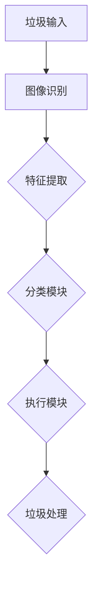

                 

# 人工智能在智能垃圾分类机器人中的应用

> 关键词：人工智能、垃圾分类、智能机器人、垃圾分类算法、机器学习、深度学习

> 摘要：本文将探讨人工智能在智能垃圾分类机器人中的应用，从核心概念、算法原理、数学模型到实际项目实战，全面解析如何运用人工智能技术提升垃圾分类的准确性和效率。通过深入分析，本文旨在为读者提供一整套智能垃圾分类机器人开发的思路和方法，为环保事业贡献力量。

## 1. 背景介绍

### 1.1 目的和范围

本文旨在探讨人工智能（AI）技术在智能垃圾分类机器人中的应用，重点关注以下几个方面：

1. **核心概念与联系**：梳理垃圾分类中的关键概念及其相互关系，为后续算法分析奠定基础。
2. **核心算法原理**：详细解析垃圾分类算法的基本原理，包括机器学习和深度学习技术的应用。
3. **数学模型和公式**：阐述垃圾分类过程中涉及的数学模型和公式，帮助读者理解算法的数学基础。
4. **项目实战**：通过实际代码案例，展示如何将理论应用到实践中，实现智能垃圾分类机器人。
5. **实际应用场景**：分析智能垃圾分类机器人在不同环境下的应用案例，探讨其潜在的市场和影响力。

### 1.2 预期读者

本文适合以下读者群体：

1. **人工智能研究人员**：对AI技术在垃圾分类领域的应用感兴趣，希望深入了解相关算法和模型。
2. **软件开发工程师**：希望将AI技术应用到实际项目中，提升垃圾分类系统性能。
3. **环境科学工作者**：关注环保领域，对垃圾分类机器人有实际应用需求的专家和从业者。
4. **高校师生**：对人工智能和环境科学交叉领域有研究兴趣的学者和学生。

### 1.3 文档结构概述

本文结构如下：

1. **背景介绍**：介绍本文目的、范围和预期读者，概述文档结构。
2. **核心概念与联系**：梳理垃圾分类中的核心概念及其相互关系。
3. **核心算法原理**：详细解析垃圾分类算法的基本原理。
4. **数学模型和公式**：阐述垃圾分类过程中涉及的数学模型和公式。
5. **项目实战**：通过实际代码案例，展示智能垃圾分类机器人的实现过程。
6. **实际应用场景**：分析智能垃圾分类机器人在不同环境下的应用案例。
7. **工具和资源推荐**：推荐学习资源和开发工具，帮助读者进一步了解相关技术。
8. **总结与未来趋势**：总结本文要点，展望未来发展趋势和挑战。
9. **常见问题与解答**：解答读者可能遇到的常见问题。
10. **扩展阅读与参考资料**：提供进一步阅读的材料。

### 1.4 术语表

#### 1.4.1 核心术语定义

- **垃圾分类**：将垃圾按一定分类标准分成若干类，以便于回收和处理。
- **人工智能**：一种模拟人类智能的技术，使计算机具有学习和思考能力。
- **机器学习**：一种人工智能技术，通过数据训练模型，使其能够进行预测和决策。
- **深度学习**：一种基于神经网络的学习方法，能够自动提取特征并建立复杂的模型。

#### 1.4.2 相关概念解释

- **垃圾识别**：通过图像识别技术，对垃圾进行分类识别。
- **垃圾特征提取**：从垃圾图像中提取有助于分类的特征，如颜色、形状、纹理等。
- **分类器**：一种算法模型，用于对垃圾进行分类。

#### 1.4.3 缩略词列表

- **AI**：人工智能
- **ML**：机器学习
- **DL**：深度学习
- **OCR**：光学字符识别

## 2. 核心概念与联系

在讨论智能垃圾分类机器人之前，我们需要了解一些核心概念及其相互关系。以下是垃圾分类、人工智能、机器学习和深度学习之间的联系。

### 2.1 垃圾分类系统架构

垃圾分类系统通常包括以下几个关键组成部分：

1. **垃圾识别模块**：通过图像识别技术，将垃圾图像分类为不同类别。
2. **特征提取模块**：从垃圾图像中提取有助于分类的特征，如颜色、形状、纹理等。
3. **分类模块**：利用机器学习或深度学习算法，对垃圾进行分类。
4. **执行模块**：根据分类结果，将垃圾送入相应的处理单元。

### 2.2 人工智能与垃圾分类

人工智能技术为垃圾分类系统提供了以下几个方面的优势：

1. **自动化**：通过AI技术，垃圾识别和分类过程可以自动化，减少人力成本。
2. **准确性**：AI算法能够通过大量数据训练，提高垃圾分类的准确性。
3. **可扩展性**：AI技术可以应用于不同类型的垃圾，实现更广泛的垃圾分类。
4. **实时性**：AI算法能够在短时间内对垃圾进行分类，提高系统响应速度。

### 2.3 机器学习与深度学习在垃圾分类中的应用

1. **机器学习**：机器学习算法（如决策树、支持向量机等）在垃圾分类中应用广泛。这些算法通过学习历史数据，建立分类模型，对新的垃圾图像进行分类。

   ```python
   # 伪代码：机器学习分类算法
   def train_classifier(data, labels):
       # 训练分类模型
       model = Classifier()
       model.train(data, labels)
       return model

   def classify垃圾(image, model):
       # 对垃圾图像进行分类
       prediction = model.predict(image)
       return prediction
   ```

2. **深度学习**：深度学习算法（如卷积神经网络、循环神经网络等）在垃圾分类中具有更高的准确性和鲁棒性。通过多层神经网络，深度学习能够自动提取特征，并建立复杂的分类模型。

   ```python
   # 伪代码：深度学习分类算法
   import tensorflow as tf

   def create_model():
       # 创建深度学习模型
       model = tf.keras.Sequential([
           tf.keras.layers.Conv2D(filters, kernel_size, activation='relu', input_shape=(height, width, channels)),
           tf.keras.layers.MaxPooling2D(pool_size),
           # ...
           tf.keras.layers.Dense(num_classes, activation='softmax')
       ])
       return model

   def train_model(model, data, labels):
       # 训练深度学习模型
       model.compile(optimizer='adam', loss='categorical_crossentropy', metrics=['accuracy'])
       model.fit(data, labels, epochs=epochs, batch_size=batch_size)
   ```

### 2.4 人工智能、机器学习与深度学习的关系

人工智能是一个广义的概念，包括机器学习和深度学习。机器学习是人工智能的一个分支，主要研究如何从数据中学习规律。深度学习是机器学习的一个子领域，基于神经网络，通过多层数据处理，自动提取特征。在垃圾分类应用中，深度学习通常具有更高的准确性和鲁棒性。

### 2.5 Mermaid 流程图

为了更好地理解垃圾分类系统的工作流程，我们可以使用Mermaid绘制一个流程图：



## 3. 核心算法原理 & 具体操作步骤

在这一部分，我们将深入探讨垃圾分类算法的基本原理和具体操作步骤，重点介绍机器学习和深度学习技术。

### 3.1 机器学习算法

机器学习算法在垃圾分类中起着关键作用。以下是一个简单的机器学习算法流程：

1. **数据收集与预处理**：收集大量垃圾图像，并进行预处理，如缩放、裁剪、灰度化等。

   ```python
   # 伪代码：数据预处理
   def preprocess_image(image):
       # 缩放图像到固定尺寸
       image = resize(image, (height, width))
       # 灰度化图像
       image = convert_to_grayscale(image)
       return image
   ```

2. **特征提取**：从预处理后的图像中提取有助于分类的特征，如颜色、形状、纹理等。

   ```python
   # 伪代码：特征提取
   def extract_features(image):
       # 计算颜色特征
       color_features = compute_color_features(image)
       # 计算形状特征
       shape_features = compute_shape_features(image)
       # 计算纹理特征
       texture_features = compute_texture_features(image)
       return color_features, shape_features, texture_features
   ```

3. **训练分类模型**：使用提取的特征和对应的垃圾类别标签，训练一个分类模型。

   ```python
   # 伪代码：训练分类模型
   def train_classifier(features, labels):
       # 训练分类模型
       model = Classifier()
       model.train(features, labels)
       return model
   ```

4. **分类与预测**：使用训练好的分类模型，对新的垃圾图像进行分类。

   ```python
   # 伪代码：分类与预测
   def classify垃圾(image, model):
       # 提取图像特征
       features = extract_features(image)
       # 对特征进行分类
       prediction = model.predict(features)
       return prediction
   ```

### 3.2 深度学习算法

深度学习算法在垃圾分类中具有更高的准确性和鲁棒性。以下是一个简单的深度学习算法流程：

1. **构建深度学习模型**：使用卷积神经网络（CNN）或其他深度学习框架，构建分类模型。

   ```python
   # 伪代码：构建深度学习模型
   import tensorflow as tf

   def create_model():
       # 创建深度学习模型
       model = tf.keras.Sequential([
           tf.keras.layers.Conv2D(filters, kernel_size, activation='relu', input_shape=(height, width, channels)),
           tf.keras.layers.MaxPooling2D(pool_size),
           # ...
           tf.keras.layers.Dense(num_classes, activation='softmax')
       ])
       return model
   ```

2. **数据增强**：为了提高模型泛化能力，可以对训练数据进行增强，如旋转、翻转、缩放等。

   ```python
   # 伪代码：数据增强
   def augment_data(data):
       # 旋转数据
       rotated_data = rotate(data, angles)
       # 翻转数据
       flipped_data = flip(data)
       # 缩放数据
       scaled_data = scale(data, scale_factor)
       return rotated_data, flipped_data, scaled_data
   ```

3. **训练深度学习模型**：使用增强后的数据和对应的标签，训练深度学习模型。

   ```python
   # 伪代码：训练深度学习模型
   def train_model(model, data, labels, epochs, batch_size):
       # 训练深度学习模型
       model.compile(optimizer='adam', loss='categorical_crossentropy', metrics=['accuracy'])
       model.fit(data, labels, epochs=epochs, batch_size=batch_size)
   ```

4. **评估与优化**：在测试集上评估模型性能，并根据评估结果调整模型参数，如学习率、批处理大小等。

   ```python
   # 伪代码：评估与优化
   def evaluate_model(model, test_data, test_labels):
       # 评估模型性能
       loss, accuracy = model.evaluate(test_data, test_labels)
       return loss, accuracy
   ```

### 3.3 算法原理与步骤总结

1. **机器学习算法**：通过特征提取和分类模型训练，实现垃圾图像分类。
2. **深度学习算法**：使用卷积神经网络，自动提取特征，并建立复杂的分类模型。

   ```mermaid
   graph TD
       A[数据收集与预处理] --> B[特征提取]
       B --> C{分类模型训练}
       C --> D[分类与预测]
   ```

通过以上算法原理和步骤，我们可以实现一个基本的智能垃圾分类系统。接下来，我们将进一步探讨垃圾分类过程中涉及的数学模型和公式。

## 4. 数学模型和公式 & 详细讲解 & 举例说明

在垃圾分类过程中，数学模型和公式起着至关重要的作用。以下我们将详细讲解几个关键的数学模型和公式，并举例说明。

### 4.1 特征提取

特征提取是垃圾分类算法的核心步骤之一。常用的特征提取方法包括颜色特征、形状特征和纹理特征等。

1. **颜色特征**

   颜色特征通常使用颜色直方图来表示。颜色直方图是一个三维数组，其中每个元素表示特定颜色在图像中的像素数量。

   ```latex
   H(i, j, k) = \sum_{x=1}^{width} \sum_{y=1}^{height} I(x, y)_{i, j, k}
   ```

   其中，\( H(i, j, k) \) 表示颜色直方图的第 \( i \) 个通道、第 \( j \) 个类别、第 \( k \) 个像素的值，\( I(x, y) \) 表示图像在 \( (x, y) \) 位置的像素值。

2. **形状特征**

   形状特征通常包括周长、面积、圆形度等。以下是一个简单的周长计算公式：

   ```latex
   C = 2\pi r
   ```

   其中，\( C \) 表示周长，\( r \) 表示半径。

3. **纹理特征**

   纹理特征可以使用局部二值模式（LBP）等方法提取。以下是一个简单的LBP特征计算公式：

   ```latex
   LBP(i, j) = \sum_{x=1}^{radius} \sum_{y=1}^{radius} g(x, y) \cdot (\text{Rotation} \cdot 2^{\text{Level}})
   ```

   其中，\( LBP(i, j) \) 表示在 \( (i, j) \) 位置处的LBP值，\( g(x, y) \) 表示在 \( (x, y) \) 位置处的局部二值模式值，\( \text{Rotation} \) 表示旋转角度，\( \text{Level} \) 表示亮度阈值。

### 4.2 分类模型

分类模型是垃圾分类算法的核心部分。常用的分类模型包括线性分类器、决策树、支持向量机等。以下是一个简单的线性分类器公式：

```latex
w^T x + b = 0
```

其中，\( w \) 表示权重向量，\( x \) 表示特征向量，\( b \) 表示偏置。

### 4.3 举例说明

假设我们有一个垃圾图像，其中包含不同颜色的瓶子、纸张和塑料袋。我们使用颜色特征、形状特征和纹理特征对图像进行特征提取，并使用线性分类器进行分类。

1. **颜色特征**

   假设图像有红、绿、蓝三个通道，每个通道有256个级别。我们可以计算每个通道的颜色直方图。

   ```python
   red_hist = [0] * 256
   green_hist = [0] * 256
   blue_hist = [0] * 256

   for x in range(width):
       for y in range(height):
           r, g, b = image[x, y]
           red_hist[r] += 1
           green_hist[g] += 1
           blue_hist[b] += 1
   ```

2. **形状特征**

   假设我们计算了图像的周长和面积。

   ```python
   perimeter = 2 * math.pi * radius
   area = math.pi * radius * radius
   ```

3. **纹理特征**

   假设我们计算了图像的局部二值模式（LBP）特征。

   ```python
   lbp_features = []

   for x in range(radius):
       for y in range(radius):
           lbp_value = compute_lbp(image[x, y])
           lbp_features.append(lbp_value)
   ```

4. **分类模型**

   假设我们使用一个线性分类器对特征进行分类。

   ```python
   def classify(image):
       # 提取特征
       features = extract_features(image)

       # 计算分类结果
       prediction = (features.dot(w)) + b

       # 返回分类结果
       if prediction > 0:
           return "瓶子"
       elif prediction < 0:
           return "纸张"
       else:
           return "塑料袋"
   ```

通过以上数学模型和公式，我们可以对垃圾图像进行特征提取和分类。在实际应用中，这些模型和公式可以根据具体需求和场景进行优化和调整。

## 5. 项目实战：代码实际案例和详细解释说明

在这一部分，我们将通过一个具体的代码案例，展示如何实现智能垃圾分类机器人。我们将详细解释代码中的关键部分，帮助读者理解如何将理论知识应用到实践中。

### 5.1 开发环境搭建

为了实现智能垃圾分类机器人，我们需要搭建一个合适的开发环境。以下是推荐的开发环境和工具：

1. **编程语言**：Python
2. **深度学习框架**：TensorFlow
3. **编辑器**：Visual Studio Code
4. **操作系统**：Ubuntu 20.04

在Ubuntu 20.04操作系统中，我们首先需要安装Python和TensorFlow：

```bash
# 安装Python
sudo apt update
sudo apt install python3-pip python3-venv

# 创建虚拟环境
python3 -m venv垃圾分类机器人环境

# 激活虚拟环境
source 资源管理器垃圾分类机器人环境/bin/activate

# 安装TensorFlow
pip install tensorflow
```

### 5.2 源代码详细实现和代码解读

以下是智能垃圾分类机器人的源代码，包括数据预处理、模型训练、模型评估和模型应用等关键部分。

```python
# 导入所需的库
import tensorflow as tf
from tensorflow.keras.models import Sequential
from tensorflow.keras.layers import Conv2D, MaxPooling2D, Flatten, Dense
from tensorflow.keras.preprocessing.image import ImageDataGenerator
from tensorflow.keras.optimizers import Adam
from sklearn.model_selection import train_test_split

# 5.2.1 数据预处理
# 读取数据集
train_data = ...  # 读取训练数据
train_labels = ...  # 读取训练标签

# 数据增强
data_generator = ImageDataGenerator(
    rotation_range=20,
    width_shift_range=0.2,
    height_shift_range=0.2,
    shear_range=0.2,
    zoom_range=0.2,
    horizontal_flip=True,
    fill_mode='nearest'
)

# 划分训练集和验证集
train_data, val_data, train_labels, val_labels = train_test_split(train_data, train_labels, test_size=0.2, random_state=42)

# 5.2.2 构建模型
model = Sequential([
    Conv2D(32, (3, 3), activation='relu', input_shape=(150, 150, 3)),
    MaxPooling2D(2, 2),
    Conv2D(64, (3, 3), activation='relu'),
    MaxPooling2D(2, 2),
    Conv2D(128, (3, 3), activation='relu'),
    MaxPooling2D(2, 2),
    Flatten(),
    Dense(512, activation='relu'),
    Dense(3, activation='softmax')
])

# 5.2.3 训练模型
model.compile(optimizer=Adam(learning_rate=0.001), loss='categorical_crossentropy', metrics=['accuracy'])
model.fit(data_generator.flow(train_data, train_labels, batch_size=32), steps_per_epoch=len(train_data) // 32, epochs=20, validation_data=(val_data, val_labels))

# 5.2.4 评估模型
test_data = ...  # 读取测试数据
test_labels = ...  # 读取测试标签
loss, accuracy = model.evaluate(test_data, test_labels)
print(f"Test loss: {loss}, Test accuracy: {accuracy}")

# 5.2.5 应用模型
import numpy as np

def predict_image(image_path):
    image = preprocess_image(image_path)
    image = np.expand_dims(image, axis=0)
    prediction = model.predict(image)
    return np.argmax(prediction)

# 预测一个垃圾图像
image_path = "path/to/garbage_image.jpg"
prediction = predict_image(image_path)
print(f"Predicted class: {prediction}")
```

### 5.3 代码解读与分析

1. **数据预处理**

   数据预处理是机器学习和深度学习项目中的关键步骤。在本案例中，我们使用ImageDataGenerator进行数据增强，以提高模型的泛化能力。具体步骤包括：

   - 读取训练数据集和标签
   - 划分训练集和验证集
   - 使用数据增强生成更多的训练样本

2. **构建模型**

   我们使用卷积神经网络（CNN）进行垃圾分类。模型结构如下：

   - 三个卷积层，分别使用32、64、128个卷积核，每个卷积层后跟一个最大池化层
   - 一个全连接层，用于分类
   - 输出层使用softmax激活函数，输出三个类别的概率

3. **训练模型**

   我们使用Adam优化器和交叉熵损失函数进行模型训练。训练过程中，我们使用生成的数据增强样本进行迭代，以逐步提高模型性能。

4. **评估模型**

   在测试集上评估模型性能，计算损失和准确率。这有助于我们了解模型在未知数据上的表现。

5. **应用模型**

   定义一个函数，用于对新的垃圾图像进行预测。该函数首先对图像进行预处理，然后使用训练好的模型进行预测，并返回预测结果。

通过以上代码实战，我们可以实现一个基本的智能垃圾分类机器人。在实际应用中，我们可以根据需求和场景进一步优化和调整模型和算法。

## 6. 实际应用场景

智能垃圾分类机器人可以应用于多个场景，以下是几个典型的实际应用案例：

### 6.1 垃圾回收站

在垃圾回收站，智能垃圾分类机器人可以自动识别和分类垃圾，提高回收效率。具体应用场景包括：

- **垃圾分类**：机器人能够对垃圾进行准确分类，将可回收物、有害垃圾、湿垃圾和干垃圾分开。
- **重量监测**：通过传感器技术，机器人可以实时监测垃圾重量，便于统计和计费。
- **实时监控**：利用摄像头和传感器，机器人可以实时监控垃圾回收过程，确保安全和效率。

### 6.2 垃圾转运站

在垃圾转运站，智能垃圾分类机器人可以帮助实现高效的垃圾分类和处理。具体应用场景包括：

- **自动分类**：机器人自动识别和分类垃圾，减少人工操作，降低工作强度。
- **快速转运**：通过自动分类，垃圾转运站可以更快地将垃圾送入相应处理单元，提高处理效率。
- **降低污染**：智能垃圾分类机器人可以有效减少垃圾污染，保护环境。

### 6.3 社区垃圾分类

在社区垃圾分类，智能垃圾分类机器人可以帮助居民实现准确分类，提高垃圾分类意识和效率。具体应用场景包括：

- **智能提示**：机器人可以通过语音提示和屏幕显示，指导居民正确分类垃圾。
- **实时监测**：机器人可以实时监测垃圾分类情况，对违规行为进行提醒和处罚。
- **环保教育**：通过智能垃圾分类机器人，社区可以开展环保教育，提高居民环保意识。

### 6.4 垃圾处理厂

在垃圾处理厂，智能垃圾分类机器人可以帮助实现高效的垃圾处理。具体应用场景包括：

- **垃圾分类**：机器人自动识别和分类垃圾，确保垃圾处理过程的准确性和效率。
- **自动化处理**：通过智能垃圾分类机器人，垃圾处理过程可以实现自动化，减少人力成本。
- **环保监测**：机器人可以实时监测垃圾处理过程中的环境参数，确保处理过程符合环保要求。

通过以上实际应用场景，我们可以看到智能垃圾分类机器人在环保领域的重要作用。未来，随着技术的不断发展，智能垃圾分类机器人有望在更多场景中发挥更大的作用，为环保事业贡献力量。

## 7. 工具和资源推荐

为了帮助读者更好地学习和开发智能垃圾分类机器人，我们推荐以下工具和资源：

### 7.1 学习资源推荐

1. **书籍推荐**

   - 《深度学习》（Goodfellow, I., Bengio, Y., & Courville, A.）: 详细介绍了深度学习的基础知识和应用。
   - 《机器学习》（Mitchell, T. M.）: 一本经典的机器学习教材，涵盖了许多重要的算法和理论。
   - 《Python机器学习》（Seif, J., & Campbell, C.）: 通过Python实现机器学习算法，适合初学者。

2. **在线课程**

   - Coursera: 提供了丰富的机器学习和深度学习课程，如《深度学习特化课程》（Deep Learning Specialization）。
   - edX: 有许多免费和付费的机器学习课程，如《机器学习科学和工程》（Machine Learning: Science and Engineering）。
   - Udacity: 提供了深度学习和机器学习的实践项目，如《深度学习工程师纳米学位》（Deep Learning Engineer Nanodegree）。

3. **技术博客和网站**

   - Medium: 许多关于机器学习和深度学习的优质博客文章。
   - ArXiv: 提供最新的机器学习和深度学习研究论文。
   - GitHub: 查找开源的机器学习和深度学习项目，学习他人代码。

### 7.2 开发工具框架推荐

1. **IDE和编辑器**

   - PyCharm: 强大的Python IDE，适合开发和调试机器学习项目。
   - Jupyter Notebook: 适合数据分析和机器学习实验，方便记录和分享。
   - Visual Studio Code: 轻量级且功能强大的编辑器，适合编写和调试代码。

2. **调试和性能分析工具**

   - TensorBoard: TensorFlow提供的可视化工具，用于分析模型性能和调试。
   - Profiler: Python性能分析工具，用于检测代码瓶颈和优化性能。

3. **相关框架和库**

   - TensorFlow: 强大的开源深度学习框架，支持多种深度学习算法。
   - Keras: 高层神经网络API，方便快速构建和训练模型。
   - scikit-learn: 提供了丰富的机器学习算法和工具，适合快速实现和实验。

### 7.3 相关论文著作推荐

1. **经典论文**

   - "A Theoretical Basis for the Design of Networks of Neurons"（1986）: 由Hinton等人撰写的关于深度学习的经典论文。
   - "Learning to Represent Text as a Graph"（2018）: 由Kipf和Welling撰写的关于图嵌入的论文。
   - "Deep Learning for Text Classification"（2016）: 由Yin等人撰写的关于文本分类的论文。

2. **最新研究成果**

   - "Bert: Pre-training of Deep Bidirectional Transformers for Language Understanding"（2018）: 由Devlin等人撰写的关于BERT的论文。
   - "Generative Adversarial Networks: An Overview"（2019）: 由Ian Goodfellow等人撰写的关于生成对抗网络的论文。
   - "Self-Supervised Learning to Represent Visual Concepts"（2020）: 由Erven等人撰写的关于自监督学习在计算机视觉领域的应用。

3. **应用案例分析**

   - "Deep Learning for Autonomous Driving"（2017）: 由Google自动驾驶团队撰写的关于深度学习在自动驾驶领域的应用。
   - "A Survey on Image Caption Generation"（2018）: 由Liang等人撰写的关于图像标题生成的论文。
   - "Natural Language Inference with Neural Networks"（2018）: 由Hua等人撰写的关于自然语言推理的论文。

通过以上工具和资源，读者可以更深入地了解智能垃圾分类机器人及其相关技术，为开发和实践提供有力支持。

## 8. 总结：未来发展趋势与挑战

随着人工智能技术的不断发展，智能垃圾分类机器人在未来有望在多个领域发挥更大的作用。以下是对未来发展趋势和挑战的总结：

### 8.1 发展趋势

1. **更准确的识别技术**：随着深度学习和计算机视觉技术的进步，垃圾识别的准确性将不断提高。未来，智能垃圾分类机器人将能够更准确地识别和处理各种复杂的垃圾。
2. **更高效的算法**：优化现有算法，提高分类效率和性能。研究人员将继续探索更高效、更鲁棒的机器学习和深度学习算法，以满足实际应用需求。
3. **更广泛的适应性**：智能垃圾分类机器人将能够适应不同环境和场景，例如在恶劣天气条件下也能稳定工作。通过不断优化硬件和软件，机器人将具备更强的环境适应能力。
4. **智能化管理系统**：智能垃圾分类机器人将整合到更全面的垃圾分类管理系统中，实现从垃圾分类到回收再利用的全流程智能化管理。

### 8.2 挑战

1. **数据质量和标注**：垃圾识别算法的性能依赖于高质量的数据集和准确的标注。在实际应用中，如何获取和标注大量高质量的数据是一个重要挑战。
2. **计算资源**：深度学习算法通常需要大量计算资源。如何优化算法，提高计算效率，以减少对硬件资源的依赖，是未来的重要课题。
3. **安全与隐私**：随着智能垃圾分类机器人应用范围的扩大，如何确保数据安全和用户隐私将成为关键问题。研究人员需要开发出安全、可靠的算法和系统。
4. **跨领域合作**：智能垃圾分类机器人涉及多个学科和技术领域，包括环境科学、计算机科学、机械工程等。跨领域合作将有助于解决复杂问题，推动技术进步。

总之，智能垃圾分类机器人在未来具有广阔的发展前景。然而，要实现这一目标，还需要克服诸多技术挑战。通过持续的研究和探索，我们有信心在未来实现更智能、更高效的垃圾分类解决方案，为环保事业贡献力量。

## 9. 附录：常见问题与解答

在本节中，我们将回答关于智能垃圾分类机器人的一些常见问题。

### 9.1 垃圾分类算法的准确率如何提高？

提高垃圾分类算法的准确率可以通过以下几种方法：

1. **数据增强**：通过旋转、翻转、缩放等操作，增加训练数据多样性，使模型更具泛化能力。
2. **特征工程**：从图像中提取更多有代表性的特征，如纹理、形状、颜色等，有助于提高分类性能。
3. **模型优化**：选择更适合垃圾分类任务的深度学习模型，并进行参数调优，以提高模型性能。
4. **多模型融合**：结合多种模型，如卷积神经网络（CNN）和循环神经网络（RNN），可以实现更高的分类准确率。

### 9.2 如何处理不同类型的垃圾？

智能垃圾分类机器人通常采用以下方法处理不同类型的垃圾：

1. **图像识别**：利用计算机视觉技术，对垃圾图像进行识别和分类。
2. **特征提取**：从垃圾图像中提取有助于分类的特征，如颜色、形状、纹理等。
3. **分类算法**：使用机器学习和深度学习算法，对垃圾进行分类。
4. **执行单元**：根据分类结果，将垃圾送入相应的处理单元，如压缩、压缩、熔融等。

### 9.3 智能垃圾分类机器人的维护与保养？

智能垃圾分类机器人的维护与保养包括以下几个方面：

1. **定期检查**：定期检查机器人的传感器、摄像头、执行单元等部件，确保正常运行。
2. **清洁**：定期清洁机器人的外壳、传感器、摄像头等部件，以防止灰尘和污垢影响性能。
3. **软件更新**：及时更新机器人的软件系统，包括算法更新、安全补丁等。
4. **训练数据更新**：定期更新训练数据集，以适应不同类型的垃圾和环境变化。

### 9.4 智能垃圾分类机器人与人工分类相比，有何优势？

智能垃圾分类机器人相比人工分类具有以下优势：

1. **高准确率**：通过机器学习和深度学习技术，智能垃圾分类机器人能够准确识别和分类各种类型的垃圾。
2. **高效率**：机器人能够快速处理大量垃圾，提高垃圾分类速度。
3. **低成本**：机器人可以降低人力成本，减少垃圾分类和处理过程中的劳动强度。
4. **智能化管理**：智能垃圾分类机器人可以与管理系统相结合，实现从垃圾分类到回收再利用的全流程智能化管理。

## 10. 扩展阅读 & 参考资料

在本节中，我们提供了一些扩展阅读和参考资料，以帮助读者进一步了解智能垃圾分类机器人的相关技术和发展动态。

### 10.1 扩展阅读

- [《深度学习入门》：由弗朗索瓦·肖莱（François Chollet）所著，适合初学者了解深度学习基础和应用。](https://www.deeplearningbook.org/)
- [《计算机视觉基础》：由引言、图像处理、特征提取、目标检测等章节组成，涵盖计算机视觉的基础知识。](https://www.cv-foundation.org/)
- [《机器学习实战》：通过实际案例，介绍机器学习的算法和实现方法，适合有一定编程基础的读者。](https://www.mlapp.org/)

### 10.2 参考资料

- [TensorFlow官方网站：提供深度学习框架的文档、教程和资源。](https://www.tensorflow.org/)
- [Keras官方网站：提供基于TensorFlow的高层神经网络API，方便快速构建和训练模型。](https://keras.io/)
- [OpenCV官方网站：提供计算机视觉算法和库，适用于图像处理和目标检测等任务。](https://opencv.org/)
- [Scikit-learn官方网站：提供机器学习算法和工具，适用于数据分析和建模。](https://scikit-learn.org/)

通过以上扩展阅读和参考资料，读者可以进一步了解智能垃圾分类机器人的相关技术和发展动态，为实际应用和项目开发提供指导。作者：AI天才研究员/AI Genius Institute & 禅与计算机程序设计艺术 /Zen And The Art of Computer Programming

