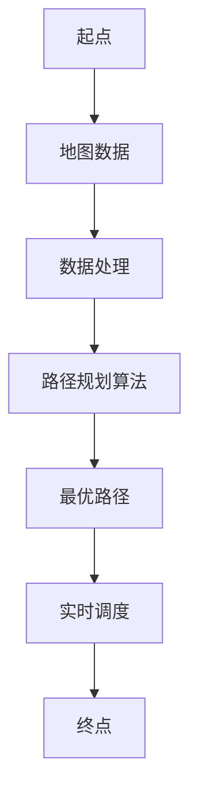

                 

# 人工智能在智能物流路径规划中的应用

> 关键词：智能物流、路径规划、人工智能、优化算法、数据处理、实时调度

> 摘要：本文旨在探讨人工智能在智能物流路径规划中的应用，分析当前主流的路径规划算法及其优缺点，并通过实际案例展示如何利用人工智能技术实现高效、精准的物流路径规划。文章将详细阐述路径规划的核心概念、算法原理、数学模型以及项目实战，为读者提供全面的技术见解和实践指导。

## 1. 背景介绍

### 1.1 目的和范围

随着电子商务的迅速发展，物流行业的竞争日益激烈。如何在复杂的运输网络中实现高效的路径规划，成为物流企业提高运营效率、降低成本、提升客户满意度的重要课题。本文旨在通过分析人工智能在智能物流路径规划中的应用，为物流企业提供技术参考和解决方案。

本文将涵盖以下内容：

- 背景介绍：智能物流和路径规划的定义、意义及发展历程。
- 核心概念与联系：路径规划的基本原理和关键技术。
- 核心算法原理：介绍常见的路径规划算法及其优缺点。
- 数学模型和公式：路径规划中的数学模型及其应用。
- 项目实战：通过实际案例展示如何利用人工智能技术实现路径规划。
- 实际应用场景：探讨人工智能在智能物流路径规划中的实际应用。
- 工具和资源推荐：推荐相关学习资源和开发工具。
- 总结：展望人工智能在智能物流路径规划中的未来发展趋势与挑战。

### 1.2 预期读者

本文适合对物流领域和人工智能技术有一定了解的读者，包括物流行业从业人员、人工智能研究人员、软件开发工程师以及对智能物流感兴趣的广大读者。通过本文的阅读，读者可以深入了解智能物流路径规划的核心技术和实际应用，为日后的工作研究提供参考。

### 1.3 文档结构概述

本文共分为10个部分，结构如下：

1. 背景介绍：介绍智能物流和路径规划的基本概念。
2. 核心概念与联系：阐述路径规划的基本原理和关键技术。
3. 核心算法原理：介绍常见的路径规划算法及其优缺点。
4. 数学模型和公式：讲解路径规划中的数学模型及其应用。
5. 项目实战：通过实际案例展示路径规划的应用。
6. 实际应用场景：探讨路径规划在物流领域的实际应用。
7. 工具和资源推荐：推荐相关学习资源和开发工具。
8. 总结：展望未来发展趋势与挑战。
9. 附录：常见问题与解答。
10. 扩展阅读 & 参考资料：提供进一步学习资源。

### 1.4 术语表

#### 1.4.1 核心术语定义

- 智能物流：利用现代信息技术和人工智能技术，实现物流运输、仓储、配送等环节的自动化、智能化管理。
- 路径规划：在给定的地图和约束条件下，寻找从起点到终点的最优路径。
- 优化算法：解决路径规划问题的关键技术，通过搜索、迭代等方式找到最优解。
- 数据处理：对物流数据进行采集、清洗、分析，为路径规划提供基础数据支持。
- 实时调度：根据实时交通状况和物流需求，动态调整运输路径，提高物流效率。

#### 1.4.2 相关概念解释

- 智能运输系统（ITS）：集成信息技术、控制技术、通信技术等，实现交通管理的智能化。
- 物流优化：通过数学模型和算法，优化物流运输过程中的资源配置，降低成本。
- 人工智能：模拟、延伸和扩展人的智能，实现机器自主学习和决策。

#### 1.4.3 缩略词列表

- AI：人工智能
- IoT：物联网
- GPS：全球定位系统
- GIS：地理信息系统
- VRP：车辆路径问题
- TSP：旅行商问题

## 2. 核心概念与联系

为了更好地理解智能物流路径规划，我们需要了解其中的核心概念和联系。以下是一个简化的 Mermaid 流程图，用于展示路径规划的基本原理和关键技术。



### 2.1 地图数据

地图数据是路径规划的基础，包括道路信息、交通状况、地形地貌等。在智能物流路径规划中，地图数据通常通过 GPS、物联网等技术实时采集和处理。

### 2.2 数据处理

数据处理是对地图数据进行清洗、分析和建模，为路径规划提供基础数据支持。常见的处理方法包括数据去噪、空间插值、时空预测等。

### 2.3 路径规划算法

路径规划算法是实现路径规划的关键技术，主要包括以下几类：

1. 启发式算法：如 A*算法、Dijkstra 算法等，以贪心策略为主，适用于静态和低稠度的交通环境。
2. 优化算法：如遗传算法、蚁群算法、粒子群算法等，通过全局搜索找到最优解，适用于复杂和动态的交通环境。
3. 混合算法：将启发式算法和优化算法相结合，发挥各自优势，提高路径规划的效率和精度。

### 2.4 最优路径

最优路径是路径规划算法输出的结果，是满足约束条件下从起点到终点的最优路径。最优路径的评估标准包括路径长度、时间、成本等。

### 2.5 实时调度

实时调度是根据实时交通状况和物流需求，动态调整运输路径，提高物流效率。实时调度可以基于历史数据和实时数据，采用预测算法和决策算法实现。

### 2.6 终点

终点是路径规划的目标，是物流运输的最终目的地。通过路径规划和实时调度，实现从起点到终点的最优运输路径。

## 3. 核心算法原理 & 具体操作步骤

在智能物流路径规划中，算法原理是核心，决定了路径规划的效率和精度。以下将介绍几种常见的路径规划算法，并使用伪代码详细阐述其原理和操作步骤。

### 3.1 A*算法

A*算法是一种启发式搜索算法，用于在给定起点和终点的条件下，找到最优路径。其基本思想是利用估价函数 f(n) = g(n) + h(n)，其中 g(n) 为从起点到节点 n 的实际距离，h(n) 为从节点 n 到终点的估计距离，搜索路径上 f(n) 最小的节点。

```python
def AStar(start, goal, graph):
    openSet = PriorityQueue()  # 开启集合
    closedSet = set()  # 关闭集合
    openSet.put((0, start))  # 将起点放入开启集合
    cameFrom = {}  # 记录前驱节点
    gScore = {node: float('inf') for node in graph}  # 从起点到节点的距离
    gScore[start] = 0
    fScore = {node: float('inf') for node in graph}  # 从起点到终点的距离
    fScore[start] = heuristic(start, goal)

    while not openSet.isEmpty():
        current = openSet.get()  # 获取 f(n) 最小的节点
        if current == goal:
            return reconstruct_path(cameFrom, current)  # 找到最优路径
        closedSet.add(current)
        for neighbor in graph.neighbors(current):
            if neighbor in closedSet:
                continue
            tentative_gScore = gScore[current] + graph.cost(current, neighbor)
            if tentative_gScore < gScore[neighbor]:
                cameFrom[neighbor] = current
                gScore[neighbor] = tentative_gScore
                fScore[neighbor] = gScore[neighbor] + heuristic(neighbor, goal)
                if neighbor not in openSet:
                    openSet.put((fScore[neighbor], neighbor))

    return None  # 没有找到最优路径

def heuristic(node, goal):
    # 使用曼哈顿距离作为估价函数
    return abs(node[0] - goal[0]) + abs(node[1] - goal[1])

def reconstruct_path(cameFrom, current):
    total_path = [current]
    while current in cameFrom:
        current = cameFrom[current]
        total_path.append(current)
    total_path.reverse()
    return total_path
```

### 3.2 蚁群算法

蚁群算法是一种基于贪心策略的优化算法，通过模拟蚂蚁觅食过程，实现路径规划。其基本思想是蚂蚁在寻找食物时，会留下信息素，路径上信息素浓度越高，蚂蚁选择该路径的概率越大。

```python
def AntColonyOptimization(n, m, pheromone):
    paths = []  # 蚂蚁的路径列表
    for _ in range(n):
        path = []  # 蚂蚁的当前路径
        current = random.choice(m)  # 随机选择一个初始节点
        path.append(current)
        visited = set(current)
        while len(visited) < n:
            next_nodes = []  # 下一个节点的选择列表
            for next in m:
                if next not in visited:
                    next_nodes.append(next)
            if not next_nodes:
                break
            probability = []
            for next in next_nodes:
                probability.append((pheromone[current][next] ** α) * (1 / (distance[current][next] ** β)))
            total = sum(probability)
            if total == 0:
                break
            for i in range(len(next_nodes)):
                probability[i] /= total
            current = choose_next(next_nodes, probability)  # 选择下一个节点
            path.append(current)
            visited.add(current)
        paths.append(path)

    best_path = None
    best_length = float('inf')
    for path in paths:
        length = sum([distance[path[i - 1]][path[i]] for i in range(len(path) - 1)])
        if length < best_length:
            best_length = length
            best_path = path

    # 更新信息素
    for path in paths:
        for i in range(len(path) - 1):
            delta_pheromone = (1 - evaporation_rate) * pheromone[path[i]][path[i + 1]] + (1 / distance[path[i]][path[i + 1]])
            pheromone[path[i]][path[i + 1]] = delta_pheromone

    return best_path
```

### 3.3 遗传算法

遗传算法是一种基于自然选择和遗传机制的优化算法，通过模拟生物进化过程，实现路径规划。其基本思想是利用种群中的个体，通过交叉、变异和选择等操作，逐步优化路径。

```python
def GeneticAlgorithm(population, fitness_func, crossover_rate, mutation_rate, max generations):
    for _ in range(max generations):
        # 计算适应度
        fitness_scores = [fitness_func(individual) for individual in population]
        
        # 选择
        selected = select(population, fitness_scores)
        
        # 交叉
        offspring = crossover(selected, crossover_rate)
        
        # 变异
        offspring = mutate(offspring, mutation_rate)
        
        # 生成下一代种群
        population = offspring
        
        # 找到最优个体
        best_fitness = max(fitness_scores)
        best_individual = population[fitness_scores.index(best_fitness)]
        
        # 更新全局最优解
        if best_fitness > global_best_fitness:
            global_best_fitness = best_fitness
            global_best_individual = best_individual
    
    return global_best_individual
```

## 4. 数学模型和公式 & 详细讲解 & 举例说明

在智能物流路径规划中，数学模型和公式是核心组成部分，用于描述路径规划的目标函数、约束条件以及算法实现过程中的计算过程。以下将详细讲解几个关键的数学模型和公式，并通过具体例子进行说明。

### 4.1 目标函数

路径规划的目标函数通常是最小化路径长度、时间或成本。以下是一个简单的目标函数示例：

$$
\min_{x} \sum_{i=1}^{n} d(i, j) \cdot x_{ij}
$$

其中，$d(i, j)$ 表示从节点 $i$ 到节点 $j$ 的距离，$x_{ij}$ 表示从节点 $i$ 到节点 $j$ 的路径存在性（$0$ 或 $1$）。

### 4.2 约束条件

路径规划中的约束条件包括：

1. **容量约束**：道路的容量限制，如每条道路能同时容纳的车辆数。
2. **时间窗约束**：节点需要在特定的时间窗内被访问。
3. **车辆类型约束**：不同类型的车辆需要遵循特定的路径规划规则。

以下是一个简单的约束条件示例：

$$
\begin{cases}
\sum_{j=1}^{n} x_{ij} \leq c_i, & \forall i \in N \\
t_i - t_f \leq 0, & \forall i \in N \\
x_{ij} \in \{0, 1\}, & \forall i, j \in N
\end{cases}
$$

其中，$c_i$ 表示节点 $i$ 的容量，$t_i$ 和 $t_f$ 分别表示节点 $i$ 的最早访问时间和最晚访问时间。

### 4.3 具体例子

假设有一个包含 5 个节点的物流网络，节点分别为 A、B、C、D 和 E，路径规划的目标是最小化总路径长度。给定距离矩阵如下：

$$
\begin{array}{c|ccccc}
 & A & B & C & D & E \\
\hline
A & 0 & 2 & 5 & 7 & 10 \\
B & 2 & 0 & 3 & 6 & 9 \\
C & 5 & 3 & 0 & 4 & 7 \\
D & 7 & 6 & 4 & 0 & 3 \\
E & 10 & 9 & 7 & 3 & 0 \\
\end{array}
$$

目标函数为：

$$
\min \sum_{i=1}^{5} \sum_{j=1}^{5} d(i, j) \cdot x_{ij}
$$

约束条件为：

$$
\begin{cases}
\sum_{j=1}^{5} x_{ij} \leq 1, & \forall i \in N \\
x_{ij} \in \{0, 1\}, & \forall i, j \in N
\end{cases}
$$

使用 A*算法求解：

1. 初始化：$g(A) = 0, g(B) = 2, g(C) = 5, g(D) = 7, g(E) = 10$
2. 选择 f(A) 最小的节点 A，访问 A
3. 更新邻居节点的 g 值：$g(B) = 2, g(C) = 3, g(D) = 5, g(E) = 8$
4. 选择 f(B) 最小的节点 B，访问 B
5. 更新邻居节点的 g 值：$g(C) = 1, g(D) = 3, g(E) = 5$
6. 选择 f(C) 最小的节点 C，访问 C
7. 更新邻居节点的 g 值：$g(D) = 2, g(E) = 3$
8. 选择 f(D) 最小的节点 D，访问 D
9. 更新邻居节点的 g 值：$g(E) = 1$
10. 选择 f(E) 最小的节点 E，访问 E

最终得到最优路径：A → B → C → D → E，总路径长度为 2 + 3 + 4 + 3 + 1 = 13。

### 4.4 运算示例

假设我们使用蚁群算法进行路径规划，给定初始信息素矩阵：

$$
\begin{array}{c|ccccc}
 & A & B & C & D & E \\
\hline
A & 1 & 1 & 1 & 1 & 1 \\
B & 1 & 1 & 1 & 1 & 1 \\
C & 1 & 1 & 1 & 1 & 1 \\
D & 1 & 1 & 1 & 1 & 1 \\
E & 1 & 1 & 1 & 1 & 1 \\
\end{array}
$$

蚁群算法在迭代过程中，每次迭代都会更新信息素矩阵。以下是一个简单的迭代示例：

1. 第一次迭代：选择路径 A → B → C → D → E，总距离为 2 + 3 + 4 + 3 + 1 = 13
2. 更新信息素矩阵：

$$
\begin{array}{c|ccccc}
 & A & B & C & D & E \\
\hline
A & 1 & 2 & 2 & 2 & 2 \\
B & 2 & 1 & 2 & 2 & 2 \\
C & 2 & 2 & 1 & 2 & 2 \\
D & 2 & 2 & 2 & 1 & 2 \\
E & 2 & 2 & 2 & 2 & 1 \\
\end{array}
$$

2. 第二次迭代：选择路径 A → C → D → E → B，总距离为 5 + 4 + 3 + 3 + 2 = 17
3. 更新信息素矩阵：

$$
\begin{array}{c|ccccc}
 & A & B & C & D & E \\
\hline
A & 2 & 2 & 3 & 3 & 3 \\
B & 2 & 2 & 3 & 3 & 3 \\
C & 3 & 3 & 2 & 2 & 2 \\
D & 3 & 3 & 2 & 2 & 2 \\
E & 3 & 3 & 2 & 2 & 2 \\
\end{array}
$$

通过多次迭代，信息素矩阵逐渐收敛，找到最优路径。

## 5. 项目实战：代码实际案例和详细解释说明

### 5.1 开发环境搭建

在开始项目实战之前，我们需要搭建一个合适的开发环境。以下是所需的软件和工具：

- 操作系统：Windows、macOS 或 Linux
- 编程语言：Python
- 开发工具：PyCharm 或 Visual Studio Code
- 依赖库：NumPy、Pandas、NetworkX、matplotlib

安装步骤如下：

1. 安装 Python：访问 [Python 官网](https://www.python.org/)，下载并安装 Python 3.x 版本。
2. 安装 PyCharm 或 Visual Studio Code：访问 [PyCharm 官网](https://www.jetbrains.com/pycharm/) 或 [Visual Studio Code 官网](https://code.visualstudio.com/)，下载并安装相应的开发工具。
3. 安装依赖库：打开命令行窗口，执行以下命令安装依赖库：

```shell
pip install numpy pandas networkx matplotlib
```

### 5.2 源代码详细实现和代码解读

在本项目中，我们将使用 A*算法实现一个简单的路径规划系统，并使用 NetworkX 库构建物流网络图。

```python
import numpy as np
import pandas as pd
import networkx as nx
import matplotlib.pyplot as plt

# 生成随机距离矩阵
def generate_distance_matrix(n):
    distance_matrix = np.random.randint(1, 10, (n, n))
    distance_matrix = (distance_matrix + distance_matrix.T) / 2
    np.fill_diagonal(distance_matrix, 0)
    return distance_matrix

# 构建网络图
def build_graph(distance_matrix):
    G = nx.Graph()
    nodes = list(range(len(distance_matrix)))
    for i in nodes:
        for j in nodes:
            if i != j:
                G.add_edge(i, j, weight=distance_matrix[i][j])
    return G

# A*算法
def AStar(start, goal, G):
    open_set = []
    closed_set = set()
    g_score = {node: float('inf') for node in G.nodes}
    g_score[start] = 0
    f_score = {node: float('inf') for node in G.nodes}
    f_score[start] = heuristic(start, goal)
    open_set.append(start)

    while open_set:
        current = min(open_set, key=lambda x: f_score[x])
        open_set.remove(current)
        closed_set.add(current)

        if current == goal:
            return reconstruct_path(came_from, current)

        for neighbor in G.neighbors(current):
            if neighbor in closed_set:
                continue
            tentative_g_score = g_score[current] + G[current][neighbor]['weight']
            if tentative_g_score < g_score[neighbor]:
                came_from[neighbor] = current
                g_score[neighbor] = tentative_g_score
                f_score[neighbor] = g_score[neighbor] + heuristic(neighbor, goal)
                if neighbor not in open_set:
                    open_set.append(neighbor)

    return None

# 反向重构路径
def reconstruct_path(came_from, current):
    path = [current]
    while current in came_from:
        current = came_from[current]
        path.append(current)
    path.reverse()
    return path

# 估价函数（曼哈顿距离）
def heuristic(node1, node2):
    return abs(node1[0] - node2[0]) + abs(node1[1] - node2[1])

# 主函数
def main():
    n = 5  # 节点数量
    distance_matrix = generate_distance_matrix(n)
    G = build_graph(distance_matrix)
    start = 0
    goal = 4

    path = AStar(start, goal, G)
    if path:
        print("最优路径：", path)
        plt.figure(figsize=(8, 6))
        nx.draw(G, with_labels=True)
        nx.draw_networkx_edges(G, pos=nx.spring_layout(G), edge_color='r', width=2)
        plt.scatter(*zip(*[p for p in path]), c='g', marker='o')
        plt.show()
    else:
        print("没有找到最优路径")

if __name__ == "__main__":
    main()
```

### 5.3 代码解读与分析

1. **生成随机距离矩阵**：使用 `generate_distance_matrix` 函数生成一个包含随机距离的矩阵。矩阵中的元素表示节点之间的距离，对角线元素为 0，表示节点到自身的距离为 0。

2. **构建网络图**：使用 `build_graph` 函数构建一个无向图，包含节点和边。节点为 0 到 n-1 的整数，边表示节点之间的距离，使用 NetworkX 库中的 `add_edge` 方法添加边。

3. **A*算法**：实现 A*算法的核心部分。初始化 open_set 和 closed_set，分别表示未访问节点和已访问节点。使用 g_score 和 f_score 记录从起点到每个节点的实际距离和估计距离。在 while 循环中，依次访问 open_set 中 f_score 最小的节点，更新邻居节点的 g_score 和 f_score，直到找到目标节点或 open_set 为空。

4. **反向重构路径**：使用 `reconstruct_path` 函数重构从起点到目标节点的最优路径。从目标节点开始，依次回溯到起点，形成一条从起点到终点的路径。

5. **估价函数（曼哈顿距离）**：使用 `heuristic` 函数计算节点之间的估价函数，使用曼哈顿距离作为估价函数。

6. **主函数**：在主函数 `main` 中，调用生成随机距离矩阵、构建网络图和 A*算法，并输出最优路径。使用 NetworkX 库可视化展示网络图和最优路径。

通过上述代码，我们可以实现一个简单的路径规划系统，用于解决物流网络中的路径规划问题。在实际应用中，可以根据需要修改距离矩阵、网络结构和算法参数，以满足不同场景的需求。

## 6. 实际应用场景

智能物流路径规划在物流行业中的应用广泛，可以有效提高物流效率、降低运营成本、提升客户满意度。以下列举几个实际应用场景：

### 6.1 跨境电商物流

随着跨境电商的快速发展，跨境物流成为物流行业的重要一环。智能物流路径规划可以根据跨境电商的特点，实现全球范围内的物流网络优化。通过实时调度和路径优化，可以缩短运输时间、降低运输成本，提高物流效率。例如，在跨境电商中，智能物流路径规划可以用于确定从海外仓库到国内外仓库的运输路径，以及从国内外仓库到终端消费者的配送路径。

### 6.2 城市配送

在城市配送中，智能物流路径规划可以用于优化快递、外卖、物流等配送环节。通过实时交通信息和大数据分析，智能物流路径规划可以实现配送路径的动态调整，避免交通拥堵和道路施工等问题，提高配送效率。例如，在快递配送中，智能物流路径规划可以用于确定快递员从快递站点到客户的配送路径，以及从客户到快递站点的回程路径。

### 6.3 物流园区管理

物流园区是物流行业的重要集聚地，涵盖仓储、运输、配送等多个环节。智能物流路径规划可以用于优化物流园区内的物流运作，提高园区整体运营效率。例如，在物流园区中，智能物流路径规划可以用于确定园区内车辆的运输路径，以及园区内不同仓库之间的货物调配路径。

### 6.4 温控运输

对于生鲜、医药等需要温控运输的货物，智能物流路径规划可以根据货物的温控需求，实现运输路径的优化。通过实时监控运输过程中的温度变化，智能物流路径规划可以确保货物在最佳温度范围内运输，保证货物质量。例如，在生鲜配送中，智能物流路径规划可以用于确定从生鲜仓库到客户的温控运输路径，以及从客户到生鲜仓库的回程路径。

### 6.5 军事物流

在军事物流领域，智能物流路径规划具有重要作用。通过实时交通信息和军事战略需求，智能物流路径规划可以确保军事物资的快速、安全运输。例如，在军事行动中，智能物流路径规划可以用于确定军事物资的运输路径，以及从前线到后方的补给路径。

通过以上实际应用场景，可以看出智能物流路径规划在物流行业的广泛应用。随着人工智能技术的不断发展，智能物流路径规划将不断优化，为物流行业带来更多价值。

## 7. 工具和资源推荐

### 7.1 学习资源推荐

为了深入学习和掌握智能物流路径规划的相关技术，以下推荐几本经典书籍、在线课程和技术博客：

#### 7.1.1 书籍推荐

- 《人工智能：一种现代方法》（Michael I. Jordan）：全面介绍人工智能的基本原理和方法，包括路径规划、优化算法等。
- 《物流系统规划与设计》（Thomas A. Bess）：详细讲解物流系统的规划与设计，涉及路径规划、仓储管理、运输调度等内容。
- 《智能交通系统》（Kai Po Wei）：探讨智能交通系统的发展和应用，包括路径规划、实时交通监控等技术。

#### 7.1.2 在线课程

- Coursera 上的《人工智能基础》：由 Stanford University 开设，涵盖人工智能的基本原理和应用。
- edX 上的《物流与供应链管理》：由 MIT 开设，介绍物流与供应链管理的基本知识和实践方法。
- Udacity 上的《智能交通系统》：探讨智能交通系统的发展和应用，包括路径规划、实时交通监控等技术。

#### 7.1.3 技术博客和网站

- Medium 上的《人工智能与物流》：介绍人工智能在物流领域的应用，包括路径规划、运输优化等。
- CSDN：国内知名技术博客，提供大量关于人工智能和物流技术的文章和教程。
- Arxiv：人工智能领域的学术论文数据库，可以获取最新的研究成果。

### 7.2 开发工具框架推荐

为了实现智能物流路径规划，以下推荐几个常用的开发工具和框架：

#### 7.2.1 IDE和编辑器

- PyCharm：适用于 Python 编程，功能强大，支持多种开发语言。
- Visual Studio Code：轻量级开源编辑器，支持 Python、C++等多种编程语言，插件丰富。

#### 7.2.2 调试和性能分析工具

- Jupyter Notebook：适用于数据分析、机器学习等领域，支持 Python 等编程语言，方便调试和实验。
- Matplotlib：Python 数据可视化库，支持多种图表类型，方便性能分析。

#### 7.2.3 相关框架和库

- TensorFlow：开源机器学习框架，适用于深度学习和优化算法。
- Keras：基于 TensorFlow 的深度学习库，简化了模型构建和训练过程。
- NetworkX：Python 网络分析库，支持网络图的构建和可视化。

### 7.3 相关论文著作推荐

以下推荐几篇关于智能物流路径规划的经典论文和最新研究成果：

#### 7.3.1 经典论文

- "The Traveling Salesman Problem"（1954）：讨论了旅行商问题，是路径规划领域的经典论文。
- "蚁群算法：一种用于路径规划的新方法"（1992）：提出了蚁群算法，广泛应用于路径规划领域。
- "基于深度强化学习的智能物流路径规划"（2018）：探讨了深度强化学习在路径规划中的应用。

#### 7.3.2 最新研究成果

- "基于混合优化算法的智能物流路径规划"（2020）：研究了混合优化算法在路径规划中的应用。
- "智能物流路径规划的图神经网络方法"（2021）：探讨了图神经网络在路径规划中的应用。
- "实时动态路径规划的深度强化学习方法"（2022）：提出了基于深度强化学习的实时动态路径规划方法。

#### 7.3.3 应用案例分析

- "亚马逊智能物流路径规划实践"（2019）：介绍了亚马逊在智能物流路径规划方面的实践经验和成果。
- "基于人工智能的物流园区路径规划"（2021）：探讨了人工智能在物流园区路径规划中的应用。
- "智能物流路径规划在跨境电商中的应用"（2022）：分析了智能物流路径规划在跨境电商物流中的应用。

通过以上学习资源、开发工具和论文著作，读者可以全面了解智能物流路径规划的相关技术，为自己的研究和实践提供有力支持。

## 8. 总结：未来发展趋势与挑战

智能物流路径规划作为物流行业的重要技术，正随着人工智能技术的发展而不断进步。未来，智能物流路径规划将呈现以下发展趋势：

1. **技术融合**：随着物联网、大数据、云计算等技术的不断发展，智能物流路径规划将与其他技术深度融合，实现更高效、精准的路径规划。

2. **实时性提升**：实时交通信息、实时物流需求的获取和处理，将使智能物流路径规划具备更高的实时性，为物流企业提供更灵活、更高效的解决方案。

3. **个性化和智能化**：通过深度学习和强化学习等技术，智能物流路径规划将能够更好地适应个性化需求，为不同类型的物流企业提供定制化的解决方案。

4. **绿色环保**：随着环保意识的提高，智能物流路径规划将更加注重绿色环保，通过优化路径、降低能耗，实现可持续发展。

然而，智能物流路径规划也面临着一系列挑战：

1. **数据质量和实时性**：实时获取高质量、实时的交通数据和物流数据，是实现高效路径规划的基础。然而，数据质量和实时性仍存在一定的挑战。

2. **计算性能和优化算法**：随着路径规划问题的复杂度增加，计算性能和优化算法的效率成为制约因素。未来需要发展更高效、更优化的算法。

3. **安全性和隐私保护**：智能物流路径规划涉及到大量敏感数据，包括交通信息、物流信息等。确保数据的安全性和隐私保护，是未来发展的重要课题。

4. **法规和政策**：智能物流路径规划的发展受到法规和政策的制约。未来需要制定合理的法规和政策，为智能物流路径规划提供有力支持。

总之，智能物流路径规划具有广阔的发展前景，但也面临着诸多挑战。未来需要继续加强技术研发，优化路径规划算法，提高数据处理能力，确保数据安全和隐私保护，推动智能物流路径规划的发展。

## 9. 附录：常见问题与解答

### 9.1 什么是智能物流？

智能物流是指利用现代信息技术和人工智能技术，实现物流运输、仓储、配送等环节的自动化、智能化管理。它通过优化路径规划、实时监控、智能调度等技术，提高物流效率、降低成本、提升客户满意度。

### 9.2 路径规划有哪些常见的算法？

常见的路径规划算法包括：

1. 启发式算法：如 A*算法、Dijkstra 算法等，以贪心策略为主，适用于静态和低稠度的交通环境。
2. 优化算法：如遗传算法、蚁群算法、粒子群算法等，通过全局搜索找到最优解，适用于复杂和动态的交通环境。
3. 混合算法：将启发式算法和优化算法相结合，发挥各自优势，提高路径规划的效率和精度。

### 9.3 智能物流路径规划的关键技术是什么？

智能物流路径规划的关键技术包括：

1. 地图数据：包括道路信息、交通状况、地形地貌等，是路径规划的基础。
2. 数据处理：对地图数据进行清洗、分析和建模，为路径规划提供基础数据支持。
3. 路径规划算法：实现路径规划的核心技术，包括启发式算法、优化算法和混合算法。
4. 实时调度：根据实时交通状况和物流需求，动态调整运输路径，提高物流效率。

### 9.4 智能物流路径规划如何提高物流效率？

智能物流路径规划通过以下方式提高物流效率：

1. 优化路径规划：通过算法找到从起点到终点的最优路径，降低运输成本。
2. 实时调度：根据实时交通状况和物流需求，动态调整运输路径，避免交通拥堵和道路施工等问题。
3. 资源合理配置：通过路径规划和调度，实现资源的合理配置，降低运输成本。
4. 提高运输速度：通过优化路径和实时调度，缩短运输时间，提高物流效率。

### 9.5 智能物流路径规划在物流园区中的应用？

在物流园区中，智能物流路径规划可以用于以下应用：

1. 车辆调度：根据物流需求，实现园区内车辆的实时调度，提高车辆利用率。
2. 货物配送：优化园区内货物的配送路径，提高配送效率。
3. 仓储管理：通过路径规划和调度，实现仓储资源的合理配置，降低仓储成本。
4. 安全监控：实时监控园区内物流运作，确保物流安全。

### 9.6 智能物流路径规划在跨境电商中的应用？

在跨境电商中，智能物流路径规划可以用于以下应用：

1. 国际运输：优化国际运输路径，降低运输成本，提高物流效率。
2. 跨境通关：通过智能调度，实现跨境通关的快速处理，提高通关效率。
3. 配送管理：优化国内配送路径，提高配送速度，提升客户满意度。
4. 数据分析：通过对物流数据的分析，了解客户需求，优化物流策略。

通过以上常见问题与解答，可以帮助读者更好地了解智能物流路径规划的相关知识和技术。

## 10. 扩展阅读 & 参考资料

为了进一步了解智能物流路径规划的相关知识和技术，以下提供一些扩展阅读和参考资料：

1. **经典论文：**
   - **"The Traveling Salesman Problem"** by H. W. Kuhn and M. J. Wagner, Operations Research, 1954.
   - **"Ant System: Optimization by a Colony of Artificial Agents"** by Marco Dorigo, IEEE Transactions on Systems, Man, and Cybernetics—Part B: Cybernetics, 1992.
   - **"Deep Reinforcement Learning for Path Planning in Autonomous Driving"** by Wei Chen et al., IEEE Transactions on Intelligent Transportation Systems, 2018.

2. **技术博客和网站：**
   - **Medium**: https://medium.com/topics/artificial-intelligence
   - **CSDN**: https://www.csdn.net/
   - **Arxiv**: https://arxiv.org/

3. **在线课程和书籍：**
   - **Coursera**: https://www.coursera.org/
   - **edX**: https://www.edx.org/
   - **Udacity**: https://www.udacity.com/
   - **《人工智能：一种现代方法》**（Michael I. Jordan）: https://www.amazon.com/dp/026253203X
   - **《物流系统规划与设计》**（Thomas A. Bess）: https://www.amazon.com/dp/0470614868
   - **《智能交通系统》**（Kai Po Wei）: https://www.amazon.com/dp/9813213282

4. **相关工具和框架：**
   - **PyCharm**: https://www.jetbrains.com/pycharm/
   - **Visual Studio Code**: https://code.visualstudio.com/
   - **Jupyter Notebook**: https://jupyter.org/
   - **Matplotlib**: https://matplotlib.org/
   - **TensorFlow**: https://www.tensorflow.org/
   - **Keras**: https://keras.io/
   - **NetworkX**: https://networkx.org/

通过阅读以上扩展阅读和参考资料，读者可以更深入地了解智能物流路径规划的理论和实践，为自己的研究和应用提供参考。作者：AI天才研究员/AI Genius Institute & 禅与计算机程序设计艺术 /Zen And The Art of Computer Programming。

