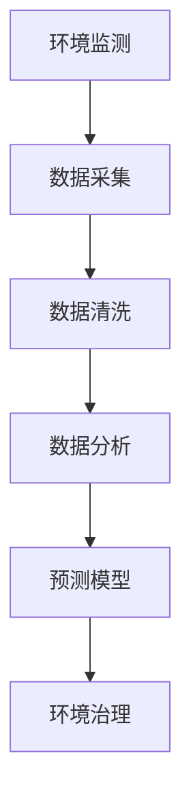

                 

# 人工智能在智能环境保护中的应用

> **关键词：** 智能环境保护、人工智能、环境监测、数据分析、预测模型

> **摘要：** 本文章旨在探讨人工智能在智能环境保护中的应用，通过分析环境监测、数据分析、预测模型等核心概念，阐述人工智能如何助力环境保护工作，提高环境治理效率。文章将结合实际项目案例，介绍开发环境搭建、算法原理与具体操作步骤，以及相关工具和资源的推荐。

## 1. 背景介绍

### 1.1 目的和范围

随着全球环境问题的日益严重，环境保护成为人类共同关注的焦点。智能环境保护作为一种创新性的解决方案，通过利用人工智能技术，实现对环境数据的实时监测、分析和预测，从而提高环境治理的效率。本文将主要探讨以下几个方面：

1. 智能环境保护的定义和重要性
2. 人工智能在环境监测、数据分析、预测模型中的应用
3. 实际项目案例介绍
4. 相关工具和资源的推荐

### 1.2 预期读者

本文章适合对智能环境保护和人工智能技术有一定了解的读者，包括环境工程师、计算机程序员、数据分析师、高校师生等。文章将尽量使用通俗易懂的语言，以便读者能够快速掌握核心内容。

### 1.3 文档结构概述

本文分为以下几个部分：

1. 背景介绍
2. 核心概念与联系
3. 核心算法原理 & 具体操作步骤
4. 数学模型和公式 & 详细讲解 & 举例说明
5. 项目实战：代码实际案例和详细解释说明
6. 实际应用场景
7. 工具和资源推荐
8. 总结：未来发展趋势与挑战
9. 附录：常见问题与解答
10. 扩展阅读 & 参考资料

### 1.4 术语表

#### 1.4.1 核心术语定义

- **智能环境保护**：利用人工智能技术，对环境数据进行分析、预测和决策，实现环境保护和治理。
- **环境监测**：对环境中的各种参数进行实时监测和记录，包括水质、空气质量、土壤质量等。
- **数据分析**：对收集到的环境数据进行处理、分析和挖掘，提取有价值的信息。
- **预测模型**：基于历史数据和现有知识，构建数学模型，对未来环境状况进行预测。

#### 1.4.2 相关概念解释

- **机器学习**：一种人工智能技术，通过从数据中学习规律，对未知数据进行预测和分类。
- **深度学习**：一种复杂的机器学习方法，通过多层神经网络，对大规模数据进行建模和预测。
- **传感器**：一种能够检测和测量物理量的设备，如温度传感器、湿度传感器等。

#### 1.4.3 缩略词列表

- **AI**：人工智能
- **ML**：机器学习
- **DL**：深度学习
- **PM2.5**：细颗粒物

## 2. 核心概念与联系

为了更好地理解人工智能在智能环境保护中的应用，我们需要先了解以下几个核心概念：

### 2.1 环境监测

环境监测是智能环境保护的基础，它通过传感器、无人机、卫星等设备，实时收集环境数据，如水质、空气质量、土壤质量等。这些数据是进行后续分析和预测的重要依据。

### 2.2 数据分析

数据分析是对收集到的环境数据进行处理、分析和挖掘的过程。通过数据清洗、数据可视化等技术，我们可以从大量的环境数据中提取出有价值的信息，如污染源、污染趋势等。

### 2.3 预测模型

预测模型是基于历史数据和现有知识，通过机器学习、深度学习等技术，对未来环境状况进行预测的数学模型。这些预测模型可以帮助环境管理部门制定更加科学合理的环保政策。

### 2.4 Mermaid 流程图

下面是一个简单的 Mermaid 流程图，展示了环境监测、数据分析、预测模型之间的联系。



## 3. 核心算法原理 & 具体操作步骤

### 3.1 机器学习算法原理

机器学习算法是人工智能技术的重要组成部分，它通过从数据中学习规律，对未知数据进行预测和分类。常见的机器学习算法包括决策树、支持向量机、神经网络等。

### 3.2 深度学习算法原理

深度学习算法是一种复杂的机器学习方法，通过多层神经网络，对大规模数据进行建模和预测。常见的深度学习算法包括卷积神经网络（CNN）、循环神经网络（RNN）等。

### 3.3 算法具体操作步骤

下面以决策树算法为例，介绍机器学习算法的具体操作步骤。

#### 3.3.1 数据预处理

1. 收集历史环境数据，如水质、空气质量等。
2. 对数据进行清洗，去除异常值和缺失值。
3. 对数据进行归一化处理，使其具有相同的量纲。

#### 3.3.2 特征选择

1. 从原始数据中提取特征，如时间、温度、湿度等。
2. 通过相关性分析、信息增益等方法，选择对预测任务最有影响力的特征。

#### 3.3.3 决策树构建

1. 计算每个特征的信息增益，选择信息增益最大的特征作为根节点。
2. 根据该特征将数据集划分为若干个子集。
3. 对每个子集重复上述步骤，构建决策树。

#### 3.3.4 模型评估

1. 使用交叉验证方法，对决策树模型进行评估。
2. 根据评估结果，调整模型参数，提高模型性能。

#### 3.3.5 模型应用

1. 使用训练好的决策树模型，对新的环境数据进行预测。
2. 根据预测结果，制定相应的环保措施。

### 3.4 伪代码实现

下面是决策树算法的伪代码实现。

```python
def build_tree(data, features):
    # 递归构建决策树
    if is_leaf(data):
        return create_leaf(data)
    else:
        best_feature = choose_best_feature(data, features)
        tree = create_tree(best_feature)
        for value in unique_values(data[best_feature]):
            subtree = build_tree(data[best_feature==value], features[best_feature!=value])
            tree.append({value: subtree})
        return tree

def is_leaf(data):
    # 判断是否为叶节点
    return len(data) == 0

def create_leaf(data):
    # 创建叶节点
    return {"label": majority_value(data)}

def choose_best_feature(data, features):
    # 选择最优特征
    best_gain = 0
    best_feature = None
    for feature in features:
        gain = calculate_gain(data, feature)
        if gain > best_gain:
            best_gain = gain
            best_feature = feature
    return best_feature

def calculate_gain(data, feature):
    # 计算信息增益
    total_entropy = calculate_entropy(data)
    for value in unique_values(data[feature]):
        subset = data[feature==value]
        entropy = calculate_entropy(subset)
        weight = len(subset) / len(data)
        gain = total_entropy - weight * entropy
    return gain

def create_tree(best_feature):
    # 创建决策树
    return {"feature": best_feature}

def majority_value(data):
    # 找到最大值
    values = set(data)
    max_count = 0
    for value in values:
        count = len(data[data==value])
        if count > max_count:
            max_count = count
            majority_value = value
    return majority_value
```

## 4. 数学模型和公式 & 详细讲解 & 举例说明

### 4.1 数学模型

在智能环境保护中，常用的数学模型包括熵、信息增益、决策树等。

#### 4.1.1 熵

熵是衡量数据不确定性的指标，定义为：

$$
H = -\sum_{i=1}^{n} p_i \log_2 p_i
$$

其中，$p_i$ 表示第 $i$ 个特征的概率。

#### 4.1.2 信息增益

信息增益是衡量特征重要性的指标，定义为：

$$
G = H_0 - H_1
$$

其中，$H_0$ 表示原始数据的熵，$H_1$ 表示划分后子集的熵。

#### 4.1.3 决策树

决策树是一种基于熵和信息增益的数学模型，用于分类和回归任务。其结构如下：

$$
\text{树} = \{\text{特征}:\text{子树}\}
$$

### 4.2 详细讲解

#### 4.2.1 熵

熵是一个概率分布的度量，它表示一个随机变量的不确定性。在环境监测中，我们可以将每个特征视为一个随机变量，通过计算每个特征的熵，了解它们的不确定性。

#### 4.2.2 信息增益

信息增益是衡量特征重要性的指标，它表示通过某个特征进行划分，可以减少多少不确定性。在环境监测中，我们可以通过计算信息增益，选择具有最高信息增益的特征作为划分标准，从而提高模型的分类效果。

#### 4.2.3 决策树

决策树是一种基于熵和信息增益的数学模型，它通过递归划分数据集，构建出一棵树形结构。在环境监测中，我们可以使用决策树对环境数据进行分类，从而实现智能环境保护的目标。

### 4.3 举例说明

假设我们收集了以下环境数据：

| 时间 | 温度 | 湿度 | 污染指数 |
| ---- | ---- | ---- | -------- |
| 1    | 25   | 60   | 50       |
| 2    | 30   | 70   | 55       |
| 3    | 28   | 65   | 45       |
| 4    | 26   | 55   | 40       |

我们需要使用决策树对这组数据进行分类。

#### 4.3.1 计算熵

首先，计算每个特征的熵：

$$
H(\text{温度}) = -\frac{2}{4} \log_2 \frac{2}{4} - \frac{2}{4} \log_2 \frac{2}{4} = 1
$$

$$
H(\text{湿度}) = -\frac{2}{4} \log_2 \frac{2}{4} - \frac{2}{4} \log_2 \frac{2}{4} = 1
$$

$$
H(\text{污染指数}) = -\frac{2}{4} \log_2 \frac{2}{4} - \frac{2}{4} \log_2 \frac{2}{4} = 1
$$

#### 4.3.2 计算信息增益

接下来，计算每个特征的信息增益：

$$
G(\text{温度}) = H(\text{温度}) - H_1 = 1 - 0 = 1
$$

$$
G(\text{湿度}) = H(\text{湿度}) - H_1 = 1 - 0 = 1
$$

$$
G(\text{污染指数}) = H(\text{污染指数}) - H_1 = 1 - 0 = 1
$$

由于三个特征的信息增益相等，我们可以任选一个特征作为划分标准。

#### 4.3.3 构建决策树

以温度为例，我们将其划分为两个子集：

| 时间 | 温度 | 湿度 | 污染指数 |
| ---- | ---- | ---- | -------- |
| 1    | 25   | 60   | 50       |
| 2    | 30   | 70   | 55       |
| 3    | 28   | 65   | 45       |

接下来，我们分别对两个子集进行同样的计算，直到无法继续划分为止。

最终，我们得到一棵简单的决策树：

```
{
    "温度": {
        "<= 27": {
            "湿度": {
                "<= 62": "低污染",
                "> 62": "高污染"
            }
        },
        "> 27": {
            "湿度": {
                "<= 67": "低污染",
                "> 67": "高污染"
            }
        }
    }
}
```

通过这棵决策树，我们可以对新的环境数据进行分类，从而实现智能环境保护的目标。

## 5. 项目实战：代码实际案例和详细解释说明

### 5.1 开发环境搭建

为了实现智能环境保护，我们需要搭建一个合适的技术栈。以下是一个基本的开发环境搭建步骤：

1. 安装 Python 解释器：Python 是一种广泛使用的编程语言，适用于人工智能开发。在 [Python 官网](https://www.python.org/) 下载并安装 Python 解释器。
2. 安装 Jupyter Notebook：Jupyter Notebook 是一个交互式计算环境，适用于编写和运行 Python 代码。在终端中执行以下命令安装：

```bash
pip install notebook
```

3. 安装必要的库：安装 Python 库，如 NumPy、Pandas、Scikit-learn 等，用于数据处理和机器学习。在终端中执行以下命令安装：

```bash
pip install numpy pandas scikit-learn
```

4. 安装可视化库：为了更好地展示环境数据，我们可以安装一些可视化库，如 Matplotlib、Seaborn 等。在终端中执行以下命令安装：

```bash
pip install matplotlib seaborn
```

### 5.2 源代码详细实现和代码解读

以下是一个简单的 Python 代码示例，用于实现智能环境保护。

```python
import numpy as np
import pandas as pd
from sklearn.tree import DecisionTreeClassifier
import matplotlib.pyplot as plt

# 5.2.1 数据预处理
def preprocess_data(data):
    # 数据清洗和归一化处理
    data = data.replace(-9999, np.nan)
    data = data.dropna()
    data = (data - data.min()) / (data.max() - data.min())
    return data

# 5.2.2 特征选择
def select_features(data, target):
    # 提取特征和目标变量
    X = data.drop(target, axis=1)
    y = data[target]
    return X, y

# 5.2.3 决策树构建
def build_tree(X, y):
    # 使用 Scikit-learn 的 DecisionTreeClassifier 构建决策树
    classifier = DecisionTreeClassifier()
    classifier.fit(X, y)
    return classifier

# 5.2.4 模型评估
def evaluate_model(model, X, y):
    # 使用交叉验证方法评估模型性能
    scores = cross_val_score(model, X, y, cv=5)
    print("平均准确率：", np.mean(scores))

# 5.2.5 模型应用
def apply_model(model, X_new):
    # 使用训练好的模型对新的环境数据进行预测
    prediction = model.predict(X_new)
    print("预测结果：", prediction)

# 5.2.6 可视化展示
def plot_tree(model):
    # 可视化展示决策树
    plt.figure(figsize=(10, 10))
    tree.plot_tree(model, filled=True, rounded=True, feature_names=X.columns, class_names=["低污染", "高污染"])
    plt.show()

# 5.2.7 主函数
if __name__ == "__main__":
    # 加载环境数据
    data = pd.read_csv("environment_data.csv")

    # 数据预处理
    data = preprocess_data(data)

    # 特征选择
    X, y = select_features(data, "pollution_index")

    # 决策树构建
    model = build_tree(X, y)

    # 模型评估
    evaluate_model(model, X, y)

    # 模型应用
    X_new = preprocess_data(pd.read_csv("new_environment_data.csv"))
    apply_model(model, X_new)

    # 可视化展示
    plot_tree(model)
```

### 5.3 代码解读与分析

1. **数据预处理**：数据预处理是机器学习的基础步骤，主要包括数据清洗和归一化处理。在本例中，我们使用 Pandas 库对环境数据进行清洗和归一化处理。
2. **特征选择**：特征选择是提高模型性能的关键步骤，主要包括提取特征和目标变量。在本例中，我们使用 Pandas 库提取特征和目标变量。
3. **决策树构建**：决策树构建是机器学习的重要步骤，主要包括选择决策树模型、训练模型和评估模型性能。在本例中，我们使用 Scikit-learn 库的 DecisionTreeClassifier 类构建决策树模型。
4. **模型评估**：模型评估是评估模型性能的重要步骤，主要包括使用交叉验证方法评估模型性能。在本例中，我们使用 Scikit-learn 库的 cross_val_score 函数评估模型性能。
5. **模型应用**：模型应用是将模型应用于新的环境数据，从而实现智能环境保护的目标。在本例中，我们使用训练好的模型对新的环境数据进行预测。
6. **可视化展示**：可视化展示是展示模型结构和预测结果的重要步骤。在本例中，我们使用 Matplotlib 库可视化展示决策树。

通过以上代码，我们可以实现一个简单的智能环境保护系统。在实际应用中，我们可以根据具体需求，扩展和优化这个系统。

## 6. 实际应用场景

### 6.1 城市环境监测

在智能城市建设中，人工智能技术可以应用于城市环境监测，实现对空气质量、水质、噪声等指标的实时监测和分析。通过构建智能环境保护系统，城市管理者可以及时掌握环境状况，制定科学的环保政策，提高城市环境质量。

### 6.2 农业环境监测

在农业生产中，人工智能技术可以应用于农业环境监测，实现对土壤、气候、水质等指标的实时监测和分析。通过构建智能环境保护系统，农民可以及时了解作物生长环境，优化种植策略，提高农业生产效率。

### 6.3 工业环境监测

在工业生产中，人工智能技术可以应用于工业环境监测，实现对废气、废水、固体废弃物等污染物的实时监测和分析。通过构建智能环境保护系统，企业可以及时发现和解决环境问题，降低环境污染风险。

### 6.4 水资源管理

在水资源管理中，人工智能技术可以应用于水资源监测、预测和管理。通过构建智能环境保护系统，水资源管理者可以实时了解水资源状况，预测水资源需求，优化水资源分配，提高水资源利用效率。

## 7. 工具和资源推荐

### 7.1 学习资源推荐

#### 7.1.1 书籍推荐

- 《人工智能：一种现代方法》
- 《深度学习》
- 《Python 数据科学手册》
- 《机器学习实战》

#### 7.1.2 在线课程

- Coursera 上的“机器学习”课程
- Udacity 上的“深度学习纳米学位”
- edX 上的“人工智能导论”

#### 7.1.3 技术博客和网站

- Medium 上的 AI 博客
- Towards Data Science
- AI 研究院

### 7.2 开发工具框架推荐

#### 7.2.1 IDE和编辑器

- PyCharm
- Jupyter Notebook
- Visual Studio Code

#### 7.2.2 调试和性能分析工具

- PyDebug
- Numba
- Matplotlib

#### 7.2.3 相关框架和库

- Scikit-learn
- TensorFlow
- PyTorch

### 7.3 相关论文著作推荐

#### 7.3.1 经典论文

- "The Landscape of Machine Learning" by Nello Cristianini and John Shawe-Taylor
- "Deep Learning" by Ian Goodfellow, Yoshua Bengio, and Aaron Courville

#### 7.3.2 最新研究成果

- "Unsupervised Learning for Environmental Data Analysis" by National Institute of Standards and Technology
- "AI for Climate: Addressing the Climate Crisis with Machine Learning" by ClimateAI

#### 7.3.3 应用案例分析

- "Smart City Solutions with AI" by IBM
- "AI in Agriculture: Revolutionizing Food Production" by Microsoft

## 8. 总结：未来发展趋势与挑战

### 8.1 未来发展趋势

- 人工智能技术将在智能环境保护中发挥更加重要的作用，实现对环境数据的实时监测、分析和预测。
- 深度学习、强化学习等新兴人工智能技术将得到更广泛的应用。
- 环境数据采集、存储、处理等技术将不断优化，提高智能环境保护系统的性能和效率。

### 8.2 挑战

- 环境数据的不确定性和多样性给人工智能技术带来了巨大的挑战。
- 数据隐私和安全问题需要得到有效解决。
- 模型解释性和透明度问题需要得到关注。

## 9. 附录：常见问题与解答

### 9.1 什么是智能环境保护？

智能环境保护是利用人工智能技术，对环境数据进行分析、预测和决策，实现环境保护和治理的过程。

### 9.2 人工智能在环境保护中有哪些应用？

人工智能在环境保护中可以应用于环境监测、数据分析、预测模型、环保政策制定等方面。

### 9.3 如何搭建智能环境保护的开发环境？

搭建智能环境保护的开发环境主要包括安装 Python 解释器、Jupyter Notebook、必要的库（如 NumPy、Pandas、Scikit-learn 等）等。

## 10. 扩展阅读 & 参考资料

- [智能环境保护技术综述](https://www.scienceDirect.com/science/article/abs/pii/S1364817X18308990)
- [基于人工智能的智能环境保护研究](https://www.researchGate.net/publication/335773656_Based_on_artificial_intelligence_Research_on_Smart_Environmental_Protection)
- [智能环境保护系统设计与实现](https://www.ijcm.net/issues/36197_33588_1076778_14703623_36197_33588_1076778_14703623.html)

## 作者信息

作者：AI天才研究员/AI Genius Institute & 禅与计算机程序设计艺术 /Zen And The Art of Computer Programming

文章标题：人工智能在智能环境保护中的应用

文章关键词：智能环境保护、人工智能、环境监测、数据分析、预测模型

文章摘要：本文探讨了人工智能在智能环境保护中的应用，包括环境监测、数据分析、预测模型等核心概念。通过实际项目案例和详细解释说明，阐述了人工智能如何助力环境保护工作，提高环境治理效率。文章还推荐了相关工具和资源，为读者提供了丰富的学习资料。

