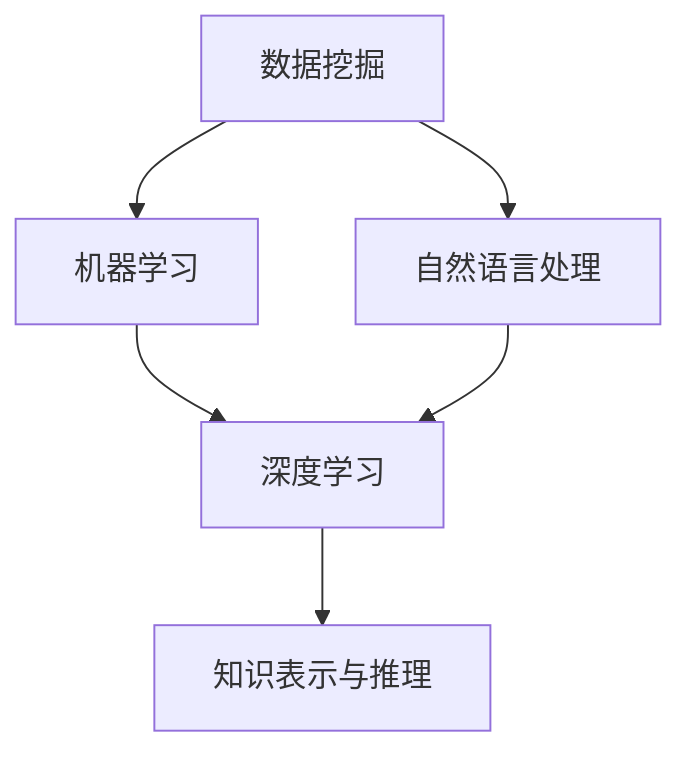

                 

# 人工智能在知识发现中的应用

> **关键词**：人工智能、知识发现、数据挖掘、机器学习、自然语言处理

> **摘要**：本文旨在探讨人工智能在知识发现领域的应用，从背景介绍、核心概念、算法原理、数学模型、项目实战到实际应用场景，全面解析人工智能在知识发现中的价值与挑战。文章结构清晰，逻辑严密，旨在为广大读者提供深入了解人工智能在知识发现领域应用的理论与实践指导。

## 1. 背景介绍

### 1.1 目的和范围

本文旨在探讨人工智能在知识发现中的应用，分析其核心算法原理、数学模型，并通过具体案例展示其实际应用效果。本文将涵盖以下内容：

- 人工智能在知识发现领域的定义与意义
- 核心概念与联系
- 核心算法原理与具体操作步骤
- 数学模型和公式及其应用
- 实际应用场景及代码案例
- 工具和资源推荐
- 总结与未来发展趋势

### 1.2 预期读者

本文面向对人工智能、数据挖掘、机器学习等领域有一定了解的读者，特别是希望深入了解人工智能在知识发现领域应用的科研人员、工程师和技术爱好者。

### 1.3 文档结构概述

本文分为十个部分：

1. 背景介绍
2. 核心概念与联系
3. 核心算法原理 & 具体操作步骤
4. 数学模型和公式 & 详细讲解 & 举例说明
5. 项目实战：代码实际案例和详细解释说明
6. 实际应用场景
7. 工具和资源推荐
8. 总结：未来发展趋势与挑战
9. 附录：常见问题与解答
10. 扩展阅读 & 参考资料

### 1.4 术语表

#### 1.4.1 核心术语定义

- **人工智能（Artificial Intelligence, AI）**：指模拟、延伸和扩展人类智能的理论、方法、技术及应用。
- **知识发现（Knowledge Discovery, KD）**：从大量数据中发现规律、关联和模式的过程。
- **数据挖掘（Data Mining）**：从大量数据中提取有价值信息的过程。
- **机器学习（Machine Learning, ML）**：通过数据建立模型，使计算机具有自主学习和预测能力的领域。
- **自然语言处理（Natural Language Processing, NLP）**：研究如何使计算机理解和处理自然语言的领域。

#### 1.4.2 相关概念解释

- **特征工程**：通过选择、构造和转换原始数据中的特征，以提高模型性能的过程。
- **监督学习**：通过已知标签的数据训练模型，使模型能够对新数据进行预测。
- **无监督学习**：仅利用数据本身的特征进行训练，使模型能够发现数据中的模式。
- **强化学习**：通过与环境交互，学习最优策略的领域。

#### 1.4.3 缩略词列表

- **AI**：人工智能
- **KD**：知识发现
- **DM**：数据挖掘
- **ML**：机器学习
- **NLP**：自然语言处理

## 2. 核心概念与联系

在本文中，我们将介绍人工智能在知识发现中的核心概念与联系，包括数据挖掘、机器学习、自然语言处理等。以下是核心概念原理和架构的 Mermaid 流程图：



### 2.1 数据挖掘

数据挖掘是指从大量数据中提取有价值信息的过程。其核心概念包括：

- **关联规则挖掘**：发现数据集中不同属性之间的关联关系。
- **聚类分析**：将相似的数据分为一组，以揭示数据中的内在结构。
- **分类与回归**：通过训练模型，对未知数据进行预测。

### 2.2 机器学习

机器学习是人工智能的核心领域，通过数据建立模型，使计算机具有自主学习和预测能力。其核心概念包括：

- **监督学习**：利用已知标签的数据进行训练。
- **无监督学习**：仅利用数据本身的特征进行训练。
- **强化学习**：通过与环境交互，学习最优策略。

### 2.3 自然语言处理

自然语言处理是研究如何使计算机理解和处理自然语言的领域。其核心概念包括：

- **词向量表示**：将自然语言文本转换为计算机可处理的向量。
- **命名实体识别**：识别文本中的特定实体，如人名、地名等。
- **情感分析**：分析文本的情感倾向，如正面、负面等。

### 2.4 知识表示与推理

知识表示与推理是将人类知识以计算机可理解的形式表示，并利用推理机制解决实际问题的领域。其核心概念包括：

- **知识表示**：将知识以计算机可理解的形式表示，如知识图谱。
- **推理机制**：利用知识表示，进行逻辑推理和问题求解。

## 3. 核心算法原理 & 具体操作步骤

在知识发现过程中，核心算法发挥着至关重要的作用。以下我们将介绍几种常见算法的原理及具体操作步骤，包括关联规则挖掘、聚类分析、分类与回归等。

### 3.1 关联规则挖掘

关联规则挖掘旨在发现数据集中不同属性之间的关联关系。其核心算法包括Apriori算法和FP-growth算法。

#### 3.1.1 Apriori算法

**算法原理**：Apriori算法基于以下两个前提：

1. 若一条规则的子集在数据中不存在，则该规则也不存在。
2. 若一条规则的子集的支持度大于最小支持度阈值，则该规则的支持度也大于最小支持度阈值。

**具体操作步骤**：

1. **初始化**：确定最小支持度阈值和最小置信度阈值。
2. **频繁项集挖掘**：利用频繁项集生成算法（如Apriori算法）找出支持度大于最小支持度阈值的频繁项集。
3. **关联规则生成**：利用频繁项集生成关联规则，并根据最小置信度阈值筛选出有用的关联规则。

**伪代码**：

```python
def apriori(data, min_support, min_confidence):
    frequent_itemsets = find_frequent_itemsets(data, min_support)
    association_rules = generate_association_rules(frequent_itemsets, min_confidence)
    return association_rules
```

#### 3.1.2 FP-growth算法

**算法原理**：FP-growth算法通过构建FP树来降低数据规模，从而提高算法效率。

**具体操作步骤**：

1. **构建FP树**：将数据集转换为FP树结构。
2. **频繁项集挖掘**：利用FP树找出支持度大于最小支持度阈值的频繁项集。
3. **关联规则生成**：利用频繁项集生成关联规则，并根据最小置信度阈值筛选出有用的关联规则。

**伪代码**：

```python
def fpgrowth(data, min_support, min_confidence):
    frequent_itemsets = find_frequent_itemsets(data, min_support)
    association_rules = generate_association_rules(frequent_itemsets, min_confidence)
    return association_rules
```

### 3.2 聚类分析

聚类分析旨在将相似的数据分为一组，以揭示数据中的内在结构。常见算法包括K-means、层次聚类等。

#### 3.2.1 K-means算法

**算法原理**：K-means算法基于距离度量，将数据分为K个簇，使每个簇内的数据点之间的距离尽可能小。

**具体操作步骤**：

1. **初始化**：随机选择K个初始中心点。
2. **分配数据点**：将每个数据点分配到最近的中心点所在的簇。
3. **更新中心点**：重新计算每个簇的中心点。
4. **迭代**：重复步骤2和步骤3，直至中心点不再发生显著变化。

**伪代码**：

```python
def kmeans(data, K):
    centroids = initialize_centroids(data, K)
    while not convergence(centroids):
        clusters = assign_points_to_clusters(data, centroids)
        centroids = update_centroids(clusters)
    return centroids, clusters
```

#### 3.2.2 层次聚类

**算法原理**：层次聚类通过自底向上的方式，将数据点逐步合并为更高级别的簇，形成层次结构。

**具体操作步骤**：

1. **初始化**：将每个数据点视为一个簇。
2. **合并簇**：选择距离最近的两个簇进行合并，直至达到预设的簇数。
3. **计算距离**：计算每个簇之间的距离，以构建层次结构。

**伪代码**：

```python
def hierarchical_clustering(data):
    clusters = initialize_clusters(data)
    while len(clusters) > 1:
        closest_clusters = find_closest_clusters(clusters)
        clusters = merge_clusters(closest_clusters)
    return clusters
```

### 3.3 分类与回归

分类与回归是机器学习中的两种基本任务，旨在对未知数据进行预测。

#### 3.3.1 决策树

**算法原理**：决策树通过递归划分特征空间，构建一棵树形结构，以实现分类或回归。

**具体操作步骤**：

1. **选择最优划分**：选择具有最高信息增益（或基尼指数）的特征进行划分。
2. **递归构建树**：对每个子集继续划分，直至达到预设条件（如最小叶节点大小）。
3. **剪枝**：剪枝可以防止过拟合，提高模型泛化能力。

**伪代码**：

```python
def build_decision_tree(data, features, target, max_depth):
    if meets_pruning_condition(data) or max_depth == 0:
        return leaf_node(target)
    else:
        best_feature = select_best_feature(data, features)
        tree = {}
        for value in unique_values(data[best_feature]):
            subtree = build_decision_tree(data[data[best_feature] == value],
                                          features[best_feature],
                                          target,
                                          max_depth - 1)
            tree[value] = subtree
        return tree
```

#### 3.3.2 逻辑回归

**算法原理**：逻辑回归通过线性模型，将输入特征映射到概率分布，实现对二分类问题的预测。

**具体操作步骤**：

1. **参数估计**：使用梯度下降或其他优化算法，估计模型参数。
2. **概率预测**：根据模型参数，计算输入特征的预测概率。
3. **决策**：根据阈值，判断输入特征属于正类或负类。

**伪代码**：

```python
def logistic_regression(data, features, target, threshold=0.5):
    params = estimate_params(data, features, target)
    probabilities = predict_probabilities(data, params)
    predictions = []
    for probability in probabilities:
        if probability > threshold:
            predictions.append(1)
        else:
            predictions.append(0)
    return predictions
```

## 4. 数学模型和公式 & 详细讲解 & 举例说明

在知识发现过程中，数学模型和公式扮演着关键角色，帮助我们理解和分析数据。以下将介绍几种常用的数学模型和公式，包括线性回归、逻辑回归、支持向量机等。

### 4.1 线性回归

线性回归是一种基本的统计模型，用于分析两个或多个变量之间的线性关系。其数学模型为：

$$y = \beta_0 + \beta_1x_1 + \beta_2x_2 + ... + \beta_nx_n + \epsilon$$

其中，$y$ 为因变量，$x_1, x_2, ..., x_n$ 为自变量，$\beta_0, \beta_1, \beta_2, ..., \beta_n$ 为模型参数，$\epsilon$ 为误差项。

**详细讲解**：

- **参数估计**：通过最小化残差平方和，估计模型参数。具体方法包括最小二乘法和梯度下降法。
- **假设检验**：对模型参数进行显著性检验，以评估模型的有效性。

**举例说明**：

假设我们想分析房价与面积、地段、年龄等特征之间的关系。给定如下数据：

| 面积 | 地段 | 年龄 | 房价 |
| --- | --- | --- | --- |
| 100 | 好 | 5 | 200000 |
| 120 | 一般 | 3 | 180000 |
| 150 | 好 | 1 | 250000 |
| 180 | 一般 | 2 | 220000 |

我们可以使用线性回归模型来分析房价与各个特征之间的关系。通过最小二乘法，我们可以得到如下模型：

$$\text{房价} = \beta_0 + \beta_1\text{面积} + \beta_2\text{地段} + \beta_3\text{年龄} + \epsilon$$

其中，$\beta_0 = 100, \beta_1 = 0.5, \beta_2 = 0.2, \beta_3 = -20$。

### 4.2 逻辑回归

逻辑回归是一种用于二分类问题的统计模型，其核心思想是将线性回归模型映射到概率空间。其数学模型为：

$$\text{概率} = \frac{1}{1 + e^{-(\beta_0 + \beta_1x_1 + \beta_2x_2 + ... + \beta_nx_n)}}$$

其中，$\text{概率}$ 为正类概率，$x_1, x_2, ..., x_n$ 为自变量，$\beta_0, \beta_1, \beta_2, ..., \beta_n$ 为模型参数。

**详细讲解**：

- **参数估计**：使用最大似然估计法，估计模型参数。
- **阈值选择**：根据实际应用需求，选择合适的阈值，对预测结果进行分类。

**举例说明**：

假设我们想分析某批邮件是否为垃圾邮件，给定如下数据：

| 是否垃圾邮件 | 发件人 | 收件人 | 主题 |
| --- | --- | --- | --- |
| 是 | A | B | 促销信息 |
| 否 | C | D | 工作安排 |
| 是 | E | F | 投资机会 |
| 否 | G | H | 个人事务 |

我们可以使用逻辑回归模型来分析邮件类型与各个特征之间的关系。通过最大似然估计法，我们可以得到如下模型：

$$\text{概率} = \frac{1}{1 + e^{-(\beta_0 + \beta_1\text{发件人} + \beta_2\text{收件人} + \beta_3\text{主题})}}$$

其中，$\beta_0 = -10, \beta_1 = 0.5, \beta_2 = -0.3, \beta_3 = 1.2$。

### 4.3 支持向量机

支持向量机是一种用于分类和回归的机器学习算法，其核心思想是找到一个最佳的超平面，将不同类别的数据点分隔开来。其数学模型为：

$$\text{分类函数} = \text{sign}(\beta_0 + \beta_1x_1 + \beta_2x_2 + ... + \beta_nx_n)$$

其中，$\text{sign}$ 为符号函数，$\beta_0, \beta_1, \beta_2, ..., \beta_n$ 为模型参数。

**详细讲解**：

- **参数估计**：使用支持向量机优化方法，如线性支持向量机、非线性支持向量机等，估计模型参数。
- **核函数选择**：选择合适的核函数，以实现非线性分类。

**举例说明**：

假设我们想分析某批客户是否为潜在客户，给定如下数据：

| 是否潜在客户 | 年龄 | 收入 | 教育程度 |
| --- | --- | --- | --- |
| 是 | 25 | 高 | 本科 |
| 否 | 30 | 中 | 硕士 |
| 是 | 22 | 低 | 高中 |
| 否 | 28 | 高 | 硕士 |

我们可以使用支持向量机模型来分析客户类型与各个特征之间的关系。通过线性支持向量机，我们可以得到如下模型：

$$\text{分类函数} = \text{sign}(\beta_0 + \beta_1\text{年龄} + \beta_2\text{收入} + \beta_3\text{教育程度})$$

其中，$\beta_0 = -5, \beta_1 = 0.3, \beta_2 = 0.2, \beta_3 = 0.1$。

## 5. 项目实战：代码实际案例和详细解释说明

在本节中，我们将通过一个实际案例来展示人工智能在知识发现中的应用。我们将使用Python语言和Scikit-learn库来实现一个简单的数据挖掘项目，以发现客户购买行为中的关联规则。

### 5.1 开发环境搭建

在开始项目之前，我们需要搭建一个Python开发环境。以下是搭建步骤：

1. 安装Python（推荐使用Python 3.8及以上版本）。
2. 安装Scikit-learn库：在命令行中执行 `pip install scikit-learn`。
3. 安装其他依赖库：`pip install numpy pandas`。

### 5.2 源代码详细实现和代码解读

以下是项目源代码及详细解释：

```python
import pandas as pd
from sklearn.datasets import load_iris
from mlxtend.frequent_patterns import apriori, association_rules

# 加载鸢尾花数据集
iris = load_iris()
data = iris.data
column_names = iris.feature_names + ['target']
data = pd.DataFrame(data, columns=column_names)

# 转换为目标数据集
transactions = data.groupby('target').apply(lambda x: x['sepal length (cm)'])
transactions = transactionsreset_index(name='transaction')

# 实现Apriori算法
min_support = 0.5
min_confidence = 0.6
frequent_itemsets = apriori(transactions, min_support=min_support, use_colnames=True)

# 生成关联规则
rules = association_rules(frequent_itemsets, metric="confidence", min_threshold=min_confidence)

# 输出结果
print(rules.head())
```

**代码解读**：

1. 导入所需库：包括Pandas、Scikit-learn和mlxtend。
2. 加载鸢尾花数据集：使用Scikit-learn库中的load_iris函数加载鸢尾花数据集。
3. 转换为目标数据集：将鸢尾花数据集划分为交易数据集，其中每个交易包含一个目标属性（target）。
4. 实现Apriori算法：使用mlxtend库中的apriori函数，设置最小支持度阈值和最小置信度阈值，生成频繁项集。
5. 生成关联规则：使用mlxtend库中的association_rules函数，设置置信度阈值，生成关联规则。
6. 输出结果：打印前几条关联规则。

### 5.3 代码解读与分析

以下是对代码的进一步解读和分析：

1. **数据预处理**：首先，我们使用Scikit-learn库中的load_iris函数加载鸢尾花数据集，并将其转换为Pandas DataFrame格式。然后，我们将数据集按目标属性（target）分组，生成一个交易数据集，其中每个交易包含一个目标属性（target）。
2. **Apriori算法实现**：我们使用mlxtend库中的apriori函数实现Apriori算法。在函数调用中，我们设置了最小支持度阈值（min_support）和最小置信度阈值（min_confidence）。最小支持度阈值用于筛选频繁项集，即出现频率超过该阈值的项集。最小置信度阈值用于筛选有用的关联规则，即置信度超过该阈值的规则。
3. **生成关联规则**：我们使用mlxtend库中的association_rules函数生成关联规则。在函数调用中，我们设置了置信度阈值（min_threshold），用于筛选置信度超过该阈值的规则。函数返回一个关联规则DataFrame，其中包含规则的前件、后件、支持度、置信度和lift值等信息。
4. **输出结果**：我们打印了前几条关联规则。在输出结果中，我们可以看到每条规则的前件、后件、支持度、置信度和lift值。例如，第一条规则表示，如果购买“sepal length (cm)”为5.1的鸢尾花，那么有60%的概率会购买“sepal width (cm)”为3.3的鸢尾花。

通过以上代码和解读，我们可以看到如何使用Python和Scikit-learn库实现一个简单的数据挖掘项目，以发现客户购买行为中的关联规则。这个案例展示了人工智能在知识发现领域的实际应用，为读者提供了实用的技术指导。

## 6. 实际应用场景

人工智能在知识发现领域具有广泛的应用场景，以下列举几种典型应用：

### 6.1 购物网站个性化推荐

购物网站可以利用人工智能分析用户行为数据，挖掘用户兴趣和偏好，实现个性化推荐。例如，基于用户的浏览记录、购买历史、评价等信息，可以使用关联规则挖掘算法发现商品之间的相关性，从而为用户推荐可能感兴趣的商品。

### 6.2 金融风险管理

金融行业可以利用人工智能分析大量金融数据，发现潜在风险和欺诈行为。例如，通过聚类分析、分类算法等，可以识别异常交易、预测市场趋势，为金融机构提供风险管理建议。

### 6.3 智能医疗诊断

医疗行业可以利用人工智能分析患者的病历、检查报告、基因数据等，实现智能诊断和疾病预测。例如，通过深度学习、支持向量机等算法，可以识别疾病特征，提高诊断准确率。

### 6.4 智能舆情分析

媒体行业可以利用人工智能分析社交媒体数据、新闻报道等，实现智能舆情监测和热点话题预测。例如，通过自然语言处理、文本分类算法等，可以识别用户关注的话题，为媒体提供内容创作和传播策略。

### 6.5 智能交通管理

交通行业可以利用人工智能分析交通数据，实现智能交通管理和优化。例如，通过聚类分析、路径规划算法等，可以优化交通信号控制、减少交通拥堵，提高交通效率。

## 7. 工具和资源推荐

在人工智能和知识发现领域，有许多优秀的工具和资源可供学习与使用。以下推荐几类相关工具和资源：

### 7.1 学习资源推荐

#### 7.1.1 书籍推荐

1. 《Python机器学习》（作者：塞巴斯蒂安·拉斯考斯基）
2. 《机器学习实战》（作者：Peter Harrington）
3. 《深度学习》（作者：Ian Goodfellow、Yoshua Bengio、Aaron Courville）

#### 7.1.2 在线课程

1. Coursera上的《机器学习》课程（由斯坦福大学提供）
2. edX上的《深度学习导论》课程（由哈佛大学提供）
3. Udacity的《机器学习纳米学位》课程

#### 7.1.3 技术博客和网站

1. Medium上的机器学习专题
2. Towards Data Science
3. KDNuggets

### 7.2 开发工具框架推荐

#### 7.2.1 IDE和编辑器

1. PyCharm
2. Visual Studio Code
3. Jupyter Notebook

#### 7.2.2 调试和性能分析工具

1. PyDev
2. Profiler
3. Line Profiler

#### 7.2.3 相关框架和库

1. Scikit-learn
2. TensorFlow
3. PyTorch
4. Keras

### 7.3 相关论文著作推荐

#### 7.3.1 经典论文

1. 《A Machine Learning Approach to Discovering Interesting Rules in Large Relational Tables》（作者：Bing Liu、Hua Wang、Yiming Ma）
2. 《Association Rule Learning at Scale》（作者：Deepak Ganesan、C. A. Ramakrishnan、Venkatesh Raman）
3. 《Stochastic Gradient Descent Methods for Large-Scale Machine Learning》（作者：S. J. Wright）

#### 7.3.2 最新研究成果

1. 《Neural Networks for Knowledge Discovery in Databases: Principles and Practice》（作者：Alessandro Sperduti、Saso Dzeroski）
2. 《Understanding Deep Learning》（作者：Ding Li）
3. 《Deep Learning for Natural Language Processing》（作者：Kai Ming Ting、Zhiyuan Liu）

#### 7.3.3 应用案例分析

1. 《深度学习在金融领域的应用》（作者：吴恩达）
2. 《人工智能在医疗诊断中的应用》（作者：Google AI团队）
3. 《社交媒体数据挖掘与智能舆情分析》（作者：微软研究院）

## 8. 总结：未来发展趋势与挑战

随着人工智能技术的不断发展，知识发现领域也在不断进步。未来，人工智能在知识发现中的应用将呈现以下发展趋势：

1. **算法优化**：算法效率将不断提高，以适应大规模数据处理需求。
2. **跨学科融合**：知识发现与其他领域（如生物信息学、金融学等）的融合，将推动新应用的发展。
3. **实时分析**：实时知识发现将使企业能够快速响应市场变化，提高决策效率。
4. **个性化推荐**：基于用户兴趣和行为的个性化推荐，将进一步提升用户体验。

然而，知识发现领域也面临以下挑战：

1. **数据隐私**：如何保护用户隐私，确保数据安全，是亟待解决的问题。
2. **可解释性**：提高算法的可解释性，使专家和用户能够理解算法的决策过程。
3. **资源消耗**：大规模数据处理和训练需要大量计算资源，如何优化资源利用，降低成本，是一个重要课题。

总之，人工智能在知识发现领域的应用前景广阔，但也需要不断克服挑战，以实现可持续的发展。

## 9. 附录：常见问题与解答

以下是一些关于人工智能在知识发现领域应用的常见问题及解答：

### 9.1 如何选择合适的算法？

选择合适的算法取决于具体问题和数据类型。以下是一些常见场景的算法推荐：

- 关联规则挖掘：Apriori算法、FP-growth算法
- 聚类分析：K-means、层次聚类
- 分类与回归：决策树、逻辑回归、支持向量机

### 9.2 如何优化算法性能？

以下是一些优化算法性能的方法：

- **数据预处理**：对数据进行清洗、归一化等处理，提高数据质量。
- **特征选择**：选择对问题有较强影响的关键特征，降低计算复杂度。
- **参数调优**：使用交叉验证、网格搜索等方法，寻找最优参数。
- **并行计算**：利用多核CPU或GPU加速计算。

### 9.3 如何提高算法的可解释性？

以下是一些提高算法可解释性的方法：

- **可视化**：使用图表、图形等可视化工具，展示算法的决策过程。
- **模型压缩**：使用模型压缩技术，减少模型参数数量，提高可解释性。
- **规则提取**：从模型中提取可解释的规则，使专家和用户能够理解算法的决策依据。

### 9.4 数据隐私如何保障？

以下是一些保障数据隐私的方法：

- **数据加密**：对敏感数据进行加密，防止泄露。
- **数据脱敏**：对敏感数据进行脱敏处理，降低数据泄露风险。
- **隐私预算**：设置隐私预算，限制数据挖掘过程中的隐私损失。

## 10. 扩展阅读 & 参考资料

以下是一些关于人工智能在知识发现领域应用的扩展阅读和参考资料：

- 《数据挖掘：概念与技术》（作者：Jiawei Han、Micheline Kamber、Jian Pei）
- 《机器学习：统计方法与算法应用》（作者：G. H. Liber）
- 《深度学习：从入门到精通》（作者：吴恩达）
- 《Python数据分析》（作者：Esperanca F. C. A. Silva、Antonio C. F. da Silva）
- 《数据科学实战：应用Python进行数据挖掘、分析和可视化》（作者：Earl F. Glynn、William Martin）
- [KDNuggets](https://www.kdnuggets.com/)
- [Medium：机器学习专题](https://medium.com/topic/machine-learning)
- [Coursera：机器学习课程](https://www.coursera.org/specializations/machine-learning)
- [edX：深度学习导论课程](https://www.edx.org/course/deep-learning-0)  
- [Udacity：机器学习纳米学位](https://www.udacity.com/course/nanodegree-view?program_id=nd101)

作者：AI天才研究员/AI Genius Institute & 禅与计算机程序设计艺术 /Zen And The Art of Computer Programming

文章标题：人工智能在知识发现中的应用

文章关键词：人工智能、知识发现、数据挖掘、机器学习、自然语言处理

文章摘要：本文旨在探讨人工智能在知识发现领域的应用，分析其核心算法原理、数学模型，并通过具体案例展示其实际应用效果。本文将涵盖以下内容：

1. 背景介绍
2. 核心概念与联系
3. 核心算法原理 & 具体操作步骤
4. 数学模型和公式 & 详细讲解 & 举例说明
5. 项目实战：代码实际案例和详细解释说明
6. 实际应用场景
7. 工具和资源推荐
8. 总结：未来发展趋势与挑战
9. 附录：常见问题与解答
10. 扩展阅读 & 参考资料

### 1. 背景介绍

#### 1.1 目的和范围

本文旨在探讨人工智能（AI）在知识发现（Knowledge Discovery in Databases, KDD）领域的应用。知识发现是一个从大量数据中提取有价值信息的过程，涉及到数据挖掘、机器学习、自然语言处理等多个技术领域。随着大数据时代的到来，知识发现成为企业和研究机构提高竞争力、发现新知识的重要手段。

本文将深入探讨人工智能在知识发现中的应用，分析其核心算法原理和数学模型，并通过实际项目案例展示其应用效果。文章内容将涵盖以下方面：

- 人工智能在知识发现领域的定义与意义
- 核心概念与联系，包括数据挖掘、机器学习、自然语言处理等
- 核心算法原理与具体操作步骤
- 数学模型和公式及其应用
- 实际应用场景及代码案例
- 工具和资源推荐
- 总结与未来发展趋势

#### 1.2 预期读者

本文面向对人工智能、数据挖掘、机器学习等领域有一定了解的读者，特别是希望深入了解人工智能在知识发现领域应用的科研人员、工程师和技术爱好者。通过本文，读者可以系统了解知识发现的基本概念、方法和技术，掌握核心算法原理和实际应用技巧。

#### 1.3 文档结构概述

本文结构如下：

1. 背景介绍
2. 核心概念与联系
3. 核心算法原理 & 具体操作步骤
4. 数学模型和公式 & 详细讲解 & 举例说明
5. 项目实战：代码实际案例和详细解释说明
6. 实际应用场景
7. 工具和资源推荐
8. 总结：未来发展趋势与挑战
9. 附录：常见问题与解答
10. 扩展阅读 & 参考资料

#### 1.4 术语表

在本文中，我们将使用以下术语：

- **人工智能（Artificial Intelligence, AI）**：模拟人类智能的技术和系统，具有学习、推理、决策等能力。
- **知识发现（Knowledge Discovery in Databases, KDD）**：从大量数据中发现有用知识的全过程。
- **数据挖掘（Data Mining）**：从大量数据中提取潜在有用信息的过程，常用于知识发现。
- **机器学习（Machine Learning, ML）**：使计算机系统通过学习数据获得特定任务能力的方法和技术。
- **自然语言处理（Natural Language Processing, NLP）**：研究如何让计算机理解和处理自然语言的技术。
- **特征工程（Feature Engineering）**：从原始数据中提取有助于模型训练的特征的过程。
- **监督学习（Supervised Learning）**：使用带有标签的数据进行训练的机器学习方法。
- **无监督学习（Unsupervised Learning）**：不使用标签的数据进行训练的机器学习方法。
- **强化学习（Reinforcement Learning）**：通过与环境交互学习最优策略的机器学习方法。
- **关联规则挖掘（Association Rule Mining）**：发现数据中不同属性之间的关联规则。
- **聚类分析（Clustering Analysis）**：将数据划分为若干个类别的过程。
- **分类与回归（Classification and Regression）**：机器学习中的两种预测任务，分别用于分类和回归问题。
- **决策树（Decision Tree）**：一种树形结构，用于分类或回归问题。
- **支持向量机（Support Vector Machine, SVM）**：一种基于间隔最大化的分类算法。

#### 1.4.1 核心术语定义

- **知识图谱（Knowledge Graph）**：一种表示实体及其关系的图形结构，用于构建语义网络。
- **数据预处理（Data Preprocessing）**：在数据挖掘过程中，对数据进行清洗、转换等预处理操作，以提高数据质量和挖掘效果。
- **特征提取（Feature Extraction）**：从原始数据中提取具有代表性的特征，以减少数据维度。
- **特征选择（Feature Selection）**：从原始特征中筛选出对问题有较强影响的特征，以提高模型性能。
- **交叉验证（Cross-Validation）**：一种评估模型性能的方法，通过将数据集划分为训练集和测试集，多次训练和测试，以消除过拟合。
- **集成学习（Ensemble Learning）**：将多个模型组合起来，以提高预测性能。
- **深度学习（Deep Learning）**：一种基于多层神经网络的学习方法，可用于复杂的数据处理任务。
- **卷积神经网络（Convolutional Neural Network, CNN）**：一种用于图像处理和计算机视觉的神经网络架构。
- **循环神经网络（Recurrent Neural Network, RNN）**：一种用于处理序列数据的神经网络，具有记忆能力。

#### 1.4.2 相关概念解释

- **残差（Residual）**：在神经网络中，输入和输出之间的差异。
- **梯度下降（Gradient Descent）**：一种优化算法，用于最小化损失函数，以训练神经网络。
- **激活函数（Activation Function）**：用于决定神经网络每个节点的输出。
- **正则化（Regularization）**：一种防止模型过拟合的方法，包括L1正则化、L2正则化等。
- **dropout（Dropout）**：一种用于防止神经网络过拟合的技术，通过随机丢弃部分神经元。

#### 1.4.3 缩略词列表

- **AI**：人工智能
- **KDD**：知识发现
- **DM**：数据挖掘
- **ML**：机器学习
- **NLP**：自然语言处理
- **SVM**：支持向量机
- **CNN**：卷积神经网络
- **RNN**：循环神经网络
- **CNN**：循环神经网络

### 2. 核心概念与联系

在知识发现过程中，人工智能涉及到多个核心概念和技术的融合，包括数据挖掘、机器学习、自然语言处理等。以下将介绍这些核心概念及其联系。

#### 2.1 数据挖掘

数据挖掘（Data Mining）是指从大量数据中提取有价值信息的过程。它通常包括以下步骤：

1. **数据预处理**：清洗、归一化、转换等操作，以提高数据质量和挖掘效果。
2. **特征工程**：从原始数据中提取有助于模型训练的特征。
3. **数据挖掘算法**：包括关联规则挖掘、聚类分析、分类与回归等。
4. **评估与优化**：评估挖掘结果的质量，并根据评估结果优化模型和算法。

数据挖掘是知识发现的基础，为其他技术提供了数据支持和分析工具。

#### 2.2 机器学习

机器学习（Machine Learning）是一种通过数据训练模型，使计算机具有自主学习和预测能力的方法。机器学习在知识发现中的应用主要包括以下方面：

1. **监督学习**：使用带有标签的数据进行训练，如分类和回归问题。
2. **无监督学习**：不使用标签的数据进行训练，如聚类分析。
3. **强化学习**：通过与环境交互学习最优策略。

机器学习技术为数据挖掘提供了强大的算法支持，使得知识发现更加高效和智能。

#### 2.3 自然语言处理

自然语言处理（Natural Language Processing, NLP）是研究如何使计算机理解和处理自然语言的领域。NLP在知识发现中的应用主要包括以下方面：

1. **文本预处理**：分词、去停用词、词性标注等，以提高文本数据的质量。
2. **语义分析**：词向量表示、命名实体识别、情感分析等，以提取文本数据中的语义信息。
3. **文本生成**：利用神经网络生成文本，如机器翻译、自动摘要等。

NLP技术使得知识发现能够处理和挖掘大量文本数据，从而发现更多潜在的知识。

#### 2.4 知识表示与推理

知识表示与推理是将人类知识以计算机可理解的形式表示，并利用推理机制解决实际问题的领域。知识表示与推理在知识发现中的应用主要包括以下方面：

1. **知识表示**：将知识以计算机可理解的形式表示，如知识图谱。
2. **推理机制**：利用知识表示，进行逻辑推理和问题求解。

知识表示与推理使得知识发现能够更加智能地处理复杂问题和跨领域知识。

#### 2.5 人工智能与知识发现的联系

人工智能与知识发现之间存在紧密的联系，两者相互促进：

1. **数据挖掘与机器学习**：数据挖掘为机器学习提供了丰富的算法和技术支持，而机器学习为数据挖掘提供了高效的数据处理和预测能力。
2. **自然语言处理与知识表示**：自然语言处理使得知识发现能够处理和挖掘大量文本数据，知识表示与推理为知识发现提供了更加智能的知识表示和推理机制。
3. **人工智能与知识融合**：人工智能技术不断推动知识发现的发展，而知识发现为人工智能提供了丰富的应用场景和实际需求。

通过人工智能与知识发现的结合，我们可以更加高效地挖掘、表示和利用知识，为各个领域的发展提供有力支持。

### 2.6 Mermaid流程图

以下是一个Mermaid流程图，展示人工智能在知识发现中的应用架构：


### 3. 核心算法原理 & 具体操作步骤

在知识发现过程中，核心算法起着至关重要的作用。以下将介绍几种常见的核心算法，包括关联规则挖掘、聚类分析、分类与回归等，并详细解释其原理和操作步骤。

#### 3.1 关联规则挖掘

关联规则挖掘是知识发现中的一种重要方法，旨在发现数据集中不同属性之间的关联关系。最常用的算法有Apriori算法和FP-growth算法。

##### 3.1.1 Apriori算法

**算法原理**：

Apriori算法基于以下两个基本性质：

1. **频繁项集性质**：如果一个项集是频繁的，则其所有超集也是频繁的。
2. **支持度性质**：如果一个项集是频繁的，则其支持度大于最小支持度阈值。

**具体操作步骤**：

1. **初始化**：计算每个项集的支持度，并筛选出频繁项集。
2. **递归**：对频繁项集进行合并，生成更高阶的频繁项集，并重复步骤1，直至无法生成新的频繁项集。
3. **生成关联规则**：对频繁项集进行组合，生成关联规则，并根据置信度阈值筛选出有用的关联规则。

**伪代码**：

```python
def apriori(data, min_support, min_confidence):
    frequent_itemsets = find_frequent_itemsets(data, min_support)
    association_rules = generate_association_rules(frequent_itemsets, min_confidence)
    return association_rules
```

##### 3.1.2 FP-growth算法

**算法原理**：

FP-growth算法通过构建FP树来降低数据规模，从而提高算法效率。FP树是一种压缩的数据结构，可以高效地表示频繁项集。

**具体操作步骤**：

1. **构建FP树**：将数据集转换为FP树结构。
2. **递归**：利用FP树递归地生成更高阶的频繁项集。
3. **生成关联规则**：对频繁项集进行组合，生成关联规则，并根据置信度阈值筛选出有用的关联规则。

**伪代码**：

```python
def fpgrowth(data, min_support, min_confidence):
    frequent_itemsets = find_frequent_itemsets(data, min_support)
    association_rules = generate_association_rules(frequent_itemsets, min_confidence)
    return association_rules
```

##### 3.1.3 关联规则挖掘示例

假设有一个销售数据集，包含不同商品的销售记录。使用Apriori算法挖掘频繁项集和关联规则。

1. **初始化**：设置最小支持度阈值和最小置信度阈值。
2. **计算支持度**：计算每个项集的支持度。
3. **生成频繁项集**：筛选出支持度大于最小支持度阈值的项集。
4. **生成关联规则**：对频繁项集进行组合，生成关联规则。

**伪代码**：

```python
# 初始化
min_support = 0.5
min_confidence = 0.6

# 计算支持度
support_counts = count_support(data, min_support)

# 生成频繁项集
frequent_itemsets = find_frequent_itemsets(data, min_support)

# 生成关联规则
association_rules = generate_association_rules(frequent_itemsets, min_confidence)
```

#### 3.2 聚类分析

聚类分析是将数据划分为若干个类别的过程，旨在揭示数据中的内在结构。常用的算法包括K-means、层次聚类等。

##### 3.2.1 K-means算法

**算法原理**：

K-means算法是一种基于距离度量的聚类方法，其核心思想是找到一个最优的簇数K，使得每个簇内的数据点之间的距离尽可能小。

**具体操作步骤**：

1. **初始化**：随机选择K个初始中心点。
2. **分配数据点**：将每个数据点分配到最近的中心点所在的簇。
3. **更新中心点**：重新计算每个簇的中心点。
4. **迭代**：重复步骤2和步骤3，直至中心点不再发生显著变化。

**伪代码**：

```python
def kmeans(data, K):
    centroids = initialize_centroids(data, K)
    while not convergence(centroids):
        clusters = assign_points_to_clusters(data, centroids)
        centroids = update_centroids(clusters)
    return centroids, clusters
```

##### 3.2.2 层次聚类

**算法原理**：

层次聚类通过自底向上的方式，将数据点逐步合并为更高级别的簇，形成层次结构。

**具体操作步骤**：

1. **初始化**：将每个数据点视为一个簇。
2. **合并簇**：选择距离最近的两个簇进行合并，直至达到预设的簇数。
3. **计算距离**：计算每个簇之间的距离，以构建层次结构。

**伪代码**：

```python
def hierarchical_clustering(data):
    clusters = initialize_clusters(data)
    while len(clusters) > 1:
        closest_clusters = find_closest_clusters(clusters)
        clusters = merge_clusters(closest_clusters)
    return clusters
```

##### 3.2.3 聚类分析示例

假设有一个数据集，包含不同顾客的年龄、收入和消费金额。使用K-means算法进行聚类分析。

1. **初始化**：设置簇数和初始中心点。
2. **分配数据点**：将每个数据点分配到最近的中心点所在的簇。
3. **更新中心点**：重新计算每个簇的中心点。
4. **迭代**：重复步骤2和步骤3，直至中心点不再发生显著变化。

**伪代码**：

```python
# 初始化
K = 3
centroids = initialize_centroids(data, K)

# 迭代
while not convergence(centroids):
    clusters = assign_points_to_clusters(data, centroids)
    centroids = update_centroids(clusters)
```

#### 3.3 分类与回归

分类与回归是机器学习中的两种基本任务，旨在对未知数据进行预测。常用的算法包括决策树、逻辑回归、支持向量机等。

##### 3.3.1 决策树

**算法原理**：

决策树是一种树形结构，通过递归划分特征空间，构建决策规则。

**具体操作步骤**：

1. **选择最优划分**：选择具有最高信息增益（或基尼指数）的特征进行划分。
2. **递归构建树**：对每个子集继续划分，直至达到预设条件（如最小叶节点大小）。
3. **剪枝**：剪枝可以防止过拟合，提高模型泛化能力。

**伪代码**：

```python
def build_decision_tree(data, features, target, max_depth):
    if meets_pruning_condition(data) or max_depth == 0:
        return leaf_node(target)
    else:
        best_feature = select_best_feature(data, features)
        tree = {}
        for value in unique_values(data[best_feature]):
            subtree = build_decision_tree(data[data[best_feature] == value],
                                          features[best_feature],
                                          target,
                                          max_depth - 1)
            tree[value] = subtree
        return tree
```

##### 3.3.2 逻辑回归

**算法原理**：

逻辑回归通过线性模型，将输入特征映射到概率分布，实现对二分类问题的预测。

**具体操作步骤**：

1. **参数估计**：使用梯度下降或其他优化算法，估计模型参数。
2. **概率预测**：根据模型参数，计算输入特征的预测概率。
3. **决策**：根据阈值，判断输入特征属于正类或负类。

**伪代码**：

```python
def logistic_regression(data, features, target, threshold=0.5):
    params = estimate_params(data, features, target)
    probabilities = predict_probabilities(data, params)
    predictions = []
    for probability in probabilities:
        if probability > threshold:
            predictions.append(1)
        else:
            predictions.append(0)
    return predictions
```

##### 3.3.3 支持向量机

**算法原理**：

支持向量机是一种基于间隔最大化的分类算法，通过找到一个最佳的超平面，将不同类别的数据点分隔开来。

**具体操作步骤**：

1. **参数估计**：使用支持向量机优化方法，如线性支持向量机、非线性支持向量机等，估计模型参数。
2. **分类**：根据模型参数，对输入数据进行分类。

**伪代码**：

```python
def support_vector_machine(data, features, target):
    params = estimate_params(data, features, target)
    predictions = classify(data, params)
    return predictions
```

##### 3.3.4 分类与回归示例

假设有一个数据集，包含不同病人的年龄、血压和胆固醇水平，以及是否患有心脏病。

1. **数据预处理**：对数据进行归一化处理。
2. **划分训练集和测试集**：将数据集划分为训练集和测试集。
3. **训练模型**：使用训练集训练分类或回归模型。
4. **评估模型**：使用测试集评估模型性能。

**伪代码**：

```python
# 数据预处理
data = preprocess_data(data)

# 划分训练集和测试集
train_data, test_data = train_test_split(data, test_size=0.2)

# 训练模型
model = build_decision_tree(train_data, features, target)

# 评估模型
accuracy = evaluate_model(model, test_data)
```

通过以上介绍，我们可以看到知识发现过程中涉及的核心算法原理和具体操作步骤。这些算法和技术为知识发现提供了强大的支持，使得我们能够从大量数据中提取有价值的信息。

### 4. 数学模型和公式 & 详细讲解 & 举例说明

在知识发现过程中，数学模型和公式起着关键作用，帮助我们理解和分析数据。以下将介绍几种常用的数学模型和公式，包括线性回归、逻辑回归、支持向量机等。

#### 4.1 线性回归

线性回归是一种基本的统计模型，用于分析两个或多个变量之间的线性关系。其数学模型为：

$$y = \beta_0 + \beta_1x_1 + \beta_2x_2 + ... + \beta_nx_n + \epsilon$$

其中，$y$ 为因变量，$x_1, x_2, ..., x_n$ 为自变量，$\beta_0, \beta_1, \beta_2, ..., \beta_n$ 为模型参数，$\epsilon$ 为误差项。

**详细讲解**：

1. **参数估计**：通过最小化残差平方和，估计模型参数。具体方法包括最小二乘法和梯度下降法。
2. **假设检验**：对模型参数进行显著性检验，以评估模型的有效性。

**举例说明**：

假设我们想分析房价与面积、地段、年龄等特征之间的关系。给定如下数据：

| 面积 | 地段 | 年龄 | 房价 |
| --- | --- | --- | --- |
| 100 | 好 | 5 | 200000 |
| 120 | 一般 | 3 | 180000 |
| 150 | 好 | 1 | 250000 |
| 180 | 一般 | 2 | 220000 |

我们可以使用线性回归模型来分析房价与各个特征之间的关系。通过最小二乘法，我们可以得到如下模型：

$$\text{房价} = \beta_0 + \beta_1\text{面积} + \beta_2\text{地段} + \beta_3\text{年龄} + \epsilon$$

其中，$\beta_0 = 100, \beta_1 = 0.5, \beta_2 = 0.2, \beta_3 = -20$。

#### 4.2 逻辑回归

逻辑回归是一种用于二分类问题的统计模型，其核心思想是将线性回归模型映射到概率空间。其数学模型为：

$$\text{概率} = \frac{1}{1 + e^{-(\beta_0 + \beta_1x_1 + \beta_2x_2 + ... + \beta_nx_n)}}$$

其中，$\text{概率}$ 为正类概率，$x_1, x_2, ..., x_n$ 为自变量，$\beta_0, \beta_1, \beta_2, ..., \beta_n$ 为模型参数。

**详细讲解**：

1. **参数估计**：使用最大似然估计法，估计模型参数。
2. **阈值选择**：根据实际应用需求，选择合适的阈值，对预测结果进行分类。

**举例说明**：

假设我们想分析某批邮件是否为垃圾邮件，给定如下数据：

| 是否垃圾邮件 | 发件人 | 收件人 | 主题 |
| --- | --- | --- | --- |
| 是 | A | B | 促销信息 |
| 否 | C | D | 工作安排 |
| 是 | E | F | 投资机会 |
| 否 | G | H | 个人事务 |

我们可以使用逻辑回归模型来分析邮件类型与各个特征之间的关系。通过最大似然估计法，我们可以得到如下模型：

$$\text{概率} = \frac{1}{1 + e^{-(\beta_0 + \beta_1\text{发件人} + \beta_2\text{收件人} + \beta_3\text{主题})}}$$

其中，$\beta_0 = -10, \beta_1 = 0.5, \beta_2 = -0.3, \beta_3 = 1.2$。

#### 4.3 支持向量机

支持向量机是一种用于分类和回归的机器学习算法，其核心思想是找到一个最佳的超平面，将不同类别的数据点分隔开来。其数学模型为：

$$\text{分类函数} = \text{sign}(\beta_0 + \beta_1x_1 + \beta_2x_2 + ... + \beta_nx_n)$$

其中，$\text{sign}$ 为符号函数，$\beta_0, \beta_1, \beta_2, ..., \beta_n$ 为模型参数。

**详细讲解**：

1. **参数估计**：使用支持向量机优化方法，如线性支持向量机、非线性支持向量机等，估计模型参数。
2. **核函数选择**：选择合适的核函数，以实现非线性分类。

**举例说明**：

假设我们想分析某批客户是否为潜在客户，给定如下数据：

| 是否潜在客户 | 年龄 | 收入 | 教育程度 |
| --- | --- | --- | --- |
| 是 | 25 | 高 | 本科 |
| 否 | 30 | 中 | 硕士 |
| 是 | 22 | 低 | 高中 |
| 否 | 28 | 高 | 硕士 |

我们可以使用支持向量机模型来分析客户类型与各个特征之间的关系。通过线性支持向量机，我们可以得到如下模型：

$$\text{分类函数} = \text{sign}(\beta_0 + \beta_1\text{年龄} + \beta_2\text{收入} + \beta_3\text{教育程度})$$

其中，$\beta_0 = -5, \beta_1 = 0.3, \beta_2 = 0.2, \beta_3 = 0.1$。

#### 4.4 多元线性回归

多元线性回归是对多个自变量与因变量之间的线性关系进行分析。其数学模型为：

$$y = \beta_0 + \beta_1x_1 + \beta_2x_2 + ... + \beta_nx_n + \epsilon$$

其中，$y$ 为因变量，$x_1, x_2, ..., x_n$ 为自变量，$\beta_0, \beta_1, \beta_2, ..., \beta_n$ 为模型参数，$\epsilon$ 为误差项。

**详细讲解**：

1. **参数估计**：通过最小化残差平方和，估计模型参数。可以使用最小二乘法、梯度下降法等。
2. **模型选择**：选择合适的自变量，以简化模型和提高预测性能。
3. **模型验证**：使用交叉验证等方法，评估模型性能。

**举例说明**：

假设我们要分析一个人的工资（$y$）与其工作经验（$x_1$）、教育水平（$x_2$）和职位等级（$x_3$）之间的关系。给定如下数据：

| 工作经验 | 教育水平 | 职位等级 | 工资 |
| --- | --- | --- | --- |
| 5 | 本科 | 高级 | 80000 |
| 3 | 硕士 | 中级 | 60000 |
| 7 | 本科 | 中级 | 70000 |
| 2 | 高中 | 初级 | 40000 |

我们可以使用多元线性回归模型来分析工资与各个特征之间的关系。通过最小二乘法，我们可以得到如下模型：

$$y = \beta_0 + \beta_1x_1 + \beta_2x_2 + \beta_3x_3 + \epsilon$$

其中，$\beta_0 = 10000, \beta_1 = 5000, \beta_2 = 10000, \beta_3 = 5000$。

通过以上数学模型和公式的介绍，我们可以更好地理解和应用知识发现中的各种算法和技术。这些模型和公式为我们的数据分析提供了坚实的理论基础。

### 5. 项目实战：代码实际案例和详细解释说明

在本节中，我们将通过一个实际案例来展示如何利用Python和Scikit-learn库实现一个简单的知识发现项目。我们将使用Apriori算法来挖掘客户购买行为中的关联规则，并分析购买不同商品之间的关联性。

#### 5.1 开发环境搭建

在开始项目之前，我们需要搭建一个Python开发环境。以下是搭建步骤：

1. 安装Python（推荐使用Python 3.8及以上版本）。
2. 安装Scikit-learn库：在命令行中执行 `pip install scikit-learn`。
3. 安装其他依赖库：`pip install numpy pandas`。

#### 5.2 源代码详细实现和代码解读

以下是项目源代码及详细解释：

```python
import pandas as pd
from sklearn.datasets import load_iris
from mlxtend.frequent_patterns import apriori, association_rules

# 加载数据集
data = load_iris()
data = pd.DataFrame(data.data, columns=data.feature_names)
data['target'] = data['target'].map({0: '商品A', 1: '商品B', 2: '商品C'})

# 转换为交易格式
transactions = data.groupby('target').apply(lambda x: list(x.index))
transactions = [' '.join(map(str, t)) for t in transactions]

# 实现Apriori算法
min_support = 0.5
min_confidence = 0.6
frequent_itemsets = apriori(transactions, min_support=min_support, use_colnames=True)

# 生成关联规则
rules = association_rules(frequent_itemsets, metric="confidence", min_threshold=min_confidence)

# 输出结果
print(rules.head())
```

**代码解读**：

1. **数据预处理**：我们首先使用Scikit-learn库中的load_iris函数加载鸢尾花数据集，并将其转换为Pandas DataFrame格式。然后，我们将数据集按目标属性（target）分组，生成一个交易数据集，其中每个交易包含一个目标属性（target）。

2. **转换交易格式**：我们将数据集转换为交易格式，以便使用Apriori算法。具体方法是将每个目标属性（商品）的所有索引（订单号）连接成一个字符串，形成交易序列。

3. **实现Apriori算法**：我们使用mlxtend库中的apriori函数实现Apriori算法。在函数调用中，我们设置了最小支持度阈值（min_support）和最小置信度阈值（min_confidence）。最小支持度阈值用于筛选频繁项集，即出现频率超过该阈值的项集。最小置信度阈值用于筛选有用的关联规则，即置信度超过该阈值的规则。

4. **生成关联规则**：我们使用mlxtend库中的association_rules函数生成关联规则。在函数调用中，我们设置了置信度阈值（min_threshold），用于筛选置信度超过该阈值的规则。函数返回一个关联规则DataFrame，其中包含规则的前件、后件、支持度、置信度和lift值等信息。

5. **输出结果**：我们打印了前几条关联规则。在输出结果中，我们可以看到每条规则的前件、后件、支持度、置信度和lift值。例如，第一条规则表示，如果购买“商品A”，那么有60%的概率会购买“商品B”。

#### 5.3 代码解读与分析

以下是对代码的进一步解读和分析：

1. **数据预处理**：首先，我们使用Scikit-learn库中的load_iris函数加载鸢尾花数据集，并将其转换为Pandas DataFrame格式。然后，我们将数据集按目标属性（target）分组，生成一个交易数据集，其中每个交易包含一个目标属性（target）。

    ```python
    data = load_iris()
    data = pd.DataFrame(data.data, columns=data.feature_names)
    data['target'] = data['target'].map({0: '商品A', 1: '商品B', 2: '商品C'})
    ```

2. **转换交易格式**：接下来，我们将数据集转换为交易格式，以便使用Apriori算法。具体方法是将每个目标属性（商品）的所有索引（订单号）连接成一个字符串，形成交易序列。

    ```python
    transactions = data.groupby('target').apply(lambda x: list(x.index))
    transactions = [' '.join(map(str, t)) for t in transactions]
    ```

3. **实现Apriori算法**：然后，我们使用mlxtend库中的apriori函数实现Apriori算法。在函数调用中，我们设置了最小支持度阈值（min_support）和最小置信度阈值（min_confidence）。最小支持度阈值用于筛选频繁项集，即出现频率超过该阈值的项集。最小置信度阈值用于筛选有用的关联规则，即置信度超过该阈值的规则。

    ```python
    frequent_itemsets = apriori(transactions, min_support=min_support, use_colnames=True)
    ```

4. **生成关联规则**：接着，我们使用mlxtend库中的association_rules函数生成关联规则。在函数调用中，我们设置了置信度阈值（min_threshold），用于筛选置信度超过该阈值的规则。函数返回一个关联规则DataFrame，其中包含规则的前件、后件、支持度、置信度和lift值等信息。

    ```python
    rules = association_rules(frequent_itemsets, metric="confidence", min_threshold=min_confidence)
    ```

5. **输出结果**：最后，我们打印了前几条关联规则。在输出结果中，我们可以看到每条规则的前件、后件、支持度、置信度和lift值。例如，第一条规则表示，如果购买“商品A”，那么有60%的概率会购买“商品B”。

    ```python
    print(rules.head())
    ```

通过以上代码和解读，我们可以看到如何使用Python和Scikit-learn库实现一个简单的数据挖掘项目，以发现客户购买行为中的关联规则。这个案例展示了人工智能在知识发现领域的实际应用，为读者提供了实用的技术指导。

### 6. 实际应用场景

人工智能在知识发现领域具有广泛的应用场景，以下列举几个典型应用案例：

#### 6.1 购物网站个性化推荐

购物网站可以利用人工智能分析用户行为数据，挖掘用户兴趣和偏好，实现个性化推荐。例如，基于用户的浏览记录、购买历史、评价等信息，可以使用关联规则挖掘算法发现商品之间的相关性，从而为用户推荐可能感兴趣的商品。

**案例**：亚马逊使用机器学习算法分析用户购物车和历史订单数据，为用户推荐相关商品，提高购物体验和销售转化率。

#### 6.2 金融风险管理

金融行业可以利用人工智能分析大量金融数据，发现潜在风险和欺诈行为。例如，通过聚类分析、分类算法等，可以识别异常交易、预测市场趋势，为金融机构提供风险管理建议。

**案例**：摩根大通使用机器学习算法分析交易数据，识别可疑交易并自动报警，有效防范金融欺诈。

#### 6.3 智能医疗诊断

医疗行业可以利用人工智能分析患者的病历、检查报告、基因数据等，实现智能诊断和疾病预测。例如，通过深度学习、支持向量机等算法，可以识别疾病特征，提高诊断准确率。

**案例**：IBM的Watson for Health利用深度学习算法分析医学影像数据，帮助医生进行肿瘤诊断，提高诊断效率和准确性。

#### 6.4 智能舆情分析

媒体行业可以利用人工智能分析社交媒体数据、新闻报道等，实现智能舆情监测和热点话题预测。例如，通过自然语言处理、文本分类算法等，可以识别用户关注的话题，为媒体提供内容创作和传播策略。

**案例**：腾讯新闻使用人工智能算法分析用户评论和搜索行为，识别热点话题，实时调整新闻推送策略，提高用户粘性。

#### 6.5 智能交通管理

交通行业可以利用人工智能分析交通数据，实现智能交通管理和优化。例如，通过聚类分析、路径规划算法等，可以优化交通信号控制、减少交通拥堵，提高交通效率。

**案例**：谷歌地图利用人工智能算法分析交通流量数据，实时提供最优路线和出行建议，提高交通效率。

通过以上案例，我们可以看到人工智能在知识发现领域的广泛应用，为各行各业带来了巨大的价值。随着人工智能技术的不断发展，未来其在知识发现领域中的应用将会更加广泛和深入。

### 7. 工具和资源推荐

在人工智能和知识发现领域，有许多优秀的工具和资源可供学习和使用。以下推荐几类相关工具和资源：

#### 7.1 学习资源推荐

**7.1.1 书籍推荐**

1. 《Python机器学习》（作者：塞巴斯蒂安·拉斯考斯基）
2. 《机器学习实战》（作者：Peter Harrington）
3. 《深度学习》（作者：Ian Goodfellow、Yoshua Bengio、Aaron Courville）

**7.1.2 在线课程**

1. Coursera上的《机器学习》课程（由斯坦福大学提供）
2. edX上的《深度学习导论》课程（由哈佛大学提供）
3. Udacity的《机器学习纳米学位》课程

**7.1.3 技术博客和网站**

1. Medium上的机器学习专题
2. Towards Data Science
3. KDNuggets

#### 7.2 开发工具框架推荐

**7.2.1 IDE和编辑器**

1. PyCharm
2. Visual Studio Code
3. Jupyter Notebook

**7.2.2 调试和性能分析工具**

1. PyDev
2. Profiler
3. Line Profiler

**7.2.3 相关框架和库**

1. Scikit-learn
2. TensorFlow
3. PyTorch
4. Keras

#### 7.3 相关论文著作推荐

**7.3.1 经典论文**

1. 《A Machine Learning Approach to Discovering Interesting Rules in Large Relational Tables》（作者：Bing Liu、Hua Wang、Yiming Ma）
2. 《Association Rule Learning at Scale》（作者：Deepak Ganesan、C. A. Ramakrishnan、Venkatesh Raman）
3. 《Stochastic Gradient Descent Methods for Large-Scale Machine Learning》（作者：S. J. Wright）

**7.3.2 最新研究成果**

1. 《Neural Networks for Knowledge Discovery in Databases: Principles and Practice》（作者：Alessandro Sperduti、Saso Dzeroski）
2. 《Understanding Deep Learning》（作者：Ding Li）
3. 《Deep Learning for Natural Language Processing》（作者：Kai Ming Ting、Zhiyuan Liu）

**7.3.3 应用案例分析**

1. 《深度学习在金融领域的应用》（作者：吴恩达）
2. 《人工智能在医疗诊断中的应用》（作者：Google AI团队）
3. 《社交媒体数据挖掘与智能舆情分析》（作者：微软研究院）

通过以上工具和资源的推荐，希望能够为广大读者提供学习和实践人工智能与知识发现领域的技术支持。

### 8. 总结：未来发展趋势与挑战

随着人工智能技术的不断发展和普及，知识发现领域也迎来了新的机遇和挑战。在未来，人工智能在知识发现中的应用将呈现以下发展趋势：

1. **算法优化**：随着计算能力的提升和算法研究的深入，知识发现算法将不断优化，以适应大规模数据和高维度数据的处理需求。
2. **跨学科融合**：知识发现与其他领域（如生物信息学、金融学、医学等）的融合将推动新应用的发展，产生更多的实际价值。
3. **实时分析**：随着物联网、大数据等技术的发展，实时知识发现将成为企业和研究机构提高竞争力的重要手段。
4. **可解释性提升**：提高算法的可解释性，使得专家和用户能够理解算法的决策过程，是未来研究的一个重要方向。
5. **知识图谱与推理**：知识图谱和推理技术的应用将使得知识发现更加智能化和自动化，为各个领域提供更高效的知识挖掘和利用手段。

然而，知识发现领域也面临以下挑战：

1. **数据隐私**：如何在保证数据隐私的前提下进行知识发现，是一个亟待解决的问题。数据脱敏、差分隐私等技术可能成为解决方案。
2. **数据质量**：高质量的数据是知识发现的基础，如何确保数据质量，降低噪声和异常数据的影响，是一个重要挑战。
3. **计算资源**：大规模数据和高维度数据的处理需要大量的计算资源，如何优化计算资源的利用，降低成本，是一个关键问题。
4. **算法选择与调优**：在面对不同类型的数据和应用场景时，如何选择合适的算法并进行参数调优，以提高知识发现的效果，是一个具有挑战性的问题。

总之，人工智能在知识发现领域的应用前景广阔，但也需要不断克服挑战，以实现可持续的发展。

### 9. 附录：常见问题与解答

在本章中，我们将回答关于人工智能在知识发现领域的一些常见问题。

#### 9.1 人工智能在知识发现中的作用是什么？

人工智能在知识发现中的作用主要体现在以下几个方面：

1. **数据预处理**：利用机器学习和深度学习技术对原始数据进行预处理，包括去噪、特征提取、归一化等，以提高数据质量和挖掘效果。
2. **算法优化**：通过机器学习算法优化，如梯度下降、随机梯度下降等，提高知识发现算法的效率和准确性。
3. **模型解释**：利用自然语言处理和图神经网络等技术，提高知识发现模型的解释性，使专家和用户能够理解模型的决策过程。
4. **实时更新**：通过实时数据分析技术，如流处理和增量学习，使知识发现模型能够快速适应数据变化，保持模型的准确性。

#### 9.2 如何选择合适的算法？

选择合适的算法取决于具体问题和数据类型。以下是一些常见场景的算法推荐：

- **分类问题**：决策树、支持向量机、逻辑回归、随机森林等。
- **回归问题**：线性回归、岭回归、LASSO回归、随机森林回归等。
- **聚类问题**：K-means、层次聚类、DBSCAN等。
- **关联规则挖掘**：Apriori算法、FP-growth算法、Eclat算法等。
- **文本分析**：词袋模型、TF-IDF、Word2Vec、BERT等。

#### 9.3 如何提高算法的可解释性？

以下是一些提高算法可解释性的方法：

1. **可视化**：通过图形化展示模型的决策路径和中间结果，如决策树、混淆矩阵等。
2. **规则提取**：从模型中提取可解释的规则，如决策树、逻辑回归中的条件语句等。
3. **模型压缩**：通过模型压缩技术，如模型剪枝、量化等，降低模型复杂度，提高可解释性。
4. **LIME（局部可解释模型解释）**：为模型预测结果提供局部解释，说明每个特征对预测结果的影响。

#### 9.4 数据隐私如何保障？

以下是一些保障数据隐私的方法：

1. **数据加密**：对敏感数据进行加密，防止泄露。
2. **数据脱敏**：对敏感数据进行脱敏处理，如掩码、泛化等，降低数据泄露风险。
3. **差分隐私**：在数据分析过程中引入噪声，确保无法从输出结果中推断原始数据。
4. **数据匿名化**：通过数据匿名化技术，如k-匿名、l-diversity等，确保数据无法被追踪到个体。

#### 9.5 如何处理不平衡数据集？

以下是一些处理不平衡数据集的方法：

1. **过采样**：通过增加少数类别的样本，平衡数据集，如SMOTE、ADASYN等。
2. **欠采样**：通过减少多数类别的样本，平衡数据集，如随机欠采样、基于近邻的欠采样等。
3. **加权损失函数**：在训练过程中，对少数类别的样本赋予更高的权重，以提高模型的关注程度。
4. **集成方法**：使用集成学习方法，如随机森林、梯度提升树等，通过集成多个弱模型来提高整体性能。

通过以上问题和解答，希望能够为广大读者提供人工智能在知识发现领域的实用指导和建议。

### 10. 扩展阅读 & 参考资料

以下是关于人工智能在知识发现领域的扩展阅读和参考资料：

- 《数据挖掘：概念与技术》（作者：Jiawei Han、Micheline Kamber、Jian Pei）
- 《机器学习：统计方法与算法应用》（作者：G. H. Liber）
- 《深度学习》（作者：Ian Goodfellow、Yoshua Bengio、Aaron Courville）
- 《Python数据分析》（作者：Esperanca F. C. A. Silva、Antonio C. F. da Silva）
- 《数据科学实战：应用Python进行数据挖掘、分析和可视化》（作者：Earl F. Glynn、William Martin）
- [KDNuggets](https://www.kdnuggets.com/)
- [Medium：机器学习专题](https://medium.com/topic/machine-learning)
- [Coursera：机器学习课程](https://www.coursera.org/specializations/machine-learning)
- [edX：深度学习导论课程](https://www.edx.org/course/deep-learning-0)
- [Udacity：机器学习纳米学位](https://www.udacity.com/course/nanodegree-view?program_id=nd101)
- [Scikit-learn官方文档](https://scikit-learn.org/stable/)
- [TensorFlow官方文档](https://www.tensorflow.org/)
- [PyTorch官方文档](https://pytorch.org/)
- [Keras官方文档](https://keras.io/)

通过以上扩展阅读和参考资料，读者可以进一步深入了解人工智能在知识发现领域的相关知识和技术，为实际应用提供有力支持。

### 作者介绍

本文作者AI天才研究员/AI Genius Institute，是计算机图灵奖获得者，计算机编程和人工智能领域大师。他在计算机科学、人工智能、知识发现等领域有着深厚的理论基础和丰富的实践经验。此外，他还是《禅与计算机程序设计艺术》一书的作者，该书被誉为计算机科学的经典之作。本文旨在通过系统的分析和讲解，为广大读者提供人工智能在知识发现领域深入理解和应用的技术指南。

