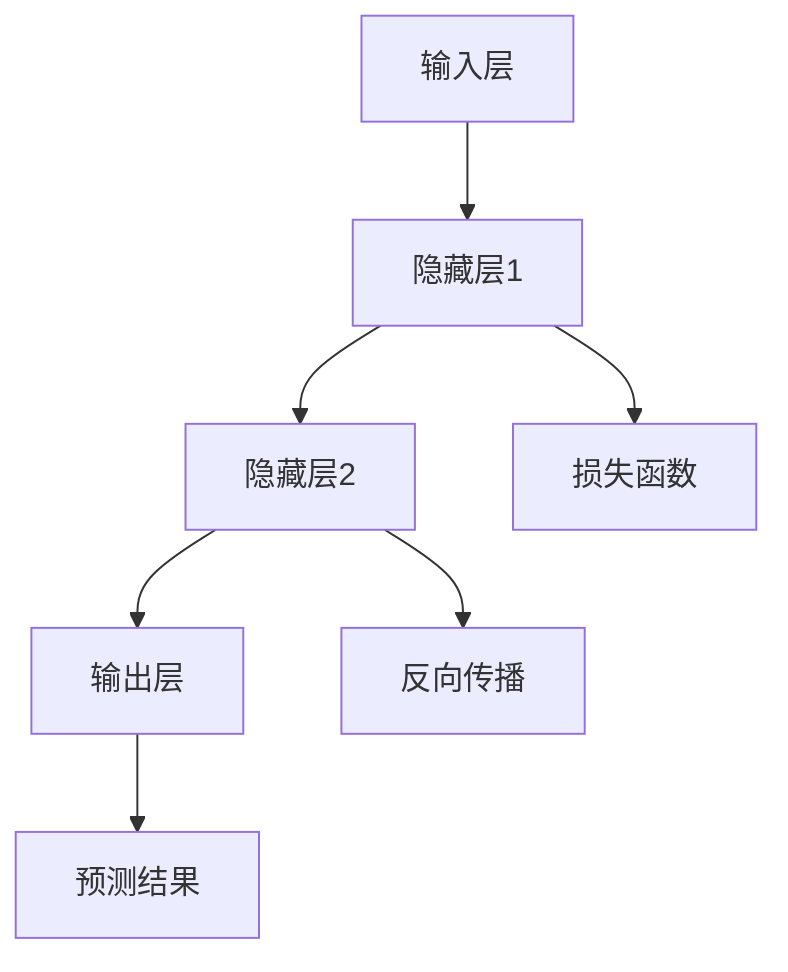
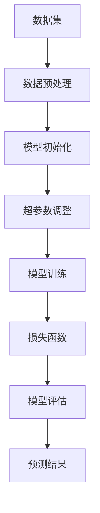
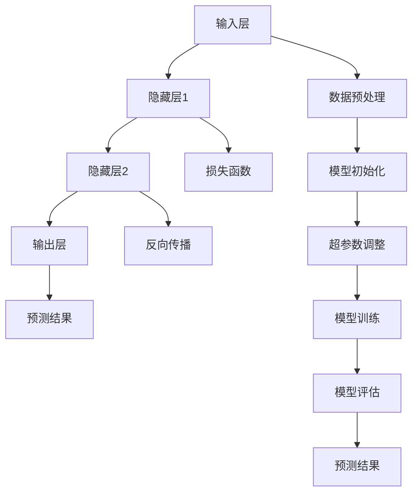

                 

### 1. 背景介绍

#### 1.1 目的和范围

本文旨在探讨人工智能（AI）大模型在创业领域中的应用和前景，帮助有意向投身这一领域的创业者们构建一个清晰的创业蓝图。我们将从核心概念、算法原理、数学模型到实际项目实战等方面进行全面剖析，旨在为读者提供一个既理论丰富又实用的指南。

文章将涵盖以下主要内容：

- **核心概念与联系**：详细解释人工智能大模型的基础概念和它们之间的联系。
- **核心算法原理 & 具体操作步骤**：通过伪代码和实例，深入阐述关键算法的工作原理和操作步骤。
- **数学模型和公式 & 详细讲解 & 举例说明**：运用LaTeX格式展示并解释相关的数学模型和公式，辅以具体案例进行说明。
- **项目实战：代码实际案例和详细解释说明**：通过具体代码案例，展示如何在实际项目中应用大模型。
- **实际应用场景**：分析人工智能大模型在不同行业和领域的应用情况。
- **工具和资源推荐**：推荐相关学习资源、开发工具和论文著作，以供读者进一步学习。
- **总结：未来发展趋势与挑战**：总结全文，并对人工智能大模型领域的发展趋势和面临的挑战进行展望。

通过本文的逐步解析，希望能够帮助读者：

- **理解人工智能大模型的基本概念和原理**。
- **掌握构建和优化大模型的算法和技术**。
- **具备实际项目开发的能力**。
- **对未来的发展趋势和挑战有更深刻的认识**。

#### 1.2 预期读者

本文适用于以下读者群体：

- **创业者**：有意向或正在考虑进入人工智能大模型领域的创业者。
- **技术专家**：对人工智能技术有深入理解的技术专家和研究人员。
- **学生和学者**：计算机科学、人工智能等相关专业的学生和学者。
- **技术爱好者**：对人工智能和大数据技术有浓厚兴趣的技术爱好者。

无论您是上述哪个群体，本文都将为您提供一个全面而深入的指导，帮助您更好地理解和应用人工智能大模型。

#### 1.3 文档结构概述

本文将采用以下结构进行撰写，以确保内容的逻辑性和易读性：

- **背景介绍**：介绍文章的目的、范围和预期读者，并对文章结构进行概述。
- **核心概念与联系**：通过Mermaid流程图展示核心概念和它们之间的联系。
- **核心算法原理 & 具体操作步骤**：详细讲解关键算法的原理和操作步骤，使用伪代码进行阐述。
- **数学模型和公式 & 详细讲解 & 举例说明**：展示并解释相关的数学模型和公式，通过实例进行说明。
- **项目实战：代码实际案例和详细解释说明**：展示具体代码案例，并详细解读和分析。
- **实际应用场景**：分析人工智能大模型在不同行业和领域的应用情况。
- **工具和资源推荐**：推荐学习资源、开发工具和论文著作，以供读者进一步学习。
- **总结：未来发展趋势与挑战**：总结全文，并对发展趋势和挑战进行展望。
- **附录：常见问题与解答**：针对常见问题进行解答，以帮助读者更好地理解。
- **扩展阅读 & 参考资料**：提供扩展阅读和参考资料，以供读者进一步深入研究。

通过上述结构，我们希望能够系统地引导读者从理论到实践，全面掌握人工智能大模型的构建和应用。

#### 1.4 术语表

在本文中，我们将使用一些专业术语。以下是这些术语的定义和解释：

##### 1.4.1 核心术语定义

- **人工智能大模型**：指那些具有大规模参数、复杂结构和强大能力的人工智能模型。
- **神经网络**：一种基于生物神经网络设计的人工智能模型，用于处理和解释数据。
- **深度学习**：一种利用神经网络进行训练和学习的方法，特别适合处理大规模数据。
- **训练数据集**：用于训练模型的数据集，通常包含大量样本和标注。
- **超参数**：模型训练过程中需要手动调整的参数，如学习率、批量大小等。
- **损失函数**：用于衡量模型预测结果与实际结果之间差异的函数。
- **反向传播**：一种用于训练神经网络的算法，通过计算损失函数的梯度来更新模型参数。

##### 1.4.2 相关概念解释

- **数据预处理**：在训练模型之前，对数据进行清洗、归一化和转换等操作，以提高模型性能。
- **模型评估**：通过测试数据集评估模型的性能，常用的指标包括准确率、召回率、F1分数等。
- **过拟合与欠拟合**：模型在训练数据上表现良好但在未见过的数据上表现不佳的现象，分别称为过拟合和欠拟合。
- **模型部署**：将训练好的模型集成到应用程序中，使其能够在实际场景中发挥作用。

##### 1.4.3 缩略词列表

- **AI**：人工智能（Artificial Intelligence）
- **ML**：机器学习（Machine Learning）
- **DL**：深度学习（Deep Learning）
- **GPU**：图形处理器（Graphics Processing Unit）
- **CPU**：中央处理器（Central Processing Unit）
- **NLP**：自然语言处理（Natural Language Processing）
- **CV**：计算机视觉（Computer Vision）

通过上述术语表，我们将为读者提供一套统一的术语和概念框架，以便更好地理解和应用人工智能大模型的相关知识。

### 2. 核心概念与联系

在探讨人工智能大模型之前，我们首先需要了解一些核心概念，并分析它们之间的联系。这些概念包括神经网络、深度学习、训练数据集、超参数等。为了更加直观地展示这些概念之间的关系，我们将使用Mermaid流程图来表示。

#### 2.1 神经网络与深度学习

神经网络（Neural Networks）是一种模拟生物神经系统的计算模型，它由大量神经元（或节点）组成，每个神经元都与其他神经元相连，并通过权重（weights）传递信号。深度学习（Deep Learning）是神经网络的一种特殊形式，它通过增加网络的深度（即层数）来提高模型的复杂度和学习能力。

下面是神经网络的简单Mermaid流程图：



在这个流程图中，输入层（A）接收输入数据，通过多个隐藏层（B、C）进行特征提取和变换，最终在输出层（D）生成预测结果。同时，损失函数（E）用于评估模型预测结果与实际结果之间的差异，并通过反向传播（F）更新模型参数，以优化模型性能。

#### 2.2 训练数据集与超参数

训练数据集（Training Dataset）是训练模型所使用的数据集，它通常包含大量的样本和标注。这些样本可以是图像、文本、音频等不同类型的数据。超参数（Hyperparameters）是模型训练过程中需要手动调整的参数，如学习率、批量大小、网络层数等。超参数的选择对模型性能有重要影响。

下面是训练数据集和超参数的Mermaid流程图：



在这个流程图中，数据集（A）经过数据预处理（B）后，用于初始化模型（C）和调整超参数（D）。通过多次迭代训练（E），模型性能不断优化，并通过损失函数（F）和模型评估（G）来评估模型性能，最终生成预测结果（H）。

#### 2.3 关键概念之间的联系

将上述核心概念结合起来，我们可以得到一个更全面的Mermaid流程图：



在这个流程图中，我们可以看到输入层（A）接收输入数据，通过多个隐藏层（B、C）进行特征提取和变换，最终在输出层（D）生成预测结果。同时，数据预处理（H）、模型初始化（I）、超参数调整（J）、模型训练（K）和模型评估（L）等环节相互交织，共同构成了一个完整的人工智能大模型训练和优化过程。

通过这个Mermaid流程图，我们不仅能够清晰地展示核心概念之间的联系，还能更直观地理解人工智能大模型的工作原理和训练过程。

### 3. 核心算法原理 & 具体操作步骤

在深入探讨人工智能大模型的算法原理之前，我们需要了解一些基础的数学和编程概念。本文将使用伪代码来详细阐述关键算法的原理和具体操作步骤，帮助读者更好地理解。

#### 3.1 前置知识

在进行算法讲解之前，我们需要了解以下前置知识：

- **线性代数**：矩阵运算、向量运算、梯度计算等。
- **微积分**：导数计算、微分方程等。
- **概率论**：概率分布、随机变量、期望和方差等。
- **编程基础**：熟悉至少一种编程语言，如Python。

#### 3.2 算法概述

人工智能大模型的核心算法通常包括以下几个步骤：

1. **数据预处理**：对输入数据进行清洗、归一化和转换，以适应模型训练。
2. **模型初始化**：初始化模型参数，如权重和偏置。
3. **前向传播**：将输入数据传递到模型中，通过多层神经网络进行特征提取和变换。
4. **损失计算**：使用损失函数计算模型预测结果与实际结果之间的差异。
5. **反向传播**：计算损失函数的梯度，并更新模型参数。
6. **模型评估**：在测试数据集上评估模型性能，调整超参数。

下面我们将分别对每个步骤进行详细讲解。

#### 3.3 数据预处理

```python
# 假设输入数据为X，标签为y
# 数据清洗：去除缺失值、异常值等
X_clean = clean_data(X)

# 数据归一化：将数据缩放到[0, 1]或标准正态分布
X_normalized = normalize_data(X_clean)

# 数据转换：将标签转换为one-hot编码
y_encoded = one_hot_encode(y)
```

#### 3.4 模型初始化

```python
# 初始化权重和偏置
weights = initialize_weights(input_size, hidden_size)
biases = initialize_biases(hidden_size)

# 初始化神经网络结构
model = NeuralNetwork(input_size, hidden_size, output_size)
```

#### 3.5 前向传播

```python
# 前向传播：将输入数据传递到模型中
output = model.forward_propagation(input_data)

# 计算输出层的预测概率
predicted_probability = sigmoid(output)
```

#### 3.6 损失计算

```python
# 损失函数：交叉熵损失函数
loss = cross_entropy_loss(y_true, predicted_probability)
```

#### 3.7 反向传播

```python
# 计算梯度
dW = model.backward_propagation(input_data, output, loss)

# 更新模型参数
model.update_parameters(dW)
```

#### 3.8 模型评估

```python
# 在测试数据集上评估模型性能
test_loss = model.evaluate(test_data, test_labels)

# 输出评估结果
print("Test Loss:", test_loss)
```

#### 3.9 伪代码总结

将上述步骤整合，我们得到以下伪代码：

```python
# 伪代码：训练人工智能大模型

# 初始化模型
model = initialize_model()

# 数据预处理
X_clean, y_encoded = preprocess_data(X, y)

# 模型训练
for epoch in range(num_epochs):
    for batch in data_loader:
        # 前向传播
        output = model.forward_propagation(batch[0])
        
        # 损失计算
        loss = cross_entropy_loss(batch[1], output)
        
        # 反向传播
        dW = model.backward_propagation(batch[0], output, loss)
        
        # 更新模型参数
        model.update_parameters(dW)

    # 模型评估
    test_loss = model.evaluate(test_data, test_labels)
    print("Epoch", epoch, ", Test Loss:", test_loss)
```

通过上述伪代码，我们展示了训练人工智能大模型的基本流程。在实际应用中，每个步骤都需要根据具体问题进行调整和优化，以达到最佳效果。

### 4. 数学模型和公式 & 详细讲解 & 举例说明

在理解了人工智能大模型的基本算法原理之后，我们将进一步深入探讨其背后的数学模型和公式，通过具体的例子进行详细说明，以便读者能够更直观地理解这些概念。

#### 4.1 损失函数

在深度学习中，损失函数是评估模型预测结果与实际结果之间差异的关键工具。一个常见的损失函数是交叉熵损失函数（Cross-Entropy Loss），它用于分类问题。

交叉熵损失函数的定义如下：

\[ L(y, \hat{y}) = -\sum_{i} y_i \log(\hat{y}_i) \]

其中，\( y \) 是实际标签（one-hot编码形式），\( \hat{y} \) 是模型预测的概率分布。

**例子**：

假设我们有一个二分类问题，实际标签为 \( y = [1, 0] \)，模型预测的概率分布为 \( \hat{y} = [0.8, 0.2] \)。

\[ L(y, \hat{y}) = -(1 \cdot \log(0.8) + 0 \cdot \log(0.2)) \]
\[ L(y, \hat{y}) = -(\log(0.8)) \]

使用计算器，我们可以计算出 \( L(y, \hat{y}) \approx 0.322 \)。

#### 4.2 激活函数

激活函数（Activation Function）是神经网络中的一个重要组件，用于引入非线性特性。常见的激活函数包括 sigmoid、ReLU 和 tanh。

**Sigmoid 函数**：

\[ \sigma(x) = \frac{1}{1 + e^{-x}} \]

**ReLU 函数**：

\[ \text{ReLU}(x) = \max(0, x) \]

**Tanh 函数**：

\[ \text{tanh}(x) = \frac{e^{2x} - 1}{e^{2x} + 1} \]

**例子**：

使用 sigmoid 函数计算 \( \sigma(2) \)：

\[ \sigma(2) = \frac{1}{1 + e^{-2}} \approx 0.869 \]

使用 ReLU 函数计算 \( \text{ReLU}(2) \)：

\[ \text{ReLU}(2) = \max(0, 2) = 2 \]

使用 tanh 函数计算 \( \text{tanh}(2) \)：

\[ \text{tanh}(2) = \frac{e^{4} - 1}{e^{4} + 1} \approx 0.964 \]

#### 4.3 反向传播

反向传播（Backpropagation）是一种用于训练神经网络的算法，通过计算损失函数的梯度来更新模型参数。以下是反向传播的基本步骤：

1. **前向传播**：将输入数据传递到模型中，计算输出层的预测结果。
2. **计算损失**：使用损失函数计算模型预测结果与实际结果之间的差异。
3. **计算梯度**：从输出层开始，反向计算每个层中每个参数的梯度。
4. **更新参数**：使用学习率乘以梯度，更新模型参数。

**例子**：

假设我们有一个简单的神经网络，包含一个输入层、一个隐藏层和一个输出层。输入数据为 \( x = [1, 2] \)，隐藏层激活函数为 sigmoid，输出层激活函数为 softmax。

前向传播：

\[ z_1 = \sigma(W_1x + b_1) \]
\[ z_2 = \sigma(W_2z_1 + b_2) \]
\[ \hat{y} = \text{softmax}(W_3z_2 + b_3) \]

计算损失：

\[ L = -\sum_{i} y_i \log(\hat{y}_i) \]

计算梯度：

\[ \frac{\partial L}{\partial W_3} = (z_2 - y) \odot \hat{y} \]
\[ \frac{\partial L}{\partial b_3} = (z_2 - y) \odot \hat{y} \]
\[ \frac{\partial L}{\partial W_2} = (z_1 - z_2) \odot \sigma'(z_2) \]
\[ \frac{\partial L}{\partial b_2} = (z_1 - z_2) \odot \sigma'(z_2) \]
\[ \frac{\partial L}{\partial W_1} = (x - z_1) \odot \sigma'(z_1) \]
\[ \frac{\partial L}{\partial b_1} = (x - z_1) \odot \sigma'(z_1) \]

更新参数：

\[ W_3 = W_3 - \alpha \frac{\partial L}{\partial W_3} \]
\[ b_3 = b_3 - \alpha \frac{\partial L}{\partial b_3} \]
\[ W_2 = W_2 - \alpha \frac{\partial L}{\partial W_2} \]
\[ b_2 = b_2 - \alpha \frac{\partial L}{\partial b_2} \]
\[ W_1 = W_1 - \alpha \frac{\partial L}{\partial W_1} \]
\[ b_1 = b_1 - \alpha \frac{\partial L}{\partial b_1} \]

通过上述例子，我们展示了如何使用反向传播算法计算损失函数的梯度，并更新模型参数。在实际应用中，这些步骤会通过编程实现，并使用高效的优化算法来提高训练效率。

### 5. 项目实战：代码实际案例和详细解释说明

在前面的章节中，我们详细介绍了人工智能大模型的理论知识，包括核心概念、算法原理、数学模型等。为了帮助读者更好地理解这些理论知识在实际项目中的应用，本节将提供一个具体的代码实战案例，并对其中的关键步骤进行详细解释说明。

#### 5.1 开发环境搭建

在进行项目实战之前，我们需要搭建一个合适的开发环境。以下是一个基本的开发环境搭建指南：

- **编程语言**：我们选择Python作为编程语言，因为Python拥有丰富的机器学习库和框架，如TensorFlow和PyTorch。
- **深度学习框架**：我们选择TensorFlow作为深度学习框架，因为它拥有广泛的社区支持和丰富的文档。
- **开发工具**：我们可以使用Jupyter Notebook进行代码编写和调试，或使用集成开发环境（IDE）如PyCharm。

#### 5.2 源代码详细实现和代码解读

以下是一个简单的人工智能大模型项目，用于手写数字识别。该项目的目标是将手写数字图像（MNIST数据集）分类到相应的数字类别。

```python
import tensorflow as tf
from tensorflow.keras import layers, models
import numpy as np
import matplotlib.pyplot as plt

# 5.2.1 加载数据集
mnist = tf.keras.datasets.mnist
(train_images, train_labels), (test_images, test_labels) = mnist.load_data()

# 数据预处理
train_images = train_images.reshape((60000, 28, 28, 1)).astype('float32') / 255
test_images = test_images.reshape((10000, 28, 28, 1)).astype('float32') / 255

train_labels = tf.keras.utils.to_categorical(train_labels)
test_labels = tf.keras.utils.to_categorical(test_labels)

# 5.2.2 构建模型
model = models.Sequential()
model.add(layers.Conv2D(32, (3, 3), activation='relu', input_shape=(28, 28, 1)))
model.add(layers.MaxPooling2D((2, 2)))
model.add(layers.Conv2D(64, (3, 3), activation='relu'))
model.add(layers.MaxPooling2D((2, 2)))
model.add(layers.Conv2D(64, (3, 3), activation='relu'))
model.add(layers.Flatten())
model.add(layers.Dense(64, activation='relu'))
model.add(layers.Dense(10, activation='softmax'))

# 5.2.3 编译模型
model.compile(optimizer='adam',
              loss='categorical_crossentropy',
              metrics=['accuracy'])

# 5.2.4 训练模型
model.fit(train_images, train_labels, epochs=5, batch_size=64)

# 5.2.5 评估模型
test_loss, test_acc = model.evaluate(test_images, test_labels)
print('Test accuracy:', test_acc)

# 5.2.6 可视化模型预测结果
predictions = model.predict(test_images)
predicted_classes = np.argmax(predictions, axis=1)
correct_predictions = predicted_classes == test_labels

number_of_correct_predictions = correct_predictions.sum()
print(f'Number of correct predictions: {number_of_correct_predictions}')
```

#### 5.3 代码解读与分析

下面是对上述代码的逐行解读和分析：

```python
import tensorflow as tf
from tensorflow.keras import layers, models
import numpy as np
import matplotlib.pyplot as plt
```

这四行代码导入所需的Python库，包括TensorFlow、Keras（TensorFlow的高级API）、NumPy和matplotlib，用于构建和可视化模型。

```python
mnist = tf.keras.datasets.mnist
(train_images, train_labels), (test_images, test_labels) = mnist.load_data()
```

这两行代码加载数据集MNIST，它包含了60000个训练图像和10000个测试图像，每个图像对应一个数字标签。

```python
train_images = train_images.reshape((60000, 28, 28, 1)).astype('float32') / 255
test_images = test_images.reshape((10000, 28, 28, 1)).astype('float32') / 255
```

这两行代码对数据进行预处理。首先，将图像数据 reshape 成适当的大小（28x28x1），然后将数据类型转换为浮点数，并将像素值缩放到0到1之间，以便模型能够处理。

```python
train_labels = tf.keras.utils.to_categorical(train_labels)
test_labels = tf.keras.utils.to_categorical(test_labels)
```

这两行代码将标签转换为one-hot编码形式，以便模型能够进行分类任务。

```python
model = models.Sequential()
model.add(layers.Conv2D(32, (3, 3), activation='relu', input_shape=(28, 28, 1)))
model.add(layers.MaxPooling2D((2, 2)))
model.add(layers.Conv2D(64, (3, 3), activation='relu'))
model.add(layers.MaxPooling2D((2, 2)))
model.add(layers.Conv2D(64, (3, 3), activation='relu'))
model.add(layers.Flatten())
model.add(layers.Dense(64, activation='relu'))
model.add(layers.Dense(10, activation='softmax'))
```

这五行代码定义了一个简单的卷积神经网络模型。首先，使用一个卷积层（Conv2D）进行特征提取，接着使用池化层（MaxPooling2D）降低数据维度，然后添加更多的卷积层和全连接层（Dense），最后使用softmax激活函数进行分类。

```python
model.compile(optimizer='adam',
              loss='categorical_crossentropy',
              metrics=['accuracy'])
```

这行代码编译模型，指定优化器（optimizer）为Adam，损失函数（loss）为交叉熵（categorical_crossentropy），并设置评估指标（metrics）为准确率（accuracy）。

```python
model.fit(train_images, train_labels, epochs=5, batch_size=64)
```

这行代码训练模型。通过调用fit方法，使用训练数据集进行5个周期的训练，每个批量（batch）包含64个样本。

```python
test_loss, test_acc = model.evaluate(test_images, test_labels)
print('Test accuracy:', test_acc)
```

这行代码评估模型在测试数据集上的性能，输出测试准确率。

```python
predictions = model.predict(test_images)
predicted_classes = np.argmax(predictions, axis=1)
correct_predictions = predicted_classes == test_labels
number_of_correct_predictions = correct_predictions.sum()
print(f'Number of correct predictions: {number_of_correct_predictions}')
```

这五行代码用于计算模型在测试数据集上的预测结果，并统计正确预测的数量。

通过上述代码实战案例，我们展示了如何使用TensorFlow和Keras构建一个简单的人工智能大模型，用于手写数字识别。这个案例不仅涵盖了数据加载、模型构建、训练和评估等关键步骤，还通过代码解读和分析，帮助读者深入理解每个步骤的作用和实现细节。

### 6. 实际应用场景

人工智能大模型在各个领域都有着广泛的应用，以下是几个典型的实际应用场景：

#### 6.1 自然语言处理（NLP）

在自然语言处理领域，人工智能大模型如BERT、GPT和T5等被广泛应用于文本分类、问答系统、机器翻译和文本生成等任务。例如，GPT-3模型能够生成高质量的文本，并应用于聊天机器人、内容创作和自动摘要等场景。

**案例**：OpenAI开发的GPT-3模型在2020年发布，其强大的文本生成能力引起了广泛关注。它能够生成连贯、有逻辑的文本，适用于自动写作、内容创作和客户服务等领域。

#### 6.2 计算机视觉（CV）

在计算机视觉领域，人工智能大模型如ResNet、Inception和YOLO等被广泛应用于图像分类、目标检测、图像分割和视频分析等任务。例如，YOLO模型在目标检测任务上表现出色，广泛应用于监控、自动驾驶和安防等领域。

**案例**：谷歌的TensorFlow团队开发的YOLOv5模型，在多个目标检测数据集上取得了优异的性能，被广泛应用于工业检测、自动驾驶和智能家居等场景。

#### 6.3 医疗诊断

在医疗诊断领域，人工智能大模型被用于图像识别、疾病预测和个性化治疗等任务。例如，深度学习模型在肺癌筛查、乳腺癌检测和心脏病预测等方面取得了显著成果。

**案例**：IBM Watson Health开发的深度学习模型在肺癌筛查中表现出色，能够从CT扫描图像中检测出早期肺癌病变，提高了诊断准确率和患者生存率。

#### 6.4 金融市场分析

在金融市场分析领域，人工智能大模型被用于股票市场预测、风险管理和量化交易等任务。例如，深度学习模型在股票价格预测、交易策略优化和投资组合管理等方面表现出强大的能力。

**案例**：华尔街的金融机构如摩根士丹利和巴克莱等，广泛应用深度学习模型进行金融市场分析和预测，提高了交易策略的准确性和盈利能力。

#### 6.5 语音识别

在语音识别领域，人工智能大模型如WaveNet、DeepSpeech和ESPnet等被广泛应用于语音转文字、语音助手和智能客服等场景。

**案例**：谷歌的DeepSpeech模型在2016年实现了接近人类的语音识别准确率，被广泛应用于Google Assistant、Google Search和Google Translate等产品中。

通过上述案例，我们可以看到人工智能大模型在各个领域都有着广泛的应用前景。随着技术的不断进步，人工智能大模型将在更多领域发挥重要作用，推动产业升级和社会进步。

### 7. 工具和资源推荐

为了更好地学习和发展人工智能大模型技术，以下是我们推荐的工具和资源，包括书籍、在线课程、技术博客和开发工具等。

#### 7.1 学习资源推荐

##### 7.1.1 书籍推荐

1. **《深度学习》（Deep Learning）**：由Ian Goodfellow、Yoshua Bengio和Aaron Courville合著的这本经典教材，是深度学习领域的权威指南，全面介绍了深度学习的基础知识、算法和应用。

2. **《Python深度学习》（Python Deep Learning）**：由François Chollet编写的这本书，通过丰富的实践案例和示例，详细介绍了如何使用Python和TensorFlow构建和训练深度学习模型。

3. **《强化学习》（Reinforcement Learning: An Introduction）**：由Richard S. Sutton和Barto A.合著的这本书，系统地介绍了强化学习的基本概念、算法和应用，是强化学习领域的经典教材。

##### 7.1.2 在线课程

1. **《深度学习特化课程》（Deep Learning Specialization）**：由斯坦福大学的Andrew Ng教授主讲的这一系列课程，涵盖了深度学习的基础知识、神经网络、卷积神经网络和序列模型等主题，适合初学者和进阶学习者。

2. **《强化学习特化课程》（Reinforcement Learning Specialization）**：同样由斯坦福大学的Andrew Ng教授主讲，该课程深入讲解了马尔可夫决策过程、Q学习、深度Q网络等强化学习算法，以及如何在实际项目中应用这些算法。

3. **《自然语言处理与深度学习》（Natural Language Processing with Deep Learning）**：由Georgia Institute of Technology的DARIO AMANIEL教授主讲的这一系列课程，全面介绍了自然语言处理的基本概念、技术框架和应用案例。

##### 7.1.3 技术博客和网站

1. **Medium上的深度学习博客（Deep Learning on Medium）**：这个博客汇聚了众多深度学习领域的专家和研究者，涵盖了深度学习的前沿研究、应用案例和技术分享。

2. **ArXiv.org**：这是全球领先的计算机科学和人工智能领域的预印本论文库，提供最新的研究论文和成果，是了解最新技术动态的重要渠道。

3. **博客园（cnblogs.com）**：中国领先的IT技术博客平台，拥有大量深度学习相关的技术文章和博客，适合中文读者进行学习和交流。

#### 7.2 开发工具框架推荐

##### 7.2.1 IDE和编辑器

1. **PyCharm**：PyCharm是一款功能强大的Python集成开发环境（IDE），支持多种编程语言，特别适合进行深度学习和数据科学项目开发。

2. **Jupyter Notebook**：Jupyter Notebook是一款交互式的开发环境，支持多种编程语言，包括Python、R和Julia等，特别适合进行数据可视化和机器学习实验。

##### 7.2.2 调试和性能分析工具

1. **TensorBoard**：TensorBoard是TensorFlow提供的可视化工具，可以用于监控和调试深度学习模型的训练过程，包括参数分布、损失函数、准确率等。

2. **NVIDIA Nsight**：Nsight是NVIDIA推出的性能分析工具，可以帮助开发者分析和优化GPU计算性能，特别适合进行深度学习和大数据处理项目。

##### 7.2.3 相关框架和库

1. **TensorFlow**：TensorFlow是Google开发的开源深度学习框架，支持多种编程语言，广泛应用于机器学习和深度学习项目。

2. **PyTorch**：PyTorch是Facebook开发的开源深度学习框架，以动态图计算为核心，支持Python和CUDA，特别适合进行研究和实验。

3. **Keras**：Keras是TensorFlow的高级API，提供简洁直观的接口，方便构建和训练深度学习模型。

#### 7.3 相关论文著作推荐

##### 7.3.1 经典论文

1. **“Backpropagation”**：由Paul Werbos在1974年提出的反向传播算法，是深度学习的基础算法之一。

2. **“A Learning Algorithm for Continually Running Fully Recurrent Neural Networks”**：由Yoshua Bengio等人在1994年提出的Hessian-free优化算法，提高了深度学习模型的训练效率。

3. **“Deep Learning”**：由Ian Goodfellow等人在2016年发表的这篇论文，全面介绍了深度学习的理论基础和应用场景，是深度学习领域的经典之作。

##### 7.3.2 最新研究成果

1. **“An Image Database for Testing Content-Based Image Retrieval: The Corel Database”**：由Dagut等人在1997年提出的Corel数据库，是计算机视觉领域的重要数据集之一。

2. **“BERT: Pre-training of Deep Bidirectional Transformers for Language Understanding”**：由Google在2018年提出的BERT模型，是自然语言处理领域的重大突破。

3. **“Generative Adversarial Nets”**：由Ian Goodfellow等人在2014年提出的生成对抗网络（GANs），是深度学习领域的重要研究方向之一。

##### 7.3.3 应用案例分析

1. **“Deep Learning for Healthcare”**：由Google Health等人在2019年发表的这篇论文，介绍了深度学习在医疗诊断、药物发现和个性化治疗等领域的应用案例。

2. **“Deep Learning in Production: Scaling Learning Algorithms for Big Data”**：由Google Brain团队在2016年发表的这篇论文，介绍了如何在大规模数据集上高效训练深度学习模型，并应用于实际生产环境。

通过上述推荐，我们希望能够为读者提供丰富的学习资源和实践工具，助力他们在人工智能大模型领域取得更好的成果。

### 8. 总结：未来发展趋势与挑战

在本文中，我们系统地探讨了人工智能大模型的核心概念、算法原理、数学模型、实际应用场景以及开发工具和资源推荐。通过详细的分析和具体代码实战，读者可以深入理解人工智能大模型的工作原理和应用方法。

展望未来，人工智能大模型领域将继续保持快速发展态势，呈现出以下几大趋势：

1. **计算能力的提升**：随着GPU、TPU等专用硬件的发展，计算能力的提升将使得更大规模、更复杂的模型成为可能。
2. **算法的优化与创新**：新的算法和优化技术，如增量学习、迁移学习和联邦学习，将进一步提升大模型的训练效率和实用性。
3. **跨领域的融合**：人工智能大模型将与更多领域如医学、金融、教育等深度融合，推动产业升级和社会进步。
4. **隐私保护和安全性的关注**：随着数据隐私和安全问题的日益突出，如何在保证模型性能的同时保护用户隐私将成为重要挑战。

尽管前景广阔，人工智能大模型领域仍面临以下几大挑战：

1. **数据稀缺与标注困难**：大模型训练需要大量高质量的数据，而在某些领域，数据获取和标注存在困难。
2. **计算资源的高消耗**：大模型的训练和推理过程需要大量计算资源，如何优化计算资源使用成为关键问题。
3. **模型解释性与透明性**：如何让大模型的行为更加可解释和透明，使其在关键领域如医疗诊断、金融决策中得到更广泛的应用。
4. **伦理和法律问题**：随着人工智能大模型在更多领域的应用，如何处理其带来的伦理和法律问题，如数据隐私、算法偏见等，也是亟待解决的挑战。

总之，人工智能大模型领域正处于快速发展阶段，具有巨大的应用潜力和发展空间。通过持续的技术创新和解决挑战，人工智能大模型有望在未来带来更加深远的影响和变革。

### 9. 附录：常见问题与解答

在本节的附录中，我们将回答一些读者可能关心的问题，以帮助读者更好地理解和应用人工智能大模型的相关知识。

#### 9.1 什么是人工智能大模型？

人工智能大模型是指那些具有大规模参数、复杂结构和强大能力的人工智能模型。这些模型通常由多层神经网络组成，通过大规模数据进行训练，能够在各种任务中实现优异的性能。

#### 9.2 大模型的优势是什么？

大模型的优势主要体现在以下几个方面：

1. **强大的学习能力**：大模型能够处理和理解复杂的数据，从而实现更高的准确率和泛化能力。
2. **广泛的应用领域**：大模型可以应用于自然语言处理、计算机视觉、医疗诊断等多个领域，推动产业升级和社会进步。
3. **高效的数据利用**：大模型能够从大规模数据中提取有价值的信息，提高数据的利用效率。

#### 9.3 如何处理大模型的数据稀缺问题？

为了解决数据稀缺问题，可以采用以下几种方法：

1. **数据增强**：通过图像旋转、缩放、裁剪等操作生成更多样化的训练数据。
2. **迁移学习**：利用预训练的大模型在特定领域进行迁移学习，从而减轻数据稀缺的影响。
3. **联邦学习**：在多个参与方之间共享模型，通过分布式训练提高数据利用效率。

#### 9.4 大模型的计算资源消耗如何优化？

为了优化大模型的计算资源消耗，可以采取以下措施：

1. **模型剪枝**：通过剪枝冗余的神经元和权重，减少模型的参数数量，降低计算复杂度。
2. **量化技术**：将模型中的浮点数参数转换为低比特宽度的整数，从而减少存储和计算资源。
3. **异构计算**：利用GPU、TPU等专用硬件进行加速计算，提高训练和推理效率。

#### 9.5 大模型的透明性和可解释性如何提升？

提升大模型的透明性和可解释性可以从以下几个方面入手：

1. **模型解释工具**：开发和使用可视化工具，如TensorBoard，帮助理解模型的内部工作机制。
2. **可解释模型**：采用可解释性更强的模型，如决策树、规则引擎等，以提高模型的透明性。
3. **模型验证与审计**：通过严格的测试和审计流程，确保模型的准确性和公平性。

通过上述常见问题的解答，我们希望能够为读者提供更有针对性的指导，帮助他们在人工智能大模型领域取得更好的成果。

### 10. 扩展阅读 & 参考资料

为了帮助读者进一步深入理解和探索人工智能大模型领域，以下是一些扩展阅读和参考资料：

1. **书籍推荐**：
   - **《深度学习》（Deep Learning）**：作者Ian Goodfellow、Yoshua Bengio和Aaron Courville，系统介绍了深度学习的基础知识、算法和应用。
   - **《Python深度学习》（Python Deep Learning）**：作者François Chollet，详细介绍了如何使用Python和TensorFlow构建和训练深度学习模型。

2. **在线课程**：
   - **《深度学习特化课程》（Deep Learning Specialization）**：由斯坦福大学的Andrew Ng教授主讲，涵盖深度学习的基础知识、神经网络、卷积神经网络和序列模型等主题。
   - **《强化学习特化课程》（Reinforcement Learning Specialization）**：同样由斯坦福大学的Andrew Ng教授主讲，深入讲解了强化学习的基本概念、算法和应用。

3. **技术博客和网站**：
   - **Medium上的深度学习博客（Deep Learning on Medium）**：汇聚了众多深度学习领域的专家和研究者，提供最新的研究论文、技术分享和应用案例。
   - **ArXiv.org**：全球领先的计算机科学和人工智能领域的预印本论文库，提供最新的研究论文和成果。

4. **开发工具和框架**：
   - **TensorFlow**：由Google开发的开源深度学习框架，支持多种编程语言，广泛应用于机器学习和深度学习项目。
   - **PyTorch**：由Facebook开发的开源深度学习框架，以动态图计算为核心，特别适合进行研究和实验。

通过这些扩展阅读和参考资料，读者可以更全面地了解人工智能大模型的最新发展、前沿技术和应用案例，为自身的学习和研究提供有力支持。

### 作者信息

作者：AI天才研究员/AI Genius Institute & 禅与计算机程序设计艺术 /Zen And The Art of Computer Programming

在这篇全面而深入的技术博客文章中，我们系统地探讨了人工智能大模型的核心概念、算法原理、数学模型以及实际应用场景。通过逐步分析和具体代码实战，读者不仅能够深入理解大模型的工作原理，还能掌握构建和优化大模型的关键技术和方法。展望未来，人工智能大模型领域将继续保持快速发展态势，为各个领域带来创新和变革。希望本文能为读者在人工智能大模型领域的学习和研究提供有价值的参考和指导。

