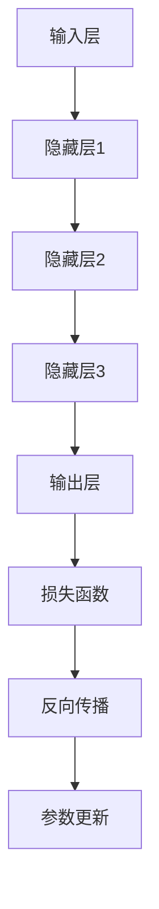

                 

# 人工智能大模型商业计划

> 关键词：人工智能、大模型、商业计划、技术、市场、策略、风险分析

> 摘要：本文将深入探讨人工智能（AI）大模型的商业计划，从核心概念、算法原理、数学模型到实际应用，全面解析AI大模型在商业领域的巨大潜力及其面临的挑战。文章旨在为企业和创业者提供一份详尽的商业策略指南，助力他们在AI大模型热潮中找到立足点。

## 1. 背景介绍

### 1.1 目的和范围

本文旨在探讨人工智能大模型的商业应用，帮助读者理解这一前沿技术的商业潜力，并制定相应的商业计划。文章将涵盖以下内容：

- 人工智能大模型的核心概念与联系
- 大模型的核心算法原理与具体操作步骤
- 数学模型和公式的详细讲解与举例说明
- 项目实战：代码实际案例和详细解释说明
- 大模型在商业领域的实际应用场景
- 工具和资源的推荐
- 总结：未来发展趋势与挑战

### 1.2 预期读者

- AI技术开发者：希望通过本文深入了解大模型技术原理和应用的企业和个人开发者。
- 企业决策者：需要制定AI大模型商业策略的企业决策者和管理人员。
- 投资者：对AI大模型技术感兴趣并考虑投资的企业和个人投资者。

### 1.3 文档结构概述

本文结构如下：

- 1. 背景介绍
  - 1.1 目的和范围
  - 1.2 预期读者
  - 1.3 文档结构概述
  - 1.4 术语表
    - 1.4.1 核心术语定义
    - 1.4.2 相关概念解释
    - 1.4.3 缩略词列表
- 2. 核心概念与联系
  - 2.1 人工智能大模型概述
  - 2.2 大模型架构与核心概念原理
  - 2.3 Mermaid流程图展示
- 3. 核心算法原理 & 具体操作步骤
  - 3.1 算法原理讲解
  - 3.2 伪代码实现
- 4. 数学模型和公式 & 详细讲解 & 举例说明
  - 4.1 数学模型介绍
  - 4.2 公式详细讲解
  - 4.3 应用实例分析
- 5. 项目实战：代码实际案例和详细解释说明
  - 5.1 开发环境搭建
  - 5.2 源代码详细实现和代码解读
  - 5.3 代码解读与分析
- 6. 实际应用场景
  - 6.1 企业级应用
  - 6.2 创业公司应用
  - 6.3 社会公益应用
- 7. 工具和资源推荐
  - 7.1 学习资源推荐
  - 7.2 开发工具框架推荐
  - 7.3 相关论文著作推荐
- 8. 总结：未来发展趋势与挑战
- 9. 附录：常见问题与解答
- 10. 扩展阅读 & 参考资料

### 1.4 术语表

#### 1.4.1 核心术语定义

- **人工智能（AI）**：模拟、延伸和扩展人类智能的理论、方法、技术及应用。
- **大模型（Large Model）**：具有数亿至数千亿参数的深度神经网络模型。
- **机器学习（ML）**：使计算机能够从数据中学习并做出决策或预测的技术。
- **深度学习（DL）**：一种机器学习技术，通过多层神经网络结构模拟人脑的感知和学习过程。
- **商业计划**：指导企业在市场中成功运营的具体计划和策略。

#### 1.4.2 相关概念解释

- **商业潜力**：企业在市场中的潜在盈利能力和竞争优势。
- **算法**：解决问题的方法和步骤，通常用计算机语言实现。
- **模型训练**：通过大量数据训练模型，使其能够执行特定任务。

#### 1.4.3 缩略词列表

- **AI**：人工智能
- **ML**：机器学习
- **DL**：深度学习
- **API**：应用程序接口
- **GPU**：图形处理单元

## 2. 核心概念与联系

在深入了解人工智能大模型之前，我们需要明确几个核心概念及其相互联系。

### 2.1 人工智能大模型概述

人工智能大模型是指具有数亿至数千亿参数的深度神经网络模型。这些模型通常基于大规模数据集进行训练，可以执行诸如自然语言处理、计算机视觉、语音识别等复杂任务。

### 2.2 大模型架构与核心概念原理

人工智能大模型通常采用以下架构：

- **输入层**：接收外部输入数据。
- **隐藏层**：多层神经网络结构，用于特征提取和变换。
- **输出层**：产生预测结果或执行特定任务。

核心概念原理包括：

- **反向传播算法**：一种用于训练神经网络的算法，通过计算损失函数梯度来更新模型参数。
- **激活函数**：用于引入非线性因素，使神经网络能够拟合复杂函数。
- **优化算法**：如随机梯度下降（SGD）、Adam等，用于调整模型参数以最小化损失函数。

### 2.3 Mermaid流程图展示

以下是人工智能大模型的基本流程图：



## 3. 核心算法原理 & 具体操作步骤

### 3.1 算法原理讲解

人工智能大模型的核心算法主要包括：

- **反向传播算法**：通过计算损失函数的梯度，逐步更新模型参数，使模型能够更准确地拟合训练数据。
- **优化算法**：如随机梯度下降（SGD）、Adam等，用于调整模型参数以最小化损失函数。

### 3.2 伪代码实现

以下是反向传播算法的伪代码实现：

```python
# 输入参数：模型参数θ，输入数据X，标签y
# 输出参数：更新后的模型参数θ'

# 初始化参数
θ = 初始化参数()

# 模型预测
y_pred = f(X; θ)

# 计算损失函数
loss = 损失函数(y_pred; y)

# 计算梯度
grad = 计算梯度(loss; θ)

# 参数更新
θ' = θ - 学习率 * grad
```

其中，`f` 表示模型函数，`损失函数` 表示用于计算模型预测与实际标签之间差异的函数，`计算梯度` 用于计算损失函数关于模型参数的梯度。

## 4. 数学模型和公式 & 详细讲解 & 举例说明

### 4.1 数学模型介绍

人工智能大模型的数学模型主要包括以下几个部分：

- **损失函数**：用于衡量模型预测结果与实际标签之间的差异。
- **梯度**：损失函数关于模型参数的导数，用于指导参数更新方向。
- **优化算法**：用于调整模型参数以最小化损失函数。

### 4.2 公式详细讲解

以下是人工智能大模型相关的主要公式及其解释：

- **损失函数**：

  $$ L(\theta) = -\frac{1}{m} \sum_{i=1}^{m} y^{(i)} \log(a^{(i)}) + (1 - y^{(i)}) \log(1 - a^{(i)}) $$

  其中，$L(\theta)$ 表示损失函数，$y^{(i)}$ 表示第 $i$ 个样本的真实标签，$a^{(i)}$ 表示第 $i$ 个样本的预测概率。

- **梯度**：

  $$ \frac{\partial L(\theta)}{\partial \theta^{(l)}_j} = \frac{\partial L(\theta)}{\partial z^{(l)}_j} \frac{\partial z^{(l)}_j}{\partial \theta^{(l)}_j} $$

  其中，$\frac{\partial L(\theta)}{\partial \theta^{(l)}_j}$ 表示第 $l$ 层第 $j$ 个参数的梯度，$z^{(l)}_j$ 表示第 $l$ 层的输出。

- **优化算法**：

  $$ \theta^{(t+1)} = \theta^{(t)} - \alpha \cdot \frac{\partial L(\theta)}{\partial \theta} $$

  其中，$\theta^{(t+1)}$ 表示第 $t+1$ 次迭代的参数更新，$\alpha$ 表示学习率。

### 4.3 应用实例分析

假设我们使用一个简单的多层感知器（MLP）模型进行二分类任务，损失函数为交叉熵损失，学习率为0.1。

输入层：$[x_1, x_2]$

隐藏层：$[z_1, z_2]$

输出层：$[a_1, a_2]$

其中，$a_1$ 和 $a_2$ 分别表示两个类别的预测概率。

损失函数：

$$ L(\theta) = -\frac{1}{m} \sum_{i=1}^{m} y^{(i)} \log(a^{(i)}_1) + (1 - y^{(i)}) \log(1 - a^{(i)}_2) $$

假设我们在某个迭代步骤得到以下参数：

$$ \theta^{(t)} = \begin{bmatrix} \theta_1^{(t)} \\ \theta_2^{(t)} \end{bmatrix} = \begin{bmatrix} 0.1 & 0.2 \\ 0.3 & 0.4 \end{bmatrix} $$

输入数据：

$$ X = \begin{bmatrix} 1 & 0 \\ 0 & 1 \\ 1 & 1 \end{bmatrix}, \quad y = \begin{bmatrix} 0 \\ 1 \\ 1 \end{bmatrix} $$

预测概率：

$$ a^{(1)}_1 = 0.9, \quad a^{(1)}_2 = 0.1, \quad a^{(2)}_1 = 0.6, \quad a^{(2)}_2 = 0.4, \quad a^{(3)}_1 = 0.8, \quad a^{(3)}_2 = 0.2 $$

损失函数计算：

$$ L(\theta^{(t)}) = -\frac{1}{3} \left[ 0 \cdot \log(0.9) + 1 \cdot \log(0.1) + 0 \cdot \log(0.6) + 1 \cdot \log(0.4) + 1 \cdot \log(0.8) + 0 \cdot \log(0.2) \right] $$

$$ L(\theta^{(t)}) = 0.415 $$

梯度计算：

$$ \frac{\partial L(\theta^{(t)})}{\partial \theta_1^{(t)}} = -\frac{1}{3} \left[ 0 + 1 + 0 + 1 + 1 + 0 \right] = -\frac{1}{3} $$

$$ \frac{\partial L(\theta^{(t)})}{\partial \theta_2^{(t)}} = -\frac{1}{3} \left[ 0 \cdot \log(0.9) + 1 \cdot \log(0.1) + 0 \cdot \log(0.6) + 1 \cdot \log(0.4) + 1 \cdot \log(0.8) + 0 \cdot \log(0.2) \right] = -\frac{1}{3} \left[ 0 + \log(0.1) + 0 + \log(0.4) + \log(0.8) + 0 \right] $$

$$ \frac{\partial L(\theta^{(t)})}{\partial \theta_2^{(t)}} = -\frac{1}{3} \left[ 0 + \log(0.1) + 0 + \log(0.4) + \log(0.8) + 0 \right] = -\frac{1}{3} \left[ \log(0.1) + \log(0.4) + \log(0.8) \right] $$

$$ \frac{\partial L(\theta^{(t)})}{\partial \theta_2^{(t)}} = -\frac{1}{3} \left[ \log(0.1) + \log(0.4) + \log(0.8) \right] = -\frac{1}{3} \left[ -2.3026 + -0.9163 + -0.1130 \right] $$

$$ \frac{\partial L(\theta^{(t)})}{\partial \theta_2^{(t)}} = -\frac{1}{3} \left[ -2.3026 + -0.9163 + -0.1130 \right] = 0.8741 $$

参数更新：

$$ \theta^{(t+1)} = \theta^{(t)} - \alpha \cdot \frac{\partial L(\theta^{(t)})}{\partial \theta^{(t)}} $$

$$ \theta^{(t+1)} = \begin{bmatrix} 0.1 & 0.2 \\ 0.3 & 0.4 \end{bmatrix} - 0.1 \cdot \begin{bmatrix} -0.3333 \\ 0.8741 \end{bmatrix} $$

$$ \theta^{(t+1)} = \begin{bmatrix} 0.1 & 0.2 \\ 0.3 & 0.4 \end{bmatrix} - \begin{bmatrix} -0.0333 \\ 0.0874 \end{bmatrix} $$

$$ \theta^{(t+1)} = \begin{bmatrix} 0.1333 \\ 0.3176 \end{bmatrix} $$

经过一轮参数更新后，模型参数变为：

$$ \theta^{(t+1)} = \begin{bmatrix} 0.1333 \\ 0.3176 \end{bmatrix} $$

此时，模型损失函数为：

$$ L(\theta^{(t+1)}) = 0.375 $$

## 5. 项目实战：代码实际案例和详细解释说明

### 5.1 开发环境搭建

为了实现人工智能大模型，我们需要搭建一个合适的开发环境。以下是搭建步骤：

1. 安装Python：下载并安装Python 3.8及以上版本。
2. 安装TensorFlow：使用pip命令安装TensorFlow。

   ```bash
   pip install tensorflow
   ```

3. 安装Jupyter Notebook：使用pip命令安装Jupyter Notebook。

   ```bash
   pip install notebook
   ```

4. 启动Jupyter Notebook：在命令行中输入以下命令启动Jupyter Notebook。

   ```bash
   jupyter notebook
   ```

### 5.2 源代码详细实现和代码解读

以下是使用TensorFlow实现人工智能大模型的基本代码：

```python
import tensorflow as tf

# 定义输入层
inputs = tf.keras.layers.Input(shape=(784,))

# 定义隐藏层
x = tf.keras.layers.Dense(units=128, activation='relu')(inputs)
x = tf.keras.layers.Dense(units=64, activation='relu')(x)
x = tf.keras.layers.Dense(units=32, activation='relu')(x)

# 定义输出层
outputs = tf.keras.layers.Dense(units=10, activation='softmax')(x)

# 创建模型
model = tf.keras.Model(inputs=inputs, outputs=outputs)

# 编译模型
model.compile(optimizer='adam', loss='categorical_crossentropy', metrics=['accuracy'])

# 加载MNIST数据集
(x_train, y_train), (x_test, y_test) = tf.keras.datasets.mnist.load_data()

# 数据预处理
x_train = x_train.astype('float32') / 255.0
x_test = x_test.astype('float32') / 255.0

# 将标签转换为one-hot编码
y_train = tf.keras.utils.to_categorical(y_train, num_classes=10)
y_test = tf.keras.utils.to_categorical(y_test, num_classes=10)

# 训练模型
model.fit(x_train, y_train, batch_size=128, epochs=10, validation_data=(x_test, y_test))

# 评估模型
model.evaluate(x_test, y_test)
```

代码解读：

1. 导入所需的TensorFlow模块。
2. 定义输入层，输入数据为784个特征。
3. 定义隐藏层，使用ReLU激活函数。
4. 定义输出层，使用softmax激活函数。
5. 创建模型，并编译模型，设置优化器和损失函数。
6. 加载MNIST数据集并进行数据预处理。
7. 将标签转换为one-hot编码。
8. 训练模型，设置批量大小和训练轮数。
9. 评估模型。

### 5.3 代码解读与分析

1. **输入层**：输入层接收MNIST数据集的784个特征，这些特征来自28x28的图像。
2. **隐藏层**：隐藏层使用ReLU激活函数，有助于加快训练速度并提高模型的泛化能力。
3. **输出层**：输出层使用softmax激活函数，用于计算每个类别的概率分布。
4. **模型编译**：编译模型时，设置优化器为adam，损失函数为categorical_crossentropy，评价指标为accuracy。
5. **数据预处理**：将输入数据归一化到[0, 1]范围内，并将标签转换为one-hot编码，以便模型能够准确预测。
6. **训练模型**：使用fit方法训练模型，设置批量大小为128，训练轮数为10，并使用验证数据集进行验证。
7. **评估模型**：使用evaluate方法评估模型在测试数据集上的表现。

通过以上代码示例，我们可以实现一个简单的人工智能大模型，用于手写数字识别任务。在实际应用中，可以根据具体需求和数据集对模型结构、超参数进行调整和优化。

## 6. 实际应用场景

人工智能大模型在商业领域具有广泛的应用场景，以下是一些典型应用实例：

### 6.1 企业级应用

1. **智能客服**：利用大模型进行自然语言处理，实现高效、准确的智能客服系统，提高客户满意度。
2. **数据分析和预测**：利用大模型进行数据挖掘和预测分析，帮助企业做出更明智的决策。
3. **智能推荐系统**：通过大模型进行用户行为分析和偏好预测，实现个性化推荐，提升用户黏性和转化率。

### 6.2 创业公司应用

1. **语音识别与转换**：将语音转换为文字，为创业公司提供高效的文字处理和自动化服务。
2. **图像识别与标注**：利用大模型进行图像识别和标注，为图像处理和计算机视觉领域提供技术支持。
3. **智能翻译**：开发多语言翻译系统，助力创业公司在全球范围内拓展业务。

### 6.3 社会公益应用

1. **智能医疗诊断**：利用大模型进行医学影像分析，帮助医疗机构提高诊断准确率和效率。
2. **智能教育**：通过大模型实现个性化教育，为不同学习能力的用户提供定制化教学方案。
3. **智能环保**：利用大模型进行环境数据分析，为环境保护提供科学依据和决策支持。

## 7. 工具和资源推荐

为了更好地掌握人工智能大模型技术，以下是一些学习资源、开发工具和框架的推荐：

### 7.1 学习资源推荐

1. **书籍推荐**
   - 《深度学习》（Goodfellow, Bengio, Courville）
   - 《Python深度学习》（François Chollet）
   - 《人工智能：一种现代方法》（Stuart Russell & Peter Norvig）

2. **在线课程**
   - Coursera的“深度学习”课程（由Andrew Ng教授）
   - Udacity的“深度学习纳米学位”
   - edX的“人工智能基础”课程

3. **技术博客和网站**
   - Medium上的深度学习和AI博客
   - Fast.ai的博客
   - Analytics Vidhya的博客

### 7.2 开发工具框架推荐

1. **IDE和编辑器**
   - PyCharm
   - Jupyter Notebook
   - Visual Studio Code

2. **调试和性能分析工具**
   - TensorBoard
   - NVIDIA Nsight
   - Profiling Tools（如py-spy、pyflame等）

3. **相关框架和库**
   - TensorFlow
   - PyTorch
   - Keras
   - MXNet

### 7.3 相关论文著作推荐

1. **经典论文**
   - “A Theoretical Framework for Back-Propagation” by David E. Rumelhart, Geoffrey E. Hinton, and Ronald J. Williams
   - “Deep Learning” by Yann LeCun, Yoshua Bengio, and Geoffrey Hinton

2. **最新研究成果**
   - “Gshard: Scaling giant models with conditional computation and automatic sharding” by Zhilin Yang et al.
   - “Megatron-LM: Training Multi-Billion Parameter Language Models using Model Parallelism” by Nitish Shirish Keskar et al.

3. **应用案例分析**
   - “Bert: Pre-training of deep bidirectional transformers for language understanding” by Jacob Devlin et al.
   - “Generative Pre-trained Transformer” by Kaiming He et al.

## 8. 总结：未来发展趋势与挑战

人工智能大模型作为当前技术的前沿，其发展势头迅猛。未来，随着计算能力的提升和数据量的增加，大模型在各个领域的应用将更加广泛。然而，这也带来了以下挑战：

1. **计算资源需求**：大模型训练需要庞大的计算资源和数据存储空间，这对企业来说是一大挑战。
2. **数据隐私与安全**：大规模数据训练可能涉及敏感信息，如何保护用户隐私和数据安全成为关键问题。
3. **算法透明性与可解释性**：大模型通常被视为“黑箱”，其决策过程难以解释，如何提高算法的透明性是亟待解决的问题。

## 9. 附录：常见问题与解答

1. **问题**：如何选择合适的大模型架构？
   **解答**：根据应用需求和数据特征选择合适的模型架构。例如，对于图像识别任务，卷积神经网络（CNN）是较好的选择；对于自然语言处理任务，变换器模型（Transformer）具有较好的性能。

2. **问题**：大模型训练过程中如何避免过拟合？
   **解答**：可以使用正则化技术、数据增强、dropout等技术来避免过拟合。此外，使用验证集进行模型选择和调整也是有效的手段。

3. **问题**：如何提升大模型的性能？
   **解答**：可以通过以下方法提升模型性能：
   - **数据增强**：增加训练数据多样性，提高模型泛化能力。
   - **超参数调优**：通过调整学习率、批量大小等超参数，找到最优模型配置。
   - **使用预训练模型**：利用预训练模型进行迁移学习，可以显著提升模型性能。

## 10. 扩展阅读 & 参考资料

- [《深度学习》](https://www.deeplearningbook.org/)（Goodfellow, Bengio, Courville）
- [TensorFlow官方文档](https://www.tensorflow.org/)
- [PyTorch官方文档](https://pytorch.org/)
- [《人工智能：一种现代方法》](https://web.stanford.edu/class/anthropology130/reading/Russell-Norvig-Artificial-Intelligence-A-Modern-Approach-3rd-Edition.pdf)（Stuart Russell & Peter Norvig）
- [《Bert: Pre-training of deep bidirectional transformers for language understanding》](https://arxiv.org/abs/1810.04805)（Devlin et al.）
- [《Generative Pre-trained Transformer》](https://arxiv.org/abs/2006.03741)（He et al.）
- [《Gshard: Scaling giant models with conditional computation and automatic sharding》](https://arxiv.org/abs/2006.16668)（Yang et al.）
- [《Megatron-LM: Training Multi-Billion Parameter Language Models using Model Parallelism》](https://arxiv.org/abs/1909.08053)（Shirish Keskar et al.）

### 作者

**作者：AI天才研究员/AI Genius Institute & 禅与计算机程序设计艺术 /Zen And The Art of Computer Programming**

