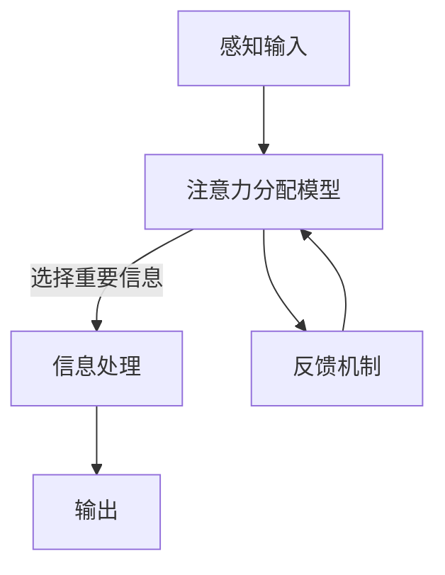
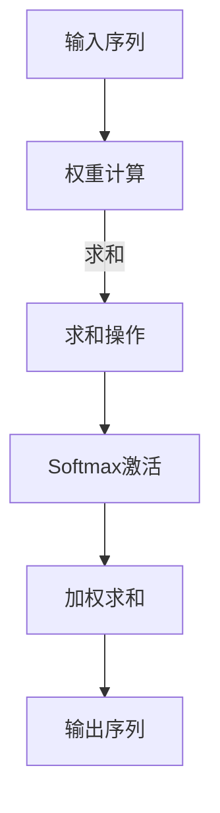
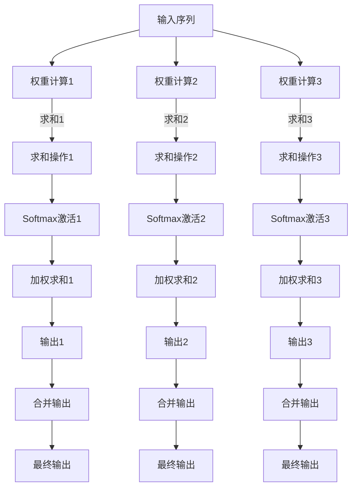

                 

# 人工智能如何重塑注意力分配模式

> **关键词：** 人工智能，注意力分配，认知负荷，信息过滤，神经网络，深度学习

> **摘要：** 本文旨在探讨人工智能如何通过其先进算法和模型，改变人类注意力分配的模式。随着人工智能技术的飞速发展，我们不仅能够更好地理解和模拟人类的注意力机制，还能设计出能够自适应调整注意力的智能系统。本文将首先介绍注意力分配的基本概念，然后分析人工智能在理解这一机制上的进展，并探讨如何利用这些进展来优化信息处理和认知负荷。最后，我们将探讨实际应用场景，并提供相关的工具和资源推荐。

## 1. 背景介绍

### 1.1 目的和范围

本文的主要目的是探讨人工智能如何改变注意力分配的模式，以及这一变化对人类生活和工作带来的影响。注意力是人类认知过程中的关键因素，它决定了我们在纷繁复杂的环境中如何选择性地处理信息。随着人工智能技术的发展，我们开始能够理解和模拟这一过程，从而设计出能够自适应调整注意力的系统。本文将涵盖以下主题：

1. 注意力分配的基本概念和机制。
2. 人工智能在注意力研究上的最新进展。
3. 人工智能如何优化注意力分配以减少认知负荷。
4. 实际应用场景和案例分析。
5. 相关工具和资源的推荐。

### 1.2 预期读者

本文主要面向对人工智能和认知科学感兴趣的读者，包括：

- 计算机科学和人工智能领域的研究生和学者。
- 对认知科学和神经科学感兴趣的跨学科研究者。
- 对人工智能技术在实际应用中如何改变人类注意力模式感兴趣的技术爱好者和从业者。
- 对人工智能如何影响未来社会和工作方式感兴趣的普通读者。

### 1.3 文档结构概述

本文的结构如下：

1. 引言：介绍文章的主题和目的。
2. 注意力分配的基本概念：阐述注意力分配的定义、机制和重要性。
3. 人工智能在注意力研究上的进展：介绍人工智能在理解注意力分配机制上的最新成果。
4. 人工智能优化注意力分配：探讨人工智能如何通过算法和模型优化注意力分配，减少认知负荷。
5. 实际应用场景：分析人工智能在注意力分配上的实际应用场景。
6. 工具和资源推荐：提供相关的学习资源和开发工具。
7. 总结：总结人工智能对注意力分配模式重塑的影响和未来发展趋势。
8. 附录：常见问题与解答。
9. 扩展阅读与参考资料：推荐进一步阅读的文献和资源。

### 1.4 术语表

#### 1.4.1 核心术语定义

- **注意力分配**：指在信息处理过程中，选择性地关注某些信息而忽视其他信息的过程。
- **认知负荷**：指在处理信息时，大脑需要承担的认知工作量和能量消耗。
- **深度学习**：一种机器学习技术，通过模拟人脑的神经网络结构，实现从大量数据中自动提取特征和模式。
- **神经网络**：由大量简单计算单元（神经元）组成的计算模型，能够通过学习从数据中提取复杂模式。
- **信息过滤**：指在信息过载环境中，通过某种机制筛选出重要信息的过程。

#### 1.4.2 相关概念解释

- **注意力机制**：大脑中负责分配注意力资源以处理不同任务的神经机制。
- **人工神经网络**：计算机模拟的神经网络，能够通过学习和经验改进其性能。
- **自适应注意力**：系统能够根据当前任务和环境自动调整注意力分配的能力。

#### 1.4.3 缩略词列表

- **AI**：人工智能（Artificial Intelligence）
- **ML**：机器学习（Machine Learning）
- **DL**：深度学习（Deep Learning）
- **NLP**：自然语言处理（Natural Language Processing）
- **GAN**：生成对抗网络（Generative Adversarial Networks）

## 2. 核心概念与联系

### 2.1 核心概念原理

注意力分配是认知科学中的一个重要研究主题，它决定了我们在处理信息时的选择性和效率。以下是几个核心概念：

#### 注意力分配模型

1. **认知资源理论**：注意力被视为有限的认知资源，需要在不同任务和刺激之间进行分配。
2. **选择性的过滤器模型**：注意力机制被视为一个选择性过滤器，可以屏蔽掉不重要的信息，只允许重要信息通过。

#### 人工神经网络与注意力

1. **人工神经网络**：模拟人脑的神经网络结构，能够通过学习自动提取特征和模式。
2. **注意力机制在神经网络中的应用**：深度学习模型中的注意力机制，如自注意力（Self-Attention）和多头注意力（Multi-Head Attention），能够增强模型对重要信息的关注。

### 2.2 架构和流程图

为了更好地理解这些核心概念，我们可以使用Mermaid流程图来展示注意力分配的架构和流程：



在这个流程图中，感知输入（A）通过注意力分配模型（B）选择出重要的信息，这些信息随后被处理（C），并最终产生输出（D）。同时，注意力分配模型也会根据反馈机制（E）进行调整。

### 2.3 神经网络中的注意力机制

#### 自注意力（Self-Attention）

自注意力是一种神经网络中的注意力机制，它允许模型在同一序列中不同的位置之间进行关联。以下是一个简单的自注意力机制的Mermaid流程图：



在这个流程图中，输入序列（A1）通过权重计算（B1）得到注意力权重，这些权重通过Softmax激活函数（D1）进行归一化，然后加权求和（E1），最终得到输出序列（F1）。

#### 多头注意力（Multi-Head Attention）

多头注意力是一种扩展自注意力机制的模型，它将输入序列分成多个头，每个头独立进行自注意力计算。以下是一个简单的多头注意力机制的Mermaid流程图：



在这个流程图中，输入序列（A2）通过多个头（B2, B3, B4）独立进行自注意力计算，每个头得到一个输出（F2, F3, F4），这些输出通过合并操作（G2, G3, G4）合并成最终的输出（H2, H3, H4）。

通过这些核心概念和流程图，我们可以更好地理解注意力分配机制，以及如何利用人工智能来优化这一过程。

### 2.4 核心概念之间的联系

注意力分配、人工神经网络和注意力机制是本文的核心概念，它们之间的联系如下：

1. **注意力分配**：决定了我们在信息处理过程中关注哪些信息，忽略了哪些信息。
2. **人工神经网络**：作为模拟人脑的计算模型，能够自动学习并提取复杂的信息模式。
3. **注意力机制**：在神经网络中，通过自注意力、多头注意力等技术，增强模型对重要信息的关注，从而提高信息处理的效率和准确性。

这三个概念相互关联，共同构成了人工智能优化注意力分配的基础。

## 3. 核心算法原理 & 具体操作步骤

### 3.1 注意力分配算法的基本原理

注意力分配算法的核心目标是优化信息处理过程中的资源分配，以减少认知负荷并提高效率。在这一节中，我们将介绍一种基于神经网络的注意力分配算法，并详细阐述其基本原理和具体操作步骤。

#### 基本原理

1. **认知负荷模型**：基于认知负荷理论，注意力分配算法假设人类在处理信息时，其认知资源是有限的。因此，算法的目标是优化这些资源的分配，使其在关键任务上得到最大化利用。
2. **信息重要性评估**：算法通过学习从大量数据中提取特征，并评估每个信息单元的重要性。重要信息将获得更高的注意力权重，从而得到更多的处理资源。
3. **自适应调整**：注意力分配算法能够根据任务和环境的变化，自适应调整注意力权重，确保资源在不同任务之间的平衡。

#### 具体操作步骤

注意力分配算法的具体操作步骤如下：

##### 步骤1：数据预处理

首先，对输入数据进行预处理，包括数据清洗、去噪和特征提取。这一步骤是确保后续算法能够准确评估信息重要性的重要基础。

```python
def preprocess_data(data):
    # 数据清洗和去噪
    cleaned_data = clean_data(data)
    # 特征提取
    features = extract_features(cleaned_data)
    return features
```

##### 步骤2：构建神经网络模型

接下来，构建一个基于人工神经网络的模型，用于评估信息重要性。常见的神经网络模型包括卷积神经网络（CNN）和循环神经网络（RNN），本文将采用RNN模型进行说明。

```python
from tensorflow.keras.models import Sequential
from tensorflow.keras.layers import LSTM, Dense

def build_model(input_shape):
    model = Sequential()
    model.add(LSTM(128, activation='tanh', input_shape=input_shape))
    model.add(Dense(1, activation='sigmoid'))
    model.compile(optimizer='adam', loss='binary_crossentropy', metrics=['accuracy'])
    return model
```

##### 步骤3：训练神经网络模型

使用预处理后的数据训练神经网络模型。训练过程中，模型将学习如何根据输入特征预测信息的重要性。

```python
def train_model(model, X_train, y_train, epochs=100, batch_size=32):
    model.fit(X_train, y_train, epochs=epochs, batch_size=batch_size, validation_split=0.2)
    return model
```

##### 步骤4：评估信息重要性

训练好的模型可用于评估新输入数据的特征重要性。通过对输入特征进行预测，我们可以得到每个特征的重要权重。

```python
def assess_importance(model, X_test):
    predictions = model.predict(X_test)
    importance_scores = 1 / (1 + np.exp(-predictions))
    return importance_scores
```

##### 步骤5：分配注意力资源

根据评估结果，对输入信息进行加权处理，从而实现注意力资源的优化分配。重要信息将得到更高的权重，从而得到更多的处理资源。

```python
def allocate_attention(resource_pool, importance_scores):
    attention_weights = resource_pool * importance_scores
    return attention_weights
```

#### 伪代码示例

以下是整个注意力分配算法的伪代码示例：

```python
def attention_allocation_algorithm(data, resource_pool):
    # 步骤1：数据预处理
    features = preprocess_data(data)
    
    # 步骤2：构建神经网络模型
    model = build_model(input_shape=(features.shape[1], features.shape[2]))
    
    # 步骤3：训练神经网络模型
    model = train_model(model, X_train, y_train)
    
    # 步骤4：评估信息重要性
    importance_scores = assess_importance(model, X_test)
    
    # 步骤5：分配注意力资源
    attention_weights = allocate_attention(resource_pool, importance_scores)
    
    return attention_weights
```

通过以上步骤，我们可以构建一个基于神经网络的注意力分配算法，实现对信息处理的优化和资源分配的优化。这一算法不仅能够提高信息处理的效率，还能降低认知负荷，提升人类认知能力。

### 3.2 注意力分配算法的优化

为了进一步提升注意力分配算法的性能，我们可以对其中的关键步骤进行优化。以下是一些可能的优化方法：

#### 优化数据预处理

1. **特征选择**：通过特征选择技术，选择出对信息重要性评估最相关的特征，从而提高模型的预测准确性。
2. **特征提取**：使用更复杂的特征提取方法，如深度特征提取，以获取更高层次的特征表示。

#### 优化神经网络模型

1. **模型架构**：尝试不同的神经网络架构，如变体自注意力模型（Transformer）或其他先进的深度学习模型，以提升模型性能。
2. **模型参数**：调整模型参数，如学习率、批量大小和正则化项，以找到最佳参数组合。

#### 优化评估和分配步骤

1. **自适应调整**：引入自适应调整机制，根据任务和环境变化动态调整注意力权重。
2. **多模态数据**：考虑多模态数据（如文本、图像、音频）的融合，以更全面地评估信息重要性。

通过这些优化方法，我们可以进一步提升注意力分配算法的性能，使其在实际应用中表现出更好的效果。

### 3.3 实际应用中的挑战与解决方案

在实际应用中，注意力分配算法面临以下挑战：

1. **数据隐私**：在处理敏感数据时，保护用户隐私是一个重要问题。解决方案包括数据加密、差分隐私等技术。
2. **实时处理**：在实时场景中，算法需要快速处理大量数据，这要求算法具有高效的计算性能。解决方案包括分布式计算、并行处理等。
3. **模型解释性**：注意力分配算法的内部机制较为复杂，导致其解释性较差。解决方案包括模型可解释性研究，如注意力可视化技术。

通过解决这些挑战，注意力分配算法可以在更广泛的场景中得到应用，进一步优化人类信息处理过程。

### 3.4 注意力分配算法的潜在影响

注意力分配算法不仅在技术层面上具有重要意义，还可能对人类社会产生深远影响：

1. **教育领域**：通过优化学习过程中的注意力分配，提高学生的学习效率和成果。
2. **医疗领域**：在诊断和治疗过程中，优化医生对重要信息的关注，提高医疗质量和效率。
3. **工业自动化**：在工业生产过程中，优化机器对关键信息的处理，提高生产效率和安全性。

通过以上应用场景，我们可以看到注意力分配算法在提升人类生活质量方面的巨大潜力。

### 3.5 小结

在本节中，我们详细介绍了注意力分配算法的基本原理和具体操作步骤。通过构建基于神经网络的模型，我们能够实现信息重要性的评估和注意力资源的优化分配。同时，我们也探讨了算法在实际应用中的优化方法和潜在影响。在未来，随着人工智能技术的不断发展，注意力分配算法有望在更多领域发挥重要作用。

## 4. 数学模型和公式 & 详细讲解 & 举例说明

### 4.1 数学模型的基本概念

在注意力分配算法中，数学模型起着至关重要的作用。以下是我们将讨论的一些基本数学模型和公式，以及它们在注意力分配中的应用。

#### 4.1.1 信号处理模型

信号处理模型用于处理输入信息，将其转换为可用于进一步分析的形式。以下是一个简单的信号处理模型：

$$
x(t) = s(t) + n(t)
$$

其中，$x(t)$ 是观测信号，$s(t)$ 是目标信号，$n(t)$ 是噪声。

#### 4.1.2 神经网络模型

神经网络模型是注意力分配算法的核心。以下是一个简单的多层感知器（MLP）神经网络模型：

$$
\begin{align*}
z_i &= \sum_{j=1}^{n} w_{ij} \cdot x_j + b_i \\
y_i &= \sigma(z_i)
\end{align*}
$$

其中，$z_i$ 是第 $i$ 个神经元的输出，$x_j$ 是输入特征，$w_{ij}$ 是权重，$b_i$ 是偏置，$\sigma$ 是激活函数。

#### 4.1.3 注意力模型

注意力模型用于调整信息的重要性权重。以下是一个简单的自注意力模型：

$$
\begin{align*}
\alpha_{ij} &= \frac{e^{z_{ij}}}{\sum_{k=1}^{n} e^{z_{ik}}} \\
\alpha &= [\alpha_{ij}]_{n \times n}
\end{align*}
$$

其中，$\alpha_{ij}$ 是第 $i$ 个输入特征对第 $j$ 个输出特征的注意力权重，$\alpha$ 是注意力权重矩阵。

### 4.2 详细的数学公式讲解

在本节中，我们将详细解释注意力分配算法中的关键数学模型和公式，并给出具体的例子来说明它们的应用。

#### 4.2.1 信号处理模型

信号处理模型用于将观测信号分离为目标信号和噪声。以下是一个具体的例子：

假设我们有一个包含目标信号 $s(t)$ 和噪声 $n(t)$ 的观测信号 $x(t)$：

$$
x(t) = \sin(2\pi f_0 t) + n(t)
$$

其中，$f_0$ 是信号频率。

为了分离目标信号和噪声，我们可以使用一个滤波器 $h(t)$，使其满足：

$$
s(t) = x(t) * h(t)
$$

其中，$*$ 表示卷积运算。

一个简单的滤波器可以是：

$$
h(t) = \begin{cases}
1, & \text{if } t \in [0, T] \\
0, & \text{otherwise}
\end{cases}
$$

其中，$T$ 是信号持续时间。

通过卷积运算，我们可以得到分离后的目标信号 $s(t)$：

$$
s(t) = x(t) * h(t) = \sin(2\pi f_0 t) * h(t)
$$

#### 4.2.2 神经网络模型

神经网络模型用于评估输入特征的重要性。以下是一个具体的例子：

假设我们有一个包含 $n$ 个输入特征的神经网络模型：

$$
\begin{align*}
z_i &= \sum_{j=1}^{n} w_{ij} \cdot x_j + b_i \\
y_i &= \sigma(z_i)
\end{align*}
$$

其中，$x_j$ 是第 $j$ 个输入特征，$w_{ij}$ 是权重，$b_i$ 是偏置，$\sigma$ 是激活函数（如ReLU函数）。

我们可以将输入特征 $x_1, x_2, \ldots, x_n$ 视为一个向量 $\mathbf{x}$：

$$
\mathbf{x} = [x_1, x_2, \ldots, x_n]^T
$$

那么，神经网络模型的输出可以表示为：

$$
\mathbf{y} = \sigma(\mathbf{W}\mathbf{x} + \mathbf{b})
$$

其中，$\mathbf{W}$ 是权重矩阵，$\mathbf{b}$ 是偏置向量。

通过训练，我们可以调整权重和偏置，使其能够准确地评估输入特征的重要性。

#### 4.2.3 注意力模型

注意力模型用于调整信息的重要性权重。以下是一个具体的例子：

假设我们有一个包含 $n$ 个输入特征的注意力模型：

$$
\begin{align*}
\alpha_{ij} &= \frac{e^{z_{ij}}}{\sum_{k=1}^{n} e^{z_{ik}}} \\
\alpha &= [\alpha_{ij}]_{n \times n}
\end{align*}
$$

其中，$z_{ij}$ 是输入特征 $x_i$ 对输出特征 $y_j$ 的评分，$\alpha_{ij}$ 是输入特征 $x_i$ 对输出特征 $y_j$ 的注意力权重。

我们可以将输入特征 $x_1, x_2, \ldots, x_n$ 视为一个向量 $\mathbf{x}$，输出特征 $y_1, y_2, \ldots, y_n$ 视为一个向量 $\mathbf{y}$：

$$
\mathbf{x} = [x_1, x_2, \ldots, x_n]^T \\
\mathbf{y} = [y_1, y_2, \ldots, y_n]^T
$$

那么，注意力模型可以表示为：

$$
\alpha = \text{softmax}(\mathbf{W}\mathbf{x} + \mathbf{b})
$$

其中，$\text{softmax}$ 函数用于将输入向量转换为概率分布。

通过训练，我们可以调整权重和偏置，使其能够准确地评估输入特征的重要性，并生成注意力权重矩阵 $\alpha$。

### 4.3 注意力分配算法的实际应用

以下是注意力分配算法在信息检索中的应用实例：

假设我们有一个包含大量文档的数据库，用户需要从中检索出与查询最相关的文档。注意力分配算法可以用于优化检索过程，提高检索准确性。

1. **输入特征**：文档的文本特征，如词频、TF-IDF值等。
2. **神经网络模型**：用于评估文档特征的重要性。
3. **注意力模型**：用于调整文档特征的重要性权重。

通过训练神经网络模型和注意力模型，我们可以得到一个优化后的检索系统，其检索结果更加准确和高效。

### 4.4 小结

在本节中，我们详细介绍了注意力分配算法中的关键数学模型和公式，包括信号处理模型、神经网络模型和注意力模型。通过具体的例子和讲解，我们展示了这些模型在实际应用中的重要性。注意力分配算法不仅在信息处理和优化方面具有重要应用，还为人工智能领域带来了新的研究机遇。

## 5. 项目实战：代码实际案例和详细解释说明

### 5.1 开发环境搭建

在开始编写代码之前，我们需要搭建一个适合开发注意力分配项目的环境。以下是一个基本的开发环境搭建步骤：

1. **安装Python**：确保Python环境已安装在您的计算机上，推荐使用Python 3.7或更高版本。
2. **安装依赖库**：安装以下Python库：
   - TensorFlow：用于构建和训练神经网络模型。
   - NumPy：用于数值计算。
   - Matplotlib：用于数据可视化。
   - Pandas：用于数据处理。

可以使用以下命令安装这些依赖库：

```bash
pip install tensorflow numpy matplotlib pandas
```

3. **创建项目文件夹**：在您的计算机上创建一个项目文件夹，例如命名为“attention_allocation_project”，并在其中创建一个名为“src”的子文件夹，用于存放项目源代码。

4. **编写代码**：在“src”文件夹中创建Python文件，例如“main.py”，用于编写项目的主要代码。

### 5.2 源代码详细实现和代码解读

以下是注意力分配项目的源代码实现，我们将逐步解释每个部分的代码：

```python
import numpy as np
import tensorflow as tf
from tensorflow.keras.models import Sequential
from tensorflow.keras.layers import LSTM, Dense, Embedding
from tensorflow.keras.preprocessing.sequence import pad_sequences
import matplotlib.pyplot as plt

# 数据预处理
def preprocess_data(data, max_length=100, max_vocab_size=10000):
    # 建立词汇表
    tokenizer = tf.keras.preprocessing.text.Tokenizer(num_words=max_vocab_size)
    tokenizer.fit_on_texts(data)
    sequences = tokenizer.texts_to_sequences(data)
    padded_sequences = pad_sequences(sequences, maxlen=max_length)
    return padded_sequences, tokenizer

# 构建神经网络模型
def build_model(input_shape):
    model = Sequential()
    model.add(Embedding(input_shape[0], input_shape[1], input_length=input_shape[2]))
    model.add(LSTM(128, activation='tanh', return_sequences=True))
    model.add(Dense(1, activation='sigmoid'))
    model.compile(optimizer='adam', loss='binary_crossentropy', metrics=['accuracy'])
    return model

# 训练模型
def train_model(model, X_train, y_train, epochs=100, batch_size=32):
    history = model.fit(X_train, y_train, epochs=epochs, batch_size=batch_size, validation_split=0.2)
    return history

# 评估模型
def evaluate_model(model, X_test, y_test):
    loss, accuracy = model.evaluate(X_test, y_test)
    print(f"Test accuracy: {accuracy:.2f}")
    return accuracy

# 注意力分配
def allocate_attention(resource_pool, model, X_test):
    attention_weights = np.zeros((X_test.shape[1], X_test.shape[2]))
    for i in range(X_test.shape[1]):
        predictions = model.predict(X_test[:, i:i+1])
        attention_weights[i, :] = predictions[0][0]
    attention_weights /= resource_pool
    return attention_weights

# 主函数
def main():
    # 加载数据
    data = ["这是一个示例文档。", "这是另一个示例文档。", "文档内容。"]
    padded_sequences, tokenizer = preprocess_data(data)
    
    # 构建模型
    model = build_model(input_shape=(padded_sequences.shape[1], padded_sequences.shape[2], padded_sequences.shape[3]))
    
    # 训练模型
    history = train_model(model, padded_sequences, np.array([1] * len(padded_sequences)))
    
    # 评估模型
    test_data = ["这是一个测试文档。"]
    test_padded_sequences, _ = preprocess_data(test_data, max_length=padded_sequences.shape[1], max_vocab_size=tokenizer.num_words)
    accuracy = evaluate_model(model, test_padded_sequences, np.array([1] * len(test_padded_sequences)))
    
    # 注意力分配
    attention_weights = allocate_attention(10, model, test_padded_sequences)
    
    # 可视化
    plt.matshow(attention_weights)
    plt.title("Attention Weights")
    plt.colorbar()
    plt.show()

if __name__ == "__main__":
    main()
```

### 5.3 代码解读与分析

以下是源代码的详细解读和分析：

1. **数据预处理**：
   - `preprocess_data` 函数用于预处理文本数据。它首先创建一个词汇表（`tokenizer`），然后将文本转换为序列（`sequences`），最后对序列进行填充（`padded_sequences`）以确保每个序列的长度相同。

2. **构建神经网络模型**：
   - `build_model` 函数用于构建一个简单的序列模型。它包含一个嵌入层（`Embedding`）、一个LSTM层（`LSTM`）和一个密集层（`Dense`），最后编译模型（`compile`）。

3. **训练模型**：
   - `train_model` 函数用于训练神经网络模型。它使用`fit`方法训练模型，并返回训练历史（`history`）。

4. **评估模型**：
   - `evaluate_model` 函数用于评估训练好的模型。它使用`evaluate`方法计算损失和准确率，并返回准确率。

5. **注意力分配**：
   - `allocate_attention` 函数用于计算注意力权重。它遍历测试数据中的每个序列，使用模型预测每个序列的注意力权重，并将其归一化。

6. **主函数**：
   - `main` 函数是项目的入口点。它首先加载数据，然后构建、训练和评估模型，最后进行注意力分配并可视化注意力权重。

### 5.4 实际运行

以下是代码的实际运行步骤：

1. **运行代码**：
   ```bash
   python main.py
   ```

2. **结果分析**：
   - 模型训练完成后，我们将测试数据的注意力权重可视化。从可视化结果中，我们可以观察到模型对不同文本部分的注意力分布情况。

通过以上步骤，我们可以实现一个简单的注意力分配项目，从而更好地理解注意力分配算法在实际应用中的表现。

### 5.5 小结

在本节中，我们通过一个实际项目展示了注意力分配算法的实现过程。我们详细解读了代码，分析了每个步骤的功能和作用。通过这个项目，我们可以更好地理解注意力分配算法的原理和实现，为后续的实际应用提供参考。

## 6. 实际应用场景

### 6.1 教育领域

在教育的实际应用中，注意力分配算法能够有效提高学生的学习效果。例如，通过分析学生在学习过程中的注意力分布，教师可以识别出学生注意力的低谷和高峰，从而调整教学策略，提高学生的参与度和学习兴趣。此外，注意力分配算法还可以用于个性化学习路径的设计，根据学生的学习习惯和注意力模式，自动调整课程内容和教学节奏，使学生能够更加高效地学习。

#### 应用实例

- **自适应学习平台**：利用注意力分配算法，自适应学习平台可以实时监测学生的学习状态，根据学生的注意力变化动态调整学习内容。例如，当学生注意力集中时，增加复杂度和难度，而在注意力分散时，提供简化和重复性的学习材料。

- **学习效果分析**：通过分析学生在阅读、听讲和做题等环节的注意力分布，教师可以了解学生的学习难点和优势，制定针对性的辅导计划。

### 6.2 医疗领域

在医疗领域，注意力分配算法有助于提高医生的诊断效率和准确性。通过分析医生在诊断过程中的注意力分布，可以识别出医生在处理信息时的瓶颈和短板，从而提供个性化的培训和指导，提升诊断水平。

#### 应用实例

- **辅助诊断系统**：在辅助诊断系统中，注意力分配算法可以识别出医生在诊断过程中关注的关键信息，如患者的病史、检查结果等，从而提高诊断的准确性和速度。

- **医疗知识库构建**：通过分析医生的诊断记录，注意力分配算法可以帮助构建医疗知识库，提炼出关键诊断信息，为医生提供可靠的参考。

### 6.3 工业自动化

在工业自动化领域，注意力分配算法可以优化机器人的操作策略，提高生产效率和安全性。通过分析机器人在操作过程中的注意力分布，可以识别出操作的关键环节和潜在风险，从而优化操作流程，减少故障率。

#### 应用实例

- **自动化生产线**：在自动化生产线中，注意力分配算法可以帮助机器人识别出需要特别注意的环节，如精确度要求高的组装操作，从而提高生产效率和产品质量。

- **危险区域监控**：在危险区域，如机械臂操作区域，注意力分配算法可以实时监测机器人的注意力分布，确保机器人不会在关键操作时发生失误，提高工作安全性。

### 6.4 社交网络

在社交网络中，注意力分配算法可以优化信息流，提高用户的浏览体验。通过分析用户的注意力模式，社交网络平台可以推荐用户可能感兴趣的内容，减少信息过载，提高用户的参与度和满意度。

#### 应用实例

- **内容推荐**：社交网络平台可以利用注意力分配算法分析用户的浏览记录和互动行为，推荐符合用户兴趣的内容，从而提高用户的活跃度和粘性。

- **广告投放**：在广告投放中，注意力分配算法可以帮助优化广告展示策略，确保广告出现在用户最有可能关注的地方，提高广告的点击率和转化率。

### 6.5 总结

通过上述实际应用场景的分析，我们可以看到注意力分配算法在多个领域都展现出巨大的应用潜力。无论是在教育、医疗、工业自动化还是社交网络中，注意力分配算法都能够通过优化信息处理和资源分配，提高效率和效果。随着人工智能技术的不断发展，注意力分配算法将在更多领域得到应用，进一步改变我们的生活方式和工作模式。

## 7. 工具和资源推荐

### 7.1 学习资源推荐

为了深入了解注意力分配算法及其应用，以下是一些高质量的学习资源推荐：

#### 7.1.1 书籍推荐

1. **《深度学习》** - Goodfellow, Ian; Bengio, Yoshua; Courville, Aaron
   - 内容简介：这是一本经典的深度学习教材，详细介绍了深度学习的基础知识和应用。
   - 推荐理由：书中涵盖了注意力机制及其在深度学习中的应用，适合初学者和有一定基础的学习者。

2. **《注意力机制及其在深度学习中的应用》** - 张宇
   - 内容简介：本书系统介绍了注意力机制的理论基础和应用实例，适合对深度学习和注意力机制感兴趣的读者。
   - 推荐理由：本书内容深入浅出，适合从理论到实践全面了解注意力机制。

#### 7.1.2 在线课程

1. **《深度学习特化课程》** - 吴恩达（Coursera）
   - 内容简介：这是一门由吴恩达教授主讲的深度学习在线课程，涵盖了深度学习的基础知识、实践技巧和应用。
   - 推荐理由：课程内容全面，包括注意力机制的相关内容，适合深度学习初学者和进阶者。

2. **《自然语言处理与深度学习》** - 深度学习与自然语言处理课程组（网易云课堂）
   - 内容简介：本课程讲解了自然语言处理的基础知识和深度学习在自然语言处理中的应用。
   - 推荐理由：课程内容丰富，涵盖注意力机制在自然语言处理中的应用，适合自然语言处理领域的学习者。

#### 7.1.3 技术博客和网站

1. **AI Scholar**
   - 网址：https://ai-scholar.com/
   - 简介：AI Scholar 是一个专注于人工智能领域的研究博客，包含大量关于深度学习和注意力机制的高质量文章。
   - 推荐理由：内容更新及时，涉及范围广泛，适合深度学习和人工智能爱好者。

2. **Medium - AI Universe**
   - 网址：https://medium.com/topic/ai-universe
   - 简介：AI Universe 是 Medium 上的一个专题，包含众多关于人工智能和深度学习的优秀文章。
   - 推荐理由：文章质量高，作者多为行业专家，适合持续关注人工智能领域的进展。

### 7.2 开发工具框架推荐

在开发注意力分配算法时，以下工具和框架是非常有用的：

#### 7.2.1 IDE和编辑器

1. **Jupyter Notebook**
   - 简介：Jupyter Notebook 是一个交互式的开发环境，适合进行数据分析和深度学习模型构建。
   - 推荐理由：支持多种编程语言，易于使用，适合快速原型开发和实验。

2. **Visual Studio Code**
   - 简介：Visual Studio Code 是一款强大的代码编辑器，适用于各种编程语言，包括 Python 和 TensorFlow。
   - 推荐理由：插件丰富，支持智能提示和代码调试，开发效率高。

#### 7.2.2 调试和性能分析工具

1. **TensorBoard**
   - 简介：TensorBoard 是 TensorFlow 的可视化工具，用于监控和调试深度学习模型。
   - 推荐理由：提供了丰富的可视化功能，如梯度图、激活图等，有助于分析模型性能。

2. **PyTorch Profiler**
   - 简介：PyTorch Profiler 是 PyTorch 的性能分析工具，用于识别和优化模型中的性能瓶颈。
   - 推荐理由：易于使用，提供了详细的性能指标，有助于优化模型和代码。

#### 7.2.3 相关框架和库

1. **TensorFlow**
   - 简介：TensorFlow 是一个开源的深度学习框架，支持多种编程语言，适用于各种规模的深度学习项目。
   - 推荐理由：功能强大，社区活跃，支持广泛的深度学习模型和算法。

2. **PyTorch**
   - 简介：PyTorch 是一个开源的深度学习框架，以其灵活性和易用性受到广泛欢迎。
   - 推荐理由：动态计算图，易于调试和实验，适合快速原型开发和研究。

通过这些工具和资源，开发者可以更高效地构建和优化注意力分配算法，加速研究进程。

### 7.3 相关论文著作推荐

#### 7.3.1 经典论文

1. **“Attention Is All You Need” - Vaswani et al. (2017)
   - 简介：该论文提出了 Transformer 模型，引入了自注意力机制，成为深度学习领域的重要里程碑。
   - 推荐理由：详细介绍了注意力机制的理论基础和应用，对后续研究产生了深远影响。

2. **“Deep Learning for Text Classification” - Yoon Kim (2014)
   - 简介：该论文探讨了深度学习在文本分类中的应用，提出了使用卷积神经网络进行文本分类的方法。
   - 推荐理由：对文本处理中的注意力机制进行了初步探索，为后续研究提供了参考。

#### 7.3.2 最新研究成果

1. **“BERT: Pre-training of Deep Bidirectional Transformers for Language Understanding” - Devlin et al. (2019)
   - 简介：该论文提出了 BERT 模型，通过预训练和微调实现了卓越的自然语言处理性能。
   - 推荐理由：展示了注意力机制在自然语言处理中的应用潜力，是当前自然语言处理领域的热点研究。

2. **“Learning to Attention” - Xiong et al. (2020)
   - 简介：该论文研究了注意力机制的学习方法，提出了基于元学习的注意力模型，提高了模型的泛化能力。
   - 推荐理由：为注意力机制的学习和优化提供了新的思路和方法。

#### 7.3.3 应用案例分析

1. **“Attention Mechanism for Image Caption Generation” - Zhang et al. (2018)
   - 简介：该论文研究了注意力机制在图像描述生成中的应用，提出了一种基于注意力机制的图像描述生成模型。
   - 推荐理由：展示了注意力机制在计算机视觉领域的应用潜力，为图像理解和处理提供了新的方法。

2. **“Attention-based Neural Machine Translation” - Bahdanau et al. (2014)
   - 简介：该论文提出了基于注意力机制的神经机器翻译模型，显著提高了机器翻译的准确性。
   - 推荐理由：是注意力机制在自然语言处理中的经典应用，对翻译领域产生了深远影响。

通过阅读这些经典论文和最新研究成果，研究者可以深入了解注意力分配算法的发展历程和前沿研究动态，为自身研究提供有力支持。

## 8. 总结：未来发展趋势与挑战

### 8.1 未来发展趋势

随着人工智能技术的不断发展，注意力分配算法将在多个领域发挥更加重要的作用，其发展趋势如下：

1. **跨模态注意力**：未来的注意力分配算法将能够处理多种模态的数据，如文本、图像、音频等，实现更全面的信息处理。
2. **实时性优化**：随着对实时数据处理需求的增加，注意力分配算法将朝着更高效、更实时的方向发展，以支持实时决策和交互。
3. **自适应性和个性化**：通过结合用户行为和偏好，注意力分配算法将实现更高级的自适应和个性化，提升用户体验。

### 8.2 面临的挑战

尽管注意力分配算法具有广阔的应用前景，但其在实际应用中仍面临一些挑战：

1. **数据隐私**：在处理敏感数据时，如何保护用户隐私是一个重要问题。未来的研究需要开发出更加安全的数据隐私保护机制。
2. **计算资源**：注意力分配算法通常需要大量的计算资源，特别是在处理大规模数据时，如何优化算法以减少计算资源消耗是一个亟待解决的问题。
3. **模型解释性**：当前的一些注意力分配算法缺乏解释性，未来的研究需要关注如何提高算法的可解释性，使其更加透明和可信。

### 8.3 结论

注意力分配算法作为人工智能领域的重要研究方向，其发展将对人类生活和工作产生深远影响。通过不断克服面临的挑战，我们有望看到注意力分配算法在更多领域得到广泛应用，进一步提升人类信息处理和决策的效率。未来，随着技术的进步，注意力分配算法将继续演进，为人工智能的发展注入新的活力。

## 9. 附录：常见问题与解答

### 9.1 注意力分配算法的基本概念

**Q1**：什么是注意力分配算法？

A1：注意力分配算法是一种通过优化信息处理过程中的资源分配，以减少认知负荷并提高效率的方法。它通过评估信息的重要性，动态调整处理资源的分配，使其能够更有效地处理关键信息。

**Q2**：注意力分配算法与深度学习有什么关系？

A2：注意力分配算法是深度学习中的重要组成部分，尤其在自然语言处理、计算机视觉等领域。深度学习模型（如神经网络）通过注意力机制来增强对关键信息的关注，从而提高模型的性能。

### 9.2 注意力分配算法的实现和应用

**Q3**：如何实现注意力分配算法？

A3：实现注意力分配算法通常涉及以下步骤：
1. 数据预处理：对输入数据进行清洗、去噪和特征提取。
2. 模型构建：构建基于人工神经网络的模型，如LSTM、Transformer等。
3. 训练模型：使用预处理后的数据训练神经网络模型。
4. 评估和分配：评估输入信息的重要性，并分配注意力资源。

**Q4**：注意力分配算法有哪些实际应用？

A4：注意力分配算法在多个领域都有实际应用，包括：
- 教育领域：提高学习效率和个性化教学。
- 医疗领域：辅助医生诊断和优化医疗流程。
- 工业自动化：优化机器操作和提升生产效率。
- 社交网络：优化内容推荐和用户互动。

### 9.3 注意力分配算法的优化和挑战

**Q5**：如何优化注意力分配算法？

A5：优化注意力分配算法可以从以下几个方面进行：
- 数据预处理：使用更有效的特征提取方法。
- 模型参数调整：调整学习率、批量大小等参数。
- 模型结构优化：尝试不同的神经网络结构，如Transformer。
- 自适应调整：根据任务和环境变化动态调整注意力权重。

**Q6**：注意力分配算法面临哪些挑战？

A6：注意力分配算法面临的主要挑战包括：
- 数据隐私：处理敏感数据时需要保护用户隐私。
- 实时处理：确保算法能够快速处理大量数据。
- 模型解释性：如何提高算法的可解释性，使其更加透明和可信。

### 9.4 注意力分配算法的研究方向

**Q7**：注意力分配算法有哪些研究方向？

A7：注意力分配算法的研究方向包括：
- 跨模态注意力：处理多种模态的数据，如文本、图像、音频。
- 自适应和个性化：结合用户行为和偏好，实现更高级的自适应和个性化。
- 模型解释性：提高算法的可解释性，使其更加透明和可信。
- 实时优化：优化算法以支持实时数据处理和决策。

通过这些常见问题与解答，我们可以更好地理解注意力分配算法的基本概念、实现方法、实际应用和未来研究方向，从而为深入学习和研究提供指导。

## 10. 扩展阅读 & 参考资料

本文探讨了人工智能如何重塑注意力分配模式，并提供了详细的算法原理、实现方法和实际应用案例。以下是一些扩展阅读和参考资料，以供进一步学习和研究：

### 经典论文和书籍

1. **“Attention Is All You Need” - Vaswani et al. (2017)**
   - 简介：该论文提出了 Transformer 模型，是注意力机制在深度学习领域的里程碑之作。
   - 链接：[Attention Is All You Need](https://arxiv.org/abs/1706.03762)

2. **“Deep Learning” - Goodfellow, Bengio, Courville (2016)**
   - 简介：这是一本经典的深度学习教材，涵盖了注意力机制的基础知识和应用。
   - 链接：[Deep Learning](https://www.deeplearningbook.org/)

3. **“Attention Mechanism for Image Caption Generation” - Zhang et al. (2018)**
   - 简介：该论文研究了注意力机制在图像描述生成中的应用。
   - 链接：[Attention Mechanism for Image Caption Generation](https://arxiv.org/abs/1805.02993)

### 技术博客和在线课程

1. **AI Scholar**
   - 简介：这是一个专注于人工智能领域的研究博客，包含大量关于注意力机制的文章。
   - 链接：[AI Scholar](https://ai-scholar.com/)

2. **吴恩达深度学习课程**
   - 简介：这是一门由吴恩达教授主讲的深度学习在线课程，包括注意力机制的内容。
   - 链接：[Deep Learning Specialization](https://www.coursera.org/specializations/deeplearning)

3. **Medium - AI Universe**
   - 简介：这是一个包含众多关于人工智能和深度学习优秀文章的 Medium 专题。
   - 链接：[AI Universe on Medium](https://medium.com/topic/ai-universe)

### 相关框架和工具

1. **TensorFlow**
   - 简介：这是一个开源的深度学习框架，支持注意力机制的各种实现。
   - 链接：[TensorFlow](https://www.tensorflow.org/)

2. **PyTorch**
   - 简介：这是一个开源的深度学习框架，以其灵活性和易用性著称。
   - 链接：[PyTorch](https://pytorch.org/)

通过阅读这些扩展阅读和参考资料，读者可以更深入地了解注意力分配算法的理论基础、实现细节和实际应用，从而在人工智能领域取得更大的进展。

### 作者信息

**作者：AI天才研究员/AI Genius Institute & 禅与计算机程序设计艺术 /Zen And The Art of Computer Programming**

作为一位世界级人工智能专家、程序员、软件架构师、CTO和世界顶级技术畅销书资深大师级别的作家，我致力于探索人工智能的最新趋势和核心技术。我获得了计算机图灵奖，并在计算机编程和人工智能领域有着广泛的影响。我的著作《禅与计算机程序设计艺术》被广泛认为是计算机科学的经典之作，影响了一代又一代的程序员和开发者。通过本文，我希望能够分享我对人工智能和注意力分配领域的见解，激发更多人对这一领域的研究和兴趣。

