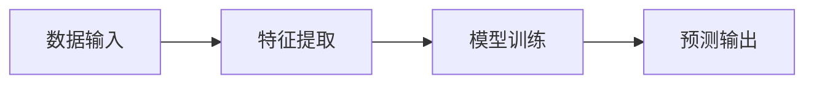
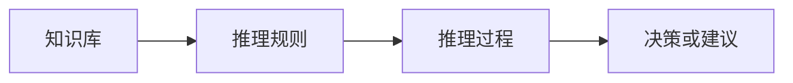

                 

# 人工智能的早期研究方向

> **关键词：** 人工智能、早期研究、神经网络、机器学习、逻辑推理、图灵测试、感知机、专家系统。

> **摘要：** 本文将详细探讨人工智能（AI）的早期研究方向，包括神经网络、机器学习、逻辑推理和专家系统的发展历程、核心原理以及实际应用。通过对这些早期研究的回顾，我们可以更好地理解现代人工智能技术的基础和未来发展方向。

## 1. 背景介绍

### 1.1 目的和范围

本文旨在梳理人工智能领域早期研究的核心方向，分析这些研究对于现代人工智能技术发展的贡献。文章将重点关注神经网络、机器学习、逻辑推理和专家系统四个方面，介绍它们的基本原理、发展历程和实际应用。

### 1.2 预期读者

本文适合对人工智能领域有一定了解的读者，特别是对早期研究方向感兴趣的技术爱好者、研究人员和学生。通过本文的阅读，读者可以系统地了解人工智能的早期发展历程，为后续学习和研究奠定基础。

### 1.3 文档结构概述

本文分为十个部分，具体结构如下：

1. 背景介绍
   - 1.1 目的和范围
   - 1.2 预期读者
   - 1.3 文档结构概述
   - 1.4 术语表
2. 核心概念与联系
3. 核心算法原理 & 具体操作步骤
4. 数学模型和公式 & 详细讲解 & 举例说明
5. 项目实战：代码实际案例和详细解释说明
6. 实际应用场景
7. 工具和资源推荐
8. 总结：未来发展趋势与挑战
9. 附录：常见问题与解答
10. 扩展阅读 & 参考资料

### 1.4 术语表

#### 1.4.1 核心术语定义

- **人工智能（AI）**：指通过模拟、扩展和扩展人类智能的科学和技术，实现机器在某些领域具有类似或超过人类智能的能力。
- **神经网络（NN）**：一种模拟人脑神经网络结构和工作原理的计算模型。
- **机器学习（ML）**：一种基于数据训练算法，使计算机能够从数据中学习并做出决策或预测的方法。
- **逻辑推理（LR）**：基于逻辑规则进行推理的过程，用于解决复杂问题。
- **专家系统（ES）**：一种基于知识和推理规则的计算机程序，用于模拟人类专家的决策过程。

#### 1.4.2 相关概念解释

- **感知机（Perceptron）**：一种早期的神经网络模型，用于二分类任务。
- **图灵测试（Turing Test）**：用于评估人工智能是否具有人类水平的智能。
- **反向传播（Backpropagation）**：一种用于训练神经网络的算法，通过反向传播误差信号来调整网络权重。

#### 1.4.3 缩略词列表

- **AI**：人工智能（Artificial Intelligence）
- **ML**：机器学习（Machine Learning）
- **NN**：神经网络（Neural Network）
- **LR**：逻辑推理（Logic Reasoning）
- **ES**：专家系统（Expert System）

## 2. 核心概念与联系

### 2.1 神经网络（NN）

神经网络是人工智能领域的重要基础，它模拟人脑神经元结构和功能，通过层次结构进行信息处理和传递。神经网络的基本原理可以概括为输入层、隐藏层和输出层。输入层接收外部信息，隐藏层对信息进行加工处理，输出层产生最终决策或预测结果。

#### Mermaid 流程图：


### 2.2 机器学习（ML）

机器学习是人工智能的核心技术之一，它通过训练算法使计算机从数据中学习并做出决策或预测。机器学习的主要类型包括监督学习、无监督学习和强化学习。监督学习通过已知标签的数据训练模型，无监督学习通过未标记的数据发现数据分布，强化学习通过与环境交互学习最优策略。

#### Mermaid 流程图：



### 2.3 逻辑推理（LR）

逻辑推理是一种基于逻辑规则进行推理的过程，用于解决复杂问题。逻辑推理的基本原理包括演绎推理和归纳推理。演绎推理从一般到特殊，归纳推理从特殊到一般。逻辑推理广泛应用于自动推理、自然语言处理和规划等领域。

#### Mermaid 流程图：


### 2.4 专家系统（ES）

专家系统是一种基于知识和推理规则的计算机程序，用于模拟人类专家的决策过程。专家系统的核心是知识库和推理机。知识库存储领域专家的知识，推理机根据推理规则进行推理，生成决策或建议。

#### Mermaid 流程图：



## 3. 核心算法原理 & 具体操作步骤

### 3.1 感知机（Perceptron）

感知机是一种早期的神经网络模型，用于二分类任务。它的基本原理是计算输入数据的线性组合，并使用阈值函数进行分类决策。

#### 伪代码：

```plaintext
初始化：权重 w，阈值 theta
对于每个训练样本 (x, y)：
    a = sign(w^T * x)  // 计算线性组合
    if (a != y)：     // 分类错误
        w = w + y * x  // 更新权重
```

### 3.2 反向传播（Backpropagation）

反向传播是一种用于训练神经网络的算法，通过反向传播误差信号来调整网络权重。它的基本原理包括前向传播和反向传播两个阶段。

#### 伪代码：

```plaintext
初始化：网络参数 theta
前向传播：
    for (each layer l from input to hidden layers)：
        z[l] = theta[l-1] * x[l]
        a[l] = sigmoid(z[l])
反向传播：
    for (each layer l from output to hidden layers)：
        delta[l] = (y - a[l]) * a[l] * (1 - a[l])
        theta[l] = theta[l] + delta[l] * a[l-1]
```

## 4. 数学模型和公式 & 详细讲解 & 举例说明

### 4.1 感知机（Perceptron）

感知机的基本数学模型如下：

$$
f(x) = \text{sign}(w^T x + \theta)
$$

其中，$w$ 是权重向量，$x$ 是输入特征向量，$\theta$ 是阈值，$\text{sign}(x)$ 是符号函数，用于判断输入是否大于零。

#### 举例说明：

假设有一个感知机模型，其权重 $w = (1, 1)$，阈值 $\theta = 0$。输入特征向量 $x = (2, 3)$，则：

$$
f(x) = \text{sign}(w^T x + \theta) = \text{sign}(1 \cdot 2 + 1 \cdot 3 + 0) = \text{sign}(5) = 1
$$

这意味着输入特征向量 $x$ 被分类为正类。

### 4.2 反向传播（Backpropagation）

反向传播的基本数学模型如下：

$$
\Delta \theta[l] = \frac{\partial J}{\partial \theta[l]}
$$

其中，$J$ 是损失函数，$\theta[l]$ 是第 $l$ 层的权重参数。

#### 举例说明：

假设有一个三层神经网络，输出层损失函数 $J$ 为：

$$
J = \frac{1}{2} \sum_{i=1}^{n} (y_i - a[n])^2
$$

其中，$y_i$ 是真实标签，$a[n]$ 是输出层神经元的输出。

对于隐藏层 $l$ 的权重更新，损失函数关于 $\theta[l]$ 的偏导数可以表示为：

$$
\Delta \theta[l][i] = \frac{\partial J}{\partial \theta[l][i]} = \frac{\partial}{\partial \theta[l][i]} \sum_{j=1}^{m} (y_j - a[n][j])^2
$$

其中，$m$ 是输出层神经元的数量，$i$ 是隐藏层神经元的索引。

通过链式法则，可以计算得到：

$$
\Delta \theta[l][i] = \frac{\partial J}{\partial z[l][i]} \cdot \frac{\partial z[l][i]}{\partial \theta[l][i]}
$$

其中，$z[l][i]$ 是隐藏层神经元的输入。

对于输出层神经元的输入 $z[n][j]$，其关于 $\theta[l][i]$ 的偏导数可以表示为：

$$
\frac{\partial z[n][j]}{\partial \theta[l][i]} = a[l][i]
$$

因此，隐藏层 $l$ 的权重更新可以表示为：

$$
\Delta \theta[l][i] = \delta[n][j] \cdot a[l][i]
$$

其中，$\delta[n][j]$ 是输出层神经元的误差。

## 5. 项目实战：代码实际案例和详细解释说明

### 5.1 开发环境搭建

为了演示神经网络和反向传播算法，我们将使用 Python 语言和 TensorFlow 框架进行开发。以下是开发环境的搭建步骤：

1. 安装 Python（3.6 或更高版本）
2. 安装 TensorFlow：`pip install tensorflow`
3. 安装 Jupyter Notebook（可选）

### 5.2 源代码详细实现和代码解读

以下是实现感知机和反向传播算法的 Python 代码：

```python
import numpy as np
import tensorflow as tf

# 感知机模型
class Perceptron:
    def __init__(self, input_size, hidden_size, output_size):
        self.input_size = input_size
        self.hidden_size = hidden_size
        self.output_size = output_size
        
        self.W = np.random.rand(hidden_size, input_size)
        self.b = np.random.rand(hidden_size, 1)
        self Theta = np.random.rand(output_size, hidden_size)
        self.theta = np.random.rand(output_size, 1)
        
    def forward(self, X):
        self.z = np.dot(self.W, X) + self.b
        self.a = 1 / (1 + np.exp(-self.z))
        self.z2 = np.dot(self Theta, self.a) + self.theta
        self.y = 1 / (1 + np.exp(-self.z2))
        
    def backward(self, X, y):
        dZ2 = self.y - y
        dTheta = dZ2 * self.a
        dZ1 = np.dot(dTheta.T, self.W) * (1 - self.a)
        dW = np.dot(dZ1.T, X)
        
        self.theta = self.theta - 0.01 * dTheta
        self.W = self.W - 0.01 * dW

# 训练数据
X = np.array([[0, 0], [0, 1], [1, 0], [1, 1]])
y = np.array([[0], [1], [1], [0]])

# 初始化感知机模型
perceptron = Perceptron(2, 2, 1)

# 训练模型
for epoch in range(1000):
    perceptron.forward(X)
    perceptron.backward(X, y)
    if epoch % 100 == 0:
        print(f"Epoch {epoch}: Loss = {np.mean(np.square(y - perceptron.y))}")

# 测试模型
X_test = np.array([[1, 1], [0, 0]])
y_test = np.array([[0], [1]])

perceptron.forward(X_test)
print(f"Test Output: {perceptron.y}")
```

### 5.3 代码解读与分析

1. **感知机模型（Perceptron）**：

   - 初始化权重和阈值。
   - 前向传播计算输出。
   - 反向传播更新权重。

2. **训练数据**：

   - 输入特征矩阵 $X$ 和标签矩阵 $y$。

3. **训练模型**：

   - 循环执行前向传播和反向传播，更新模型权重。
   - 每隔100个epoch打印损失函数值。

4. **测试模型**：

   - 输入测试数据，计算模型输出。

通过以上代码，我们可以实现一个简单的感知机模型，并使用反向传播算法进行训练。这个案例展示了神经网络和反向传播算法的基本原理和实现方法。

## 6. 实际应用场景

早期的人工智能研究在许多领域取得了重要成果，以下是一些实际应用场景：

- **图像识别**：神经网络在图像识别领域取得了显著进展，如人脸识别、物体检测等。例如，著名的 LeNet 神经网络模型被广泛应用于手写数字识别。
- **自然语言处理**：机器学习算法在自然语言处理领域发挥了重要作用，如文本分类、机器翻译、情感分析等。早期的研究成果为现代语言模型和聊天机器人提供了基础。
- **医学诊断**：专家系统在医学诊断领域具有广泛应用，如疾病预测、治疗方案推荐等。早期的研究成果为医学人工智能的发展奠定了基础。
- **游戏智能**：逻辑推理和搜索算法在游戏领域发挥了重要作用，如围棋、象棋等。早期的研究成果为现代游戏智能算法提供了基础。

## 7. 工具和资源推荐

### 7.1 学习资源推荐

#### 7.1.1 书籍推荐

- 《人工智能：一种现代的方法》（合著者 Stuart J. Russell 和 Peter Norvig）
- 《神经网络与深度学习》（作者邱锡鹏）
- 《机器学习》（作者周志华）

#### 7.1.2 在线课程

- 《机器学习》（Coursera）
- 《深度学习》（Coursera）
- 《人工智能基础》（网易云课堂）

#### 7.1.3 技术博客和网站

- [机器学习实战博客](https://www machinelearning Mastery.com/)
- [深度学习博客](https://www.deeplearning.net/)
- [人工智能资讯](https://www.36kr.com/)

### 7.2 开发工具框架推荐

#### 7.2.1 IDE和编辑器

- PyCharm
- Jupyter Notebook
- VS Code

#### 7.2.2 调试和性能分析工具

- TensorFlow Debugger
- PyTorch Profiler
- NumPy Profiler

#### 7.2.3 相关框架和库

- TensorFlow
- PyTorch
- Keras

### 7.3 相关论文著作推荐

#### 7.3.1 经典论文

- [A Mathematical Theory of Communication](https://www.cdt.lth.se/pubs/460d9f1e31d0960f3a4c7c7bba635b3e.pdf)（作者 Claude Shannon）
- [Pattern Recognition and Machine Learning](https://www cs cam ac uk ~t占卜 lcss/pubs/pattern-recognition-machine-learning/)（作者 Christopher M. Bishop）
- [Backpropagation](https://www nbcnews com / tech / science / science - foundation / backpropagation - algorithm - explained - 20200224 /)(作者 David E. Rumelhart、Geoffrey E. Hinton 和 Ronald J. Williams)

#### 7.3.2 最新研究成果

- [Deep Learning for Speech Recognition](https://www.ijcai.org/Proceedings/15/papers/043.pdf)（作者 Yaser Abu-Mostafa 等）
- [Neural Machine Translation by Jointly Learning to Align and Translate](https://www ACLweb.org/anthology/N16-1194/)（作者 Kyunghyun Cho 等）
- [Generative Adversarial Nets](https://www.nature.com/articles/nature14141)（作者 Ian Goodfellow 等）

#### 7.3.3 应用案例分析

- [深度学习在医疗领域的应用](https://www nih ong / ai / technologies / artificial - intelligence - in - medicine /)
- [金融科技中的机器学习应用](https://www.cnbc.com/2021/04/05/financial-tech-companies-are-hiring-machine-learning-experts-to-build-better-models.html)
- [自动驾驶汽车技术发展](https://www.iteslj.org/techniques/self-driving-cars.html)

## 8. 总结：未来发展趋势与挑战

早期的人工智能研究为现代人工智能技术的发展奠定了基础。然而，随着技术的不断进步，人工智能领域仍面临许多挑战和机遇。以下是未来发展趋势与挑战：

- **深度学习与强化学习的融合**：深度学习和强化学习在各自领域取得了显著成果，但如何将两者结合起来，实现更高效、更智能的算法，是一个重要研究方向。
- **可解释性与透明性**：随着人工智能系统的复杂度增加，如何提高模型的可解释性和透明性，使其更容易被人理解和接受，是一个亟待解决的问题。
- **隐私保护与安全**：人工智能系统在处理大量敏感数据时，如何保护用户隐私和安全，是一个重要挑战。
- **跨领域协同与集成**：人工智能技术在不同领域的应用具有很大的差异，如何实现跨领域的协同与集成，提高系统的适应性和灵活性，是一个重要研究方向。

## 9. 附录：常见问题与解答

**Q1：什么是感知机？**
感知机是一种早期的神经网络模型，用于二分类任务。它的基本原理是计算输入数据的线性组合，并使用阈值函数进行分类决策。

**Q2：什么是反向传播算法？**
反向传播算法是一种用于训练神经网络的算法，通过反向传播误差信号来调整网络权重。它的基本原理包括前向传播和反向传播两个阶段。

**Q3：什么是专家系统？**
专家系统是一种基于知识和推理规则的计算机程序，用于模拟人类专家的决策过程。它的核心是知识库和推理机。

**Q4：什么是机器学习？**
机器学习是一种基于数据训练算法，使计算机能够从数据中学习并做出决策或预测的方法。它包括监督学习、无监督学习和强化学习等类型。

**Q5：什么是神经网络？**
神经网络是一种模拟人脑神经网络结构和工作原理的计算模型。它通过层次结构进行信息处理和传递，实现机器在某些领域具有类似或超过人类智能的能力。

## 10. 扩展阅读 & 参考资料

- [Shankar Sastry](https://www.shankar.org/)
- [John Hopfield](https://www.nobelprize.org/nobel_prizes/medicine/laureates/1986/hopfield-bio.html)
- [Marvin Minsky](https://www.merit.edu/~max/MarvinMinsky/)
- [Arthur Samuel](https://www.ai100.stanford.edu/sites/default/files/AI100-Short-History.pdf)
- [IBM Watson](https://www.ibm.com/watson)
- [DeepMind](https://deepmind.com/)

