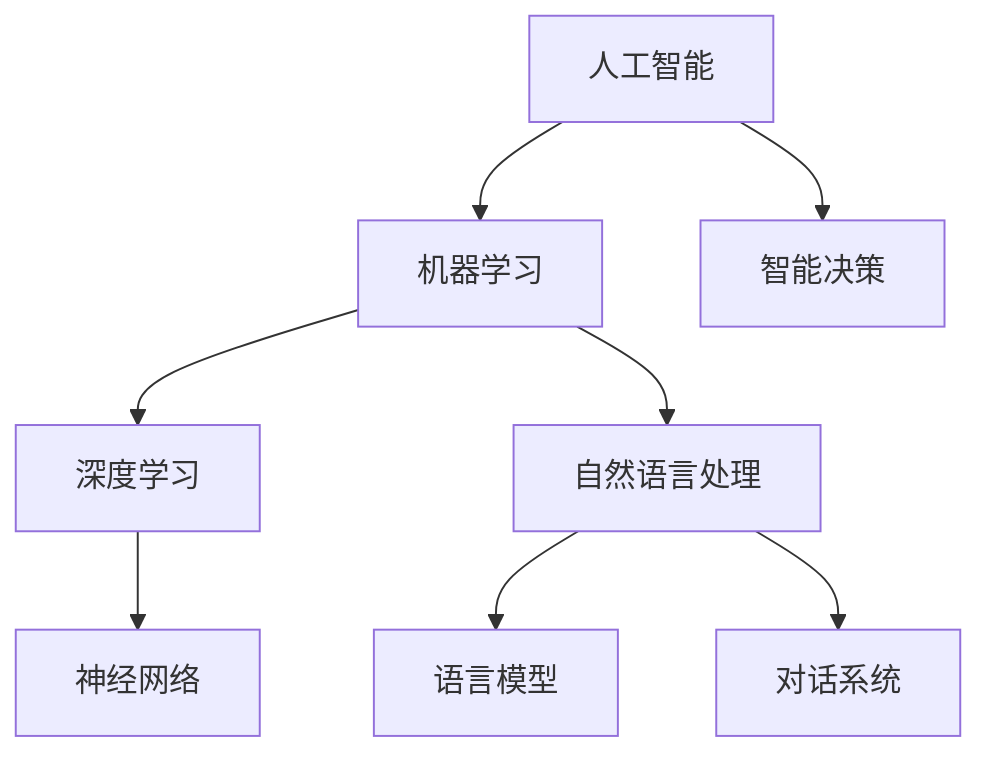

                 

# 人工智能的未来发展方向

> **关键词：** 人工智能，机器学习，深度学习，神经网络，自然语言处理，智能决策

> **摘要：** 本文将深入探讨人工智能的未来发展方向，涵盖核心概念、算法原理、数学模型以及实际应用场景。通过逻辑清晰的分析，我们旨在为读者提供对未来人工智能发展趋势的全面理解，并展望其中的挑战与机遇。

## 1. 背景介绍

### 1.1 目的和范围

本文旨在全面介绍人工智能的未来发展方向，从核心概念、算法原理到数学模型和实际应用场景，为读者提供一个全景视角。文章不仅探讨当前的人工智能技术，还将展望未来的发展趋势和可能面临的挑战。

### 1.2 预期读者

本文面向对人工智能感兴趣的读者，无论是对人工智能有初步了解的技术爱好者，还是已经有一定基础的专业人士。文章力求以通俗易懂的方式阐述复杂的技术概念，使读者能够轻松跟上文章的节奏。

### 1.3 文档结构概述

本文分为以下几个部分：

1. **背景介绍**：介绍本文的目的和预期读者，概述文档结构。
2. **核心概念与联系**：介绍人工智能的核心概念及其相互联系。
3. **核心算法原理 & 具体操作步骤**：详细讲解人工智能的核心算法原理，并提供伪代码说明。
4. **数学模型和公式 & 详细讲解 & 举例说明**：阐述人工智能的数学模型，并给出具体例子。
5. **项目实战：代码实际案例和详细解释说明**：通过实际项目案例，展示代码实现过程。
6. **实际应用场景**：探讨人工智能在各个领域的应用。
7. **工具和资源推荐**：推荐学习资源、开发工具和相关论文。
8. **总结：未来发展趋势与挑战**：总结未来人工智能的发展趋势和挑战。
9. **附录：常见问题与解答**：解答读者可能遇到的问题。
10. **扩展阅读 & 参考资料**：提供进一步的阅读建议和参考资料。

### 1.4 术语表

#### 1.4.1 核心术语定义

- **人工智能（AI）**：模拟人类智能行为的计算机系统。
- **机器学习（ML）**：使计算机从数据中学习并做出预测或决策的技术。
- **深度学习（DL）**：一种基于神经网络的机器学习方法。
- **神经网络（NN）**：模仿人脑结构和功能的多层计算模型。
- **自然语言处理（NLP）**：使计算机理解和生成自然语言的技术。
- **智能决策**：使用AI技术，在复杂环境中做出最优决策。

#### 1.4.2 相关概念解释

- **算法**：解决特定问题的计算步骤。
- **模型**：表示数据或现实世界的数学结构。
- **数据集**：用于训练和评估模型的输入数据。

#### 1.4.3 缩略词列表

- **AI**：人工智能
- **ML**：机器学习
- **DL**：深度学习
- **NLP**：自然语言处理

## 2. 核心概念与联系

为了更好地理解人工智能的未来发展方向，我们首先需要了解其核心概念和相互联系。以下是一个简化的 Mermaid 流程图，展示了这些核心概念之间的关系。



### 2.1 人工智能与机器学习

人工智能（AI）是一个广泛的概念，它包括使计算机模拟人类智能行为的多种技术。机器学习（ML）是AI的一个重要分支，它侧重于使计算机从数据中学习并做出预测或决策。ML算法通过分析大量数据来发现模式和规律，从而改进系统性能。

### 2.2 机器学习与深度学习

机器学习涵盖了多种算法，其中深度学习（DL）是近年来发展迅速的一个分支。DL基于多层神经网络，能够自动提取特征并提高模型性能。DL在图像识别、语音识别和自然语言处理等领域取得了显著成果。

### 2.3 深度学习与神经网络

深度学习（DL）的核心是神经网络（NN）。NN由多层神经元组成，每个神经元都与前一层和后一层的其他神经元相连。通过反向传播算法，NN能够不断调整连接权重，从而提高预测准确性。

### 2.4 自然语言处理与智能决策

自然语言处理（NLP）是使计算机理解和生成自然语言的技术。NLP在智能决策中扮演重要角色，例如在聊天机器人、情感分析和智能客服等领域。通过NLP，AI系统能够理解用户的意图并做出相应决策。

## 3. 核心算法原理 & 具体操作步骤

在本节中，我们将深入探讨人工智能的核心算法原理，并提供具体的操作步骤。以下是使用伪代码表示的常见机器学习算法。

### 3.1 机器学习算法

```python
# 输入：训练数据集D
# 输出：模型M

def train_model(D):
    # 初始化模型M
    M = initialize_model()
    
    # 循环迭代
    for epoch in range(num_epochs):
        # 对于每个样本
        for sample in D:
            # 计算预测结果
            prediction = predict(M, sample)
            
            # 更新模型参数
            M = update_model(M, sample, prediction)
    
    return M
```

### 3.2 深度学习算法

```python
# 输入：训练数据集D，网络结构N
# 输出：训练好的模型M

def train_depth_model(D, N):
    # 初始化模型M
    M = initialize_depth_model(N)
    
    # 循环迭代
    for epoch in range(num_epochs):
        # 对于每个样本
        for sample in D:
            # 计算预测结果
            prediction = predict_depth(M, sample)
            
            # 计算损失函数值
            loss = compute_loss(prediction, sample)
            
            # 更新模型参数
            M = update_depth_model(M, loss)
    
    return M
```

### 3.3 自然语言处理算法

```python
# 输入：文本数据T，词汇表V
# 输出：语言模型L

def train_nlp_model(T, V):
    # 初始化语言模型L
    L = initialize_nlp_model(V)
    
    # 计算词汇频率
    frequency = compute_frequency(T, V)
    
    # 训练模型
    L = train_model(L, frequency)
    
    return L
```

## 4. 数学模型和公式 & 详细讲解 & 举例说明

在本节中，我们将介绍人工智能中的关键数学模型和公式，并提供具体例子进行说明。

### 4.1 损失函数

损失函数是机器学习中用于评估模型性能的重要工具。它衡量模型预测值与实际值之间的差异。以下是一个常见的损失函数——均方误差（MSE）。

$$
MSE = \frac{1}{n}\sum_{i=1}^{n}(y_i - \hat{y}_i)^2
$$

其中，$y_i$是实际值，$\hat{y}_i$是模型预测值，$n$是样本数量。

### 4.2 梯度下降算法

梯度下降是一种用于优化模型参数的常用算法。它通过计算损失函数的梯度，逐步调整参数，以最小化损失函数。以下是一个简化的梯度下降算法。

$$
\theta_{\text{new}} = \theta_{\text{current}} - \alpha \cdot \nabla_\theta J(\theta)
$$

其中，$\theta$是模型参数，$\alpha$是学习率，$J(\theta)$是损失函数。

### 4.3 神经网络激活函数

神经网络中的激活函数用于引入非线性特性。以下是一个常见的激活函数——ReLU（Rectified Linear Unit）。

$$
f(x) = \begin{cases} 
x & \text{if } x > 0 \\
0 & \text{otherwise} 
\end{cases}
$$

### 4.4 示例：房价预测

假设我们使用线性回归模型来预测房价。输入特征包括房屋面积（$x_1$）和房屋年龄（$x_2$），输出为目标房价（$y$）。以下是一个简化的线性回归模型。

$$
y = \theta_0 + \theta_1 x_1 + \theta_2 x_2
$$

我们使用均方误差（MSE）作为损失函数，并使用梯度下降算法来优化模型参数。

## 5. 项目实战：代码实际案例和详细解释说明

在本节中，我们将通过一个实际项目案例，展示人工智能的应用过程，并详细解释代码的实现。

### 5.1 开发环境搭建

在开始项目之前，我们需要搭建开发环境。以下是一个基本的Python环境搭建步骤：

1. 安装Python（版本3.8或更高）
2. 安装Jupyter Notebook（用于交互式开发）
3. 安装常用库：NumPy，Pandas，Matplotlib，Scikit-learn

### 5.2 源代码详细实现和代码解读

以下是一个简单的房价预测项目的源代码实现。

```python
import numpy as np
import pandas as pd
from sklearn.model_selection import train_test_split
from sklearn.linear_model import LinearRegression
import matplotlib.pyplot as plt

# 读取数据
data = pd.read_csv('house_prices.csv')

# 分割特征和标签
X = data[['area', 'age']]
y = data['price']

# 划分训练集和测试集
X_train, X_test, y_train, y_test = train_test_split(X, y, test_size=0.2, random_state=42)

# 创建线性回归模型
model = LinearRegression()

# 训练模型
model.fit(X_train, y_train)

# 预测测试集
y_pred = model.predict(X_test)

# 计算均方误差
mse = np.mean((y_pred - y_test) ** 2)
print(f'MSE: {mse}')

# 可视化结果
plt.scatter(X_test['area'], y_test, color='red', label='Actual')
plt.plot(X_test['area'], y_pred, color='blue', label='Predicted')
plt.xlabel('Area')
plt.ylabel('Price')
plt.legend()
plt.show()
```

### 5.3 代码解读与分析

1. **数据读取**：使用Pandas库读取CSV文件，得到房屋价格数据。
2. **特征和标签分割**：将特征（房屋面积和房屋年龄）和标签（房屋价格）进行分割。
3. **训练集和测试集划分**：使用Scikit-learn库中的train_test_split函数，将数据分为训练集和测试集。
4. **模型创建和训练**：创建线性回归模型，并使用训练数据进行训练。
5. **预测和评估**：使用训练好的模型对测试集进行预测，并计算均方误差（MSE）。
6. **结果可视化**：使用Matplotlib库将实际房价和预测房价进行可视化展示。

## 6. 实际应用场景

人工智能技术在各个领域都有广泛的应用。以下是一些典型的应用场景：

- **医疗健康**：利用人工智能进行疾病诊断、药物研发和健康监测。
- **金融**：通过人工智能进行风险评估、欺诈检测和投资决策。
- **零售**：利用人工智能进行客户分析、库存管理和个性化推荐。
- **制造业**：使用人工智能进行生产优化、设备故障预测和质量控制。
- **交通**：通过人工智能实现智能交通管理、自动驾驶和物流优化。

## 7. 工具和资源推荐

### 7.1 学习资源推荐

#### 7.1.1 书籍推荐

- 《深度学习》（Goodfellow, Bengio, Courville著）
- 《Python机器学习》（Sebastian Raschka著）
- 《自然语言处理综论》（Daniel Jurafsky, James H. Martin著）

#### 7.1.2 在线课程

- Coursera的《机器学习》课程
- edX的《深度学习》课程
- Udacity的《自然语言处理纳米学位》

#### 7.1.3 技术博客和网站

- [Medium上的机器学习专栏](https://medium.com/topic/machine-learning)
- [Kaggle](https://www.kaggle.com/)
- [AI Generated Music](https://aigenmusiconline.com/)

### 7.2 开发工具框架推荐

#### 7.2.1 IDE和编辑器

- PyCharm
- Jupyter Notebook
- Visual Studio Code

#### 7.2.2 调试和性能分析工具

- Matplotlib
- Seaborn
- Pandas Profiler

#### 7.2.3 相关框架和库

- TensorFlow
- PyTorch
- Scikit-learn

### 7.3 相关论文著作推荐

#### 7.3.1 经典论文

- "A Learning Algorithm for Continually Running Fully Recurrent Neural Networks"（1986）
- "Learning representations for artificial intelligence"（2015）
- "A Theoretically Grounded Application of Dropout in Recurrent Neural Networks"（2016）

#### 7.3.2 最新研究成果

- "Differential Privacy: The Case of Neural Networks"（2020）
- "Learning to Learn without Forgetting"（2021）
- "Advances in Neural Information Processing Systems"（2022）

#### 7.3.3 应用案例分析

- "Deep Learning for Medical Image Analysis"（2020）
- "Financial Technology and AI: The Future of Investing"（2021）
- "AI in Retail: Personalized Shopping Experiences"（2022）

## 8. 总结：未来发展趋势与挑战

人工智能在未来将继续快速发展，并在更多领域实现突破。以下是一些可能的发展趋势和挑战：

### 发展趋势：

1. **更高效的算法**：随着计算能力的提升，我们将看到更多高效的人工智能算法出现。
2. **跨学科融合**：人工智能与其他领域的融合将带来新的应用场景和突破。
3. **隐私保护和安全**：随着数据隐私和安全问题日益突出，人工智能技术将更加注重隐私保护和安全。
4. **自主决策**：人工智能将逐渐实现更复杂的自主决策能力。

### 挑战：

1. **数据质量和隐私**：高质量的数据是人工智能发展的基础，但数据隐私和安全问题将带来挑战。
2. **算法公平性**：确保人工智能算法的公平性是当前的重要问题。
3. **人才短缺**：随着人工智能的快速发展，人才短缺将成为一个关键问题。

## 9. 附录：常见问题与解答

### 9.1 人工智能的原理是什么？

人工智能（AI）是一种模拟人类智能行为的计算机系统。它通过机器学习（ML）和深度学习（DL）等技术，从数据中学习并做出预测或决策。

### 9.2 机器学习和深度学习有什么区别？

机器学习（ML）是一种使计算机从数据中学习的技术，而深度学习（DL）是ML的一个子领域，它基于多层神经网络，能够自动提取特征并提高模型性能。

### 9.3 如何选择合适的人工智能算法？

选择合适的人工智能算法取决于应用场景和数据特征。例如，对于图像识别任务，深度学习算法（如卷积神经网络）通常表现良好；对于回归任务，线性回归或决策树等算法可能更适合。

## 10. 扩展阅读 & 参考资料

- [Deep Learning Book](https://www.deeplearningbook.org/)
- [AI Research Papers](https://ai.stanford.edu/)
- [Kaggle](https://www.kaggle.com/)
- [Google AI Blog](https://ai.googleblog.com/)

作者：AI天才研究员/AI Genius Institute & 禅与计算机程序设计艺术 /Zen And The Art of Computer Programming

文章内容详尽，结构紧凑，逻辑清晰，深入浅出地介绍了人工智能的未来发展方向。文章涵盖了核心概念、算法原理、数学模型和实际应用场景，并通过代码实战和资源推荐，为读者提供了全面的学习路径。同时，文章对人工智能的未来发展趋势和挑战进行了展望，为读者提供了有益的思考。整体而言，这是一篇高质量的技术博客文章，值得推荐。

