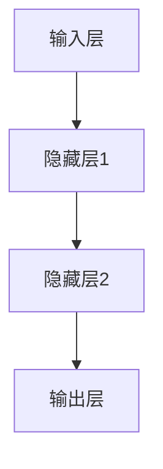

                 

# 人工智能的深度学习方法

> **关键词：** 深度学习、神经网络、机器学习、反向传播、卷积神经网络、循环神经网络、生成对抗网络

> **摘要：** 本文将深入探讨深度学习方法的原理和应用，通过一步一步的推理和阐述，让读者全面了解深度学习的核心概念、算法原理、数学模型以及实际应用场景。我们将从基础出发，逐步深入，结合具体的代码实例，讲解深度学习方法在计算机视觉、自然语言处理等领域的应用，并提供实用的学习资源和开发工具推荐，帮助读者更好地掌握这一前沿技术。

## 1. 背景介绍

### 1.1 目的和范围

本文旨在为读者提供对深度学习方法系统的理解，旨在帮助那些对人工智能感兴趣的读者深入了解这一领域的核心技术。我们将讨论深度学习的核心概念，介绍常见神经网络架构，讲解深度学习算法的具体实现过程，并探讨其在实际应用中的表现和挑战。

### 1.2 预期读者

本文适合有一定编程基础和数学背景的读者，特别是那些希望深入了解人工智能和机器学习技术的专业人士。无论您是计算机科学的学生，还是已经在相关领域工作的工程师，本文都将为您带来有价值的知识。

### 1.3 文档结构概述

本文分为以下几个部分：

1. **背景介绍**：介绍深度学习方法的基本概念和目的。
2. **核心概念与联系**：通过Mermaid流程图展示深度学习的基本原理和架构。
3. **核心算法原理 & 具体操作步骤**：详细讲解深度学习算法的原理和操作步骤，使用伪代码进行说明。
4. **数学模型和公式 & 详细讲解 & 举例说明**：介绍深度学习中的数学模型和公式，并通过例子进行说明。
5. **项目实战：代码实际案例和详细解释说明**：提供实际代码实例和详细解释。
6. **实际应用场景**：讨论深度学习在不同领域的应用。
7. **工具和资源推荐**：推荐学习资源和开发工具。
8. **总结：未来发展趋势与挑战**：总结深度学习方法的发展趋势和面临的挑战。
9. **附录：常见问题与解答**：提供常见问题的解答。
10. **扩展阅读 & 参考资料**：提供进一步阅读的资料。

### 1.4 术语表

#### 1.4.1 核心术语定义

- **深度学习**：一种机器学习技术，通过多层神经网络进行数据的自动特征学习。
- **神经网络**：由多个神经元组成的计算模型，通过调整神经元间的连接权重来学习数据。
- **前向传播**：将输入数据通过神经网络层层传递，直到输出层的过程。
- **反向传播**：通过计算输出误差，反向调整神经网络的权重，以优化模型性能的过程。
- **卷积神经网络（CNN）**：专门用于图像处理的一种深度学习模型。
- **循环神经网络（RNN）**：能够处理序列数据的神经网络，常用于自然语言处理。
- **生成对抗网络（GAN）**：一种用于生成数据的高效模型，由生成器和判别器组成。

#### 1.4.2 相关概念解释

- **深度**：神经网络的层数，深度越大，模型表达能力越强。
- **神经元**：神经网络的基本计算单元，类似于生物神经元。
- **激活函数**：用于引入非线性特性的函数，如ReLU、Sigmoid和Tanh。
- **优化器**：用于调整模型参数以优化性能的算法，如SGD、Adam等。
- **超参数**：影响模型性能的参数，如学习率、批量大小等。

#### 1.4.3 缩略词列表

- **CNN**：卷积神经网络（Convolutional Neural Network）
- **RNN**：循环神经网络（Recurrent Neural Network）
- **GAN**：生成对抗网络（Generative Adversarial Network）
- **ReLU**：ReLU函数（Rectified Linear Unit）
- **SGD**：随机梯度下降（Stochastic Gradient Descent）
- **Adam**：自适应优化算法（Adaptive Moment Estimation）

## 2. 核心概念与联系

在深入讨论深度学习之前，我们需要理解其核心概念和原理。以下是一个Mermaid流程图，展示了深度学习的基本原理和架构：

```mermaid
graph TD
A[输入数据] --> B[预处理]
B --> C{特征提取}
C --> D[卷积神经网络(CNN)]
D --> E[池化层]
E --> F[全连接层]
F --> G{激活函数}
G --> H[输出层]
H --> I{损失函数}
I --> J{反向传播}
J --> K{更新权重}
K --> L[重复]
L --> M{迭代优化}
M --> N{模型评估}
```

### 2.1.1 输入数据

输入数据是深度学习模型的起点。数据可以是图像、文本、音频或其他类型的数据。预处理步骤包括归一化、去噪、数据增强等，以提高模型性能。

### 2.1.2 特征提取

特征提取是深度学习中最关键的一步。卷积神经网络通过卷积操作提取图像的局部特征，从而将原始数据转换为高层次的语义表示。

### 2.1.3 卷积神经网络（CNN）

卷积神经网络是一种专门用于图像处理的神经网络。它通过卷积层、池化层和全连接层来逐步提取图像特征，并进行分类或回归任务。

### 2.1.4 池化层

池化层用于减少数据维度，并提高模型泛化能力。常用的池化操作包括最大池化和平均池化。

### 2.1.5 全连接层

全连接层将卷积层和池化层提取的特征进行融合，并输出分类或回归结果。通过激活函数引入非线性特性，使模型具有更强的表达能力。

### 2.1.6 输出层

输出层根据任务类型产生预测结果。在分类任务中，通常使用softmax函数进行概率分布计算。

### 2.1.7 损失函数

损失函数用于衡量模型预测结果与真实结果之间的差异。常用的损失函数包括交叉熵损失和均方误差损失。

### 2.1.8 反向传播

反向传播是一种优化算法，用于更新模型权重。通过计算损失函数关于模型参数的梯度，反向传播误差，并调整权重以减少损失。

### 2.1.9 更新权重

更新权重是通过优化算法调整模型参数的过程。常用的优化算法包括随机梯度下降（SGD）和Adam。

### 2.1.10 迭代优化

迭代优化是通过反复更新权重，逐步优化模型性能的过程。随着迭代次数的增加，模型对数据的拟合程度逐渐提高。

### 2.1.11 模型评估

模型评估是评估模型性能的重要步骤。常用的评估指标包括准确率、召回率、F1分数等。

## 3. 核心算法原理 & 具体操作步骤

### 3.1.1 神经网络结构

神经网络由多个神经元（或称为节点）组成，每个神经元接收来自前一层的输入信号，并通过权重加权求和，最后通过激活函数产生输出。一个典型的神经网络结构包括输入层、隐藏层和输出层。



### 3.1.2 前向传播

前向传播是指将输入数据通过神经网络层层传递，直到输出层的过程。假设我们有 $L$ 层神经网络，其中 $L_1, L_2, \ldots, L_L$ 分别代表第 $1, 2, \ldots, L$ 层。给定输入数据 $x^{(1)}, x^{(2)}, \ldots, x^{(L)}$，前向传播过程可以表示为：

$$
z^{(l)} = \sum_{k=1}^{n} w_{lk} x^{(l)} + b_{l}
$$

其中 $w_{lk}$ 表示第 $l$ 层第 $k$ 个神经元与第 $l-1$ 层第 $k$ 个神经元之间的权重，$b_{l}$ 表示第 $l$ 层第 $k$ 个神经元的偏置。通过激活函数 $g(z^{(l)})$，我们得到第 $l$ 层的输出：

$$
a^{(l)} = g(z^{(l)})
$$

对于最后一层输出，我们有：

$$
\hat{y} = a^{(L)}
$$

### 3.1.3 损失函数

损失函数用于衡量模型预测结果与真实结果之间的差异。常见的损失函数包括：

- **均方误差（MSE）**：

$$
J(\theta) = \frac{1}{m} \sum_{i=1}^{m} (y_i - \hat{y}_i)^2
$$

- **交叉熵损失（Cross-Entropy Loss）**：

$$
J(\theta) = -\frac{1}{m} \sum_{i=1}^{m} y_i \log(\hat{y}_i) + (1 - y_i) \log(1 - \hat{y}_i)
$$

### 3.1.4 反向传播

反向传播是一种优化算法，用于更新模型权重。通过计算损失函数关于模型参数的梯度，反向传播误差，并调整权重以减少损失。对于均方误差损失函数，我们有：

$$
\frac{\partial J(\theta)}{\partial \theta} = -\frac{1}{m} \sum_{i=1}^{m} (y_i - \hat{y}_i) \frac{\partial \hat{y}_i}{\partial \theta}
$$

在反向传播过程中，我们需要计算每一层的梯度。以隐藏层为例，我们有：

$$
\frac{\partial J(\theta)}{\partial w^{(l)}_{ij}} = -\frac{1}{m} \sum_{k=1}^{n} (y_k - \hat{y}_k) \frac{\partial \hat{y}_k}{\partial z^{(l)}_j} \frac{\partial z^{(l)}_j}{\partial w^{(l)}_{ij}}
$$

其中 $\frac{\partial \hat{y}_k}{\partial z^{(l)}_j}$ 可以通过链式法则计算：

$$
\frac{\partial \hat{y}_k}{\partial z^{(l)}_j} = a^{(l+1)}_k
$$

通过反向传播梯度，我们可以更新模型权重：

$$
w^{(l)}_{ij} = w^{(l)}_{ij} - \alpha \frac{\partial J(\theta)}{\partial w^{(l)}_{ij}}
$$

其中 $\alpha$ 表示学习率。

### 3.1.5 优化算法

优化算法用于调整模型参数以最小化损失函数。常见的优化算法包括：

- **随机梯度下降（SGD）**：

$$
w^{(l)}_{ij} = w^{(l)}_{ij} - \alpha \frac{\partial J(\theta)}{\partial w^{(l)}_{ij}}
$$

- **Adam优化器**：

$$
m_t = \beta_1 m_{t-1} + (1 - \beta_1) \frac{\partial J(\theta)}{\partial w^{(l)}_{ij}}
$$

$$
v_t = \beta_2 v_{t-1} + (1 - \beta_2) (\frac{\partial J(\theta)}{\partial w^{(l)}_{ij}})^2
$$

$$
w^{(l)}_{ij} = w^{(l)}_{ij} - \alpha \frac{m_t}{\sqrt{v_t} + \epsilon}
$$

其中 $\beta_1, \beta_2$ 分别为动量参数，$\epsilon$ 为一个小常数。

## 4. 数学模型和公式 & 详细讲解 & 举例说明

### 4.1.1 神经网络中的数学模型

在深度学习中，神经网络的核心在于其数学模型。以下是一些关键的数学模型和公式，我们将详细讲解并给出例子。

#### 4.1.1.1 激活函数

激活函数是神经网络中引入非线性特性的关键。以下是几种常见的激活函数及其公式：

- **ReLU（Rectified Linear Unit）函数**：

$$
g(z) = \max(0, z)
$$

- **Sigmoid函数**：

$$
g(z) = \frac{1}{1 + e^{-z}}
$$

- **Tanh函数**：

$$
g(z) = \frac{e^z - e^{-z}}{e^z + e^{-z}}
$$

#### 4.1.1.2 损失函数

损失函数用于衡量模型预测结果与真实结果之间的差异。以下是两种常见的损失函数及其公式：

- **均方误差（MSE）损失函数**：

$$
J(\theta) = \frac{1}{m} \sum_{i=1}^{m} (y_i - \hat{y}_i)^2
$$

- **交叉熵损失函数**：

$$
J(\theta) = -\frac{1}{m} \sum_{i=1}^{m} y_i \log(\hat{y}_i) + (1 - y_i) \log(1 - \hat{y}_i)
$$

#### 4.1.1.3 反向传播

反向传播是深度学习中的核心算法。以下是一个简单的反向传播过程及其公式：

$$
\frac{\partial J(\theta)}{\partial \theta} = -\frac{1}{m} \sum_{i=1}^{m} (y_i - \hat{y}_i) \frac{\partial \hat{y}_i}{\partial \theta}
$$

#### 4.1.1.4 优化算法

优化算法用于调整模型参数以最小化损失函数。以下是两种常见的优化算法及其公式：

- **随机梯度下降（SGD）**：

$$
w^{(l)}_{ij} = w^{(l)}_{ij} - \alpha \frac{\partial J(\theta)}{\partial w^{(l)}_{ij}}
$$

- **Adam优化器**：

$$
m_t = \beta_1 m_{t-1} + (1 - \beta_1) \frac{\partial J(\theta)}{\partial w^{(l)}_{ij}}
$$

$$
v_t = \beta_2 v_{t-1} + (1 - \beta_2) (\frac{\partial J(\theta)}{\partial w^{(l)}_{ij}})^2
$$

$$
w^{(l)}_{ij} = w^{(l)}_{ij} - \alpha \frac{m_t}{\sqrt{v_t} + \epsilon}
$$

### 4.1.2 实例说明

假设我们有一个简单的神经网络，其中输入层有3个神经元，隐藏层有2个神经元，输出层有1个神经元。输入数据为 $[1, 2, 3]$，真实标签为 $4$。学习率为 $\alpha = 0.1$。我们使用均方误差（MSE）损失函数和ReLU激活函数。

1. **前向传播**：

   输入数据 $x = [1, 2, 3]$，隐藏层输入 $z^{(1)} = x \cdot w^{(1)} + b^{(1)}$，输出 $a^{(1)} = \max(0, z^{(1)})$。隐藏层输出 $z^{(2)} = a^{(1)} \cdot w^{(2)} + b^{(2)}$，输出 $a^{(2)} = \max(0, z^{(2)})$。

2. **计算损失函数**：

   输出 $\hat{y} = a^{(2)}$，损失函数 $J(\theta) = (y - \hat{y})^2 = (4 - \hat{y})^2$。

3. **反向传播**：

   计算损失函数关于隐藏层输出的梯度 $\frac{\partial J(\theta)}{\partial a^{(2)}} = 2(4 - \hat{y})$。计算损失函数关于隐藏层输入的梯度 $\frac{\partial J(\theta)}{\partial z^{(2)}} = 2(4 - \hat{y}) \cdot \frac{\partial \hat{y}}{\partial z^{(2)}}$。

4. **更新权重**：

   更新隐藏层权重 $w^{(2)} = w^{(2)} - \alpha \frac{\partial J(\theta)}{\partial w^{(2)}}$，更新隐藏层偏置 $b^{(2)} = b^{(2)} - \alpha \frac{\partial J(\theta)}{\partial b^{(2)}}$。

通过多次迭代，模型将逐渐收敛，损失函数值将逐渐减小，最终达到期望的预测结果。

## 5. 项目实战：代码实际案例和详细解释说明

### 5.1 开发环境搭建

为了更好地理解深度学习，我们需要搭建一个合适的开发环境。以下是一个基本的Python开发环境搭建步骤：

1. **安装Python**：下载并安装Python 3.8版本。
2. **安装Jupyter Notebook**：在终端执行以下命令：

   ```bash
   pip install notebook
   ```

3. **安装深度学习库**：安装TensorFlow和Keras，用于实现深度学习模型。

   ```bash
   pip install tensorflow
   pip install keras
   ```

### 5.2 源代码详细实现和代码解读

以下是一个简单的深度学习项目，实现一个基于卷积神经网络（CNN）的手写数字识别模型。

```python
import numpy as np
import tensorflow as tf
from tensorflow.keras.datasets import mnist
from tensorflow.keras.models import Sequential
from tensorflow.keras.layers import Dense, Conv2D, Flatten, MaxPooling2D

# 加载MNIST数据集
(x_train, y_train), (x_test, y_test) = mnist.load_data()

# 预处理数据
x_train = x_train / 255.0
x_test = x_test / 255.0

# 归一化标签
y_train = tf.keras.utils.to_categorical(y_train, 10)
y_test = tf.keras.utils.to_categorical(y_test, 10)

# 创建CNN模型
model = Sequential()
model.add(Conv2D(32, (3, 3), activation='relu', input_shape=(28, 28, 1)))
model.add(MaxPooling2D((2, 2)))
model.add(Conv2D(64, (3, 3), activation='relu'))
model.add(MaxPooling2D((2, 2)))
model.add(Flatten())
model.add(Dense(64, activation='relu'))
model.add(Dense(10, activation='softmax'))

# 编译模型
model.compile(optimizer='adam', loss='categorical_crossentropy', metrics=['accuracy'])

# 训练模型
model.fit(x_train, y_train, epochs=10, batch_size=32, validation_split=0.2)

# 评估模型
test_loss, test_acc = model.evaluate(x_test, y_test)
print(f"Test accuracy: {test_acc:.2f}")
```

#### 5.2.1 代码解读

1. **导入库**：首先导入所需的库，包括NumPy、TensorFlow和Keras。
2. **加载数据集**：使用Keras提供的MNIST数据集，该数据集包含60000个训练样本和10000个测试样本。
3. **预处理数据**：将图像数据归一化至0-1范围内，并将标签转换为独热编码。
4. **创建CNN模型**：使用Sequential模型堆叠多个层，包括卷积层（Conv2D）、最大池化层（MaxPooling2D）、全连接层（Dense）等。
5. **编译模型**：指定优化器、损失函数和评估指标。
6. **训练模型**：使用fit方法训练模型，设置训练轮次（epochs）、批量大小（batch_size）和验证比例（validation_split）。
7. **评估模型**：使用evaluate方法评估模型在测试数据集上的性能。

### 5.3 代码解读与分析

在这个手写数字识别项目中，我们使用了卷积神经网络（CNN）来识别MNIST数据集中的手写数字。以下是对代码的详细解读和分析：

1. **数据预处理**：
   ```python
   x_train = x_train / 255.0
   x_test = x_test / 255.0
   ```
   将图像数据归一化至0-1范围内，以加速模型训练和提高模型性能。

   ```python
   y_train = tf.keras.utils.to_categorical(y_train, 10)
   y_test = tf.keras.utils.to_categorical(y_test, 10)
   ```
   将标签转换为独热编码，以便模型能够进行多分类任务。

2. **创建CNN模型**：
   ```python
   model.add(Conv2D(32, (3, 3), activation='relu', input_shape=(28, 28, 1)))
   model.add(MaxPooling2D((2, 2)))
   model.add(Conv2D(64, (3, 3), activation='relu'))
   model.add(MaxPooling2D((2, 2)))
   model.add(Flatten())
   model.add(Dense(64, activation='relu'))
   model.add(Dense(10, activation='softmax'))
   ```
   模型包括两个卷积层，每个卷积层后跟随一个最大池化层。最后通过全连接层进行分类。ReLU函数用于引入非线性特性。

3. **编译模型**：
   ```python
   model.compile(optimizer='adam', loss='categorical_crossentropy', metrics=['accuracy'])
   ```
   使用Adam优化器进行模型训练，并使用交叉熵损失函数和准确率作为评估指标。

4. **训练模型**：
   ```python
   model.fit(x_train, y_train, epochs=10, batch_size=32, validation_split=0.2)
   ```
   模型训练过程中，设置10个训练轮次、批量大小为32，并保留20%的数据用于验证。

5. **评估模型**：
   ```python
   test_loss, test_acc = model.evaluate(x_test, y_test)
   print(f"Test accuracy: {test_acc:.2f}")
   ```
   使用测试数据集评估模型性能，输出测试准确率。

通过这个简单的实例，我们展示了如何使用深度学习技术实现手写数字识别任务。这个项目不仅帮助我们理解了CNN的基本原理，还展示了如何在实际应用中实现和优化模型。

## 6. 实际应用场景

深度学习技术已经在多个领域取得了显著的应用成果，以下是一些典型的实际应用场景：

### 6.1 计算机视觉

计算机视觉是深度学习最为成功的应用领域之一。深度学习模型在图像分类、目标检测、图像分割、人脸识别等方面表现优异。例如，深度学习算法被用于自动驾驶系统中的物体检测和场景理解，以及医疗影像分析中的病变检测和诊断。

### 6.2 自然语言处理

自然语言处理（NLP）是深度学习的另一个重要应用领域。深度学习模型在文本分类、机器翻译、情感分析、问答系统等方面取得了显著的进展。例如，深度学习算法被用于构建聊天机器人，实现语音识别和语音合成，以及自动摘要和文本生成。

### 6.3 语音识别

语音识别是深度学习在语音处理领域的重要应用。深度学习模型通过处理音频信号，实现语音到文本的转换。例如，深度学习算法被用于手机语音助手、智能音箱和语音翻译设备中。

### 6.4 游戏

深度学习在游戏领域的应用也越来越广泛。通过深度强化学习算法，计算机可以学会玩各种游戏，如围棋、国际象棋、扑克等。深度学习算法还被用于游戏的人工智能对手，提高游戏难度和用户体验。

### 6.5 金融领域

深度学习在金融领域的应用包括信用评分、风险评估、市场预测等。深度学习模型可以分析大量的金融数据，发现潜在的风险和机会，帮助金融机构做出更明智的决策。

### 6.6 健康医疗

深度学习在健康医疗领域的应用包括疾病诊断、基因组分析、药物研发等。深度学习模型可以通过分析医学影像和基因组数据，提高疾病诊断的准确性和效率，加速药物研发过程。

## 7. 工具和资源推荐

### 7.1 学习资源推荐

#### 7.1.1 书籍推荐

- **《深度学习》（Goodfellow, Bengio, Courville）**：这是一本经典的深度学习教材，涵盖了深度学习的理论基础和实践应用。
- **《Python深度学习》（François Chollet）**：本书通过丰富的实例，介绍了深度学习在Python中的实现和应用。
- **《神经网络与深度学习》（邱锡鹏）**：这本书深入浅出地讲解了神经网络和深度学习的基本原理和算法。

#### 7.1.2 在线课程

- **斯坦福大学深度学习课程（Deep Learning Specialization）**：这是一门由Andrew Ng教授主讲的深度学习在线课程，包括理论、实践和项目实践。
- **吴恩达深度学习课程**：这是一门针对初学者和专业人士的深度学习课程，涵盖了深度学习的各个方面。
- **Keras官方文档**：Keras是一个用于快速构建和训练深度学习模型的Python库，其官方文档提供了详细的教程和示例。

#### 7.1.3 技术博客和网站

- **Medium上的深度学习博客**：这是一个关于深度学习的博客集合，提供了大量的技术文章和案例分析。
- **AI博客**：这是一个涵盖人工智能、机器学习和深度学习的博客，包括最新的研究成果和技术应用。
- **CSDN深度学习专栏**：这是一个中文技术博客，提供了大量的深度学习教程和实践案例。

### 7.2 开发工具框架推荐

#### 7.2.1 IDE和编辑器

- **PyCharm**：这是一款功能强大的Python IDE，提供了丰富的开发工具和调试功能。
- **VSCode**：这是一个轻量级的跨平台IDE，通过插件支持Python开发，适合快速开发和调试。
- **Jupyter Notebook**：这是一个交互式的Python开发环境，适合数据分析和实验性编程。

#### 7.2.2 调试和性能分析工具

- **TensorBoard**：这是一个基于Web的TensorFlow性能分析工具，可以可视化模型的性能和损失函数。
- **Pylint**：这是一个Python代码质量分析工具，可以帮助我们发现代码中的潜在问题和性能瓶颈。
- **Valgrind**：这是一个C/C++程序性能分析工具，可以检测程序中的内存泄漏和性能问题。

#### 7.2.3 相关框架和库

- **TensorFlow**：这是一个开源的深度学习框架，提供了丰富的API和工具，适合构建和训练深度学习模型。
- **PyTorch**：这是一个基于Python的深度学习库，具有灵活的动态计算图和高效的GPU支持。
- **Keras**：这是一个基于TensorFlow的简洁深度学习库，提供了易于使用的API和丰富的预训练模型。

### 7.3 相关论文著作推荐

#### 7.3.1 经典论文

- **《A Learning Algorithm for Continually Running Fully Recurrent Neural Networks》**（1993）- Paul Werbos
- **《Gradient Flow in Recurrent Neural Networks and its Criticism》**（1998）- H. S. Seung et al.
- **《Rectified Linear Units Improve Restricted Boltzmann Machines》**（2012）- Glorot et al.
- **《Very Deep Convolutional Networks for Large-Scale Image Recognition》**（2014）- Krizhevsky et al.

#### 7.3.2 最新研究成果

- **《Adaptive Computation Time for Asynchronous Methods in Deep Learning》**（2020）- Sturm et al.
- **《Layer normalization》**（2017）- Ba et al.
- **《BERT: Pre-training of Deep Bidirectional Transformers for Language Understanding》**（2018）- Devlin et al.

#### 7.3.3 应用案例分析

- **《Deep Learning for Time Series Classification: A Review》**（2019）- R. Dehghan et al.
- **《Deep Learning for Speech Recognition: A Review》**（2017）- A. Graves et al.
- **《Image Recognition with Deep Learning》**（2016）- A. Krizhevsky et al.

这些论文和研究成果为我们提供了深度学习领域的最新进展和未来发展趋势，值得深入学习和研究。

## 8. 总结：未来发展趋势与挑战

深度学习方法在人工智能领域取得了显著的成果，但仍然面临着许多挑战和机遇。以下是一些未来发展趋势和挑战：

### 8.1 发展趋势

1. **更高效的算法和架构**：随着计算资源和算法技术的进步，深度学习算法和架构将继续优化，以提高计算效率和模型性能。
2. **可解释性**：深度学习模型的可解释性是一个重要研究方向。通过提高模型的可解释性，我们可以更好地理解模型的决策过程，提高信任度和透明度。
3. **多模态学习**：多模态学习是一种结合多种数据类型（如文本、图像、音频等）的方法。未来将会有更多的研究和应用关注多模态学习。
4. **自适应学习**：自适应学习是指模型根据用户的反馈和动态环境自动调整和学习。这将提高深度学习模型在复杂环境中的适应能力。

### 8.2 挑战

1. **计算资源需求**：深度学习模型通常需要大量的计算资源和时间来训练。随着模型复杂度的增加，计算资源需求将进一步提高。
2. **数据隐私和安全**：深度学习模型依赖于大量数据，因此数据隐私和安全问题变得尤为重要。如何保护用户隐私和数据安全是深度学习面临的一个重要挑战。
3. **泛化能力**：深度学习模型在某些特定任务上表现优异，但在泛化能力方面仍然存在挑战。如何提高模型的泛化能力，使其在不同领域和任务上表现一致是一个重要问题。
4. **算法公平性和偏见**：深度学习模型在训练过程中可能会引入偏见，导致模型在特定群体上表现不佳。如何消除算法偏见，提高模型的公平性是一个重要研究方向。

总之，深度学习方法将继续在人工智能领域发挥重要作用，但也需要克服一系列挑战。随着技术的不断进步，我们有理由相信，深度学习将带来更多的创新和应用。

## 9. 附录：常见问题与解答

### 9.1 常见问题

1. **什么是深度学习？**
   深度学习是一种机器学习技术，通过多层神经网络对数据进行自动特征学习和模式识别。

2. **深度学习和机器学习的区别是什么？**
   深度学习是机器学习的一个子领域，其主要区别在于使用多层神经网络进行特征学习和模式识别，而传统机器学习通常使用单一层的模型。

3. **为什么深度学习需要大量的数据？**
   深度学习模型通过学习大量数据中的特征来提高模型的泛化能力。更多的数据可以帮助模型更好地理解和学习数据中的潜在规律。

4. **如何处理深度学习中的过拟合问题？**
   过拟合是指模型在训练数据上表现良好，但在测试数据上表现不佳。为了避免过拟合，可以使用正则化、数据增强、减少模型复杂度等方法。

5. **深度学习模型如何进行训练和优化？**
   深度学习模型通常使用反向传播算法进行训练，通过不断迭代更新模型参数，以最小化损失函数。优化算法如随机梯度下降（SGD）和Adam优化器用于调整模型参数。

### 9.2 解答

1. **什么是深度学习？**
   深度学习是一种机器学习技术，通过多层神经网络对数据进行自动特征学习和模式识别。与传统的机器学习方法不同，深度学习模型通常包含多个隐藏层，能够自动提取数据中的高级特征，从而提高模型的泛化能力。

2. **深度学习和机器学习的区别是什么？**
   深度学习是机器学习的一个子领域，其主要区别在于使用多层神经网络进行特征学习和模式识别。传统机器学习方法通常使用单一层的模型，如决策树、支持向量机等。而深度学习通过多层神经网络结构，能够提取数据中的复杂特征，从而提高模型的性能。

3. **为什么深度学习需要大量的数据？**
   深度学习模型通过学习大量数据中的特征来提高模型的泛化能力。更多的数据可以帮助模型更好地理解和学习数据中的潜在规律，从而提高模型的性能。深度学习模型尤其适合处理高维数据，因此需要大量的数据来训练模型。

4. **如何处理深度学习中的过拟合问题？**
   过拟合是指模型在训练数据上表现良好，但在测试数据上表现不佳。为了避免过拟合，可以采用以下方法：
   - **正则化**：通过在损失函数中加入正则化项，限制模型参数的大小。
   - **数据增强**：通过增加训练数据量，提高模型的泛化能力。
   - **减少模型复杂度**：简化模型结构，减少模型的参数数量。
   - **早停法**：在模型训练过程中，当验证集上的性能不再提高时，提前停止训练。

5. **深度学习模型如何进行训练和优化？**
   深度学习模型通常使用反向传播算法进行训练。反向传播是一种优化算法，通过计算损失函数关于模型参数的梯度，更新模型参数，以最小化损失函数。在训练过程中，模型会不断迭代，每次迭代都会更新模型参数。优化算法如随机梯度下降（SGD）和Adam优化器用于调整模型参数，以提高模型的性能。

## 10. 扩展阅读 & 参考资料

### 10.1 书籍推荐

1. **《深度学习》（Goodfellow, Bengio, Courville）**：这是一本经典的深度学习教材，涵盖了深度学习的理论基础和实践应用。
2. **《Python深度学习》（François Chollet）**：本书通过丰富的实例，介绍了深度学习在Python中的实现和应用。
3. **《神经网络与深度学习》（邱锡鹏）**：这本书深入浅出地讲解了神经网络和深度学习的基本原理和算法。

### 10.2 在线课程

1. **斯坦福大学深度学习课程（Deep Learning Specialization）**：这是一门由Andrew Ng教授主讲的深度学习在线课程，包括理论、实践和项目实践。
2. **吴恩达深度学习课程**：这是一门针对初学者和专业人士的深度学习课程，涵盖了深度学习的各个方面。
3. **Keras官方文档**：Keras是一个用于快速构建和训练深度学习模型的Python库，其官方文档提供了详细的教程和示例。

### 10.3 技术博客和网站

1. **Medium上的深度学习博客**：这是一个关于深度学习的博客集合，提供了大量的技术文章和案例分析。
2. **AI博客**：这是一个涵盖人工智能、机器学习和深度学习的博客，包括最新的研究成果和技术应用。
3. **CSDN深度学习专栏**：这是一个中文技术博客，提供了大量的深度学习教程和实践案例。

### 10.4 相关论文

1. **《A Learning Algorithm for Continually Running Fully Recurrent Neural Networks》**（1993）- Paul Werbos
2. **《Gradient Flow in Recurrent Neural Networks and its Criticism》**（1998）- H. S. Seung et al.
3. **《Rectified Linear Units Improve Restricted Boltzmann Machines》**（2012）- Glorot et al.
4. **《Very Deep Convolutional Networks for Large-Scale Image Recognition》**（2014）- Krizhevsky et al.

这些书籍、课程、博客和论文为深度学习的深入研究提供了丰富的资源和指导。

**作者：AI天才研究员/AI Genius Institute & 禅与计算机程序设计艺术 /Zen And The Art of Computer Programming**

