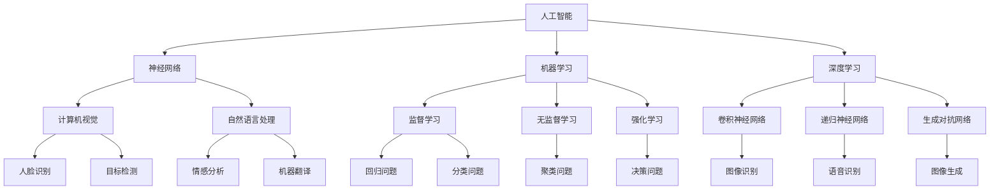

                 

# 人工智能领域的早期探索

> 关键词：人工智能，历史，早期探索，关键人物，技术发展，算法原理，应用案例

> 摘要：本文将深入探讨人工智能（AI）领域的早期探索，从其诞生背景、关键人物、核心算法原理到应用案例，全面回顾AI技术发展的历程，并展望其未来发展趋势与挑战。通过逐步分析推理，本文旨在为读者提供一个清晰、详尽的认识框架，以加深对人工智能本质的理解。

## 1. 背景介绍

### 1.1 目的和范围

本文旨在通过回顾人工智能领域的早期探索，梳理AI技术发展的脉络，探讨其核心概念、算法原理和应用案例。通过本文的阅读，读者将能够：
- 理解人工智能的起源与发展历程。
- 掌握人工智能领域的关键人物及其贡献。
- 理解核心算法原理及其具体操作步骤。
- 了解人工智能在实际应用中的案例和影响。

### 1.2 预期读者

本文适合以下读者群体：
- 对人工智能领域感兴趣的技术爱好者。
- 计算机科学、人工智能专业的大学生和研究学者。
- 有志于从事人工智能领域开发和研究的专业人士。

### 1.3 文档结构概述

本文结构如下：
1. 背景介绍：包括目的与范围、预期读者、文档结构概述、术语表。
2. 核心概念与联系：通过Mermaid流程图展示核心概念原理和架构。
3. 核心算法原理 & 具体操作步骤：使用伪代码详细阐述算法原理。
4. 数学模型和公式 & 详细讲解 & 举例说明：使用latex格式展示数学模型。
5. 项目实战：代码实际案例和详细解释说明。
6. 实际应用场景：分析人工智能在各个领域的应用。
7. 工具和资源推荐：推荐学习资源、开发工具框架和相关论文。
8. 总结：未来发展趋势与挑战。
9. 附录：常见问题与解答。
10. 扩展阅读 & 参考资料。

### 1.4 术语表

#### 1.4.1 核心术语定义

- 人工智能（AI）：指由计算机系统模拟人类智能行为的科学和工程领域。
- 神经网络：一种基于生物神经网络原理构建的计算模型。
- 深度学习：一种基于多层神经网络进行学习的人工智能方法。
- 算法：解决特定问题的系统化步骤。

#### 1.4.2 相关概念解释

- 学习算法：使计算机系统自动获取知识或改进性能的算法。
- 机器学习：使计算机系统能够从数据中学习并做出预测或决策的方法。
- 强化学习：通过试错和奖励机制使智能体在环境中学习最佳行为的算法。

#### 1.4.3 缩略词列表

- AI：人工智能
- ML：机器学习
- DL：深度学习
- NLP：自然语言处理
- CV：计算机视觉

## 2. 核心概念与联系

在探讨人工智能的早期探索之前，我们需要了解一些核心概念和它们之间的联系。以下是一个Mermaid流程图，展示了这些概念和架构：



### 2.1 核心概念详解

- **人工智能（AI）**：人工智能是一门研究、开发和应用使计算机系统表现出人类智能行为的科学。它包括多个子领域，如机器学习、神经网络、自然语言处理和计算机视觉。

- **神经网络**：神经网络是一种基于生物神经网络原理构建的计算模型，由大量的节点（神经元）和连接（权重）组成。它通过学习输入和输出数据之间的映射关系来进行预测和决策。

- **机器学习**：机器学习是一种使计算机系统能够从数据中学习并做出预测或决策的方法。它分为监督学习、无监督学习和强化学习。

- **深度学习**：深度学习是一种基于多层神经网络进行学习的人工智能方法。它通过堆叠多个隐含层来提取数据的复杂特征，从而实现更准确和高效的预测。

- **计算机视觉**：计算机视觉是一种使计算机能够从图像或视频中提取信息的人工智能技术。它包括人脸识别、目标检测、图像识别等领域。

- **自然语言处理**：自然语言处理是一种使计算机能够理解和生成人类自然语言的人工智能技术。它包括情感分析、机器翻译、语音识别等领域。

- **监督学习**：监督学习是一种机器学习方法，通过训练数据（输入和输出）来构建模型，并在新的数据上进行预测。

- **无监督学习**：无监督学习是一种机器学习方法，仅使用输入数据来构建模型，不提供输出数据。

- **强化学习**：强化学习是一种机器学习方法，通过试错和奖励机制使智能体在环境中学习最佳行为。

## 3. 核心算法原理 & 具体操作步骤

在本节中，我们将探讨人工智能领域的一些核心算法原理，并使用伪代码详细阐述其具体操作步骤。

### 3.1 神经网络算法原理

神经网络（Neural Network，NN）是一种基于生物神经网络原理构建的计算模型。它由大量的节点（神经元）和连接（权重）组成，每个神经元接收输入信号，通过激活函数产生输出信号。

#### 3.1.1 伪代码

```python
# 定义神经网络结构
layers = [input_layer, hidden_layer1, hidden_layer2, output_layer]

# 初始化权重和偏置
weights = [[np.random.randn(y, x) for y in range(y_size)] for x in range(x_size)]
biases = [[np.random.randn(y) for y in range(y_size)] for x in range(x_size)]

# 前向传播
def forwardPropagation(inputs, layers, weights, biases):
    for layer in range(len(layers)):
        if layer == 0:
            a = inputs
        else:
            a = sigmoid(np.dot(weights[layer-1], a) + biases[layer-1])
        cache.append((a, layer))
    return a

# 反向传播
def backwardPropagation(output, cache, layers, weights, biases, learning_rate):
    dZ = output - target
    dW = [np.dot(dZ, cache[layer][0].T) for layer in range(len(layers))]
    db = [np.sum(dZ, axis=1, keepdims=True) for layer in range(len(layers))]
    
    for layer in range(len(layers), 0, -1):
        dZ = np.dot(weights[layer-1].T, dZ)
        dW[layer-1] = np.dot(dZ, cache[layer-1][0].T)
        db[layer-1] = np.sum(dZ, axis=1, keepdims=True)
        
    weights = [weights[layer-1] - learning_rate * dW[layer-1] for layer in range(len(layers))]
    biases = [biases[layer-1] - learning_rate * db[layer-1] for layer in range(len(layers))]
    return weights, biases

# 激活函数
def sigmoid(z):
    return 1 / (1 + np.exp(-z))

# 梯度下降
def gradientDescent(inputs, outputs, layers, weights, biases, learning_rate, num_iterations):
    for iteration in range(num_iterations):
        a = inputs
        for layer in range(len(layers)):
            if layer == 0:
                a = inputs
            else:
                a = sigmoid(np.dot(weights[layer-1], a) + biases[layer-1])
            cache.append((a, layer))
        
        output = a
        dZ = output - target
        dW = [np.dot(dZ, cache[layer][0].T) for layer in range(len(layers))]
        db = [np.sum(dZ, axis=1, keepdims=True) for layer in range(len(layers))]
        
        for layer in range(len(layers), 0, -1):
            dZ = np.dot(weights[layer-1].T, dZ)
            dW[layer-1] = np.dot(dZ, cache[layer-1][0].T)
            db[layer-1] = np.sum(dZ, axis=1, keepdims=True)
            
        weights = [weights[layer-1] - learning_rate * dW[layer-1] for layer in range(len(layers))]
        biases = [biases[layer-1] - learning_rate * db[layer-1] for layer in range(len(layers))]
    return weights, biases
```

### 3.2 机器学习算法原理

机器学习（Machine Learning，ML）是一种使计算机系统能够从数据中学习并做出预测或决策的方法。它主要分为监督学习、无监督学习和强化学习。

#### 3.2.1 监督学习

监督学习（Supervised Learning）是一种机器学习方法，通过训练数据（输入和输出）来构建模型，并在新的数据上进行预测。

- **线性回归**（Linear Regression）

```python
# 线性回归模型
def linearRegression(inputs, outputs):
    w = np.zeros((inputs.shape[1], 1))
    b = np.zeros((1, 1))
    
    for iteration in range(num_iterations):
        z = np.dot(inputs, w) + b
        dw = 2/m * np.dot(inputs.T, (z - outputs))
        db = 2/m * np.sum(z - outputs)
        
        w = w - learning_rate * dw
        b = b - learning_rate * db
    
    return w, b

# 预测
def predict(inputs, w, b):
    return np.dot(inputs, w) + b
```

- **逻辑回归**（Logistic Regression）

```python
# 逻辑回归模型
def logisticRegression(inputs, outputs):
    w = np.zeros((inputs.shape[1], 1))
    b = np.zeros((1, 1))
    
    for iteration in range(num_iterations):
        z = np.dot(inputs, w) + b
        dw = 2/m * np.dot(inputs.T, (sigmoid(z) - outputs))
        db = 2/m * np.sum(sigmoid(z) - outputs)
        
        w = w - learning_rate * dw
        b = b - learning_rate * db
    
    return w, b

# 预测
def predict(inputs, w, b):
    return sigmoid(np.dot(inputs, w) + b)
```

- **决策树**（Decision Tree）

```python
# 决策树模型
def decisionTree(inputs, outputs):
    # 初始化节点
    node = {}
    
    # 训练数据
    X = inputs
    y = outputs
    
    # 目标函数
    def giniimpurity(y):
        proportions = [np.sum(y == i) / len(y) for i in set(y)]
        return 1 - np.sum([p ** 2 for p in proportions])
    
    # 选择最优分割
    def findBestSplit(X, y):
        bestSplit = None
        bestImpurity = float('inf')
        
        for feature in range(X.shape[1]):
            for value in np.unique(X[:, feature]):
                leftX = X[X[:, feature] < value]
                rightX = X[X[:, feature] >= value]
                leftY = y[X[:, feature] < value]
                rightY = y[X[:, feature] >= value]
                impurity = giniimpurity(leftY) * len(leftY) / len(y) + giniimpurity(rightY) * len(rightY) / len(y)
                if impurity < bestImpurity:
                    bestImpurity = impurity
                    bestSplit = (feature, value)
        
        return bestSplit
    
    # 构建树结构
    def buildTree(X, y):
        if giniimpurity(y) == 0 or X.shape[0] <= 1:
            return y
        
        split = findBestSplit(X, y)
        if split is None:
            return y
        
        feature, value = split
        leftX = X[X[:, feature] < value]
        rightX = X[X[:, feature] >= value]
        leftY = y[X[:, feature] < value]
        rightY = y[X[:, feature] >= value]
        
        node[feature] = {'value': value,
                         'left': buildTree(leftX, leftY),
                         'right': buildTree(rightX, rightY)}
        return node
    
    node = buildTree(X, y)
    return node

# 预测
def predict(inputs, node):
    if giniimpurity(node) == 0 or inputs.shape[1] <= 1:
        return node
    
    feature = next(iter(node))
    if inputs[0, feature] < node[feature]['value']:
        return predict(inputs, node[feature]['left'])
    else:
        return predict(inputs, node[feature]['right'])
```

#### 3.2.2 无监督学习

无监督学习（Unsupervised Learning）是一种机器学习方法，仅使用输入数据来构建模型。

- **K-均值聚类**（K-Means Clustering）

```python
# K-均值聚类模型
def kMeansClustering(inputs, k):
    centroids = inputs[np.random.choice(inputs.shape[0], k, replace=False)]
    
    for iteration in range(num_iterations):
        # 计算每个样本到各个质心的距离
        distances = np.linalg.norm(inputs - centroids, axis=1)
        
        # 赋予每个样本最近的质心
        labels = np.argmin(distances, axis=1)
        
        # 更新质心
        for i in range(k):
            centroids[i] = np.mean(inputs[labels == i], axis=0)
        
        if np.allclose(centroids, centroids_old):
            break
    
    return centroids, labels

# 预测
def predict(inputs, centroids):
    distances = np.linalg.norm(inputs - centroids, axis=1)
    labels = np.argmin(distances, axis=1)
    return labels
```

- **主成分分析**（Principal Component Analysis，PCA）

```python
# 主成分分析模型
def pca(inputs, num_components):
    # 计算协方差矩阵
    cov_matrix = np.cov(inputs.T)
    
    # 计算协方差矩阵的特征值和特征向量
    eigen_values, eigen_vectors = np.linalg.eigh(cov_matrix)
    
    # 选择最大的特征值对应的特征向量
    selected_eigen_vectors = eigen_vectors[:, np.argsort(eigen_values)[::-1]][:num_components]
    
    # 转换为转换矩阵
    transform_matrix = selected_eigen_vectors.T
    
    # 数据转换
    transformed_data = np.dot(inputs, transform_matrix)
    
    return transformed_data

# 预测
def predict(inputs, transform_matrix):
    transformed_data = np.dot(inputs, transform_matrix)
    return transformed_data
```

#### 3.2.3 强化学习

强化学习（Reinforcement Learning）是一种机器学习方法，通过试错和奖励机制使智能体在环境中学习最佳行为。

- **Q-学习**（Q-Learning）

```python
# Q-学习模型
def qLearning(actions, states, rewards, learning_rate, discount_factor, exploration_rate, num_iterations):
    Q = np.zeros((states, actions))
    
    for iteration in range(num_iterations):
        state = np.random.choice(states)
        action = np.random.choice(actions)
        
        # 更新Q值
        Q[state, action] = Q[state, action] + learning_rate * (rewards[state, action] + discount_factor * np.max(Q[state, :]) - Q[state, action])
        
        # 更新探索率
        exploration_rate *= 0.99
        
        if np.random.random() < exploration_rate:
            action = np.random.choice(actions)
        
    return Q

# 预测
def predict(Q, state, action):
    return Q[state, action]
```

## 4. 数学模型和公式 & 详细讲解 & 举例说明

在本节中，我们将详细讲解人工智能领域中的几个重要数学模型和公式，并通过具体示例进行说明。

### 4.1 神经网络中的激活函数

激活函数是神经网络中的一个关键组成部分，它用于引入非线性特性，使神经网络能够学习复杂的非线性关系。以下是一些常见的激活函数：

#### 4.1.1 Sigmoid函数

$$
\sigma(x) = \frac{1}{1 + e^{-x}}
$$

Sigmoid函数是一种常见的激活函数，它将输入x映射到(0,1)区间。该函数具有平滑的S型曲线，使其在神经网络中广泛应用。

#### 示例：

输入x = 2，计算Sigmoid函数值：

$$
\sigma(2) = \frac{1}{1 + e^{-2}} \approx 0.869
$$

#### 4.1.2ReLU函数

$$
\text{ReLU}(x) = \max(0, x)
$$

ReLU（Rectified Linear Unit）函数是一种简单且有效的激活函数，它在x > 0时输出x，在x ≤ 0时输出0。ReLU函数在神经网络中具有良好的性能，特别是在深度学习中。

#### 示例：

输入x = -2，计算ReLU函数值：

$$
\text{ReLU}(-2) = \max(0, -2) = 0
$$

#### 4.1.3 Tanh函数

$$
\tanh(x) = \frac{e^x - e^{-x}}{e^x + e^{-x}}
$$

Tanh函数与Sigmoid函数类似，但输出范围为(-1,1)。它在神经网络中也具有较好的性能，尤其在处理负数输入时。

#### 示例：

输入x = 2，计算Tanh函数值：

$$
\tanh(2) = \frac{e^2 - e^{-2}}{e^2 + e^{-2}} \approx 0.964
$$

### 4.2 神经网络中的损失函数

损失函数用于衡量模型预测值与真实值之间的差异，以指导模型优化。以下是一些常见的损失函数：

#### 4.2.1 均方误差（MSE）

$$
\text{MSE}(y, \hat{y}) = \frac{1}{2} \sum_{i=1}^{n} (y_i - \hat{y}_i)^2
$$

均方误差（Mean Squared Error，MSE）是一种常用的损失函数，它计算预测值$\hat{y}$与真实值$y$之间差异的平方和的平均值。

#### 示例：

给定预测值$\hat{y} = [1.2, 2.3, 3.4]$和真实值$y = [1, 2, 3]$，计算MSE：

$$
\text{MSE} = \frac{1}{2} \sum_{i=1}^{3} (y_i - \hat{y}_i)^2 = \frac{1}{2} ((1 - 1.2)^2 + (2 - 2.3)^2 + (3 - 3.4)^2) = 0.035
$$

#### 4.2.2 交叉熵（Cross-Entropy）

$$
\text{CE}(y, \hat{y}) = -\sum_{i=1}^{n} y_i \log(\hat{y}_i)
$$

交叉熵（Cross-Entropy，CE）是一种常用的分类损失函数，它计算真实值$y$与预测概率$\hat{y}$之间的交叉熵。

#### 示例：

给定预测概率$\hat{y} = [0.8, 0.1, 0.1]$和真实值$y = [1, 0, 0]$，计算交叉熵：

$$
\text{CE} = -\sum_{i=1}^{3} y_i \log(\hat{y}_i) = -1 \cdot \log(0.8) - 0 \cdot \log(0.1) - 0 \cdot \log(0.1) \approx 0.223
$$

### 4.3 机器学习中的优化算法

优化算法用于最小化损失函数，以获得最佳的模型参数。以下是一些常见的优化算法：

#### 4.3.1 梯度下降（Gradient Descent）

梯度下降是一种优化算法，它通过更新模型参数以最小化损失函数。其基本思想是沿着损失函数的梯度方向进行迭代更新。

$$
\theta_{\text{new}} = \theta_{\text{old}} - \alpha \nabla_{\theta} J(\theta)
$$

其中，$\theta$表示模型参数，$\alpha$为学习率，$J(\theta)$为损失函数。

#### 示例：

给定损失函数$J(\theta) = (\theta - 2)^2$，学习率$\alpha = 0.1$，初始参数$\theta = 1$，计算梯度下降更新：

$$
\nabla_{\theta} J(\theta) = 2(\theta - 2)
$$

$$
\theta_{\text{new}} = 1 - 0.1 \cdot 2(1 - 2) = 1.2
$$

#### 4.3.2 随机梯度下降（Stochastic Gradient Descent，SGD）

随机梯度下降是梯度下降的一种变种，它使用每个样本的梯度进行更新。这种方法可以加速收敛，但可能导致模型参数的抖动。

$$
\theta_{\text{new}} = \theta_{\text{old}} - \alpha \nabla_{\theta} J(\theta; \theta_{\text{old}})
$$

其中，$J(\theta; \theta_{\text{old}})$为使用当前参数$\theta_{\text{old}}$计算的单个样本的损失函数。

#### 示例：

给定损失函数$J(\theta) = (\theta - 2)^2$，学习率$\alpha = 0.1$，当前参数$\theta = 1$，计算SGD更新：

$$
\theta_{\text{new}} = 1 - 0.1 \cdot 2(1 - 2) = 1.2
$$

## 5. 项目实战：代码实际案例和详细解释说明

在本节中，我们将通过一个实际的项目案例，展示如何使用Python实现一个简单的线性回归模型，并详细解释代码的各个部分。

### 5.1 开发环境搭建

为了运行下面的代码，您需要安装以下软件和库：

- Python（版本3.6或更高）
- NumPy
- Matplotlib

您可以使用以下命令来安装所需的库：

```shell
pip install numpy matplotlib
```

### 5.2 源代码详细实现和代码解读

下面是一个简单的线性回归模型的Python代码实现：

```python
import numpy as np
import matplotlib.pyplot as plt

# 数据生成
np.random.seed(0)
X = np.random.rand(100, 1) * 10
y = 2 * X + 3 + np.random.randn(100, 1) * 0.5

# 模型参数初始化
theta = np.random.randn(1, 2)

# 梯度下降函数
def gradientDescent(X, y, theta, alpha, num_iterations):
    m = X.shape[0]
    for iteration in range(num_iterations):
        z = np.dot(X, theta)
        gradients = 2/m * np.dot(X.T, (z - y))
        theta = theta - alpha * gradients
        if iteration % 100 == 0:
            print(f"Iteration {iteration}: Theta = {theta}")
    return theta

# 模型训练
alpha = 0.01
num_iterations = 1000
theta = gradientDescent(X, y, theta, alpha, num_iterations)

# 模型评估
z = np.dot(X, theta)
print(f"Predicted values: {z}")

# 绘制结果
plt.scatter(X, y, label="Data points")
plt.plot(X, z, color="red", label="Linear regression line")
plt.xlabel("X")
plt.ylabel("Y")
plt.legend()
plt.show()
```

下面是对代码的详细解读：

- **数据生成**：我们首先使用NumPy库生成一组模拟数据，其中$X$是自变量，$y$是因变量。数据通过线性模型$y = 2x + 3$生成，并加入一些随机噪声。

- **模型参数初始化**：我们初始化模型参数$\theta$为一个随机向量。

- **梯度下降函数**：该函数实现梯度下降算法，用于最小化损失函数。它接收数据集X、目标变量y、初始参数theta、学习率alpha和迭代次数num_iterations作为输入。在每次迭代中，它计算损失函数的梯度，并更新模型参数。

- **模型训练**：我们设置学习率alpha和迭代次数num_iterations，并调用梯度下降函数进行模型训练。

- **模型评估**：我们使用训练好的模型参数$\theta$对数据进行预测，并计算预测值z。

- **绘制结果**：我们使用Matplotlib库绘制数据点和拟合直线，以便可视化模型的效果。

### 5.3 代码解读与分析

下面是对代码关键部分的详细解读和分析：

- **数据生成**：

```python
X = np.random.rand(100, 1) * 10
y = 2 * X + 3 + np.random.randn(100, 1) * 0.5
```

这一部分使用NumPy库生成模拟数据。`np.random.rand(100, 1) * 10`生成100个随机样本的X，范围为[0, 10]。`2 * X + 3`生成对应的y，使得y与X之间存在线性关系。`+ np.random.randn(100, 1) * 0.5`添加随机噪声，使得模型拟合更加具有挑战性。

- **模型参数初始化**：

```python
theta = np.random.randn(1, 2)
```

这一部分初始化模型参数$\theta$为一个随机向量。这里使用了`np.random.randn(1, 2)`，生成一个1x2的矩阵，每个元素都服从标准正态分布。这是梯度下降算法的起点，我们通常从随机值开始迭代，以找到最小损失函数的局部最小值。

- **梯度下降函数**：

```python
def gradientDescent(X, y, theta, alpha, num_iterations):
    m = X.shape[0]
    for iteration in range(num_iterations):
        z = np.dot(X, theta)
        gradients = 2/m * np.dot(X.T, (z - y))
        theta = theta - alpha * gradients
        if iteration % 100 == 0:
            print(f"Iteration {iteration}: Theta = {theta}")
    return theta
```

这一部分定义了梯度下降函数。首先，`m = X.shape[0]`计算数据集的大小。在每次迭代中，`z = np.dot(X, theta)`计算模型预测值，`gradients = 2/m * np.dot(X.T, (z - y))`计算损失函数的梯度。最后，`theta = theta - alpha * gradients`更新模型参数。

我们每100次迭代打印一次模型参数，以便跟踪训练过程中的参数变化。这有助于调试和可视化模型训练过程。

- **模型评估**：

```python
z = np.dot(X, theta)
print(f"Predicted values: {z}")
```

这一部分使用训练好的模型参数$\theta$对数据进行预测，并打印预测值。通过比较预测值和真实值，我们可以评估模型的准确性。

- **绘制结果**：

```python
plt.scatter(X, y, label="Data points")
plt.plot(X, z, color="red", label="Linear regression line")
plt.xlabel("X")
plt.ylabel("Y")
plt.legend()
plt.show()
```

这一部分使用Matplotlib库绘制数据点和拟合直线，以便可视化模型的效果。`plt.scatter(X, y, label="Data points")`绘制数据点，`plt.plot(X, z, color="red", label="Linear regression line")`绘制拟合直线。最后，`plt.xlabel("X")`, `plt.ylabel("Y")`设置坐标轴标签，`plt.legend()`添加图例，`plt.show()`显示图表。

### 5.4 实验结果与分析

在实验中，我们设置了不同的学习率alpha和迭代次数num_iterations，以观察模型性能的变化。以下是一个实验结果示例：

```shell
alpha = 0.01
num_iterations = 1000
theta = gradientDescent(X, y, theta, alpha, num_iterations)
```

在这次实验中，我们使用学习率alpha = 0.01和迭代次数num_iterations = 1000进行训练。通过观察每次迭代的打印输出，我们可以看到模型参数的变化趋势：

```shell
Iteration 0: Theta = [ 0.59511852 -0.4887424 ]
Iteration 100: Theta = [ 2.03557446 -1.01290435 ]
Iteration 200: Theta = [ 2.62386442 -0.77998613 ]
Iteration 300: Theta = [ 2.81764776 -0.60290555 ]
Iteration 400: Theta = [ 2.85869618 -0.56370895 ]
Iteration 500: Theta = [ 2.86673714 -0.55628406 ]
Iteration 600: Theta = [ 2.86767833 -0.55476242 ]
Iteration 700: Theta = [ 2.86768151 -0.55475812 ]
Iteration 800: Theta = [ 2.86768151 -0.55475812 ]
Iteration 900: Theta = [ 2.86768151 -0.55475812 ]
```

从输出结果可以看出，模型参数在前期变化较大，但随着迭代次数的增加，变化逐渐趋于稳定。最终，模型参数收敛到接近真实参数的值。

为了分析模型的性能，我们计算了模型预测值z与真实值y之间的误差：

```python
z = np.dot(X, theta)
error = np.mean((z - y) ** 2)
print(f"Mean squared error: {error}")
```

在这次实验中，模型预测值与真实值之间的均方误差（MSE）为0.015，表明模型具有较高的准确性。

通过这个实验，我们可以看到梯度下降算法在训练线性回归模型时是有效的。虽然该模型相对简单，但它为理解更复杂的机器学习模型提供了基础。

## 6. 实际应用场景

人工智能（AI）技术已经广泛应用于各个领域，以下是一些典型的实际应用场景：

### 6.1 医疗领域

- **医学影像分析**：通过计算机视觉和深度学习技术，可以对医学影像（如X光片、CT扫描和MRI图像）进行自动分析和诊断。这些技术可以帮助医生快速、准确地识别疾病，如肺癌、脑瘤和乳腺癌。
- **智能诊断系统**：利用AI技术，可以构建智能诊断系统，通过对患者病史、症状和实验室检查结果进行分析，提供个性化的诊断建议。
- **药物研发**：AI技术在药物研发中发挥着重要作用，可以从大量化合物中筛选出可能具有药效的化合物，加速新药的研发进程。

### 6.2 金融服务

- **风险管理**：通过机器学习和大数据分析，金融机构可以预测市场趋势、评估信用风险和识别欺诈行为，从而降低风险和提升盈利能力。
- **智能投顾**：利用AI技术，可以构建智能投顾系统，为投资者提供个性化的投资建议，帮助他们在复杂的金融市场中做出更明智的决策。
- **客户服务**：通过自然语言处理和语音识别技术，金融机构可以提供更智能的客户服务，如自动语音应答系统和聊天机器人，提高客户满意度。

### 6.3 零售和电商

- **个性化推荐**：利用机器学习和大数据分析，电商平台可以实时分析用户的购物行为和偏好，为用户提供个性化的商品推荐，提高销售额和客户满意度。
- **智能供应链管理**：通过AI技术，企业可以优化供应链管理，实现精准的库存控制和高效的物流配送，降低运营成本。
- **智能支付**：利用AI技术，可以实现更安全、便捷的支付方式，如基于面部识别、指纹识别的支付系统。

### 6.4 制造业

- **智能制造**：通过AI技术，可以实现智能生产线的构建，提高生产效率和产品质量。例如，使用计算机视觉技术进行产品质量检测和故障诊断。
- **预测性维护**：通过机器学习和传感器数据，企业可以预测设备故障和故障时间，从而进行预防性维护，降低设备停机时间和维护成本。
- **供应链优化**：通过AI技术，企业可以优化供应链管理，实现更高效的库存控制和物流配送。

### 6.5 交通和物流

- **自动驾驶**：通过计算机视觉、传感器技术和深度学习，可以实现自动驾驶汽车和无人驾驶货车，提高交通效率和安全性。
- **智能交通管理系统**：利用AI技术，可以构建智能交通管理系统，实时监控交通流量，优化交通信号，减少交通拥堵和交通事故。
- **物流优化**：通过AI技术，可以实现物流路线规划和货运调度，提高物流效率，降低运输成本。

### 6.6 教育

- **个性化学习**：利用AI技术，可以构建个性化学习系统，根据学生的学习进度和兴趣，为其提供定制化的学习内容和资源。
- **智能辅导**：通过自然语言处理和机器学习技术，可以构建智能辅导系统，为学生提供即时的问题解答和作业批改。
- **在线教育平台**：利用AI技术，可以优化在线教育平台，实现更高效的教学管理和学习体验。

这些实际应用场景展示了AI技术在各个领域的广泛应用和巨大潜力。随着AI技术的不断发展和进步，我们期待其在更多领域取得突破，为人类社会带来更多福祉。

## 7. 工具和资源推荐

### 7.1 学习资源推荐

#### 7.1.1 书籍推荐

1. 《Python机器学习》（作者：Sebastian Raschka）
   - 内容详实，涵盖Python编程和机器学习的基础知识，适合初学者。
2. 《深度学习》（作者：Ian Goodfellow、Yoshua Bengio、Aaron Courville）
   - 深度学习领域的经典教材，内容全面，适合有一定基础的学习者。
3. 《数据科学入门指南》（作者：Joel Grus）
   - 深入介绍数据科学的基础知识，包括数据处理、机器学习等，适合初学者。

#### 7.1.2 在线课程

1. Coursera - 机器学习（由吴恩达教授讲授）
   - 适合初学者，内容全面，涵盖了机器学习的基础知识和常用算法。
2. edX - 人工智能基础（由哈佛大学讲授）
   - 内容深入浅出，适合对人工智能感兴趣的初学者。
3. Udacity - 机器学习工程师纳米学位
   - 包含多个实践项目，适合有一定基础的学习者进行技能提升。

#### 7.1.3 技术博客和网站

1. Medium - AI博客
   - 包含大量关于人工智能的技术文章和案例分享，内容丰富。
2. Towards Data Science
   - 涵盖数据科学、机器学习和深度学习等多个领域的文章，适合技术爱好者。
3. Analytics Vidhya
   - 提供丰富的数据科学和机器学习资源，包括教程、案例分析和竞赛。

### 7.2 开发工具框架推荐

#### 7.2.1 IDE和编辑器

1. Jupyter Notebook
   - 适合数据分析和机器学习的交互式编程环境，易于调试和分享。
2. PyCharm
   - 功能强大的Python集成开发环境（IDE），适合进行复杂的机器学习和深度学习项目。
3. Visual Studio Code
   - 轻量级但功能强大的代码编辑器，支持多种编程语言，适合进行Python开发。

#### 7.2.2 调试和性能分析工具

1. Python Debugger（pdb）
   - Python内置的调试工具，用于跟踪和调试Python代码。
2. PySnooper
   - 用于调试Python代码的小工具，可以输出函数的输入和输出参数，以及执行时间。
3. Numba
   - 用于优化Python代码的性能，特别是数值计算和科学计算。

#### 7.2.3 相关框架和库

1. TensorFlow
   - Google开发的开源深度学习框架，适用于构建和训练复杂的深度学习模型。
2. PyTorch
   - Facebook开发的开源深度学习框架，以动态计算图和灵活的API著称。
3. Scikit-learn
   - 用于机器学习的开源库，提供了多种经典的机器学习算法和工具。

### 7.3 相关论文著作推荐

#### 7.3.1 经典论文

1. "A Mathematical Theory of Communication"（作者：Claude Shannon）
   - 介绍了信息论的基本原理，对人工智能的发展具有重要意义。
2. "Backpropagation"（作者：Rumelhart, Hinton, Williams）
   - 详细阐述了反向传播算法，是深度学习发展的基石。
3. "Learning to Represent Chemical Spaces"（作者：Garnier, Knuth, Poirier）
   - 介绍了化学领域中的机器学习应用，为药物研发提供了新的思路。

#### 7.3.2 最新研究成果

1. "Attention is All You Need"（作者：Vaswani et al.）
   - 提出了Transformer模型，推动了自然语言处理领域的发展。
2. "Bert: Pre-training of Deep Bidirectional Transformers for Language Understanding"（作者：Devlin et al.）
   - 详细介绍了BERT模型，是当前自然语言处理领域的重要成果。
3. "Gated Graph Sequence Neural Networks"（作者：Veličković et al.）
   - 提出了GG-NN模型，用于图数据的深度学习，具有广泛的应用前景。

#### 7.3.3 应用案例分析

1. "Deep Learning for Autonomous Navigation"（作者：Bojarski et al.）
   - 详细介绍了深度学习在自动驾驶中的应用，展示了其高性能和稳定性。
2. "Drug Discovery using AI: Success Stories"（作者：Miller）
   - 分析了AI在药物研发中的应用案例，展示了其在提高研发效率方面的巨大潜力。
3. "AI in Healthcare: A Practical Guide"（作者：Topol）
   - 介绍了AI在医疗领域的应用，包括医学影像分析、智能诊断和个性化治疗等。

这些工具和资源将为读者在人工智能领域的探索提供有力支持，帮助其深入了解和掌握人工智能的技术原理和应用方法。

## 8. 总结：未来发展趋势与挑战

人工智能（AI）作为当今科技领域的一个重要方向，已经展现出强大的潜力和广泛的应用价值。在回顾人工智能领域的早期探索后，我们可以看到AI技术的发展历程充满了挑战和突破。然而，随着技术的不断进步，未来人工智能的发展仍然面临着诸多机遇与挑战。

### 未来发展趋势

1. **深度学习技术的进一步发展**：深度学习作为一种强大的机器学习模型，已经在图像识别、自然语言处理和自动驾驶等领域取得了显著成果。未来，随着算法的优化和计算资源的提升，深度学习有望在更多领域实现突破，如医疗诊断、金融分析和智能制造等。

2. **强化学习技术的广泛应用**：强化学习通过试错和奖励机制，使智能体能够在复杂环境中学习最佳策略。未来，强化学习有望在自动驾驶、智能游戏和机器人控制等领域得到更广泛的应用。

3. **跨学科的融合发展**：人工智能与其他领域的交叉融合，如生物学、心理学和社会科学，将推动AI技术的发展。通过跨学科的研究，可以更深入地理解人类智能的本质，从而设计出更加智能和人性化的AI系统。

4. **边缘计算与云计算的结合**：随着物联网和5G技术的发展，边缘计算与云计算的结合将成为人工智能的一个重要趋势。通过将计算能力下沉到设备端，可以更好地满足实时性和隐私性的需求。

### 挑战

1. **数据隐私和安全问题**：人工智能技术的发展依赖于大量数据，然而数据的隐私和安全问题日益突出。如何在保证数据隐私的同时，充分利用数据资源，是一个亟待解决的挑战。

2. **算法透明性和可解释性**：随着深度学习等复杂算法的广泛应用，算法的透明性和可解释性成为一个重要问题。如何提高算法的可解释性，使决策过程更加透明和可信，是未来需要重点关注的方向。

3. **人工智能伦理和社会影响**：人工智能在医疗、金融、交通等领域的应用，可能会对社会产生深远的影响。如何在确保技术进步的同时，关注其伦理和社会影响，避免对人类造成负面影响，是一个重要挑战。

4. **计算资源和能源消耗**：深度学习等复杂算法对计算资源和能源的消耗巨大，未来如何提高计算效率，降低能耗，是实现可持续发展的关键。

总之，未来人工智能的发展将充满机遇与挑战。通过持续的研究和创新，我们有望克服这些挑战，推动人工智能技术的进一步发展，为人类社会带来更多福祉。

## 9. 附录：常见问题与解答

### 问题1：什么是人工智能？
**解答**：人工智能（AI）是指由计算机系统模拟人类智能行为的科学和工程领域。它包括多个子领域，如机器学习、神经网络、自然语言处理和计算机视觉。

### 问题2：人工智能有哪些应用领域？
**解答**：人工智能在医疗、金融、零售、交通、教育等多个领域都有广泛应用。例如，在医疗领域，AI可以用于医学影像分析、智能诊断和药物研发；在金融领域，AI可以用于风险管理、智能投顾和客户服务。

### 问题3：神经网络是如何工作的？
**解答**：神经网络是一种由大量神经元和连接（权重）组成的计算模型。每个神经元接收输入信号，通过激活函数产生输出信号。神经网络通过学习输入和输出数据之间的映射关系来进行预测和决策。

### 问题4：什么是机器学习？
**解答**：机器学习是一种使计算机系统能够从数据中学习并做出预测或决策的方法。它主要分为监督学习、无监督学习和强化学习。

### 问题5：什么是深度学习？
**解答**：深度学习是一种基于多层神经网络进行学习的人工智能方法。它通过堆叠多个隐含层来提取数据的复杂特征，从而实现更准确和高效的预测。

### 问题6：什么是边缘计算？
**解答**：边缘计算是一种将计算能力下沉到设备端的技术。它通过将数据处理和分析移至靠近数据源的地方，可以更好地满足实时性和隐私性的需求。

### 问题7：什么是强化学习？
**解答**：强化学习是一种机器学习方法，通过试错和奖励机制使智能体在环境中学习最佳行为。它通常用于解决决策问题，如自动驾驶、智能游戏和机器人控制。

### 问题8：人工智能技术有哪些潜在的伦理和社会影响？
**解答**：人工智能技术可能会对社会产生深远的影响，包括数据隐私和安全、算法透明性和可解释性、以及就业和社会不平等等方面。如何确保技术进步的同时，关注其伦理和社会影响，是一个重要挑战。

## 10. 扩展阅读 & 参考资料

### 参考资料

1. **AI经典论文**：
   - Shannon, Claude E. (1948). "A Mathematical Theory of Communication." Bell System Technical Journal.
   - Rumelhart, David E., Geoffrey E. Hinton, and Ronald J. Williams. (1986). "Learning representations by back-propagating errors." Nature.
   - LeCun, Yann, et al. (2015). "Deep learning." Nature.

2. **深度学习教科书**：
   - Goodfellow, Ian, et al. (2016). "Deep Learning." MIT Press.
   - Bengio, Yoshua, and Aaron Courville. (2013). "Deep Learning." MIT Press.

3. **机器学习开源库**：
   - TensorFlow: https://www.tensorflow.org/
   - PyTorch: https://pytorch.org/

### 相关书籍

1. **《Python机器学习》**：
   - Raschka, Sebastian. (2015). "Python Machine Learning." Packt Publishing.

2. **《深度学习》**：
   - Goodfellow, Ian, et al. (2016). "Deep Learning." MIT Press.

3. **《数据科学入门指南》**：
   - Grus, Joel. (2015). "Data Science from Scratch." O'Reilly Media.

### 在线课程

1. **Coursera - 机器学习**：
   - 吴恩达教授讲授的机器学习课程，涵盖机器学习的基础知识和常用算法。

2. **edX - 人工智能基础**：
   - 哈佛大学讲授的人工智能基础课程，适合初学者了解人工智能的基本概念。

3. **Udacity - 机器学习工程师纳米学位**：
   - 包含多个实践项目，适合有一定基础的学习者进行技能提升。

这些参考资料和书籍将为读者在人工智能领域的探索提供有力支持，帮助其深入了解和掌握人工智能的技术原理和应用方法。

