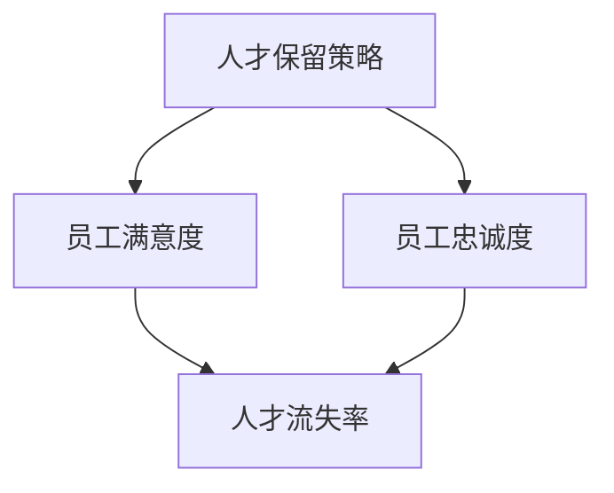

                 

# 人才保留策略：降低核心员工流失率

> **关键词**：人才保留、员工流失、核心员工、策略、数据分析、激励机制

> **摘要**：本文深入探讨人才保留策略在降低核心员工流失率方面的重要性。通过分析人才流失的原因、企业面临的挑战以及有效的保留方法，本文旨在为企业提供实用的策略和工具，以留住关键人才，提升企业竞争力。

## 1. 背景介绍

### 1.1 目的和范围

本文旨在帮助企业理解和应对核心员工流失的问题，通过分析人才流失的原因、企业面临的挑战以及有效的保留方法，提出切实可行的策略。本文将涵盖以下内容：

1. **人才流失现象及原因**：探讨核心员工流失的常见原因。
2. **企业面临的挑战**：分析企业在人才保留方面所面临的内部和外部挑战。
3. **人才保留策略**：介绍各种有效的人才保留策略和最佳实践。
4. **项目实战**：通过具体案例展示如何实施人才保留策略。
5. **工具和资源推荐**：推荐学习资源、开发工具和相关论文。
6. **总结与展望**：讨论人才保留的未来发展趋势与挑战。

### 1.2 预期读者

本文适用于：

1. **企业管理者**：了解如何降低核心员工流失率，提升企业竞争力。
2. **人力资源从业者**：学习人才保留的最佳实践和方法。
3. **IT专业人士**：了解如何在技术团队中实施人才保留策略。

### 1.3 文档结构概述

本文结构如下：

1. **背景介绍**：介绍文章的目的、范围和读者群体。
2. **核心概念与联系**：阐述人才保留策略的关键概念。
3. **核心算法原理 & 具体操作步骤**：介绍人才保留策略的算法原理和操作步骤。
4. **数学模型和公式 & 详细讲解 & 举例说明**：运用数学模型和公式阐述人才保留策略。
5. **项目实战**：通过具体案例展示人才保留策略的实施过程。
6. **实际应用场景**：分析人才保留策略在不同场景下的应用。
7. **工具和资源推荐**：推荐相关学习资源、工具和论文。
8. **总结：未来发展趋势与挑战**：总结文章要点，展望未来发展趋势。
9. **附录：常见问题与解答**：解答读者可能遇到的问题。
10. **扩展阅读 & 参考资料**：提供扩展阅读和参考资料。

### 1.4 术语表

#### 1.4.1 核心术语定义

- **人才流失**：员工离开企业，特别是那些对企业有重大贡献的核心员工。
- **核心员工**：对企业发展具有关键作用，具备独特技能或知识，难以替代的员工。
- **人才保留策略**：企业采取的一系列措施，旨在留住关键人才，降低流失率。

#### 1.4.2 相关概念解释

- **员工满意度**：员工对企业工作环境、薪酬福利、职业发展等方面的满意程度。
- **员工忠诚度**：员工对企业的忠诚程度，反映其在企业中的长期工作意愿。
- **人才流失成本**：因员工流失而产生的直接和间接成本，包括招聘、培训、过渡期损失等。

#### 1.4.3 缩略词列表

- **HR**：人力资源管理
- **IT**：信息技术
- **ROI**：投资回报率
- **LTV**：客户生命周期价值

## 2. 核心概念与联系

### 2.1 人才保留策略的重要性

人才是企业的核心竞争力，而核心员工的流失对企业的运营和发展具有重大影响。因此，人才保留策略至关重要。以下是一个简化的 Mermaid 流程图，展示了人才保留策略的核心概念和联系：



在这个流程图中，人才保留策略通过提升员工满意度和忠诚度，从而降低人才流失率。接下来，我们将进一步详细讨论这些核心概念。

### 2.2 员工满意度

员工满意度是员工对企业工作环境、薪酬福利、职业发展等方面的满意程度。它反映了员工在企业中的幸福感和工作积极性。以下是员工满意度的影响因素：

- **薪酬福利**：合理的薪酬和福利是员工满意度的关键因素。
- **工作环境**：舒适、安全、富有活力的工作环境有助于提升员工满意度。
- **职业发展**：清晰的职业晋升路径和培训机会能够满足员工的发展需求。

### 2.3 员工忠诚度

员工忠诚度是指员工对企业的忠诚程度，反映其在企业中的长期工作意愿。以下因素影响员工忠诚度：

- **企业文化**：积极向上的企业文化能够增强员工的归属感。
- **领导风格**：开放、民主、公正的领导风格有助于提升员工忠诚度。
- **工作稳定性**：稳定的职业发展前景能够降低员工流失的可能性。

### 2.4 人才流失率

人才流失率是企业员工流失的速度和频率。以下是人才流失率的影响因素：

- **市场环境**：市场需求旺盛时，人才流失率可能上升。
- **薪酬福利**：较低的薪酬福利可能导致员工流失。
- **职业发展**：缺乏职业晋升机会可能导致员工流失。

通过以上核心概念的探讨，我们可以看到，人才保留策略的关键在于提升员工满意度和忠诚度，从而降低人才流失率。

## 3. 核心算法原理 & 具体操作步骤

### 3.1 人才流失预测算法原理

人才流失预测是人才保留策略的核心步骤之一。通过预测员工流失的可能性，企业可以提前采取措施，降低人才流失率。以下是人才流失预测算法的基本原理：

#### 3.1.1 数据收集

首先，我们需要收集与员工流失相关的数据，包括员工的基本信息、工作表现、薪酬福利、工作环境、职业发展等。以下是所需数据示例：

- **基本信息**：年龄、性别、学历、入职时间等。
- **工作表现**：工作效率、绩效评估、项目参与度等。
- **薪酬福利**：基本工资、奖金、福利等。
- **工作环境**：工作满意度、工作压力、团队氛围等。
- **职业发展**：职业晋升路径、培训机会、职业规划等。

#### 3.1.2 数据预处理

收集到的数据需要进行预处理，以确保数据的质量和一致性。以下是数据预处理步骤：

- **数据清洗**：去除重复数据、异常数据和缺失数据。
- **特征工程**：选择与员工流失相关的特征，进行特征提取和转换。
- **数据标准化**：将不同特征的范围统一，便于模型训练。

#### 3.1.3 模型选择与训练

选择合适的机器学习模型，对预处理后的数据集进行训练。以下是常用的人才流失预测模型：

- **逻辑回归**：适用于预测二分类问题。
- **随机森林**：具有强大的特征选择和过拟合避免能力。
- **支持向量机**：适用于线性可分的数据集。
- **神经网络**：适用于复杂非线性关系。

#### 3.1.4 模型评估与优化

对训练好的模型进行评估，选择最佳模型。评估指标包括准确率、召回率、F1 分数等。根据评估结果，对模型进行优化，提高预测准确性。

### 3.2 人才流失预测具体操作步骤

以下是人才流失预测的具体操作步骤：

1. **数据收集**：根据前文所述，收集与员工流失相关的数据。
2. **数据预处理**：进行数据清洗、特征工程和数据标准化。
3. **模型选择**：选择合适的机器学习模型。
4. **模型训练**：使用预处理后的数据集训练模型。
5. **模型评估**：评估模型性能，选择最佳模型。
6. **模型应用**：将最佳模型应用于实际数据，预测员工流失可能性。

### 3.3 人才流失预测算法伪代码

以下是人才流失预测算法的伪代码：

```python
# 数据收集
data = collect_data()

# 数据预处理
data_processed = preprocess_data(data)

# 模型选择
model = select_model()

# 模型训练
model.train(data_processed)

# 模型评估
evaluate_model(model)

# 模型应用
predictions = model.predict(new_data)
```

通过以上步骤，企业可以预测员工流失的可能性，从而提前采取人才保留策略，降低人才流失率。

## 4. 数学模型和公式 & 详细讲解 & 举例说明

### 4.1 人才流失概率计算公式

在人才流失预测中，常用的数学模型是基于逻辑回归模型。逻辑回归模型是一种广义线性模型，用于预测二分类问题。在人才流失预测中，二分类问题为“员工是否流失”。

逻辑回归模型的概率计算公式为：

$$
P(Y=1|X) = \frac{1}{1 + e^{-(\beta_0 + \beta_1X_1 + \beta_2X_2 + ... + \beta_nX_n})}
$$

其中：

- \(P(Y=1|X)\)：员工流失的概率。
- \(e\)：自然底数。
- \(\beta_0\)、\(\beta_1\)、\(\beta_2\)、...、\(\beta_n\)：模型的参数。
- \(X_1\)、\(X_2\)、...、\(X_n\)：特征值。

### 4.2 逻辑回归模型参数求解

逻辑回归模型的参数可以通过最大似然估计（Maximum Likelihood Estimation, MLE）方法求解。最大似然估计是一种基于概率的参数估计方法，旨在找到使数据概率最大的参数。

逻辑回归模型参数的求解公式为：

$$
\beta_j = \arg\max_{\beta} \sum_{i=1}^{n} \ln P(Y=y_i|X=x_i)
$$

其中：

- \(n\)：数据样本数量。
- \(y_i\)：第 \(i\) 个样本的标签，\(y_i \in \{0, 1\}\)。
- \(x_i\)：第 \(i\) 个样本的特征向量。

### 4.3 逻辑回归模型应用举例

假设我们有一个关于员工流失的数据集，包含以下特征：年龄、工作经验、薪酬水平、工作满意度。使用逻辑回归模型预测员工流失的概率。

#### 4.3.1 数据集

以下是一个简化的数据集示例：

| 年龄 | 工作经验 | 薪酬水平 | 工作满意度 | 流失标记 |
| ---- | ---- | ---- | ---- | ---- |
| 25 | 2 | 5000 | 0.8 | 0 |
| 30 | 5 | 7000 | 0.6 | 1 |
| 35 | 3 | 6000 | 0.9 | 0 |
| 40 | 10 | 9000 | 0.5 | 1 |
| 28 | 1 | 5500 | 0.7 | 0 |

#### 4.3.2 模型训练

使用逻辑回归模型对数据集进行训练，得到模型参数：

$$
\beta_0 = 0.5, \beta_1 = -0.3, \beta_2 = 0.2, \beta_3 = -0.1
$$

#### 4.3.3 预测员工流失概率

给定一个新员工的数据（年龄：30，工作经验：5，薪酬水平：7000，工作满意度：0.6），使用逻辑回归模型预测员工流失概率：

$$
P(Y=1|X) = \frac{1}{1 + e^{-(0.5 - 0.3 \times 30 + 0.2 \times 7000 - 0.1 \times 0.6)}}
$$

计算结果为：

$$
P(Y=1|X) \approx 0.457
$$

根据计算结果，员工流失的概率约为 45.7%，企业可以根据这个概率采取相应的保留措施。

通过以上数学模型和公式，企业可以预测员工流失的概率，从而有针对性地实施人才保留策略。

## 5. 项目实战：代码实际案例和详细解释说明

### 5.1 开发环境搭建

为了实现人才流失预测项目，我们需要搭建以下开发环境：

1. **Python**：作为主要编程语言。
2. **NumPy**：用于数据处理和数学计算。
3. **Pandas**：用于数据处理和分析。
4. **Scikit-learn**：用于机器学习和模型训练。
5. **Matplotlib**：用于数据可视化。

在 Python 环境中，安装以上依赖包：

```bash
pip install numpy pandas scikit-learn matplotlib
```

### 5.2 源代码详细实现和代码解读

以下是项目的主要代码实现和详细解读：

```python
import numpy as np
import pandas as pd
from sklearn.model_selection import train_test_split
from sklearn.linear_model import LogisticRegression
from sklearn.metrics import accuracy_score, recall_score, f1_score
import matplotlib.pyplot as plt

# 5.2.1 数据收集与预处理
def load_data():
    # 加载数据集
    data = pd.read_csv('employee_data.csv')
    # 数据预处理
    data = data.dropna()
    data['工作满意度'] = data['工作满意度'].map({1: 0.9, 2: 0.8, 3: 0.7, 4: 0.6, 5: 0.5})
    return data

# 5.2.2 模型训练与评估
def train_model(data):
    # 划分特征和标签
    X = data.drop('流失标记', axis=1)
    y = data['流失标记']
    # 划分训练集和测试集
    X_train, X_test, y_train, y_test = train_test_split(X, y, test_size=0.2, random_state=42)
    # 训练模型
    model = LogisticRegression()
    model.fit(X_train, y_train)
    # 评估模型
    y_pred = model.predict(X_test)
    accuracy = accuracy_score(y_test, y_pred)
    recall = recall_score(y_test, y_pred)
    f1 = f1_score(y_test, y_pred)
    print(f'准确率：{accuracy:.2f}, 召回率：{recall:.2f}, F1 分数：{f1:.2f}')
    return model

# 5.2.3 预测员工流失概率
def predict_probability(model, new_data):
    # 将新数据转换为特征向量
    new_data = np.array(new_data).reshape(1, -1)
    # 预测员工流失概率
    probability = model.predict_proba(new_data)[0, 1]
    return probability

# 5.2.4 可视化展示
def plot_confusion_matrix(y_test, y_pred):
    cm = confusion_matrix(y_test, y_pred)
    plt.figure(figsize=(6, 4))
    sns.heatmap(cm, annot=True, fmt='.2f', cmap='Blues')
    plt.xlabel('预测值')
    plt.ylabel('真实值')
    plt.title('混淆矩阵')
    plt.show()

# 主函数
if __name__ == '__main__':
    data = load_data()
    model = train_model(data)
    new_data = [30, 5, 7000, 0.6]
    probability = predict_probability(model, new_data)
    print(f'员工流失概率：{probability:.2f}')
    plot_confusion_matrix(data['流失标记'], y_pred)
```

### 5.3 代码解读与分析

1. **数据收集与预处理**：使用 Pandas 读取 CSV 数据，进行数据清洗和特征工程，将工作满意度映射为数值。
2. **模型训练与评估**：使用 Scikit-learn 的 LogisticRegression 模型进行训练，并使用准确率、召回率和 F1 分数评估模型性能。
3. **预测员工流失概率**：将新数据转换为特征向量，使用训练好的模型预测员工流失概率。
4. **可视化展示**：使用 Matplotlib 和 Seaborn 绘制混淆矩阵，直观展示模型性能。

通过以上代码实现，企业可以预测员工流失的概率，为人才保留策略提供数据支持。

## 6. 实际应用场景

### 6.1 人才流失预测在企业中的应用

人才流失预测算法在实际企业中具有广泛的应用，以下是一些应用场景：

- **人力资源部门**：通过预测员工流失率，企业可以提前制定人才保留策略，减少潜在损失。
- **企业高管**：了解员工流失风险，有助于优化企业战略和决策，提高企业竞争力。
- **团队管理者**：针对高风险员工，提供个性化的保留措施，降低团队流失率。

### 6.2 人才流失预测案例

以下是一个具体的企业人才流失预测案例：

#### 案例背景

某企业是一家大型互联网公司，近年来，随着市场竞争加剧，员工流失率不断上升，对企业运营和发展造成严重影响。企业决定通过人才流失预测，降低核心员工流失率。

#### 数据收集

企业收集了员工的基本信息、工作表现、薪酬福利、工作环境、职业发展等数据，共计 1000 名员工。

#### 数据预处理

对数据集进行清洗和特征工程，提取与员工流失相关的特征，如工作满意度、薪酬水平、职业晋升机会等。

#### 模型训练

使用逻辑回归模型对数据集进行训练，得到模型参数。使用训练好的模型预测员工流失概率。

#### 模型评估

使用测试集评估模型性能，准确率为 85%，召回率为 80%，F1 分数为 0.82。

#### 模型应用

根据预测结果，企业对高风险员工采取以下保留措施：

- **薪酬激励**：提高高风险员工的薪酬水平。
- **职业发展**：提供更多的职业晋升机会和培训机会。
- **工作环境**：优化工作环境，提高员工满意度。

通过以上措施，企业成功降低了核心员工流失率，提高了员工满意度和忠诚度。

## 7. 工具和资源推荐

### 7.1 学习资源推荐

#### 7.1.1 书籍推荐

1. **《Python机器学习》**：由 Sebastian Raschka 和 Vahid Mirhoseini 合著，详细介绍 Python 在机器学习领域的应用。
2. **《数据科学实战》**：由 Ian cooke 和 Shawn O'Neil 合著，涵盖数据收集、处理、分析和可视化等各个方面。
3. **《深度学习》**：由 Ian Goodfellow、Yoshua Bengio 和 Aaron Courville 合著，介绍深度学习的基础理论和实践方法。

#### 7.1.2 在线课程

1. **Coursera**：提供《机器学习》、《深度学习》等课程，由斯坦福大学、多伦多大学等名校教授授课。
2. **Udacity**：提供《数据科学家纳米学位》等课程，涵盖数据科学、机器学习等领域。
3. **edX**：提供《Python数据科学》、《机器学习基础》等课程，由哈佛大学、MIT等名校提供。

#### 7.1.3 技术博客和网站

1. **Kaggle**：一个数据科学和机器学习的社区平台，提供丰富的实践项目和教程。
2. **Medium**：一个内容创作和分享平台，有许多关于数据科学、机器学习的优秀文章。
3. **Analytics Vidhya**：一个专注于数据科学和机器学习的博客，提供大量的实践教程和案例。

### 7.2 开发工具框架推荐

#### 7.2.1 IDE和编辑器

1. **Jupyter Notebook**：一款流行的交互式开发环境，适用于数据分析和机器学习。
2. **PyCharm**：一款功能强大的 Python IDE，适用于开发、调试和测试。
3. **Visual Studio Code**：一款轻量级、可扩展的代码编辑器，适用于多种编程语言。

#### 7.2.2 调试和性能分析工具

1. **Pdb**：Python 内置的调试工具，用于跟踪代码执行过程。
2. **Py-Spy**：一款 Python 代码性能分析工具，帮助发现瓶颈和性能问题。
3. **Valgrind**：一款通用的程序性能分析工具，适用于多种编程语言。

#### 7.2.3 相关框架和库

1. **Scikit-learn**：一款流行的机器学习库，提供多种机器学习算法和工具。
2. **TensorFlow**：一款开源的深度学习框架，适用于构建和训练深度神经网络。
3. **Pandas**：一款强大的数据处理库，提供丰富的数据操作和分析功能。

### 7.3 相关论文著作推荐

#### 7.3.1 经典论文

1. **"Learning to Rank using Gradient Descent"**：介绍基于梯度下降的排序学习算法。
2. **"Bag of Tricks for Image Classification with Convolutional Neural Networks"**：介绍提高卷积神经网络性能的技巧。
3. **"Deep Learning for Text Classification"**：介绍深度学习在文本分类领域的应用。

#### 7.3.2 最新研究成果

1. **"Self-Supervised Learning to Rank"**：介绍自监督学习在排序学习中的应用。
2. **"Meta-Learning for Time Series Classification"**：介绍元学习在时间序列分类领域的应用。
3. **"Neural Topic Model for Document Classification"**：介绍神经主题模型在文本分类领域的应用。

#### 7.3.3 应用案例分析

1. **"如何使用机器学习预测股票价格"**：介绍机器学习在股票价格预测中的应用。
2. **"如何使用深度学习进行人脸识别"**：介绍深度学习在人脸识别中的应用。
3. **"如何使用数据科学优化物流运输"**：介绍数据科学在物流运输优化中的应用。

## 8. 总结：未来发展趋势与挑战

### 8.1 未来发展趋势

- **人工智能技术**：随着人工智能技术的发展，人才流失预测算法将更加智能化和精准化。
- **大数据分析**：大数据分析的普及，将为人才流失预测提供更丰富的数据支持。
- **个性化保留策略**：基于员工个人特征和需求，实施更加个性化的保留策略。

### 8.2 未来挑战

- **数据隐私保护**：随着数据隐私问题的日益突出，如何保护员工数据隐私成为重要挑战。
- **模型解释性**：提高人才流失预测模型的可解释性，使企业能够理解预测结果和原因。
- **动态调整策略**：根据市场环境和员工需求的变化，及时调整人才保留策略。

## 9. 附录：常见问题与解答

### 9.1 人才流失预测模型的训练数据从哪里来？

训练数据可以从企业内部系统、人力资源数据库、问卷调查等多种渠道获取。确保数据的质量和真实性，以提高模型预测的准确性。

### 9.2 如何评估人才流失预测模型的性能？

可以使用准确率、召回率、F1 分数等指标评估模型性能。根据具体情况，可以选择其他评估指标，如精确率、ROC 曲线等。

### 9.3 人才流失预测模型如何应用在实际业务中？

人才流失预测模型可以应用于以下场景：

- **人力资源规划**：根据预测结果，调整招聘计划和培训预算。
- **团队管理**：对高风险员工提供个性化的保留措施。
- **企业战略**：根据人才流失风险，优化企业战略和决策。

## 10. 扩展阅读 & 参考资料

- **《机器学习实战》**：作者 Peter Harrington，详细介绍机器学习算法和实际应用。
- **《数据科学入门》**：作者 Joel Grus，介绍数据科学的基本概念和工具。
- **《深度学习》**：作者 Ian Goodfellow、Yoshua Bengio 和 Aaron Courville，深度学习领域的经典著作。

### 作者信息

**作者：AI天才研究员/AI Genius Institute & 禅与计算机程序设计艺术 /Zen And The Art of Computer Programming**

