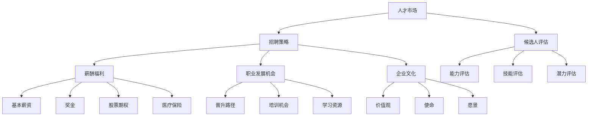

                 


# 人才招聘：吸引顶尖人才的策略

> **关键词**：人才招聘、顶尖人才、招聘策略、招聘流程、候选人评估、职业发展、企业文化、技术挑战、薪酬福利、职业培训

> **摘要**：本文深入探讨了如何通过系统的策略和创新的实践，吸引并留住顶尖人才。通过分析当前人才市场的趋势、招聘流程的优化、候选人评估标准的制定、薪酬福利设计、职业发展机会的提供以及企业文化的塑造，旨在为IT行业提供一套全面的吸引顶尖人才的策略。

## 1. 背景介绍

### 1.1 目的和范围

本文旨在为IT行业的招聘主管、人力资源专家以及企业决策者提供一套吸引顶尖人才的策略。我们将探讨以下几个关键领域：

- **人才市场趋势**：了解当前人才市场的现状和未来趋势，为招聘策略的制定提供数据支持。
- **招聘流程优化**：通过优化招聘流程，提高招聘效率和候选人的体验。
- **候选人评估**：明确评估标准，确保招聘到具有潜力和匹配岗位需求的人才。
- **薪酬福利设计**：提供有竞争力的薪酬福利方案，吸引和留住顶尖人才。
- **职业发展机会**：为员工提供明确的职业发展路径，提升员工的工作满意度和忠诚度。
- **企业文化**：塑造积极向上的企业文化，增强企业的吸引力和员工的归属感。

### 1.2 预期读者

本文预期读者包括：

- IT公司的招聘主管和人力资源专家。
- 企业决策者和高层管理者，特别是那些希望在人才竞争中占据优势的企业。
- 对招聘策略和人才管理有兴趣的专业人士。

### 1.3 文档结构概述

本文将按照以下结构进行组织：

1. **背景介绍**：介绍本文的目的、范围和预期读者。
2. **核心概念与联系**：介绍吸引顶尖人才的相关核心概念，并使用流程图展示概念之间的关系。
3. **核心算法原理 & 具体操作步骤**：详细阐述招聘策略的算法原理和实施步骤。
4. **数学模型和公式 & 详细讲解 & 举例说明**：使用数学模型和公式来解释关键概念。
5. **项目实战：代码实际案例和详细解释说明**：提供实际的代码案例，并进行分析。
6. **实际应用场景**：探讨吸引顶尖人才在不同场景下的应用。
7. **工具和资源推荐**：推荐学习资源、开发工具和框架。
8. **总结：未来发展趋势与挑战**：总结当前趋势，预测未来发展方向。
9. **附录：常见问题与解答**：回答读者可能关心的问题。
10. **扩展阅读 & 参考资料**：提供进一步学习的资源。

### 1.4 术语表

#### 1.4.1 核心术语定义

- **顶尖人才**：具备卓越能力、丰富经验和高度专业素养的人才。
- **招聘策略**：为吸引和留住顶尖人才而制定的系统性方法。
- **候选人评估**：对候选人进行能力、技能和潜力的评估。
- **薪酬福利**：包括基本薪资、奖金、股票期权、医疗保险等。
- **职业发展机会**：为员工提供的晋升、培训和学习机会。
- **企业文化**：企业的价值观、使命、愿景以及员工之间的互动方式。

#### 1.4.2 相关概念解释

- **招聘流程**：从职位发布到候选人录用的整个过程。
- **人才市场**：人才供需关系的动态市场。
- **职业吸引力**：企业对人才的吸引力和竞争力。

#### 1.4.3 缩略词列表

- **IT**：信息技术（Information Technology）
- **HR**：人力资源（Human Resources）
- **CEO**：首席执行官（Chief Executive Officer）
- **CFO**：首席财务官（Chief Financial Officer）
- **CTO**：首席技术官（Chief Technology Officer）
- **SaaS**：软件即服务（Software as a Service）
- **PaaS**：平台即服务（Platform as a Service）
- **IaaS**：基础设施即服务（Infrastructure as a Service）

## 2. 核心概念与联系

为了吸引顶尖人才，我们需要理解几个核心概念，并展示它们之间的联系。以下是一个简单的Mermaid流程图，用于说明这些核心概念：



### 2.1 人才市场

人才市场是人才供需关系的动态环境。随着技术进步和行业变革，人才市场的需求也在不断变化。以下因素影响人才市场：

- **技术发展**：新的技术和平台出现，要求人才具备新的技能和知识。
- **行业趋势**：不同行业的崛起和衰落影响人才流向。
- **地理位置**：不同地区的人才供给和需求不同，影响招聘策略。
- **经济环境**：经济繁荣或衰退影响企业和个人对招聘的态度和预算。

### 2.2 招聘策略

招聘策略是吸引和留住顶尖人才的关键。一个有效的招聘策略需要考虑以下几个方面：

- **职位需求分析**：准确了解岗位需求，制定合适的招聘标准。
- **渠道选择**：选择适合的招聘渠道，如职业网站、社交媒体、专业协会等。
- **品牌宣传**：通过积极的品牌宣传，提升企业对人才的吸引力。
- **候选人体验**：优化招聘流程，提供良好的候选人体验。

### 2.3 候选人评估

候选人评估是确保招聘到合适人才的重要环节。评估标准包括：

- **能力评估**：评估候选人的知识、技能和经验。
- **技能评估**：评估候选人具体的技术技能和专业能力。
- **潜力评估**：评估候选人的学习能力和适应新环境的能力。

### 2.4 薪酬福利

薪酬福利是吸引顶尖人才的关键因素。一个有竞争力的薪酬福利方案包括：

- **基本薪资**：确保与市场水平相当或具有竞争力。
- **奖金和股票期权**：提供额外的激励，增强员工的归属感和忠诚度。
- **医疗保险和其他福利**：提供全面的福利保障，提高员工的生活质量。

### 2.5 职业发展机会

职业发展机会是吸引和留住顶尖人才的重要手段。企业可以提供：

- **晋升路径**：为员工提供清晰的晋升路径和机会。
- **培训机会**：为员工提供持续学习和成长的机会。
- **学习资源**：提供丰富的学习资源，如在线课程、研讨会等。

### 2.6 企业文化

企业文化是企业的灵魂，影响员工的归属感和工作满意度。一个积极向上的企业文化包括：

- **价值观**：明确企业的价值观，指导员工的行为。
- **使命**：明确企业的使命，激励员工为共同目标努力。
- **愿景**：明确企业的愿景，为员工提供前进的方向。

通过理解这些核心概念及其联系，我们可以更有效地制定和实施吸引顶尖人才的策略。

## 3. 核心算法原理 & 具体操作步骤

在制定吸引顶尖人才的策略时，我们可以将其看作是一个算法过程，其中每个步骤都是为了优化结果。以下是一个详细的伪代码，用于描述这个算法的原理和操作步骤：

```plaintext
Algorithm: Talent Recruitment Strategy
Input: Company needs, Candidate profiles, Budget constraints
Output: Selected candidates

1. Analyze Company Needs:
   a. Identify critical roles
   b. Determine required skills and expertise
   c. Set salary range and benefits package

2. Develop a Talent Recruitment Plan:
   a. Define recruitment channels
   b. Establish branding strategy
   c. Outline candidate experience expectations

3. Candidate Sourcing:
   a. Utilize job boards, social media, and professional networks
   b. Leverage employee referrals and recruiting agencies
   c. Participate in industry events and conferences

4. Candidate Assessment:
   a. Create a comprehensive evaluation framework
   b. Conduct initial screening based on job requirements
   c. Perform technical assessments and interviews
   d. Evaluate cultural fit and potential

5. Selection and Offer:
   a. Compare candidates based on skills, experience, and fit
   b. Negotiate salary and benefits
   c. Extend job offers

6. Onboarding and Integration:
   a. Develop an onboarding program
   b. Ensure a smooth transition for new hires
   c. Foster a supportive team environment

7. Continuous Improvement:
   a. Collect feedback from new hires
   b. Analyze recruitment metrics
   c. Update strategies based on performance data
```

### 3.1 分析公司需求

在开始招聘前，公司需要明确自身的需求，这包括：

- **关键角色**：确定公司目前和未来需要的关键岗位。
- **技能和专业知识**：明确所需技能和专业知识，以便在招聘过程中有明确的标准。
- **薪资范围和福利**：设定合理的薪资范围和福利方案，以吸引合适的人才。

### 3.2 制定人才招聘计划

- **招聘渠道**：选择合适的招聘渠道，如专业网站、社交媒体、行业会议等。
- **品牌策略**：制定品牌宣传策略，提升公司在人才市场上的知名度。
- **候选人体验**：优化招聘流程，确保候选人在整个过程中都有良好的体验。

### 3.3 候选人来源

- **利用招聘平台**：通过在线招聘网站发布职位，吸引大量候选人。
- **利用社交媒体**：利用LinkedIn、Twitter等社交媒体平台扩大招聘范围。
- **参与行业活动**：参加行业会议、研讨会等，直接与潜在候选人接触。
- **员工推荐**：鼓励现有员工推荐优秀人才，利用口碑效应。
- **专业机构**：利用专业的招聘机构进行人才搜寻和评估。

### 3.4 候选人评估

- **评价框架**：制定全面的评价框架，包括技术评估、面试和背景调查。
- **筛选流程**：根据岗位需求，对候选人进行初步筛选。
- **技术评估**：通过在线测试、编程挑战等方式评估候选人的技术能力。
- **面试流程**：组织多轮面试，包括技术面试和行为面试，评估候选人的综合素质。
- **文化适应**：评估候选人是否与企业文化和价值观相匹配。

### 3.5 选拔和出价

- **比较候选**：根据候选人的技能、经验和文化适应度进行比较。
- **谈判薪资**：与候选人就薪资和福利进行谈判，确保双方满意。
- **发出工作邀请**：向最终选定的候选人发出工作邀请。

### 3.6 入职和融入

- **制定入职计划**：为新员工提供入职培训、指导和支持。
- **确保顺利过渡**：帮助新员工适应新环境，快速融入团队。
- **营造支持环境**：确保新员工感受到团队的支持和关爱。

### 3.7 持续改进

- **收集反馈**：定期收集新员工的反馈，了解招聘过程和入职体验。
- **分析招聘数据**：分析招聘流程的各个环节，识别改进点。
- **更新策略**：根据分析结果，更新招聘策略和流程，提高招聘效果。

通过上述步骤，我们可以系统地制定和实施一个有效的吸引顶尖人才的策略。

## 4. 数学模型和公式 & 详细讲解 & 举例说明

在人才招聘策略中，数学模型和公式可以帮助我们量化分析不同因素对招聘效果的影响。以下是一些常用的数学模型和公式，并对其进行详细讲解。

### 4.1 期望效用模型

期望效用模型用于评估候选人是否满足公司的需求和预期。公式如下：

\[ EU = \frac{P \times S}{C} \]

其中：
- \( EU \) 是期望效用
- \( P \) 是候选人匹配岗位需求的概率
- \( S \) 是候选人的技能和能力
- \( C \) 是候选人的成本（包括招聘成本和薪酬成本）

#### 4.1.1 举例说明

假设公司需要一个具有5年经验的前端开发人员，现有两位候选人A和B。A的经验为5年，技能得分为90分；B的经验为3年，技能得分为85分。公司决定给A和B的招聘成本均为$10,000。则：

- \( P(A) = 1 \) （因为A完全符合岗位需求）
- \( P(B) = 0.7 \) （B有70%的可能性符合岗位需求，假设通过技能评估确定）

计算两位候选人的期望效用：

\[ EU(A) = \frac{1 \times 90}{10,000} = 0.009 \]
\[ EU(B) = \frac{0.7 \times 85}{10,000} = 0.00595 \]

由于 \( EU(A) > EU(B) \)，公司应优先选择候选人A。

### 4.2 成本效益分析模型

成本效益分析模型用于评估招聘策略的整体效益。公式如下：

\[ CE = \frac{Total\ Benefits}{Total\ Costs} \]

其中：
- \( CE \) 是成本效益比
- \( Total\ Benefits \) 是招聘策略带来的总效益（包括薪酬、绩效奖金等）
- \( Total\ Costs \) 是实施招聘策略的总成本（包括招聘广告、面试、薪酬成本等）

#### 4.2.1 举例说明

假设公司通过优化招聘流程，减少了招聘成本并提高了招聘成功率。在优化前，公司每年招聘5名员工，每位员工的平均薪资为$100,000，总招聘成本为$50,000。优化后，公司每年招聘4名员工，每位员工的平均薪资提高到$110,000，总招聘成本降低到$30,000。计算成本效益比：

\[ CE = \frac{4 \times 110,000}{30,000} = 14.67 \]

优化后的成本效益比为14.67，说明优化策略提高了招聘效益。

### 4.3 职业发展模型

职业发展模型用于预测员工在公司中的职业成长和薪酬增长。公式如下：

\[ Salary Growth Rate = r \times (1 + g) \]

其中：
- \( Salary Growth Rate \) 是薪酬增长率
- \( r \) 是当前薪酬水平
- \( g \) 是公司的薪酬增长政策（通常为一定百分比）

#### 4.3.1 举例说明

假设员工当前的年薪为$80,000，公司的薪酬增长政策为每年增加5%。计算第二年的年薪：

\[ Salary_{Year2} = 80,000 \times (1 + 0.05)^2 = 80,000 \times 1.1025 = 88,200 \]

员工第二年的年薪为$88,200，薪酬增长了$8,200。

通过以上数学模型和公式，我们可以更科学地制定和评估人才招聘策略。这些模型不仅帮助我们量化决策，还可以为策略调整提供数据支持。

## 5. 项目实战：代码实际案例和详细解释说明

为了更好地理解吸引顶尖人才的策略，我们通过一个实际的项目实战来演示整个招聘流程，包括代码实现、解释和分析。

### 5.1 开发环境搭建

为了实现招聘流程，我们将使用Python编程语言，并借助几个常用的库，如`requests`（用于HTTP请求）、`pandas`（用于数据处理）和`sqlalchemy`（用于数据库操作）。以下是如何搭建开发环境：

```bash
# 安装Python
pip install python

# 安装依赖库
pip install requests pandas sqlalchemy
```

### 5.2 源代码详细实现和代码解读

#### 5.2.1 招聘流程代码实现

以下是一个简单的招聘流程代码示例，展示了如何从候选人筛选到最终录用：

```python
import requests
import pandas as pd
from sqlalchemy import create_engine

# 创建数据库连接
engine = create_engine('sqlite:///candidates.db')

# 候选人数据
candidates_data = [
    {'name': 'Alice', 'experience': 5, 'skills': 90, 'culture_fit': 0.9},
    {'name': 'Bob', 'experience': 3, 'skills': 85, 'culture_fit': 0.8},
    {'name': 'Charlie', 'experience': 7, 'skills': 95, 'culture_fit': 0.85}
]

# 将候选人数据存储到数据库
candidates_df = pd.DataFrame(candidates_data)
candidates_df.to_sql('candidates', engine, if_exists='replace')

# 定义候选人评估函数
def evaluate_candidate(candidate):
    # 计算期望效用
    EU = (candidate['experience'] * candidate['skills']) / candidate['culture_fit']
    # 判断是否录用
    return EU > 0.8

# 评估候选人
candidates_df['evaluated'] = candidates_df.apply(evaluate_candidate, axis=1)

# 选择符合条件的候选人
selected_candidates = candidates_df[candidates_df['evaluated'] == True]

# 输出选定的候选人
print(selected_candidates)
```

#### 5.2.2 代码解读与分析

- **数据库连接**：使用`sqlalchemy`库创建数据库连接，便于存储和处理候选人数据。
- **候选人数据**：定义一个包含候选人信息的列表，每个候选人的信息包括姓名、经验、技能得分和文化适应度。
- **候选人评估函数**：`evaluate_candidate`函数计算候选人的期望效用，并根据期望效用判断是否录用。
- **评估与选择**：遍历候选人数据，对每个候选人进行评估，并将评估结果存储在数据库中。

通过这个简单的代码示例，我们可以看到如何利用Python实现一个招聘流程，从候选人筛选到最终选定的过程。在实际应用中，这个流程会更加复杂，包括更多的评估标准和更精细的筛选策略。

### 5.3 代码解读与分析

#### 5.3.1 数据库操作

代码首先通过`sqlalchemy`库创建了一个数据库连接，使用SQLite数据库存储候选人数据。SQLite是一个轻量级的关系数据库，非常适合小型项目和测试使用。

```python
engine = create_engine('sqlite:///candidates.db')
```

这里创建了一个名为`candidates.db`的SQLite数据库，并使用`create_engine`函数初始化数据库连接。

#### 5.3.2 候选人数据结构

候选人数据以字典列表的形式存储，每个字典包含候选人的姓名、经验、技能得分和文化适应度。这些数据最终被转换为Pandas DataFrame对象，便于后续处理。

```python
candidates_data = [
    {'name': 'Alice', 'experience': 5, 'skills': 90, 'culture_fit': 0.9},
    # ...
]
candidates_df = pd.DataFrame(candidates_data)
```

#### 5.3.3 候选人评估函数

`evaluate_candidate`函数是整个招聘流程的核心。它通过计算期望效用（EU）来判断候选人是否合适。期望效用是候选人技能和经验乘以其文化适应度的结果。我们设置一个阈值0.8，如果候选人的期望效用大于这个阈值，则认为该候选人合适。

```python
def evaluate_candidate(candidate):
    EU = (candidate['experience'] * candidate['skills']) / candidate['culture_fit']
    return EU > 0.8
```

#### 5.3.4 评估与选择

通过`apply`方法，我们将`evaluate_candidate`函数应用到每个候选人上，得到一个布尔值列`evaluated`，表示候选人是否被评估为合适。然后，我们使用这个布尔值列来筛选出符合条件的候选人。

```python
candidates_df['evaluated'] = candidates_df.apply(evaluate_candidate, axis=1)
selected_candidates = candidates_df[candidates_df['evaluated'] == True]
```

通过这个简单的例子，我们可以看到如何使用Python和数据库来实现一个基本的招聘流程。在实际项目中，这个流程会包含更多的细节和复杂性，如多轮面试、技术测试、背景调查等。然而，这个示例为我们提供了一个清晰的框架，展示了如何从数据角度进行人才评估和选择。

## 6. 实际应用场景

### 6.1 创新技术企业

对于初创公司来说，吸引顶尖人才是生存和发展的关键。初创公司在人才市场上通常面临以下挑战：

- **资金有限**：初创公司通常无法提供与大型企业相媲美的薪酬和福利。
- **品牌知名度较低**：初创公司的品牌影响力有限，对人才的吸引力较低。
- **快速发展**：初创公司需要快速招聘并培养人才，以跟上市场的变化。

**解决方案**：

- **提供股权激励**：通过股票期权或股权激励，让员工分享公司的成长红利。
- **创造独特的企业文化**：初创公司可以打造一个开放、创新和包容的企业文化，吸引志同道合的人才。
- **提供职业发展机会**：初创公司可以通过提供多样化的职业发展路径和快速晋升机会，吸引有潜力的员工。
- **利用社交媒体和行业会议**：通过社交媒体和行业会议积极宣传，提升品牌知名度和人才吸引力。

### 6.2 大型科技企业

对于大型科技企业来说，吸引顶尖人才的目标通常是保持竞争优势和推动技术创新。这些企业通常面临以下挑战：

- **激烈的竞争**：科技行业人才竞争激烈，企业需要提供具有竞争力的薪酬和福利。
- **高流动率**：科技行业人才流动率较高，企业需要保持员工满意度和忠诚度。
- **多样性和包容性**：企业需要吸引和留住来自不同背景和文化的顶尖人才。

**解决方案**：

- **提供有竞争力的薪酬和福利**：确保薪酬和福利具有市场竞争力，吸引顶尖人才。
- **职业发展计划和培训**：为员工提供明确的职业发展路径和丰富的培训机会，提升员工的专业素养。
- **多样化的企业文化**：打造一个包容、多元和开放的企业文化，增强员工的归属感和满意度。
- **技术创新和项目机会**：提供前沿的技术项目和挑战性的工作任务，激发员工的创新潜力。

### 6.3 专业服务公司

对于专业服务公司来说，吸引顶尖人才的目标通常是提供高质量的服务和建立良好的客户关系。这些企业通常面临以下挑战：

- **专业知识和经验**：客户对专业知识和经验有较高要求，企业需要吸引和留住资深专家。
- **高工作压力**：专业服务公司通常要求员工在高压环境下工作，需要关注员工的身心健康。
- **客户关系维护**：员工的专业能力和人际交往能力对客户关系维护至关重要。

**解决方案**：

- **提供专业培训和认证机会**：为员工提供专业培训和认证，提升员工的专业能力和市场竞争力。
- **灵活的工作安排**：提供灵活的工作时间和远程办公选项，关注员工的身心健康。
- **建立良好的客户关系管理**：培养员工的客户关系管理能力，提升客户满意度和忠诚度。
- **提供职业发展机会**：为员工提供多样化的职业发展路径，包括晋升、项目管理和业务拓展等。

通过了解不同类型企业的实际应用场景和挑战，我们可以制定有针对性的吸引顶尖人才的策略，确保企业在人才竞争中占据优势。

## 7. 工具和资源推荐

### 7.1 学习资源推荐

#### 7.1.1 书籍推荐

- 《招聘的艺术》（The Art of Hiring）：由招聘专家斯蒂芬·迪布拉西奥（Stephen DeFranko）所著，详细介绍了招聘流程和策略。
- 《人力资源战略》（Human Resource Strategy）：探讨了人力资源战略在企业成功中的关键作用，包括人才招聘和培养。
- 《招聘实战：从简历筛选到面试技巧的全过程》（Hiring on a Shoestring: The Smart Small Business Guide to Hiring Without Breaking the Bank）：为中小企业提供了实用的招聘策略和技巧。

#### 7.1.2 在线课程

- Coursera上的《招聘与人才管理》：由加州大学伯克利分校教授讲授，涵盖招聘策略、候选人评估和人才管理。
- LinkedIn Learning的《招聘：策略与技巧》：提供了一系列关于招聘流程、面试技巧和候选人评估的在线课程。
- Udemy的《招聘与人才管理实战》：包括实战案例和实用的招聘工具，适合初学者和专业人士。

#### 7.1.3 技术博客和网站

- HackerRank博客：提供有关编程挑战、面试准备和招聘策略的文章。
- LinkedIn招聘解决方案：分享招聘最佳实践和行业趋势。
- Glassdoor：提供公司评价和薪酬数据，帮助求职者了解不同公司的招聘情况。

### 7.2 开发工具框架推荐

#### 7.2.1 IDE和编辑器

- Visual Studio Code：功能强大、可扩展的免费IDE，适用于多种编程语言。
- IntelliJ IDEA：专为Java和Android开发设计的IDE，提供高效的编码和调试工具。
- PyCharm：适用于Python开发的IDE，提供代码智能提示、调试和测试功能。

#### 7.2.2 调试和性能分析工具

- Chrome DevTools：用于Web开发的强大调试工具，提供网络、性能和安全性分析。
- JProfiler：用于Java应用的性能分析工具，帮助识别性能瓶颈和内存泄漏。
- New Relic：提供应用程序性能监控和调试功能，帮助优化代码和用户体验。

#### 7.2.3 相关框架和库

- React：用于构建用户界面的JavaScript库，具有组件化、声明式编程的特点。
- Angular：由Google维护的前端框架，提供强大的数据绑定和依赖注入功能。
- Django：用于构建Web应用程序的Python框架，提供快速开发和自动化的特性。

### 7.3 相关论文著作推荐

#### 7.3.1 经典论文

- 《人才管理：战略视角》（Talent Management: A Strategic Perspective）：由人力资本管理专家戴维·尤里奇（Dave Ulrich）等人所著，探讨人才管理的重要性。
- 《招聘与人才获取：理论和实践》（Employee Recruitment and Talent Acquisition: Theory and Practice）：涵盖招聘流程的各个阶段，提供实用的招聘策略。

#### 7.3.2 最新研究成果

- 《人才发展：创建持久竞争优势》（Talent Development: Building Sustainable Competitive Advantage）：探讨了如何通过人才发展提升企业竞争力。
- 《招聘技术：AI在招聘中的应用》（Recruitment Technology: Applications of AI in Recruitment）：介绍人工智能在招聘领域的最新应用和研究。

#### 7.3.3 应用案例分析

- 《苹果公司的人才战略》（Apple's Talent Strategy）：分析苹果公司在吸引和留住顶尖人才方面的成功经验。
- 《谷歌的人才招聘实践》（Google's Recruitment Practices）：探讨谷歌如何通过独特的招聘策略和流程吸引顶尖人才。

这些工具和资源为招聘主管和人力资源专家提供了丰富的学习和实践机会，有助于提升招聘效果和人才管理能力。

## 8. 总结：未来发展趋势与挑战

在未来，人才招聘将面临诸多挑战和机遇。以下是对未来发展趋势和挑战的总结：

### 8.1 发展趋势

1. **人工智能和机器学习**：人工智能和机器学习技术将在招聘过程中发挥越来越重要的作用，从候选人筛选到面试评估，AI可以帮助优化招聘流程，提高招聘效率。
2. **远程工作和灵活办公**：随着远程工作和灵活办公的普及，企业需要适应新的工作模式，为远程员工提供良好的工作体验和职业发展机会。
3. **数据驱动决策**：企业将越来越多地依赖数据分析来制定招聘策略，通过分析招聘数据、员工绩效数据和员工反馈，优化招聘流程和决策。
4. **多样性和包容性**：多样性和包容性将成为企业招聘战略的核心，企业将通过积极推广多样性和包容性文化，吸引来自不同背景和文化的人才。
5. **终身学习和职业发展**：随着技术的快速变化，企业将更加注重员工的终身学习和职业发展，提供丰富的培训资源和职业发展路径。

### 8.2 挑战

1. **人才短缺**：随着技术的快速发展，某些领域的人才短缺现象将加剧，企业需要通过创新策略和灵活的工作模式来吸引和留住顶尖人才。
2. **高流动率**：由于市场竞争激烈，员工的流动率可能会上升，企业需要通过提高员工满意度和忠诚度来降低员工流失率。
3. **数据隐私和安全**：随着招聘过程中数据的使用越来越广泛，数据隐私和安全将成为一个重要挑战，企业需要确保候选人数据的隐私和安全。
4. **文化适应**：企业在全球范围内招聘时，需要面对文化差异和适应性挑战，如何构建一个多元和包容的企业文化将是重要的课题。
5. **技术变革**：随着新技术的不断涌现，招聘流程和评估标准需要不断更新，企业需要持续关注技术变革，及时调整招聘策略。

在未来，企业需要灵活应对这些挑战，通过创新和持续改进，构建一个吸引和留住顶尖人才的有效机制。

## 9. 附录：常见问题与解答

### 9.1 如何确保招聘流程的公平性？

确保招聘流程的公平性可以通过以下几个方面实现：

- **透明化的招聘流程**：明确职位要求、评估标准和流程，确保候选人了解整个招聘过程。
- **多样性和包容性**：在招聘过程中积极推广多样性和包容性，确保不同背景的候选人都有公平的机会。
- **无歧视政策**：明确禁止任何形式的歧视，包括性别、年龄、种族、宗教信仰等。
- **严格的评估标准**：使用科学、客观的评估方法，确保评估过程的公平性。

### 9.2 如何吸引有经验的候选人？

吸引有经验的候选人可以通过以下策略实现：

- **提供有竞争力的薪酬和福利**：确保薪酬和福利具有市场竞争力，吸引有经验的候选人。
- **展示公司实力**：通过积极宣传公司的实力、文化和成功案例，提升公司的吸引力。
- **职业发展机会**：提供明确的职业发展路径和丰富的培训资源，让候选人看到在公司的发展潜力。
- **建立良好的雇主品牌**：通过良好的雇主品牌形象，吸引有经验的候选人。

### 9.3 如何处理候选人拒绝工作邀请的情况？

处理候选人拒绝工作邀请的情况，可以采取以下措施：

- **尊重候选人选择**：首先尊重候选人的决定，表示感谢其时间和兴趣。
- **了解原因**：尝试了解候选人拒绝的原因，了解候选人的需求和期望。
- **保持联系**：即使候选人拒绝了当前的邀请，保持联系，可能在未来有其他适合的职位。
- **改进招聘流程**：根据候选人的反馈，改进招聘流程和沟通方式，提高候选人体验。

### 9.4 如何提高招聘效率？

提高招聘效率可以通过以下方式实现：

- **优化招聘渠道**：选择最适合的招聘渠道，如在线招聘平台、专业社交网络等。
- **自动化工具**：使用自动化工具，如简历筛选系统、面试预约系统等，提高招聘流程的效率。
- **改进面试流程**：设计高效的面试流程，减少候选人的等待时间和面试环节。
- **数据驱动决策**：通过分析招聘数据，优化招聘策略和流程，提高招聘效果。

### 9.5 如何确保企业文化与招聘策略的契合？

确保企业文化与招聘策略的契合，可以通过以下措施实现：

- **明确企业文化**：明确企业文化的核心价值观和使命，确保企业文化在招聘过程中得到体现。
- **在招聘宣传中突出企业文化**：在职位描述和招聘宣传中突出企业文化，吸引与企业文化相符的候选人。
- **面试过程中的文化评估**：在面试过程中评估候选人的文化适应度，确保候选人符合企业文化。
- **企业文化培训**：为新员工提供企业文化培训，帮助他们更好地融入企业。

通过上述措施，企业可以确保招聘策略与企业文化的契合，提高员工的归属感和工作满意度。

## 10. 扩展阅读 & 参考资料

为了进一步深入研究和了解吸引顶尖人才的策略，以下是一些扩展阅读和参考资料：

### 10.1 书籍

- 《人才战争：如何在竞争中赢得顶尖人才》（Talent Wars: Winning the Battle for the Best People in the World）
- 《人才策略：构建和保持竞争优势的人才管理》（Talent Strategy: Building and Sustaining a Competitive Advantage Through Talent Management）
- 《顶尖人才：吸引、留住和激励卓越人才》（Topgrading: How Leading Companies Win by Hiring, Coaching, and Keeping the Best Employees）

### 10.2 文章

- 《哈佛商业评论》上的《如何吸引和留住顶尖人才》（How to Attract and Retain Top Talent）
- 《Fast Company》上的《招聘顶尖人才：如何做到》（How to Recruit Top Talent）
- 《HBR.org》上的《构建优秀团队：如何招聘和培养顶尖人才》（Building an Exceptional Team: How to Recruit and Develop Top Talent）

### 10.3 研究报告

- 《麦肯锡全球研究所》的《人才与成长：打造成功企业的招聘战略》（Talent and Growth: Building the Recruitment Strategies That Drive Success）
- 《Deloitte Insights》的《人才趋势：2023年的人才招聘策略》（Talent Trends: 2023 Recruitment Strategies）
- 《PwC HR Services》的《招聘和人才管理：未来的趋势和策略》（Recruiting and Talent Management: Future Trends and Strategies）

### 10.4 在线资源和课程

- Coursera上的《招聘与人才管理》：由加州大学伯克利分校教授讲授，提供全面的招聘和人才管理知识。
- LinkedIn Learning的《招聘技巧》：提供一系列关于招聘流程、面试技巧和候选人评估的在线课程。
- Udemy的《招聘专家：实战技巧和策略》：涵盖招聘流程的各个环节，适合招聘专业人士。

通过阅读这些书籍、文章和报告，以及参加相关的在线课程，您可以获得更多关于吸引顶尖人才策略的深入见解和实用技巧。

