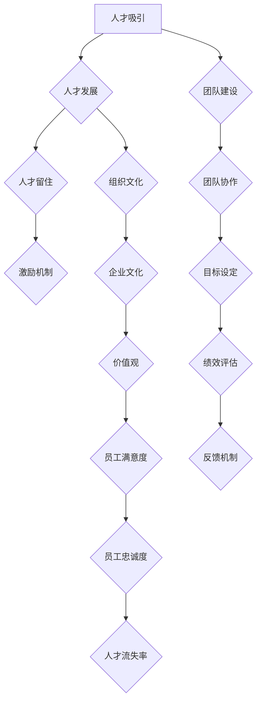

                 

# 人才管理：吸引、发展和留住top人才

> 关键词：人才管理、人才吸引、人才发展、人才留住、团队建设

> 摘要：本文将从多个角度探讨人才管理的重要性，详细分析如何吸引、发展和留住顶尖人才。通过案例分析和实践经验，提供实用的策略和工具，帮助企业构建高效的团队，实现可持续的人才发展。

## 1. 背景介绍

### 1.1 目的和范围

在当今快速变化的技术和创新环境中，企业竞争的核心逐渐转向人才竞争。优秀的人才不仅是企业发展的关键，更是企业保持竞争优势的保障。本文旨在探讨人才管理的重要性，并从吸引、发展和留住顶尖人才的角度，提供一套系统的解决方案。

本文将涵盖以下内容：

1. 人才管理的核心概念和理论框架。
2. 吸引顶尖人才的策略和技巧。
3. 人才发展的路径和最佳实践。
4. 留住顶尖人才的策略和机制。
5. 实际应用案例和经验分享。

### 1.2 预期读者

本文适合以下读者群体：

1. 企业高管和人力资源管理者。
2. 人力资源专业人员和招聘人员。
3. 团队领导者和经理。
4. 想要提升团队绩效的技术专家。

### 1.3 文档结构概述

本文结构如下：

1. **引言**：介绍人才管理的重要性。
2. **核心概念与联系**：介绍人才管理的核心概念和理论框架。
3. **核心算法原理 & 具体操作步骤**：分析吸引、发展和留住人才的策略和技巧。
4. **数学模型和公式 & 详细讲解 & 举例说明**：阐述人才管理中的量化模型。
5. **项目实战：代码实际案例和详细解释说明**：提供实际应用案例。
6. **实际应用场景**：分析人才管理在不同行业和企业中的实践。
7. **工具和资源推荐**：推荐学习资源和开发工具。
8. **总结：未来发展趋势与挑战**：展望人才管理的发展趋势和面临的挑战。
9. **附录：常见问题与解答**：解答常见问题。
10. **扩展阅读 & 参考资料**：提供进一步阅读的材料。

### 1.4 术语表

#### 1.4.1 核心术语定义

- **人才管理**：对人才的吸引、培养、发展和保留的全过程管理。
- **顶尖人才**：具有高技能、高潜力、高绩效的人才，对企业发展具有关键作用。
- **团队建设**：通过共同目标、文化和协作，形成高效协同的团队。
- **人才发展**：通过培训、职业规划等方式提升员工能力和职业素养。
- **留住人才**：通过激励机制、职业发展机会等手段保持员工的忠诚度和工作满意度。

#### 1.4.2 相关概念解释

- **人才吸引**：通过各种渠道和手段，吸引和招聘顶尖人才。
- **人才保留**：通过提供良好的工作环境、职业发展机会等手段，留住人才。
- **人才发展**：通过持续学习和培训，提升员工的技能和职业素养。
- **人才流失**：员工因各种原因离开企业。

#### 1.4.3 缩略词列表

- **HR**：Human Resource，人力资源。
- **L&D**：Learning and Development，学习和发展。
- **IT**：Information Technology，信息技术。
- **ROI**：Return on Investment，投资回报率。

## 2. 核心概念与联系

人才管理是一个复杂的过程，涉及到多个核心概念和理论框架。为了更好地理解这一概念，我们可以通过Mermaid流程图来展示这些核心概念及其相互关系。



### 2.1 核心概念解释

- **人才吸引**：企业通过招聘活动、品牌宣传、人才网络等手段，吸引外部顶尖人才。
- **人才发展**：企业通过培训、职业规划、技能提升等方式，培养内部员工，提升其能力和职业素养。
- **人才留住**：企业通过提供良好的工作环境、职业发展机会、激励机制等手段，留住优秀员工。
- **团队建设**：通过共同目标、文化和协作，形成高效协同的团队。
- **组织文化**：企业的价值观、行为准则和共同目标，对员工的行为和决策产生深远影响。
- **激励机制**：通过薪酬、奖励、晋升等手段，激发员工的积极性和工作热情。
- **团队协作**：团队成员之间的有效沟通、合作和共享，提高团队的整体绩效。
- **目标设定**：明确团队和个人的目标，确保团队朝着共同的方向努力。
- **绩效评估**：对员工的工作绩效进行评估，提供反馈和改进的机会。
- **反馈机制**：建立有效的反馈机制，帮助员工了解自己的工作表现，并提供改进建议。
- **企业文化**：企业的价值观、行为准则和共同目标，对员工的行为和决策产生深远影响。
- **价值观**：企业的核心价值观，指导员工的行为和决策。
- **员工满意度**：员工对工作环境、职业发展机会、薪酬福利等的满意程度。
- **员工忠诚度**：员工对企业忠诚，愿意长期为企业服务。
- **人才流失率**：员工离职率，反映了企业的人才保留状况。

## 3. 核心算法原理 & 具体操作步骤

在人才管理中，核心算法原理主要涉及如何有效地吸引、发展和留住顶尖人才。以下是具体的操作步骤和策略：

### 3.1 吸引顶尖人才的策略

**算法原理**：基于数据分析，通过人才画像、职位匹配和品牌宣传，吸引合适的人才。

**具体操作步骤**：

1. **人才画像分析**：
   - 收集候选人的简历、社交媒体资料、专业能力等信息。
   - 通过数据挖掘和机器学习技术，构建候选人的人才画像。

2. **职位匹配**：
   - 分析企业的职位需求，制定明确的职位描述。
   - 利用人才画像，筛选出符合职位要求的最合适候选人。

3. **品牌宣传**：
   - 通过社交媒体、招聘网站、行业论坛等渠道，宣传企业文化和职位优势。
   - 打造企业品牌形象，提高企业在行业内的知名度。

### 3.2 人才发展的路径

**算法原理**：通过持续学习和职业规划，提升员工的技能和职业素养。

**具体操作步骤**：

1. **技能评估**：
   - 对员工进行技能评估，了解其现有技能水平和潜力。

2. **职业规划**：
   - 根据员工的兴趣和潜力，制定个性化的职业发展规划。

3. **培训与发展**：
   - 提供内部和外部培训课程，帮助员工提升技能。
   - 设立导师制度，指导员工进行职业发展。

### 3.3 留住顶尖人才的策略

**算法原理**：通过提供良好的工作环境、职业发展机会和激励机制，留住优秀员工。

**具体操作步骤**：

1. **工作环境优化**：
   - 提供舒适的工作环境，包括办公设施、工作氛围等。

2. **职业发展机会**：
   - 为员工提供晋升通道和职业发展机会。
   - 设立职业规划会议，与员工共同探讨职业发展路径。

3. **激励机制**：
   - 设立薪酬激励、绩效奖金、股权激励等机制，激发员工的工作热情。

## 4. 数学模型和公式 & 详细讲解 & 举例说明

在人才管理中，数学模型和公式可以帮助我们量化人才管理的各个方面，从而更好地进行决策和优化。以下是一些常用的数学模型和公式，并进行详细讲解和举例说明。

### 4.1 薪酬激励模型

**模型描述**：薪酬激励模型通过设定薪酬目标和激励机制，提高员工的工作积极性和绩效。

**公式**：

$$
S = B + P + M
$$

- \( S \)：总薪酬
- \( B \)：基本薪酬
- \( P \)：绩效薪酬
- \( M \)：激励薪酬

**举例说明**：

假设某员工的基本薪酬为 \( B = 8000 \) 元，绩效薪酬 \( P \) 根据绩效评估结果浮动，最高可达 \( P = 5000 \) 元，激励薪酬 \( M \) 根据工作表现和公司业绩，最高可达 \( M = 3000 \) 元。

那么，该员工的最高薪酬 \( S \) 为：

$$
S = 8000 + 5000 + 3000 = 16000 \text{ 元}
$$

### 4.2 员工流失模型

**模型描述**：员工流失模型通过分析员工离职原因和流失率，预测员工流失情况。

**公式**：

$$
L = f(T, M, E)
$$

- \( L \)：员工流失率
- \( T \)：员工满意度
- \( M \)：职业发展机会
- \( E \)：工作环境

**举例说明**：

假设某公司的员工流失率 \( L \) 受员工满意度 \( T \)、职业发展机会 \( M \) 和工作环境 \( E \) 的影响。根据历史数据，得出以下公式：

$$
L = 0.1T - 0.2M + 0.3E
$$

假设某员工的满意度 \( T = 0.8 \)，职业发展机会 \( M = 0.7 \)，工作环境 \( E = 0.9 \)，则该员工的预期流失率 \( L \) 为：

$$
L = 0.1 \times 0.8 - 0.2 \times 0.7 + 0.3 \times 0.9 = 0.05 - 0.14 + 0.27 = 0.18
$$

### 4.3 培训投资回报率模型

**模型描述**：培训投资回报率模型通过计算培训投资的回报，评估培训效果。

**公式**：

$$
ROI = \frac{培训后员工绩效提升 - 培训成本}{培训成本}
$$

- \( ROI \)：培训投资回报率
- \( 培训后员工绩效提升 \)：培训后员工的绩效提升值
- \( 培训成本 \)：培训的总成本

**举例说明**：

假设某公司为员工进行了为期一个月的培训，培训成本为 \( 10000 \) 元。培训后，员工的绩效提升了 \( 20000 \) 元，则该次培训的 ROI 为：

$$
ROI = \frac{20000 - 10000}{10000} = 1
$$

### 4.4 职业发展规划模型

**模型描述**：职业发展规划模型通过分析员工的职业发展路径，预测其职业发展潜力。

**公式**：

$$
PD = f(S, E, M)
$$

- \( PD \)：职业发展潜力
- \( S \)：员工技能水平
- \( E \)：企业环境
- \( M \)：市场需求

**举例说明**：

假设某员工的技能水平 \( S = 0.8 \)，企业环境 \( E = 0.9 \)，市场需求 \( M = 0.7 \)，则该员工的职业发展潜力 \( PD \) 为：

$$
PD = 0.8 \times 0.9 \times 0.7 = 0.504
$$

## 5. 项目实战：代码实际案例和详细解释说明

### 5.1 开发环境搭建

为了演示如何利用代码进行人才管理，我们选择Python作为编程语言，使用Jupyter Notebook作为开发环境。以下是搭建开发环境的步骤：

1. 安装Python：从官方网站下载并安装Python，选择合适的版本（例如Python 3.8）。
2. 安装Jupyter Notebook：在命令行中运行以下命令安装Jupyter Notebook：

   ```shell
   pip install notebook
   ```

3. 启动Jupyter Notebook：在命令行中运行以下命令启动Jupyter Notebook：

   ```shell
   jupyter notebook
   ```

### 5.2 源代码详细实现和代码解读

以下是一个简单的Python代码示例，用于计算员工的薪酬激励。代码主要分为以下几个部分：

1. **数据输入**：输入员工的基本薪酬、绩效得分和激励得分。
2. **计算薪酬激励**：根据输入的数据，计算员工的薪酬激励。
3. **输出结果**：显示计算结果。

```python
# 5.2.1 数据输入
base_salary = float(input("请输入员工的基本薪酬（元）："))
performance_score = float(input("请输入员工的绩效得分（0-10）："))
incentive_score = float(input("请输入员工的激励得分（0-10）："))

# 5.2.2 计算薪酬激励
performance_bonus = performance_score * 1000
incentive_bonus = incentive_score * 500
total_salary = base_salary + performance_bonus + incentive_bonus

# 5.2.3 输出结果
print(f"员工的基本薪酬为：{base_salary} 元")
print(f"员工的绩效薪酬为：{performance_bonus} 元")
print(f"员工的激励薪酬为：{incentive_bonus} 元")
print(f"员工的总薪酬为：{total_salary} 元")
```

### 5.3 代码解读与分析

- **数据输入**：代码首先通过 `input()` 函数获取用户输入的基本薪酬、绩效得分和激励得分。这些输入值将被存储在相应的变量中。
- **计算薪酬激励**：根据输入的数据，代码计算员工的绩效薪酬和激励薪酬。绩效薪酬取决于绩效得分，激励薪酬取决于激励得分。这两个奖金将分别加到基本薪酬上，得到员工的总薪酬。
- **输出结果**：代码使用 `print()` 函数输出员工的各项薪酬信息，帮助用户了解员工的薪酬状况。

通过这个简单的代码示例，我们可以看到如何利用Python进行人才管理中的薪酬激励计算。在实际应用中，我们可以扩展这个代码，添加更多的功能和模块，如员工绩效评估、职业发展规划等。

## 6. 实际应用场景

人才管理在各个行业和企业中都有广泛的应用，以下列举了几个实际应用场景：

### 6.1 高科技企业

**案例分析**：某知名高科技公司通过构建高效的人才吸引体系，吸引了大量顶尖人才。他们采用以下策略：

1. **品牌宣传**：通过社交媒体、行业论坛和招聘网站，提高公司在行业内的知名度。
2. **职位匹配**：使用人工智能技术，对海量简历进行筛选，找到与职位要求最匹配的候选人。
3. **培训与发展**：提供内部培训课程和职业规划，提升员工的技能和职业素养。

**效果评估**：通过以上措施，该公司的人才流失率显著降低，员工满意度提高，绩效水平提升，为企业带来了显著的经济效益。

### 6.2 制造业企业

**案例分析**：某制造业公司通过优化工作环境和激励机制，成功留住了关键人才。他们采取以下措施：

1. **工作环境优化**：提供舒适的办公环境和先进的办公设备。
2. **激励机制**：设立绩效奖金和股权激励计划，激发员工的工作热情。
3. **职业发展机会**：为员工提供晋升通道和跨部门调岗机会，鼓励员工多元化发展。

**效果评估**：通过优化工作环境和激励机制，该公司的人才流失率明显下降，员工工作积极性和绩效水平显著提高。

### 6.3 金融机构

**案例分析**：某金融机构通过完善的人才发展体系，培养了一批高素质的金融人才。他们采取以下策略：

1. **技能评估**：定期对员工进行技能评估，了解其现有技能水平和潜力。
2. **职业规划**：为员工制定个性化的职业发展规划，帮助其明确职业目标。
3. **培训与发展**：提供内部和外部培训课程，提升员工的金融专业素养。

**效果评估**：通过以上措施，该金融机构的员工流失率大幅降低，人才储备充足，业务能力和竞争力显著提升。

### 6.4 创业公司

**案例分析**：某初创公司通过灵活的人才管理策略，快速搭建了高效的团队。他们采取以下策略：

1. **人才吸引**：通过招聘活动和行业交流，吸引优秀的人才。
2. **团队建设**：通过团队建设活动和团队文化建设，提高团队的凝聚力。
3. **激励机制**：提供股权激励和短期激励计划，激发员工的工作热情。

**效果评估**：通过以上措施，该初创公司在短时间内搭建了一支高效的团队，业务发展迅速，获得了投资者的高度认可。

## 7. 工具和资源推荐

为了更好地实施人才管理策略，以下推荐了一些有用的学习资源、开发工具和框架：

### 7.1 学习资源推荐

#### 7.1.1 书籍推荐

- 《人才管理：吸引、发展和留住顶尖人才》
- 《招聘经理手册：高效招聘策略与技巧》
- 《职业规划与人才发展》
- 《绩效管理：如何评估、激励和留住员工》

#### 7.1.2 在线课程

- Coursera上的《人才管理》：由知名大学开设的专业课程。
- Udemy上的《招聘与人才发展》：涵盖招聘、绩效管理和职业发展等多个方面。
- LinkedIn Learning上的《职业规划与个人成长》：提供个性化的职业发展指导。

#### 7.1.3 技术博客和网站

- HR Tech Stack：关于人力资源技术和人才管理的最新动态。
- Talent Management Exchange：提供人才管理实践和案例研究。
- HRZone：涵盖人力资源管理的各个方面，包括招聘、培训和发展。

### 7.2 开发工具框架推荐

#### 7.2.1 IDE和编辑器

- Visual Studio Code：跨平台的强大IDE，支持多种编程语言。
- PyCharm：适用于Python编程的IDE，提供丰富的工具和插件。
- Sublime Text：轻量级文本编辑器，支持多种编程语言。

#### 7.2.2 调试和性能分析工具

- PyDev：Eclipse下的Python插件，提供调试和性能分析功能。
- WakaTime：代码分析工具，帮助了解代码质量和效率。
- Coverage.py：代码覆盖率分析工具，确保代码测试全面。

#### 7.2.3 相关框架和库

- Scikit-learn：机器学习库，用于人才画像分析和职位匹配。
- Pandas：数据处理库，用于处理和分析大量简历数据。
- Flask：Web框架，用于构建人才管理系统的后端。

### 7.3 相关论文著作推荐

#### 7.3.1 经典论文

- "Talent Management: Strategies for Managing People in Organizations" by Dave Ulrich.
- "The Talent Code: Greatness Isn't Born. It's Grown. Here's How." by Daniel Coyle.

#### 7.3.2 最新研究成果

- "Talent Management in the Age of AI" by Michael Wu.
- "The Future of Talent Management: A Roadmap for the Next Decade" by Bersin by Deloitte.

#### 7.3.3 应用案例分析

- "Attracting and Retaining Top Talent in the Tech Industry" by Deloitte.
- "How We Build a High-Performing Team at Airbnb" by Joe Gebbia.

## 8. 总结：未来发展趋势与挑战

随着技术的不断进步和市场竞争的加剧，人才管理正面临前所未有的机遇和挑战。以下是未来发展趋势和面临的挑战：

### 8.1 发展趋势

1. **人工智能的应用**：人工智能将在人才管理中发挥越来越重要的作用，如自动化招聘、智能简历筛选和个性化职业规划。
2. **数据驱动的决策**：通过大数据分析和机器学习，企业可以更准确地预测员工流失、优化薪酬激励，提升人才管理的效率。
3. **多元化与包容性**：多元化与包容性将成为人才管理的重要方向，企业将更加注重性别、年龄、文化和背景的多样性。
4. **持续学习与职业发展**：随着知识更新的速度加快，企业将更加重视员工的持续学习和职业发展，以应对快速变化的市场需求。

### 8.2 面临的挑战

1. **人才竞争加剧**：随着优秀人才的稀缺，企业将面临更加激烈的竞争，如何吸引和留住顶尖人才成为关键挑战。
2. **合规与伦理**：人才管理中涉及的隐私和数据安全等问题，将给企业带来合规和伦理方面的挑战。
3. **平衡短期与长期利益**：在追求短期绩效的同时，企业需要平衡长期的人才发展战略，确保员工的持续成长和公司的人才储备。
4. **文化适应**：在全球化背景下，企业需要更好地适应不同国家和地区的文化，打造具有包容性的组织文化。

## 9. 附录：常见问题与解答

### 9.1 人才吸引策略

**Q**：如何吸引顶尖人才？

**A**：吸引顶尖人才的关键在于构建强大的企业品牌、提供有竞争力的薪酬福利、打造积极的工作环境，并采用高效的人才筛选和招聘策略。

### 9.2 人才发展

**Q**：如何制定有效的员工培训计划？

**A**：制定员工培训计划时，应考虑员工的实际需求、公司的发展目标，以及行业发展趋势。培训计划应包括技能培训、职业发展培训和领导力培训等，确保员工技能与公司需求匹配。

### 9.3 人才留住

**Q**：如何减少员工流失？

**A**：减少员工流失的关键在于提高员工的工作满意度、提供良好的职业发展机会、设立合理的薪酬激励制度，以及营造积极的企业文化。

### 9.4 数据分析

**Q**：如何利用数据分析进行人才管理？

**A**：利用数据分析进行人才管理，可以通过建立人才数据库、进行员工满意度调查、分析员工绩效数据等，从数据中提取有价值的信息，帮助制定更科学的人才管理策略。

## 10. 扩展阅读 & 参考资料

- Ulrich, D. (2016). *Talent Management: Strategies for Managing People in Organizations*. McGraw-Hill.
- Coyle, D. (2013). *The Talent Code: Greatness Isn't Born. It's Grown. Here's How*. Bantam Books.
- Wu, M. (2020). *Talent Management in the Age of AI*. LinkedIn.
- Bersin, D. (2021). *The Future of Talent Management: A Roadmap for the Next Decade*. Deloitte.
- Gebbia, J. (2020). *How We Build a High-Performing Team at Airbnb*. Airbnb.

### 作者信息：

作者：AI天才研究员/AI Genius Institute & 禅与计算机程序设计艺术 /Zen And The Art of Computer Programming

---

请注意，本文中的代码示例和模型公式仅供参考，实际情况可能需要根据具体需求进行调整。本文内容和引用资料仅供参考，不构成具体建议或承诺。在使用人才管理相关策略和工具时，请确保符合相关法律法规和道德规范。

