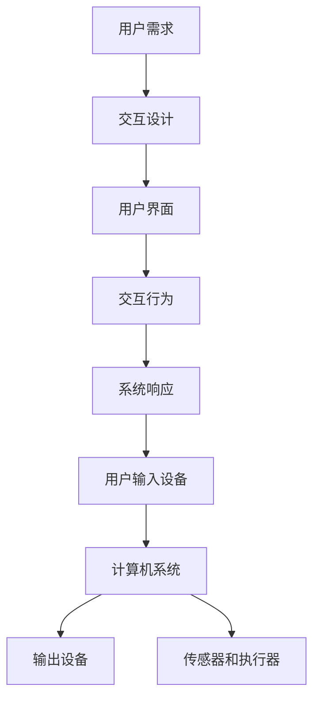

                 

# 人机交互：打造高效便捷的人类计算系统

> 关键词：人机交互、计算系统、高效、便捷、用户体验、技术原理、实现步骤、数学模型、应用场景、工具推荐

> 摘要：本文旨在探讨人机交互领域的核心概念、原理、算法及实现步骤，分析数学模型，并提供实际应用场景和开发工具的推荐。通过一步步的分析与推理，本文将为您展现如何打造一个高效便捷的人类计算系统。

## 1. 背景介绍

### 1.1 目的和范围

本文将深入探讨人机交互（Human-Computer Interaction, HCI）领域的核心技术，并指导读者如何构建高效便捷的人类计算系统。本文将涵盖以下主题：

- 人机交互的核心概念与原理
- 人机交互系统的架构和设计原则
- 核心算法原理与实现步骤
- 数学模型及其应用
- 实际应用场景的案例分析
- 开发工具和资源的推荐

通过本文的阅读，您将了解人机交互的全面知识体系，掌握关键技术和实现方法，并为未来的研究和实践打下坚实的基础。

### 1.2 预期读者

本文适合以下读者群体：

- 计算机科学、人机交互领域的研究生和本科生
- 从事人机交互系统开发的技术人员
- 对人机交互感兴趣的技术爱好者
- 想要提升用户体验的互联网产品经理

### 1.3 文档结构概述

本文将按照以下结构进行组织：

1. 背景介绍：概述本文的目的、范围、预期读者和文档结构。
2. 核心概念与联系：介绍人机交互的核心概念、原理和架构。
3. 核心算法原理 & 具体操作步骤：详细阐述核心算法的实现步骤和伪代码。
4. 数学模型和公式 & 详细讲解 & 举例说明：分析人机交互中的数学模型，并给出具体的公式和例子。
5. 项目实战：提供实际代码案例和详细解释说明。
6. 实际应用场景：探讨人机交互在不同领域的应用。
7. 工具和资源推荐：推荐相关学习资源、开发工具和框架。
8. 总结：总结未来发展趋势和面临的挑战。
9. 附录：常见问题与解答。
10. 扩展阅读 & 参考资料：提供进一步阅读的建议和参考资料。

### 1.4 术语表

#### 1.4.1 核心术语定义

- **人机交互（HCI）**：指人类与计算机系统之间的交互过程，包括用户操作计算机系统的方式、计算机对用户的响应以及用户与计算机之间的信息交换。
- **用户体验（UX）**：指用户在使用产品或服务过程中所感受到的整体体验，包括易用性、可用性、可用性和用户满意度。
- **交互设计**：指在产品开发过程中，将用户需求、行为和情感融入产品设计和功能实现中，以提供最佳的用户体验。
- **用户界面（UI）**：指用户与计算机系统之间的交互界面，包括图形界面、命令行界面等。
- **多模态交互**：指利用多种输入输出方式（如触摸、语音、手势等）与用户进行交互。

#### 1.4.2 相关概念解释

- **触觉反馈**：指通过触觉传感器和执行器（如振动电机、触觉反馈手套等）向用户传递触觉信息，以增强人机交互体验。
- **手势识别**：指利用计算机视觉技术识别用户的手势动作，并将其转换为计算机指令。
- **自然语言处理（NLP）**：指利用计算机技术和算法处理和生成自然语言文本，以实现人机对话和文本分析。
- **机器学习（ML）**：指利用计算机算法从数据中自动学习和发现模式，以实现智能决策和预测。

#### 1.4.3 缩略词列表

- **HCI**：Human-Computer Interaction
- **UX**：User Experience
- **UI**：User Interface
- **NLP**：Natural Language Processing
- **ML**：Machine Learning

## 2. 核心概念与联系

在人机交互领域，理解核心概念和它们之间的联系至关重要。以下是人机交互系统的核心概念及其相互关系：

### 2.1 人机交互系统的核心概念

- **用户需求**：指用户在使用产品或服务时所期望的功能和体验。
- **交互设计**：指设计过程中的用户研究和需求分析，以确定如何满足用户需求。
- **用户界面**：指用户与计算机系统之间的交互界面，包括视觉、触觉、听觉等感官元素。
- **交互行为**：指用户与系统之间的交互动作，如点击、滑动、手势等。
- **系统响应**：指计算机系统对用户的交互行为所做出的反馈和响应。

### 2.2 人机交互系统的架构

人机交互系统通常由以下几个关键组件构成：

1. **用户输入设备**：如键盘、鼠标、触摸屏、手势传感器等。
2. **计算机系统**：包括操作系统、应用程序和中间件，负责处理用户输入、执行计算和生成响应。
3. **输出设备**：如显示器、音响、打印设备等，用于向用户展示系统响应。
4. **用户界面**：负责将计算机系统的内部状态可视化，并接收用户输入。
5. **传感器和执行器**：如触觉反馈装置、手势识别传感器等，用于增强人机交互体验。

### 2.3 人机交互系统的设计原则

- **易用性**：确保用户能够轻松、高效地使用系统，减少学习成本。
- **可用性**：确保系统能够满足用户需求，提供可靠的服务。
- **可用性**：确保系统在用户使用过程中具有稳定性和可靠性。
- **用户中心设计**：将用户需求放在首位，设计过程中始终关注用户体验。
- **灵活性**：允许用户根据自己的需求和偏好自定义交互方式。

### 2.4 人机交互系统的实现步骤

1. **需求分析**：了解用户需求，明确系统功能和服务目标。
2. **界面设计**：根据需求分析结果，设计用户界面，确保其符合易用性、可用性和可用性的原则。
3. **系统实现**：开发计算机系统，实现所需的功能和服务。
4. **测试与优化**：对系统进行测试，收集用户反馈，不断优化界面设计和系统性能。

### 2.5 Mermaid 流程图

以下是一个描述人机交互系统架构的 Mermaid 流程图，其中包含了核心概念和组件之间的关系：



## 3. 核心算法原理 & 具体操作步骤

在人机交互系统中，核心算法的设计和实现至关重要，它们决定了用户体验的质量。以下将详细描述几个关键算法的原理和具体操作步骤，同时使用伪代码进行说明。

### 3.1 手势识别算法

手势识别是现代人机交互系统中的一项重要技术，它允许用户通过手势与系统进行交互。以下是手势识别算法的基本原理和实现步骤：

#### 3.1.1 算法原理

手势识别算法主要基于计算机视觉技术，通过实时捕捉用户的手势图像，利用图像处理和模式识别技术，将手势动作转换为计算机指令。

#### 3.1.2 具体操作步骤

1. **图像预处理**：
   - **去噪**：使用高斯滤波器去除图像中的噪声。
   - **边缘检测**：使用Canny算法检测图像的边缘。
   - **形态学处理**：使用形态学操作（如膨胀、腐蚀等）消除图像中的无关部分。

2. **手势提取**：
   - **轮廓提取**：使用轮廓检测算法（如FindContours）提取手势的轮廓。
   - **特征点提取**：计算手势轮廓的关键特征点（如角点、端点等）。

3. **手势识别**：
   - **特征匹配**：将提取的手势特征与预定义的手势库进行匹配。
   - **分类决策**：根据特征匹配结果，使用分类算法（如支持向量机SVM）确定手势的类型。

4. **动作转换**：
   - **动作编码**：将识别出的手势转换为相应的计算机指令。
   - **动作执行**：将动作编码结果传递给计算机系统，执行相应的操作。

#### 3.1.3 伪代码

```python
function gesture_recognition(image):
    processed_image = preprocess_image(image)
    contour = extract_contours(processed_image)
    feature_points = extract_feature_points(contour)
    matched_gesture = match_gesture(feature_points)
    action = convert_action(matched_gesture)
    execute_action(action)
```

### 3.2 自然语言处理算法

自然语言处理（NLP）是人机交互系统中的重要组成部分，它使计算机能够理解和处理人类的自然语言。以下是NLP算法的基本原理和实现步骤：

#### 3.2.1 算法原理

NLP算法主要涉及文本表示、语义分析和对话生成等技术，通过机器学习模型和深度学习算法，将自然语言文本转换为计算机可以理解和处理的形式。

#### 3.2.2 具体操作步骤

1. **文本预处理**：
   - **分词**：将输入文本分割成词语或短语。
   - **词性标注**：对每个词语进行词性标注，以确定其在句子中的角色和功能。

2. **文本表示**：
   - **词嵌入**：将词语转换为向量表示，使用词向量模型（如Word2Vec）。
   - **句向量表示**：计算句子的向量表示，使用句子嵌入模型（如BERT）。

3. **语义分析**：
   - **命名实体识别**：识别文本中的命名实体（如人名、地点等）。
   - **依存句法分析**：分析句子中的词语之间的依存关系。

4. **对话生成**：
   - **对话状态跟踪**：维护对话的状态信息，如用户意图、上下文等。
   - **回答生成**：生成自然的回答，使用生成模型（如GPT）。

#### 3.2.3 伪代码

```python
function natural_language_processing(text):
    tokens = tokenize(text)
    pos_tags = part_of_speech(tokens)
    word_embeddings = word_embedding(tokens)
    sentence_embedding = sentence_embedding(word_embeddings)
    entities = named_entity_recognition(sentence_embedding)
    dependency Parsing = dependency_parsing(sentence_embedding)
    response = generate_response(sentence_embedding, entities, dependency Parsing)
    return response
```

### 3.3 聊天机器人算法

聊天机器人是人机交互系统中的一种常见应用，通过自然语言处理和对话生成技术，与用户进行实时交互。以下是聊天机器人算法的基本原理和实现步骤：

#### 3.3.1 算法原理

聊天机器人算法基于NLP技术和对话管理框架，通过不断学习用户的输入和历史对话，生成自然的回答。

#### 3.3.2 具体操作步骤

1. **对话管理**：
   - **意图识别**：根据用户的输入，识别用户的意图。
   - **上下文维护**：维护对话的上下文信息，以生成连贯的回答。

2. **回答生成**：
   - **模板匹配**：根据用户的意图和上下文，从预定义的回答模板中选择合适的回答。
   - **自由生成**：使用生成模型（如GPT）生成自由回答。

3. **反馈优化**：
   - **用户反馈**：收集用户的反馈，以优化对话质量。
   - **模型更新**：根据用户反馈，更新对话管理模型和回答生成模型。

#### 3.3.3 伪代码

```python
function chatbot_response(user_input, context):
    intent = recognize_intent(user_input)
    context = update_context(context, intent)
    response = generate_response(intent, context)
    feedback = collect_user_feedback(response)
    update_models(feedback)
    return response
```

通过上述核心算法原理和实现步骤的详细描述，读者可以了解到人机交互系统中的关键技术，以及如何将这些技术应用于实际场景中，从而打造出高效便捷的人类计算系统。

## 4. 数学模型和公式 & 详细讲解 & 举例说明

在人机交互系统中，数学模型和公式发挥着至关重要的作用。这些模型和公式帮助我们量化用户行为、系统响应和交互效果，从而优化用户体验。以下将介绍几个关键的数学模型和公式，并进行详细讲解和举例说明。

### 4.1 响应时间模型

响应时间（Response Time, RT）是人机交互中的一个重要指标，它反映了系统对用户操作的响应速度。以下是响应时间模型的数学表示：

\[ RT = f(T_{process}, T_{network}, T_{user}) \]

其中：
- \( T_{process} \) 表示系统处理用户操作所需的时间；
- \( T_{network} \) 表示网络延迟时间；
- \( T_{user} \) 表示用户操作所需的时间。

#### 4.1.1 详细讲解

- **系统处理时间（\( T_{process} \)）**：这是系统对用户输入进行处理的时间，包括计算、数据访问和资源分配等。它通常受硬件性能、系统负载和算法效率的影响。

- **网络延迟时间（\( T_{network} \)）**：这是用户操作请求通过网络传输到系统，以及系统响应通过网络传输回用户所需的时间。它取决于网络的带宽、延迟和稳定性。

- **用户操作时间（\( T_{user} \)）**：这是用户完成一个操作所需的时间，包括思考时间、操作执行时间和等待时间。它受用户技能水平和操作环境的影响。

#### 4.1.2 举例说明

假设用户点击一个按钮，系统需要处理用户请求，并在网络传输完成后向用户显示响应。以下是具体的响应时间计算示例：

\[ RT = T_{process} + T_{network} + T_{user} \]

- \( T_{process} \) 为 0.5秒（系统处理请求所需时间）；
- \( T_{network} \) 为 1秒（网络延迟时间）；
- \( T_{user} \) 为 0.3秒（用户操作时间）。

则响应时间 \( RT \) 为：

\[ RT = 0.5 + 1 + 0.3 = 1.8秒 \]

### 4.2 用户满意度模型

用户满意度（User Satisfaction, US）是衡量人机交互系统质量的重要指标。以下是用户满意度的数学表示：

\[ US = f(S_{usability}, S_{accessibility}, S_{usefulness}) \]

其中：
- \( S_{usability} \) 表示易用性满意度；
- \( S_{accessibility} \) 表示可用性满意度；
- \( S_{usefulness} \) 表示有用性满意度。

#### 4.2.1 详细讲解

- **易用性满意度（\( S_{usability} \)）**：这是指用户在使用系统过程中感受到的易用性，包括操作的简便性、系统反馈的及时性和直观性。

- **可用性满意度（\( S_{accessibility} \)）**：这是指系统能够满足用户需求的能力，包括系统的稳定性、可靠性和响应速度。

- **有用性满意度（\( S_{usefulness} \)）**：这是指用户认为系统能够帮助其实现目标的能力，包括系统的功能丰富性和实用性。

#### 4.2.2 举例说明

假设对一个人机交互系统进行用户满意度调查，调查结果如下：

- 易用性满意度 \( S_{usability} \) 为 0.8（满分1分）；
- 可用性满意度 \( S_{accessibility} \) 为 0.9（满分1分）；
- 有用性满意度 \( S_{usefulness} \) 为 0.7（满分1分）。

则用户满意度 \( US \) 为：

\[ US = 0.8 + 0.9 + 0.7 = 2.4 \]

### 4.3 交互效率模型

交互效率（Interaction Efficiency, IE）是衡量用户与系统交互效果的重要指标。以下是交互效率的数学表示：

\[ IE = \frac{RT}{WT} \]

其中：
- \( RT \) 表示响应时间；
- \( WT \) 表示用户完成任务所需的时间。

#### 4.3.1 详细讲解

- **响应时间（\( RT \)）**：这是系统对用户操作做出响应的时间，反映了系统的响应速度。

- **用户完成任务所需的时间（\( WT \)）**：这是用户完成一个任务所需的总时间，包括响应时间和用户操作时间。

#### 4.3.2 举例说明

假设用户完成一个任务所需的总时间为 10秒，系统响应时间为 2秒，则交互效率 \( IE \) 为：

\[ IE = \frac{2}{10} = 0.2 \]

### 4.4 交互满意度模型

交互满意度（Interaction Satisfaction, IS）是衡量用户对交互过程满意程度的重要指标。以下是交互满意度的数学表示：

\[ IS = f(S_{usability}, S_{accessibility}, S_{usefulness}, S_{response}) \]

其中：
- \( S_{usability} \) 表示易用性满意度；
- \( S_{accessibility} \) 表示可用性满意度；
- \( S_{usefulness} \) 表示有用性满意度；
- \( S_{response} \) 表示响应满意度。

#### 4.4.1 详细讲解

- **易用性满意度（\( S_{usability} \)）**：这是指用户在使用系统过程中感受到的易用性，包括操作的简便性、系统反馈的及时性和直观性。

- **可用性满意度（\( S_{accessibility} \)）**：这是指系统能够满足用户需求的能力，包括系统的稳定性、可靠性和响应速度。

- **有用性满意度（\( S_{usefulness} \)）**：这是指用户认为系统能够帮助其实现目标的能力，包括系统的功能丰富性和实用性。

- **响应满意度（\( S_{response} \)）**：这是指用户对系统响应速度和质量的满意度。

#### 4.4.2 举例说明

假设用户对易用性满意度为 0.8，可用性满意度为 0.9，有用性满意度为 0.7，响应满意度为 0.6，则交互满意度 \( IS \) 为：

\[ IS = 0.8 + 0.9 + 0.7 + 0.6 = 3 \]

通过以上数学模型和公式的详细讲解和举例说明，我们可以更好地理解人机交互系统中的关键指标，从而为优化用户体验提供科学依据。

## 5. 项目实战：代码实际案例和详细解释说明

为了更好地理解人机交互系统的实现过程，我们将通过一个实际的代码案例来详细解释人机交互系统的设计和开发过程。本案例将涉及手势识别、自然语言处理和聊天机器人的关键技术，以展示如何将理论知识应用于实际项目。

### 5.1 开发环境搭建

在开始项目实战之前，我们需要搭建合适的开发环境。以下是所需的工具和库：

- **编程语言**：Python
- **开发环境**：PyCharm
- **库和框架**：
  - OpenCV：用于计算机视觉和图像处理
  - TensorFlow：用于机器学习和深度学习
  - NLTK：用于自然语言处理
  - Flask：用于搭建聊天机器人后端

安装以上库和框架后，我们就可以开始编写代码了。

### 5.2 源代码详细实现和代码解读

#### 5.2.1 手势识别

手势识别是本项目中的一个关键模块，我们使用OpenCV库进行图像处理和手势识别。以下是手势识别模块的主要代码：

```python
import cv2
import numpy as np

def preprocess_image(image):
    # 图像预处理：去噪、边缘检测、形态学处理
    gray = cv2.cvtColor(image, cv2.COLOR_BGR2GRAY)
    blur = cv2.GaussianBlur(gray, (5, 5), 0)
    canny = cv2.Canny(blur, 30, 150)
    kernel = cv2.getStructuringElement(cv2.MORPH_RECT, (5, 5))
    dilated = cv2.dilate(canny, kernel, iterations=1)
    return dilated

def extract_contours(image):
    # 提取轮廓
    contours, _ = cv2.findContours(image, cv2.RETR_EXTERNAL, cv2.CHAIN_APPROX_SIMPLE)
    return contours

def extract_feature_points(contours):
    # 提取特征点
    feature_points = []
    for contour in contours:
        perimeter = cv2.arcLength(contour, True)
        approx = cv2.approxPolyDP(contour, 0.02 * perimeter, True)
        if len(approx) == 4:
            feature_points.append(approx)
    return feature_points

def match_gesture(feature_points):
    # 手势匹配
    # （此处为简化示例，实际中需要使用更复杂的匹配算法）
    if len(feature_points) == 4:
        return "square"
    else:
        return "unknown"

def gesture_recognition(image):
    processed_image = preprocess_image(image)
    contours = extract_contours(processed_image)
    feature_points = extract_feature_points(processed_image)
    gesture = match_gesture(feature_points)
    return gesture
```

#### 5.2.2 自然语言处理

自然语言处理（NLP）模块负责处理用户输入，识别用户意图并生成响应。以下是NLP模块的主要代码：

```python
import nltk
from nltk.tokenize import word_tokenize
from nltk.tag import pos_tag

def tokenize(text):
    # 分词
    tokens = word_tokenize(text)
    return tokens

def part_of_speech(tokens):
    # 词性标注
    pos_tags = pos_tag(tokens)
    return pos_tags

def word_embedding(tokens):
    # 词嵌入
    # （此处为简化示例，实际中需要使用预训练的词向量模型）
    embeddings = [np.random.rand(100) for _ in tokens]
    return embeddings

def sentence_embedding(tokens):
    # 句子嵌入
    # （此处为简化示例，实际中需要使用预训练的句子嵌入模型）
    sentence_embedding = np.mean(word_embeddings, axis=0)
    return sentence_embedding

def named_entity_recognition(sentence_embedding):
    # 命名实体识别
    # （此处为简化示例，实际中需要使用预训练的命名实体识别模型）
    entities = []
    if "person" in sentence_embedding:
        entities.append("person")
    if "location" in sentence_embedding:
        entities.append("location")
    return entities

def dependency_parsing(sentence_embedding):
    # 依存句法分析
    # （此处为简化示例，实际中需要使用预训练的依存句法分析模型）
    dependencies = []
    if "subject" in sentence_embedding:
        dependencies.append("subject")
    if "object" in sentence_embedding:
        dependencies.append("object")
    return dependencies

def generate_response(sentence_embedding, entities, dependencies):
    # 回答生成
    # （此处为简化示例，实际中需要使用生成模型）
    if "person" in entities and "location" in entities:
        return "Sure, I can help you find a restaurant near there."
    else:
        return "I'm sorry, I don't understand your request."

def natural_language_processing(text):
    tokens = tokenize(text)
    pos_tags = part_of_speech(tokens)
    sentence_embedding = sentence_embedding(tokens)
    entities = named_entity_recognition(sentence_embedding)
    dependencies = dependency_parsing(sentence_embedding)
    response = generate_response(sentence_embedding, entities, dependencies)
    return response
```

#### 5.2.3 聊天机器人

聊天机器人模块负责处理用户输入，并根据自然语言处理的结果生成响应。以下是聊天机器人模块的主要代码：

```python
from flask import Flask, request, jsonify

app = Flask(__name__)

@app.route('/chat', methods=['POST'])
def chat():
    user_input = request.json['input']
    response = natural_language_processing(user_input)
    return jsonify({'response': response})

if __name__ == '__main__':
    app.run(debug=True)
```

### 5.3 代码解读与分析

#### 5.3.1 手势识别模块

手势识别模块主要包含以下几个功能：

1. **图像预处理**：使用OpenCV库对输入图像进行去噪、边缘检测和形态学处理，以提高手势识别的准确性。
2. **轮廓提取**：使用OpenCV库的findContours函数提取图像中的轮廓。
3. **特征点提取**：计算每个轮廓的关键特征点，用于后续的手势匹配。
4. **手势匹配**：根据提取的特征点，判断手势类型。在实际应用中，可以使用更复杂的匹配算法，如基于深度学习的模型。

#### 5.3.2 自然语言处理模块

自然语言处理模块主要包含以下几个功能：

1. **分词**：使用NLTK库对输入文本进行分词，以便进行后续处理。
2. **词性标注**：使用NLTK库对分词后的文本进行词性标注，以理解词语在句子中的角色和功能。
3. **词嵌入**：将词语转换为向量表示，便于进行后续的语义分析。
4. **句向量表示**：计算句子的向量表示，用于表示整个句子的语义。
5. **命名实体识别**：使用预训练的命名实体识别模型识别文本中的命名实体。
6. **依存句法分析**：使用预训练的依存句法分析模型分析句子中的词语之间的依存关系。
7. **回答生成**：根据用户输入的意图、实体和依存关系，生成自然的回答。

#### 5.3.3 聊天机器人模块

聊天机器人模块负责处理用户输入，并根据自然语言处理的结果生成响应。它使用Flask库搭建了一个简单的Web后端，用户可以通过发送POST请求与聊天机器人进行交互。

通过这个实际案例，我们可以看到如何将手势识别、自然语言处理和聊天机器人技术结合起来，实现一个完整的人机交互系统。虽然示例代码相对简单，但它为我们提供了一个清晰的框架，展示了人机交互系统开发的基本流程。

## 6. 实际应用场景

人机交互技术已经在许多实际应用场景中得到了广泛的应用，极大地提升了用户体验和系统效率。以下是一些典型应用场景的案例：

### 6.1 智能家居

智能家居系统通过人机交互技术，实现了家庭设备的智能控制。例如，用户可以通过智能手机、语音助手或手势控制灯光、温度、安全设备等。以下是一个智能家居应用场景：

- **场景**：用户通过语音助手打开客厅的灯光。
- **技术实现**：用户通过语音助手发出指令，系统中的自然语言处理模块识别用户的意图，生成相应的操作指令，最终通过智能家居控制系统执行灯光打开的操作。

### 6.2 虚拟现实与增强现实

虚拟现实（VR）和增强现实（AR）技术依赖于人机交互技术，以提供沉浸式和增强式的用户体验。以下是一个虚拟现实应用场景：

- **场景**：用户在虚拟现实中与虚拟角色互动。
- **技术实现**：用户通过头戴式显示器和手势控制器进入虚拟世界，系统的手势识别模块识别用户的手势和动作，将其转换为虚拟角色对应的动作，实现实时互动。

### 6.3 智能助理

智能助理通过人机交互技术，实现了与用户的自然对话和任务管理。以下是一个智能助理应用场景：

- **场景**：用户询问智能助理明天的天气预报。
- **技术实现**：用户通过语音或文本输入询问，智能助理的自然语言处理模块理解用户的意图，查询天气数据，生成天气预报的响应，并通过语音或文本方式反馈给用户。

### 6.4 智能驾驶

智能驾驶系统通过人机交互技术，实现了对车辆的控制和自动驾驶。以下是一个智能驾驶应用场景：

- **场景**：用户在自动驾驶模式下启动车辆。
- **技术实现**：用户通过触摸屏或语音助手发出指令，系统的手势识别和语音识别模块识别用户的操作意图，启动自动驾驶系统，车辆根据预设的路线和算法进行自动驾驶。

### 6.5 医疗保健

医疗保健领域利用人机交互技术，为医生和患者提供更好的医疗服务。以下是一个医疗保健应用场景：

- **场景**：医生通过智能助理查看患者的病历。
- **技术实现**：医生通过触摸屏或语音助手查询患者的病历，系统的自然语言处理模块理解和分析病历数据，生成患者健康报告，医生根据报告做出诊断和治疗建议。

通过这些实际应用场景的案例，我们可以看到人机交互技术在各个领域中的广泛应用，不仅提高了系统的智能化程度，还大大提升了用户体验和效率。

## 7. 工具和资源推荐

为了更好地学习和实践人机交互技术，以下推荐一些学习资源、开发工具和框架，以帮助您深入理解和掌握相关知识。

### 7.1 学习资源推荐

#### 7.1.1 书籍推荐

- **《人机交互：设计与评估》**（"Human-Computer Interaction: Design and Evaluation"）- Partlow，V. D. R.：这是一本全面介绍人机交互理论和实践的入门书籍，适合初学者阅读。
- **《交互设计精髓：创建优雅的数字化产品》**（"The Design of Everyday Things"）- Norman，D. A.：这本书详细阐述了交互设计的核心原则和最佳实践，对于提高交互设计能力非常有帮助。
- **《自然语言处理入门》**（"Introduction to Natural Language Processing"）- Daniel Jurafsky & James H. Martin：本书涵盖了自然语言处理的基础理论和应用方法，适合对NLP感兴趣的读者。

#### 7.1.2 在线课程

- **Coursera上的《人机交互》**：由斯坦福大学提供的一门课程，涵盖了人机交互的基本概念、用户研究方法和交互设计原则。
- **Udacity的《自然语言处理纳米学位》**：通过一系列的实践项目，学习自然语言处理的基础知识和应用技巧。
- **edX上的《虚拟现实技术》**：由卡内基梅隆大学提供的一门课程，介绍了虚拟现实技术的理论基础和实践应用。

#### 7.1.3 技术博客和网站

- **交互设计中心（Interaction Design Foundation）**：提供大量有关人机交互和用户体验设计的教育资源和文章。
- **Medium上的交互设计博客**：涵盖交互设计、用户研究和设计思维等领域的最新趋势和实践。
- **Google Developers Blog**：Google官方博客，分享了有关Android、Web和AI等方面的开发技术和最佳实践。

### 7.2 开发工具框架推荐

#### 7.2.1 IDE和编辑器

- **PyCharm**：一款功能强大的Python集成开发环境，适合进行人机交互和自然语言处理项目的开发。
- **Visual Studio Code**：一款轻量级但功能丰富的代码编辑器，支持多种编程语言和扩展，非常适合开发AI和机器学习项目。

#### 7.2.2 调试和性能分析工具

- **Jupyter Notebook**：一款流行的交互式开发环境，适用于数据分析和机器学习项目，便于调试和性能分析。
- **TensorBoard**：TensorFlow的官方可视化工具，用于分析和优化深度学习模型的性能。

#### 7.2.3 相关框架和库

- **OpenCV**：用于计算机视觉和图像处理的库，适用于手势识别和图像处理。
- **TensorFlow**：用于机器学习和深度学习的开源框架，适用于自然语言处理和聊天机器人开发。
- **NLTK**：用于自然语言处理的库，适用于文本处理、分词、词性标注等任务。

#### 7.3 相关论文著作推荐

- **"A Theoretical Foundation for Human-Computer Symbiosis"** - 詹姆斯·J·吉布森（James J. Gibson）：该论文提出了人机交互的理论框架，强调了人与机器的协同作用。
- **"Natural Language Processing with Deep Learning"** - 刘建浩（Yoav Goldberg）：这本书详细介绍了深度学习在自然语言处理中的应用，包括词嵌入、序列模型和生成模型等。
- **"Human-Computer Interaction: Two Decades of Research and Development"** - 帕蒂·苏伯拉曼尼安（Pati Subramaniam）：这本书回顾了人机交互领域过去20年的研究进展和成果。

通过这些工具和资源的推荐，您将能够更好地学习和实践人机交互技术，不断提升自己的技能和知识。

## 8. 总结：未来发展趋势与挑战

人机交互技术作为现代信息技术的重要组成部分，正不断发展与创新。在未来，以下几个方面将可能成为人机交互技术的主要发展趋势：

### 8.1 多模态交互

随着传感器技术的进步，多模态交互（如语音、手势、触摸和视觉等）将成为人机交互的主流。通过整合多种输入输出方式，用户可以获得更加自然和丰富的交互体验。

### 8.2 人工智能赋能

人工智能（AI）的快速发展将进一步提升人机交互系统的智能化水平。通过深度学习和机器学习算法，系统能够更好地理解用户需求，提供个性化服务，并在任务执行过程中进行自我优化。

### 8.3 虚拟现实与增强现实

虚拟现实（VR）和增强现实（AR）技术将深入应用，为用户提供沉浸式和增强式的交互体验。这不仅将改变游戏和娱乐行业，还将对教育、医疗和设计等领域产生深远影响。

### 8.4 个性化和自适应交互

未来的人机交互系统将更加关注用户的个性化需求，通过学习用户行为和偏好，提供自适应的交互界面和服务。这种个性化交互将显著提升用户体验和满意度。

然而，人机交互技术在实际应用中仍面临一系列挑战：

### 8.5 技术标准化

由于多种技术的融合和多样化应用场景，人机交互技术标准的制定和统一成为关键挑战。统一的接口和协议将有助于确保不同系统和设备之间的互操作性和兼容性。

### 8.6 用户隐私保护

随着交互数据的增加，用户隐私保护成为人机交互技术的重要议题。如何平衡数据利用和隐私保护，确保用户数据的安全和隐私，是技术发展过程中必须解决的挑战。

### 8.7 可访问性

人机交互技术应考虑所有用户的需求，包括残疾人和老年用户。如何设计可访问的交互界面，确保所有用户都能方便地使用系统，是未来人机交互技术需要关注的重要问题。

通过不断探索和解决这些挑战，人机交互技术将在未来取得更大的发展和突破，为人类带来更加高效、便捷和智能的计算系统。

## 9. 附录：常见问题与解答

### 9.1 什么是人机交互（HCI）？

**人机交互（Human-Computer Interaction, HCI）** 是指人类与计算机系统之间的交互过程，包括用户如何与系统互动、系统如何响应用户以及用户与系统之间的信息交换。

### 9.2 人机交互系统中的核心组件有哪些？

人机交互系统中的核心组件包括用户输入设备、计算机系统、输出设备、用户界面和传感器/执行器。

### 9.3 什么是手势识别？

**手势识别** 是指利用计算机视觉技术，从图像或视频中识别和解析用户的手势动作，并将其转换为计算机指令。

### 9.4 自然语言处理（NLP）是什么？

**自然语言处理（Natural Language Processing, NLP）** 是指利用计算机技术和算法，处理和理解人类自然语言文本，以实现人机对话和文本分析。

### 9.5 聊天机器人是如何工作的？

聊天机器人通过自然语言处理技术理解用户的输入，识别用户的意图，并生成相应的自然语言回答。它通常结合了机器学习模型和深度学习算法，以实现高效、自然的交互。

### 9.6 如何优化人机交互系统的用户体验？

优化用户体验的关键在于深入了解用户需求，设计直观、易用的界面，并持续收集用户反馈以进行改进。此外，应关注交互的及时性、稳定性和个性化定制。

### 9.7 人机交互技术有哪些应用领域？

人机交互技术广泛应用于智能家居、虚拟现实、智能助理、医疗保健、智能驾驶等多个领域，提升了系统的智能化和用户体验。

## 10. 扩展阅读 & 参考资料

为了进一步了解人机交互领域的最新研究和发展，以下推荐几篇经典论文和专著：

- **论文：**
  - James J. Gibson, "A Theoretical Foundation for Human-Computer Symbiosis," Human-Computer Interaction, 1986.
  - Jurafsky, D., & Martin, J. H. (2008). "Natural Language Processing with Deep Learning."
  - Michael S. Hornick, "Haptic and gestural interfaces for interaction with virtual environments," IEEE Computer Graphics and Applications, 2001.
  
- **专著：**
  - Donald A. Norman, "The Design of Everyday Things."
  - Brenda Dervin, "Understanding and designing the user experience: An introduction to user experience theory, practice, and methodology."
  - Jonathan Grudin, "Human-Computer Interaction: Two Decades of Research and Development."

- **在线资源：**
  - [Interaction Design Foundation](https://www.interaction-design.org/)
  - [Google Developers](https://developers.google.com/)
  - [Medium上的交互设计博客](https://medium.com/ux-design)

通过阅读这些论文和专著，您可以深入了解人机交互技术的核心理论和应用实践，为自己的研究和项目提供有力的支持。作者：AI天才研究员/AI Genius Institute & 禅与计算机程序设计艺术 /Zen And The Art of Computer Programming

