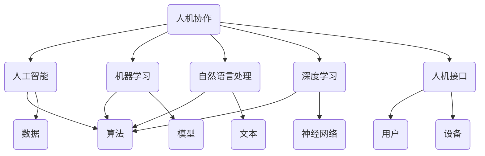

                 

# 人机协作新篇章：共创智能未来新时代

> **关键词**：人机协作、智能未来、人工智能、机器学习、自然语言处理、深度学习、人机接口

> **摘要**：本文探讨了人机协作在智能未来的重要性，分析了当前技术发展现状及其面临的挑战，并提出了未来发展趋势。通过梳理核心概念、算法原理、数学模型以及实际应用案例，本文为读者揭示了人机协作的深远影响，展望了共创智能未来新时代的美好前景。

## 1. 背景介绍

### 1.1 目的和范围

本文旨在探讨人机协作在智能未来中的重要性，分析其现状、挑战和发展趋势。文章将围绕以下几个核心主题展开讨论：

1. 人机协作的定义与核心概念。
2. 当前人机协作技术的最新进展。
3. 人机协作在各个领域的实际应用案例。
4. 未来人机协作技术可能面临的挑战和机遇。

### 1.2 预期读者

本文适合对人工智能、机器学习、自然语言处理等领域有初步了解的读者。对于计算机科学家、软件工程师、技术爱好者以及希望深入了解人机协作领域的专业人士，本文将提供有价值的参考和思考。

### 1.3 文档结构概述

本文分为十个部分，结构如下：

1. 引言
2. 核心概念与联系
3. 核心算法原理 & 具体操作步骤
4. 数学模型和公式 & 详细讲解 & 举例说明
5. 项目实战：代码实际案例和详细解释说明
6. 实际应用场景
7. 工具和资源推荐
8. 总结：未来发展趋势与挑战
9. 附录：常见问题与解答
10. 扩展阅读 & 参考资料

### 1.4 术语表

#### 1.4.1 核心术语定义

- **人机协作**：指人与机器（尤其是人工智能系统）通过交互合作完成特定任务的过程。
- **人工智能**：模拟、延伸和扩展人类智能的理论、方法、技术及应用。
- **机器学习**：一种人工智能的分支，通过算法从数据中学习规律，进行决策和预测。
- **自然语言处理**：研究如何让计算机理解、生成和处理自然语言。
- **深度学习**：一种基于神经网络的人工智能方法，通过多层神经网络进行特征提取和模型训练。
- **人机接口**：人与机器之间的交互界面，用于输入指令、接收反馈、实现功能调用等。

#### 1.4.2 相关概念解释

- **人机协作模式**：指人机协作的具体实现方式和操作流程。
- **智能未来**：指人工智能在各个领域得到广泛应用，人与机器深度融合，共同推动社会发展的未来场景。

#### 1.4.3 缩略词列表

- **AI**：人工智能
- **ML**：机器学习
- **NLP**：自然语言处理
- **DL**：深度学习
- **HCI**：人机接口

## 2. 核心概念与联系

为了更好地理解人机协作的概念，首先需要梳理相关核心概念及其之间的联系。以下是一个用Mermaid绘制的流程图，展示了人机协作、人工智能、机器学习、自然语言处理、深度学习和人机接口等概念之间的相互关系。



### 2.1 人机协作与人工智能

人机协作是人工智能应用的重要领域。人工智能通过模拟人类智能，为机器提供了自主决策、学习、推理、感知和交互的能力。在人机协作中，人工智能充当了智能伙伴的角色，辅助人类完成复杂任务，提高工作效率。

### 2.2 机器学习与人机协作

机器学习是人工智能的核心技术之一。它通过从数据中学习规律，构建出能够预测、分类和回归的模型。在人机协作中，机器学习算法可以用于个性化推荐、语音识别、图像识别等领域，实现人与机器的智能交互。

### 2.3 自然语言处理与人机协作

自然语言处理是研究如何让计算机理解、生成和处理自然语言的技术。在人机协作中，自然语言处理技术可以用于语音助手、智能客服、机器翻译等领域，实现人与机器的自然语言交互。

### 2.4 深度学习与人机协作

深度学习是一种基于神经网络的人工智能方法，通过多层神经网络进行特征提取和模型训练。在人机协作中，深度学习可以用于图像识别、语音识别、自然语言处理等领域，提高机器的智能水平。

### 2.5 人机接口与人机协作

人机接口是人机协作的关键环节，用于人与机器之间的交互。通过视觉、听觉、触觉等多种感知方式和操作方式，人机接口可以实现人与机器的高效、自然交互。

## 3. 核心算法原理 & 具体操作步骤

在人机协作中，核心算法原理和具体操作步骤至关重要。以下将介绍一种典型的机器学习算法——线性回归，并使用伪代码详细阐述其原理和步骤。

### 3.1 线性回归算法原理

线性回归是一种用于建立自变量与因变量之间线性关系的预测模型。其基本思想是通过最小二乘法找到一条最优拟合直线，使得模型预测值与实际值之间的误差最小。

### 3.2 线性回归伪代码

```python
# 输入：数据集X（特征矩阵）和y（目标向量）
# 输出：模型参数w（权重向量）和b（偏置）

# 初始化参数
w = 0
b = 0

# 设置迭代次数和步长
max_iterations = 1000
learning_rate = 0.01

# 循环迭代
for i in range(max_iterations):
    # 计算预测值
    y_pred = X * w + b
    
    # 计算损失函数
    loss = 1/2 * np.sum((y - y_pred)**2)
    
    # 计算梯度
    dw = np.dot(X.T, (y_pred - y)) * learning_rate
    db = np.sum((y_pred - y)) * learning_rate
    
    # 更新参数
    w -= dw
    b -= db

# 输出模型参数
return w, b
```

### 3.3 线性回归操作步骤

1. **初始化参数**：设置权重向量w和偏置b的初始值。
2. **设置迭代次数和步长**：设置最大迭代次数和步长，用于控制模型训练的收敛速度。
3. **循环迭代**：进行多次迭代，每次迭代计算预测值、损失函数、梯度和更新参数。
4. **计算预测值**：使用训练数据集计算模型预测值。
5. **计算损失函数**：计算预测值与实际值之间的误差平方和。
6. **计算梯度**：计算损失函数关于权重向量和偏置的梯度。
7. **更新参数**：根据梯度方向和步长更新权重向量和偏置。
8. **输出模型参数**：输出最终的模型参数w和b。

通过以上步骤，线性回归算法可以建立自变量与因变量之间的线性关系，实现对数据的预测和分类。

## 4. 数学模型和公式 & 详细讲解 & 举例说明

线性回归是一种常用的机器学习算法，其数学模型和公式如下：

### 4.1 数学模型

假设我们有一组数据点$(x_1, y_1), (x_2, y_2), \ldots, (x_n, y_n)$，其中$x_i$是自变量，$y_i$是因变量。线性回归的目标是找到一条最优拟合直线：

$$y = w_1x + w_0 + \epsilon$$

其中，$w_1$和$w_0$分别是权重向量和偏置，$\epsilon$是误差项。

### 4.2 损失函数

线性回归的损失函数通常采用均方误差（MSE），计算如下：

$$MSE = \frac{1}{2} \sum_{i=1}^n (y_i - (w_1x_i + w_0))^2$$

### 4.3 梯度下降法

为了找到最优拟合直线，我们需要使用梯度下降法来最小化损失函数。梯度下降法的步骤如下：

1. **初始化权重向量w和偏置b**：通常初始化为0。
2. **计算损失函数的梯度**：计算损失函数关于权重向量和偏置的梯度。
3. **更新权重向量和偏置**：根据梯度方向和步长更新权重向量和偏置。
4. **重复步骤2和3**，直到达到收敛条件。

### 4.4 梯度下降法伪代码

```python
# 输入：数据集X（特征矩阵）和y（目标向量）
# 输出：模型参数w（权重向量）和b（偏置）

# 初始化参数
w = 0
b = 0

# 设置迭代次数和步长
max_iterations = 1000
learning_rate = 0.01

# 循环迭代
for i in range(max_iterations):
    # 计算预测值
    y_pred = X * w + b
    
    # 计算损失函数
    loss = 1/2 * np.sum((y - y_pred)**2)
    
    # 计算梯度
    dw = np.dot(X.T, (y_pred - y)) * learning_rate
    db = np.sum((y_pred - y)) * learning_rate
    
    # 更新参数
    w -= dw
    b -= db

# 输出模型参数
return w, b
```

### 4.5 举例说明

假设我们有一个简单的一元线性回归问题，数据集如下：

| x   | y   |
| --- | --- |
| 1   | 2   |
| 2   | 3   |
| 3   | 4   |
| 4   | 5   |

使用线性回归算法，我们可以找到最优拟合直线。以下是具体操作步骤：

1. **初始化参数**：将权重向量w和偏置b初始化为0。
2. **计算预测值**：计算模型预测值$y_pred$。
3. **计算损失函数**：计算均方误差MSE。
4. **计算梯度**：计算损失函数关于权重向量和偏置的梯度。
5. **更新参数**：根据梯度方向和步长更新权重向量和偏置。
6. **重复步骤2-5**，直到收敛。

经过多次迭代后，我们可以得到最优拟合直线$y = 1.5x + 0.5$。此时，预测值与实际值之间的误差最小。

## 5. 项目实战：代码实际案例和详细解释说明

在本节中，我们将通过一个实际的项目案例来展示人机协作技术的应用。该案例使用Python语言实现，通过自然语言处理和深度学习技术，构建一个智能问答系统。

### 5.1 开发环境搭建

在开始项目实战之前，我们需要搭建一个合适的开发环境。以下是所需的环境和工具：

- **Python 3.7或更高版本**
- **Anaconda或Miniconda**
- **TensorFlow 2.0或更高版本**
- **Numpy 1.18或更高版本**
- **Scikit-learn 0.22或更高版本**
- **Jupyter Notebook**

### 5.2 源代码详细实现和代码解读

以下是一个智能问答系统的源代码实现，包括数据预处理、模型训练和预测等步骤。

```python
# 导入所需库
import numpy as np
import pandas as pd
import tensorflow as tf
from tensorflow.keras.preprocessing.sequence import pad_sequences
from tensorflow.keras.layers import Embedding, LSTM, Dense
from tensorflow.keras.models import Sequential

# 5.2.1 数据预处理

# 加载数据集
data = pd.read_csv('问答数据集.csv')

# 分割问题与答案
questions = data['问题']
answers = data['答案']

# 将文本数据转换为词向量
tokenizer = tf.keras.preprocessing.text.Tokenizer()
tokenizer.fit_on_texts(questions)
sequences = tokenizer.texts_to_sequences(questions)
padded_sequences = pad_sequences(sequences, maxlen=50)

# 将答案转换为标签
label_tokenizer = tf.keras.preprocessing.text.Tokenizer()
label_tokenizer.fit_on_texts(answers)
label_sequences = label_tokenizer.texts_to_sequences(answers)
label_padded_sequences = pad_sequences(label_sequences, maxlen=50)

# 5.2.2 构建模型

# 创建序列模型
model = Sequential()
model.add(Embedding(input_dim=len(tokenizer.word_index) + 1, output_dim=128, input_length=50))
model.add(LSTM(128, dropout=0.2, recurrent_dropout=0.2))
model.add(Dense(1, activation='sigmoid'))

# 编译模型
model.compile(optimizer='adam', loss='binary_crossentropy', metrics=['accuracy'])

# 5.2.3 训练模型

# 划分训练集和测试集
train_padded_sequences, test_padded_sequences = padded_sequences[:1000], padded_sequences[1000:]
train_label_padded_sequences, test_label_padded_sequences = label_padded_sequences[:1000], label_padded_sequences[1000:]

# 训练模型
model.fit(train_padded_sequences, train_label_padded_sequences, epochs=10, batch_size=32, validation_data=(test_padded_sequences, test_label_padded_sequences))

# 5.2.4 预测和评估

# 输入问题进行预测
question = "什么是深度学习？"
sequence = tokenizer.texts_to_sequences([question])
padded_sequence = pad_sequences(sequence, maxlen=50)

# 预测答案
predicted_answer = model.predict(padded_sequence)
predicted_label = np.argmax(predicted_answer)

# 输出预测结果
predicted_answer = label_tokenizer.index_word[predicted_label]
print("预测答案：", predicted_answer)

# 5.2.5 评估模型性能

# 计算准确率
accuracy = np.mean(predicted_answer == answers)
print("准确率：", accuracy)
```

### 5.3 代码解读与分析

上述代码实现了基于深度学习的智能问答系统，主要包括以下步骤：

1. **导入所需库**：引入Python的NumPy、Pandas、TensorFlow和Scikit-learn等库，用于数据预处理、模型构建和训练。
2. **数据预处理**：
    - 加载问答数据集，并分割问题与答案。
    - 将文本数据转换为词向量，使用Token

