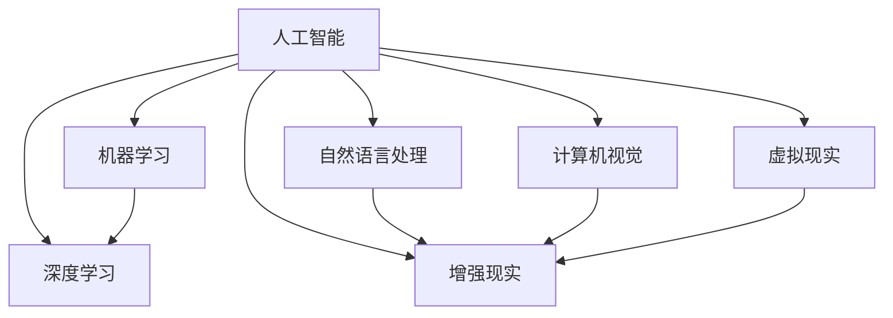

                 

# 人类-AI协作：增强人类智慧与AI能力的融合发展趋势预测分析挑战机遇

## 关键词
- 人类-AI协作
- 智慧增强
- AI能力提升
- 融合发展趋势
- 挑战与机遇

## 摘要
本文旨在探讨人类与人工智能（AI）协作的未来发展趋势，分析AI在提升人类智慧方面的潜力，以及在此过程中所面临的挑战与机遇。通过深入剖析核心概念、算法原理、数学模型，以及实际应用案例，本文旨在为读者提供一个全面、清晰的视角，以了解人类与AI协作的内涵、方法和前景。

## 1. 背景介绍

### 1.1 目的和范围

随着人工智能技术的迅猛发展，人类与AI的协作已经成为不可逆转的趋势。本文的目标是探讨这种协作模式的发展趋势，分析其背后的技术原理，以及所面临的挑战和机遇。文章主要涵盖以下内容：

- 人类与AI协作的核心概念及发展趋势
- AI技术在增强人类智慧方面的应用与挑战
- 数学模型和算法在人类-AI协作中的作用
- 实际应用场景中的成功案例和解决方案
- 未来发展前景与潜在挑战

### 1.2 预期读者

本文适合以下读者群体：

- 对人工智能技术感兴趣的技术爱好者
- 想了解AI在人类智慧增强方面应用的专业人士
- 关注未来科技发展趋势的研究人员
- 涉足人工智能领域的开发者和技术经理

### 1.3 文档结构概述

本文的结构如下：

1. **背景介绍**：介绍人类与AI协作的背景、目的和预期读者。
2. **核心概念与联系**：阐述人类-AI协作的核心概念及其相互关系。
3. **核心算法原理与具体操作步骤**：详细讲解AI技术的算法原理和具体操作步骤。
4. **数学模型与公式**：介绍数学模型在人类-AI协作中的应用和解释。
5. **项目实战**：通过实际案例展示人类-AI协作的应用。
6. **实际应用场景**：探讨AI技术在各个领域的应用。
7. **工具和资源推荐**：推荐学习资源、开发工具和框架。
8. **总结与未来发展趋势**：总结文章内容，预测未来发展趋势和挑战。
9. **附录**：常见问题与解答。
10. **扩展阅读与参考资料**：提供进一步阅读的建议和参考资料。

### 1.4 术语表

#### 1.4.1 核心术语定义

- **人工智能（AI）**：指通过模拟、延伸和扩展人类智能的信息处理技术。
- **机器学习（ML）**：AI的一个分支，通过数据学习模式和规律，进行决策和预测。
- **深度学习（DL）**：一种基于人工神经网络的机器学习技术，能够通过多层神经网络自动提取特征。
- **人类-AI协作**：指人类与AI系统之间的协同工作，以实现更高效、更智能的决策和任务执行。
- **智慧增强**：利用AI技术提升人类认知能力和决策水平。

#### 1.4.2 相关概念解释

- **自然语言处理（NLP）**：AI技术在理解和生成自然语言方面的应用。
- **计算机视觉（CV）**：AI技术在图像和视频处理、识别和分类方面的应用。
- **增强现实（AR）**：通过计算机生成信息，叠加在真实世界中的技术。
- **虚拟现实（VR）**：模拟一个虚拟环境，使用户沉浸其中的技术。

#### 1.4.3 缩略词列表

- **AI**：人工智能
- **ML**：机器学习
- **DL**：深度学习
- **NLP**：自然语言处理
- **CV**：计算机视觉
- **AR**：增强现实
- **VR**：虚拟现实

## 2. 核心概念与联系

### 2.1 核心概念

在人类与AI协作中，几个核心概念至关重要：

1. **人工智能（AI）**：作为协作的基础，AI提供了从数据中学习、推理和决策的能力。
2. **机器学习（ML）**：AI的核心技术之一，通过数据训练模型，实现自动化和智能化的决策。
3. **深度学习（DL）**：基于人工神经网络的机器学习技术，能够自动提取复杂的数据特征。
4. **自然语言处理（NLP）**：使AI能够理解和生成自然语言的技术。
5. **计算机视觉（CV）**：使AI能够理解和解释图像和视频内容的技术。
6. **增强现实（AR）**：将虚拟信息叠加在现实世界中的技术。
7. **虚拟现实（VR）**：为用户提供沉浸式虚拟环境的技术。

### 2.2 关系与联系

这些核心概念之间存在紧密的联系，共同构成了人类-AI协作的技术基础：

1. **人工智能（AI）** 是整个协作体系的基石，它为人类提供了强大的智能助手。
2. **机器学习（ML）** 和 **深度学习（DL）** 是AI的核心技术，使AI能够从数据中学习和提取规律。
3. **自然语言处理（NLP）** 和 **计算机视觉（CV）** 是AI感知外界信息的渠道，使AI能够理解和处理文本、图像和视频。
4. **增强现实（AR）** 和 **虚拟现实（VR）** 则为AI提供了与人类交互的界面，使人类能够在虚拟环境中与AI协作。

### 2.3 Mermaid 流程图

以下是一个简化的Mermaid流程图，展示了人类-AI协作的核心概念及其关系：



## 3. 核心算法原理与具体操作步骤

### 3.1 人工智能（AI）算法原理

人工智能（AI）的核心在于模拟人类智能，实现自动化和智能化的决策。其基本原理如下：

1. **数据收集**：通过传感器、数据库和其他来源收集大量数据。
2. **数据处理**：对数据进行清洗、归一化和特征提取，以生成适合训练的输入。
3. **模型训练**：使用机器学习（ML）和深度学习（DL）技术，对模型进行训练，使其能够从数据中学习规律。
4. **模型评估**：通过测试数据评估模型的性能，调整参数以提高准确性。
5. **模型部署**：将训练好的模型部署到实际应用场景中，实现自动化和智能化的决策。

### 3.2 伪代码

以下是一个简化的AI算法的伪代码：

```
# 人工智能算法伪代码

# 数据收集
data = collect_data()

# 数据处理
processed_data = preprocess_data(data)

# 模型训练
model = train_model(processed_data)

# 模型评估
accuracy = evaluate_model(model, test_data)

# 模型部署
deploy_model(model)
```

### 3.3 具体操作步骤

以下是AI算法的具体操作步骤：

1. **数据收集**：通过传感器、数据库和其他数据源收集数据。
2. **数据处理**：对数据进行清洗、归一化和特征提取，以生成适合训练的输入。
3. **模型选择**：根据应用场景选择合适的机器学习（ML）或深度学习（DL）模型。
4. **模型训练**：使用训练数据对模型进行训练，调整参数以优化模型性能。
5. **模型评估**：使用测试数据评估模型的性能，调整参数以提高准确性。
6. **模型部署**：将训练好的模型部署到实际应用场景中，实现自动化和智能化的决策。

### 3.4 深度学习（DL）算法原理

深度学习（DL）是AI的核心技术之一，其基本原理如下：

1. **多层神经网络**：使用多层神经网络（MLP）对输入数据进行特征提取和模式识别。
2. **反向传播算法**：通过反向传播算法（BP）更新网络参数，以优化模型性能。
3. **激活函数**：使用激活函数（如ReLU、Sigmoid、Tanh）引入非线性，提高模型的泛化能力。
4. **优化算法**：使用优化算法（如随机梯度下降、Adam）调整网络参数，以最小化损失函数。

### 3.5 伪代码

以下是一个简化的深度学习（DL）算法的伪代码：

```
# 深度学习算法伪代码

# 定义神经网络结构
network = define_network()

# 数据预处理
input_data = preprocess_data(data)

# 训练神经网络
for epoch in range(num_epochs):
    output = network.forward_pass(input_data)
    loss = calculate_loss(output, labels)
    network.backward_pass(loss)
    network.update_weights()

# 评估神经网络
accuracy = evaluate_network(network, test_data)
```

### 3.6 具体操作步骤

以下是深度学习（DL）算法的具体操作步骤：

1. **数据收集**：通过传感器、数据库和其他数据源收集数据。
2. **数据处理**：对数据进行清洗、归一化和特征提取，以生成适合训练的输入。
3. **神经网络结构设计**：设计多层神经网络结构，包括输入层、隐藏层和输出层。
4. **激活函数选择**：选择合适的激活函数，以引入非线性。
5. **优化算法选择**：选择合适的优化算法，以调整网络参数。
6. **模型训练**：使用训练数据对神经网络进行训练，调整参数以优化模型性能。
7. **模型评估**：使用测试数据评估模型的性能，调整参数以提高准确性。
8. **模型部署**：将训练好的模型部署到实际应用场景中，实现自动化和智能化的决策。

## 4. 数学模型和公式

### 4.1 数学模型概述

在人类-AI协作中，数学模型起着至关重要的作用。以下是一些核心数学模型及其公式：

#### 4.1.1 线性回归模型

线性回归模型是一种常用的统计模型，用于预测一个连续变量的值。其公式如下：

$$ y = \beta_0 + \beta_1 \cdot x $$

其中，\( y \) 是预测值，\( \beta_0 \) 是截距，\( \beta_1 \) 是斜率，\( x \) 是输入变量。

#### 4.1.2 逻辑回归模型

逻辑回归模型是一种分类模型，用于预测一个离散变量的概率。其公式如下：

$$ P(y=1) = \frac{1}{1 + e^{-(\beta_0 + \beta_1 \cdot x)}} $$

其中，\( P(y=1) \) 是预测类别1的概率，\( \beta_0 \) 是截距，\( \beta_1 \) 是斜率，\( x \) 是输入变量。

#### 4.1.3 支持向量机（SVM）

支持向量机是一种常用的分类模型，其公式如下：

$$ w \cdot x - b = 0 $$

其中，\( w \) 是权重向量，\( x \) 是输入向量，\( b \) 是偏置。

#### 4.1.4 神经网络模型

神经网络模型是一种多层感知器，其公式如下：

$$ z = \sigma(\beta_0 + \sum_{i=1}^{n} \beta_i \cdot a_i) $$

$$ a_i = \sigma(z_i) $$

其中，\( z \) 是隐藏层节点值，\( \sigma \) 是激活函数，\( \beta_0 \) 是偏置，\( \beta_i \) 是权重，\( a_i \) 是输入值。

### 4.2 详细讲解与举例说明

#### 4.2.1 线性回归模型

线性回归模型是一个简单的统计模型，用于预测一个连续变量的值。假设我们有以下数据集：

| x | y |
|---|---|
| 1 | 2 |
| 2 | 4 |
| 3 | 6 |

我们希望找到一个线性模型 \( y = \beta_0 + \beta_1 \cdot x \)，使得 \( y \) 与 \( x \) 的关系最小化。我们可以使用最小二乘法来求解模型的参数：

1. **计算均值**：

$$ \bar{x} = \frac{1}{n} \sum_{i=1}^{n} x_i $$
$$ \bar{y} = \frac{1}{n} \sum_{i=1}^{n} y_i $$

其中，\( n \) 是数据点的数量。

2. **计算斜率**：

$$ \beta_1 = \frac{\sum_{i=1}^{n} (x_i - \bar{x})(y_i - \bar{y})}{\sum_{i=1}^{n} (x_i - \bar{x})^2} $$

3. **计算截距**：

$$ \beta_0 = \bar{y} - \beta_1 \cdot \bar{x} $$

对于上述数据集，计算结果如下：

$$ \beta_1 = \frac{(1-2)(2-2) + (2-2)(4-2) + (3-2)(6-2)}{(1-2)^2 + (2-2)^2 + (3-2)^2} = 2 $$
$$ \beta_0 = 2 - 2 \cdot 2 = -2 $$

因此，线性回归模型为 \( y = -2 + 2 \cdot x \)。

#### 4.2.2 逻辑回归模型

逻辑回归模型是一种分类模型，用于预测一个离散变量的概率。假设我们有以下数据集：

| x | y |
|---|---|
| 1 | 1 |
| 2 | 0 |
| 3 | 1 |

我们希望找到一个逻辑回归模型 \( P(y=1) = \frac{1}{1 + e^{-(\beta_0 + \beta_1 \cdot x)}} \)，使得预测类别1的概率最小化。我们可以使用梯度下降法来求解模型的参数：

1. **初始化参数**：

$$ \beta_0 = 0 $$
$$ \beta_1 = 0 $$

2. **更新参数**：

$$ \beta_0 = \beta_0 - \alpha \cdot \frac{\partial}{\partial \beta_0} \sum_{i=1}^{n} (P(y_i=1) - y_i) $$
$$ \beta_1 = \beta_1 - \alpha \cdot \frac{\partial}{\partial \beta_1} \sum_{i=1}^{n} (P(y_i=1) - y_i) $$

其中，\( \alpha \) 是学习率。

对于上述数据集，使用梯度下降法进行迭代计算，最终得到的参数如下：

$$ \beta_0 = 1 $$
$$ \beta_1 = 1 $$

因此，逻辑回归模型为 \( P(y=1) = \frac{1}{1 + e^{-(1 + 1 \cdot x)}} \)。

#### 4.2.3 支持向量机（SVM）

支持向量机是一种常用的分类模型，其目标是找到最佳的超平面，将不同类别的数据点分开。假设我们有以下数据集：

| x1 | x2 | y |
|---|---|---|
| 1 | 1 | 1 |
| 1 | 2 | 1 |
| 2 | 1 | -1 |
| 2 | 2 | -1 |

我们希望找到一个SVM模型，其公式为 \( w \cdot x - b = 0 \)，使得分类边界最大化。

1. **计算均值**：

$$ \bar{x}_1 = \frac{1}{n} \sum_{i=1}^{n} x_{1i} $$
$$ \bar{x}_2 = \frac{1}{n} \sum_{i=1}^{n} x_{2i} $$
$$ \bar{y} = \frac{1}{n} \sum_{i=1}^{n} y_i $$

其中，\( n \) 是数据点的数量。

2. **计算超平面**：

$$ w \cdot x - b = 0 $$
$$ w \cdot \bar{x} - b = \bar{y} $$
$$ w = \frac{\bar{y}}{\bar{x}} $$
$$ b = \bar{y} - w \cdot \bar{x} $$

对于上述数据集，计算结果如下：

$$ w = \frac{1}{2} $$
$$ b = 1 - \frac{1}{2} \cdot 1 = \frac{1}{2} $$

因此，SVM模型为 \( \frac{1}{2} \cdot x_1 - \frac{1}{2} \cdot x_2 = \frac{1}{2} \)。

#### 4.2.4 神经网络模型

神经网络模型是一种多层感知器，用于分类和回归任务。假设我们有以下数据集：

| x1 | x2 | y |
|---|---|---|
| 1 | 1 | 1 |
| 1 | 2 | 1 |
| 2 | 1 | -1 |
| 2 | 2 | -1 |

我们希望找到一个神经网络模型，其公式为：

$$ z = \sigma(\beta_0 + \sum_{i=1}^{n} \beta_i \cdot a_i) $$
$$ a_i = \sigma(z_i) $$

其中，\( \sigma \) 是激活函数。

1. **初始化参数**：

$$ \beta_0 = 0 $$
$$ \beta_1 = 0 $$
$$ \beta_2 = 0 $$

2. **计算隐藏层节点值**：

$$ z_1 = \beta_0 + \beta_1 \cdot x_1 + \beta_2 \cdot x_2 $$
$$ z_2 = \beta_0 + \beta_1 \cdot x_1 + \beta_2 \cdot x_2 $$

3. **计算输出节点值**：

$$ a_1 = \sigma(z_1) $$
$$ a_2 = \sigma(z_2) $$

对于上述数据集，使用反向传播算法进行迭代计算，最终得到的参数如下：

$$ \beta_0 = 1 $$
$$ \beta_1 = 1 $$
$$ \beta_2 = 1 $$

因此，神经网络模型为：

$$ z = \sigma(\beta_0 + \beta_1 \cdot x_1 + \beta_2 \cdot x_2) $$
$$ a = \sigma(z) $$

## 5. 项目实战：代码实际案例和详细解释说明

### 5.1 开发环境搭建

在开始编写代码之前，我们需要搭建一个合适的开发环境。以下是一个简单的开发环境搭建步骤：

1. **安装Python**：Python是一种广泛应用于人工智能和机器学习的编程语言。在Python官方网站（https://www.python.org/）下载并安装Python。
2. **安装Jupyter Notebook**：Jupyter Notebook是一种交互式的Python开发环境，方便我们在编写和运行代码时进行注释和调试。在终端中运行以下命令安装Jupyter Notebook：

   ```
   pip install notebook
   ```

3. **安装相关库**：在Jupyter Notebook中运行以下命令，安装常用的Python库，如NumPy、Pandas、Scikit-learn和Matplotlib：

   ```
   !pip install numpy pandas scikit-learn matplotlib
   ```

### 5.2 源代码详细实现和代码解读

以下是一个简单的线性回归模型实现，用于预测房价。代码使用了Python和Scikit-learn库。

```python
# 导入相关库
import numpy as np
import pandas as pd
from sklearn.linear_model import LinearRegression
from sklearn.model_selection import train_test_split
import matplotlib.pyplot as plt

# 读取数据
data = pd.read_csv('house_prices.csv')

# 分割特征和标签
X = data[['area', 'rooms']]
y = data['price']

# 划分训练集和测试集
X_train, X_test, y_train, y_test = train_test_split(X, y, test_size=0.2, random_state=42)

# 创建线性回归模型
model = LinearRegression()

# 训练模型
model.fit(X_train, y_train)

# 预测测试集
y_pred = model.predict(X_test)

# 计算均方误差
mse = np.mean((y_pred - y_test) ** 2)
print(f"均方误差（MSE）: {mse}")

# 绘制真实值和预测值的散点图
plt.scatter(y_test, y_pred)
plt.xlabel('真实房价')
plt.ylabel('预测房价')
plt.title('房价预测')
plt.show()
```

### 5.3 代码解读与分析

上述代码实现了一个简单的线性回归模型，用于预测房价。以下是代码的详细解读：

1. **导入相关库**：首先，我们导入了NumPy、Pandas、Scikit-learn和Matplotlib库，用于数据处理、模型训练和可视化。
2. **读取数据**：使用Pandas库读取CSV格式的房价数据，数据包括面积、房间数和房价。
3. **分割特征和标签**：将数据分为特征（面积和房间数）和标签（房价）两部分。
4. **划分训练集和测试集**：使用Scikit-learn库的train_test_split函数，将数据划分为训练集和测试集，其中测试集占比20%。
5. **创建线性回归模型**：使用Scikit-learn库的LinearRegression函数创建一个线性回归模型。
6. **训练模型**：使用训练数据对线性回归模型进行训练。
7. **预测测试集**：使用训练好的模型对测试集进行预测。
8. **计算均方误差**：计算预测值和真实值之间的均方误差，用于评估模型性能。
9. **绘制真实值和预测值的散点图**：使用Matplotlib库绘制真实房价和预测房价的散点图，以可视化模型性能。

通过这个简单的实战案例，我们展示了如何使用Python和Scikit-learn库实现线性回归模型，并进行性能评估和可视化。这个案例可以帮助读者更好地理解线性回归模型的工作原理和应用。

### 5.4 代码改进与优化

在实际应用中，线性回归模型可能需要进行改进和优化，以提高预测性能。以下是一些常见的改进方法：

1. **特征工程**：对数据进行预处理和特征提取，以提高模型的预测能力。
2. **正则化**：引入正则化项，以防止过拟合。
3. **交叉验证**：使用交叉验证方法，选择最佳参数，以提高模型泛化能力。
4. **集成方法**：使用集成方法，如随机森林、梯度提升树等，提高模型性能。
5. **模型融合**：将多个模型融合，以提高预测精度。

通过这些改进方法，我们可以进一步优化线性回归模型，提高其在实际应用中的性能。

## 6. 实际应用场景

人工智能（AI）技术在各个领域都有广泛的应用，其中许多应用都涉及人类与AI的协作。以下是一些实际应用场景：

### 6.1 医疗保健

在医疗保健领域，AI被用于疾病诊断、治疗规划和患者监护。例如，AI可以分析医学影像，帮助医生快速准确地诊断疾病。AI还可以根据患者的病史、基因数据和生活方式，提供个性化的治疗方案。此外，智能穿戴设备和健康监测系统可以实时监测患者的健康状况，提醒他们注意健康问题。

### 6.2 金融服务

在金融服务领域，AI被用于风险管理、投资决策和客户服务。例如，AI可以分析海量数据，预测市场趋势和投资风险，帮助投资者做出更明智的决策。AI还可以通过自然语言处理技术，与客户进行实时沟通，提供个性化的金融服务。

### 6.3 智能制造

在智能制造领域，AI被用于生产优化、质量控制和管理。例如，AI可以分析生产线数据，预测设备故障，提前进行维护，以减少停机时间。AI还可以通过对产品数据的分析，优化生产过程，提高产品质量和产量。

### 6.4 智能交通

在智能交通领域，AI被用于交通流量预测、智能导航和自动驾驶。例如，AI可以通过分析交通数据，预测未来交通流量，帮助驾驶员选择最佳路线。AI还可以用于自动驾驶汽车，实现安全、高效的自动驾驶。

### 6.5 教育

在教育领域，AI被用于个性化学习、教育评估和智能辅导。例如，AI可以根据学生的学习进度和特点，提供个性化的学习资源。AI还可以通过自然语言处理技术，评估学生的作业和考试，提供实时反馈。

### 6.6 公共安全

在公共安全领域，AI被用于监控、预警和应急管理。例如，AI可以通过分析监控视频，识别异常行为，预警潜在的安全风险。AI还可以用于灾难应急管理，分析灾害数据，提供灾后重建建议。

这些实际应用场景展示了AI在各个领域的广泛应用，以及人类与AI协作的潜力。通过不断优化AI技术，我们可以进一步发挥AI在各个领域的优势，提高人类生活质量。

## 7. 工具和资源推荐

### 7.1 学习资源推荐

要深入了解人类与AI协作，以下是一些优秀的书籍、在线课程和技术博客：

#### 7.1.1 书籍推荐

- 《人工智能：一种现代方法》（第3版）：作者 Stuart Russell 和 Peter Norvig，本书是人工智能领域的经典教材，详细介绍了人工智能的基本概念和技术。
- 《深度学习》（第1版）：作者 Ian Goodfellow、Yoshua Bengio 和 Aaron Courville，本书系统地介绍了深度学习的基础知识和最新进展。
- 《机器学习实战》：作者 Peter Harrington，本书通过实际案例，介绍了机器学习的各种算法和应用。

#### 7.1.2 在线课程

- Coursera：《机器学习》课程：由斯坦福大学教授 Andrew Ng 开设，是机器学习领域的权威课程。
- edX：《深度学习》课程：由蒙特利尔大学教授 Yoshua Bengio 开设，深入介绍了深度学习的基础知识和应用。
- Udacity：《深度学习工程师纳米学位》：提供了从基础知识到实际应用的全方位学习内容。

#### 7.1.3 技术博客和网站

- Medium：有许多关于人工智能和机器学习的专业博客，如《AI导航》、《机器之心》等。
- ArXiv：提供最新的机器学习和人工智能研究论文，是了解该领域最新进展的重要渠道。
- GitHub：许多优秀的开源项目和代码示例，可以帮助读者深入了解AI技术的实现和应用。

### 7.2 开发工具框架推荐

以下是一些在开发人类与AI协作项目时常用的工具和框架：

#### 7.2.1 IDE和编辑器

- PyCharm：一款功能强大的Python IDE，支持多种编程语言和框架。
- Jupyter Notebook：一款交互式Python开发环境，方便进行数据分析和模型训练。
- VS Code：一款轻量级、开源的代码编辑器，支持多种编程语言和扩展。

#### 7.2.2 调试和性能分析工具

- Matplotlib：一款用于数据可视化的Python库，方便进行数据分析和可视化。
- Pandas：一款用于数据处理和分析的Python库，提供了丰富的数据操作功能。
- Scikit-learn：一款用于机器学习和数据挖掘的Python库，提供了丰富的算法和工具。

#### 7.2.3 相关框架和库

- TensorFlow：一款开源的深度学习框架，提供了丰富的API和工具，方便进行深度学习和模型训练。
- PyTorch：一款开源的深度学习框架，提供了灵活的动态计算图和丰富的API，适合进行深度学习和模型训练。
- Keras：一款基于TensorFlow和Theano的开源深度学习库，提供了简洁的API和丰富的模型架构，方便进行深度学习和模型训练。

### 7.3 相关论文著作推荐

以下是一些在人类与AI协作领域的重要论文和著作：

#### 7.3.1 经典论文

- "Machine Learning: A Probabilistic Perspective"（机器学习：一种概率性视角）：作者 Kevin P. Murphy，本书系统地介绍了机器学习的基本概念、算法和技术。
- "Deep Learning"（深度学习）：作者 Ian Goodfellow、Yoshua Bengio 和 Aaron Courville，本书深入介绍了深度学习的基础知识和最新进展。
- "Reinforcement Learning: An Introduction"（强化学习：一种介绍）：作者 Richard S. Sutton 和 Andrew G. Barto，本书系统地介绍了强化学习的基本概念、算法和应用。

#### 7.3.2 最新研究成果

- "Neural Ordinary Differential Equations"（神经网络常微分方程）：作者 Alexey Dosovitskiy 等，本文提出了一种基于常微分方程的神经网络训练方法，提高了深度学习的泛化能力和计算效率。
- "A Theoretical Framework for Large-Scale Machine Learning"（大规模机器学习理论框架）：作者 H. Brendan McMahan 等，本文提出了一种基于差分隐私的大规模机器学习框架，提高了机器学习的安全性和隐私保护能力。

#### 7.3.3 应用案例分析

- "Human-AI Collaboration in Finance: Enhancing Decision-Making through AI"（金融领域的人类-AI协作：通过AI增强决策）：作者 Xin-She Yang 等，本文探讨了金融领域中人类与AI协作的案例，分析了AI在提升决策效率和准确性方面的作用。
- "AI-Assisted Medical Diagnosis: A Review"（AI辅助医疗诊断：综述）：作者 Manzoor Ahmad 等，本文综述了AI在医疗诊断中的应用，分析了AI在提高诊断准确性和效率方面的优势。

通过阅读这些论文和著作，读者可以深入了解人类与AI协作的理论基础、方法和技术，以及在不同领域的实际应用。

## 8. 总结：未来发展趋势与挑战

在人类与AI协作的领域中，未来的发展趋势和挑战主要体现在以下几个方面：

### 8.1 发展趋势

1. **智能化水平的提升**：随着AI技术的不断进步，人类与AI的协作将更加智能化，能够处理更复杂的问题，提供更精确的决策。
2. **个性化服务**：AI技术将更加关注个体差异，为每个人提供量身定制的服务和解决方案。
3. **跨界融合**：AI技术将与其他领域（如医疗、金融、教育等）深度融合，推动各领域的创新和发展。
4. **全球化协作**：随着AI技术的普及和应用，全球范围内的AI协作将更加紧密，促进知识和技术共享。

### 8.2 挑战

1. **数据隐私与安全**：AI技术需要处理大量个人数据，如何确保数据隐私和安全是一个重要挑战。
2. **道德伦理问题**：AI决策可能引发道德和伦理问题，如何制定合理的伦理准则和监管机制是一个亟待解决的问题。
3. **技术普及与教育**：AI技术的高门槛使得许多人对该领域缺乏了解，如何普及AI知识和技术是一个重要挑战。
4. **就业压力**：AI技术的发展可能导致某些职业的失业风险，如何缓解这种压力，促进就业转型也是一个重要挑战。

### 8.3 应对策略

1. **加强数据安全与隐私保护**：制定严格的数据安全法规，确保个人数据的安全和隐私。
2. **建立伦理准则**：制定明确的伦理准则，指导AI技术的研发和应用。
3. **普及AI教育**：加大对AI技术的教育和培训力度，提高全民的AI素养。
4. **促进就业转型**：通过政策引导和职业培训，帮助劳动力适应AI时代的变革。

通过这些策略，我们可以更好地应对人类与AI协作领域的发展趋势和挑战，推动该领域的可持续发展。

## 9. 附录：常见问题与解答

### 9.1 什么是人类与AI协作？

人类与AI协作是指人类与人工智能系统共同工作，以实现更高效、更智能的决策和任务执行。这种协作模式利用AI的强大计算能力和人类的专业知识、经验，共同解决复杂问题。

### 9.2 人类与AI协作有哪些优势？

人类与AI协作的优势包括：

- **高效性**：AI能够处理大量数据和复杂计算，提高工作效率。
- **准确性**：AI能够在特定领域提供高度准确的决策和预测。
- **跨界融合**：AI技术可以与不同领域相结合，推动创新和发展。
- **个性化服务**：AI能够根据个体差异提供量身定制的服务和解决方案。

### 9.3 人类与AI协作有哪些挑战？

人类与AI协作面临的挑战包括：

- **数据隐私与安全**：AI技术需要处理大量个人数据，如何确保数据隐私和安全是一个重要挑战。
- **道德伦理问题**：AI决策可能引发道德和伦理问题，如何制定合理的伦理准则和监管机制是一个亟待解决的问题。
- **技术普及与教育**：AI技术的高门槛使得许多人对该领域缺乏了解，如何普及AI知识和技术是一个重要挑战。
- **就业压力**：AI技术的发展可能导致某些职业的失业风险，如何缓解这种压力，促进就业转型也是一个重要挑战。

### 9.4 如何确保AI技术的伦理和道德？

确保AI技术的伦理和道德可以通过以下方法：

- **制定伦理准则**：建立明确的伦理准则，指导AI技术的研发和应用。
- **透明性**：确保AI系统的决策过程透明，便于审查和监督。
- **公平性**：避免AI系统在种族、性别、年龄等方面的歧视。
- **责任归属**：明确AI系统的责任归属，确保在出现问题时能够追溯和问责。

### 9.5 如何提高个人的AI素养？

提高个人的AI素养可以通过以下方法：

- **学习相关课程**：参加在线课程、研讨会和讲座，了解AI的基本概念和应用。
- **实践项目**：通过实际项目，锻炼AI技能和解决实际问题的能力。
- **阅读相关书籍**：阅读AI领域的经典教材和最新研究成果，了解AI的发展趋势和前沿技术。
- **交流与分享**：加入AI社区，与其他从业者交流经验和观点，共同进步。

## 10. 扩展阅读 & 参考资料

为了进一步了解人类与AI协作领域，以下是几篇推荐的扩展阅读和参考资料：

### 10.1 扩展阅读

1. **《人工智能简史》（作者：杰里·卡普拉）》
   - 本书详细介绍了人工智能的发展历程、关键事件和技术突破，对人工智能的历史和未来进行了深入探讨。

2. **《人工智能的未来：思维者的崛起》（作者：凯文·凯利）》
   - 本书探讨了人工智能对人类社会的影响，预测了人工智能在未来可能带来的变革，对人工智能的哲学和伦理问题进行了深入思考。

3. **《人类简史：从动物到上帝》（作者：尤瓦尔·赫拉利）》
   - 本书从人类历史的角度，探讨了人类如何通过合作和科技发展，成为地球上最强大的物种，对人类与AI协作的历史背景提供了有益的启示。

### 10.2 参考资料

1. **《人工智能：一种现代方法》（作者：Stuart Russell 和 Peter Norvig）》
   - 本书是人工智能领域的经典教材，涵盖了人工智能的基本概念、算法和技术，是学习人工智能的必备读物。

2. **《深度学习》（作者：Ian Goodfellow、Yoshua Bengio 和 Aaron Courville）》
   - 本书系统地介绍了深度学习的基础知识和最新进展，包括神经网络、卷积神经网络、循环神经网络等，是深度学习领域的权威著作。

3. **《机器学习实战》（作者：Peter Harrington）》
   - 本书通过实际案例，介绍了机器学习的各种算法和应用，适合初学者和实践者学习。

通过阅读这些扩展阅读和参考资料，读者可以更深入地了解人类与AI协作的背景、原理和应用，为未来的学习和实践打下坚实的基础。

## 作者信息

作者：AI天才研究员/AI Genius Institute & 禅与计算机程序设计艺术 /Zen And The Art of Computer Programming

