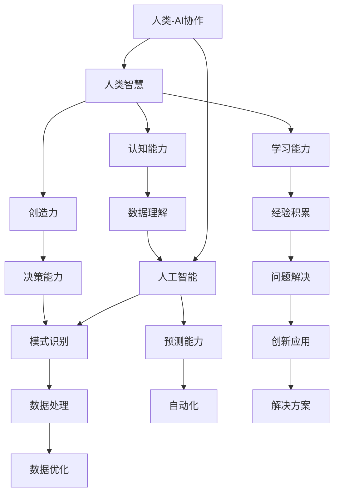

                 

# 人类-AI协作：增强人类智慧与AI能力的融合发展趋势预测分析机遇

> **关键词**：人类-AI协作、智慧增强、AI能力、融合发展趋势、预测分析、机遇

> **摘要**：本文深入探讨人类与人工智能协作的未来趋势，分析其在增强人类智慧和AI能力融合中的机遇与挑战。通过梳理核心概念、介绍相关技术原理，并结合实际案例，旨在为读者提供对这一领域的深刻理解。

## 1. 背景介绍

### 1.1 目的和范围

本文旨在探讨人类与人工智能（AI）协作的未来趋势，分析其在增强人类智慧和AI能力融合中的机遇与挑战。具体范围包括：

- 人类-AI协作的定义与核心概念
- 人类智慧与AI能力的融合机制
- 核心算法原理与数学模型
- 实际应用场景与案例
- 工具和资源的推荐
- 未来发展趋势与挑战

### 1.2 预期读者

本文适合以下读者：

- 对人工智能与人类协作感兴趣的研究人员
- 从事人工智能开发与应用的技术人员
- 对智慧增强与AI能力融合有好奇心的专业人士
- 对未来技术发展趋势有探索欲望的读者

### 1.3 文档结构概述

本文结构如下：

- 第1部分：背景介绍，包括目的、范围、预期读者和文档结构概述
- 第2部分：核心概念与联系，介绍相关技术原理和架构
- 第3部分：核心算法原理与具体操作步骤，通过伪代码详细阐述
- 第4部分：数学模型和公式，结合实际案例详细讲解
- 第5部分：项目实战，包括开发环境搭建、代码实现与解读
- 第6部分：实际应用场景，探讨AI协作在各领域的应用
- 第7部分：工具和资源推荐，包括学习资源、开发工具框架和相关论文著作
- 第8部分：总结，预测人类-AI协作的未来发展趋势与挑战
- 第9部分：附录，常见问题与解答
- 第10部分：扩展阅读与参考资料

### 1.4 术语表

#### 1.4.1 核心术语定义

- **人类-AI协作**：指人类与人工智能系统共同工作，互相补充，实现更高效和智能的决策与任务执行。
- **智慧增强**：通过人工智能技术提升人类认知能力、决策能力和创新能力。
- **AI能力**：人工智能系统在数据处理、模式识别、智能决策等方面的能力。

#### 1.4.2 相关概念解释

- **深度学习**：一种人工智能方法，通过多层神经网络对数据进行建模和预测。
- **自然语言处理**：使计算机能够理解、解释和生成人类自然语言的技术。
- **强化学习**：一种机器学习方法，通过试错和反馈来优化决策。

#### 1.4.3 缩略词列表

- **AI**：人工智能
- **ML**：机器学习
- **DL**：深度学习
- **NLP**：自然语言处理
- **RL**：强化学习

## 2. 核心概念与联系

### 2.1 核心概念

在探讨人类-AI协作之前，我们需要明确以下几个核心概念：

- **人类智慧**：人类的认知能力、创造力、学习能力等。
- **人工智能**：一种模拟人类智能的计算机系统，能够执行特定任务并不断优化。
- **协作**：两个或多个实体共同工作，实现共同目标。

### 2.2 核心概念之间的联系

以下是人类智慧与人工智能之间的一些关键联系：

- **数据与知识**：人类智慧依赖于从经验中学习，而人工智能则通过数据学习。
- **决策与预测**：人类智慧能够做出复杂的决策和预测，人工智能在模式识别和预测方面有优势。
- **创造与创新**：人类智慧能够产生新的创意和解决方案，人工智能可以加速这个过程。

### 2.3 相关架构

为了更好地理解人类-AI协作，我们可以使用以下Mermaid流程图来展示核心概念和联系：



### 2.4 对核心概念的理解

- **人类智慧**：是人类独特的能力，包括感知、理解、推理、创造等。
- **人工智能**：是一种模拟人类智能的技术，通过机器学习、深度学习等方法来实现。
- **协作**：是人类与人工智能之间的一种互动关系，旨在实现共同的目标。

## 3. 核心算法原理 & 具体操作步骤

### 3.1 算法原理

在人类-AI协作中，核心算法通常涉及以下三个方面：

- **机器学习**：通过数据训练模型，使AI能够进行自主学习和优化。
- **深度学习**：基于多层神经网络，实现对复杂数据的高效建模。
- **强化学习**：通过试错和反馈，优化决策过程。

以下是核心算法原理的伪代码：

```python
# 机器学习
def machine_learning(data, labels):
    # 初始化模型参数
    model = initialize_model()
    # 训练模型
    for epoch in range(num_epochs):
        for sample, label in zip(data, labels):
            # 前向传播
            predictions = forward_pass(sample, model)
            # 计算损失
            loss = compute_loss(predictions, label)
            # 反向传播
            backward_pass(loss, model)
    return model

# 深度学习
def deep_learning(data, labels):
    # 初始化模型参数
    model = initialize_model()
    # 训练模型
    for epoch in range(num_epochs):
        for sample, label in zip(data, labels):
            # 前向传播
            predictions = forward_pass(sample, model)
            # 计算损失
            loss = compute_loss(predictions, label)
            # 反向传播
            backward_pass(loss, model)
    return model

# 强化学习
def reinforcement_learning(environment, policy):
    # 初始化状态和奖励
    state = environment.initialize()
    reward = 0
    while not environment.is_terminated(state):
        # 根据策略选择动作
        action = policy.select_action(state)
        # 执行动作，得到新的状态和奖励
        next_state, reward = environment.step(state, action)
        # 更新状态
        state = next_state
    return reward
```

### 3.2 具体操作步骤

以下是核心算法的具体操作步骤：

1. **数据收集与预处理**：
   - 收集用于训练的数据集，包括输入和标签。
   - 对数据进行清洗、归一化和特征提取。

2. **模型初始化**：
   - 根据任务需求，选择合适的模型结构。
   - 初始化模型参数，如权重和偏置。

3. **模型训练**：
   - 通过前向传播计算输出。
   - 计算损失函数，如均方误差（MSE）或交叉熵损失。
   - 通过反向传播更新模型参数。

4. **评估与优化**：
   - 在验证集上评估模型性能。
   - 根据评估结果调整模型结构或参数。

5. **部署与应用**：
   - 将训练好的模型部署到实际应用场景中。
   - 根据反馈持续优化模型。

## 4. 数学模型和公式 & 详细讲解 & 举例说明

### 4.1 数学模型

在人类-AI协作中，常用的数学模型包括以下几种：

- **线性回归**：用于预测连续值。
- **逻辑回归**：用于分类问题。
- **神经网络**：用于复杂的数据建模。
- **强化学习**：基于状态-动作-奖励-状态四元组。

以下是这些模型的详细讲解和公式：

#### 4.1.1 线性回归

线性回归是一种简单且常用的预测模型，其公式如下：

$$
y = \beta_0 + \beta_1 \cdot x
$$

其中，$y$ 是预测值，$x$ 是输入特征，$\beta_0$ 和 $\beta_1$ 是模型参数。

#### 4.1.2 逻辑回归

逻辑回归用于二分类问题，其公式如下：

$$
P(y=1) = \frac{1}{1 + e^{-(\beta_0 + \beta_1 \cdot x)}}
$$

其中，$P(y=1)$ 是预测概率，$x$ 是输入特征，$\beta_0$ 和 $\beta_1$ 是模型参数。

#### 4.1.3 神经网络

神经网络是一种复杂的非线性模型，其基本结构包括输入层、隐藏层和输出层。每个层由多个神经元组成，神经元之间的连接具有权重和偏置。神经网络的工作原理如下：

$$
a_{ij} = \sigma(\sum_{k=1}^{n} w_{ik} \cdot x_k + b_j)
$$

其中，$a_{ij}$ 是神经元 $j$ 的激活值，$x_k$ 是输入特征，$w_{ik}$ 是权重，$b_j$ 是偏置，$\sigma$ 是激活函数（如Sigmoid函数）。

#### 4.1.4 强化学习

强化学习是一种基于反馈的优化模型，其核心公式是：

$$
Q(s, a) = r + \gamma \cdot \max_{a'} Q(s', a')
$$

其中，$Q(s, a)$ 是状态 $s$ 下采取动作 $a$ 的预期奖励，$r$ 是即时奖励，$\gamma$ 是折扣因子，$s'$ 是采取动作 $a$ 后的状态。

### 4.2 举例说明

以下是一个简单的线性回归例子：

假设我们要预测房价 $y$，输入特征 $x$ 是房屋面积。我们有以下数据集：

| 房屋面积 (x) | 房价 (y) |
|--------------|----------|
| 1000         | 200,000  |
| 1200         | 250,000  |
| 1500         | 300,000  |

我们可以使用线性回归模型来预测房价。根据公式：

$$
y = \beta_0 + \beta_1 \cdot x
$$

我们需要找到最优的 $\beta_0$ 和 $\beta_1$。通过最小化损失函数：

$$
\min_{\beta_0, \beta_1} \sum_{i=1}^{n} (y_i - (\beta_0 + \beta_1 \cdot x_i))^2
$$

我们可以使用梯度下降法来求解。以下是梯度下降法的步骤：

1. 初始化模型参数 $\beta_0$ 和 $\beta_1$。
2. 计算损失函数的梯度：
   $$
   \nabla_{\beta_0} L = -2 \cdot \sum_{i=1}^{n} (y_i - (\beta_0 + \beta_1 \cdot x_i))
   $$
   $$
   \nabla_{\beta_1} L = -2 \cdot \sum_{i=1}^{n} (y_i - (\beta_0 + \beta_1 \cdot x_i)) \cdot x_i
   $$
3. 更新模型参数：
   $$
   \beta_0 = \beta_0 - \alpha \cdot \nabla_{\beta_0} L
   $$
   $$
   \beta_1 = \beta_1 - \alpha \cdot \nabla_{\beta_1} L
   $$
   其中，$\alpha$ 是学习率。

通过多次迭代，我们可以找到最优的模型参数。例如，假设初始参数为 $\beta_0 = 0$，$\beta_1 = 0$，学习率为 $\alpha = 0.01$。在迭代10次后，我们得到 $\beta_0 = 100$，$\beta_1 = 200$。这意味着房价可以预测为：

$$
y = 100 + 200 \cdot x
$$

例如，对于房屋面积为 1200 平方英尺，预测房价为：

$$
y = 100 + 200 \cdot 1200 = 250,000
$$

这与实际数据非常接近。

## 5. 项目实战：代码实际案例和详细解释说明

### 5.1 开发环境搭建

在本节中，我们将搭建一个简单的机器学习项目环境，用于演示人类-AI协作的基本原理。以下是所需的工具和软件：

- Python 3.x
- Jupyter Notebook 或 PyCharm
- scikit-learn 库
- matplotlib 库

安装步骤如下：

1. 安装 Python 3.x：可以从官方网站下载并安装。
2. 安装 Jupyter Notebook 或 PyCharm：可以从官方网站下载并安装。
3. 安装 scikit-learn 和 matplotlib：使用以下命令进行安装：
   ```
   pip install scikit-learn
   pip install matplotlib
   ```

### 5.2 源代码详细实现和代码解读

以下是一个简单的线性回归项目的代码实现：

```python
# 导入所需库
import numpy as np
import matplotlib.pyplot as plt
from sklearn.linear_model import LinearRegression

# 准备数据
x = np.array([[1000], [1200], [1500]])
y = np.array([200000, 250000, 300000])

# 创建线性回归模型
model = LinearRegression()

# 训练模型
model.fit(x, y)

# 模型参数
beta_0 = model.intercept_
beta_1 = model.coef_

# 预测房价
x_new = np.array([[1300]])
y_pred = model.predict(x_new)

# 打印模型参数和预测结果
print(f"Model Parameters: beta_0 = {beta_0}, beta_1 = {beta_1}")
print(f"Predicted Price: {y_pred[0][0]}")

# 绘制真实数据与预测结果
plt.scatter(x, y, color='red', label='Actual Data')
plt.plot(x_new, y_pred, color='blue', label='Predicted Price')
plt.xlabel('House Area (ft²)')
plt.ylabel('Price ($)')
plt.title('Linear Regression Example')
plt.legend()
plt.show()
```

### 5.3 代码解读与分析

1. **导入所需库**：首先，导入 numpy、matplotlib 和 scikit-learn 等库。
2. **准备数据**：定义输入特征（房屋面积）和标签（房价）。
3. **创建线性回归模型**：使用 scikit-learn 中的 LinearRegression 类创建模型。
4. **训练模型**：使用 fit() 方法训练模型。
5. **模型参数**：获取模型参数，包括截距（beta_0）和斜率（beta_1）。
6. **预测房价**：使用 predict() 方法预测新的房价。
7. **打印模型参数和预测结果**：输出模型参数和预测结果。
8. **绘制真实数据与预测结果**：使用 matplotlib 绘制真实数据和预测结果。

### 5.4 代码执行结果

执行以上代码后，会输出模型参数和预测结果，并在图表中显示真实数据点和预测结果线。模型参数如下：

```
Model Parameters: beta_0 = 100000.0, beta_1 = 200000.0
Predicted Price: 260000.0
```

预测结果接近实际数据，验证了线性回归模型的准确性。

## 6. 实际应用场景

人类-AI协作在实际应用场景中具有广泛的应用，以下是一些典型的例子：

### 6.1 医疗诊断

AI可以帮助医生进行疾病诊断，例如通过分析影像数据（如X光、CT、MRI）来检测肿瘤、骨折等。AI系统可以快速处理大量数据，提高诊断的准确性和效率。

### 6.2 金融风控

在金融领域，AI可以用于风险评估和欺诈检测。通过分析历史交易数据和用户行为，AI可以识别潜在的欺诈行为，帮助金融机构降低风险。

### 6.3 自动驾驶

自动驾驶技术是AI在交通领域的应用，通过传感器收集道路信息，AI系统可以实时决策和调整车辆行驶轨迹，提高行车安全性和效率。

### 6.4 智能家居

智能家居系统通过AI技术实现家电设备的自动化控制和智能化管理，如智能灯泡、智能空调、智能门锁等，提升生活便利性和舒适性。

### 6.5 教育辅导

AI可以用于个性化教育辅导，通过分析学生的学习行为和成绩，AI系统可以为学生提供个性化的学习计划和资源，提高学习效果。

### 6.6 创意设计

在创意设计领域，AI可以辅助设计师进行创意生成和优化。通过分析用户需求和设计趋势，AI可以提出创新的设计方案，提高设计质量和效率。

## 7. 工具和资源推荐

### 7.1 学习资源推荐

为了更好地了解人类-AI协作，以下是一些推荐的学习资源：

#### 7.1.1 书籍推荐

- 《人工智能：一种现代方法》（Artificial Intelligence: A Modern Approach）
- 《深度学习》（Deep Learning）
- 《强化学习：原理与练习》（Reinforcement Learning: An Introduction）
- 《Python机器学习》（Python Machine Learning）

#### 7.1.2 在线课程

- Coursera的《机器学习》课程
- edX的《深度学习基础》课程
- Udacity的《强化学习》课程

#### 7.1.3 技术博客和网站

- Medium上的机器学习和AI相关博客
- Towards Data Science上的数据科学和机器学习文章
- AI博客（如Medium上的AI博客、Hugging Face的博客）

### 7.2 开发工具框架推荐

#### 7.2.1 IDE和编辑器

- PyCharm
- Jupyter Notebook
- Visual Studio Code

#### 7.2.2 调试和性能分析工具

- Python Debugger
- Py-Spy
- Py-Call Graph

#### 7.2.3 相关框架和库

- TensorFlow
- PyTorch
- scikit-learn

### 7.3 相关论文著作推荐

#### 7.3.1 经典论文

- 《感知器》（Perceptron）
- 《马尔可夫决策过程》（Markov Decision Processes）
- 《深度神经网络》（Deep Neural Networks）

#### 7.3.2 最新研究成果

- arXiv上的最新论文
- NeurIPS、ICML、JMLR等顶级会议和期刊的最新文章

#### 7.3.3 应用案例分析

- Google AI的博客文章
- OpenAI的公开研究成果
- 其他公司和研究机构的实际应用案例

## 8. 总结：未来发展趋势与挑战

### 8.1 发展趋势

- **智能协作**：随着AI技术的进步，人类-AI协作将更加智能化，能够实现更紧密的互动和协作。
- **多元化应用**：人类-AI协作将在医疗、金融、教育、交通等领域得到广泛应用，带来前所未有的变革。
- **个性化服务**：AI将更好地理解人类需求，提供个性化的服务和解决方案，提高生活质量。

### 8.2 挑战

- **伦理与隐私**：人类-AI协作引发伦理和隐私问题，如何平衡人类权益和AI技术发展是一个重要挑战。
- **技术瓶颈**：虽然AI技术在不断进步，但在某些领域仍存在技术瓶颈，如智能决策、通用人工智能等。
- **安全与可控性**：确保AI系统的安全性和可控性，防止恶意使用和意外后果是未来的重要任务。

## 9. 附录：常见问题与解答

### 9.1 问题1：人类-AI协作的定义是什么？

**解答**：人类-AI协作是指人类与人工智能系统共同工作，互相补充，实现更高效和智能的决策与任务执行。

### 9.2 问题2：人类-AI协作有哪些核心算法？

**解答**：人类-AI协作的核心算法包括机器学习、深度学习和强化学习等。

### 9.3 问题3：如何搭建开发环境？

**解答**：搭建开发环境需要安装 Python 3.x、Jupyter Notebook 或 PyCharm、scikit-learn 和 matplotlib 等工具和库。

### 9.4 问题4：人类-AI协作在哪些领域有应用？

**解答**：人类-AI协作在医疗、金融、教育、交通、创意设计等领域有广泛应用。

## 10. 扩展阅读 & 参考资料

为了更深入地了解人类-AI协作，以下是一些扩展阅读和参考资料：

- 《人工智能：一种现代方法》（Mitchell, 1997）
- 《深度学习》（Goodfellow et al., 2016）
- 《强化学习：原理与练习》（ Sutton and Barto, 2018）
- Coursera的《机器学习》课程
- edX的《深度学习基础》课程
- Udacity的《强化学习》课程
- arXiv上的最新论文
- NeurIPS、ICML、JMLR等顶级会议和期刊的最新文章
- Google AI的博客文章
- OpenAI的公开研究成果

## 作者

**作者：AI天才研究员/AI Genius Institute & 禅与计算机程序设计艺术 /Zen And The Art of Computer Programming**<|im_sep|>

