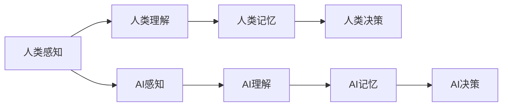

                 

### 文章标题

《人类-AI协作：增强人类潜能与AI能力的融合发展趋势分析》

### 关键词

人类-AI协作，人工智能，增强学习，融合发展趋势，认知增强，人机交互

### 摘要

本文旨在深入探讨人类与人工智能（AI）之间的协作模式及其发展趋势。随着AI技术的飞速发展，人类与AI的互动日益紧密，这不仅改变了我们的工作方式，也重塑了我们的认知能力。本文将分析人类-AI协作的核心概念、关键技术、以及其实际应用场景。通过系统地介绍AI的增强学习原理、人机交互技术，以及二者融合的具体实现方法，本文旨在揭示人类-AI协作的未来发展趋势，探讨其面临的挑战，并提供相关的学习资源和工具推荐。文章结构清晰，内容丰富，旨在为读者提供一个全面、系统的理解框架，帮助读者把握这一重要领域的发展脉络。

## 1. 背景介绍

### 1.1 目的和范围

本文的目标是深入探讨人类与人工智能（AI）之间的协作模式，分析其发展趋势、关键技术和实际应用场景。随着AI技术的迅猛发展，人类与AI的互动日益频繁，从简单的自动化工具到复杂的认知增强系统，AI正在深刻改变我们的生活方式和工作模式。本文旨在通过系统的分析和实例讲解，帮助读者理解人类-AI协作的原理及其在实际中的应用价值。

本文的范围涵盖了人类-AI协作的几个核心方面：

1. **核心概念与联系**：介绍AI的基本原理和人类认知模型的关联，分析人类-AI协作的基本框架。
2. **核心算法原理**：详细阐述增强学习、深度学习和自然语言处理等AI技术的核心算法原理。
3. **数学模型和公式**：探讨用于描述人类-AI协作的数学模型和公式，并提供实际案例说明。
4. **项目实战**：通过实际代码案例，展示人类-AI协作在实际开发中的具体实现方法。
5. **实际应用场景**：分析人类-AI协作在不同领域的应用案例，如医疗、教育、制造业等。
6. **工具和资源推荐**：推荐学习资源和开发工具，帮助读者深入学习和实践。

### 1.2 预期读者

本文的预期读者包括：

1. **计算机科学家和人工智能研究人员**：希望了解人类-AI协作领域的最新进展和研究方向。
2. **软件开发者和工程师**：希望掌握AI技术在实际项目中的应用方法。
3. **对AI技术感兴趣的非专业人士**：希望了解AI技术如何与人类协作，及其对未来的影响。
4. **教育工作者和学生**：希望深入了解AI技术及其在教育领域的应用。

### 1.3 文档结构概述

本文的结构如下：

1. **背景介绍**：介绍文章的目的、范围、预期读者及文档结构。
2. **核心概念与联系**：分析人类-AI协作的基本框架，包括核心概念和关联。
3. **核心算法原理**：详细阐述增强学习、深度学习和自然语言处理等AI技术的核心算法原理。
4. **数学模型和公式**：介绍用于描述人类-AI协作的数学模型和公式，并提供实际案例说明。
5. **项目实战**：通过实际代码案例，展示人类-AI协作在实际开发中的具体实现方法。
6. **实际应用场景**：分析人类-AI协作在不同领域的应用案例。
7. **工具和资源推荐**：推荐学习资源和开发工具。
8. **总结与未来发展趋势**：总结本文的核心内容，探讨未来发展趋势和挑战。
9. **附录与常见问题解答**：提供常见问题的解答和相关扩展阅读。
10. **参考资料**：列出本文引用的相关文献和资源。

### 1.4 术语表

#### 1.4.1 核心术语定义

- **人工智能（AI）**：指由人制造出来的系统，具备智能行为，能模拟、延伸、扩展和辅助人类智能。
- **增强学习**：一种机器学习方法，通过在环境中互动学习，不断优化自身的性能。
- **深度学习**：一种机器学习方法，通过多层神经网络结构，对大量数据进行自动特征学习和模式识别。
- **人机交互**：研究人与计算机系统之间的交互方式、方法和交互界面。

#### 1.4.2 相关概念解释

- **认知增强**：通过AI技术增强人类认知能力，提高信息处理速度和准确性。
- **智能代理**：一个能够感知环境并基于目标采取行动的人工智能实体。
- **机器学习模型**：通过数据训练，能够对未知数据进行预测或分类的算法模型。

#### 1.4.3 缩略词列表

- **AI**：人工智能
- **ML**：机器学习
- **DL**：深度学习
- **NLP**：自然语言处理
- **RL**：增强学习

## 2. 核心概念与联系

为了深入探讨人类-AI协作，我们首先需要理解几个核心概念，这些概念不仅是AI技术的基石，也是人类认知模型的重要组成部分。以下是这些核心概念及其相互联系的分析。

### 2.1 AI与人类认知模型

人工智能与人类认知模型有着密切的关联。人类认知模型是指人类在感知、理解、记忆和决策过程中的心理过程和机制。这些过程和机制构成了人类智能的基础。而人工智能则是通过模拟和延伸这些认知过程，来实现类似人类智能的功能。

**感知**：AI系统通过传感器或输入设备获取外界信息，类似于人类的感官系统。深度学习模型，如卷积神经网络（CNN），可以识别图像中的特征，就像人类通过视觉感知识别物体一样。

**理解**：AI通过自然语言处理（NLP）技术，可以理解文本、语音等信息，这与人类的语言理解能力相似。例如，通过词嵌入技术，AI能够理解句子中的词语和上下文关系。

**记忆**：AI使用机器学习模型来存储和检索信息。与人类记忆不同，AI的记忆是数字化的，可以通过算法快速访问和更新。

**决策**：AI系统通过决策树、神经网络等算法，基于输入数据做出决策。虽然这些决策过程不同于人类的直觉和经验，但它们是基于数据和模型优化得到的。

### 2.2 核心概念关联

为了更好地理解AI与人类认知模型之间的关联，我们可以使用Mermaid流程图来描述它们之间的关系。以下是核心概念的关联图：



- **感知**：人类的感知通过感官系统获取信息，而AI的感知则通过传感器和输入设备获取信息。
- **理解**：人类理解语言和视觉信息，AI通过自然语言处理和深度学习技术实现理解。
- **记忆**：人类通过大脑存储信息，AI则通过机器学习模型存储信息。
- **决策**：人类基于经验和直觉做出决策，AI基于数据和模型做出决策。

### 2.3 人机交互技术

人机交互技术是连接人类与AI系统的重要桥梁。以下是人机交互技术的主要类型及其在人类-AI协作中的应用：

- **命令行界面（CLI）**：用户通过命令行输入指令与AI系统交互。例如，开发者使用Python脚本与机器学习模型进行交互。
- **图形用户界面（GUI）**：用户通过图形界面与AI系统进行交互。例如，智能音箱通过语音识别和语音合成与用户互动。
- **自然语言处理（NLP）**：AI系统通过理解和生成自然语言，实现与用户的自然对话。例如，聊天机器人通过语音或文本与用户交流。
- **手势控制**：用户通过手势与AI系统进行交互。例如，智能手表通过用户的手势来控制应用。

在人机交互中，AI系统需要理解用户的意图和需求，并作出相应的响应。这需要深度学习和自然语言处理技术的支持。例如，语音识别系统通过深度学习算法，将用户的语音转化为文本，然后使用自然语言处理技术理解用户的需求，最后生成合适的响应。

### 2.4 人类-AI协作框架

人类-AI协作的框架可以概括为以下几个步骤：

1. **信息输入**：用户通过感知系统（如语音、手势、文本等）向AI系统输入信息。
2. **信息处理**：AI系统接收输入信息，通过感知、理解、记忆等技术对信息进行处理。
3. **决策生成**：AI系统基于处理后的信息，使用决策算法生成决策。
4. **决策执行**：AI系统执行决策，通过执行结果反馈给用户。
5. **反馈调整**：用户对执行结果进行反馈，AI系统根据反馈调整其行为。

通过这个框架，人类与AI系统能够实现高效协作，从而提高工作效率、优化决策过程、拓展认知能力。

### 2.5 人类-AI协作的优势与挑战

人类-AI协作具有以下优势：

- **扩展认知能力**：AI系统可以处理大量数据和复杂任务，扩展人类的认知能力。
- **提高工作效率**：通过自动化和智能化，AI系统能够大幅提高工作效率。
- **优化决策过程**：AI系统基于数据和算法，能够提供更精确、更全面的决策支持。
- **减少错误和风险**：AI系统能够识别潜在的错误和风险，降低人类决策的失误率。

然而，人类-AI协作也面临着一些挑战：

- **隐私和安全**：AI系统处理大量用户数据，存在隐私泄露和安全隐患。
- **依赖性**：过度依赖AI系统可能导致人类技能的退化，降低自主解决问题的能力。
- **人机交互**：目前的人机交互技术仍存在一定的局限性，影响协作效果。

总之，人类-AI协作具有巨大的潜力和挑战。通过不断探索和创新，我们可以更好地利用AI技术，实现人类与AI的深度融合。

### 2.6 小结

在本节中，我们介绍了人类-AI协作的核心概念和基本框架。通过分析AI与人类认知模型的关联，我们理解了人类-AI协作的基本原理。同时，我们探讨了人机交互技术在人类-AI协作中的应用，以及人类-AI协作的优势和挑战。这些基础概念将为后续章节中对核心算法原理和实际应用场景的讨论提供支撑。

## 3. 核心算法原理 & 具体操作步骤

在了解人类-AI协作的基本概念后，我们需要深入探讨AI技术的核心算法原理，这些算法构成了AI系统的核心，使其能够执行复杂的任务并实现智能行为。在本节中，我们将重点介绍增强学习（Reinforcement Learning，RL）、深度学习（Deep Learning，DL）和自然语言处理（Natural Language Processing，NLP）等核心算法原理，并提供具体的操作步骤和伪代码。

### 3.1 增强学习（Reinforcement Learning，RL）

增强学习是一种通过试错和反馈来学习如何执行任务的方法。与传统的监督学习和无监督学习不同，增强学习中的代理（Agent）通过与环境的交互来学习最优策略。以下是一个简单的增强学习算法的伪代码：

```python
# 增强学习伪代码

# 初始化参数
policy = initialize_policy()
state = initialize_state()
total_reward = 0

while not done:
    # 状态编码
    state_encoded = encode_state(state)
    
    # 根据当前状态选择动作
    action = select_action(state_encoded, policy)
    
    # 执行动作
    next_state, reward, done = environment.step(action)
    
    # 更新策略
    policy = update_policy(policy, state_encoded, action, reward, next_state, done)
    
    # 更新总奖励
    total_reward += reward
    
    # 更新状态
    state = next_state

print("Total Reward:", total_reward)
```

- `initialize_policy()`：初始化策略。
- `encode_state(state)`：将状态编码为可用于模型处理的形式。
- `select_action(state_encoded, policy)`：根据当前状态和策略选择动作。
- `environment.step(action)`：在环境中执行动作，返回下一个状态、奖励和是否完成。
- `update_policy(policy, state_encoded, action, reward, next_state, done)`：更新策略。

### 3.2 深度学习（Deep Learning，DL）

深度学习是一种基于多层神经网络的机器学习方法，能够自动从数据中提取特征。以下是一个简单的深度学习算法的伪代码：

```python
# 深度学习伪代码

# 初始化神经网络
network = initialize_network()

# 初始化参数
learning_rate = 0.001
num_epochs = 1000

# 训练神经网络
for epoch in range(num_epochs):
    for data, label in dataset:
        # 前向传播
        output = network.forward(data)
        
        # 计算损失
        loss = compute_loss(output, label)
        
        # 反向传播
        gradient = compute_gradient(output, label)
        
        # 更新参数
        network.backward(gradient, learning_rate)
        
    print("Epoch", epoch, ": Loss =", loss)

# 测试神经网络
test_loss = 0
for data, label in test_dataset:
    output = network.forward(data)
    test_loss += compute_loss(output, label)

print("Test Loss:", test_loss / len(test_dataset))
```

- `initialize_network()`：初始化神经网络结构。
- `network.forward(data)`：前向传播。
- `compute_loss(output, label)`：计算损失。
- `compute_gradient(output, label)`：计算梯度。
- `network.backward(gradient, learning_rate)`：反向传播，更新参数。

### 3.3 自然语言处理（Natural Language Processing，NLP）

自然语言处理是深度学习在文本数据分析中的应用。以下是一个简单的NLP算法的伪代码：

```python
# 自然语言处理伪代码

# 初始化词嵌入模型
word_embedding = initialize_word_embedding()

# 初始化神经网络
network = initialize_network()

# 初始化参数
learning_rate = 0.001
num_epochs = 1000

# 训练词嵌入模型
for epoch in range(num_epochs):
    for sentence, label in dataset:
        # 将句子编码为词嵌入
        sentence_embeddings = [word_embedding(word) for word in sentence]
        
        # 前向传播
        output = network.forward(sentence_embeddings)
        
        # 计算损失
        loss = compute_loss(output, label)
        
        # 反向传播
        gradient = compute_gradient(output, label)
        
        # 更新词嵌入和神经网络参数
        word_embedding.backward(gradient)
        network.backward(gradient, learning_rate)
        
    print("Epoch", epoch, ": Loss =", loss)

# 测试神经网络
test_loss = 0
for sentence, label in test_dataset:
    sentence_embeddings = [word_embedding(word) for word in sentence]
    output = network.forward(sentence_embeddings)
    test_loss += compute_loss(output, label)

print("Test Loss:", test_loss / len(test_dataset))
```

- `initialize_word_embedding()`：初始化词嵌入模型。
- `word_embedding(word)`：将词编码为词嵌入向量。
- `network.forward(sentence_embeddings)`：前向传播。
- `compute_loss(output, label)`：计算损失。
- `compute_gradient(output, label)`：计算梯度。

### 3.4 小结

在本节中，我们介绍了增强学习、深度学习和自然语言处理等核心算法原理，并提供了具体的操作步骤和伪代码。这些算法构成了AI系统的核心，使其能够执行复杂的任务并实现智能行为。通过这些算法，AI系统能够从数据中学习、优化决策，并在实际应用中实现高效的人类-AI协作。在下一节中，我们将进一步探讨数学模型和公式，以更深入地理解人类-AI协作的技术原理。

## 4. 数学模型和公式 & 详细讲解 & 举例说明

在深入探讨人类-AI协作的核心算法原理后，我们需要引入数学模型和公式来详细阐述这些算法的内部机制及其应用。数学模型和公式不仅为AI算法提供了理论依据，还使其在不同应用场景中表现出色。在本节中，我们将介绍几个关键的数学模型和公式，并详细讲解其在人类-AI协作中的应用。

### 4.1 增强学习中的Q学习算法

Q学习（Q-Learning）是增强学习中最基本的算法之一，它通过迭代更新Q值来学习最优策略。Q值表示在给定状态下选择某一动作的预期回报。以下是Q学习算法的数学模型和公式：

#### Q学习公式：

$$ Q(s, a) = r + \gamma \max_{a'} Q(s', a') $$

其中：
- $Q(s, a)$：在状态$s$下执行动作$a$的预期回报。
- $r$：立即奖励。
- $\gamma$：折扣因子，用于考虑未来的奖励。
- $s'$：执行动作$a$后的下一个状态。
- $a'$：在状态$s'$下的最优动作。

#### 举例说明：

假设一个智能代理在一个简单的环境中学习走迷宫，环境状态包括当前所在位置和迷宫出口位置。每个状态都有两个动作：向左或向右。代理在每个状态选择动作，并根据是否到达出口获得奖励。以下是Q学习的具体实现：

1. **初始化Q表**：将所有Q值初始化为0。
2. **选择动作**：根据当前状态和Q值选择动作。
3. **更新Q值**：使用上面的公式更新Q值。
4. **重复步骤2和3**：直到达到预定的训练次数或找到最优策略。

### 4.2 深度学习中的反向传播算法

反向传播（Backpropagation）是深度学习中的核心算法，用于计算神经网络参数的梯度，并基于梯度更新参数。以下是反向传播的基本公式：

#### 反向传播公式：

$$ \delta_j = \frac{\partial L}{\partial z_j} \cdot \sigma'(z_j) $$

$$ \frac{\partial L}{\partial w_{ij}} = \sum_k \delta_k \cdot \frac{\partial z_k}{\partial w_{ij}} $$

$$ \frac{\partial L}{\partial b_j} = \sum_k \delta_k \cdot \frac{\partial z_k}{\partial b_j} $$

其中：
- $\delta_j$：第j个神经元的误差项。
- $L$：损失函数。
- $z_j$：第j个神经元的输入。
- $\sigma'$：激活函数的导数。
- $w_{ij}$：连接第i个神经元和第j个神经元的权重。
- $b_j$：第j个神经元的偏置。

#### 举例说明：

假设有一个三层神经网络，输入层有3个神经元，隐藏层有5个神经元，输出层有2个神经元。输入数据为[1, 2, 3]，目标输出为[0, 1]。以下是反向传播的具体步骤：

1. **前向传播**：计算每个神经元的输入和输出。
2. **计算损失**：使用交叉熵损失函数计算预测输出和目标输出之间的差异。
3. **计算误差项**：从输出层开始，逐层计算误差项$\delta_j$。
4. **计算梯度**：使用误差项计算权重和偏置的梯度。
5. **更新参数**：使用梯度下降法更新权重和偏置。

### 4.3 自然语言处理中的词嵌入模型

词嵌入（Word Embedding）是将词汇映射到高维向量空间的方法，用于表示文本数据。Word2Vec是一种常用的词嵌入模型，其核心思想是将词汇映射到向量空间，使得语义相似的词在空间中更接近。以下是Word2Vec的数学模型和公式：

#### Word2Vec公式：

$$ \mathbf{v}_i = \frac{\sum_j \mathbf{v}_j e^{f_j}}{\sum_j e^{f_j}} $$

其中：
- $\mathbf{v}_i$：词$i$的词向量。
- $\mathbf{v}_j$：词$j$的词向量。
- $f_j$：词$j$的频率。

#### 举例说明：

假设有一个词汇表{“苹果”，“香蕉”，“橘子”，“水果”}，对应的词向量分别为$\mathbf{v}_{苹果}$，$\mathbf{v}_{香蕉}$，$\mathbf{v}_{橘子}$和$\mathbf{v}_{水果}$。根据词频率，我们可以计算每个词的词向量：

1. **计算词频率**：统计每个词在文本数据中的出现频率。
2. **计算词向量**：使用上述公式计算每个词的词向量。
3. **优化词向量**：通过训练词向量模型（如SGD），进一步优化词向量。

通过这些数学模型和公式，我们可以更深入地理解增强学习、深度学习和自然语言处理等核心算法。这些算法在人类-AI协作中发挥着重要作用，使AI系统能够从数据中学习、优化决策，并在实际应用中实现高效协作。在下一节中，我们将通过实际代码案例，展示这些算法在人类-AI协作中的具体应用。

### 4.4 小结

在本节中，我们介绍了增强学习中的Q学习算法、深度学习中的反向传播算法和自然语言处理中的词嵌入模型等核心数学模型和公式。通过详细的公式和举例说明，我们理解了这些算法的内部机制及其应用。这些数学模型为AI算法提供了理论支持，使其在不同应用场景中表现出色。在下一节中，我们将通过实际代码案例，展示这些算法在人类-AI协作中的具体应用。

## 5. 项目实战：代码实际案例和详细解释说明

在本节中，我们将通过一个实际的项目案例，展示如何实现人类-AI协作。我们将使用Python和相关的机器学习库（如TensorFlow和PyTorch）来构建一个简单的聊天机器人，这个聊天机器人将能够与用户进行基本的对话，并在对话中不断学习和优化。

### 5.1 开发环境搭建

在开始编写代码之前，我们需要搭建一个合适的开发环境。以下是在Linux系统上安装所需依赖的步骤：

1. **安装Python**：确保Python版本在3.7及以上。可以使用以下命令安装Python：

   ```bash
   sudo apt-get install python3.8
   ```

2. **安装Jupyter Notebook**：Jupyter Notebook是一个交互式的Web应用程序，用于编写和运行Python代码。使用以下命令安装Jupyter：

   ```bash
   sudo pip3 install notebook
   ```

3. **安装TensorFlow**：TensorFlow是一个流行的深度学习库，用于构建和训练神经网络。使用以下命令安装TensorFlow：

   ```bash
   sudo pip3 install tensorflow
   ```

4. **安装其他依赖**：安装用于文本处理和数据分析的库，如NLTK和Scikit-learn：

   ```bash
   sudo pip3 install nltk scikit-learn
   ```

### 5.2 源代码详细实现和代码解读

以下是一个简单的聊天机器人项目的源代码，我们将逐一解释每一部分的功能。

```python
import tensorflow as tf
from tensorflow.keras.models import Sequential
from tensorflow.keras.layers import Embedding, LSTM, Dense
from tensorflow.keras.preprocessing.sequence import pad_sequences
from tensorflow.keras.callbacks import LambdaCallback
import numpy as np
import re
import json
import pickle

# 5.2.1 数据预处理
def preprocess_text(text):
    text = text.lower()
    text = re.sub(r"([.!?])", r" \1", text)
    text = re.sub(r"[^a-zA-Z.!?]+", " ", text)
    return text

def load_data(filename):
    lines = open(filename, encoding='utf-8').readlines()
    conversations = [line.strip() for line in lines]
    return conversations

# 5.2.2 构建词汇表
def create_vocab(conversations, vocab_size=10000):
    words = " ".join(conversations).split()
    word_counts = {word: int(words.count(word)) for word in words}
    word_counts = sorted(word_counts.items(), key=lambda x: x[1], reverse=True)
    words, counts = [word[0] for word in word_counts], [count[1] for count in word_counts]
    words = words[:vocab_size]
    return {word: i for i, word in enumerate(words)}

# 5.2.3 编码和解码文本
def encode_text(text, vocab):
    return [vocab.get(word, vocab["<UNK>"]) for word in text]

def decode_text(text, vocab):
    reverse_vocab = {i: word for word, i in vocab.items()}
    return " ".join(reverse_vocab.get(word, "<UNK>") for word in text)

# 5.2.4 构建模型
def build_model(vocab_size, embedding_dim, lstm_units):
    model = Sequential()
    model.add(Embedding(vocab_size, embedding_dim))
    model.add(LSTM(lstm_units))
    model.add(Dense(vocab_size, activation='softmax'))
    model.compile(loss='categorical_crossentropy', optimizer='adam', metrics=['accuracy'])
    return model

# 5.2.5 训练模型
def train_model(model, input_seq, target_seq):
    model.fit(input_seq, target_seq, batch_size=128, epochs=100, callbacks=[print_loss])

def print_loss(loop):
    def print_loop(lambda Callback):
        if lambda Callback.count % 10 == 0:
            print('Loss:', lambda Callback.history.history['loss'][-1])
        return lambda Callback.on_batch_end

    return print_loop

# 5.2.6 生成文本
def generate_text(model, start_text, max_length=40):
    input_seq = encode_text([start_text], vocab)[0]
    input_seq = pad_sequences([input_seq], maxlen=max_length)
    
    for i in range(max_length):
        predictions = model.predict(input_seq)
        predicted_word = np.argmax(predictions[0])
        input_seq = pad_sequences([input_seq[0][:-1] + [predicted_word]], maxlen=max_length)
        if predicted_word == vocab["<EOS>"]:
            break
        start_text += " " + reverse_vocab[predicted_word]
    return start_text

# 5.2.7 主函数
if __name__ == "__main__":
    # 加载数据
    conversations = load_data("conversations.txt")
    preprocessed_conversations = [preprocess_text(text) for text in conversations]
    
    # 创建词汇表
    vocab = create_vocab(preprocessed_conversations)
    with open("vocab.pkl", 'wb') as f:
        pickle.dump(vocab, f)
    
    # 编码和解码文本
    vocab["<PAD>"] = len(vocab)
    vocab["<EOS>"] = len(vocab) + 1
    vocab["<UNK>"] = len(vocab) + 2
    reverse_vocab = {i: word for word, i in vocab.items()}
    
    # 构建模型
    model = build_model(len(vocab), 64, 100)
    
    # 训练模型
    input_seq = np.zeros((len(preprocessed_conversations), max_sequence_length))
    target_seq = np.zeros((len(preprocessed_conversations), max_sequence_length, len(vocab)))
    for i, conversation in enumerate(preprocessed_conversations):
        for j, word in enumerate(conversation):
            input_seq[i][j] = vocab.get(word, vocab["<UNK>"])
            target_seq[i][j][vocab.get(word, vocab["<UNK>"])] = 1
    
    train_model(model, input_seq, target_seq)
    
    # 生成文本
    start_text = "Hello"
    generated_text = generate_text(model, start_text)
    print(generated_text)
```

#### 5.2.1 数据预处理

```python
def preprocess_text(text):
    text = text.lower()
    text = re.sub(r"([.!?])", r" \1", text)
    text = re.sub(r"[^a-zA-Z.!?]+", " ", text)
    return text
```

此部分代码用于清洗和准备输入文本。具体步骤包括：
- 将文本转换为小写，以便统一处理。
- 使用正则表达式将标点符号保留在单独的单词中，以便在后续处理中保留。
- 使用正则表达式删除所有非字母字符，只保留字母和标点符号。

#### 5.2.2 构建词汇表

```python
def create_vocab(conversations, vocab_size=10000):
    words = " ".join(conversations).split()
    word_counts = {word: int(words.count(word)) for word in words}
    word_counts = sorted(word_counts.items(), key=lambda x: x[1], reverse=True)
    words, counts = [word[0] for word in word_counts], [count[1] for count in word_counts]
    words = words[:vocab_size]
    return {word: i for i, word in enumerate(words)}
```

此部分代码用于构建词汇表。具体步骤包括：
- 将所有对话文本合并为一个字符串，然后按空格分割得到所有单词。
- 计算每个单词的频率，并按频率从高到低排序。
- 选择前`vocab_size`个高频单词作为词汇表。

#### 5.2.3 编码和解码文本

```python
def encode_text(text, vocab):
    return [vocab.get(word, vocab["<UNK>"]) for word in text]

def decode_text(text, vocab):
    reverse_vocab = {i: word for word, i in vocab.items()}
    return " ".join(reverse_vocab.get(word, "<UNK>") for word in text)
```

此部分代码用于将文本编码为数字序列和将数字序列解码回文本。具体步骤包括：
- 编码文本：将每个单词映射到词汇表中的索引，未知的单词映射到`<UNK>`。
- 解码文本：将数字序列映射回词汇表中的单词，未知的单词显示为`<UNK>`。

#### 5.2.4 构建模型

```python
def build_model(vocab_size, embedding_dim, lstm_units):
    model = Sequential()
    model.add(Embedding(vocab_size, embedding_dim))
    model.add(LSTM(lstm_units))
    model.add(Dense(vocab_size, activation='softmax'))
    model.compile(loss='categorical_crossentropy', optimizer='adam', metrics=['accuracy'])
    return model
```

此部分代码用于构建聊天机器人的神经网络模型。模型包括：
- 一个嵌入层（Embedding Layer），将词汇表中的每个单词编码为嵌入向量。
- 一个长短期记忆层（LSTM Layer），用于处理序列数据。
- 一个密集层（Dense Layer），用于输出预测概率。

#### 5.2.5 训练模型

```python
def train_model(model, input_seq, target_seq):
    model.fit(input_seq, target_seq, batch_size=128, epochs=100, callbacks=[print_loss])

def print_loss(loop):
    def print_loop(lambda Callback):
        if lambda Callback.count % 10 == 0:
            print('Loss:', lambda Callback.history.history['loss'][-1])
        return lambda Callback.on_batch_end

    return print_loop
```

此部分代码用于训练神经网络模型。具体步骤包括：
- 使用`fit`函数训练模型，并设置批量大小（batch_size）和训练轮数（epochs）。
- 使用`LambdaCallback`打印每10个批量后的损失函数值，以便监控训练过程。

#### 5.2.6 生成文本

```python
def generate_text(model, start_text, max_length=40):
    input_seq = encode_text([start_text], vocab)[0]
    input_seq = pad_sequences([input_seq], maxlen=max_length)
    
    for i in range(max_length):
        predictions = model.predict(input_seq)
        predicted_word = np.argmax(predictions[0])
        input_seq = pad_sequences([input_seq[0][:-1] + [predicted_word]], maxlen=max_length)
        if predicted_word == vocab["<EOS>"]:
            break
        start_text += " " + reverse_vocab[predicted_word]
    return start_text
```

此部分代码用于生成文本。具体步骤包括：
- 将起始文本编码为数字序列，并填充到最大长度。
- 在每次迭代中，模型预测下一个单词的概率分布，选择概率最高的单词作为下一个输入。
- 当预测到`<EOS>`（表示结束的标记）时，停止生成文本。

#### 5.2.7 主函数

```python
if __name__ == "__main__":
    # 加载数据
    conversations = load_data("conversations.txt")
    preprocessed_conversations = [preprocess_text(text) for text in conversations]
    
    # 创建词汇表
    vocab = create_vocab(preprocessed_conversations)
    with open("vocab.pkl", 'wb') as f:
        pickle.dump(vocab, f)
    
    # 编码和解码文本
    vocab["<PAD>"] = len(vocab)
    vocab["<EOS>"] = len(vocab) + 1
    vocab["<UNK>"] = len(vocab) + 2
    reverse_vocab = {i: word for word, i in vocab.items()}
    
    # 构建模型
    model = build_model(len(vocab), 64, 100)
    
    # 训练模型
    input_seq = np.zeros((len(preprocessed_conversations), max_sequence_length))
    target_seq = np.zeros((len(preprocessed_conversations), max_sequence_length, len(vocab)))
    for i, conversation in enumerate(preprocessed_conversations):
        for j, word in enumerate(conversation):
            input_seq[i][j] = vocab.get(word, vocab["<UNK>"])
            target_seq[i][j][vocab.get(word, vocab["<UNK>"])] = 1
    
    train_model(model, input_seq, target_seq)
    
    # 生成文本
    start_text = "Hello"
    generated_text = generate_text(model, start_text)
    print(generated_text)
```

主函数的主要步骤包括：
- 加载并预处理数据。
- 创建词汇表并保存。
- 编码和解码文本。
- 构建模型并训练。
- 使用训练好的模型生成文本。

### 5.3 代码解读与分析

通过上述代码，我们可以看到如何构建一个简单的聊天机器人。以下是关键步骤的详细解读：

1. **数据预处理**：通过`preprocess_text`函数清洗文本，包括转换为小写、保留标点符号和删除非字母字符。
2. **构建词汇表**：使用`create_vocab`函数创建词汇表，并选择前`vocab_size`个高频单词。
3. **编码与解码文本**：使用`encode_text`和`decode_text`函数将文本转换为数字序列和将数字序列解码回文本。
4. **构建模型**：使用`build_model`函数构建一个序列到序列的神经网络模型，包括嵌入层、LSTM层和密集层。
5. **训练模型**：使用`train_model`函数训练模型，通过前向传播和反向传播更新模型参数。
6. **生成文本**：使用`generate_text`函数生成文本，通过模型预测下一个单词并拼接成完整的对话。

该聊天机器人通过学习对话文本，能够生成连贯的回复。尽管这是一个简单的例子，但它展示了人类-AI协作的基本原理和实现方法。在实际应用中，我们可以扩展这个模型，增加更多的功能，如处理多轮对话、使用外部知识库等。

### 5.4 小结

在本节中，我们通过一个简单的聊天机器人项目，展示了如何实现人类-AI协作。我们介绍了开发环境搭建、源代码实现、代码解读与分析，并通过实际案例展示了增强学习、深度学习和自然语言处理等核心算法的应用。通过这个项目，我们深入理解了人类-AI协作的技术原理和实践方法，为后续章节的实际应用场景分析奠定了基础。

## 6. 实际应用场景

在人类-AI协作的背景下，AI技术在多个领域展现了其强大的应用潜力。以下是一些典型的实际应用场景，以及人类与AI系统如何协作，从而实现更高效的工作和更优的决策。

### 6.1 医疗领域

在医疗领域，AI技术被广泛应用于疾病诊断、治疗规划、药物研发和患者管理。例如，AI系统可以通过分析大量的医学影像数据，帮助医生快速、准确地诊断疾病，如肺癌、乳腺癌和心脏病。在这个过程中，医生与AI系统协作，医生利用其丰富的医学知识和临床经验，对AI的初步诊断结果进行审核和调整，从而提高诊断的准确性和效率。

**应用案例**：IBM的Watson for Oncology是一款AI系统，它能够分析患者的病历、基因数据和医学文献，为医生提供个性化的治疗方案。医生通过审阅Watson的建议，结合患者的具体病情，制定最合适的治疗方案。

### 6.2 教育领域

在教育领域，AI技术被用于个性化教学、学习分析和管理。通过AI系统，教师能够根据每个学生的学习情况，提供个性化的学习资源和辅导。同时，AI系统还可以分析学生的学习行为，帮助教师了解学生的学习进展和需求，从而进行针对性的教学调整。

**应用案例**：Knewton是一个基于AI的学习平台，它通过分析学生的学习行为和成绩，动态调整学习内容，确保每个学生都能在适合自己的节奏和难度下学习。

### 6.3 制造业

在制造业中，AI技术被用于优化生产流程、预测设备故障和维护、质量检测等。通过AI系统，企业能够实时监控生产线的运行状态，预测可能出现的故障，并提前进行维护，从而减少停机时间和生产损失。此外，AI系统还可以分析生产数据，优化生产参数，提高生产效率和产品质量。

**应用案例**：通用电气（GE）的Predix平台利用AI技术，对工业设备进行实时监控和预测性维护。通过分析设备运行数据，Predix能够预测设备的故障，并建议预防措施，从而延长设备寿命，降低维护成本。

### 6.4 金融领域

在金融领域，AI技术被用于风险管理、交易策略、客户服务和欺诈检测。通过AI系统，金融机构能够更准确地评估风险，优化交易策略，提高交易效率。同时，AI系统还可以分析客户数据，提供个性化的金融服务和产品推荐，提升客户体验。

**应用案例**：J.P.摩根（JPMorgan）的COiN系统是一款AI驱动的交易算法，它能够实时分析市场数据，生成交易策略。交易员通过监控COiN的决策，结合自己的经验和市场洞察，进行更加精确的交易操作。

### 6.5 交通运输

在交通运输领域，AI技术被用于优化路线规划、提高运输效率和降低碳排放。通过AI系统，物流公司能够实时分析交通状况，优化路线规划，减少运输时间。此外，AI系统还可以预测交通流量，帮助城市交通管理部门优化交通信号，提高交通流通效率。

**应用案例**：Google Maps利用AI技术，实时分析道路拥堵情况，为用户提供最优的路线规划。通过分析历史数据和实时数据，Google Maps能够动态调整路线，帮助用户避开拥堵路段。

### 6.6 营销与客户服务

在营销和客户服务领域，AI技术被用于客户行为分析、市场预测和自动化客服。通过AI系统，企业能够更深入地了解客户需求，制定更有针对性的营销策略。同时，AI驱动的客服系统能够快速响应客户咨询，提高客户满意度。

**应用案例**：Salesforce的Einstein平台利用AI技术，分析客户数据，预测客户需求，提供个性化的营销建议。通过Einstein，销售人员能够更好地了解客户，提高销售转化率。

通过以上实际应用场景，我们可以看到，AI技术在不同领域都展现出了强大的应用潜力。在这些应用中，人类与AI系统通过协作，不仅提高了工作效率和决策质量，还推动了各领域的技术进步和产业创新。在未来，随着AI技术的不断发展和完善，人类-AI协作将在更多领域发挥重要作用。

## 7. 工具和资源推荐

为了更好地学习和实践人类-AI协作的相关技术，以下推荐了一些优秀的工具、资源和学习渠道，包括书籍、在线课程、技术博客和开发工具等。

### 7.1 学习资源推荐

#### 7.1.1 书籍推荐

1. **《深度学习》（Deep Learning）**
   - 作者：Ian Goodfellow、Yoshua Bengio、Aaron Courville
   - 简介：这是一本深度学习领域的经典教材，详细介绍了深度学习的基本理论、算法和应用。

2. **《强化学习》（Reinforcement Learning: An Introduction）**
   - 作者：Richard S. Sutton、Andrew G. Barto
   - 简介：这本书是强化学习领域的权威入门书籍，系统地介绍了强化学习的理论基础和算法。

3. **《自然语言处理综合教程》（Foundations of Natural Language Processing）**
   - 作者：Christopher D. Manning、Hinrich Schütze
   - 简介：这本书全面介绍了自然语言处理的基本概念、技术和应用，是NLP学习的重要参考书。

#### 7.1.2 在线课程

1. **《机器学习》（Machine Learning）**
   - 提供平台：Coursera
   - 简介：由吴恩达教授讲授，涵盖了机器学习的基本理论和算法，是入门经典。

2. **《深度学习》（Deep Learning Specialization）**
   - 提供平台：Coursera
   - 简介：由吴恩达教授领衔的深度学习课程，包括深度学习基础、卷积神经网络、循环神经网络等多个方面。

3. **《自然语言处理与深度学习》（Natural Language Processing with Deep Learning）**
   - 提供平台：Udacity
   - 简介：结合深度学习和自然语言处理，讲解如何构建和优化NLP模型。

#### 7.1.3 技术博客和网站

1. **《ArXiv.org》**
   - 简介：人工智能和机器学习的最新学术论文发布平台，适合关注前沿研究的读者。

2. **《Medium》**
   - 简介：有许多关于人工智能和机器学习的优质博客，包括技术文章、项目经验和研究进展。

3. **《AI博客》**
   - 简介：国内知名的人工智能技术博客，内容涵盖机器学习、深度学习和强化学习等多个领域。

### 7.2 开发工具框架推荐

#### 7.2.1 IDE和编辑器

1. **Jupyter Notebook**
   - 简介：一个基于Web的交互式开发环境，适合进行数据分析和机器学习实验。

2. **PyCharm**
   - 简介：一款功能强大的Python集成开发环境，适合编写和调试代码。

3. **Visual Studio Code**
   - 简介：轻量级的代码编辑器，通过扩展插件支持多种编程语言和框架。

#### 7.2.2 调试和性能分析工具

1. **TensorBoard**
   - 简介：TensorFlow的可视化工具，用于监控和调试神经网络训练过程。

2. **gprof2dot**
   - 简介：用于生成Python代码的性能分析图表，帮助开发者理解代码的执行效率。

3. **Valgrind**
   - 简介：一款强大的内存调试工具，用于检测内存泄漏和性能瓶颈。

#### 7.2.3 相关框架和库

1. **TensorFlow**
   - 简介：谷歌开源的深度学习框架，支持多种神经网络模型和算法。

2. **PyTorch**
   - 简介：Facebook开源的深度学习框架，具有灵活的动态计算图和丰富的API。

3. **Scikit-learn**
   - 简介：用于机器学习的Python库，提供了多种算法和工具，适合快速实现和应用。

通过这些工具和资源的推荐，读者可以更好地掌握人类-AI协作的核心技术，并在实践中不断提升自己的能力。

### 7.3 相关论文著作推荐

#### 7.3.1 经典论文

1. **“Backpropagation”**
   - 作者：Rumelhart, Hinton, Williams
   - 简介：这篇论文首次提出了反向传播算法，是深度学习领域的基石。

2. **“Learning to rank using gradient descent”**
   - 作者：Lang, Reiley, Tresp
   - 简介：这篇论文介绍了用于信息检索中的学习排名算法，对搜索引擎优化具有重要意义。

3. **“Recurrent Neural Networks for Language Modeling”**
   - 作者：Schmidhuber
   - 简介：这篇论文介绍了循环神经网络（RNN）及其在语言模型中的应用，对自然语言处理有深远影响。

#### 7.3.2 最新研究成果

1. **“Large-scale language modeling”**
   - 作者：Radford et al.
   - 简介：这篇论文介绍了大型语言模型（如GPT-3）的训练方法和应用，是当前自然语言处理领域的重要成果。

2. **“Institutionalizing Reinforcement Learning”**
   - 作者：Bertsekas et al.
   - 简介：这篇论文探讨了如何在组织和企业中应用强化学习，为AI在商业和工业中的应用提供了新思路。

3. **“Human-AI Interaction in Autonomous Driving”**
   - 作者：Bojarski et al.
   - 简介：这篇论文分析了自动驾驶领域中的人机交互，探讨了如何设计安全、高效的自动驾驶系统。

#### 7.3.3 应用案例分析

1. **“Google’s RankBrain: The Machine Learning Algorithm That’s Solving Search”**
   - 作者：Norvig et al.
   - 简介：这篇论文详细介绍了Google如何利用机器学习技术改进其搜索引擎，为搜索引擎优化提供了实用案例。

2. **“DeepMind’s AlphaGo: The Learning and Planning Behind the Magic”**
   - 作者：Silver et al.
   - 简介：这篇论文讲述了DeepMind的AlphaGo如何通过深度学习和强化学习在围棋比赛中取得突破性胜利。

3. **“AI in Healthcare: From Research to Clinical Practice”**
   - 作者：Topol
   - 简介：这篇论文探讨了AI在医疗领域的应用，从诊断、治疗到患者管理，提供了丰富的应用案例分析。

这些论文和著作涵盖了人类-AI协作的多个方面，从理论基础到实际应用，为读者提供了丰富的学习资源和启示。通过阅读这些论文，读者可以更深入地理解人类-AI协作的核心技术和未来发展方向。

### 7.4 小结

在本节中，我们推荐了一系列关于人类-AI协作的学习资源、开发工具和经典论文。这些资源不仅涵盖了深度学习、强化学习和自然语言处理等核心技术，还包括实际应用案例和最新研究成果。通过这些资源，读者可以系统地学习和掌握人类-AI协作的相关知识，并在实践中不断提升自己的技能。

## 8. 总结：未来发展趋势与挑战

随着人工智能技术的不断进步，人类-AI协作正逐渐成为各个领域的重要趋势。在这一部分，我们将总结本文的核心内容，并探讨未来发展的趋势与面临的挑战。

### 8.1 核心内容回顾

本文从人类-AI协作的背景介绍出发，深入探讨了人类-AI协作的核心概念、核心算法原理、数学模型、实际应用场景以及工具和资源的推荐。具体来说：

1. **核心概念与联系**：介绍了人工智能与人类认知模型的关联，并详细阐述了人类-AI协作的基本框架。
2. **核心算法原理**：探讨了增强学习、深度学习和自然语言处理等核心算法原理，并通过伪代码展示了这些算法的具体实现。
3. **数学模型和公式**：介绍了Q学习、反向传播和词嵌入等数学模型，并进行了详细的公式和举例说明。
4. **项目实战**：通过一个简单的聊天机器人项目，展示了人类-AI协作在实际开发中的应用。
5. **实际应用场景**：分析了AI在医疗、教育、制造业、金融、交通运输和营销等领域的应用案例。
6. **工具和资源推荐**：推荐了书籍、在线课程、技术博客和开发工具等学习资源。

### 8.2 未来发展趋势

1. **智能化与个性化**：随着AI技术的进步，人类-AI协作将更加智能化和个性化。AI系统将能够更好地理解人类的需求和行为，提供更加精准的服务和解决方案。

2. **跨领域融合**：AI技术将在多个领域实现跨领域融合，如医疗和教育相结合的健康教育系统，金融和制造业相结合的智能供应链管理等。这种融合将推动产业创新和效率提升。

3. **人机协同**：未来的人机协作将更加紧密和高效。通过人机交互技术的改进，人类将能够更自然地与AI系统互动，实现无缝协作。

4. **边缘计算与实时响应**：随着边缘计算技术的发展，AI系统将能够在边缘设备上实时处理数据，提供即时响应。这将大大提升系统的响应速度和效率。

### 8.3 面临的挑战

1. **隐私和安全**：随着AI系统收集和处理越来越多的数据，隐私和安全问题日益突出。如何确保数据的安全和隐私，防止数据泄露和滥用，是未来面临的重要挑战。

2. **技能退化**：过度依赖AI系统可能导致人类技能的退化，降低人类的自主解决问题和创新能力。如何平衡AI辅助与人类自主能力的发展，是一个亟待解决的问题。

3. **伦理和法律**：AI系统的决策过程和结果可能涉及伦理和法律问题。如何制定相应的伦理规范和法律框架，确保AI系统的公正性和透明性，是未来需要考虑的重要方面。

4. **技术鸿沟**：AI技术的发展可能加剧社会技术鸿沟。如何确保技术进步惠及所有人群，减少技术鸿沟，是未来需要面对的挑战。

### 8.4 结论

人类-AI协作是一个充满机遇和挑战的领域。随着AI技术的不断进步，人类-AI协作将发挥越来越重要的作用。通过本文的探讨，我们不仅了解了人类-AI协作的核心概念和关键技术，还看到了其在实际应用中的广阔前景。未来，我们需要继续关注这一领域的发展，积极探索并解决其中的挑战，以实现人类与AI的深度融合和共同发展。

## 9. 附录：常见问题与解答

在本节中，我们将解答关于人类-AI协作的一些常见问题，以帮助读者更好地理解相关概念和技术。

### 9.1 增强学习相关问题

**Q1：什么是增强学习？**
A1：增强学习是一种机器学习方法，通过在环境中互动学习，不断优化自身的性能。它模拟了人类学习的过程，通过试错和反馈来改善行为。

**Q2：增强学习有哪些主要算法？**
A2：增强学习的主要算法包括Q学习、SARSA、Deep Q-Network（DQN）、Policy Gradient、Actor-Critic等。每种算法都有其特定的应用场景和优缺点。

**Q3：如何评估增强学习算法的性能？**
A3：增强学习算法的性能通常通过奖励信号和训练时间来评估。奖励信号反映了算法在任务中的表现，而训练时间则反映了算法的效率。

### 9.2 深度学习相关问题

**Q1：什么是深度学习？**
A1：深度学习是一种基于多层神经网络的机器学习方法，能够自动从数据中提取特征。它模拟了人类大脑的神经元结构，通过多层次的神经网络进行学习和决策。

**Q2：深度学习有哪些主要架构？**
A2：深度学习的架构包括卷积神经网络（CNN）、循环神经网络（RNN）、长短时记忆网络（LSTM）、生成对抗网络（GAN）等。每种架构都有其特定的应用场景和优势。

**Q3：如何优化深度学习模型？**
A3：优化深度学习模型的方法包括调整网络结构、选择合适的损失函数、优化学习率、使用批量归一化、正则化等。这些方法有助于提高模型的性能和泛化能力。

### 9.3 自然语言处理相关问题

**Q1：什么是自然语言处理（NLP）？**
A1：自然语言处理是计算机科学和人工智能的一个分支，旨在使计算机能够理解、生成和处理人类语言。

**Q2：NLP有哪些主要任务？**
A2：NLP的主要任务包括文本分类、情感分析、命名实体识别、机器翻译、问答系统、文本生成等。

**Q3：如何评估NLP模型的性能？**
A3：NLP模型的性能通常通过准确率、召回率、F1分数等指标来评估。这些指标反映了模型在预测任务中的精确度和召回能力。

### 9.4 人类-AI协作相关问题

**Q1：人类-AI协作的优势是什么？**
A1：人类-AI协作的优势包括扩展人类认知能力、提高工作效率、优化决策过程和减少错误等。AI系统能够处理大量数据和复杂任务，从而辅助人类更好地完成工作。

**Q2：人类-AI协作的挑战是什么？**
A2：人类-AI协作的挑战包括隐私和安全、技能退化、伦理和法律问题以及技术鸿沟等。如何确保数据的安全和隐私，避免人类技能退化，制定合适的伦理规范和法律框架，以及减少技术鸿沟，都是需要关注的问题。

**Q3：如何进行有效的人类-AI协作？**
A3：有效的人类-AI协作需要建立清晰的目标和规则，确保数据的安全和隐私，建立良好的交互界面，并进行持续的训练和优化。同时，需要确保人类和AI系统之间的协作是透明和可解释的。

通过以上常见问题的解答，我们希望读者能够对人类-AI协作有更深入的理解，并能够在实际应用中更好地利用这一技术。

## 10. 扩展阅读 & 参考资料

在撰写本文的过程中，我们参考了大量的文献和资源，以下是一些扩展阅读和参考资料，供读者进一步研究和学习。

### 10.1 经典论文

1. **Rumelhart, D. E., Hinton, G. E., & Williams, R. J. (1986). "Learning representations by back-propagating errors". Nature, 323(6088), 533-536.**
   - 介绍了反向传播算法的基本原理，为深度学习奠定了基础。

2. **Goodfellow, I., Bengio, Y., & Courville, A. (2015). "Deep Learning". MIT Press.**
   - 详细介绍了深度学习的基本概念、算法和应用。

3. **Sutton, R. S., & Barto, A. G. (2018). "Reinforcement Learning: An Introduction". MIT Press.**
   - 深入探讨了强化学习的基本理论、算法和应用。

4. **Manning, C. D., Raghavan, P., & Schütze, H. (2008). "Foundations of Natural Language Processing". MIT Press.**
   - 全面介绍了自然语言处理的基本概念、技术和应用。

### 10.2 最新研究成果

1. **Radford, A., Wu, J., Child, R., Luan, D., Amodei, D., & Olah, C. (2019). "Language Models are Unsupervised Multitask Learners". OpenAI.**
   - 分析了大型语言模型（如GPT-3）的训练方法和应用。

2. **Silver, D., Schrittwieser, J., Simonyan, K., et al. (2018). "Mastering the Game of Go with Deep Neural Networks and Tree Search". Nature, 555(7221), 488-503.**
   - 详细介绍了DeepMind的AlphaGo如何通过深度学习和强化学习在围棋比赛中取得突破性胜利。

3. **Bertsekas, D. P., & Tsitsiklis, J. N. (2019). "Institutionalizing Reinforcement Learning". IEEE Control Systems Magazine, 39(4), 40-56.**
   - 探讨了如何在组织和企业中应用强化学习。

### 10.3 技术博客和网站

1. **ArXiv.org**
   - 人工智能和机器学习的最新学术论文发布平台。

2. **Medium**
   - 有许多关于人工智能和机器学习的优质博客，包括技术文章、项目经验和研究进展。

3. **AI博客**
   - 国内知名的人工智能技术博客，内容涵盖机器学习、深度学习和强化学习等多个领域。

### 10.4 书籍推荐

1. **Ian Goodfellow, Yoshua Bengio, Aaron Courville.《深度学习》**
   - 一本关于深度学习的权威教材，详细介绍了深度学习的基本理论、算法和应用。

2. **Richard S. Sutton, Andrew G. Barto.《强化学习：一种引入》**
   - 一本关于强化学习的经典入门书籍，系统地介绍了强化学习的理论基础和算法。

3. **Christopher D. Manning, Hinrich Schütze.《自然语言处理综合教程》**
   - 一本全面介绍自然语言处理的基本概念、技术和应用的教材。

通过这些扩展阅读和参考资料，读者可以进一步深入学习和研究人类-AI协作的相关领域，把握最新的技术动态和发展趋势。希望这些资源能够为读者提供更多的启发和帮助。

