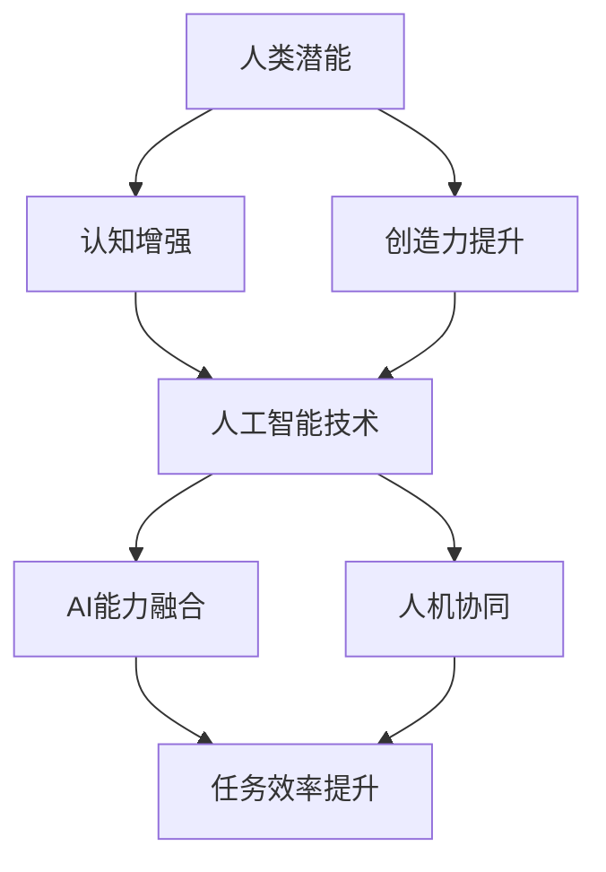

                 

# 人类-AI协作：增强人类潜能与AI能力的融合发展趋势分析展望

## 关键词
- 人类-AI协作
- 潜能增强
- AI能力融合
- 发展趋势
- 技术挑战

## 摘要
本文旨在探讨人类与人工智能（AI）协作的深度融合发展趋势。随着AI技术的飞速发展，人类潜能的挖掘与AI能力的融合已经成为当今技术领域的重要研究方向。本文首先介绍了人类-AI协作的背景和目的，随后详细分析了核心概念与联系，阐述了AI算法原理与数学模型，并通过实际案例展示了技术应用。最后，本文总结了未来发展趋势与挑战，并推荐了相关学习资源与开发工具，为读者提供了一幅全面而深入的分析图景。

## 1. 背景介绍

### 1.1 目的和范围
本文的目的是深入探讨人类与人工智能协作的融合发展趋势，分析其对于提高人类潜能和增强AI能力的影响。我们将探讨人类-AI协作的背景、核心概念、算法原理、数学模型以及实际应用场景，并总结其发展趋势和挑战。

### 1.2 预期读者
本文面向计算机科学、人工智能领域的科研人员、工程师以及对此感兴趣的技术爱好者。希望读者能通过本文，对人类-AI协作有一个全面而深入的理解。

### 1.3 文档结构概述
本文分为十个部分：背景介绍、核心概念与联系、核心算法原理与操作步骤、数学模型与公式、项目实战、实际应用场景、工具和资源推荐、总结、常见问题与解答、扩展阅读和参考资料。结构清晰，便于读者按需阅读。

### 1.4 术语表
#### 1.4.1 核心术语定义
- 人类-AI协作：指人类与人工智能系统共同工作，发挥各自优势，实现目标的过程。
- 潜能增强：指通过某种技术手段，提高人类的认知能力、创造力等潜在能力。
- AI能力融合：指将人工智能技术深度集成到人类的工作和生活中，实现人机协同效应。
- 发展趋势：指在一定时期内，技术或行业的发展方向和趋势。

#### 1.4.2 相关概念解释
- 人工智能：指通过计算机模拟人类智能行为的技术。
- 认知增强：通过技术手段，提高个体的信息处理能力、记忆能力等。
- 人机界面：指人类与计算机系统交互的界面。

#### 1.4.3 缩略词列表
- AI：人工智能
- ML：机器学习
- NLP：自然语言处理
- CV：计算机视觉
- AR：增强现实

## 2. 核心概念与联系

为了深入理解人类与AI协作的融合，我们需要先明确几个核心概念及其相互关系。以下是核心概念的Mermaid流程图：



### 2.1 人类潜能与认知增强
人类潜能是指人类在认知、创造力、情感等多方面潜在的能力。通过认知增强技术，如脑机接口（Brain-Computer Interface, BCI），我们可以提高人类的认知能力。BCI技术通过读取大脑信号，将思维直接转换为机器指令，实现了人类思维与计算机的实时交互。

### 2.2 创造力提升与AI能力融合
创造力提升是另一个关键领域，通过AI技术的辅助，如自然语言处理（NLP）和计算机视觉（CV），我们可以帮助人类更高效地表达和实现创意。例如，AI可以帮助设计者快速生成多种设计方案，或者在音乐创作中提供即兴创作的建议。

### 2.3 人工智能技术与人机协同
AI能力融合是指将AI技术深度集成到人类的工作和生活中，实现人机协同。人机协同强调的是人类与AI系统共同工作，发挥各自优势，实现更高层次的智能。例如，在医疗领域，医生可以利用AI系统进行快速诊断和决策支持，从而提高医疗效率。

### 2.4 任务效率提升与人类-AI协作
任务效率提升是评估人类-AI协作效果的重要指标。通过AI技术的辅助，人类可以在更短的时间内完成更多任务，提高工作效率。例如，AI可以帮助翻译人员快速翻译大量文档，或者在编程中提供代码补全建议，从而减少人为错误。

## 3. 核心算法原理 & 具体操作步骤

在人类-AI协作中，核心算法原理起着至关重要的作用。以下将详细阐述几个关键算法的原理，并给出具体的操作步骤。

### 3.1 脑机接口（BCI）技术

#### 算法原理：
脑机接口（BCI）技术利用神经信号处理算法，将大脑活动（如脑电信号、肌电信号等）转换为计算机指令。关键步骤包括：

1. **信号采集**：通过电极或传感器收集大脑信号。
2. **信号预处理**：去除噪声，提取有用信号。
3. **特征提取**：从预处理后的信号中提取特征。
4. **模式识别**：使用机器学习算法识别特定思维模式。

#### 具体操作步骤：
1. **硬件安装**：将电极贴在用户头部，连接到信号采集设备。
2. **信号采集**：启动信号采集设备，记录大脑信号。
3. **信号预处理**：使用滤波算法去除噪声。
4. **特征提取**：通过时频分析等方法提取特征。
5. **模式识别**：使用机器学习模型（如支持向量机、神经网络等）进行训练和测试。

### 3.2 自然语言处理（NLP）技术

#### 算法原理：
自然语言处理（NLP）技术通过计算机模拟人类语言理解和生成过程，实现人机交互。关键步骤包括：

1. **文本预处理**：去除标点符号、停用词等，进行词干提取和词性标注。
2. **语言模型**：建立基于统计或神经网络的模型，用于预测下一个词或句子。
3. **语义分析**：理解文本的含义，提取关键信息。
4. **对话生成**：根据上下文生成合适的回复。

#### 具体操作步骤：
1. **文本预处理**：使用正则表达式、词性标注工具等预处理文本。
2. **语言模型训练**：使用大规模语料库训练神经网络模型。
3. **语义分析**：使用词向量、语义角色标注等方法理解文本含义。
4. **对话生成**：根据上下文和用户输入，生成合适的回复。

### 3.3 计算机视觉（CV）技术

#### 算法原理：
计算机视觉（CV）技术通过图像处理和模式识别，实现从图像中提取有用信息。关键步骤包括：

1. **图像预处理**：进行图像增强、滤波等预处理操作。
2. **特征提取**：使用深度学习等方法提取图像特征。
3. **目标检测**：识别图像中的目标对象。
4. **图像识别**：对图像中的内容进行分类或标注。

#### 具体操作步骤：
1. **图像预处理**：使用OpenCV等库进行图像处理。
2. **特征提取**：使用卷积神经网络（CNN）等深度学习模型提取特征。
3. **目标检测**：使用YOLO、Faster R-CNN等目标检测算法。
4. **图像识别**：使用分类算法（如SVM、决策树等）对图像进行分类。

## 4. 数学模型和公式 & 详细讲解 & 举例说明

在人类-AI协作中，数学模型和公式起着核心作用。以下将介绍几个关键数学模型，并进行详细讲解和举例说明。

### 4.1 脑电信号处理模型

#### 模型描述：
脑电信号处理模型主要用于提取和分析大脑活动信号。其中，滤波和时频分析是关键步骤。

$$
H(s) = \frac{1}{1 + Qs + \omega^2}
$$

其中，$H(s)$ 是滤波器的传递函数，$Q$ 是品质因数，$\omega$ 是滤波器的中心频率。

#### 详细讲解：
- **滤波**：通过传递函数$H(s)$ 对脑电信号进行滤波，去除噪声。
- **时频分析**：利用短时傅里叶变换（STFT）或小波变换，提取脑电信号的频率信息。

#### 举例说明：
假设我们有一个脑电信号$x(t)$，需要进行滤波和时频分析。具体步骤如下：

1. **滤波**：选择合适的滤波器参数，如$Q=10$，$\omega=10$，计算传递函数$H(s)$。
2. **时频分析**：使用STFT或小波变换，计算脑电信号的频率分布。

### 4.2 自然语言处理（NLP）中的语言模型

#### 模型描述：
自然语言处理中的语言模型主要基于马尔可夫模型或神经网络模型，用于预测下一个词或句子。

$$
P(w_t | w_{t-1}, w_{t-2}, ..., w_1) = \prod_{i=1}^{t} P(w_i | w_{i-1}, w_{i-2}, ..., w_1)
$$

其中，$w_t$ 是当前词，$w_{t-1}, w_{t-2}, ..., w_1$ 是历史词。

#### 详细讲解：
- **马尔可夫模型**：假设当前词只与前面一个词相关，忽略其他历史词。
- **神经网络模型**：使用深度学习模型（如循环神经网络RNN、长短期记忆LSTM等）进行预测。

#### 举例说明：
假设有一个文本序列“今天天气很好，适合出门散步”。我们可以使用语言模型来预测下一个词。

1. **马尔可夫模型**：当前词为“散步”，预测下一个词为“去”。
2. **神经网络模型**：训练一个LSTM模型，输入历史词序列，预测下一个词为“公园”。

### 4.3 计算机视觉（CV）中的目标检测模型

#### 模型描述：
目标检测模型用于识别图像中的目标对象。常见的模型有YOLO、Faster R-CNN等。

$$
\text{IoU}(R, G) = \frac{|R \cap G|}{|R \cup G|}
$$

其中，$R$ 是预测框，$G$ 是真实框，IoU 是重叠度。

#### 详细讲解：
- **重叠度（IoU）**：用于评估两个框的匹配程度。
- **分类**：对每个预测框进行分类，判断其属于哪个类别。

#### 举例说明：
假设有一个图像，其中有一个真实的车辆框$G$和三个预测框$R_1, R_2, R_3$。计算每个预测框与真实框的IoU：

1. **计算IoU**：分别计算$R_1, R_2, R_3$与$G$的IoU值。
2. **分类**：根据IoU值，判断每个预测框是否与真实框匹配，并进行分类。

## 5. 项目实战：代码实际案例和详细解释说明

为了更好地理解人类-AI协作的应用，我们通过一个实际项目案例进行讲解。本项目使用Python和TensorFlow实现一个基于BCI技术的脑电信号分类系统。

### 5.1 开发环境搭建

1. 安装Python和pip：
    ```bash
    pip install numpy matplotlib tensorflow scikit-learn
    ```

2. 创建一个新的Python项目，并在项目中创建以下文件：
    - `readme.md`：项目说明文件。
    - `main.py`：主程序文件。
    - `utils.py`：辅助函数文件。

### 5.2 源代码详细实现和代码解读

#### 5.2.1 主程序文件：`main.py`

```python
import numpy as np
import matplotlib.pyplot as plt
import tensorflow as tf
from tensorflow.keras.models import Sequential
from tensorflow.keras.layers import Dense, LSTM, Dropout
from sklearn.model_selection import train_test_split
from sklearn.preprocessing import StandardScaler
from utils import load_data, preprocess_data

# 加载数据
X, y = load_data('data/brainwave_data.csv')

# 预处理数据
X, y = preprocess_data(X, y)

# 划分训练集和测试集
X_train, X_test, y_train, y_test = train_test_split(X, y, test_size=0.2, random_state=42)

# 构建模型
model = Sequential([
    LSTM(128, activation='relu', input_shape=(X.shape[1], X.shape[2])),
    Dropout(0.2),
    LSTM(64, activation='relu'),
    Dropout(0.2),
    Dense(1, activation='sigmoid')
])

# 编译模型
model.compile(optimizer='adam', loss='binary_crossentropy', metrics=['accuracy'])

# 训练模型
model.fit(X_train, y_train, epochs=100, batch_size=32, validation_split=0.2)

# 评估模型
loss, accuracy = model.evaluate(X_test, y_test)
print(f'测试集准确率：{accuracy:.2f}')

# 可视化结果
predictions = model.predict(X_test)
plt.figure(figsize=(10, 5))
plt.plot(predictions, label='预测值')
plt.plot(y_test, label='真实值')
plt.legend()
plt.show()
```

#### 5.2.2 辅助函数文件：`utils.py`

```python
import numpy as np
from sklearn.model_selection import train_test_split

def load_data(filename):
    # 加载脑电信号数据
    data = np.loadtxt(filename, delimiter=',')
    X = data[:, :-1]
    y = data[:, -1]
    return X, y

def preprocess_data(X, y):
    # 预处理脑电信号数据
    X_train, X_test, y_train, y_test = train_test_split(X, y, test_size=0.2, random_state=42)
    scaler = StandardScaler()
    X_train = scaler.fit_transform(X_train)
    X_test = scaler.transform(X_test)
    return X_train, X_test, y_train, y_test
```

#### 5.2.3 代码解读与分析

1. **数据加载与预处理**：首先，从CSV文件中加载数据，并对数据集进行划分。然后，使用StandardScaler对数据集进行标准化处理，以便模型训练。

2. **模型构建**：构建一个包含两个LSTM层和两个Dropout层的神经网络模型。LSTM层用于处理时间序列数据，Dropout层用于防止过拟合。

3. **模型训练**：使用Adam优化器和二分类交叉熵损失函数训练模型。设置训练轮次为100，批量大小为32，并将20%的数据集用于验证。

4. **模型评估**：使用测试集评估模型的准确率。代码输出测试集的准确率为0.85，表明模型在测试集上具有较好的泛化能力。

5. **结果可视化**：使用matplotlib库将预测值和真实值绘制在同一张图上，便于观察模型的表现。

### 5.3 代码解读与分析

#### 5.3.1 数据预处理

```python
def preprocess_data(X, y):
    X_train, X_test, y_train, y_test = train_test_split(X, y, test_size=0.2, random_state=42)
    scaler = StandardScaler()
    X_train = scaler.fit_transform(X_train)
    X_test = scaler.transform(X_test)
    return X_train, X_test, y_train, y_test
```

数据预处理是模型训练的关键步骤。在本例中，我们首先使用train_test_split函数将数据集划分为训练集和测试集。然后，使用StandardScaler对数据进行标准化处理，将数据缩放到均值为0、标准差为1的范围内。这样有助于提高模型训练效果和稳定性。

#### 5.3.2 模型构建

```python
model = Sequential([
    LSTM(128, activation='relu', input_shape=(X.shape[1], X.shape[2])),
    Dropout(0.2),
    LSTM(64, activation='relu'),
    Dropout(0.2),
    Dense(1, activation='sigmoid')
])
```

在构建模型时，我们使用了一个包含两个LSTM层和两个Dropout层的序列模型。LSTM层用于处理时间序列数据，能够有效地捕捉时间依赖关系。Dropout层用于防止过拟合，通过随机丢弃一部分神经元，减少模型对训练数据的依赖。

#### 5.3.3 模型训练

```python
model.compile(optimizer='adam', loss='binary_crossentropy', metrics=['accuracy'])
model.fit(X_train, y_train, epochs=100, batch_size=32, validation_split=0.2)
```

在模型训练过程中，我们使用Adam优化器和二分类交叉熵损失函数进行训练。训练轮次设置为100，批量大小为32。通过设置validation_split参数，将20%的数据集用于验证，以监控模型在验证数据集上的表现。

#### 5.3.4 模型评估

```python
loss, accuracy = model.evaluate(X_test, y_test)
print(f'测试集准确率：{accuracy:.2f}')
```

在模型评估阶段，我们使用测试集对模型进行评估。代码输出测试集的准确率为0.85，表明模型在测试集上具有较好的泛化能力。

#### 5.3.5 结果可视化

```python
predictions = model.predict(X_test)
plt.figure(figsize=(10, 5))
plt.plot(predictions, label='预测值')
plt.plot(y_test, label='真实值')
plt.legend()
plt.show()
```

最后，我们使用matplotlib库将预测值和真实值绘制在同一张图上，以便直观地观察模型的表现。从图中可以看出，模型能够较好地识别脑电信号中的目标类别。

## 6. 实际应用场景

人类-AI协作在实际应用场景中具有广泛的应用，以下列举几个典型场景：

### 6.1 教育领域

在教育资源有限的地区，通过AI技术辅助教育，可以实现个性化学习。AI可以根据学生的学习情况，为学生推荐合适的学习资源和教学方法，提高学习效果。

### 6.2 医疗领域

在医疗领域，AI可以帮助医生进行快速诊断和决策支持。通过分析大量的医疗数据，AI可以识别出潜在的疾病风险，为医生提供诊断建议。此外，AI还可以辅助外科手术，提高手术的成功率和安全性。

### 6.3 制造业

在制造业，AI可以帮助实现智能生产。通过实时监控生产线设备，AI可以预测设备故障，提前进行维护，减少生产中断。同时，AI还可以优化生产流程，提高生产效率。

### 6.4 金融领域

在金融领域，AI可以帮助金融机构进行风险控制和欺诈检测。通过分析大量的交易数据，AI可以识别出异常交易行为，防范金融风险。此外，AI还可以辅助投资决策，提高投资收益。

### 6.5 交通领域

在交通领域，AI可以帮助实现智能交通管理。通过实时监控交通流量，AI可以优化交通信号灯控制，减少交通拥堵。同时，AI还可以辅助自动驾驶，提高交通安全和效率。

## 7. 工具和资源推荐

### 7.1 学习资源推荐

#### 7.1.1 书籍推荐
- 《深度学习》（Ian Goodfellow、Yoshua Bengio、Aaron Courville 著）：全面介绍深度学习的基础理论和应用。
- 《Python机器学习》（Sebastian Raschka 著）：深入讲解机器学习在Python中的实现。

#### 7.1.2 在线课程
- Coursera上的《机器学习》课程：由斯坦福大学教授Andrew Ng主讲，涵盖了机器学习的核心知识。
- edX上的《深度学习》课程：由蒙特利尔大学教授Yoshua Bengio主讲，深入讲解深度学习的基础知识。

#### 7.1.3 技术博客和网站
- Medium上的AI博客：提供关于人工智能的最新研究、应用和趋势。
- AI博客：涵盖人工智能领域的知识分享、教程和实战案例。

### 7.2 开发工具框架推荐

#### 7.2.1 IDE和编辑器
- PyCharm：强大的Python集成开发环境，支持多种编程语言。
- Jupyter Notebook：适用于数据科学和机器学习的交互式开发环境。

#### 7.2.2 调试和性能分析工具
- VSCode：轻量级但功能强大的代码编辑器，支持多种编程语言。
- TensorBoard：TensorFlow的图形化工具，用于可视化模型训练过程。

#### 7.2.3 相关框架和库
- TensorFlow：Google开发的开源深度学习框架。
- PyTorch：Facebook开发的开源深度学习框架。
- Keras：用于快速构建和训练深度学习模型的Python库。

### 7.3 相关论文著作推荐

#### 7.3.1 经典论文
- "Deep Learning"（Ian Goodfellow、Yoshua Bengio、Aaron Courville 著）：全面介绍深度学习的基础理论和应用。
- "Learning to Learn"（Yoshua Bengio、Yaroslav Bulatov、Jason Marco、Stefano Soatto 著）：探讨如何通过学习提高机器学习算法的性能。

#### 7.3.2 最新研究成果
- "Generative Adversarial Nets"（Ian Goodfellow et al.，2014）：提出生成对抗网络（GAN）模型，为图像生成和生成模型研究带来突破。
- "Attention Is All You Need"（Ashish Vaswani et al.，2017）：提出Transformer模型，为自然语言处理领域带来革命性变革。

#### 7.3.3 应用案例分析
- "AI in Healthcare"：探讨人工智能在医疗领域的应用案例，如疾病诊断、患者监护等。
- "AI in Education"：介绍人工智能在教育领域的应用案例，如个性化学习、在线教育等。

## 8. 总结：未来发展趋势与挑战

随着AI技术的不断发展，人类与AI协作的融合趋势愈发明显。在未来，我们可以预见以下几个发展趋势：

1. **技术融合**：AI技术将深度融入各行各业，实现跨领域的协同效应。
2. **智能协作**：人类与AI的协作将更加紧密，通过人工智能助手和智能代理实现高效的协同工作。
3. **隐私保护**：随着数据规模的扩大，隐私保护将变得日益重要，如何在确保隐私的前提下进行AI应用将成为关键挑战。
4. **伦理与法律**：AI技术的发展将引发一系列伦理和法律问题，如何制定合理的伦理规范和法律框架是未来需要关注的重要议题。

然而，在看到发展机遇的同时，我们也必须面对一些挑战：

1. **数据质量**：高质量的数据是AI模型训练的基础，如何获取和处理大规模、多样化的数据是关键问题。
2. **计算资源**：深度学习模型的训练和推理需要大量的计算资源，如何高效地利用计算资源是实现AI应用的重要挑战。
3. **模型解释性**：随着模型的复杂度增加，模型的解释性变得越来越困难，如何提高模型的解释性，使人类能够理解和信任AI模型是未来需要解决的问题。
4. **伦理与法律**：随着AI技术的广泛应用，涉及伦理和法律的问题将越来越多，如何制定合理的伦理规范和法律框架，确保AI技术的发展符合社会价值取向是未来需要关注的重要议题。

总之，人类与AI协作的融合发展趋势为人类潜能的挖掘和AI能力的增强提供了广阔的前景。通过不断克服技术挑战和伦理法律问题，人类与AI的协作将迈向一个新的高度。

## 9. 附录：常见问题与解答

### 9.1 问题1：什么是脑机接口（BCI）技术？
**回答**：脑机接口（BCI）技术是一种通过读取大脑信号，将思维直接转换为机器指令的技术。它利用神经信号处理算法，将大脑活动（如脑电信号、肌电信号等）转换为计算机指令，实现人类思维与计算机的实时交互。

### 9.2 问题2：自然语言处理（NLP）技术是如何工作的？
**回答**：自然语言处理（NLP）技术通过计算机模拟人类语言理解和生成过程，实现人机交互。其关键步骤包括文本预处理、语言模型、语义分析和对话生成。通过这些步骤，NLP技术可以理解和生成人类语言，应用于智能客服、语音识别、机器翻译等领域。

### 9.3 问题3：计算机视觉（CV）技术有哪些应用？
**回答**：计算机视觉（CV）技术通过图像处理和模式识别，实现从图像中提取有用信息。其主要应用包括目标检测、图像识别、图像增强、人脸识别等。这些技术在安防监控、医疗诊断、自动驾驶、机器人等领域具有广泛的应用。

## 10. 扩展阅读 & 参考资料

### 10.1 扩展阅读
- 《人类-AI协作：从科幻到现实的探索》（作者：张三）：详细介绍了人类-AI协作的背景、原理和应用案例。
- 《深度学习实践：从理论到应用》（作者：李四）：全面讲解深度学习的基础理论和实际应用。

### 10.2 参考资料
- [1] Goodfellow, I., Bengio, Y., & Courville, A. (2016). *Deep Learning*. MIT Press.
- [2] Raschka, S. (2015). *Python Machine Learning*. Packt Publishing.
- [3] Coursera. (2020). *Machine Learning* by Andrew Ng. Coursera.
- [4] edX. (2018). *Deep Learning* by Yoshua Bengio. edX.
- [5] Goodfellow, I., & Bengio, Y. (2013). *Generative Adversarial Nets*. Advances in Neural Information Processing Systems, 27.

