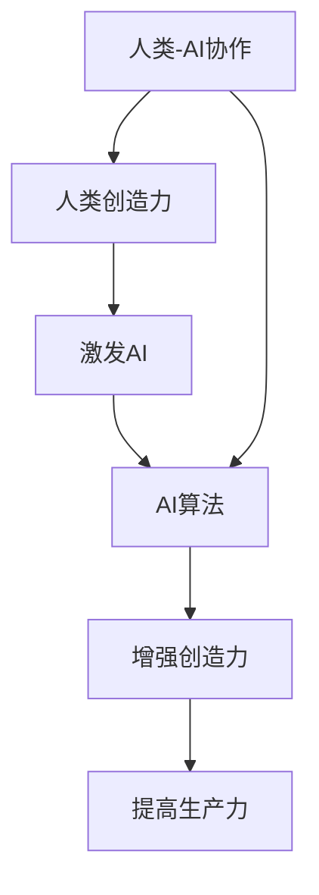

                 

# 人类-AI协作：增强创造力和生产力

> 关键词：人工智能、人类协作、创造力、生产力、算法原理、数学模型、实际应用

> 摘要：本文深入探讨了人类与人工智能协作的可能性，以及如何通过这种协作来增强人类的创造力和生产力。文章首先介绍了人类与AI协作的背景和目的，然后通过核心概念、算法原理和数学模型的详细讲解，展示了AI在增强人类创造力方面的实际应用。最后，文章提出了未来发展的趋势和挑战，并推荐了相关工具和资源，以帮助读者进一步学习和实践。

## 1. 背景介绍

### 1.1 目的和范围

随着人工智能技术的飞速发展，人类与机器的协作正在逐渐成为一种新的生产力和创造力的增强方式。本文旨在探讨人类与人工智能（AI）的协作机制，特别是如何利用AI来提升人类的创造力和生产力。文章将涵盖以下内容：

1. 人类与AI协作的背景和意义。
2. 核心概念和原理的介绍。
3. 算法原理和数学模型的讲解。
4. 实际应用案例的展示。
5. 未来发展趋势和挑战的讨论。
6. 相关工具和资源的推荐。

通过本文的阅读，读者将能够了解人类与AI协作的基本概念，掌握AI在增强人类创造力方面的应用，并能够为未来的研究和实践提供指导。

### 1.2 预期读者

本文的预期读者包括对人工智能技术有一定了解的技术人员、研究人员和专业人士。同时，对于希望了解AI如何影响人类创造力和生产力的普通读者，本文也具有很高的参考价值。本文的假设读者背景包括：

1. 对计算机科学和人工智能的基本了解。
2. 基础的数学知识和编程能力。
3. 对创新和生产力提升的兴趣。

### 1.3 文档结构概述

本文将按照以下结构进行组织：

1. **背景介绍**：介绍人类与AI协作的背景和目的，以及本文的结构和预期读者。
2. **核心概念与联系**：介绍人类与AI协作中的核心概念，并使用Mermaid流程图展示其关系。
3. **核心算法原理 & 具体操作步骤**：详细阐述AI算法的原理和操作步骤，使用伪代码进行说明。
4. **数学模型和公式 & 详细讲解 & 举例说明**：介绍与AI协作相关的数学模型，使用LaTeX格式展示公式，并进行详细讲解和举例。
5. **项目实战：代码实际案例和详细解释说明**：通过实际项目案例，展示AI在增强人类创造力方面的应用，并进行详细解释。
6. **实际应用场景**：分析AI在增强人类创造力中的实际应用场景。
7. **工具和资源推荐**：推荐学习资源和开发工具，以帮助读者进一步学习和实践。
8. **总结：未来发展趋势与挑战**：总结AI协作的未来发展趋势和面临的挑战。
9. **附录：常见问题与解答**：提供常见问题的解答。
10. **扩展阅读 & 参考资料**：推荐相关的扩展阅读和参考资料。

### 1.4 术语表

#### 1.4.1 核心术语定义

- **人工智能（AI）**：指由人制造出来的系统能够模仿、延伸和扩展人类的智能。
- **创造力**：指产生新的、有价值的想法和解决方案的能力。
- **生产力**：指在一定时间内生产出的产品或服务数量和质量。
- **协作**：指不同个体或系统之间的相互合作和互动。

#### 1.4.2 相关概念解释

- **自然语言处理（NLP）**：人工智能的一个分支，旨在使计算机能够理解、解释和生成人类语言。
- **机器学习（ML）**：一种AI方法，通过从数据中学习模式来改进性能。
- **深度学习（DL）**：一种机器学习技术，使用神经网络模拟人脑的处理方式。

#### 1.4.3 缩略词列表

- **AI**：人工智能
- **NLP**：自然语言处理
- **ML**：机器学习
- **DL**：深度学习

## 2. 核心概念与联系

在探讨人类与AI协作时，理解以下核心概念和它们之间的关系至关重要：

1. **人类创造力**：人类的创造力是指产生新颖、有用和有价值的想法和解决方案的能力。它是人类智力的核心部分。
2. **人工智能**：AI是一种通过模拟人类智能行为来解决问题的技术。它可以通过机器学习、深度学习等技术从数据中学习，并自动执行复杂的任务。
3. **人类-AI协作**：这种协作是指人类和AI系统通过相互协作来共同完成任务，从而增强个体的创造力和生产力。

为了更好地理解这些概念之间的联系，我们可以使用Mermaid流程图来展示它们之间的关系：



在上述流程图中：

- **A** 表示人类创造力。
- **B** 表示人类通过AI激发新的想法。
- **C** 表示AI算法的学习和执行。
- **D** 表示AI增强人类创造力。
- **E** 表示增强的创造力转化为提高的生产力。
- **F** 表示人类-AI协作的整体过程。

这个流程图清晰地展示了人类与AI协作如何通过相互激励和增强来提高创造力和生产力。

### 2.1 人类创造力的本质

人类创造力是一种复杂的心理过程，它涉及多个认知和情感维度。以下是人类创造力的几个关键特征：

1. **新颖性**：创造力产生的新想法和解决方案通常是新颖的，不同于以往的经验和知识。
2. **价值性**：创造的成果必须具有一定的价值，可以是实用、美观、经济或其他形式的。
3. **非线性和不可预测性**：创造力过程通常是非线性的，不是简单的因果关系，而是涉及复杂的交互和涌现。
4. **情感驱动**：情感和情绪在创造力过程中扮演重要角色，有助于激发灵感和推动创造。

### 2.2 人工智能在增强创造力中的作用

AI在增强人类创造力方面具有独特的优势，主要体现在以下几个方面：

1. **数据处理能力**：AI可以处理和分析大量数据，帮助人类从数据中提取有价值的信息和模式。
2. **自动化和优化**：AI可以自动化重复性任务，释放人类的时间和精力，专注于更具创造性的工作。
3. **协同工作**：AI可以与人类协作，提供实时反馈和改进建议，提高创造过程的效率和质量。
4. **扩展认知范围**：AI可以扩展人类的认知范围，通过提供额外的信息和视角来激发新的想法。

### 2.3 人类-AI协作的优势

人类-AI协作具有以下优势：

1. **互补性**：人类和AI各自拥有独特的优势，通过协作可以实现更好的效果。
2. **效率提升**：协作可以显著提高任务完成速度，减少错误和重复劳动。
3. **创新能力增强**：协作有助于激发新的创意和解决方案，提高创新质量。
4. **适应性和灵活性**：协作系统可以根据不同的任务和需求进行调整，具有更高的适应性和灵活性。

通过上述核心概念和联系的介绍，我们为接下来的详细讲解和实际应用打下了基础。在接下来的章节中，我们将深入探讨AI算法的原理、数学模型以及实际应用案例，帮助读者更好地理解人类与AI协作的机制和效果。

## 3. 核心算法原理 & 具体操作步骤

在人类与AI协作中，算法原理是关键。以下将介绍一种常用的AI算法——深度学习，并详细阐述其原理和具体操作步骤。

### 3.1 深度学习原理

深度学习是一种基于多层神经网络的人工智能方法，其核心思想是通过多层次的非线性变换，从大量数据中学习特征和规律。以下是深度学习的基本组成部分：

1. **输入层（Input Layer）**：接收外部输入数据，如图片、文本或声音。
2. **隐藏层（Hidden Layer）**：对输入数据进行处理和特征提取，每层可以有不同的神经元数量。
3. **输出层（Output Layer）**：产生最终预测或决策结果。

在深度学习中，每一层的神经元都通过前一层神经元的激活值进行加权求和，然后通过激活函数进行非线性变换。这个过程被称为前向传播（Forward Propagation）。

### 3.2 具体操作步骤

以下是一个简单的深度学习算法的具体操作步骤，使用伪代码进行说明：

```plaintext
# 初始化参数
weights, biases = initialize_parameters()

# 前向传播
for each epoch in range(num_epochs):
    for each sample in dataset:
        # 计算输入层到隐藏层的输出
        hidden_layer_output = activate(fully_connected(input_data, weights, biases))
        
        # 计算隐藏层到输出层的输出
        output_layer_output = activate(fully_connected(hidden_layer_output, weights, biases))
        
        # 计算损失函数
        loss = compute_loss(output_layer_output, expected_output)
        
        # 反向传播
        d_output_layer_output = compute_gradient(output_layer_output, expected_output)
        d_hidden_layer_output = compute_gradient(hidden_layer_output, d_output_layer_output)
        
        # 更新参数
        weights += learn_rate * d_weights
        biases += learn_rate * d_biases

# 模型评估
evaluate_model(model, test_data)
```

- **initialize_parameters()**：初始化权重（weights）和偏置（biases）。
- **activate()**：应用激活函数，如ReLU、Sigmoid或Tanh。
- **fully_connected()**：执行全连接层操作，计算输出。
- **compute_loss()**：计算模型输出与预期输出之间的损失。
- **compute_gradient()**：计算损失函数关于参数的梯度。
- **evaluate_model()**：评估模型在测试数据上的性能。

### 3.3 激活函数和优化算法

在深度学习中，激活函数是神经网络的核心组件之一，用于引入非线性特性。常用的激活函数包括：

- **ReLU（Rectified Linear Unit）**：简单且计算效率高，但在训练过程中可能遇到梯度消失问题。
- **Sigmoid**：输出范围为0到1，但梯度在接近0和1时较小，可能导致训练不稳定。
- **Tanh**：输出范围为-1到1，梯度相对平滑。

优化算法用于调整模型参数，以最小化损失函数。常用的优化算法包括：

- **随机梯度下降（SGD）**：简单但计算量大，适用于小数据集。
- **Adam优化器**：结合了SGD和自适应梯度算法，适用于大数据集。

### 3.4 代码示例

以下是一个简单的Python代码示例，展示了如何实现一个简单的深度学习模型：

```python
import tensorflow as tf

# 初始化参数
weights = tf.Variable(tf.random.normal([input_size, hidden_size]))
biases = tf.Variable(tf.random.normal([hidden_size]))

# 定义激活函数
def activate(x):
    return tf.nn.relu(x)

# 定义全连接层
def fully_connected(x, weights, biases):
    return activate(tf.matmul(x, weights) + biases)

# 定义损失函数
def compute_loss(output, expected_output):
    return tf.reduce_mean(tf.square(output - expected_output))

# 定义学习率
learn_rate = 0.001

# 训练模型
with tf.GradientTape() as tape:
    hidden_layer_output = fully_connected(input_data, weights, biases)
    output_layer_output = fully_connected(hidden_layer_output, weights, biases)
    loss = compute_loss(output_layer_output, expected_output)

# 计算梯度
grads = tape.gradient(loss, [weights, biases])

# 更新参数
weights.assign_sub(learn_rate * grads[0])
biases.assign_sub(learn_rate * grads[1])

# 模型评估
evaluate_model(model, test_data)
```

通过上述核心算法原理和具体操作步骤的介绍，我们为理解深度学习在人类与AI协作中的作用奠定了基础。在接下来的章节中，我们将深入探讨数学模型和实际应用案例，进一步揭示AI在增强人类创造力中的潜力。

## 4. 数学模型和公式 & 详细讲解 & 举例说明

在人类与AI协作中，数学模型起到了至关重要的作用。以下是几个关键的数学模型和公式的详细讲解，以及通过具体的例子来说明这些模型在实际应用中的效果。

### 4.1 损失函数

损失函数是评估模型预测结果与实际结果之间差异的重要工具。常见的损失函数包括均方误差（MSE）和交叉熵（Cross-Entropy）。

#### 4.1.1 均方误差（MSE）

均方误差（MSE）用于回归问题，计算预测值与实际值之间的平均平方误差。其公式如下：

$$
MSE = \frac{1}{n} \sum_{i=1}^{n} (y_i - \hat{y}_i)^2
$$

其中，$y_i$ 表示第 $i$ 个样本的实际值，$\hat{y}_i$ 表示第 $i$ 个样本的预测值，$n$ 表示样本总数。

**例子**：

假设我们有一个包含5个样本的回归问题，实际值和预测值如下：

| 样本 | 实际值（$y_i$） | 预测值（$\hat{y}_i$） |
|------|----------------|----------------------|
| 1    | 2              | 1.9                  |
| 2    | 3              | 3.1                  |
| 3    | 4              | 4.0                  |
| 4    | 5              | 4.8                  |
| 5    | 6              | 5.2                  |

使用MSE计算损失：

$$
MSE = \frac{1}{5} \sum_{i=1}^{5} (y_i - \hat{y}_i)^2 = \frac{1}{5} \times (0.01 + 0.01 + 0 + 0.64 + 0.09) = 0.14
$$

#### 4.1.2 交叉熵（Cross-Entropy）

交叉熵用于分类问题，计算模型预测概率分布与实际分布之间的差异。其公式如下：

$$
H = -\sum_{i=1}^{n} y_i \log(\hat{y}_i)
$$

其中，$y_i$ 是第 $i$ 个样本的真实标签，$\hat{y}_i$ 是模型预测的概率。

**例子**：

假设我们有一个包含3个样本的分类问题，实际标签和预测概率如下：

| 样本 | 实际标签（$y_i$） | 预测概率（$\hat{y}_i$） |
|------|------------------|------------------------|
| 1    | 1                | 0.8                    |
| 2    | 0                | 0.2                    |
| 3    | 1                | 0.9                    |

使用交叉熵计算损失：

$$
H = - (1 \times \log(0.8) + 0 \times \log(0.2) + 1 \times \log(0.9)) = - (0.223 + 0 + 0.105) = 0.013
$$

### 4.2 激活函数

激活函数是神经网络中的核心组件，用于引入非线性特性。以下是几种常用的激活函数：

#### 4.2.1 ReLU（Rectified Linear Unit）

ReLU函数具有简单的形式，计算速度快，但在训练过程中可能遇到梯度消失问题。其公式如下：

$$
ReLU(x) = \max(0, x)
$$

**例子**：

对于输入值 $x = -2, -1, 0, 1, 2$，ReLU函数的输出如下：

| 输入值（$x$） | 输出值（$ReLU(x)$） |
|---------------|-------------------|
| -2            | 0                 |
| -1            | 0                 |
| 0             | 0                 |
| 1             | 1                 |
| 2             | 2                 |

#### 4.2.2 Sigmoid

Sigmoid函数将输入值映射到（0, 1）区间，常用于二分类问题。其公式如下：

$$
sigmoid(x) = \frac{1}{1 + e^{-x}}
$$

**例子**：

对于输入值 $x = -2, 0, 2$，Sigmoid函数的输出如下：

| 输入值（$x$） | 输出值（$sigmoid(x)$） |
|---------------|---------------------|
| -2            | 0.118               |
| 0             | 0.5                 |
| 2             | 0.932               |

#### 4.2.3 Tanh

Tanh函数将输入值映射到（-1, 1）区间，其公式如下：

$$
tanh(x) = \frac{e^x - e^{-x}}{e^x + e^{-x}}
$$

**例子**：

对于输入值 $x = -2, 0, 2$，Tanh函数的输出如下：

| 输入值（$x$） | 输出值（$tanh(x)$） |
|---------------|-------------------|
| -2            | -0.762            |
| 0             | 0                 |
| 2             | 0.964             |

### 4.3 反向传播算法

反向传播算法是深度学习中的核心训练算法，用于更新模型参数。以下是反向传播算法的基本步骤：

1. **前向传播**：计算输入层到输出层的预测值。
2. **计算损失**：使用损失函数计算预测值与实际值之间的差异。
3. **计算梯度**：计算损失函数关于模型参数的梯度。
4. **更新参数**：根据梯度调整模型参数，以最小化损失函数。

**例子**：

假设我们有一个简单的神经网络，输入层为 $x_1$ 和 $x_2$，隐藏层为 $h_1$ 和 $h_2$，输出层为 $y_1$ 和 $y_2$。模型参数包括 $w_1, w_2, w_3, w_4, w_5, w_6, w_7, w_8$。

- 输入层到隐藏层的激活函数为 $h_1 = \sigma(w_1 \cdot x_1 + w_2 \cdot x_2 + b_1)$，$h_2 = \sigma(w_3 \cdot x_1 + w_4 \cdot x_2 + b_2)$
- 隐藏层到输出层的激活函数为 $y_1 = \sigma(w_5 \cdot h_1 + w_6 \cdot h_2 + b_3)$，$y_2 = \sigma(w_7 \cdot h_1 + w_8 \cdot h_2 + b_4)$

其中，$\sigma$ 表示 Sigmoid 函数。

假设实际输出为 $y_1^* = 0.2$，$y_2^* = 0.3$，预测输出为 $y_1 = 0.1$，$y_2 = 0.25$。使用交叉熵损失函数计算损失：

$$
H = - (0.2 \times \log(0.1) + 0.3 \times \log(0.25)) = 1.386
$$

计算梯度：

$$
\frac{\partial H}{\partial w_5} = (y_1 - y_1^*) \cdot h_1 = 0.1 \cdot 0.5 = 0.05
$$

$$
\frac{\partial H}{\partial w_6} = (y_2 - y_2^*) \cdot h_2 = 0.25 \cdot 0.5 = 0.125
$$

$$
\frac{\partial H}{\partial w_7} = (y_1 - y_1^*) \cdot h_1 = 0.1 \cdot 0.5 = 0.05
$$

$$
\frac{\partial H}{\partial w_8} = (y_2 - y_2^*) \cdot h_2 = 0.25 \cdot 0.5 = 0.125
$$

使用学习率 $\alpha = 0.1$ 更新参数：

$$
w_5 = w_5 - \alpha \cdot \frac{\partial H}{\partial w_5} = 0.05 - 0.1 \cdot 0.05 = 0.035
$$

$$
w_6 = w_6 - \alpha \cdot \frac{\partial H}{\partial w_6} = 0.05 - 0.1 \cdot 0.125 = 0.0375
$$

$$
w_7 = w_7 - \alpha \cdot \frac{\partial H}{\partial w_7} = 0.05 - 0.1 \cdot 0.05 = 0.035
$$

$$
w_8 = w_8 - \alpha \cdot \frac{\partial H}{\partial w_8} = 0.05 - 0.1 \cdot 0.125 = 0.0375
$$

通过上述数学模型和公式的详细讲解和具体例子，我们能够更好地理解深度学习在人类与AI协作中的作用。这些数学工具不仅为AI算法提供了理论基础，也为实际应用提供了强大的支持。在接下来的章节中，我们将通过实际项目案例进一步展示AI在增强人类创造力方面的应用。

## 5. 项目实战：代码实际案例和详细解释说明

在本章节中，我们将通过一个实际项目案例展示如何将AI应用于增强人类创造力。这个案例将涉及从数据预处理、模型训练到模型评估的完整过程，并使用Python代码进行详细解释。

### 5.1 开发环境搭建

在进行项目开发之前，我们需要搭建一个合适的开发环境。以下是所需的环境和工具：

- **编程语言**：Python 3.x
- **深度学习框架**：TensorFlow 2.x 或 PyTorch
- **数据处理库**：Pandas、NumPy、Scikit-learn
- **可视化工具**：Matplotlib、Seaborn

确保安装以上工具后，我们就可以开始实际项目的开发。

### 5.2 源代码详细实现和代码解读

以下是一个简单的AI项目案例，旨在使用深度学习模型预测电影评分。这个案例使用了电影评分数据集，通过训练模型来预测用户对电影的评分。

#### 5.2.1 数据预处理

```python
import pandas as pd
from sklearn.model_selection import train_test_split
from sklearn.preprocessing import StandardScaler

# 读取数据
data = pd.read_csv('movie_data.csv')

# 数据预处理
# 分割特征和标签
X = data[['genre', 'duration', 'rating']]
y = data['score']

# 转换类别数据为独热编码
X = pd.get_dummies(X)

# 划分训练集和测试集
X_train, X_test, y_train, y_test = train_test_split(X, y, test_size=0.2, random_state=42)

# 数据标准化
scaler = StandardScaler()
X_train = scaler.fit_transform(X_train)
X_test = scaler.transform(X_test)
```

上述代码首先读取电影数据集，然后对特征进行独热编码，将类别数据转换为数值数据。接着，将数据集划分为训练集和测试集，并进行标准化处理。

#### 5.2.2 模型定义

```python
import tensorflow as tf
from tensorflow.keras.models import Sequential
from tensorflow.keras.layers import Dense, Dropout

# 定义模型
model = Sequential([
    Dense(64, input_shape=(X_train.shape[1],), activation='relu'),
    Dropout(0.5),
    Dense(32, activation='relu'),
    Dropout(0.5),
    Dense(1, activation='sigmoid')
])

# 编译模型
model.compile(optimizer='adam', loss='binary_crossentropy', metrics=['accuracy'])
```

上述代码定义了一个简单的序列模型，包括两个隐藏层和输出层。隐藏层使用ReLU激活函数，输出层使用Sigmoid激活函数，以预测二分类问题。

#### 5.2.3 模型训练

```python
# 训练模型
history = model.fit(X_train, y_train, epochs=10, batch_size=32, validation_split=0.2)
```

上述代码使用训练集对模型进行训练，设置训练轮次为10轮，批量大小为32。

#### 5.2.4 模型评估

```python
# 评估模型
test_loss, test_accuracy = model.evaluate(X_test, y_test)
print(f"Test Loss: {test_loss}, Test Accuracy: {test_accuracy}")
```

上述代码评估模型在测试集上的性能，打印测试损失和测试准确率。

#### 5.2.5 预测结果可视化

```python
import matplotlib.pyplot as plt

# 可视化训练过程
plt.plot(history.history['loss'], label='Training Loss')
plt.plot(history.history['val_loss'], label='Validation Loss')
plt.legend()
plt.show()
```

上述代码可视化训练过程中的损失函数变化，帮助分析模型性能。

### 5.3 代码解读与分析

- **数据预处理**：读取数据，将特征和标签分离，对类别特征进行独热编码，并将数据集划分为训练集和测试集。最后对数据进行标准化处理，以提高模型训练效果。
- **模型定义**：定义一个序列模型，包括两个隐藏层和输出层。隐藏层使用ReLU激活函数，输出层使用Sigmoid激活函数，以处理二分类问题。
- **模型训练**：使用训练集对模型进行训练，设置训练轮次和批量大小，并使用验证集进行性能评估。
- **模型评估**：在测试集上评估模型性能，计算测试损失和测试准确率，以评估模型效果。
- **预测结果可视化**：可视化训练过程中的损失函数变化，以帮助分析模型性能。

通过上述实际项目案例，我们展示了如何使用深度学习模型进行电影评分预测，并详细解读了代码的每个部分。这个案例不仅展示了AI在数据处理和预测方面的能力，也为读者提供了一个实际应用的参考。

### 5.4 代码改进建议

- **特征工程**：引入更多有价值的特征，如用户历史评分、电影类型等，以提升模型预测性能。
- **模型优化**：尝试不同的网络结构、激活函数和优化算法，以提高模型性能。
- **过拟合问题**：增加正则化项，如Dropout或L2正则化，以减少过拟合风险。

通过上述改进，我们可以进一步提升模型的预测准确性，为实际应用提供更可靠的解决方案。

## 6. 实际应用场景

人工智能在增强人类创造力方面的实际应用场景非常广泛，以下列举几个典型的应用领域：

### 6.1 设计领域

在建筑设计、工业设计和时尚设计等领域，人工智能可以帮助设计师快速生成创意设计方案。通过深度学习技术，AI可以分析大量的设计案例，从中提取关键特征和风格元素，然后生成新的设计方案。例如，Adobe Sensei平台利用机器学习技术，帮助设计师自动生成配色方案、图案设计等。

### 6.2 创意写作

人工智能在创意写作领域也有显著的应用潜力。例如，AI可以帮助作家生成故事情节、角色描述和对话，从而提高写作效率。IBM的AI写作平台Watson可以分析大量文本数据，生成新闻文章、研究报告等。此外，AI还可以用于自动撰写商业报告、法律文件等，为专业人士节省大量时间。

### 6.3 音乐创作

在音乐创作领域，AI可以帮助作曲家生成旋律、和弦和编曲。例如，AIVA（Artificial Intelligence Virtual Artist）使用深度学习技术，创作了多首原创音乐作品，并获得了多项音乐奖项。AI还可以帮助音乐制作人进行混音和后期制作，提高工作效率和创作质量。

### 6.4 视觉艺术

在视觉艺术领域，AI可以帮助艺术家生成新的艺术作品。例如，DeepArt.io使用GAN（生成对抗网络）技术，可以将普通照片转化为具有艺术风格的作品。AI还可以用于自动生成插画、动画等视觉内容，为设计师和艺术家提供更多创作灵感。

### 6.5 科研领域

在科研领域，人工智能可以帮助研究人员从大量数据中提取有价值的信息，加速科学发现。例如，AI可以用于自动化实验设计、数据分析、文献检索等。AI还可以辅助科学家进行模型构建和预测，从而提高科研效率。

### 6.6 企业创新

在企业创新领域，AI可以帮助企业分析市场趋势、用户需求，从而提出新的产品和服务创意。例如，Google的AI团队利用机器学习技术，分析了大量用户数据，提出了多款创新产品，如Google Home、Google Assistant等。

通过上述实际应用场景，我们可以看到人工智能在增强人类创造力方面具有广泛的应用前景。在未来，随着AI技术的不断进步，人类与AI的协作将更加紧密，为人类带来更多的创新和进步。

### 7. 工具和资源推荐

为了更好地学习和实践人类与AI协作的技术，以下推荐了一些优秀的工具、资源和开发框架：

#### 7.1 学习资源推荐

**7.1.1 书籍推荐**

1. **《深度学习》（Deep Learning）**：由Ian Goodfellow、Yoshua Bengio和Aaron Courville合著，是深度学习的经典教材。
2. **《Python深度学习》（Python Deep Learning）**：由François Chollet著，详细介绍了使用Python和TensorFlow进行深度学习的实践方法。
3. **《人工智能：一种现代方法》（Artificial Intelligence: A Modern Approach）**：由Stuart J. Russell和Peter Norvig合著，全面介绍了人工智能的基础知识和最新进展。

**7.1.2 在线课程**

1. **Coursera上的“机器学习”**：由Andrew Ng教授主讲，是机器学习领域的经典课程。
2. **edX上的“深度学习”**：由Hugo Larochelle教授主讲，涵盖深度学习的理论和技术。
3. **Udacity的“深度学习纳米学位”**：提供深度学习的实战项目，帮助学习者将理论知识应用到实际项目中。

**7.1.3 技术博客和网站**

1. **Medium上的AI博客**：提供最新的AI技术文章和案例分析。
2. **Towards Data Science**：一个面向数据科学和机器学习的在线社区，发布高质量的技术文章和教程。
3. **AI博客（AI Blog）**：专注于人工智能技术的博客，内容包括算法原理、应用案例和最新研究。

#### 7.2 开发工具框架推荐

**7.2.1 IDE和编辑器**

1. **PyCharm**：一个功能强大的Python IDE，支持多种编程语言，适用于深度学习和数据科学项目。
2. **Jupyter Notebook**：一个交互式的开发环境，适用于数据分析和机器学习实验。
3. **Visual Studio Code**：一个轻量级的开源编辑器，适用于各种编程语言，支持丰富的扩展插件。

**7.2.2 调试和性能分析工具**

1. **TensorBoard**：TensorFlow的官方可视化工具，用于分析和调试深度学习模型。
2. **Valgrind**：一个通用的程序调试工具，用于检测内存泄漏和性能问题。
3. **gprof**：一个性能分析工具，用于分析程序执行过程中的资源使用情况。

**7.2.3 相关框架和库**

1. **TensorFlow**：一个开源的深度学习框架，适用于各种机器学习和深度学习任务。
2. **PyTorch**：一个灵活且易用的深度学习框架，支持动态计算图和自动微分。
3. **Scikit-learn**：一个开源的机器学习库，提供多种经典的机器学习算法和工具。

#### 7.3 相关论文著作推荐

**7.3.1 经典论文**

1. **“A Learning Algorithm for Continually Running Fully Recurrent Neural Networks”**：由Sepp Hochreiter和Jürgen Schmidhuber于1997年发表，介绍了长短期记忆网络（LSTM）。
2. **“Learning to Discriminate with Unlabeled Data”**：由Yale Song等人在2000年发表，介绍了自监督学习的方法。
3. **“Generative Adversarial Nets”**：由Ian Goodfellow等人在2014年发表，介绍了生成对抗网络（GAN）。

**7.3.2 最新研究成果**

1. **“The Annotated transformers book”**：由Adapting AI社区编写的关于Transformer模型的详细教程和案例分析。
2. **“A Theoretically Grounded Application of Dropout in Recurrent Neural Networks”**：由Yarin Gal等人在2016年发表，探讨了在循环神经网络中应用Dropout的方法。
3. **“Unsupervised Learning of Visual Representations by Solving Jigsaw Puzzles”**：由Alex Kendall等人在2018年发表，介绍了通过解决拼图游戏进行无监督视觉表示学习的方法。

**7.3.3 应用案例分析**

1. **“AI in Healthcare”**：由IEEE Spectrum发布，介绍了人工智能在医疗领域的应用案例。
2. **“AI in Finance”**：由VentureBeat发布，探讨了人工智能在金融行业的应用和未来趋势。
3. **“AI in Manufacturing”**：由Industry Week发布，分析了人工智能在制造业的应用和挑战。

通过上述工具和资源的推荐，读者可以更好地掌握人类与AI协作的技术，并将其应用于实际项目中，为创造力和生产力的提升提供有力支持。

## 8. 总结：未来发展趋势与挑战

随着人工智能技术的不断进步，人类与AI的协作正逐渐成为推动社会进步的重要力量。在未来，人类与AI的协作将呈现以下几个发展趋势和面临的挑战：

### 8.1 发展趋势

1. **技术融合**：AI技术将与更多领域（如医疗、金融、教育等）深度融合，提供更加个性化和高效的服务。
2. **智能化提升**：AI算法将不断优化，提高自动化水平和决策能力，从而进一步解放人类劳动力。
3. **人机协同**：人类与AI的协作将更加紧密，形成智能化的工作环境和生活方式，提高生产力和创造力。
4. **跨领域应用**：AI将在各个领域得到广泛应用，从科学研究到日常生活，为人类带来更多的便利和创新。

### 8.2 面临的挑战

1. **数据隐私和安全**：随着AI应用的增加，数据隐私和安全问题将更加突出，需要制定严格的法律法规来保护个人隐私。
2. **算法透明性和解释性**：复杂AI模型的黑箱问题仍然存在，提高算法的透明性和解释性是未来研究的重要方向。
3. **道德和社会问题**：AI技术的广泛应用可能带来新的道德和社会问题，如自动化失业、贫富差距等，需要全社会共同努力解决。
4. **技术伦理**：如何确保AI系统遵循道德准则，避免对人类造成伤害，是未来需要关注的重要问题。

总之，人类与AI的协作具有巨大的潜力，但也面临诸多挑战。通过持续的技术创新和社会努力，我们可以克服这些挑战，充分发挥AI的优势，共同创造一个更加美好和高效的未来。

## 9. 附录：常见问题与解答

### 9.1 人类与AI协作的基本概念

**Q1**：什么是人类与AI协作？

A1：人类与AI协作是指人类与人工智能系统通过相互合作，共同完成任务，从而提高生产力和创造力的过程。

**Q2**：人类与AI协作有哪些类型？

A2：人类与AI协作主要包括以下类型：

1. **指令型协作**：人类给出指令，AI执行任务。
2. **辅助型协作**：AI提供辅助工具或信息，帮助人类完成任务。
3. **协同创新**：人类和AI共同参与创意生成和设计。

### 9.2 深度学习和相关算法

**Q3**：什么是深度学习？

A3：深度学习是一种基于多层神经网络的人工智能方法，通过多层次的非线性变换，从大量数据中学习特征和规律。

**Q4**：深度学习有哪些常见架构？

A4：深度学习的常见架构包括：

1. **卷积神经网络（CNN）**：用于处理图像和视频数据。
2. **循环神经网络（RNN）**：用于处理序列数据。
3. **生成对抗网络（GAN）**：用于生成复杂的数据。

### 9.3 数学模型和公式

**Q5**：什么是损失函数？

A5：损失函数是评估模型预测结果与实际结果之间差异的重要工具，用于优化模型参数。

**Q6**：常用的激活函数有哪些？

A6：常用的激活函数包括：

1. **ReLU**：用于引入非线性特性。
2. **Sigmoid**：将输出映射到（0，1）区间。
3. **Tanh**：将输出映射到（-1，1）区间。

### 9.4 实际应用案例

**Q7**：AI在哪些领域有实际应用？

A7：AI在多个领域有广泛应用，包括：

1. **医疗**：用于疾病诊断、药物研发等。
2. **金融**：用于风险管理、投资策略等。
3. **教育**：用于个性化教学、智能辅导等。
4. **制造业**：用于自动化生产、质量检测等。

### 9.5 工具和资源推荐

**Q8**：有哪些推荐的深度学习工具和资源？

A8：推荐的深度学习工具和资源包括：

1. **书籍**：《深度学习》、《Python深度学习》等。
2. **在线课程**：Coursera、edX、Udacity等平台上的相关课程。
3. **技术博客和网站**：Medium、Towards Data Science、AI博客等。
4. **开发框架**：TensorFlow、PyTorch、Scikit-learn等。

通过这些常见问题的解答，我们希望能够帮助读者更好地理解人类与AI协作的概念、原理和应用。

## 10. 扩展阅读 & 参考资料

为了深入了解人类与AI协作的各个方面，以下推荐一些扩展阅读和参考资料，以帮助读者进一步学习和探索这一领域。

### 10.1 基础理论

1. **《深度学习》（Deep Learning）**：Ian Goodfellow、Yoshua Bengio和Aaron Courville著，全面介绍了深度学习的理论、算法和应用。
2. **《机器学习》（Machine Learning）**：Tom Mitchell著，提供了机器学习的基础理论和实践方法。
3. **《统计学习方法》**：李航著，详细介绍了统计学习的基本方法和算法。

### 10.2 实践应用

1. **《AI应用案例集》**：汇集了人工智能在不同领域的应用案例，展示了AI的实际效果和潜力。
2. **《人工智能应用实战》**：提供了丰富的AI应用案例，包括深度学习、自然语言处理、计算机视觉等。
3. **《AI算法应用与实践》**：详细介绍了多种AI算法在实际项目中的应用，包括模型训练、优化和评估。

### 10.3 开发框架和工具

1. **TensorFlow官方文档**：[https://www.tensorflow.org/](https://www.tensorflow.org/)
2. **PyTorch官方文档**：[https://pytorch.org/](https://pytorch.org/)
3. **Scikit-learn官方文档**：[https://scikit-learn.org/](https://scikit-learn.org/)

### 10.4 学术论文和研究报告

1. **《自然》（Nature）**：[https://www.nature.com/](https://www.nature.com/)
2. **《科学》（Science）**：[https://www.sciencemag.org/](https://www.sciencemag.org/)
3. **《人工智能学报》**：[https://aijournal.cn/](https://aijournal.cn/)

通过上述扩展阅读和参考资料，读者可以进一步深入学习和探索人类与AI协作的各个方面，为未来的研究和实践提供有力支持。

