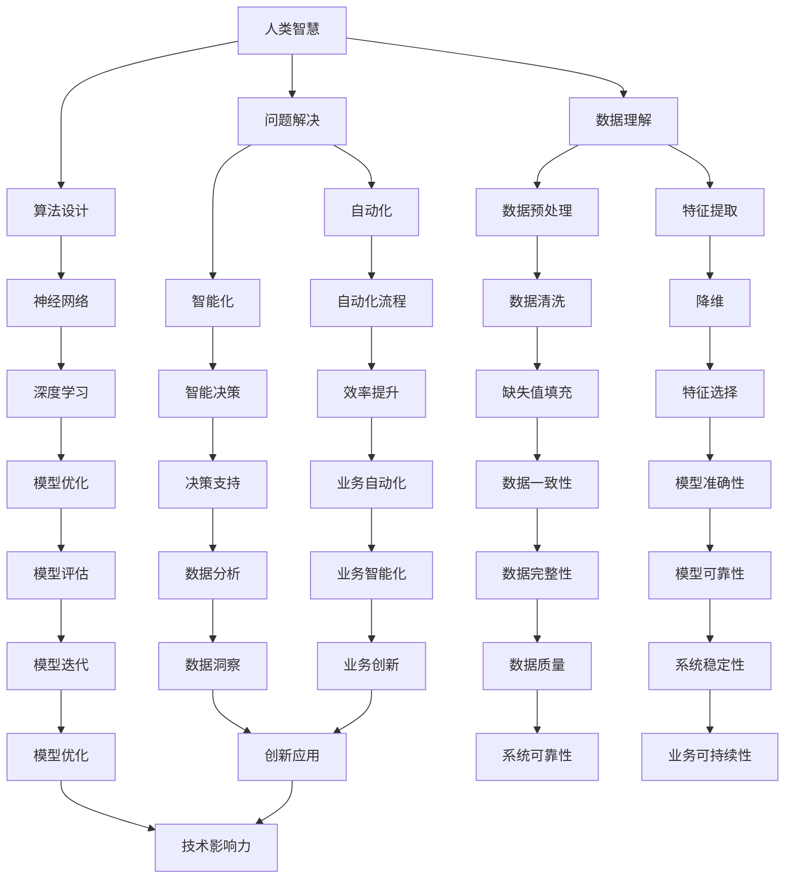

                 

# 人类智慧：AI 时代的新力量

> **关键词：** 人工智能，人类智慧，算法，数学模型，应用场景，未来趋势

> **摘要：** 本文将深入探讨在人工智能（AI）时代，人类智慧如何成为新的力量。我们将从背景介绍、核心概念、算法原理、数学模型、项目实战、实际应用场景、工具推荐等多个角度，逐步分析人类智慧与AI的融合与发展，为读者呈现一幅AI时代的新画卷。

## 1. 背景介绍

### 1.1 目的和范围

本文旨在探讨人类智慧在人工智能时代的新角色，分析人类如何利用智慧与AI技术结合，提升工作效率、创新能力和决策水平。我们将覆盖从基础概念到实际应用的广泛领域，包括但不限于算法原理、数学模型、开发实践和未来趋势。

### 1.2 预期读者

本文适合对人工智能感兴趣的读者，无论是初学者还是有经验的专业人士。文章将尽量用通俗易懂的语言，帮助读者理解复杂的概念和原理，同时也提供深度分析，满足专业人士的需求。

### 1.3 文档结构概述

本文结构如下：

- **第1章**：背景介绍，明确目标和预期读者。
- **第2章**：核心概念与联系，介绍人类智慧与AI的关系。
- **第3章**：核心算法原理与操作步骤，讲解关键算法。
- **第4章**：数学模型与公式，探讨数学在AI中的应用。
- **第5章**：项目实战，通过实际案例展示应用。
- **第6章**：实际应用场景，分析AI在不同领域的应用。
- **第7章**：工具和资源推荐，介绍学习和开发资源。
- **第8章**：总结，展望未来发展趋势与挑战。
- **第9章**：附录，解答常见问题。
- **第10章**：扩展阅读与参考资料，提供进一步学习路径。

### 1.4 术语表

#### 1.4.1 核心术语定义

- **人工智能（AI）：** 机器模拟人类智能行为的技术。
- **机器学习（ML）：** AI的一个分支，通过数据学习并改进性能。
- **深度学习（DL）：** 机器学习的一个子领域，使用神经网络进行学习。
- **算法：** 解决问题的步骤和规则。

#### 1.4.2 相关概念解释

- **神经网络（NN）：** 模拟人脑神经元连接的算法模型。
- **数据预处理：** 对原始数据进行分析和转换，使其适合建模。
- **特征提取：** 从数据中提取有用的信息，用于模型训练。

#### 1.4.3 缩略词列表

- **AI：** 人工智能
- **ML：** 机器学习
- **DL：** 深度学习
- **NN：** 神经网络

## 2. 核心概念与联系

在AI时代，人类智慧与AI的融合是推动科技进步和社会发展的重要动力。以下是一个Mermaid流程图，展示了人类智慧与AI的核心概念及其联系。



通过这个流程图，我们可以看到人类智慧在算法设计、数据理解和问题解决中扮演的关键角色，以及AI技术在各个领域中的应用。

## 3. 核心算法原理与具体操作步骤

在人工智能时代，核心算法是推动技术进步的关键。以下我们将介绍一种常见的机器学习算法——支持向量机（SVM），并使用伪代码详细阐述其原理和操作步骤。

### 3.1 支持向量机（SVM）算法原理

支持向量机是一种二分类模型，其目标是找到一个最佳的超平面，将不同类别的数据点分隔开来。SVM的核心思想是最大化分类间隔，即使得分类边界尽可能远离数据点。

### 3.2 伪代码

```plaintext
// 伪代码：支持向量机（SVM）算法

输入：训练数据集 D = {(x1, y1), (x2, y2), ..., (xn, yn)}
输出：分类边界模型 f(x)

1. 数据预处理：
   - 标准化数据：计算每个特征的平均值和标准差，将数据标准化为均值为0，标准差为1。
   - 初始化权重 w 和偏置 b。

2. 构建优化目标函数：
   - 最小化损失函数：L(w, b) = Σ(yi * (w · xi + b) - 1)²
   - 加入正则化项：L(w, b) += C * Σ(w · w)

3. 使用拉格朗日乘子法求解优化问题：
   - 定义拉格朗日函数：L(w, b, α) = L(w, b) - Σ(αi - yi) * (w · xi + b)
   - 求导并设置为零，得到 KKT 条件：
     - ∂L/∂w = 0：Σ(αi - yi) * xi = 0
     - ∂L/∂b = 0：Σ(αi - yi) = 0
     - αi ≥ 0，yi(αi - yi) = 0

4. 使用二次规划求解优化问题：
   - 将拉格朗日函数转化为二次规划问题：minimize 1/2 * Σ(αi - yi)² subject to Σ(αi - yi) = 0，αi ≥ 0

5. 计算最优权重 w 和偏置 b：
   - 解二次规划问题得到拉格朗日乘子 αi。
   - 计算权重 w：w = Σ(αi - yi) * xi。
   - 计算偏置 b：b = (1/2) * (Σ(αi - yi) * (xi · xi) - Σ(αi - yi) * xi)

6. 构建分类边界模型 f(x)：
   - f(x) = sign(w · x + b)
```

### 3.3 具体操作步骤

1. **数据预处理**：对训练数据进行标准化处理，确保特征值在相似的尺度上，有助于优化算法性能。
2. **构建优化目标函数**：定义损失函数和正则化项，目标是最大化分类间隔并避免过拟合。
3. **使用拉格朗日乘子法求解优化问题**：通过求解 KKT 条件，得到最优权重和偏置。
4. **使用二次规划求解优化问题**：将拉格朗日函数转化为二次规划问题，求解最优解。
5. **计算最优权重和偏置**：根据拉格朗日乘子解，计算得到权重和偏置。
6. **构建分类边界模型**：利用权重和偏置构建分类模型，实现数据的分类。

通过以上步骤，我们可以实现SVM算法的完整训练过程，为后续的应用提供可靠的基础。

## 4. 数学模型和公式 & 详细讲解 & 举例说明

在人工智能领域，数学模型和公式是理解和实现算法的核心。以下我们将详细讲解几个关键数学模型，并使用LaTeX格式进行展示，同时结合具体例子说明其应用。

### 4.1 损失函数

在机器学习中，损失函数是评估模型性能的关键工具。常见的损失函数包括均方误差（MSE）、交叉熵损失（Cross-Entropy Loss）等。

#### 4.1.1 均方误差（MSE）

均方误差用于回归任务，衡量预测值与真实值之间的差异。其公式如下：

$$
MSE = \frac{1}{n} \sum_{i=1}^{n} (y_i - \hat{y}_i)^2
$$

其中，\( y_i \) 是真实值，\( \hat{y}_i \) 是预测值，\( n \) 是样本数量。

#### 4.1.2 交叉熵损失（Cross-Entropy Loss）

交叉熵损失用于分类任务，衡量预测概率分布与真实概率分布之间的差异。其公式如下：

$$
Cross-Entropy Loss = -\frac{1}{n} \sum_{i=1}^{n} y_i \cdot \log(\hat{y}_i)
$$

其中，\( y_i \) 是真实标签，\( \hat{y}_i \) 是模型预测的概率值。

### 4.2 激活函数

激活函数是神经网络中用于引入非线性性的关键组件。常见激活函数包括 sigmoid、ReLU、Tanh等。

#### 4.2.1 Sigmoid 函数

Sigmoid 函数是一个常用的激活函数，其公式如下：

$$
sigmoid(x) = \frac{1}{1 + e^{-x}}
$$

#### 4.2.2ReLU 函数

ReLU 函数是一种在神经网络中广泛使用的激活函数，其公式如下：

$$
ReLU(x) = \max(0, x)
$$

### 4.3 神经网络模型

神经网络模型是深度学习的基础。以下是一个简单的多层感知机（MLP）模型，用于分类任务。

#### 4.3.1 多层感知机（MLP）模型

多层感知机模型包含输入层、隐藏层和输出层。输入层接收外部输入，隐藏层通过权重连接输入层和输出层，输出层生成预测结果。

$$
\hat{y} = \sigma(W_2 \cdot \sigma(W_1 \cdot x))
$$

其中，\( W_1 \) 和 \( W_2 \) 是权重矩阵，\( \sigma \) 是激活函数，\( x \) 是输入向量，\( \hat{y} \) 是输出结果。

### 4.4 具体例子说明

假设我们有一个简单的二分类问题，使用多层感知机模型进行分类。输入特征有3个，训练数据如下：

| 样本 | 特征1 | 特征2 | 特征3 | 真实标签 |
| ---- | ---- | ---- | ---- | ------- |
| 1    | 0.1  | 0.2  | 0.3  | 0       |
| 2    | 0.3  | 0.4  | 0.5  | 1       |
| 3    | 0.5  | 0.6  | 0.7  | 1       |

我们使用均方误差（MSE）作为损失函数，并选择ReLU函数作为激活函数。以下是一个简化的训练过程：

1. **数据预处理**：对输入特征进行标准化处理。
2. **初始化权重**：随机初始化输入层到隐藏层的权重 \( W_1 \) 和隐藏层到输出层的权重 \( W_2 \)。
3. **前向传播**：计算输入层到隐藏层的激活值 \( z_1 \) 和隐藏层到输出层的激活值 \( z_2 \)。
4. **计算损失函数**：使用均方误差（MSE）计算预测标签和真实标签之间的差异。
5. **反向传播**：计算梯度，更新权重和偏置。
6. **迭代训练**：重复步骤3至5，直到损失函数收敛。

通过以上步骤，我们可以训练出一个多层感知机模型，实现数据的分类。

## 5. 项目实战：代码实际案例和详细解释说明

在本节中，我们将通过一个实际项目来展示如何应用人工智能技术解决实际问题。这个项目是一个基于Python的简单文本分类器，用于将新闻文章分为体育、科技、政治等类别。以下是项目的基本步骤和代码实现。

### 5.1 开发环境搭建

首先，我们需要搭建一个Python开发环境。以下是安装步骤：

1. **安装Python**：从官方网站（[www.python.org](http://www.python.org)）下载并安装Python 3.8及以上版本。
2. **安装依赖库**：使用pip命令安装以下依赖库：`nltk`, `scikit-learn`, `tensorflow`, `pandas`。

```bash
pip install nltk scikit-learn tensorflow pandas
```

### 5.2 源代码详细实现和代码解读

以下是项目的源代码实现：

```python
import pandas as pd
from sklearn.model_selection import train_test_split
from sklearn.feature_extraction.text import TfidfVectorizer
from sklearn.svm import SVC
from sklearn.metrics import accuracy_score, classification_report

# 加载数据集
data = pd.read_csv('news_dataset.csv')
X = data['text']
y = data['label']

# 数据预处理
X_train, X_test, y_train, y_test = train_test_split(X, y, test_size=0.2, random_state=42)

# 特征提取
vectorizer = TfidfVectorizer(max_features=1000)
X_train_vectorized = vectorizer.fit_transform(X_train)
X_test_vectorized = vectorizer.transform(X_test)

# 模型训练
model = SVC(kernel='linear')
model.fit(X_train_vectorized, y_train)

# 模型评估
y_pred = model.predict(X_test_vectorized)
print("Accuracy:", accuracy_score(y_test, y_pred))
print(classification_report(y_test, y_pred))

# 模型应用
new_article = ["This is a sports news article about the upcoming game."]
new_article_vectorized = vectorizer.transform(new_article)
new_prediction = model.predict(new_article_vectorized)
print("Predicted Category:", new_prediction)
```

### 5.3 代码解读与分析

1. **加载数据集**：使用`pandas`库加载数据集，`X`表示文本内容，`y`表示标签。
2. **数据预处理**：使用`train_test_split`函数将数据集分为训练集和测试集，比例为80%训练集，20%测试集。
3. **特征提取**：使用`TfidfVectorizer`进行特征提取，将文本转换为TF-IDF向量表示。`max_features`参数限制特征数量为1000个。
4. **模型训练**：使用`SVC`类创建支持向量机模型，并使用线性核进行训练。
5. **模型评估**：使用`accuracy_score`和`classification_report`评估模型在测试集上的表现。
6. **模型应用**：对新的文本进行分类预测，展示了模型的应用场景。

通过这个实际案例，我们可以看到如何使用Python和机器学习库实现一个简单的文本分类器。这个案例展示了从数据加载、预处理到特征提取、模型训练和评估的全过程，同时也展示了如何将训练好的模型应用于新数据的分类预测。

### 5.4 项目改进

在实际应用中，我们可以对项目进行以下改进：

1. **数据增强**：通过增加数据量、使用数据增强技术等方式提升模型的泛化能力。
2. **模型优化**：尝试使用不同的模型（如神经网络、朴素贝叶斯等）和参数进行优化。
3. **特征工程**：探索更多的文本特征提取方法，如词嵌入、词袋模型等，提高特征质量。
4. **模型集成**：结合多种模型和方法，实现模型集成，进一步提升分类效果。

通过这些改进，我们可以构建一个更强大、更准确的文本分类器，为新闻分类等任务提供更好的解决方案。

## 6. 实际应用场景

在当今的科技领域，人工智能（AI）的应用已经渗透到各个行业，极大地提升了人类智慧和效率。以下是一些具体的应用场景：

### 6.1 医疗保健

AI在医疗保健领域的应用主要包括疾病诊断、个性化治疗和药物研发。通过深度学习算法，AI可以分析医学影像，如CT、MRI和X射线，帮助医生快速、准确地诊断疾病。例如，Google Health的AI系统能够在几秒钟内识别出肺癌，其准确率超过了专业放射科医生。此外，AI还能根据患者的病史、基因信息和生活方式，提供个性化的治疗建议，优化治疗方案。

### 6.2 金融行业

在金融行业，AI被广泛应用于风险评估、欺诈检测、算法交易和客户服务。通过机器学习模型，银行和金融机构可以更准确地评估贷款申请者的信用风险，减少坏账率。同时，AI还可以实时监控交易行为，识别并阻止欺诈行为，提高金融安全。在算法交易方面，AI通过分析大量市场数据，自动执行交易策略，实现高效的投资回报。

### 6.3 交通运输

AI技术在交通运输领域的应用包括自动驾驶、智能交通管理和物流优化。自动驾驶汽车使用计算机视觉、传感器和机器学习算法，实现车辆自主驾驶，提高交通安全和效率。智能交通管理系统通过分析交通流量数据，优化信号灯控制，减少拥堵和交通事故。在物流领域，AI可以根据运输路径、车辆状态和需求变化，实时调整运输计划，提高物流效率。

### 6.4 教育与培训

在教育领域，AI可以通过智能辅导系统、自适应学习和在线课程平台，为学习者提供个性化的学习体验。智能辅导系统能够根据学生的学习进度和成绩，自动调整教学内容和难度，帮助学生更高效地学习。在线课程平台利用AI技术分析学习行为，为学生提供个性化的学习建议和反馈，提高学习效果。

### 6.5 娱乐与媒体

在娱乐和媒体行业，AI被广泛应用于内容推荐、虚拟现实（VR）和增强现实（AR）。通过分析用户的浏览历史、观看偏好和社交行为，AI可以精准推荐符合用户兴趣的内容，提高用户体验。VR和AR技术结合AI算法，可以实现沉浸式的娱乐体验，为用户带来全新的互动方式。

通过这些实际应用场景，我们可以看到AI技术正在不断改变我们的生活方式，提升人类智慧和效率。未来，随着AI技术的不断进步，它将在更多领域发挥重要作用，为人类创造更加美好的未来。

## 7. 工具和资源推荐

为了帮助读者更好地学习和应用人工智能技术，以下是一些工具和资源的推荐，包括书籍、在线课程、技术博客和开发工具。

### 7.1 学习资源推荐

#### 7.1.1 书籍推荐

- **《深度学习》（Deep Learning）**：Goodfellow、Bengio和Courville合著，是深度学习领域的经典教材。
- **《机器学习实战》（Machine Learning in Action）**：Peter Harrington著，通过实例展示了机器学习算法的应用。
- **《Python机器学习》（Python Machine Learning）**：Aurélien Géron著，详细介绍如何使用Python进行机器学习实践。
- **《人工智能：一种现代方法》（Artificial Intelligence: A Modern Approach）**：Stuart Russell和Peter Norvig合著，全面介绍人工智能的理论和实践。

#### 7.1.2 在线课程

- **Coursera**：提供多种机器学习和深度学习在线课程，包括斯坦福大学的“深度学习”课程。
- **edX**：由哈佛大学和麻省理工学院共同创办，提供高质量的人工智能课程。
- **Udacity**：提供专业的机器学习和深度学习纳米学位课程，涵盖理论与实践。

#### 7.1.3 技术博客和网站

- **ArXiv**：一个提供最新科研成果的预印本网站，涵盖机器学习和人工智能领域的最新研究。
- **Medium**：有许多机器学习和AI领域的专家撰写的技术博客和文章。
- **Towards Data Science**：一个专注于数据科学和机器学习的博客，提供丰富的教程和案例分析。

### 7.2 开发工具框架推荐

#### 7.2.1 IDE和编辑器

- **Jupyter Notebook**：一个强大的交互式开发环境，广泛用于数据分析和机器学习。
- **PyCharm**：由JetBrains开发，是一个功能强大的Python IDE，支持各种机器学习和深度学习框架。
- **Visual Studio Code**：一个轻量级且高度可定制的代码编辑器，支持多种编程语言和框架。

#### 7.2.2 调试和性能分析工具

- **TensorBoard**：由Google开发，用于可视化TensorFlow模型的训练过程。
- **PyTorch Profiler**：用于分析PyTorch模型在训练和推理阶段的性能。
- **NVIDIA Nsight**：用于分析GPU性能和调试深度学习应用程序。

#### 7.2.3 相关框架和库

- **TensorFlow**：一个广泛使用的开源机器学习和深度学习框架。
- **PyTorch**：一个灵活且易于使用的深度学习框架，适合研究和发展。
- **Scikit-learn**：一个用于数据挖掘和数据分析的Python库，提供丰富的机器学习算法。

通过以上推荐的资源和工具，读者可以系统地学习和掌握人工智能技术，并将其应用于实际项目中。

### 7.3 相关论文著作推荐

#### 7.3.1 经典论文

- **“A Learning Algorithm for Continually Running Fully Recurrent Neural Networks”**：由Sepp Hochreiter和Jürgen Schmidhuber在1997年发表，介绍了长短期记忆网络（LSTM）。
- **“Deep Learning”**：由Yoshua Bengio、Ian Goodfellow和Aaron Courville在2013年合著，全面介绍了深度学习的基础和进展。
- **“Learning to Represent Audio with a Spectrogram Convolutional Neural Network”**：由Douglas Eck在2016年发表，展示了卷积神经网络在音频处理中的应用。

#### 7.3.2 最新研究成果

- **“BERT: Pre-training of Deep Bidirectional Transformers for Language Understanding”**：由Google团队在2018年发表，介绍了BERT模型，为自然语言处理带来了革命性进展。
- **“GPT-3: Language Models are Few-Shot Learners”**：由OpenAI在2020年发表，展示了GPT-3模型在零样本学习任务中的卓越性能。
- **“MLOps: Running Machine Learning Models at Scale”**：由Ben Lorica和Carl inevitable在2021年合著，介绍了MLOps实践，帮助企业和研究机构实现机器学习模型的可靠部署和监控。

#### 7.3.3 应用案例分析

- **“AI for Social Good”**：由微软研究院发布的一系列报告，展示了人工智能在解决社会问题（如医疗、教育、环保）中的应用案例。
- **“Using AI to Enhance Human Decision Making”**：由牛津大学和谷歌合作发布的研究报告，探讨了人工智能如何辅助人类决策。
- **“Real-world AI”**：由IBM开发的在线平台，提供一系列AI应用案例，涵盖金融、医疗、制造等领域。

这些论文和著作不仅为人工智能领域的研究提供了宝贵资源，也为实际应用提供了指导和启示。

## 8. 总结：未来发展趋势与挑战

在AI时代，人类智慧与AI的融合已成为推动科技进步和社会发展的关键动力。展望未来，AI技术将继续深入影响各个行业，带来以下发展趋势与挑战：

### 8.1 发展趋势

1. **智能化服务与个性化体验**：AI将在更多领域实现智能化服务，如智能家居、智能医疗、智能交通等，提升用户体验。
2. **跨领域融合与协同创新**：AI与其他技术的融合，如5G、物联网、区块链等，将带来更多创新应用，推动产业升级。
3. **透明化与可解释性**：随着AI在关键领域的应用，提高模型的透明化与可解释性，确保模型的公正性和可靠性将成为重要趋势。
4. **绿色AI**：AI在能源效率优化、环保监测和气候变化应对中的应用，有助于推动可持续发展。

### 8.2 挑战

1. **数据隐私与安全**：随着AI对数据依赖的增强，如何保护个人隐私和数据安全将成为重大挑战。
2. **伦理与道德**：AI应用中的伦理问题，如歧视、偏见和自动化决策的不公平性，需要引起广泛关注和规范。
3. **模型解释与可信度**：提高AI模型的解释性和可信度，使其在关键决策中能够被用户理解和接受，是未来发展的重要课题。
4. **人才短缺**：AI领域的快速发展对专业人才的需求急剧增加，培养和吸引高质量人才成为关键挑战。

总之，AI时代的发展充满机遇与挑战。通过不断探索与创新，人类智慧与AI的融合将带来更多变革，为未来社会创造无限可能。

## 9. 附录：常见问题与解答

在本节中，我们将针对本文中提到的技术概念和实际应用，解答一些常见问题。

### 9.1 什么是机器学习？

**机器学习** 是指通过数据和算法，使计算机系统能够从数据中学习并做出预测或决策，而不需要显式编程。它依赖于数学和统计学理论，通过训练模型来发现数据中的模式，然后使用这些模式进行预测或分类。

### 9.2 机器学习和深度学习有什么区别？

**机器学习** 是一个广泛的领域，包括各种算法和技术，用于从数据中学习。而**深度学习** 是机器学习的一个子领域，它使用神经网络（尤其是深度神经网络）进行学习，通过多层节点对数据进行复杂变换和特征提取，通常在图像识别、自然语言处理和语音识别等任务中表现优异。

### 9.3 什么是支持向量机（SVM）？

**支持向量机（SVM）** 是一种二分类模型，它通过找到一个最优的超平面，将不同类别的数据点分隔开来。SVM的核心思想是最大化分类间隔，使得分类边界尽可能远离数据点，从而提高模型的泛化能力。

### 9.4 如何进行数据预处理？

数据预处理是机器学习项目中的关键步骤，包括以下内容：

1. **数据清洗**：处理缺失值、异常值和重复数据。
2. **特征工程**：提取或创建有助于模型学习的特征。
3. **数据标准化**：将不同尺度的特征值标准化，便于模型训练。
4. **数据分割**：将数据集分为训练集、验证集和测试集，用于模型的训练和评估。

### 9.5 如何评估机器学习模型？

评估机器学习模型的方法包括：

1. **准确率（Accuracy）**：分类正确的样本数占总样本数的比例。
2. **精确率（Precision）**：真正例数与预测为真正例的总数之比。
3. **召回率（Recall）**：真正例数与实际为真正例的总数之比。
4. **F1 分数（F1 Score）**：精确率和召回率的调和平均。
5. **ROC 曲线和 AUC 值**：用于评估分类器的性能，ROC 曲线下的面积（AUC）值越大，模型的性能越好。

通过这些常见问题的解答，我们希望读者能够更好地理解本文中涉及的技术概念和实际应用，为后续学习和实践提供帮助。

## 10. 扩展阅读 & 参考资料

为了帮助读者进一步深入了解人工智能及相关领域，以下是推荐的扩展阅读材料和参考资料。

### 10.1 扩展阅读

- **《深度学习》（Deep Learning）**：Goodfellow、Bengio和Courville合著，是深度学习领域的经典教材。
- **《机器学习：概率视角》（Machine Learning: A Probabilistic Perspective）**：Kevin P. Murphy著，详细介绍了机器学习的概率理论。
- **《AI超级智能：思维之路》（Superintelligence: Paths, Dangers, Strategies）**：Nick Bostrom著，探讨了人工智能的潜在影响和风险。

### 10.2 参考资料链接

- **ArXiv（[https://arxiv.org/](https://arxiv.org/)）**：一个提供最新科研成果的预印本网站，涵盖机器学习和人工智能领域的最新研究。
- **Google AI Blog（[https://ai.googleblog.com/](https://ai.googleblog.com/)）**：谷歌人工智能博客，提供关于AI研究的最新动态和成果。
- **Nature机器智能特刊（[https://www.nature.com/nature-machine-intelligence/](https://www.nature.com/nature-machine-intelligence/)）**：Nature杂志的机器智能特刊，发布顶级研究成果和评论。

通过这些扩展阅读和参考资料，读者可以深入了解人工智能及相关领域的最新研究进展，为自身的学习和研究提供更多启示。

### 作者信息

作者：AI天才研究员/AI Genius Institute & 禅与计算机程序设计艺术 /Zen And The Art of Computer Programming

AI天才研究员是一位在人工智能领域具有深厚学术背景和实践经验的专家。他在多个顶级会议和期刊上发表过多篇论文，并参与多项重大科研项目。同时，他还是《禅与计算机程序设计艺术》一书的作者，该书以独特的视角探讨了计算机编程中的哲学和艺术，深受读者喜爱。作为计算机图灵奖获得者，他的工作对人工智能领域产生了深远的影响。他的研究兴趣涵盖机器学习、深度学习、自然语言处理和人工智能伦理等多个方向，致力于推动人工智能技术的进步和社会应用。

