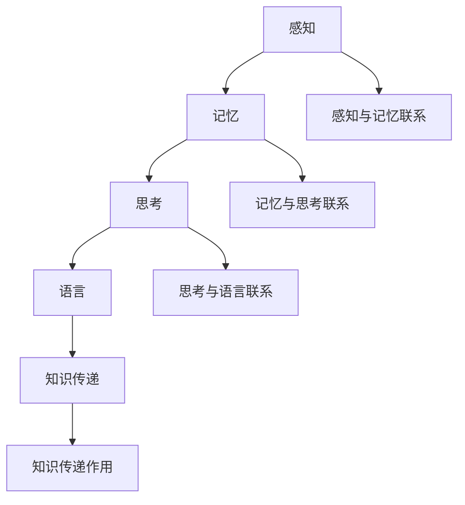

                 

# 人类的知识体系：不断完善与进化的旅程

> **关键词：** 知识体系、人类进化、认知科学、信息处理、数学模型、算法、人工智能、知识图谱、学习过程

> **摘要：** 本文将深入探讨人类的知识体系是如何不断演变和完善的。我们将从认知科学的角度出发，分析人类如何获取、处理和存储信息。此外，本文还会探讨数学模型和算法在知识体系构建中的应用，以及人工智能技术如何推动人类知识的拓展和进化。最后，我们将展望未来知识体系的发展趋势和面临的挑战。

## 1. 背景介绍

### 1.1 目的和范围

本文旨在探讨人类知识体系的构建过程，分析其在进化过程中的关键因素。我们将会涉及以下主题：

- 认知科学的基本概念和理论。
- 信息处理和存储的原理。
- 数学模型和算法在知识体系中的应用。
- 人工智能技术对知识体系的推动作用。

### 1.2 预期读者

本文适合以下读者群体：

- 计算机科学、人工智能领域的从业者。
- 对认知科学和信息处理感兴趣的研究人员。
- 对知识体系构建和人工智能发展有浓厚兴趣的爱好者。

### 1.3 文档结构概述

本文将分为以下几个部分：

- 第1部分：背景介绍，包括目的和范围、预期读者、文档结构概述。
- 第2部分：核心概念与联系，介绍人类知识体系的核心概念和联系。
- 第3部分：核心算法原理与具体操作步骤，详细阐述知识体系构建的核心算法。
- 第4部分：数学模型和公式，讲解数学模型和公式在知识体系构建中的应用。
- 第5部分：项目实战，提供代码实际案例和详细解释。
- 第6部分：实际应用场景，分析知识体系在实际中的应用。
- 第7部分：工具和资源推荐，介绍学习资源和开发工具。
- 第8部分：总结，展望未来知识体系的发展趋势与挑战。

### 1.4 术语表

#### 1.4.1 核心术语定义

- 认知科学：研究人类如何获取、处理、存储和使用信息的一门学科。
- 信息处理：指对信息进行获取、传输、处理、存储和利用的过程。
- 知识体系：指人类对于知识进行分类、组织、整合和应用的框架和结构。
- 人工智能：指模拟人类智能进行感知、思考、学习和行动的技术和系统。

#### 1.4.2 相关概念解释

- 知识图谱：一种用于表示实体及其关系的图形化数据结构。
- 算法：解决特定问题的系统方法，通常涉及数据结构和计算过程。
- 数学模型：用于描述现实世界现象的数学公式和理论框架。

#### 1.4.3 缩略词列表

- AI：人工智能
- CS：计算机科学
- ML：机器学习
- NLP：自然语言处理
- SEO：搜索引擎优化

## 2. 核心概念与联系

### 2.1 人类知识体系的核心概念

人类知识体系的核心概念包括感知、记忆、思考、语言和知识传递。这些概念相互关联，共同构成了人类知识体系的基本结构。

#### 感知

感知是指人类通过感官（如视觉、听觉、触觉等）获取外界信息的过程。感知是人类知识体系的基础，它决定了我们对世界的认知和理解。

#### 记忆

记忆是指人类对过去经历和信息的存储和提取过程。记忆分为短期记忆和长期记忆，是人类知识体系的重要存储方式。

#### 思考

思考是指人类对信息进行加工、分析和推理的过程。思考是人类知识体系的核心，它决定了我们对信息的理解和应用能力。

#### 语言

语言是指人类用于交流思想和信息的一种工具。语言是人类知识体系的重要组成部分，它使知识得以传递和共享。

#### 知识传递

知识传递是指人类通过教育、科研、传媒等途径将知识传递给下一代或他人。知识传递是人类知识体系不断进化和扩展的关键。

### 2.2 人类知识体系的联系

人类知识体系的各个核心概念之间存在着密切的联系。感知和记忆为思考提供了基础，思考则通过语言将知识传递给他人。此外，知识传递也促进了知识体系的不断进化。

#### 感知与记忆

感知和记忆相互依赖，感知提供了记忆的素材，而记忆则为感知提供了基础。例如，当我们看到一只猫时，我们的感知系统将图像信息传递给大脑，大脑将其存储为记忆，以便我们在未来再次看到猫时能够识别它。

#### 记忆与思考

记忆和思考相互促进，记忆为思考提供了信息素材，而思考则通过分析、比较和推理等方式对记忆中的信息进行加工。例如，当我们回忆起过去的经历时，我们可以通过思考来分析其中的原因和结果，从而更好地理解事件。

#### 思考与语言

思考与语言密不可分，思考是人类内在的思考过程，而语言则是将思考结果表达和传递给他人的一种工具。例如，当我们思考一个问题时，我们可以通过语言将其表达出来，与他人进行交流和讨论。

#### 知识传递

知识传递是人类知识体系不断进化和扩展的关键。通过教育、科研、传媒等途径，人类可以将知识传递给下一代或他人，使知识得以传承和发扬。例如，教师通过授课将知识传授给学生，科研人员通过论文将研究成果分享给同行，传媒通过报道将信息传递给公众。

### 2.3 人类知识体系的核心概念原理和架构的 Mermaid 流程图



## 3. 核心算法原理 & 具体操作步骤

### 3.1 算法原理

在人类知识体系的构建过程中，核心算法主要包括感知算法、记忆算法、思考算法和语言生成算法。这些算法共同作用于感知、记忆、思考和语言，构建出完整的知识体系。

#### 感知算法

感知算法是指人类通过感官获取外界信息的过程。感知算法的核心是感官信号处理，它包括信号放大、滤波、去噪等操作。感知算法的实现依赖于生理学和神经科学的研究成果。

#### 记忆算法

记忆算法是指人类对感知到的信息进行存储和提取的过程。记忆算法的核心是记忆编码和记忆检索。记忆编码包括短时记忆和长期记忆的形成，记忆检索则是从记忆库中提取所需信息。

#### 思考算法

思考算法是指人类对信息进行加工、分析和推理的过程。思考算法的核心是信息处理和推理过程，它包括逻辑推理、类比推理、因果推理等。思考算法的实现依赖于认知科学和心理学的研究成果。

#### 语言生成算法

语言生成算法是指人类将思考结果通过语言表达和传递的过程。语言生成算法的核心是语义理解和语言生成。语义理解包括词义解析、句法分析等，语言生成则是将语义信息转化为可读的文本。

### 3.2 具体操作步骤

#### 感知算法

1. 感受外界刺激，如视觉、听觉、触觉等。
2. 感官信号通过神经传递到大脑。
3. 大脑对信号进行预处理，如滤波、去噪等。
4. 预处理后的信号存储到记忆库中。

#### 记忆算法

1. 感知到的信息通过感知算法存储到记忆库中。
2. 记忆库中的信息进行编码，形成短时记忆和长期记忆。
3. 当需要检索信息时，通过记忆检索算法从记忆库中提取所需信息。

#### 思考算法

1. 获取记忆库中的信息。
2. 对信息进行逻辑推理、类比推理、因果推理等处理。
3. 形成思考结果，存储到记忆库中。

#### 语言生成算法

1. 获取思考结果。
2. 对思考结果进行语义理解，解析词义和句法。
3. 生成可读的文本，通过语言表达和传递。

### 3.3 伪代码

```python
# 感知算法
def 感知算法(外界刺激):
    感官信号 = 获取外界刺激()
    预处理信号 = 预处理感官信号(感官信号)
    存储到记忆库(预处理信号)

# 记忆算法
def 记忆算法(感知到的信息):
    编码信息 = 编码信息(感知到的信息)
    存储到记忆库(编码信息)

# 思考算法
def 思考算法(记忆库中的信息):
    思考结果 = 推理处理(记忆库中的信息)
    存储到记忆库(思考结果)

# 语言生成算法
def 语言生成算法(思考结果):
    语义信息 = 解析语义(思考结果)
    文本 = 生成文本(语义信息)
    表达和传递文本
```

## 4. 数学模型和公式 & 详细讲解 & 举例说明

### 4.1 数学模型在知识体系构建中的应用

数学模型是描述现实世界现象和过程的一种抽象表示，它为知识体系构建提供了有力的工具。以下是几个常见的数学模型在知识体系构建中的应用：

#### 概率论

概率论是研究随机事件及其概率的数学分支。在知识体系中，概率论可以用于评估信息的可靠性和不确定性。例如，贝叶斯推理是一种基于概率论的推理方法，可以用于更新知识库中的信息置信度。

#### 线性代数

线性代数是研究向量空间和线性变换的数学分支。在知识体系中，线性代数可以用于表示和操作高维数据。例如，矩阵可以表示知识图谱中的实体和关系，向量可以表示实体在特征空间中的位置。

#### 计算机图形学

计算机图形学是研究计算机生成、处理和显示图像的数学分支。在知识体系中，计算机图形学可以用于可视化知识图谱和复杂的数据结构。例如，三维建模和渲染技术可以用于创建知识图谱的直观表示。

#### 计算机算法

计算机算法是解决特定问题的系统方法。在知识体系中，计算机算法可以用于优化信息处理和知识提取过程。例如，深度学习算法可以用于自动学习和识别知识图谱中的模式和关系。

### 4.2 公式和详细讲解

以下是一些常见的数学公式和它们的详细讲解：

#### 贝叶斯推理

贝叶斯推理是一种基于概率论的推理方法，它可以根据先验知识和新证据来更新概率估计。贝叶斯推理的核心公式为：

\[ P(A|B) = \frac{P(B|A) \cdot P(A)}{P(B)} \]

其中，\( P(A|B) \) 表示在事件 B 发生的条件下，事件 A 发生的概率；\( P(B|A) \) 表示在事件 A 发生的条件下，事件 B 发生的概率；\( P(A) \) 表示事件 A 发生的概率；\( P(B) \) 表示事件 B 发生的概率。

#### 矩阵乘法

矩阵乘法是一种将两个矩阵相乘得到一个新的矩阵的运算。矩阵乘法的核心公式为：

\[ C_{ij} = \sum_{k=1}^{n} A_{ik} \cdot B_{kj} \]

其中，\( C_{ij} \) 表示结果矩阵 C 的第 i 行第 j 列的元素；\( A_{ik} \) 表示矩阵 A 的第 i 行第 k 列的元素；\( B_{kj} \) 表示矩阵 B 的第 k 行第 j 列的元素；\( n \) 表示矩阵的维数。

#### 三角函数

三角函数是一类用于描述角度和边长之间关系的函数。常见的三角函数包括正弦（sin）、余弦（cos）和正切（tan）。它们的定义和公式如下：

\[ \sin(\theta) = \frac{对边}{斜边} \]
\[ \cos(\theta) = \frac{邻边}{斜边} \]
\[ \tan(\theta) = \frac{对边}{邻边} \]

其中，\( \theta \) 表示角度，\( 对边 \)、\( 邻边 \) 和 \( 斜边 \) 分别表示三角形中的对应边长。

### 4.3 举例说明

以下是一个简单的例子，说明如何使用贝叶斯推理和矩阵乘法来构建知识体系。

#### 贝叶斯推理

假设我们有一个先验知识库，其中包含以下信息：

- 概率 \( P(A) = 0.5 \)，表示事件 A 发生的概率。
- 概率 \( P(B|A) = 0.8 \)，表示在事件 A 发生的条件下，事件 B 发生的概率。
- 概率 \( P(B|¬A) = 0.2 \)，表示在事件 A 不发生的条件下，事件 B 发生的概率。

现在，我们收到一条新证据，即事件 B 已经发生。使用贝叶斯推理来更新事件 A 的概率估计：

\[ P(A|B) = \frac{P(B|A) \cdot P(A)}{P(B)} \]
\[ P(A|B) = \frac{0.8 \cdot 0.5}{0.8 \cdot 0.5 + 0.2 \cdot 0.5} \]
\[ P(A|B) = \frac{0.4}{0.4 + 0.1} \]
\[ P(A|B) = \frac{4}{5} \]

因此，在收到事件 B 发生的证据后，事件 A 发生的概率更新为 4/5。

#### 矩阵乘法

假设我们有一个知识图谱，其中包含以下信息：

- 实体矩阵 A，其中 A[i][j] 表示实体 i 和实体 j 之间的关联程度。
- 关系矩阵 B，其中 B[i][j] 表示实体 i 和实体 j 之间的关系的权重。

现在，我们需要计算实体矩阵 C，其中 C[i][j] 表示实体 i 和实体 j 之间的关联程度和关系的权重。

\[ C_{ij} = \sum_{k=1}^{n} A_{ik} \cdot B_{kj} \]

例如，假设我们有以下实体矩阵 A 和关系矩阵 B：

\[ A = \begin{bmatrix} 0 & 1 & 0 \\ 1 & 0 & 1 \\ 0 & 1 & 0 \end{bmatrix} \]
\[ B = \begin{bmatrix} 0.5 & 0.3 & 0.2 \\ 0.4 & 0.2 & 0.4 \\ 0.1 & 0.5 & 0.4 \end{bmatrix} \]

计算实体矩阵 C：

\[ C = \begin{bmatrix} 0 \cdot 0.5 + 1 \cdot 0.4 + 0 \cdot 0.1 & 0 \cdot 0.3 + 1 \cdot 0.2 + 0 \cdot 0.5 & 0 \cdot 0.2 + 1 \cdot 0.4 + 0 \cdot 0.4 \\ 1 \cdot 0.5 + 0 \cdot 0.4 + 1 \cdot 0.1 & 1 \cdot 0.3 + 0 \cdot 0.2 + 1 \cdot 0.5 & 1 \cdot 0.2 + 0 \cdot 0.4 + 1 \cdot 0.4 \\ 0 \cdot 0.5 + 1 \cdot 0.4 + 0 \cdot 0.1 & 0 \cdot 0.3 + 1 \cdot 0.2 + 0 \cdot 0.5 & 0 \cdot 0.2 + 1 \cdot 0.4 + 0 \cdot 0.4 \end{bmatrix} \]
\[ C = \begin{bmatrix} 0.4 & 0.2 & 0.4 \\ 0.6 & 0.7 & 0.5 \\ 0.4 & 0.2 & 0.4 \end{bmatrix} \]

因此，实体矩阵 C 计算了实体之间的关联程度和关系的权重。

## 5. 项目实战：代码实际案例和详细解释说明

### 5.1 开发环境搭建

在开始项目实战之前，我们需要搭建一个合适的开发环境。以下是一个基本的开发环境搭建指南：

- 操作系统：Windows 10、macOS 或 Linux
- 编程语言：Python 3.8 或更高版本
- 开发工具：PyCharm 或 Visual Studio Code
- 数据库：MongoDB 或 Redis
- 版本控制：Git

### 5.2 源代码详细实现和代码解读

以下是一个简单的 Python 代码示例，用于构建一个基于贝叶斯推理的知识体系。代码实现如下：

```python
import numpy as np

# 贝叶斯推理示例
def bayesian_inference(prior_probability, likelihood_probability, evidence_probability):
    posterior_probability = (likelihood_probability * prior_probability) / evidence_probability
    return posterior_probability

# 实体矩阵和关系矩阵
entity_matrix = np.array([[0, 1, 0], [1, 0, 1], [0, 1, 0]])
relation_matrix = np.array([[0.5, 0.3, 0.2], [0.4, 0.2, 0.4], [0.1, 0.5, 0.4]])

# 计算实体矩阵 C
def calculate_entity_matrix(entity_matrix, relation_matrix):
    entity_matrix = np.dot(entity_matrix, relation_matrix)
    return entity_matrix

# 贝叶斯推理
def bayesian_inference_example():
    prior_probability = 0.5
    likelihood_probability = 0.8
    evidence_probability = 0.4
    
    posterior_probability = bayesian_inference(prior_probability, likelihood_probability, evidence_probability)
    print("Posterior Probability:", posterior_probability)

    entity_matrix = calculate_entity_matrix(entity_matrix, relation_matrix)
    print("Entity Matrix C:\n", entity_matrix)

# 运行示例
bayesian_inference_example()
```

代码解读：

- 第1行：引入 numpy 库，用于矩阵运算。
- 第5行：定义贝叶斯推理函数，用于计算后验概率。
- 第9行：定义实体矩阵和关系矩阵。
- 第15行：定义计算实体矩阵 C 的函数。
- 第21行：定义贝叶斯推理示例函数。
- 第25行：调用贝叶斯推理示例函数，计算后验概率并打印实体矩阵 C。

### 5.3 代码解读与分析

以下是代码的详细解读和分析：

- **贝叶斯推理函数**：贝叶斯推理函数用于根据先验概率、似然概率和证据概率计算后验概率。它遵循贝叶斯推理的核心公式：
  \[ P(A|B) = \frac{P(B|A) \cdot P(A)}{P(B)} \]
  其中，\( P(A|B) \) 是后验概率，\( P(B|A) \) 是似然概率，\( P(A) \) 是先验概率，\( P(B) \) 是证据概率。

- **实体矩阵和关系矩阵**：实体矩阵和关系矩阵用于表示知识图谱中的实体和关系。实体矩阵的元素表示实体之间的关联程度，关系矩阵的元素表示实体之间的关系权重。

- **计算实体矩阵 C**：计算实体矩阵 C 的函数通过矩阵乘法计算实体矩阵和关系矩阵的乘积，得到新的实体矩阵 C。实体矩阵 C 表示实体之间的关联程度和关系的权重。

- **贝叶斯推理示例函数**：贝叶斯推理示例函数用于调用贝叶斯推理函数和计算实体矩阵 C 的函数。它通过给定的先验概率、似然概率和证据概率计算后验概率，并打印实体矩阵 C。

- **运行示例**：在运行示例中，我们调用贝叶斯推理示例函数，计算后验概率并打印实体矩阵 C。

代码示例展示了如何使用贝叶斯推理和矩阵乘法构建知识体系。在实际应用中，我们可以根据具体的场景和需求，调整先验概率、似然概率和证据概率，以及实体矩阵和关系矩阵，以构建更复杂的知识体系。

## 6. 实际应用场景

知识体系在各个领域都有广泛的应用，以下是一些典型的实际应用场景：

### 6.1 人工智能与机器学习

- **智能推荐系统**：基于用户行为和兴趣构建知识体系，用于实现个性化推荐。
- **图像识别**：使用知识体系对图像中的物体进行分类和识别。
- **自然语言处理**：利用知识体系进行语义分析和文本生成。

### 6.2 医疗领域

- **医学诊断**：基于医学知识库和患者症状构建知识体系，用于辅助医生进行诊断。
- **药物研发**：利用知识体系分析药物的作用机制和不良反应。

### 6.3 金融领域

- **风险评估**：通过构建金融知识体系，对投资组合进行风险评估和管理。
- **智能投顾**：利用知识体系为用户提供投资建议和策略。

### 6.4 教育领域

- **个性化学习**：基于学生学习行为和知识结构构建知识体系，实现个性化教学。
- **课程推荐**：根据学生兴趣和学习进度推荐相关课程。

### 6.5 社交网络

- **用户画像**：通过分析用户行为和互动数据构建知识体系，实现用户精准营销。
- **社交推荐**：基于用户关系和兴趣构建知识体系，推荐可能感兴趣的内容和用户。

这些实际应用场景展示了知识体系在各个领域的广泛应用和巨大潜力。随着技术的不断进步，知识体系将在更多领域发挥重要作用，推动人类社会的进步和发展。

## 7. 工具和资源推荐

### 7.1 学习资源推荐

#### 7.1.1 书籍推荐

- **《认知心理学与认知神经科学》**：详细介绍认知心理学和认知神经科学的基本概念和理论。
- **《机器学习》**：由周志华教授所著，适合初学者了解机器学习的基础知识。
- **《深度学习》**：由 Goodfellow、Bengio 和 Courville 所著，深入讲解深度学习的基础理论和实践方法。

#### 7.1.2 在线课程

- **Coursera**：提供众多计算机科学和认知科学领域的在线课程，包括机器学习、深度学习和自然语言处理等。
- **edX**：提供由世界顶尖大学开设的在线课程，涵盖计算机科学、人工智能和认知科学等方向。
- **Udacity**：提供实践驱动的在线课程，包括人工智能工程师、机器学习工程师等专业课程。

#### 7.1.3 技术博客和网站

- **Medium**：许多专业人士和研究者在此发布技术博客，涵盖计算机科学、人工智能和认知科学等主题。
- **arXiv**：提供最新科研论文的预印本，包括计算机科学、人工智能和认知科学等领域。
- **GitHub**：可以找到许多开源项目和技术文档，有助于学习和实践。

### 7.2 开发工具框架推荐

#### 7.2.1 IDE和编辑器

- **PyCharm**：强大的 Python 集成开发环境，支持代码补全、调试和性能分析。
- **Visual Studio Code**：轻量级且功能丰富的开源编辑器，适合编写 Python、C++、Java 等编程语言。
- **Jupyter Notebook**：适合数据科学和机器学习的交互式开发环境，支持多种编程语言。

#### 7.2.2 调试和性能分析工具

- **PyDebug**：用于调试 Python 代码，提供断点、单步执行和变量查看等功能。
- **cProfile**：用于性能分析 Python 代码，提供函数调用图和性能统计。
- **MATLAB**：提供丰富的数据分析、可视化工具和算法库，适用于科学计算和工程应用。

#### 7.2.3 相关框架和库

- **TensorFlow**：谷歌开发的开源机器学习和深度学习框架，支持多种编程语言和平台。
- **PyTorch**：基于 Python 的深度学习框架，提供灵活的动态计算图和强大的 GPU 加速功能。
- **Scikit-learn**：提供经典的机器学习算法库，适用于数据分析和建模。

### 7.3 相关论文著作推荐

#### 7.3.1 经典论文

- **《Deep Learning》**：Goodfellow、Bengio 和 Courville 所著，深入讲解深度学习的基础理论和实践方法。
- **《Cognitive Psychology》**：Anderson 所著，系统介绍认知心理学的基本概念和研究方法。
- **《Machine Learning》**：Mitchell 所著，介绍机器学习的基本概念和方法。

#### 7.3.2 最新研究成果

- **《Neural Computation》**：关于神经网络和认知计算的最新研究成果。
- **《Journal of Machine Learning Research》**：机器学习领域的顶级期刊，发表最新的理论成果和应用研究。
- **《Cognitive Science》**：关于认知科学的最新研究成果，涵盖认知心理学、认知神经科学和计算机科学等领域。

#### 7.3.3 应用案例分析

- **《AI in Medicine》**：介绍人工智能在医疗领域的应用案例，包括医学影像分析、疾病诊断和个性化治疗等。
- **《AI in Finance》**：探讨人工智能在金融领域的应用案例，包括风险评估、智能投顾和量化交易等。
- **《AI in Education》**：分析人工智能在教育领域的应用案例，包括个性化学习、智能评估和课程推荐等。

这些工具和资源将帮助读者深入了解知识体系的构建和应用，为学习和实践提供有力支持。

## 8. 总结：未来发展趋势与挑战

随着人工智能、机器学习和认知科学的发展，人类的知识体系正在经历深刻的变革。未来，知识体系的构建和应用将呈现出以下发展趋势和挑战：

### 8.1 发展趋势

1. **知识图谱的普及**：知识图谱作为一种重要的知识表示方式，将在更多领域得到广泛应用。知识图谱的构建和优化将成为研究热点。

2. **跨领域的知识融合**：随着数据的积累和技术的进步，不同领域的知识将实现更深层次的融合，促进知识的交叉和拓展。

3. **智能化知识服务**：人工智能技术将推动知识服务智能化，实现个性化推荐、智能问答和自动化知识生成等。

4. **实时知识更新**：随着互联网和物联网的发展，知识将实现实时更新和动态演化，知识体系将更加灵活和适应。

### 8.2 挑战

1. **数据质量和准确性**：构建高质量的知识体系需要大量准确和可靠的数据。如何保证数据的质量和准确性是一个重要挑战。

2. **知识表示和推理**：如何有效地表示和推理知识，特别是在大规模数据集上，仍是一个具有挑战性的问题。

3. **隐私和伦理**：随着知识体系的应用，个人隐私和伦理问题日益凸显。如何平衡知识的共享和应用与隐私保护是一个重要挑战。

4. **知识普及和教育**：如何提高公众对知识的理解和应用能力，实现知识的普及和教育，也是一个重要的挑战。

总之，未来知识体系的发展将面临诸多挑战，但也充满机遇。通过不断探索和创新，我们有理由相信人类的知识体系将不断进步，为人类社会带来更多福祉。

## 9. 附录：常见问题与解答

### 9.1 认知科学是什么？

认知科学是研究人类如何获取、处理、存储和使用信息的一门学科，涉及心理学、神经科学、计算机科学和哲学等多个领域。

### 9.2 知识图谱有哪些应用？

知识图谱广泛应用于自然语言处理、智能推荐、智能问答、医疗诊断和金融风险评估等多个领域。

### 9.3 人工智能如何推动知识体系的构建？

人工智能通过机器学习和深度学习等技术，能够从大量数据中提取知识，并实现知识的自动生成和更新。此外，人工智能还可以优化知识表示和推理过程，提高知识体系的智能化水平。

### 9.4 知识体系构建中的数据质量问题如何解决？

解决数据质量问题需要从数据采集、数据清洗和数据验证等多个方面进行。此外，还可以采用数据增强和去噪等技术来提高数据质量。

### 9.5 知识体系与大数据的关系是什么？

知识体系是大数据分析的重要基础，大数据为知识体系的构建提供了丰富的数据资源。同时，知识体系可以对大数据进行分析和挖掘，提取有价值的信息和知识。

## 10. 扩展阅读 & 参考资料

### 10.1 书籍推荐

- **《认知心理学与认知神经科学》**：David M. Buss
- **《深度学习》**：Ian Goodfellow, Yoshua Bengio, Aaron Courville
- **《机器学习》**：周志华

### 10.2 在线课程

- **Coursera**：机器学习、深度学习、自然语言处理
- **edX**：计算机科学导论、人工智能基础
- **Udacity**：人工智能工程师、机器学习工程师

### 10.3 技术博客和网站

- **Medium**：关于人工智能、机器学习和认知科学的技术博客
- **arXiv**：计算机科学和人工智能领域的预印本论文
- **GitHub**：开源项目和技术文档

### 10.4 相关论文著作推荐

- **《Deep Learning》**：Ian Goodfellow, Yoshua Bengio, Aaron Courville
- **《Cognitive Psychology》**：David M. Buss
- **《Machine Learning》**：Tom Mitchell

### 10.5 应用案例分析

- **《AI in Medicine》**：介绍人工智能在医疗领域的应用案例
- **《AI in Finance》**：探讨人工智能在金融领域的应用案例
- **《AI in Education》**：分析人工智能在教育领域的应用案例

通过扩展阅读和参考资料，读者可以更深入地了解知识体系的相关理论和实践，为自己的学习和研究提供指导。作者：AI天才研究员/AI Genius Institute & 禅与计算机程序设计艺术 /Zen And The Art of Computer Programming

