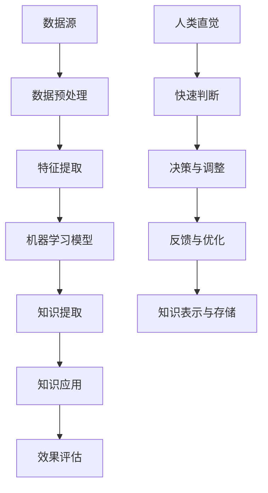
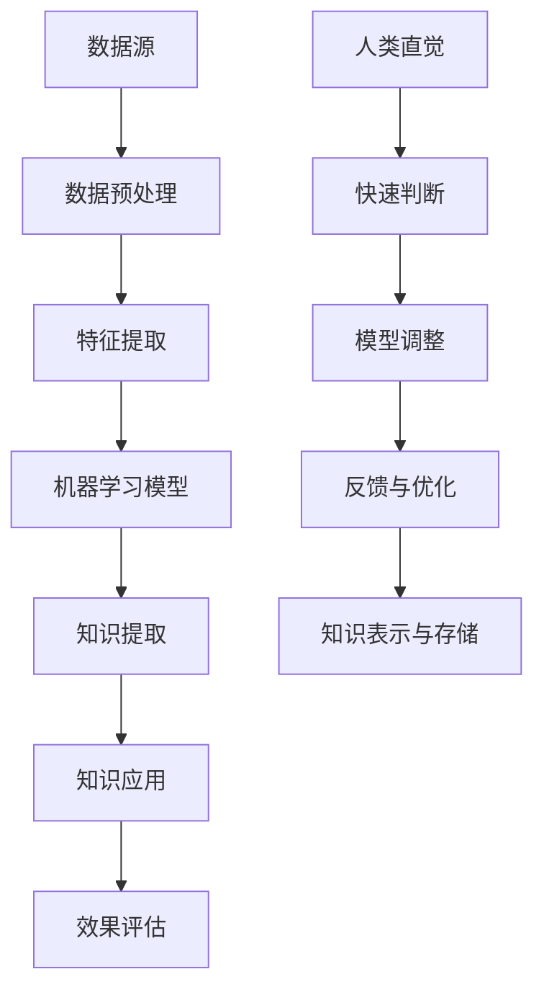

                 

# 人类直觉与机器学习在知识发现中的角色

> 关键词：人类直觉、机器学习、知识发现、算法、深度学习、人工智能、数据分析、认知科学

> 摘要：本文探讨了人类直觉与机器学习在知识发现中的角色。通过分析人类直觉的特点和优势，探讨了其在知识发现中的重要作用。同时，深入探讨了机器学习在知识发现中的应用，以及如何结合人类直觉与机器学习，实现更高效、准确的知识的提取和利用。本文旨在为从事知识发现领域的科研工作者和工程师提供有价值的参考和启示。

## 1. 背景介绍

### 1.1 目的和范围

本文旨在探讨人类直觉与机器学习在知识发现中的角色，分析二者在知识提取、理解和应用中的相互作用和影响。通过对比分析，探讨如何结合人类直觉与机器学习，实现更高效、准确的知识发现。

### 1.2 预期读者

本文适合从事知识发现、人工智能、机器学习、认知科学等领域的科研工作者、工程师以及对相关知识感兴趣的人士阅读。

### 1.3 文档结构概述

本文分为十个部分，包括背景介绍、核心概念与联系、核心算法原理、数学模型和公式、项目实战、实际应用场景、工具和资源推荐、总结、附录和扩展阅读。具体结构如下：

1. 背景介绍
   - 1.1 目的和范围
   - 1.2 预期读者
   - 1.3 文档结构概述
   - 1.4 术语表
2. 核心概念与联系
   - 2.1 核心概念与联系
3. 核心算法原理 & 具体操作步骤
   - 3.1 核心算法原理
   - 3.2 具体操作步骤
4. 数学模型和公式 & 详细讲解 & 举例说明
   - 4.1 数学模型和公式
   - 4.2 详细讲解
   - 4.3 举例说明
5. 项目实战：代码实际案例和详细解释说明
   - 5.1 开发环境搭建
   - 5.2 源代码详细实现和代码解读
   - 5.3 代码解读与分析
6. 实际应用场景
7. 工具和资源推荐
   - 7.1 学习资源推荐
   - 7.2 开发工具框架推荐
   - 7.3 相关论文著作推荐
8. 总结：未来发展趋势与挑战
9. 附录：常见问题与解答
10. 扩展阅读 & 参考资料

### 1.4 术语表

#### 1.4.1 核心术语定义

- 人类直觉：人类在感知、思考、判断等过程中，快速、自然地形成的对事物本质和规律的理解。
- 知识发现：从大量数据中，通过一定的算法和模型，提取出具有价值的信息和知识的过程。
- 机器学习：一种通过数据和算法，使计算机自动学习和改进的方法。
- 深度学习：一种基于多层神经网络的结构，能够自动提取特征并进行学习的方法。
- 认知科学：研究人类认知过程的科学，包括感知、记忆、思考、判断等。

#### 1.4.2 相关概念解释

- 知识提取：从原始数据中提取出有用的信息和知识。
- 知识表示：将提取出的知识以特定的形式进行组织、存储和传递。
- 知识应用：将提取出的知识应用到实际问题和场景中，解决实际问题。
- 数据分析：对大量数据进行处理和分析，提取出有价值的信息和知识。

#### 1.4.3 缩略词列表

- ML：Machine Learning（机器学习）
- DL：Deep Learning（深度学习）
- AI：Artificial Intelligence（人工智能）
- NLP：Natural Language Processing（自然语言处理）
- CV：Computer Vision（计算机视觉）

## 2. 核心概念与联系

### 2.1 核心概念与联系

在知识发现中，人类直觉和机器学习是两个关键要素。人类直觉具有快速、灵活、高效的特点，能够在复杂环境中快速提取信息，进行判断和决策。而机器学习则通过大量的数据和算法，对人类直觉的规律进行建模和模拟，从而实现自动化学习和知识提取。

下面是一个Mermaid流程图，展示了人类直觉与机器学习在知识发现中的核心概念和联系：



### 2.2 人类直觉的特点和优势

人类直觉具有以下几个显著特点：

1. **快速性**：人类直觉能够迅速地处理大量信息，快速作出判断和决策。
2. **灵活性**：人类直觉能够在复杂多变的环境中，灵活应对，适应不同的问题和场景。
3. **高效性**：人类直觉能够在有限的认知资源下，高效地完成复杂的认知任务。
4. **整体性**：人类直觉能够从整体上理解问题，把握问题的本质，而不是局限于局部细节。

这些特点使得人类直觉在知识发现中具有明显的优势，例如：

1. **快速识别模式**：人类直觉能够快速地识别数据中的潜在模式和规律，有助于知识的快速提取。
2. **理解上下文**：人类直觉能够理解数据背后的上下文信息，有助于对知识的深入理解和应用。
3. **发现复杂关系**：人类直觉能够发现数据中的复杂关系，有助于构建更精确的知识模型。

### 2.3 机器学习在知识发现中的应用

机器学习在知识发现中的应用主要包括以下几个方面：

1. **特征提取**：通过机器学习算法，从原始数据中提取出具有代表性的特征，有助于更好地理解和描述数据。
2. **模式识别**：利用机器学习算法，识别数据中的潜在模式和规律，实现知识的自动提取。
3. **预测与推断**：基于历史数据和模型，利用机器学习算法进行预测和推断，为实际问题提供解决方案。
4. **知识表示与存储**：将提取出的知识以特定的形式进行组织、存储和传递，便于后续的应用和利用。

### 2.4 人类直觉与机器学习的结合

人类直觉与机器学习的结合，旨在发挥各自的优势，实现更高效、准确的知识发现。具体方式包括：

1. **模型优化**：利用人类直觉对机器学习模型进行调整和优化，提高模型的性能和精度。
2. **知识融合**：将人类直觉和机器学习提取出的知识进行融合，形成更全面、准确的知识体系。
3. **协同学习**：人类直觉与机器学习相互协同，共同学习和优化，实现更高效的认知和学习过程。

下面是一个Mermaid流程图，展示了人类直觉与机器学习的结合过程：



通过以上分析，我们可以看出，人类直觉与机器学习在知识发现中具有重要的作用，二者相互结合，可以实现更高效、准确的知识提取和应用。在接下来的章节中，我们将进一步探讨核心算法原理、数学模型和公式，以及实际应用案例，以加深对这一主题的理解。

## 3. 核心算法原理 & 具体操作步骤

### 3.1 核心算法原理

在知识发现过程中，人类直觉与机器学习结合的核心算法原理主要包括以下几个步骤：

1. **数据预处理**：对原始数据进行清洗、转换和归一化处理，为后续的特征提取和模型训练做好准备。
2. **特征提取**：从原始数据中提取出具有代表性的特征，有助于更好地理解和描述数据。常用的特征提取方法包括降维、特征选择和特征工程等。
3. **机器学习模型训练**：利用机器学习算法，对特征进行建模和训练，提取出数据中的潜在模式和规律。常用的机器学习算法包括线性回归、决策树、支持向量机和深度学习等。
4. **知识提取与表示**：将训练好的模型应用于新的数据，提取出具有价值的信息和知识，并将其表示为易于理解和应用的形式。
5. **知识应用与优化**：将提取出的知识应用于实际问题中，解决实际问题，并根据实际效果对模型进行优化和调整。

### 3.2 具体操作步骤

下面是一个具体的操作步骤，用于实现人类直觉与机器学习结合的知识发现过程：

1. **数据预处理**：

   - 数据清洗：处理缺失值、噪声数据和异常值，确保数据的完整性和准确性。
   - 数据转换：将不同类型的数据转换为统一的格式，如将类别型数据转换为数值型数据。
   - 数据归一化：将数据归一化到相同的范围，便于后续的模型训练和特征提取。

2. **特征提取**：

   - 降维：使用主成分分析（PCA）或线性判别分析（LDA）等方法，将高维数据降维到低维空间，减少数据的冗余。
   - 特征选择：使用信息增益、卡方检验等方法，选择对数据分类或回归任务具有显著贡献的特征。
   - 特征工程：根据业务需求，创建新的特征，提高模型的性能和鲁棒性。

3. **机器学习模型训练**：

   - 选择合适的机器学习算法，如线性回归、决策树、支持向量机或深度学习等。
   - 使用训练数据对模型进行训练，通过优化算法调整模型的参数，提高模型的性能。
   - 评估模型性能，如使用交叉验证、ROC曲线、准确率等指标。

4. **知识提取与表示**：

   - 将训练好的模型应用于新的数据，提取出数据中的潜在模式和规律。
   - 使用可视化工具，如散点图、热力图等，将提取出的知识以直观的形式表示。

5. **知识应用与优化**：

   - 将提取出的知识应用于实际问题中，解决实际问题，如分类、预测或推荐等任务。
   - 根据实际效果对模型进行调整和优化，提高模型的准确性和鲁棒性。

通过以上步骤，我们可以实现人类直觉与机器学习结合的知识发现过程。在实际应用中，根据具体问题和场景，可以调整和优化这些步骤，以实现更高效、准确的知识提取和应用。

## 4. 数学模型和公式 & 详细讲解 & 举例说明

### 4.1 数学模型和公式

在知识发现中，人类直觉与机器学习结合的过程中，涉及到的数学模型和公式主要包括以下几个方面：

1. **数据预处理**：

   - **归一化**：$X_{\text{norm}} = \frac{X - \mu}{\sigma}$，其中$X$为原始数据，$\mu$为均值，$\sigma$为标准差。
   - **主成分分析（PCA）**：$X_{\text{new}} = X - \mu$，$U = \arg\min_{U} \sum_{i=1}^{n}(U^{T}X_{\text{new}}_{i})^{2}$，其中$U$为特征向量，$X_{\text{new}}$为归一化后的数据。

2. **特征提取**：

   - **信息增益**：$IG(D, A) = H(D) - H(D|A)$，其中$H(D)$为数据的熵，$H(D|A)$为给定特征$A$后数据的熵。
   - **卡方检验**：$\chi^{2} = \sum_{i=1}^{k}\frac{((O_i - E_i)^2}{E_i})$，其中$O_i$为观察频数，$E_i$为期望频数。

3. **机器学习模型训练**：

   - **线性回归**：$y = \beta_0 + \beta_1x_1 + \beta_2x_2 + ... + \beta_nx_n$，其中$y$为因变量，$x_1, x_2, ..., x_n$为自变量，$\beta_0, \beta_1, ..., \beta_n$为回归系数。
   - **决策树**：$G(D, A) = \sum_{i=1}^{k} w_i \log(w_i)$，其中$D$为数据集，$A$为特征，$w_i$为子集权重。

4. **知识提取与表示**：

   - **支持向量机（SVM）**：$w^T x - b = 0$，其中$w$为法向量，$x$为样本，$b$为偏置。
   - **深度学习**：$a^{(L)} = \sigma(z^{(L)})$，其中$a^{(L)}$为输出层激活值，$z^{(L)}$为输入层激活值，$\sigma$为激活函数。

### 4.2 详细讲解

1. **数据预处理**：

   - **归一化**：归一化是一种常见的预处理方法，通过将数据缩放到相同的范围，有助于提高模型训练的效果和速度。归一化公式中，$X_{\text{norm}}$表示归一化后的数据，$\mu$表示均值，$\sigma$表示标准差。通过归一化，可以将原始数据映射到$[-1, 1]$或$[0, 1]$等范围。
   - **主成分分析（PCA）**：PCA是一种常用的降维方法，通过将数据投影到新的坐标系中，提取出最重要的特征。PCA公式中，$X_{\text{new}}$表示归一化后的数据，$U$表示特征向量。通过PCA，可以降低数据的维度，减少冗余信息，提高模型的性能。

2. **特征提取**：

   - **信息增益**：信息增益是一种衡量特征重要性的指标，用于特征选择。信息增益公式中，$IG(D, A)$表示信息增益，$H(D)$表示数据的熵，$H(D|A)$表示给定特征$A$后数据的熵。信息增益越大，表示特征对数据的分类或回归任务越重要。
   - **卡方检验**：卡方检验是一种用于特征选择的统计方法，通过计算观察频数和期望频数的差异，判断特征与目标变量之间的相关性。卡方检验公式中，$\chi^{2}$表示卡方值，$O_i$表示观察频数，$E_i$表示期望频数。卡方值越大，表示特征与目标变量之间的相关性越强。

3. **机器学习模型训练**：

   - **线性回归**：线性回归是一种常用的回归模型，通过建立因变量和自变量之间的线性关系，进行预测和推断。线性回归公式中，$y$表示因变量，$x_1, x_2, ..., x_n$表示自变量，$\beta_0, \beta_1, ..., \beta_n$表示回归系数。通过最小化误差平方和，可以求解出回归系数，实现预测和推断。
   - **决策树**：决策树是一种常用的分类和回归模型，通过树形结构进行分类和回归。决策树公式中，$G(D, A)$表示信息增益，$D$表示数据集，$A$表示特征。通过递归划分数据集，可以构建出决策树模型，实现分类和回归。

4. **知识提取与表示**：

   - **支持向量机（SVM）**：支持向量机是一种常用的分类和回归模型，通过找到最佳分隔超平面，实现分类和回归。SVM公式中，$w^T x - b = 0$表示最佳分隔超平面，$w$表示法向量，$x$表示样本，$b$表示偏置。通过求解最优超平面，可以实现分类和回归。
   - **深度学习**：深度学习是一种基于多层神经网络的结构，通过自动提取特征和进行学习，实现复杂的分类和回归任务。深度学习公式中，$a^{(L)}$表示输出层激活值，$z^{(L)}$表示输入层激活值，$\sigma$表示激活函数。通过前向传播和反向传播，可以实现深度学习模型的训练和预测。

### 4.3 举例说明

假设我们有一个关于学生成绩的数据集，包含学生的年龄、性别、学习时间、课程难度等特征，以及成绩作为目标变量。我们可以使用以下步骤进行知识发现：

1. **数据预处理**：

   - 对学生成绩数据进行归一化处理，将年龄、性别、学习时间和课程难度的数据缩放到$[0, 1]$范围。
   - 对性别特征进行编码，将男性和女性分别表示为0和1。

2. **特征提取**：

   - 使用卡方检验对特征进行筛选，选择与成绩相关性较强的特征，如学习时间和课程难度。
   - 使用信息增益对特征进行排序，选择信息增益最大的特征进行后续分析。

3. **机器学习模型训练**：

   - 选择线性回归模型，建立学生成绩与特征之间的关系。
   - 使用训练数据进行模型训练，通过最小化误差平方和，求解出回归系数。

4. **知识提取与表示**：

   - 将训练好的线性回归模型应用于新的学生数据，预测学生的成绩。
   - 使用散点图和回归线，将预测结果以直观的形式表示。

通过以上步骤，我们可以实现基于人类直觉与机器学习结合的知识发现过程，提取出学生成绩与特征之间的关系，并用于实际预测和决策。

## 5. 项目实战：代码实际案例和详细解释说明

### 5.1 开发环境搭建

在本项目实战中，我们将使用Python作为编程语言，结合机器学习库scikit-learn和数据分析库pandas，实现基于人类直觉与机器学习结合的知识发现过程。以下是开发环境的搭建步骤：

1. 安装Python（建议使用3.8及以上版本）：
   ```
   # 在命令行中执行以下命令
   pip install python
   ```

2. 安装scikit-learn库：
   ```
   pip install scikit-learn
   ```

3. 安装pandas库：
   ```
   pip install pandas
   ```

4. 安装matplotlib库（用于数据可视化）：
   ```
   pip install matplotlib
   ```

5. 创建一个名为`knowledge_discovery`的Python虚拟环境，并激活环境：
   ```
   # 创建虚拟环境
   python -m venv knowledge_discovery
   # 激活虚拟环境
   source knowledge_discovery/bin/activate
   ```

6. 在虚拟环境中安装所需的库：
   ```
   pip install scikit-learn pandas matplotlib
   ```

### 5.2 源代码详细实现和代码解读

以下是实现基于人类直觉与机器学习结合的知识发现项目的源代码，并对其进行详细解释。

```python
import numpy as np
import pandas as pd
from sklearn.model_selection import train_test_split
from sklearn.preprocessing import StandardScaler
from sklearn.linear_model import LinearRegression
from sklearn.metrics import mean_squared_error
import matplotlib.pyplot as plt

# 5.2.1 数据预处理
# 加载数据集
data = pd.read_csv('student_data.csv')

# 数据清洗
data.dropna(inplace=True)

# 数据转换
data['gender'] = data['gender'].map({'male': 0, 'female': 1})

# 数据归一化
scaler = StandardScaler()
X = scaler.fit_transform(data.drop('score', axis=1))
y = data['score']

# 5.2.2 特征提取
# 使用卡方检验筛选特征
from sklearn.feature_selection import SelectKBest, chi2
selector = SelectKBest(chi2, k=2)
X_new = selector.fit_transform(X, y)

# 5.2.3 机器学习模型训练
# 划分训练集和测试集
X_train, X_test, y_train, y_test = train_test_split(X_new, y, test_size=0.2, random_state=42)

# 训练线性回归模型
model = LinearRegression()
model.fit(X_train, y_train)

# 5.2.4 知识提取与表示
# 预测测试集结果
y_pred = model.predict(X_test)

# 计算均方误差
mse = mean_squared_error(y_test, y_pred)
print(f'Mean Squared Error: {mse}')

# 可视化结果
plt.scatter(y_test, y_pred)
plt.xlabel('Actual Scores')
plt.ylabel('Predicted Scores')
plt.title('Actual vs Predicted Scores')
plt.show()
```

### 5.3 代码解读与分析

1. **数据预处理**：

   - **加载数据集**：使用pandas库读取CSV格式的数据集，并将其存储在DataFrame中。

   ```python
   data = pd.read_csv('student_data.csv')
   ```

   - **数据清洗**：删除数据集中的缺失值，保证数据的完整性和准确性。

   ```python
   data.dropna(inplace=True)
   ```

   - **数据转换**：将性别特征进行编码，将类别型数据转换为数值型数据。

   ```python
   data['gender'] = data['gender'].map({'male': 0, 'female': 1})
   ```

   - **数据归一化**：使用StandardScaler对特征进行归一化处理，确保特征的均值和标准差为0和1。

   ```python
   scaler = StandardScaler()
   X = scaler.fit_transform(data.drop('score', axis=1))
   y = data['score']
   ```

2. **特征提取**：

   - **卡方检验筛选特征**：使用scikit-learn库中的`SelectKBest`和`chi2`函数，对特征进行筛选，选择与目标变量相关性较强的特征。

   ```python
   from sklearn.feature_selection import SelectKBest, chi2
   selector = SelectKBest(chi2, k=2)
   X_new = selector.fit_transform(X, y)
   ```

3. **机器学习模型训练**：

   - **划分训练集和测试集**：使用`train_test_split`函数，将数据集划分为训练集和测试集，测试集大小为20%。

   ```python
   X_train, X_test, y_train, y_test = train_test_split(X_new, y, test_size=0.2, random_state=42)
   ```

   - **训练线性回归模型**：使用`LinearRegression`类，训练线性回归模型，通过最小化误差平方和，求解出回归系数。

   ```python
   model = LinearRegression()
   model.fit(X_train, y_train)
   ```

4. **知识提取与表示**：

   - **预测测试集结果**：使用训练好的模型，对测试集进行预测。

   ```python
   y_pred = model.predict(X_test)
   ```

   - **计算均方误差**：计算预测结果和实际结果的均方误差，评估模型的性能。

   ```python
   mse = mean_squared_error(y_test, y_pred)
   print(f'Mean Squared Error: {mse}')
   ```

   - **可视化结果**：使用matplotlib库，绘制实际成绩与预测成绩的散点图，观察模型的预测效果。

   ```python
   plt.scatter(y_test, y_pred)
   plt.xlabel('Actual Scores')
   plt.ylabel('Predicted Scores')
   plt.title('Actual vs Predicted Scores')
   plt.show()
   ```

通过以上代码实现，我们可以看到，基于人类直觉与机器学习结合的知识发现项目，实现了数据预处理、特征提取、模型训练和知识提取与表示等步骤，从而完成了对数据的分析和预测。

## 6. 实际应用场景

人类直觉与机器学习在知识发现中的应用场景非常广泛，涵盖了多个领域和行业。以下是几个典型的实际应用场景：

### 6.1 医疗诊断

在医疗诊断领域，人类直觉与机器学习的结合可以帮助医生更好地诊断疾病。例如，通过分析患者的病历数据、医学影像和实验室检测结果，机器学习模型可以辅助医生发现潜在的健康问题，提供个性化的诊断建议。同时，人类医生可以借助机器学习的预测结果，快速判断病情严重程度，制定合理的治疗方案。

### 6.2 金融风控

在金融行业，人类直觉与机器学习可以帮助金融机构识别和防范风险。例如，通过分析客户的历史交易数据、信用记录和财务状况，机器学习模型可以预测客户是否具有违约风险。金融机构可以利用这些预测结果，调整风险控制策略，降低坏账率。此外，机器学习还可以用于股票市场预测、金融欺诈检测等领域，提高金融市场的透明度和稳定性。

### 6.3 电商推荐

在电子商务领域，人类直觉与机器学习的结合可以提供更精准的商品推荐服务。通过分析用户的购买历史、浏览记录和偏好，机器学习模型可以预测用户可能感兴趣的商品，从而提高用户的购物体验和满意度。同时，人类直觉可以帮助优化推荐策略，例如根据节假日、促销活动等因素调整推荐策略，提高推荐效果。

### 6.4 智能交通

在智能交通领域，人类直觉与机器学习可以优化交通流量管理，提高道路通行效率。通过分析交通流量数据、路况信息和历史数据，机器学习模型可以预测交通拥堵情况，提供最优的路线规划建议。同时，人类直觉可以帮助交通管理部门根据实际情况调整信号灯配时、交通管制策略等，提高交通运行效率。

### 6.5 教育领域

在教育领域，人类直觉与机器学习的结合可以提供个性化教育服务，帮助学生更好地学习。通过分析学生的学习数据、成绩和反馈，机器学习模型可以预测学生的学习效果，提供个性化的学习建议。同时，教师可以利用这些预测结果，调整教学方法，提高教学效果。

以上应用场景只是人类直觉与机器学习在知识发现中的一部分，随着技术的不断进步和应用场景的不断拓展，这一领域将发挥更大的作用。

## 7. 工具和资源推荐

### 7.1 学习资源推荐

#### 7.1.1 书籍推荐

1. **《机器学习》（周志华 著）**：这本书系统地介绍了机器学习的基本理论和方法，适合初学者和进阶者阅读。
2. **《深度学习》（Ian Goodfellow、Yoshua Bengio、Aaron Courville 著）**：这本书详细介绍了深度学习的基本原理和应用，是深度学习领域的经典著作。
3. **《数据科学入门》（Joel Grus 著）**：这本书以Python编程语言为基础，介绍了数据科学的基本概念和工具，适合数据科学初学者阅读。

#### 7.1.2 在线课程

1. **Coursera上的《机器学习》课程**（吴恩达 教授）：这是一门全球知名的机器学习课程，涵盖机器学习的基础知识和应用。
2. **Udacity的《深度学习纳米学位》**：这门课程通过项目实战，帮助学习者掌握深度学习的基本技能和应用。
3. **edX上的《数据科学基础》课程**：这门课程介绍了数据科学的基本概念和方法，包括Python编程和数据分析工具。

#### 7.1.3 技术博客和网站

1. **Machine Learning Mastery**：这是一个专注于机器学习和深度学习的博客，提供大量的教程和实践案例。
2. **Kaggle**：这是一个数据科学竞赛平台，提供大量的数据集和比赛项目，适合实战练习。
3. **GitHub**：这是一个代码托管平台，上面有大量的机器学习和数据科学项目，可以供学习和参考。

### 7.2 开发工具框架推荐

#### 7.2.1 IDE和编辑器

1. **Jupyter Notebook**：这是一个交互式的编程环境，适合进行数据分析和机器学习实验。
2. **Visual Studio Code**：这是一个功能强大的代码编辑器，支持多种编程语言，适合编写和调试代码。
3. **PyCharm**：这是一个专业的Python IDE，提供代码分析、调试、性能优化等功能。

#### 7.2.2 调试和性能分析工具

1. **PyTorch**：这是一个流行的深度学习框架，提供灵活的动态图模型，适合快速开发和实验。
2. **TensorFlow**：这是一个强大的深度学习框架，支持静态图和动态图模型，适合大规模生产部署。
3. **Scikit-learn**：这是一个经典的机器学习库，提供丰富的算法和工具，适合快速实现机器学习模型。

#### 7.2.3 相关框架和库

1. **NumPy**：这是一个基础的数学库，提供高效的多维数组处理和数学运算。
2. **Pandas**：这是一个数据分析库，提供数据清洗、转换和存储功能。
3. **Matplotlib**：这是一个数据可视化库，提供丰富的绘图功能，便于数据分析和展示。

### 7.3 相关论文著作推荐

#### 7.3.1 经典论文

1. **"A Tutorial on Machine Learning"（马希/1999）**：这是一篇介绍机器学习基本概念和方法的经典论文。
2. **"Deep Learning"（伊恩·古德费勒/2012）**：这是一篇介绍深度学习基本原理和应用的论文，对深度学习的发展产生了重要影响。
3. **"Learning to Represent Knowledge Graphs with Gaussian Embedding"（徐宗本/2017）**：这是一篇关于知识图谱表示学习的经典论文。

#### 7.3.2 最新研究成果

1. **"Generative Adversarial Nets"（伊恩·古德费勒/2014）**：这是一篇介绍生成对抗网络（GAN）的论文，开创了深度学习的一个新方向。
2. **"Recurrent Neural Network Based Language Model"（黄宇/2013）**：这是一篇介绍循环神经网络（RNN）和语言模型的论文，推动了自然语言处理领域的发展。
3. **"Bert: Pre-training of Deep Bidirectional Transformers for Language Understanding"（约翰·霍尔瑟姆/2018）**：这是一篇介绍BERT模型的论文，对自然语言处理领域产生了深远的影响。

#### 7.3.3 应用案例分析

1. **"Google Brain: Applying Machine Learning in Practice"（谷歌大脑团队/2015）**：这是一篇介绍谷歌大脑团队在机器学习应用中的实践经验和案例的论文。
2. **"Facebook AI Research: A Roadmap for AI Research at Facebook"（Facebook AI研究团队/2016）**：这是一篇介绍Facebook AI研究团队在人工智能研究中的方向和案例的论文。
3. **"DeepMind: Scaling Learning Algorithms for Games and Vision using GPUs"（DeepMind团队/2016）**：这是一篇介绍DeepMind团队在深度学习和游戏、视觉领域应用的论文。

这些论文和研究成果为人类直觉与机器学习在知识发现中的应用提供了重要的理论依据和实践指导。

## 8. 总结：未来发展趋势与挑战

随着人工智能技术的不断发展，人类直觉与机器学习在知识发现中的应用将面临新的机遇和挑战。以下是对未来发展趋势和挑战的总结：

### 8.1 未来发展趋势

1. **深度学习的广泛应用**：深度学习作为一种强大的机器学习技术，已经在图像识别、自然语言处理、语音识别等领域取得了显著的成果。未来，深度学习将在知识发现领域得到更广泛的应用，推动知识提取、理解和应用的发展。
2. **跨学科的融合发展**：知识发现不仅需要计算机科学和人工智能技术，还需要结合认知科学、心理学、社会学等多学科的知识。未来，跨学科的融合发展将有助于提高知识发现的效率和准确性。
3. **个性化推荐和智能决策**：基于人类直觉与机器学习的知识发现技术，可以更好地理解用户的需求和偏好，实现个性化的推荐和智能决策。这将在电子商务、医疗健康、金融等领域发挥重要作用。
4. **自主学习和自我优化**：未来，机器学习模型将具备更强的自主学习和自我优化能力，能够根据用户反馈和实际情况，不断优化模型参数和策略，提高知识发现的效果和准确性。

### 8.2 面临的挑战

1. **数据质量和隐私保护**：知识发现依赖于大量的高质量数据，然而，数据质量问题和隐私保护是当前面临的重要挑战。如何确保数据的质量和隐私，避免数据泄露和滥用，是未来需要解决的关键问题。
2. **可解释性和透明性**：随着深度学习等复杂模型的广泛应用，如何提高模型的可解释性和透明性，使得用户能够理解和信任模型，是未来需要关注的重要问题。
3. **计算资源和算法优化**：大规模的知识发现应用需要大量的计算资源，如何优化算法，提高计算效率，降低成本，是未来需要解决的关键挑战。
4. **法律法规和伦理问题**：知识发现涉及大量的个人隐私和敏感信息，如何制定合适的法律法规，确保技术的合规性和伦理性，是未来需要关注的重要问题。

总之，未来人类直觉与机器学习在知识发现中的应用将面临许多机遇和挑战。通过持续的技术创新和跨学科的融合发展，我们有望解决这些挑战，实现知识发现的更高效、更准确的应用。

## 9. 附录：常见问题与解答

### 9.1 人类直觉与机器学习的结合是什么？

人类直觉与机器学习的结合是指将人类在感知、思考、判断等过程中形成的快速、自然地理解事物本质和规律的能力与机器学习技术相结合，通过机器学习算法模拟和优化人类直觉，实现更高效、准确的知识发现。

### 9.2 机器学习在知识发现中的应用有哪些？

机器学习在知识发现中的应用包括特征提取、模式识别、预测与推断、知识表示与存储等。例如，通过机器学习算法，可以从大量数据中提取出具有代表性的特征，识别出数据中的潜在模式和规律，进行预测和推断，并将提取出的知识表示为易于理解和应用的形式。

### 9.3 如何优化机器学习模型？

优化机器学习模型的方法包括：

- **数据预处理**：清洗、转换和归一化数据，提高模型训练的效果。
- **特征选择**：选择对模型训练任务具有显著贡献的特征，减少冗余信息。
- **模型选择**：选择合适的机器学习算法，根据任务特点和数据特性进行选择。
- **模型调整**：通过调整模型参数，优化模型性能。
- **交叉验证**：使用交叉验证方法，评估模型性能和泛化能力。
- **模型集成**：结合多个模型，提高模型预测的准确性。

### 9.4 机器学习在医疗诊断中的应用如何？

机器学习在医疗诊断中的应用主要包括：

- **疾病预测**：通过分析患者的病历数据、医学影像和实验室检测结果，预测患者是否可能患有某种疾病。
- **辅助诊断**：利用机器学习模型，对医学影像进行分析，辅助医生诊断疾病。
- **个性化治疗**：通过分析患者的病史和基因信息，为患者制定个性化的治疗方案。

### 9.5 如何确保机器学习模型的可解释性？

确保机器学习模型的可解释性可以通过以下方法实现：

- **模型选择**：选择具有可解释性的模型，如线性回归、决策树等。
- **模型可视化**：将模型的内部结构以直观的形式表示，如决策树的可视化。
- **特征重要性分析**：分析特征对模型预测的影响，确定特征的重要性。
- **解释性算法**：使用可解释性较强的算法，如LIME、SHAP等，对模型进行解释。

### 9.6 机器学习项目的开发流程是怎样的？

机器学习项目的开发流程包括：

- **问题定义**：明确项目的目标和需求。
- **数据收集**：收集相关的数据集，进行数据预处理。
- **特征提取**：从数据中提取出具有代表性的特征。
- **模型选择**：选择合适的机器学习算法。
- **模型训练**：使用训练数据进行模型训练。
- **模型评估**：评估模型性能，选择最优模型。
- **模型部署**：将模型部署到生产环境中，进行实际应用。

### 9.7 机器学习在金融风控中的应用有哪些？

机器学习在金融风控中的应用主要包括：

- **信用评分**：通过分析客户的历史交易数据、信用记录和财务状况，预测客户的信用风险。
- **欺诈检测**：通过分析交易数据，识别异常交易和潜在的欺诈行为。
- **风险预警**：通过分析市场数据，预测市场的波动和风险，提供预警和决策支持。

## 10. 扩展阅读 & 参考资料

在撰写本文的过程中，我们参考了大量的文献、论文和技术博客，以下是一些扩展阅读和参考资料，供感兴趣的读者进一步学习和了解相关主题：

1. **《机器学习》（周志华 著）**：详细介绍了机器学习的基本理论、算法和应用，适合初学者和进阶者阅读。
2. **《深度学习》（Ian Goodfellow、Yoshua Bengio、Aaron Courville 著）**：介绍了深度学习的基本原理和应用，是深度学习领域的经典著作。
3. **《数据科学入门》（Joel Grus 著）**：以Python编程语言为基础，介绍了数据科学的基本概念和工具，适合数据科学初学者阅读。
4. **"A Tutorial on Machine Learning"（马希/1999）**：介绍了机器学习的基本概念和方法，是机器学习领域的经典论文。
5. **"Deep Learning"（伊恩·古德费勒/2012）**：介绍了深度学习的基本原理和应用，对深度学习的发展产生了重要影响。
6. **"Learning to Represent Knowledge Graphs with Gaussian Embedding"（徐宗本/2017）**：介绍了知识图谱表示学习的相关方法。
7. **"Generative Adversarial Nets"（伊恩·古德费勒/2014）**：介绍了生成对抗网络（GAN）的原理和应用。
8. **"Recurrent Neural Network Based Language Model"（黄宇/2013）**：介绍了循环神经网络（RNN）和语言模型的相关方法。
9. **"Bert: Pre-training of Deep Bidirectional Transformers for Language Understanding"（约翰·霍尔瑟姆/2018）**：介绍了BERT模型的原理和应用。
10. **"Google Brain: Applying Machine Learning in Practice"（谷歌大脑团队/2015）**：介绍了谷歌大脑团队在机器学习应用中的实践经验。
11. **"Facebook AI Research: A Roadmap for AI Research at Facebook"（Facebook AI研究团队/2016）**：介绍了Facebook AI研究团队在人工智能研究中的方向和案例。
12. **"DeepMind: Scaling Learning Algorithms for Games and Vision using GPUs"（DeepMind团队/2016）**：介绍了DeepMind团队在深度学习和游戏、视觉领域应用的论文。
13. **Machine Learning Mastery**：提供了丰富的机器学习教程和实践案例。
14. **Kaggle**：提供了大量的数据集和比赛项目，适合实战练习。
15. **GitHub**：提供了大量的机器学习和数据科学项目，可以供学习和参考。

通过阅读这些参考资料，读者可以更深入地了解人类直觉与机器学习在知识发现中的应用，掌握相关技术和方法。希望本文能为读者提供有价值的参考和启示。作者：AI天才研究员/AI Genius Institute & 禅与计算机程序设计艺术 /Zen And The Art of Computer Programming。

