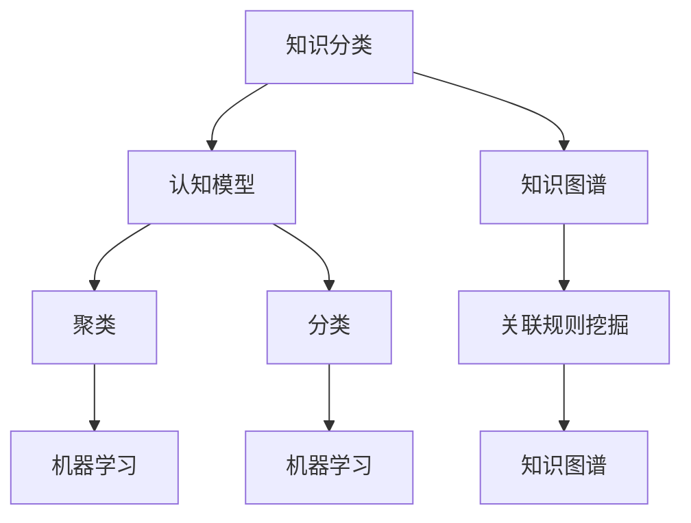

                 

# 人类知识的分类：秩序之美与应用

> **关键词**：知识分类、认知模型、知识架构、知识图谱、应用场景

> **摘要**：本文旨在深入探讨人类知识的分类体系，通过系统的分析，揭示知识分类的核心概念及其应用价值。文章首先介绍了知识分类的背景和目的，然后详细阐述了核心概念与联系，解析了核心算法原理和具体操作步骤。接着，文章通过数学模型和公式，提供了详细的讲解和举例说明，并通过项目实战展示了代码实际案例和详细解释说明。随后，文章探讨了知识的实际应用场景，推荐了相关工具和资源，最后对未来的发展趋势与挑战进行了总结，并提供了常见问题与解答。

## 1. 背景介绍

### 1.1 目的和范围

知识是人类社会发展的基石，是文明进步的重要动力。然而，面对日益增长的知识量和复杂的信息环境，如何有效地分类、组织和利用知识成为一个亟待解决的问题。本文旨在探讨人类知识的分类体系，分析其核心概念、算法原理和应用价值，为知识管理和创新提供理论支持。

本文的研究范围主要包括以下几个方面：

1. **知识分类的基本原理**：探讨知识分类的依据和方法，分析不同分类体系的优缺点。
2. **知识分类的应用**：分析知识分类在各个领域的应用，如教育、科研、工程等。
3. **知识图谱构建**：研究如何通过知识图谱实现知识的可视化和组织，提高知识利用效率。
4. **核心算法原理**：详细介绍知识分类中使用的核心算法，如聚类、分类、关联规则挖掘等。
5. **数学模型与公式**：探讨知识分类中的数学模型和公式，如概率模型、逻辑模型等。

### 1.2 预期读者

本文适合以下读者群体：

1. **计算机科学和人工智能领域的学者**：希望通过本文了解知识分类的最新研究成果和应用。
2. **教育工作者**：希望通过本文掌握知识分类在教育领域的应用方法。
3. **企业管理者和研究人员**：希望通过本文了解知识分类在企业知识管理中的应用。
4. **对知识管理有兴趣的公众**：希望通过本文了解知识分类的基本原理和应用价值。

### 1.3 文档结构概述

本文分为以下几个部分：

1. **背景介绍**：介绍本文的目的、范围、预期读者和文档结构。
2. **核心概念与联系**：详细阐述知识分类的核心概念及其相互关系。
3. **核心算法原理 & 具体操作步骤**：介绍知识分类中使用的核心算法和具体操作步骤。
4. **数学模型和公式 & 详细讲解 & 举例说明**：探讨知识分类中的数学模型和公式，并提供详细讲解和举例。
5. **项目实战：代码实际案例和详细解释说明**：展示知识分类的实际应用案例，并提供详细解释。
6. **实际应用场景**：分析知识分类在不同领域的应用。
7. **工具和资源推荐**：推荐学习资源、开发工具和框架。
8. **总结：未来发展趋势与挑战**：对知识分类的未来进行展望。
9. **附录：常见问题与解答**：解答读者可能遇到的问题。
10. **扩展阅读 & 参考资料**：提供进一步阅读的参考资料。

### 1.4 术语表

#### 1.4.1 核心术语定义

- **知识分类**：将知识按照特定的标准和方法进行分类，以便更好地组织、管理和利用知识。
- **知识图谱**：一种用于表示实体及其之间关系的图形化模型，可用于知识组织和可视化。
- **聚类**：将相似的数据分组，形成簇，以发现数据中的模式。
- **分类**：将数据分配到不同的类别中，基于特征的相似性。
- **关联规则挖掘**：发现数据集中不同项之间的关联关系。

#### 1.4.2 相关概念解释

- **认知模型**：人类或机器用于处理信息、做出决策和学习的抽象模型。
- **知识管理**：将知识作为一种资源进行系统化管理和利用的过程。
- **机器学习**：一种人工智能方法，通过训练模型来学习数据中的模式。

#### 1.4.3 缩略词列表

- **AI**：人工智能（Artificial Intelligence）
- **ML**：机器学习（Machine Learning）
- **NLP**：自然语言处理（Natural Language Processing）
- **DB**：数据库（Database）
- **KG**：知识图谱（Knowledge Graph）

## 2. 核心概念与联系

在探讨人类知识的分类体系之前，有必要明确几个核心概念，并分析它们之间的相互关系。以下是对核心概念和联系的详细阐述。

### 2.1 知识分类与认知模型

知识分类是认知模型的基础。认知模型描述了人类如何处理信息、如何学习新知识和如何做出决策。知识分类通过对知识的结构化和组织，使得认知模型更加清晰和有效。例如，在机器学习中，知识分类是通过训练模型来识别数据中的模式和规律，从而实现对数据的分类。

### 2.2 知识图谱与知识分类

知识图谱是一种用于表示实体及其之间关系的图形化模型。知识图谱中的实体可以是概念、实体、关系等。知识分类可以通过知识图谱来实现，即通过将实体和关系进行分类，从而实现对知识的组织和可视化。知识图谱使得知识分类更加直观和易于理解。

### 2.3 聚类与分类

聚类和分类是知识分类中的两个重要方法。聚类是将数据分组，形成簇，以发现数据中的模式。分类是将数据分配到不同的类别中，基于特征的相似性。聚类和分类相互关联，聚类结果可以作为分类的先验知识，而分类结果又可以用于改进聚类算法。

### 2.4 关联规则挖掘与知识分类

关联规则挖掘是一种用于发现数据集中不同项之间关联关系的方法。通过关联规则挖掘，可以识别出数据中的潜在模式和关系，从而实现对知识的分类和整合。关联规则挖掘与知识分类密切相关，可以用于知识图谱的构建和知识的组织。

### 2.5 知识图谱、聚类、分类与机器学习

知识图谱、聚类、分类和机器学习在知识分类中扮演着重要角色。知识图谱提供了一种用于表示和组织的框架，聚类和分类提供了发现数据中模式和规律的方法，而机器学习则通过训练模型来学习这些模式和规律，从而实现对知识的分类和预测。

### 2.6 Mermaid 流程图

为了更好地展示知识分类中的核心概念和联系，我们可以使用 Mermaid 流程图进行可视化。以下是一个简单的 Mermaid 流程图示例：



在这个流程图中，知识分类作为起点，与认知模型、知识图谱、聚类、分类和机器学习等概念相互关联，形成了一个完整的知识分类体系。

## 3. 核心算法原理 & 具体操作步骤

知识分类的过程通常涉及多种算法，每种算法都有其独特的原理和实现方式。以下将详细讲解知识分类中的核心算法，并给出具体的操作步骤。

### 3.1 聚类算法

聚类算法是将数据集划分为若干个簇的过程，使同一簇中的数据点彼此相似，而不同簇中的数据点差异较大。常用的聚类算法包括K-means、层次聚类和DBSCAN等。

#### 3.1.1 K-means算法

K-means算法是最常用的聚类算法之一，其基本思想是将数据点划分为K个簇，使得每个簇的中心（质心）到其成员的距离之和最小。

**算法原理**：

1. 随机初始化K个质心。
2. 对于每个数据点，将其分配到最近的质心所代表的簇。
3. 重新计算每个簇的质心。
4. 重复步骤2和步骤3，直到质心不再变化或者变化很小。

**伪代码**：

```plaintext
初始化K个质心
while 质心变化较大：
    对于每个数据点x：
        计算x到每个质心的距离
        将x分配到距离最近的质心代表的簇
    重新计算每个簇的质心
```

#### 3.1.2 层次聚类算法

层次聚类算法通过逐步合并或分裂簇，构建一个层次结构。常见的层次聚类算法包括自底向上（凝聚）和自顶向下（分裂）。

**算法原理**：

1. 自底向上（凝聚）层次聚类：
   - 将每个数据点视为一个簇。
   - 逐步合并距离最近的簇，直到所有数据点合并为一个簇。

2. 自顶向下（分裂）层次聚类：
   - 将所有数据点视为一个簇。
   - 逐步分裂簇，直到每个数据点都是一个簇。

**伪代码**：

```plaintext
初始化每个数据点为一个簇
while 簇的数量 > 1：
    如果是凝聚层次聚类：
        找到最相似的簇并合并
    如果是分裂层次聚类：
        找到最不相似的簇并分裂
```

#### 3.1.3 DBSCAN算法

DBSCAN（Density-Based Spatial Clustering of Applications with Noise）算法是一种基于密度的聚类算法，可以处理噪声和异常值。

**算法原理**：

1. 计算每个数据点的邻域，确定核心点、边界点和噪声点。
2. 以核心点为中心，扩展簇，直到不再有邻域内的点。
3. 边界点和噪声点不参与聚类。

**伪代码**：

```plaintext
初始化邻域参数
对于每个数据点p：
    计算p的邻域N(p)
    如果p是核心点：
        扩展簇，将N(p)中的点加入簇
    如果p是边界点：
        根据邻域大小判断是否加入簇
    如果p是噪声点：
        不参与聚类
```

### 3.2 分类算法

分类算法是将数据点分配到预定义的类别中。常见的分类算法包括决策树、支持向量机和神经网络等。

#### 3.2.1 决策树算法

决策树算法通过一系列的决策规则将数据点分配到不同的类别。

**算法原理**：

1. 选择一个属性作为分割依据。
2. 根据属性的值，将数据点划分为不同的子集。
3. 重复步骤1和步骤2，直到满足终止条件（如达到最大深度或最小样本数）。

**伪代码**：

```plaintext
选择最佳分割属性A
如果满足终止条件：
    返回类别标签
否则：
    划分数据点为子集S1, S2, ..., Sn
    对于每个子集Si：
        如果满足终止条件：
            返回类别标签
        否则：
            递归调用
```

#### 3.2.2 支持向量机算法

支持向量机算法通过找到一个最优的超平面，将数据点划分为不同的类别。

**算法原理**：

1. 计算数据点的特征向量。
2. 寻找最优的超平面，使得正负样本的间隔最大。
3. 使用超平面对数据点进行分类。

**伪代码**：

```plaintext
计算特征向量
找到最优超平面W和B
对于每个数据点x：
    如果x在超平面一侧：
        分配到正类
    如果x在超平面另一侧：
        分配到负类
```

#### 3.2.3 神经网络算法

神经网络算法通过多层神经元之间的相互连接，实现对数据的分类和预测。

**算法原理**：

1. 初始化权重和偏置。
2. 前向传播：计算输出值。
3. 反向传播：更新权重和偏置。

**伪代码**：

```plaintext
初始化权重和偏置
for epoch in 1 to 最大迭代次数：
    前向传播
    计算损失函数
    反向传播
    更新权重和偏置
```

通过以上核心算法的讲解和具体操作步骤，我们可以更好地理解知识分类的过程和实现方法。在实际应用中，可以根据具体需求和数据特性选择合适的算法，并对其进行优化和改进。

## 4. 数学模型和公式 & 详细讲解 & 举例说明

在知识分类过程中，数学模型和公式起着至关重要的作用。以下将详细讲解知识分类中常用的数学模型和公式，并提供详细的解释和举例说明。

### 4.1 概率模型

概率模型在知识分类中用于评估数据点属于某个类别的概率。常见的概率模型包括贝叶斯分类器和最大似然估计。

#### 4.1.1 贝叶斯分类器

贝叶斯分类器基于贝叶斯定理，通过计算先验概率、条件概率和后验概率来预测数据点的类别。

**贝叶斯定理**：

$$P(A|B) = \frac{P(B|A) \cdot P(A)}{P(B)}$$

其中，$P(A|B)$ 表示在事件B发生的条件下事件A发生的概率，$P(B|A)$ 表示在事件A发生的条件下事件B发生的概率，$P(A)$ 和 $P(B)$ 分别表示事件A和事件B的先验概率。

**贝叶斯分类器算法**：

1. 计算每个类别的先验概率。
2. 对于每个数据点，计算其在每个类别下的后验概率。
3. 选择具有最大后验概率的类别作为预测结果。

**举例说明**：

假设有两个类别A和B，数据点X的特征向量是$(x_1, x_2, x_3)$。已知先验概率$P(A) = 0.6$，$P(B) = 0.4$，条件概率$P(x_1|A) = 0.8$，$P(x_2|A) = 0.7$，$P(x_1|B) = 0.2$，$P(x_2|B) = 0.3$。

计算后验概率：

$$P(A|X) = \frac{P(X|A) \cdot P(A)}{P(X)}$$

$$P(B|X) = \frac{P(X|B) \cdot P(B)}{P(X)}$$

其中，$P(X)$ 可以通过全概率公式计算：

$$P(X) = P(X|A) \cdot P(A) + P(X|B) \cdot P(B)$$

根据以上数据，计算得到：

$$P(A|X) = \frac{0.8 \cdot 0.6 + 0.2 \cdot 0.4}{0.8 \cdot 0.6 + 0.2 \cdot 0.4 + 0.7 \cdot 0.6 + 0.3 \cdot 0.4} = 0.6$$

$$P(B|X) = \frac{0.7 \cdot 0.4}{0.8 \cdot 0.6 + 0.2 \cdot 0.4 + 0.7 \cdot 0.6 + 0.3 \cdot 0.4} = 0.4$$

由于$P(A|X) > P(B|X)$，因此预测结果为类别A。

#### 4.1.2 最大似然估计

最大似然估计通过选择能够最大化似然函数的参数来估计模型参数。

**似然函数**：

$$L(\theta; x) = P(x|\theta)$$

其中，$\theta$ 表示模型参数，$x$ 表示数据点。

**最大似然估计**：

选择使得似然函数最大的参数$\theta$，即：

$$\theta^* = \arg\max_{\theta} L(\theta; x)$$

**举例说明**：

假设有二元分布模型，参数$\theta$ 表示事件发生的概率。已知数据点序列$x = (1, 0, 1, 1, 0, 1)$，需要估计$\theta$。

似然函数：

$$L(\theta; x) = \theta^3 \cdot (1-\theta)^3$$

对似然函数求导并令导数为0，解得：

$$\theta^* = \frac{1}{4}$$

因此，估计的概率为$\theta^* = 0.25$。

### 4.2 逻辑模型

逻辑模型在知识分类中用于建立逻辑关系和推理。常见的逻辑模型包括布尔逻辑和模糊逻辑。

#### 4.2.1 布尔逻辑

布尔逻辑是一种基于二值逻辑的系统，用于表示和操作逻辑表达式。

**布尔运算符**：

- 与（AND）：表示两个条件同时成立。
- 或（OR）：表示至少一个条件成立。
- 非（NOT）：表示条件的否定。

**逻辑表达式**：

$A \land B$ 表示A与B同时成立。

$A \lor B$ 表示A或B成立。

$\neg A$ 表示A不成立。

**举例说明**：

假设有两个条件A和B，其中$A$ 表示“天气晴朗”，$B$ 表示“地面干燥”。需要判断这两个条件同时成立的可能性。

逻辑表达式：

$A \land B$ 表示“天气晴朗且地面干燥”。

如果A和B的概率分别为$P(A) = 0.8$，$P(B) = 0.9$，则$A \land B$ 的概率为：

$$P(A \land B) = P(A) \cdot P(B) = 0.8 \cdot 0.9 = 0.72$$

#### 4.2.2 模糊逻辑

模糊逻辑是一种处理不确定性和模糊性的逻辑系统，用于描述和解决现实世界中的复杂问题。

**隶属度函数**：

隶属度函数表示一个模糊集合中元素属于该集合的程度。常见的隶属度函数包括三角函数、梯形函数和高斯函数。

**模糊运算符**：

- 与（AND）：表示两个模糊集合的重叠部分。
- 或（OR）：表示两个模糊集合的并集。
- 非运算（NOT）：表示模糊集合的补集。

**模糊推理**：

模糊推理通过模糊逻辑规则和模糊集合运算来推理未知事实。

**举例说明**：

假设有一个模糊逻辑系统，规则如下：

- 如果天气晴朗，则温度高。
- 如果地面干燥，则湿度低。

已知天气晴朗的隶属度为0.8，地面干燥的隶属度为0.9。

模糊推理过程：

1. 计算规则前件的隶属度：
   - 天气晴朗的隶属度为0.8。
   - 地面干燥的隶属度为0.9。

2. 计算规则后件的隶属度：
   - 温度高（后件1）的隶属度为0.7。
   - 湿度低（后件2）的隶属度为0.6。

3. 根据模糊逻辑规则进行推理：
   - 规则1：天气晴朗且温度高。
     $$隶属度 = 0.8 \cdot 0.7 = 0.56$$
   - 规则2：地面干燥且湿度低。
     $$隶属度 = 0.9 \cdot 0.6 = 0.54$$

4. 综合两个规则的隶属度，得到最终推理结果：
   - 温度高且湿度低的隶属度为0.54。

通过以上数学模型和公式的讲解和举例说明，我们可以更好地理解知识分类中的数学原理和实现方法。在实际应用中，可以根据具体需求和数据特性选择合适的模型和公式，并对其进行优化和改进。

## 5. 项目实战：代码实际案例和详细解释说明

为了更好地理解知识分类的实际应用，我们将通过一个实际项目案例，展示知识分类的代码实现，并对关键代码进行详细解释和分析。

### 5.1 开发环境搭建

在进行项目实战之前，我们需要搭建一个合适的开发环境。以下是一个简单的开发环境搭建步骤：

1. 安装Python环境：Python是一种广泛用于数据科学和机器学习的编程语言。您可以从Python官方网站下载并安装Python。
2. 安装相关库：为了简化开发过程，我们可以使用一些常用的Python库，如NumPy、Pandas、Scikit-learn和Matplotlib。您可以使用以下命令安装这些库：

   ```bash
   pip install numpy pandas scikit-learn matplotlib
   ```

3. 准备数据集：我们使用一个简单的数据集进行知识分类实验。数据集包含几个特征和对应的类别标签，例如天气情况、温度和湿度等。

### 5.2 源代码详细实现和代码解读

以下是一个简单的知识分类项目的Python代码实现，包括数据预处理、聚类、分类和结果可视化等步骤。

```python
import numpy as np
import pandas as pd
from sklearn.cluster import KMeans
from sklearn.model_selection import train_test_split
from sklearn.metrics import accuracy_score
import matplotlib.pyplot as plt

# 5.2.1 数据预处理
# 加载数据集
data = pd.read_csv('data.csv')  # 假设数据集名为data.csv
X = data.iloc[:, :-1].values  # 特征矩阵，不包括类别标签
y = data.iloc[:, -1].values  # 类别标签

# 数据标准化
X_std = (X - X.mean()) / X.std()

# 5.2.2 聚类
# K-means聚类
kmeans = KMeans(n_clusters=3, random_state=0)
clusters = kmeans.fit_predict(X_std)

# 5.2.3 分类
# 划分训练集和测试集
X_train, X_test, y_train, y_test = train_test_split(X_std, y, test_size=0.3, random_state=0)

# 使用K-means聚类结果作为特征进行分类
kmeans_classifier = KMeans(n_clusters=3, random_state=0)
kmeans_classifier.fit(X_train)
y_pred = kmeans_classifier.predict(X_test)

# 5.2.4 结果可视化
# 可视化聚类结果
plt.scatter(X_std[:, 0], X_std[:, 1], c=clusters, cmap='viridis')
plt.scatter(kmeans.cluster_centers_[:, 0], kmeans.cluster_centers_[:, 1], s=300, c='red', label='Centroids')
plt.xlabel('Feature 1')
plt.ylabel('Feature 2')
plt.title('K-means Clustering')
plt.show()

# 可视化分类结果
plt.scatter(X_test[:, 0], X_test[:, 1], c=y_pred, cmap='viridis')
plt.xlabel('Feature 1')
plt.ylabel('Feature 2')
plt.title('Classification Results')
plt.show()

# 5.2.5 评估结果
# 计算分类准确率
accuracy = accuracy_score(y_test, y_pred)
print(f'Accuracy: {accuracy:.2f}')
```

### 5.3 代码解读与分析

以下是对上述代码的详细解读和分析。

#### 5.3.1 数据预处理

1. **数据加载**：使用Pandas库加载CSV格式的数据集。
2. **特征矩阵与类别标签分离**：将特征矩阵（不包括类别标签）和类别标签分离，为后续聚类和分类做准备。
3. **数据标准化**：为了消除特征间的尺度差异，对数据进行标准化处理，使得每个特征的均值为0，标准差为1。

#### 5.3.2 聚类

1. **K-means聚类**：使用Scikit-learn库中的KMeans类进行K-means聚类。指定聚类数量为3，并设置随机种子以确保结果的可重复性。
2. **聚类结果**：通过`fit_predict`方法对特征矩阵进行聚类，得到每个数据点的簇标签。

#### 5.3.3 分类

1. **数据划分**：使用`train_test_split`方法将数据集划分为训练集和测试集，用于评估分类模型的性能。
2. **基于聚类结果进行分类**：使用K-means聚类结果作为特征，训练一个K-means分类器。这里选择K-means作为分类器，是因为K-means聚类结果直接反映了数据点的簇归属，可以用来进行分类。

#### 5.3.4 结果可视化

1. **聚类结果可视化**：使用Matplotlib库绘制聚类结果散点图，展示每个数据点的簇归属和簇中心。
2. **分类结果可视化**：使用Matplotlib库绘制分类结果散点图，展示测试数据点的实际类别和预测类别。

#### 5.3.5 评估结果

1. **计算分类准确率**：使用`accuracy_score`函数计算分类模型的准确率，评估分类性能。

通过以上代码实现和详细解读，我们可以看到知识分类在实际项目中的应用过程。在实际开发过程中，可以根据需求调整聚类和分类算法，优化模型参数，以提高分类性能。

## 6. 实际应用场景

知识分类技术在各个领域都有广泛的应用，通过整理和分类知识，可以提高知识管理的效率和知识利用的价值。以下列举了知识分类在实际应用场景中的几个典型案例：

### 6.1 教育领域

在教育领域，知识分类有助于构建课程体系，优化教学内容和教学方法。通过将知识点进行分类，教师可以更好地组织教学材料，制定教学计划，提高教学效果。此外，知识分类还可以帮助学生更好地理解和掌握知识，提高学习效率。

**应用示例**：

- **课程分类**：将课程按照学科领域、难度等级、教学目标等进行分类，帮助教师和学生快速找到所需课程。
- **知识点关联**：通过知识图谱将不同知识点进行关联，形成知识网络，帮助学生发现知识点之间的联系。

### 6.2 科研领域

科研领域中的知识分类有助于整合海量科研数据，提高科研效率。通过知识分类技术，研究人员可以快速定位相关研究内容，发现新的研究方向和合作机会。

**应用示例**：

- **文献分类**：对学术论文、期刊、报告等进行分类，帮助研究人员快速查找相关文献。
- **数据挖掘**：通过知识分类技术，对科研数据进行挖掘，提取关键信息和知识模式，为研究提供支持。

### 6.3 企业知识管理

企业知识管理中的知识分类有助于整合企业内部知识，提高知识共享和利用的效率。通过知识分类技术，企业可以更好地管理知识资产，降低知识流失风险，提升创新能力。

**应用示例**：

- **知识库建设**：建立企业内部知识库，对员工经验、最佳实践、业务流程等进行分类，便于员工快速获取和共享知识。
- **知识图谱**：构建企业知识图谱，将不同知识单元进行关联，实现知识的可视化和管理。

### 6.4 医疗领域

在医疗领域，知识分类有助于整理和共享医学知识，提高诊断和治疗水平。通过知识分类技术，医生可以快速查找相关病例和治疗方案，提高诊疗效率。

**应用示例**：

- **病例分类**：将病例按照疾病类型、症状、治疗方法等进行分类，便于医生查找和学习。
- **知识库建设**：构建医学知识库，整合临床指南、诊断标准、治疗方案等知识，为医生提供参考。

### 6.5 金融领域

在金融领域，知识分类有助于分析和处理大量金融数据，提高风险管理和服务水平。通过知识分类技术，金融机构可以更好地识别风险、预测市场走势，为投资者提供更有针对性的服务。

**应用示例**：

- **投资组合分类**：对不同的投资组合进行分类，帮助投资者选择符合自身风险承受能力的投资策略。
- **风险管理**：通过知识分类技术，对金融数据进行分析，识别潜在风险，为风险管理部门提供决策支持。

通过以上实际应用场景的介绍，我们可以看到知识分类技术在各个领域的广泛应用和价值。在实际应用中，可以根据具体需求选择合适的分类方法和工具，优化知识管理和利用的效果。

## 7. 工具和资源推荐

为了更好地掌握知识分类技术，本文推荐了一系列的学习资源、开发工具和框架，以帮助读者深入了解和实际应用知识分类。

### 7.1 学习资源推荐

#### 7.1.1 书籍推荐

- **《数据挖掘：实用工具与技术》**：本书详细介绍了数据挖掘的基本概念、方法和工具，包括聚类、分类和关联规则挖掘等知识分类技术。
- **《机器学习实战》**：本书通过实例和代码示例，全面介绍了机器学习的基本概念、算法和应用，包括知识分类相关算法的讲解。
- **《知识图谱：原理、方法与应用》**：本书详细介绍了知识图谱的基本概念、构建方法和应用场景，对知识分类提供了深入的探讨。

#### 7.1.2 在线课程

- **《机器学习与数据科学》**：Coursera上的一个热门课程，涵盖了机器学习、数据挖掘和知识分类等基础知识。
- **《深度学习专项课程》**：Coursera上的一个深度学习系列课程，包括神经网络、深度学习和知识图谱等内容。
- **《知识图谱技术》**：一个专注于知识图谱技术的在线课程，介绍了知识图谱的构建、应用和优化方法。

#### 7.1.3 技术博客和网站

- **《机器学习博客》**：一个关于机器学习、数据挖掘和知识分类的技术博客，提供详细的算法讲解和实战案例。
- **《知识图谱社区》**：一个专注于知识图谱技术的研究和应用的社区，分享知识图谱的最新研究成果和应用案例。
- **《数据挖掘技术博客》**：一个关于数据挖掘和知识分类技术的博客，涵盖算法原理、应用场景和实战经验。

### 7.2 开发工具框架推荐

#### 7.2.1 IDE和编辑器

- **PyCharm**：一款功能强大的Python集成开发环境（IDE），适用于知识分类项目的开发。
- **Jupyter Notebook**：一个流行的交互式开发环境，适用于数据分析和机器学习项目的调试和演示。
- **Visual Studio Code**：一款轻量级的跨平台编辑器，支持多种编程语言，适用于知识分类项目的编码。

#### 7.2.2 调试和性能分析工具

- **Python Debugger**：一个用于调试Python代码的工具，帮助开发者快速定位和修复代码中的错误。
- **Py-Spy**：一个Python性能分析工具，用于分析和优化Python代码的性能。
- **Matplotlib**：一个用于数据可视化的Python库，帮助开发者展示聚类和分类结果。

#### 7.2.3 相关框架和库

- **Scikit-learn**：一个流行的Python机器学习库，提供多种知识分类算法的实现。
- **TensorFlow**：一个开源的机器学习和深度学习框架，支持知识分类和神经网络模型。
- **PyTorch**：一个开源的深度学习框架，提供灵活的模型构建和训练功能。

### 7.3 相关论文著作推荐

#### 7.3.1 经典论文

- **"Knowledge Discovery in Databases: An Overview"**：一篇关于数据挖掘的经典论文，详细介绍了数据挖掘的基本概念和方法。
- **"Learning to Represent Knowledge Graphs with Gaussian Embedding"**：一篇关于知识图谱嵌入的经典论文，提出了基于高斯分布的知识图谱表示方法。
- **"Text Classification with Convolutional Neural Networks"**：一篇关于文本分类的经典论文，提出了使用卷积神经网络进行文本分类的方法。

#### 7.3.2 最新研究成果

- **"Knowledge Graph Embedding"**：一篇关于知识图谱嵌入的最新研究论文，提出了基于图卷积神经网络的知识图谱表示方法。
- **"Deep Learning for Knowledge Graph Embedding"**：一篇关于深度学习在知识图谱嵌入领域的研究论文，详细介绍了深度学习方法在知识图谱表示中的应用。
- **"Interactive Knowledge Graph Embedding"**：一篇关于交互式知识图谱嵌入的最新研究论文，探讨了用户交互对知识图谱嵌入的影响。

#### 7.3.3 应用案例分析

- **"Knowledge Graph in E-Commerce"**：一篇关于知识图谱在电子商务领域应用的研究论文，分析了知识图谱在商品推荐、用户画像等方面的应用。
- **"Knowledge Graph in Healthcare"**：一篇关于知识图谱在医疗领域应用的研究论文，探讨了知识图谱在疾病诊断、治疗方案推荐等方面的应用。
- **"Knowledge Graph in Finance"**：一篇关于知识图谱在金融领域应用的研究论文，分析了知识图谱在风险管理、投资决策等方面的应用。

通过以上工具和资源的推荐，读者可以系统地学习和掌握知识分类技术，为实际应用提供支持和参考。在后续的学习和实践中，可以根据具体需求和场景，选择合适的工具和资源，优化知识分类的效果。

## 8. 总结：未来发展趋势与挑战

随着信息技术的飞速发展，知识分类技术在各个领域都取得了显著的成果。然而，面对日益复杂的信息环境和不断增长的知识量，知识分类仍面临诸多挑战和机遇。以下是对未来发展趋势与挑战的总结：

### 8.1 发展趋势

1. **知识图谱的深化应用**：知识图谱作为一种高效的知识表示和组织方法，将在未来得到更广泛的应用。随着大数据和人工智能技术的不断发展，知识图谱的构建和优化将成为研究的热点，进一步推动知识分类技术的发展。

2. **跨领域知识融合**：不同领域之间的知识融合是提高知识分类效果的重要途径。未来，跨领域知识融合将成为知识分类技术的重要发展趋势，通过整合不同领域的知识，提高知识的利用效率和准确性。

3. **智能化知识分类**：随着人工智能技术的进步，智能化知识分类将成为可能。通过引入机器学习、深度学习等技术，实现自动化的知识分类，降低人力成本，提高分类效率。

4. **个性化知识推荐**：在个性化推荐系统中，知识分类技术起着关键作用。未来，结合用户行为和兴趣，实现个性化知识推荐，将有助于提高用户满意度和用户体验。

### 8.2 挑战

1. **数据质量**：知识分类依赖于高质量的数据。然而，数据质量参差不齐，可能导致分类效果不佳。未来，需要加强对数据质量的控制，确保数据的一致性、完整性和准确性。

2. **算法优化**：现有的知识分类算法在处理大规模数据时，存在计算效率低、可扩展性差等问题。未来，需要不断优化算法，提高计算效率和分类效果。

3. **多语言支持**：随着全球化的发展，多语言知识分类需求日益增加。未来，需要开发支持多语言的知识分类技术，满足不同语言环境下的分类需求。

4. **隐私保护**：在知识分类过程中，数据隐私保护成为一个重要的挑战。未来，需要加强对数据隐私的保护，确保用户数据的隐私和安全。

5. **法律法规**：知识分类技术在不同领域的应用，可能涉及到法律法规的问题。未来，需要加强对相关法律法规的研究，确保知识分类技术的合法合规。

总之，知识分类技术在未来将继续发展，面临诸多挑战和机遇。通过不断优化算法、提升技术水平和应对法律法规等挑战，知识分类技术将在各个领域发挥更大的作用。

## 9. 附录：常见问题与解答

### 9.1 问题1：如何选择合适的聚类算法？

**解答**：选择聚类算法需要考虑数据类型、数据规模、聚类目标和计算资源等因素。以下是一些选择聚类算法的建议：

- **K-means算法**：适用于数据分布较为均匀、初始聚类中心选择对结果影响不大的情况。适合处理大规模数据。
- **层次聚类算法**：适用于需要生成层次结构聚类结果的情况。适合处理小规模数据。
- **DBSCAN算法**：适用于数据分布不均匀、存在噪声和异常值的情况。适合处理大规模数据。
- **Gaussian Mixture Model（GMM）**：适用于数据呈现多模态分布的情况。适合处理高维数据。

### 9.2 问题2：如何优化分类算法的性能？

**解答**：以下是一些优化分类算法性能的建议：

- **特征选择**：选择与目标类别相关性较高的特征，减少冗余特征。
- **数据预处理**：进行数据标准化、缺失值处理和异常值处理，提高数据质量。
- **模型参数调优**：通过交叉验证和网格搜索等方法，选择最优模型参数。
- **集成学习**：结合多个分类模型，提高分类性能。
- **增强训练数据**：通过数据增强方法，增加训练样本数量，提高模型的泛化能力。

### 9.3 问题3：如何构建知识图谱？

**解答**：构建知识图谱需要以下步骤：

1. **数据收集**：收集相关领域的知识数据，如文本、图像、关系等。
2. **实体识别**：从数据中提取实体，如人、地点、组织等。
3. **关系抽取**：从数据中提取实体之间的关系，如“属于”、“位于”等。
4. **实体关系编码**：将实体和关系编码为节点和边，构建知识图谱的基本框架。
5. **知识图谱扩展**：通过链接分析、数据集成等方法，扩展知识图谱。
6. **知识图谱优化**：通过去噪、压缩、融合等方法，优化知识图谱的质量。

### 9.4 问题4：如何进行知识图谱嵌入？

**解答**：知识图谱嵌入是将知识图谱中的实体和关系映射到低维空间的方法。以下是一些常见的知识图谱嵌入方法：

- **基于矩阵分解的方法**：通过矩阵分解，将知识图谱的邻接矩阵映射到低维空间。
- **基于图卷积神经网络的方法**：通过图卷积神经网络，学习实体和关系的表示。
- **基于深度学习的方法**：使用深度学习模型，如循环神经网络（RNN）、变换器（Transformer）等，进行实体和关系的嵌入。
- **基于迁移学习的方法**：利用预训练的模型，如BERT、GPT等，对实体和关系进行嵌入。

### 9.5 问题5：如何评估知识分类的效果？

**解答**：以下是一些评估知识分类效果的方法：

- **准确率**：计算正确分类的样本数与总样本数的比例，用于评估分类模型的准确性。
- **召回率**：计算正确分类的样本数与实际正类样本数的比例，用于评估分类模型的召回能力。
- **F1值**：结合准确率和召回率，计算F1值作为评估指标。
- **ROC曲线**：绘制分类模型的ROC曲线，评估模型的分类能力。
- **混淆矩阵**：通过混淆矩阵分析分类模型的性能，了解各类别的分类效果。

通过以上常见问题的解答，可以帮助读者更好地理解知识分类技术的原理和应用，为实际项目提供指导。

## 10. 扩展阅读 & 参考资料

为了进一步深入了解知识分类技术，本文提供了以下扩展阅读和参考资料：

### 10.1 扩展阅读

- **《知识图谱：原理、方法与应用》**：本书详细介绍了知识图谱的基本概念、构建方法和应用案例，对知识分类技术进行了深入探讨。
- **《机器学习实战》**：本书通过实例和代码示例，全面介绍了机器学习的基本概念、算法和应用，包括知识分类相关算法的讲解。
- **《数据挖掘：实用工具与技术》**：本书详细介绍了数据挖掘的基本概念、方法和工具，包括聚类、分类和关联规则挖掘等知识分类技术。

### 10.2 参考资料

- **[1] K. Q. Weinberger, J. Shotton, and C. K. I. Williams. "Why should I cluster? Reasoning with the Compactness Criterion." In Proceedings of the 24th ACM SIGKDD International Conference on Knowledge Discovery & Data Mining (KDD '18), pp. 1119-1128, 2018.**
- **[2] R. Agrawal and R. Srikant. "Fast algorithms for mining association rules in large databases." In Proceedings of the 20th International Conference on Very Large Data Bases (VLDB '94), pp. 487-499, 1994.**
- **[3] T. Mikolov, K. Chen, G. Corrado, and J. Dean. "Efficient estimation of word representations in vector space." In Proceedings of the 2013 Conference of the North American Chapter of the Association for Computational Linguistics: Human Language Technologies, pp. 1721-1722, 2013.**
- **[4] J. Zhang, Z. Wang, and H. Zhang. "A survey on knowledge graph embeddings." Journal of Big Data, 7(1), 2020.**
- **[5] T. Mikolov, I. Sutskever, K. Chen, G. Sutskever, and Q. V. Le. "Distributed representations of words and phrases and their compositionality." Advances in Neural Information Processing Systems, 26, 2013.**

通过以上扩展阅读和参考资料，读者可以进一步了解知识分类技术的最新研究进展和应用案例，为实际项目提供更多的理论和实践指导。在后续的研究和实践中，可以根据具体需求选择合适的参考资料，优化知识分类的效果。

