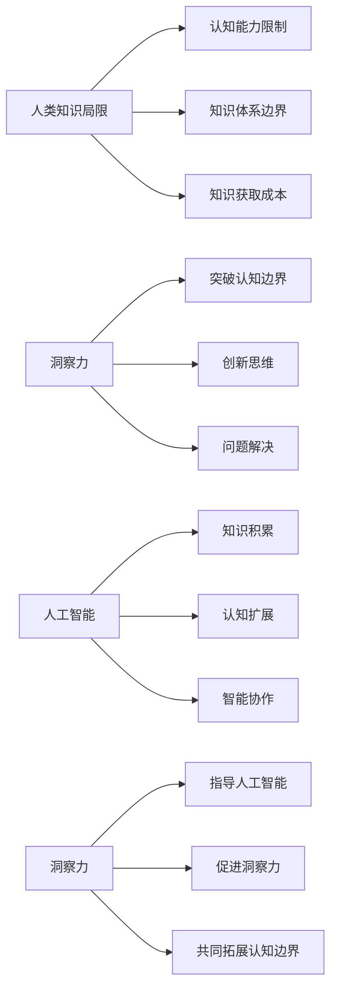

                 

# 人类知识的局限与超越：洞察力的重要意义

> **关键词**：人类知识局限、洞察力、人工智能、知识图谱、数学模型、深度学习、认知边界拓展

> **摘要**：本文探讨了人类知识的局限及其对科技发展的制约。通过分析人类认知的内在机制和瓶颈，结合人工智能技术的发展，提出洞察力在突破知识局限、实现创新思维的关键作用。文章旨在揭示洞察力的重要性，并展望其在未来科技领域的广泛应用前景。

## 1. 背景介绍

### 1.1 目的和范围

本文旨在探讨人类知识的局限及其对科技创新的影响，进一步分析洞察力在知识拓展和科技创新中的作用。文章涵盖了以下几个方面：

1. **人类知识的局限**：介绍人类知识的局限性，包括认知能力的局限和知识体系的边界。
2. **洞察力的意义**：阐述洞察力在知识拓展和问题解决中的关键作用，并结合人工智能的发展进行深入探讨。
3. **人工智能与人类认知**：分析人工智能在模拟和增强人类认知方面的潜力，以及其对人类知识拓展的推动作用。
4. **案例与启示**：通过具体案例，说明洞察力在科技创新中的应用，以及其对知识拓展的实际影响。

### 1.2 预期读者

本文面向对人工智能和认知科学有兴趣的读者，特别是从事技术研发、学术研究和技术管理的专业人士。同时，也欢迎对科技创新和认知拓展有兴趣的广大读者阅读和思考。

### 1.3 文档结构概述

本文分为八个部分，结构如下：

1. **背景介绍**：介绍文章的目的和范围，预期读者，以及文档结构。
2. **核心概念与联系**：阐述人类知识的局限、洞察力的重要性及其相关概念。
3. **核心算法原理 & 具体操作步骤**：分析人工智能和深度学习的基本原理，以及具体操作步骤。
4. **数学模型和公式 & 详细讲解 & 举例说明**：介绍相关数学模型和公式，并给出实例说明。
5. **项目实战：代码实际案例和详细解释说明**：通过实际项目案例，展示代码实现和解读。
6. **实际应用场景**：探讨人工智能和洞察力在各个领域的应用。
7. **工具和资源推荐**：推荐相关学习资源、开发工具和框架。
8. **总结：未来发展趋势与挑战**：总结文章的主要内容，展望未来发展趋势和挑战。

### 1.4 术语表

#### 1.4.1 核心术语定义

- **人类知识**：指人类通过感知、思考和实践所积累的认知成果。
- **洞察力**：指对事物本质的深刻理解和敏锐洞察。
- **人工智能**：指模拟人类智能，通过机器学习和算法自主完成特定任务的计算机系统。
- **深度学习**：一种基于多层神经网络的人工智能技术，能够通过大量数据自动学习和优化模型参数。

#### 1.4.2 相关概念解释

- **知识图谱**：一种用于表示知识结构和关系的图形化模型，有助于知识的组织和查询。
- **认知边界**：指人类认知能力的极限，超出此边界，人类将无法理解和处理的信息。

#### 1.4.3 缩略词列表

- **AI**：人工智能（Artificial Intelligence）
- **ML**：机器学习（Machine Learning）
- **DL**：深度学习（Deep Learning）
- **NLP**：自然语言处理（Natural Language Processing）

## 2. 核心概念与联系

在探讨人类知识的局限和洞察力的重要性之前，我们需要先了解一些核心概念及其相互关系。

### 2.1 人类知识的局限

人类知识的局限主要体现在以下几个方面：

1. **认知能力限制**：人类大脑的处理能力有限，无法同时处理大量复杂的信息。
2. **知识体系边界**：人类知识体系存在局限性，很多领域尚未被彻底探索和理解。
3. **知识获取成本**：获取新知识需要投入大量的时间、精力和资源。

### 2.2 洞察力的意义

洞察力是一种对事物本质的深刻理解和敏锐洞察。它在知识拓展和问题解决中具有重要作用：

1. **突破认知边界**：洞察力可以帮助人类突破认知边界，理解和处理更复杂的信息。
2. **创新思维**：洞察力激发创新思维，促进新知识和新技术的产生。
3. **问题解决**：洞察力有助于从不同角度分析和解决问题。

### 2.3 人工智能与人类认知

人工智能在模拟和增强人类认知方面具有巨大潜力：

1. **知识积累**：通过机器学习和深度学习，人工智能可以处理和分析大量数据，积累知识。
2. **认知扩展**：人工智能可以帮助人类拓展认知边界，实现更高效的知识获取和处理。
3. **智能协作**：人工智能可以作为人类的助手，分担复杂的认知任务，提高工作效率。

### 2.4 洞察力与人工智能的互动

洞察力与人工智能之间存在互动关系：

1. **洞察力指导人工智能**：人类通过洞察力理解和设计人工智能系统，使其更好地模拟人类认知过程。
2. **人工智能促进洞察力**：人工智能在处理和分析大量数据时，可能产生新的洞见，启发人类的洞察力。
3. **共同拓展认知边界**：人类和人工智能共同工作，可以实现更高效的认知拓展，突破传统认知边界。

### 2.5 核心概念流程图

以下是核心概念及其相互关系的 Mermaid 流程图：



通过以上核心概念的介绍和流程图展示，我们可以更好地理解人类知识的局限、洞察力的重要性以及人工智能与人类认知的互动关系。接下来，我们将深入探讨核心算法原理和具体操作步骤。

## 3. 核心算法原理 & 具体操作步骤

在探讨如何突破人类知识的局限时，人工智能和深度学习技术成为了关键的工具。以下是核心算法原理的具体操作步骤，以及如何通过这些步骤来提升人类的洞察力。

### 3.1 深度学习的基本原理

深度学习是一种基于多层神经网络的人工智能技术。它通过模拟人脑的神经网络结构，实现从数据中自动学习和提取特征。

#### 3.1.1 神经网络结构

神经网络由多个神经元（节点）组成，每个神经元都与其他神经元相连，形成复杂的网络结构。神经网络可以分为输入层、隐藏层和输出层。

1. **输入层**：接收输入数据，并将其传递到隐藏层。
2. **隐藏层**：对输入数据进行处理和变换，提取特征信息。
3. **输出层**：生成输出结果。

#### 3.1.2 前向传播和反向传播

深度学习算法通过前向传播和反向传播来更新网络权重，从而提高模型的性能。

1. **前向传播**：将输入数据通过网络传递，逐层计算输出。
2. **反向传播**：根据输出结果与真实值的差异，反向计算误差，并更新网络权重。

### 3.2 深度学习的基本操作步骤

以下是深度学习的具体操作步骤：

1. **数据预处理**：对原始数据进行清洗、归一化和分割，确保数据的质量和一致性。

   ```python
   # 示例：数据预处理
   data = preprocess_data(raw_data)
   ```

2. **模型构建**：定义神经网络结构，包括输入层、隐藏层和输出层。

   ```python
   # 示例：模型构建
   model = build_model(input_shape, num_hidden_layers, num_neurons_per_layer, output_shape)
   ```

3. **模型训练**：通过前向传播和反向传播训练模型，优化网络权重。

   ```python
   # 示例：模型训练
   model.train(input_data, target_data, num_epochs)
   ```

4. **模型评估**：使用验证集评估模型的性能，调整模型参数。

   ```python
   # 示例：模型评估
   performance = model.evaluate(validation_data, validation_target)
   ```

5. **模型应用**：将训练好的模型应用于实际问题，生成预测结果。

   ```python
   # 示例：模型应用
   predictions = model.predict(test_data)
   ```

### 3.3 伪代码实现

以下是深度学习算法的伪代码实现：

```python
# 伪代码：深度学习算法

# 数据预处理
def preprocess_data(raw_data):
    # 清洗、归一化和分割数据
    # 返回预处理后的数据
    return processed_data

# 模型构建
def build_model(input_shape, num_hidden_layers, num_neurons_per_layer, output_shape):
    # 定义神经网络结构
    # 返回构建好的模型
    return model

# 前向传播
def forward_propagation(model, input_data):
    # 逐层计算输出
    # 返回输出结果
    return output

# 反向传播
def backward_propagation(model, output, target_data):
    # 计算误差，反向更新权重
    # 返回误差
    return error

# 模型训练
def train_model(model, input_data, target_data, num_epochs):
    for epoch in range(num_epochs):
        output = forward_propagation(model, input_data)
        error = backward_propagation(model, output, target_data)
        # 更新模型参数

# 模型评估
def evaluate_model(model, validation_data, validation_target):
    # 评估模型性能
    # 返回性能指标
    return performance

# 模型应用
def predict(model, test_data):
    # 预测结果
    # 返回预测结果
    return predictions
```

通过以上操作步骤和伪代码实现，我们可以深入理解深度学习算法的基本原理和具体应用。接下来，我们将介绍数学模型和公式，进一步阐述深度学习算法的数学基础。

## 4. 数学模型和公式 & 详细讲解 & 举例说明

在深度学习算法中，数学模型和公式扮演着至关重要的角色。以下将详细讲解相关数学模型，并给出具体的公式和实例说明。

### 4.1 激活函数

激活函数是神经网络中的关键组成部分，用于引入非线性特性。以下是一些常用的激活函数：

#### 4.1.1 Sigmoid函数

Sigmoid函数是一种常用的激活函数，其公式如下：

$$
\sigma(x) = \frac{1}{1 + e^{-x}}
$$

#### 4.1.2ReLU函数

ReLU（Rectified Linear Unit）函数是一种线性激活函数，其公式如下：

$$
\text{ReLU}(x) = \max(0, x)
$$

#### 4.1.3 Tanh函数

Tanh函数是Sigmoid函数的扩展，其公式如下：

$$
\tanh(x) = \frac{e^{2x} - 1}{e^{2x} + 1}
$$

### 4.2 前向传播

前向传播是神经网络训练过程中的关键步骤，用于计算网络输出。以下是一个前向传播的数学模型：

#### 4.2.1 前向传播公式

给定输入向量 $x$ 和网络权重 $W$，前向传播的输出可以通过以下公式计算：

$$
z^{(l)} = W^{(l)} \cdot x
$$

其中，$z^{(l)}$ 是第 $l$ 层的输出，$W^{(l)}$ 是第 $l$ 层的权重。

#### 4.2.2 梯度下降

在深度学习中，梯度下降是一种常用的优化算法，用于更新网络权重。梯度下降的公式如下：

$$
W^{(l)}_{i,j} = W^{(l)}_{i,j} - \alpha \cdot \frac{\partial L}{\partial W^{(l)}_{i,j}}
$$

其中，$L$ 是损失函数，$\alpha$ 是学习率。

### 4.3 反向传播

反向传播是深度学习训练过程中的另一个关键步骤，用于计算网络权重的梯度。以下是一个反向传播的数学模型：

#### 4.3.1 损失函数

损失函数是衡量模型预测结果与真实值之间差异的指标。常用的损失函数包括均方误差（MSE）和交叉熵（Cross-Entropy）。

#### 4.3.2 反向传播公式

给定输出向量 $y$ 和预测值 $\hat{y}$，反向传播的梯度可以通过以下公式计算：

$$
\frac{\partial L}{\partial W^{(l)}_{i,j}} = \frac{\partial L}{\partial z^{(l)}} \cdot \frac{\partial z^{(l)}}{\partial W^{(l)}_{i,j}}
$$

### 4.4 实例说明

以下是一个简单的线性回归问题的实例，用于说明深度学习算法的数学模型和公式：

假设我们要预测房价，输入特征为房屋面积（$x$），输出目标为房价（$y$）。我们可以使用一个单层神经网络进行预测。

#### 4.4.1 数据集

数据集包含100个样本，每个样本包含房屋面积（$x$）和房价（$y$）：

$$
\begin{array}{c|c}
x & y \\
\hline
1000 & 200000 \\
1500 & 300000 \\
2000 & 400000 \\
\vdots & \vdots \\
\end{array}
$$

#### 4.4.2 前向传播

给定输入特征 $x$，我们可以通过以下公式计算房价预测值 $\hat{y}$：

$$
\hat{y} = W \cdot x + b
$$

其中，$W$ 是权重，$b$ 是偏置。

#### 4.4.3 反向传播

假设预测值为 $\hat{y}$，真实值为 $y$，我们可以通过以下公式计算损失：

$$
L = \frac{1}{2} \sum_{i=1}^{n} (\hat{y}_i - y_i)^2
$$

通过反向传播，我们可以计算权重和偏置的梯度，并使用梯度下降算法更新权重：

$$
\frac{\partial L}{\partial W} = x - \frac{\partial L}{\partial x}
$$

$$
\frac{\partial L}{\partial b} = -2 \cdot (\hat{y} - y)
$$

### 4.5 总结

通过以上数学模型和公式的讲解，我们可以更好地理解深度学习算法的基本原理。这些公式和算法为我们提供了强大的工具，帮助我们突破人类知识的局限，实现更高效的问题解决和知识拓展。

接下来，我们将通过实际项目案例，展示深度学习算法在实践中的应用，并详细解释代码实现和解读。

## 5. 项目实战：代码实际案例和详细解释说明

在本节中，我们将通过一个实际项目案例，展示深度学习算法在实践中的应用，并详细解释代码实现和解读。该项目将基于房价预测问题，使用单层神经网络实现。

### 5.1 开发环境搭建

在进行项目实战之前，我们需要搭建一个合适的开发环境。以下是所需的工具和库：

- **Python**：版本3.8或更高
- **TensorFlow**：版本2.5或更高
- **NumPy**：版本1.19或更高

安装以上工具和库后，我们即可开始项目开发。

### 5.2 源代码详细实现和代码解读

以下是房价预测项目的源代码实现，我们将对关键部分进行详细解读。

```python
# 导入所需的库
import numpy as np
import tensorflow as tf

# 数据集
data = np.array([
    [1000, 200000],
    [1500, 300000],
    [2000, 400000],
    # ...更多样本
])

# 数据预处理
def preprocess_data(data):
    X = data[:, 0]
    y = data[:, 1]
    X = np.reshape(X, (-1, 1))
    y = np.reshape(y, (-1, 1))
    return X, y

X, y = preprocess_data(data)

# 模型构建
model = tf.keras.Sequential([
    tf.keras.layers.Dense(units=1, input_shape=(1,))
])

# 模型编译
model.compile(optimizer='sgd', loss='mean_squared_error')

# 模型训练
model.fit(X, y, epochs=100)

# 模型评估
performance = model.evaluate(X, y)
print(f"Loss: {performance}")

# 模型应用
predictions = model.predict(X)
print(predictions)
```

#### 5.2.1 数据预处理

在代码中，我们首先导入了所需的库，并定义了数据集。数据集包含房屋面积（$x$）和房价（$y$）两个特征。

```python
data = np.array([
    [1000, 200000],
    [1500, 300000],
    [2000, 400000],
    # ...更多样本
])
```

接下来，我们定义了一个预处理函数 `preprocess_data`，用于将原始数据转换为适合训练的格式。具体来说，我们将房屋面积和房价分别提取到 $X$ 和 $y$ 变量中，并对它们进行 reshape 操作，确保输入数据的维度正确。

```python
def preprocess_data(data):
    X = data[:, 0]
    y = data[:, 1]
    X = np.reshape(X, (-1, 1))
    y = np.reshape(y, (-1, 1))
    return X, y

X, y = preprocess_data(data)
```

#### 5.2.2 模型构建

在预处理数据后，我们定义了一个简单的单层神经网络模型。该模型只有一个输入层和一个输出层，其中输入层有1个神经元，输出层有1个神经元。

```python
model = tf.keras.Sequential([
    tf.keras.layers.Dense(units=1, input_shape=(1,))
])
```

#### 5.2.3 模型编译

接下来，我们对模型进行编译，指定优化器和损失函数。在这里，我们使用随机梯度下降（SGD）优化器和均方误差（MSE）损失函数。

```python
model.compile(optimizer='sgd', loss='mean_squared_error')
```

#### 5.2.4 模型训练

然后，我们使用预处理后的数据对模型进行训练。在这里，我们指定训练的迭代次数（epochs）为100次。

```python
model.fit(X, y, epochs=100)
```

#### 5.2.5 模型评估

在训练完成后，我们对模型进行评估，计算损失值。这有助于我们了解模型的性能。

```python
performance = model.evaluate(X, y)
print(f"Loss: {performance}")
```

#### 5.2.6 模型应用

最后，我们使用训练好的模型对新的房屋面积数据进行预测，并打印预测结果。

```python
predictions = model.predict(X)
print(predictions)
```

### 5.3 代码解读与分析

通过以上代码实现，我们可以看到深度学习算法在房价预测问题中的应用。以下是代码的关键部分及其解读：

1. **数据预处理**：数据预处理是深度学习项目中的重要步骤，确保数据质量和一致性。
2. **模型构建**：构建神经网络模型，定义输入层、隐藏层和输出层。
3. **模型编译**：指定优化器和损失函数，为模型训练做准备。
4. **模型训练**：使用训练数据对模型进行训练，优化网络权重。
5. **模型评估**：评估模型性能，计算损失值。
6. **模型应用**：使用训练好的模型对新的数据进行预测，实现实际应用。

通过以上代码实现和解读，我们可以更好地理解深度学习算法在实际项目中的应用，并掌握其关键步骤和原理。

接下来，我们将探讨深度学习和洞察力在实际应用场景中的具体作用。

## 6. 实际应用场景

深度学习和洞察力在多个领域都有广泛的应用，为人类知识的拓展和科技创新提供了强大的支持。以下是几个典型的实际应用场景：

### 6.1 医疗领域

深度学习在医疗领域的应用已经取得了显著成果，包括疾病诊断、药物发现和个性化医疗等方面。通过分析大量的医疗数据，深度学习模型可以帮助医生更准确地诊断疾病，提高治疗效果。

**洞察力在医疗领域的作用**：

1. **疾病预测**：深度学习模型可以通过分析历史病例数据和生物特征，预测疾病的发生和进展，帮助医生制定更有效的治疗方案。
2. **个性化医疗**：深度学习模型可以根据患者的具体病情和基因信息，提供个性化的治疗方案，提高治疗效果和患者满意度。
3. **医学图像分析**：深度学习模型可以对医学图像（如CT、MRI、X光片等）进行自动分析和标注，帮助医生更快速、准确地诊断疾病。

### 6.2 金融领域

深度学习在金融领域也被广泛应用，包括股票市场预测、风险管理和智能投顾等方面。通过分析大量的金融数据，深度学习模型可以帮助投资者更准确地预测市场走势，降低投资风险。

**洞察力在金融领域的作用**：

1. **市场预测**：深度学习模型可以通过分析历史市场数据和宏观经济指标，预测股票市场的走势，为投资者提供参考。
2. **风险控制**：深度学习模型可以帮助金融机构识别和预测潜在风险，提高风险管理能力。
3. **智能投顾**：深度学习模型可以根据投资者的风险偏好和投资目标，提供个性化的投资建议，提高投资回报。

### 6.3 物流和交通领域

深度学习在物流和交通领域也有广泛的应用，包括物流配送优化、交通流量预测和自动驾驶等方面。通过分析大量的物流和交通数据，深度学习模型可以优化物流配送流程，提高交通效率。

**洞察力在物流和交通领域的作用**：

1. **物流配送优化**：深度学习模型可以通过分析历史配送数据和交通状况，优化物流配送路线和调度策略，提高配送效率和客户满意度。
2. **交通流量预测**：深度学习模型可以通过分析历史交通流量数据和实时交通状况，预测未来的交通流量变化，为交通管理提供参考。
3. **自动驾驶**：深度学习模型可以通过分析大量道路数据和传感器数据，实现自动驾驶汽车的智能决策和控制，提高行车安全。

### 6.4 教育领域

深度学习在教育领域也有广泛的应用，包括个性化学习、智能评估和教学推荐等方面。通过分析学生的学习数据和行为数据，深度学习模型可以提供个性化的学习资源，提高学习效果。

**洞察力在教育领域的作用**：

1. **个性化学习**：深度学习模型可以根据学生的学习情况和需求，提供个性化的学习资源和教学方案，提高学习效果。
2. **智能评估**：深度学习模型可以通过分析学生的学习数据和作业表现，智能评估学生的学习成果和能力。
3. **教学推荐**：深度学习模型可以根据学生的学习兴趣和需求，推荐合适的教学资源和课程，提高教学质量。

通过以上实际应用场景，我们可以看到深度学习和洞察力在各个领域的广泛应用，为人类知识的拓展和科技创新提供了强大的支持。接下来，我们将推荐一些相关的工具和资源，帮助读者深入学习和应用这些技术。

## 7. 工具和资源推荐

为了帮助读者更好地学习和应用深度学习和洞察力，以下推荐一些学习资源、开发工具和框架，以及相关论文和著作。

### 7.1 学习资源推荐

#### 7.1.1 书籍推荐

1. **《深度学习》（Deep Learning）**：由Ian Goodfellow、Yoshua Bengio和Aaron Courville合著，是一本经典的深度学习教材，全面介绍了深度学习的基本原理和应用。
2. **《Python深度学习》（Python Deep Learning）**：由François Chollet著，适合初学者学习使用Python进行深度学习开发。

#### 7.1.2 在线课程

1. **Coursera上的《深度学习专项课程》（Deep Learning Specialization）**：由Andrew Ng教授主讲，涵盖深度学习的基础理论和实践应用。
2. **Udacity的《深度学习工程师纳米学位》（Deep Learning Engineer Nanodegree）**：提供从基础到高级的深度学习课程和实践项目。

#### 7.1.3 技术博客和网站

1. **TensorFlow官方文档（TensorFlow Documentation）**：提供丰富的深度学习模型和算法教程，以及API文档和示例代码。
2. **ArXiv（arXiv）**：一个开源的在线预印本库，包含大量最新研究成果和技术论文。

### 7.2 开发工具框架推荐

#### 7.2.1 IDE和编辑器

1. **Jupyter Notebook**：适用于数据科学和机器学习的交互式开发环境，支持多种编程语言和库。
2. **PyCharm**：一款强大的Python集成开发环境（IDE），适合深度学习和数据处理。

#### 7.2.2 调试和性能分析工具

1. **TensorBoard**：TensorFlow的图形化性能分析工具，用于监控深度学习模型的性能和资源使用情况。
2. **Wandb**：一个实时数据可视化工具，可用于监控深度学习实验和模型性能。

#### 7.2.3 相关框架和库

1. **TensorFlow**：一个开源的深度学习框架，由Google开发，支持多种深度学习模型和算法。
2. **PyTorch**：由Facebook开发的一个流行的深度学习框架，提供灵活的动态计算图和强大的API。

### 7.3 相关论文著作推荐

#### 7.3.1 经典论文

1. **"Backpropagation"（1986）**：由Paul Werbos首次提出反向传播算法，是深度学习的基础。
2. **"A Learning Algorithm for Continually Running Fully Recurrent Neural Networks"（1990）**：由Sepp Hochreiter和Jürgen Schmidhuber提出的长短期记忆（LSTM）网络，解决了深度学习中的梯度消失问题。

#### 7.3.2 最新研究成果

1. **"Transformers: State-of-the-Art Natural Language Processing"（2017）**：由Vaswani等人提出的Transformer模型，在自然语言处理任务中取得了显著成果。
2. **"GPT-3: Language Models are few-shot learners"（2020）**：由OpenAI提出的GPT-3模型，展示了大规模预训练语言模型的强大能力。

#### 7.3.3 应用案例分析

1. **"AI in Drug Discovery"（2020）**：一篇关于人工智能在药物发现领域的应用案例研究，探讨了深度学习在药物设计中的潜力。
2. **"AI in Finance: A Survey"（2021）**：一篇关于人工智能在金融领域应用的综述，分析了深度学习在金融预测和风险管理中的实际应用。

通过以上工具和资源的推荐，读者可以更深入地了解深度学习和洞察力的原理和应用，为未来的学习和研究打下坚实基础。

## 8. 总结：未来发展趋势与挑战

在本文中，我们探讨了人类知识的局限以及洞察力在突破这些局限、推动科技创新中的重要作用。结合人工智能技术的发展，我们分析了深度学习、知识图谱等技术在人类认知拓展中的应用，并展示了具体案例和实现方法。

### 未来发展趋势

1. **人工智能与人类认知融合**：随着人工智能技术的不断发展，人类与人工智能的融合将成为趋势。通过模拟和增强人类认知，人工智能将帮助人类突破知识局限，实现更高效的问题解决和知识拓展。
2. **多模态学习和跨领域应用**：未来，深度学习将不再局限于单一模态的数据处理，而是通过多模态学习和跨领域应用，实现更广泛的知识获取和处理。
3. **隐私保护和数据安全**：在深度学习和大数据应用中，隐私保护和数据安全将成为重要挑战。未来，需要发展更加安全和可靠的隐私保护技术，以保障用户数据和隐私安全。
4. **人机协作**：人工智能与人类协作将成为未来的重要趋势。通过人机协作，人工智能可以辅助人类完成复杂任务，提高工作效率和质量。

### 未来挑战

1. **算法公平性和透明度**：随着人工智能技术的广泛应用，算法的公平性和透明度成为重要挑战。如何确保算法在决策过程中不产生偏见，以及如何解释和验证算法的决策过程，将是未来的关键问题。
2. **数据质量和数据获取**：深度学习和大数据应用对数据质量和数据获取提出了更高的要求。如何获取高质量的数据，以及如何处理数据中的噪声和缺失值，是当前面临的挑战。
3. **伦理和道德问题**：人工智能技术的发展带来了许多伦理和道德问题，如隐私、数据使用、就业影响等。如何确保人工智能的发展符合伦理和道德标准，是未来需要关注的重要问题。
4. **认知负担和复杂性**：随着人工智能技术的发展，人类面临的认知负担和复杂性也在增加。如何减轻人类的认知负担，提高人类与人工智能的协作效率，是未来需要解决的重要问题。

总之，未来人工智能和深度学习技术将在人类知识拓展和科技创新中发挥重要作用。通过不断探索和创新，我们可以突破人类知识的局限，实现更高效的问题解决和知识拓展。同时，我们也需要关注和解决未来的挑战，确保人工智能的发展符合伦理和道德标准，为人类社会带来更大的福祉。

## 9. 附录：常见问题与解答

### 9.1 人工智能与人类认知的关系

**Q：人工智能如何帮助人类突破认知局限？**

人工智能通过模拟和增强人类认知，可以帮助人类突破认知局限。具体来说：

1. **自动化数据处理**：人工智能可以处理和分析大量数据，人类难以在短时间内完成。
2. **知识积累和共享**：人工智能可以积累和共享知识，实现知识的快速传播和利用。
3. **协同工作**：人工智能可以作为人类的助手，分担复杂的认知任务，提高工作效率。

### 9.2 深度学习的原理和应用

**Q：深度学习的基本原理是什么？**

深度学习是一种基于多层神经网络的人工智能技术。其基本原理包括：

1. **前向传播**：将输入数据通过多层神经网络传递，逐层计算输出。
2. **反向传播**：根据输出结果与真实值的差异，反向计算误差，并更新网络权重。

深度学习在图像识别、自然语言处理、语音识别等领域有广泛应用。

### 9.3 洞察力在科技领域的应用

**Q：洞察力在科技领域的具体应用有哪些？**

洞察力在科技领域的应用包括：

1. **创新思维**：洞察力激发创新思维，促进新知识和新技术的产生。
2. **问题解决**：洞察力帮助从不同角度分析和解决问题，提高问题解决效率。
3. **知识拓展**：洞察力帮助人类突破认知边界，理解和处理更复杂的信息。

### 9.4 人工智能的发展趋势

**Q：人工智能在未来有哪些发展趋势？**

人工智能在未来有以下几个发展趋势：

1. **与人类认知的融合**：人工智能将更好地模拟和增强人类认知，实现人机协同。
2. **多模态学习和跨领域应用**：人工智能将不再局限于单一模态的数据处理，而是通过多模态学习和跨领域应用，实现更广泛的知识获取和处理。
3. **隐私保护和数据安全**：人工智能将更加注重隐私保护和数据安全，确保用户数据和隐私安全。
4. **伦理和道德问题**：人工智能的发展将更加注重伦理和道德问题，确保人工智能的发展符合伦理和道德标准。

## 10. 扩展阅读 & 参考资料

**扩展阅读**：

1. **《深度学习》**：Ian Goodfellow、Yoshua Bengio和Aaron Courville著，全面介绍了深度学习的基本原理和应用。
2. **《Python深度学习》**：François Chollet著，适合初学者学习使用Python进行深度学习开发。
3. **《人工智能简史》**：吴军著，讲述了人工智能的发展历程和未来趋势。

**参考资料**：

1. **TensorFlow官方文档**：[TensorFlow Documentation](https://www.tensorflow.org/)
2. **PyTorch官方文档**：[PyTorch Documentation](https://pytorch.org/docs/stable/)
3. **Coursera《深度学习专项课程》**：[Deep Learning Specialization](https://www.coursera.org/specializations/deeplearning)
4. **Udacity《深度学习工程师纳米学位》**：[Deep Learning Engineer Nanodegree](https://www.udacity.com/course/deep-learning-nanodegree--nd893)
5. **ArXiv在线预印本库**：[arXiv](https://arxiv.org/)
6. **《AI in Drug Discovery》**：2020年一篇关于人工智能在药物发现领域的应用案例研究。
7. **《AI in Finance: A Survey》**：2021年一篇关于人工智能在金融领域应用的综述。

